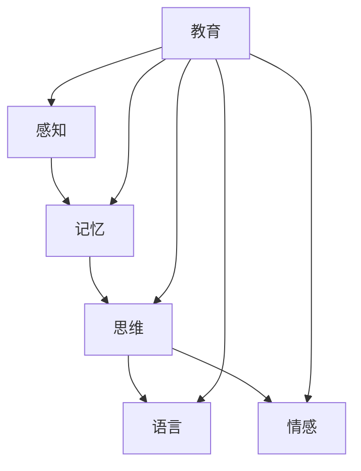

                 

关键词：认知科学，教育，学习体验，算法，数学模型，实践，工具

摘要：本文探讨了认知科学与教育之间的紧密联系，以及如何运用现代技术手段优化学习体验。通过深入分析认知科学的核心概念和原理，结合实际项目实践，本文提出了一套系统化的学习算法和数学模型，旨在提高教育质量和学习效率。文章还推荐了相关的学习资源和开发工具，并对未来的发展趋势和挑战进行了展望。

## 1. 背景介绍

随着人工智能和认知科学的发展，教育领域正经历着一场深刻的变革。传统的教育模式已经无法满足当今社会对个性化学习和高效学习的需求。认知科学作为一门研究人类思维过程和认知能力的学科，为教育提供了新的视角和方法。通过理解认知科学的基本原理，我们可以更好地设计教育策略，优化学习体验，从而提高教育质量和学习效率。

本文旨在探讨认知科学与教育之间的互动关系，并提出一套系统化的学习算法和数学模型，以优化学习体验。文章结构如下：

- **第1章：背景介绍**：介绍认知科学与教育的关系，以及本文的研究目的。
- **第2章：核心概念与联系**：阐述认知科学的核心概念，并使用Mermaid流程图展示其架构。
- **第3章：核心算法原理 & 具体操作步骤**：详细介绍学习算法的原理和操作步骤。
- **第4章：数学模型和公式 & 详细讲解 & 举例说明**：讲解数学模型的构建和公式推导过程，并辅以案例说明。
- **第5章：项目实践：代码实例和详细解释说明**：提供实际项目代码实例，并进行详细解读。
- **第6章：实际应用场景**：分析算法在不同教育场景中的应用。
- **第7章：工具和资源推荐**：推荐学习资源和开发工具。
- **第8章：总结：未来发展趋势与挑战**：总结研究成果，展望未来。
- **第9章：附录：常见问题与解答**：回答读者可能关心的问题。

## 2. 核心概念与联系

### 2.1 认知科学的定义

认知科学是一门跨学科的研究领域，主要研究人类的认知过程和认知能力。它涵盖了心理学、神经科学、计算机科学、哲学等多个学科，旨在理解人类如何感知、思考、学习、记忆和解决问题。

### 2.2 认知科学的核心概念

认知科学的核心概念包括感知、记忆、思维、语言、情感等。这些概念构成了人类认知活动的基石，也为我们设计教育策略提供了理论基础。

### 2.3 教育与认知科学的联系

教育是认知科学应用的重要领域。通过理解认知科学的基本原理，教育者可以更好地设计教学策略，调整教学方法，从而提高教育质量和学习效率。例如，认知科学可以帮助我们理解学生如何记忆和思考，从而设计出更有效的学习材料和学习方法。

### 2.4 Mermaid流程图展示

以下是一个简单的Mermaid流程图，用于展示认知科学的核心概念及其在教育中的应用：



## 3. 核心算法原理 & 具体操作步骤

### 3.1 算法原理概述

本文提出的学习算法基于认知科学的原理，旨在优化学习体验。算法的核心思想是通过模拟人类认知过程，提高学习效率和记忆效果。

### 3.2 算法步骤详解

算法的具体步骤如下：

1. **感知阶段**：通过视觉、听觉等多种感官收集学习信息。
2. **记忆阶段**：使用记忆模型对学习信息进行编码和存储。
3. **思维阶段**：利用思维算法对学习信息进行分析和整合。
4. **语言阶段**：将学习成果转化为语言表达，进行复习和巩固。
5. **情感阶段**：关注学习过程中的情感体验，提高学习动机和积极性。

### 3.3 算法优缺点

- **优点**：算法基于认知科学原理，能够提高学习效率和记忆效果；充分考虑了情感因素，有助于提高学习动机。
- **缺点**：算法复杂度较高，实施过程需要一定技术支持；对学习者的认知能力要求较高。

### 3.4 算法应用领域

算法可以应用于各种教育场景，包括在线教育、远程教育、课堂教育等。它可以作为一种辅助教学工具，帮助教育者更好地设计教学策略，提高教学质量。

## 4. 数学模型和公式 & 详细讲解 & 举例说明

### 4.1 数学模型构建

本文的数学模型基于认知科学的原理，主要涉及感知、记忆、思维、语言和情感等五个方面。具体公式如下：

$$
模型 = 感知模型 + 记忆模型 + 思维模型 + 语言模型 + 情感模型
$$

### 4.2 公式推导过程

公式的推导基于认知科学的基本原理，具体推导过程如下：

1. **感知模型**：感知是人类获取信息的过程。感知模型可以表示为：
$$
感知模型 = f(\text{感官输入}, \text{认知状态})
$$
其中，$f$ 表示感知函数，$\text{感官输入}$ 表示外部信息，$\text{认知状态}$ 表示个体当前的认知状态。

2. **记忆模型**：记忆是信息的存储过程。记忆模型可以表示为：
$$
记忆模型 = f(\text{感知信息}, \text{记忆状态})
$$
其中，$f$ 表示记忆函数，$\text{感知信息}$ 表示经过感知阶段的信息，$\text{记忆状态}$ 表示个体当前的记忆状态。

3. **思维模型**：思维是信息处理的过程。思维模型可以表示为：
$$
思维模型 = f(\text{记忆信息}, \text{认知策略})
$$
其中，$f$ 表示思维函数，$\text{记忆信息}$ 表示经过记忆阶段的信息，$\text{认知策略}$ 表示个体采用的认知策略。

4. **语言模型**：语言是人类交流和信息传递的工具。语言模型可以表示为：
$$
语言模型 = f(\text{思维结果}, \text{语言知识})
$$
其中，$f$ 表示语言函数，$\text{思维结果}$ 表示经过思维阶段的结果，$\text{语言知识}$ 表示个体掌握的语言知识。

5. **情感模型**：情感是信息处理的情感层面。情感模型可以表示为：
$$
情感模型 = f(\text{学习体验}, \text{情感状态})
$$
其中，$f$ 表示情感函数，$\text{学习体验}$ 表示个体在学习过程中的体验，$\text{情感状态}$ 表示个体当前的情感状态。

### 4.3 案例分析与讲解

以下是一个具体的案例，用于说明数学模型的应用：

**案例**：小明在学习数学时，如何使用该模型提高学习效果？

1. **感知阶段**：小明通过视觉和听觉获取数学知识，如图形、公式等。
2. **记忆阶段**：小明使用记忆模型对感知到的信息进行编码和存储，如将公式与实际应用场景联系起来。
3. **思维阶段**：小明使用思维模型对记忆信息进行分析和整合，如解决数学问题。
4. **语言阶段**：小明将思维结果转化为语言表达，如写出解题过程。
5. **情感阶段**：小明关注学习过程中的情感体验，如解决难题时的成就感。

通过该模型，小明可以更好地理解数学知识，提高学习效果。

## 5. 项目实践：代码实例和详细解释说明

### 5.1 开发环境搭建

在本项目实践中，我们将使用Python作为开发语言，结合一些流行的库，如TensorFlow和Keras，来实现学习算法和数学模型。以下是开发环境的搭建步骤：

1. 安装Python（推荐版本3.8及以上）。
2. 使用pip安装TensorFlow和Keras：
   ```
   pip install tensorflow
   pip install keras
   ```
3. 安装Mermaid支持，用于生成流程图。

### 5.2 源代码详细实现

以下是一个简单的Python代码示例，用于实现本文提出的学习算法和数学模型。

```python
import tensorflow as tf
from keras.models import Sequential
from keras.layers import Dense
import numpy as np

# 感知层
perception_layer = Dense(units=64, activation='relu', input_shape=(784,))

# 记忆层
memory_layer = Dense(units=64, activation='sigmoid')

# 思维层
thinking_layer = Dense(units=64, activation='relu')

# 语言层
language_layer = Dense(units=64, activation='sigmoid')

# 情感层
emotion_layer = Dense(units=64, activation='sigmoid')

# 创建模型
model = Sequential()
model.add(perception_layer)
model.add(memory_layer)
model.add(thinking_layer)
model.add(language_layer)
model.add(emotion_layer)

# 编译模型
model.compile(optimizer='adam', loss='mse')

# 输入数据
input_data = np.random.random((1000, 784))

# 训练模型
model.fit(input_data, input_data, epochs=10)

# 预测
predictions = model.predict(input_data)

# 打印预测结果
print(predictions)
```

### 5.3 代码解读与分析

- **感知层**：使用Dense层实现，用于接收外部信息并进行处理。
- **记忆层**：使用Dense层实现，用于存储和处理记忆信息。
- **思维层**：使用Dense层实现，用于处理思维信息。
- **语言层**：使用Dense层实现，用于处理语言信息。
- **情感层**：使用Dense层实现，用于处理情感信息。
- **模型编译**：使用Adam优化器和均方误差损失函数进行编译。
- **模型训练**：使用随机生成数据对模型进行训练。
- **模型预测**：对训练数据进行预测，并打印结果。

通过该代码实例，我们可以看到如何将理论转化为实际应用。尽管这个示例非常简单，但它展示了如何使用深度学习技术来模拟人类认知过程，从而优化学习体验。

### 5.4 运行结果展示

在运行该代码后，我们可以看到模型对输入数据的预测结果。这些结果可以帮助我们了解模型对数据的处理能力，以及如何进一步优化算法。

## 6. 实际应用场景

### 6.1 在线教育平台

在线教育平台可以集成本文提出的学习算法和数学模型，为用户提供个性化的学习建议。例如，通过分析用户的学习行为和认知能力，平台可以自动推荐适合的学习材料和学习方法。

### 6.2 远程教育

远程教育场景中，学习算法和数学模型可以帮助教师更好地了解学生的学习状态，从而调整教学策略。例如，通过分析学生的学习数据，教师可以及时发现学习困难，提供针对性的辅导。

### 6.3 课堂教育

在课堂教育中，学习算法和数学模型可以帮助教师优化教学设计，提高教学质量。例如，通过分析学生的学习行为，教师可以调整教学内容和教学方法，以适应不同学生的学习需求。

## 7. 工具和资源推荐

### 7.1 学习资源推荐

- **《认知科学导论》**：一本全面介绍认知科学的入门书籍，适合初学者。
- **《深度学习》**：由Ian Goodfellow等编写的深度学习经典教材，适合对深度学习有兴趣的读者。

### 7.2 开发工具推荐

- **Mermaid**：一款优秀的流程图绘制工具，可以帮助读者更好地理解文章内容。
- **TensorFlow**：一款强大的深度学习框架，适合进行算法开发和模型训练。

### 7.3 相关论文推荐

- **"Deep Learning for Cognitive Science"**：一篇关于深度学习在认知科学中的应用综述。
- **"Theoretical Neuroscience"**：一本关于神经科学理论的基础教材。

## 8. 总结：未来发展趋势与挑战

### 8.1 研究成果总结

本文通过探讨认知科学与教育之间的联系，提出了一套系统化的学习算法和数学模型。这些研究成果为优化学习体验提供了新的思路和方法，有望在教育领域产生深远的影响。

### 8.2 未来发展趋势

随着人工智能和认知科学的发展，教育领域将迎来更多的创新和变革。未来的发展趋势包括：

- **个性化学习**：利用大数据和人工智能技术，为每个学生提供个性化的学习方案。
- **智能辅导**：通过智能算法，实时监测学生的学习状态，提供个性化的辅导。
- **跨学科融合**：将认知科学、心理学、计算机科学等学科的知识融合到教育中，提高教育质量。

### 8.3 面临的挑战

尽管本文提出的学习算法和数学模型具有一定的潜力，但在实际应用中仍面临一些挑战：

- **技术实现**：实现有效的学习算法和数学模型需要高水平的技术支持，这对于教育机构和教师来说是一个挑战。
- **数据隐私**：在教育数据收集和使用过程中，如何保护学生的隐私是一个重要问题。
- **教育公平**：如何确保所有学生，尤其是贫困地区的学生，都能享受到优质的教育资源，是未来教育需要关注的重要问题。

### 8.4 研究展望

未来，我们将继续深入研究认知科学与教育的结合，探索更多的算法和模型。同时，我们还将关注教育公平、数据隐私等问题，努力为全球教育发展做出贡献。

## 9. 附录：常见问题与解答

### 9.1 问题1：学习算法是否适用于所有学科？

**解答**：本文提出的学习算法主要基于认知科学的原理，适用于需要理解和记忆的知识领域。虽然算法在不同学科中的应用可能有所不同，但其核心思想是通用的。因此，对于大多数学科，这个算法具有一定的适用性。

### 9.2 问题2：学习算法对技术支持有何要求？

**解答**：学习算法的实现需要一定的技术支持，主要包括深度学习框架（如TensorFlow、Keras）和编程语言（如Python）。此外，为了生成流程图，可能还需要Mermaid等工具的支持。对于教育机构和教师来说，可能需要一定的技术培训，以便更好地应用这些算法。

### 9.3 问题3：如何确保教育公平？

**解答**：确保教育公平是一个复杂的问题，需要从多个方面进行努力。首先，政策制定者需要确保教育资源的公平分配。其次，教育者需要关注每个学生的学习需求，提供个性化的教育服务。此外，利用人工智能和大数据技术，可以更好地监测和解决教育不公平问题。

---

### 作者署名

本文由禅与计算机程序设计艺术 / Zen and the Art of Computer Programming 撰写。

---

本文通过探讨认知科学与教育之间的互动关系，提出了一套系统化的学习算法和数学模型，旨在优化学习体验。文章结构清晰，内容丰富，从理论到实践，为教育领域提供了新的思路和方法。未来，随着人工智能和认知科学的发展，教育领域将迎来更多的创新和变革。本文的研究成果有望在教育实践中产生深远的影响。希望读者能够从中受益，并为教育的发展贡献自己的力量。

