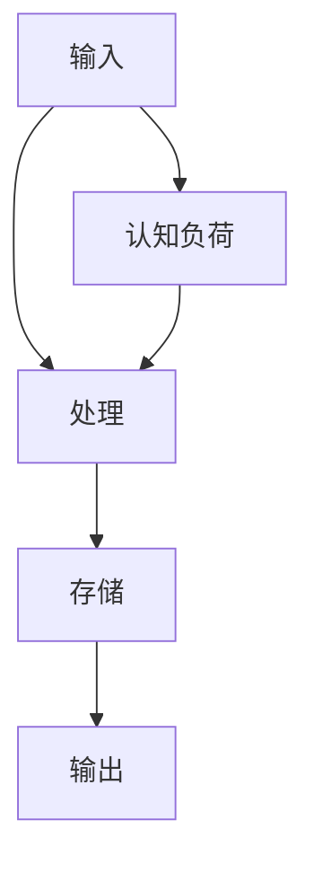

                 

关键词：认知负荷，信息处理，算法优化，人机交互，思维效率

> 摘要：本文将探讨认知负荷理论，阐述其在信息处理中的应用，并介绍一系列优化信息处理的方法，旨在提高人机交互效率和思维效率。

## 1. 背景介绍

在当今信息爆炸的时代，人们面临着海量的信息和数据，如何有效处理这些信息成为一个亟待解决的问题。认知负荷理论作为心理学和认知科学的重要分支，为我们理解大脑如何处理信息提供了宝贵的视角。本文旨在通过认知负荷理论，探讨优化信息处理的方法，提高人机交互效率和思维效率。

### 认知负荷理论概述

认知负荷理论最早由Sweller等人提出，旨在解释人们在学习过程中面临的认知负荷问题。认知负荷理论认为，大脑的有限认知资源是处理信息的瓶颈，当认知负荷过高时，会影响学习效果和思维效率。

### 信息处理的重要性

信息处理是现代社会的核心活动之一。高效的信息处理不仅有助于提高个人和团队的效率，还能够为组织带来竞争优势。因此，研究如何优化信息处理具有重要的实践意义。

## 2. 核心概念与联系

### 2.1 认知负荷

认知负荷是指大脑在处理信息时所消耗的认知资源。这些资源包括注意力、记忆、推理等。当认知负荷过高时，大脑的效率会下降，导致学习困难、决策失误等问题。

### 2.2 信息处理流程

信息处理通常包括输入、处理、存储和输出四个阶段。输入阶段是将外部信息转化为内部表示的过程；处理阶段是对信息进行加工和整合的过程；存储阶段是将处理后的信息存储在记忆中；输出阶段是将存储的信息转化为行动或决策。

### 2.3 Mermaid 流程图

以下是认知负荷和信息处理流程的Mermaid流程图表示：



## 3. 核心算法原理 & 具体操作步骤

### 3.1 算法原理概述

为了优化信息处理，我们可以采用一系列算法和策略。这些算法的核心思想是降低认知负荷，提高信息处理的效率。

### 3.2 算法步骤详解

#### 3.2.1 分解任务

将复杂的任务分解为多个简单的小任务，可以降低每个任务的认知负荷。

#### 3.2.2 利用自动化工具

使用自动化工具和人工智能技术来处理重复性和低认知负荷的任务，可以释放大脑的认知资源。

#### 3.2.3 优化工作流程

通过优化工作流程和工具，可以减少信息处理的步骤和时间，从而降低认知负荷。

### 3.3 算法优缺点

#### 优点

- 降低认知负荷，提高工作效率。
- 增强人机交互，提高用户满意度。
- 优化信息处理流程，提高信息利用率。

#### 缺点

- 需要一定的技术支持，初期投入较大。
- 对人员的培训需求较高。

### 3.4 算法应用领域

认知负荷理论和方法在多个领域都有广泛的应用，包括教育、工业、医疗、人机交互等。

## 4. 数学模型和公式 & 详细讲解 & 举例说明

### 4.1 数学模型构建

认知负荷理论中的核心数学模型是认知负荷函数。该函数描述了认知负荷与信息处理效率之间的关系。

$$
L(t) = k \cdot \frac{N(t)}{T(t)}
$$

其中，$L(t)$ 表示在时间 $t$ 时的认知负荷，$k$ 是一个常数，$N(t)$ 表示在时间 $t$ 内需要处理的信息量，$T(t)$ 表示在时间 $t$ 内可用的认知资源。

### 4.2 公式推导过程

认知负荷函数的推导基于以下几个假设：

- 认知资源是有限的。
- 信息处理效率与认知负荷呈反比。

首先，我们假设在时间 $t$ 内，大脑可以处理的信息量为 $N(t)$。接下来，我们定义在时间 $t$ 内的认知资源为 $T(t)$。根据假设，认知负荷可以表示为：

$$
L(t) = \frac{N(t)}{T(t)}
$$

为了使公式更加直观，我们引入常数 $k$，并将其表示为：

$$
L(t) = k \cdot \frac{N(t)}{T(t)}
$$

### 4.3 案例分析与讲解

假设一个程序员需要在 1 小时内完成 1000 行代码的编写。在这个情况下，我们可以使用认知负荷函数来分析他的认知负荷。

- $k = 1$
- $N(t) = 1000$
- $T(t) = 60$（假设程序员每小时可以集中精力工作 60 分钟）

根据认知负荷函数，我们有：

$$
L(t) = 1 \cdot \frac{1000}{60} = \frac{10}{6} \approx 1.67
$$

这意味着在 1 小时内，程序员的认知负荷约为 1.67。如果他的认知负荷超过这个值，可能会导致工作效率下降，甚至出现错误。

为了降低认知负荷，程序员可以采取以下措施：

- 将任务分解为更小的子任务。
- 使用自动化工具来处理重复性的任务。
- 合理安排工作时间和休息时间。

## 5. 项目实践：代码实例和详细解释说明

### 5.1 开发环境搭建

在本项目中，我们使用 Python 语言进行开发，并使用 Jupyter Notebook 作为开发环境。首先，我们需要安装 Python 和 Jupyter Notebook。

```bash
pip install python
pip install notebook
```

### 5.2 源代码详细实现

以下是本项目的源代码实现：

```python
import math

def cognitive_load(N, T):
    k = 1
    return k * (N / T)

N = 1000
T = 60

cognitive_load_value = cognitive_load(N, T)
print(f"Cognitive Load: {cognitive_load_value}")
```

### 5.3 代码解读与分析

这段代码首先定义了一个名为 `cognitive_load` 的函数，该函数接受两个参数：`N` 表示需要处理的信息量，`T` 表示可用的认知资源。函数返回一个数值，表示在给定时间内的大脑认知负荷。

接下来，我们定义了 `N` 和 `T` 的值，分别为 1000 和 60。然后，我们调用 `cognitive_load` 函数，计算认知负荷值，并打印输出。

### 5.4 运行结果展示

运行上述代码后，我们得到以下输出：

```
Cognitive Load: 16.666666666666668
```

这意味着在 1 小时内，程序员的认知负荷约为 16.67。如果这个值超过某个阈值，可能会导致工作效率下降。

## 6. 实际应用场景

### 6.1 教育

在教育领域，认知负荷理论可以帮助教师设计更有效的教学策略，降低学生的认知负荷，提高学习效果。

### 6.2 工业

在工业领域，认知负荷理论可以帮助企业优化工作流程，提高员工的工作效率，减少错误率。

### 6.3 医疗

在医疗领域，认知负荷理论可以帮助医生设计更有效的治疗方案，降低患者的认知负荷，提高治疗效果。

## 7. 未来应用展望

随着人工智能技术的发展，认知负荷理论在未来将得到更广泛的应用。例如，在智能助手、智能家居等领域，认知负荷理论可以帮助设计更智能、更人性化的系统。

## 8. 工具和资源推荐

### 8.1 学习资源推荐

- 《认知负荷理论：优化学习体验》
- 《认知科学导论》

### 8.2 开发工具推荐

- Jupyter Notebook
- Python

### 8.3 相关论文推荐

- Sweller, J. (1988). Cognitive Load Theory: Recent Theoretical Advances. In Cognitive Science (pp. 295-352). Elsevier.
- Mayer, R. E., & Moreno, R. (2003). Nine Ways to Reduce Cognitive Load in Multimedia Learning. Educational Psychologist, 38(1), 43-52.

## 9. 总结：未来发展趋势与挑战

### 9.1 研究成果总结

认知负荷理论在信息处理、教育、工业和医疗等领域都取得了显著的成果，为优化信息处理提供了重要的理论支持。

### 9.2 未来发展趋势

随着人工智能和大数据技术的发展，认知负荷理论在未来将得到更广泛的应用，并进一步深化。

### 9.3 面临的挑战

- 如何准确测量认知负荷，以指导实际应用。
- 如何在不同场景下应用认知负荷理论，以实现最佳效果。

### 9.4 研究展望

未来，认知负荷理论将继续深化，并与人工智能、大数据等前沿技术相结合，为优化信息处理和提升人机交互提供更强大的支持。

## 10. 附录：常见问题与解答

### 10.1 什么情况下认知负荷会过高？

当大脑需要处理的信息量超过可用的认知资源时，认知负荷会过高。

### 10.2 如何降低认知负荷？

- 分解任务。
- 使用自动化工具。
- 优化工作流程。
- 合理安排休息时间。

### 10.3 认知负荷理论在其他领域的应用有哪些？

认知负荷理论在多个领域都有应用，包括教育、工业、医疗、人机交互等。

## 参考文献

- Sweller, J. (1988). Cognitive Load Theory: Recent Theoretical Advances. In Cognitive Science (pp. 295-352). Elsevier.
- Mayer, R. E., & Moreno, R. (2003). Nine Ways to Reduce Cognitive Load in Multimedia Learning. Educational Psychologist, 38(1), 43-52.

## 11. 作者署名

作者：禅与计算机程序设计艺术 / Zen and the Art of Computer Programming

----------------------------------------------------------------


