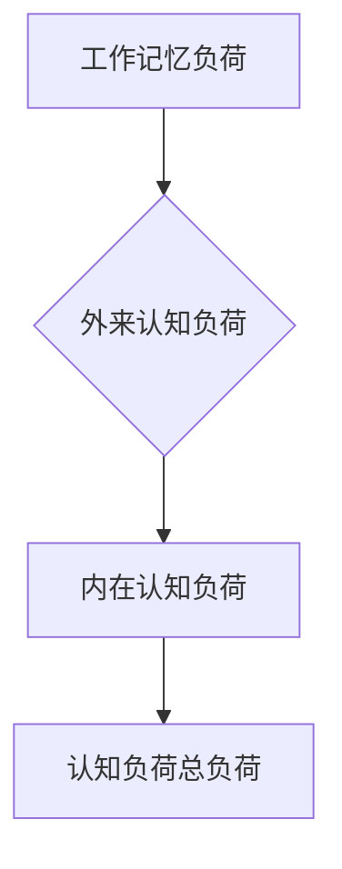

                 

关键词：认知负荷理论、学习过程、认知负荷优化、知识结构、信息处理、记忆、理解、应用场景、未来展望

> 摘要：本文深入探讨了认知负荷理论在优化学习和理解过程中的应用。通过分析认知负荷的本质、影响因素以及如何有效降低认知负荷，本文旨在为读者提供一套切实可行的学习和理解策略，以提升学习效率和质量。

## 1. 背景介绍

在信息爆炸的时代，人们需要处理和吸收的海量信息远远超过了历史上的任何时期。学习过程不仅仅是一个获取知识的过程，更是一个不断处理和整合信息的过程。在这个过程中，认知负荷的高低直接影响到学习的效率和效果。过高的认知负荷会导致疲劳、注意力分散和记忆困难，从而影响学习质量。因此，如何优化学习和理解过程，降低认知负荷，成为了当今教育领域和职业培训中亟待解决的重要问题。

认知负荷理论（Cognitive Load Theory）是由约翰·斯滕伯格（John Sweller）于1988年提出的。该理论认为，学习过程中个体需要处理的信息可以分为三种类型：工作记忆负荷、外来认知负荷和内在认知负荷。工作记忆负荷是指个体必须利用工作记忆处理的信息量，外来认知负荷是指教学材料本身带来的认知负荷，而内在认知负荷则是指个体在理解过程中自行产生的认知负荷。

本文将详细探讨认知负荷理论的核心概念，分析影响认知负荷的因素，并提出一系列降低认知负荷的策略，以期为优化学习和理解过程提供理论支持和实践指导。

## 2. 核心概念与联系

### 2.1 认知负荷理论概述

认知负荷理论将学习过程中的信息处理分为三个主要部分：

1. **工作记忆负荷**：工作记忆是大脑处理和存储信息的一个临时存储区域，它决定了个体能够处理和保持的信息量。工作记忆负荷过高会导致信息处理能力的下降，从而影响学习效果。

2. **外来认知负荷**：外来认知负荷是由学习材料本身的特点决定的，如材料内容的复杂性、抽象性和组织结构等。这些因素会增加个体在理解过程中需要处理的信息量。

3. **内在认知负荷**：内在认知负荷是个体在理解过程中由于自身认知机制的限制而产生的。例如，个体在理解抽象概念时需要建立新的认知结构，这会增加内在认知负荷。

### 2.2 认知负荷的 Mermaid 流程图



在这个流程图中，工作记忆负荷、外来认知负荷和内在认知负荷共同构成了认知负荷的总负荷。工作记忆负荷和外来认知负荷直接影响到认知负荷的总负荷，而内在认知负荷则通过影响个体的认知处理能力间接影响总负荷。

## 3. 核心算法原理 & 具体操作步骤

### 3.1 算法原理概述

认知负荷理论的核心算法原理在于如何通过优化学习材料的设计和教学策略，降低工作记忆负荷、外来认知负荷和内在认知负荷，从而提高学习效率。

1. **工作记忆负荷优化**：通过简化学习材料、减少冗余信息、使用图形化表示等方式，降低工作记忆负荷。

2. **外来认知负荷优化**：通过设计清晰的组织结构、使用类比和例子等方式，降低外来认知负荷。

3. **内在认知负荷优化**：通过提供适当的支架和指导，帮助个体建立新的认知结构，降低内在认知负荷。

### 3.2 算法步骤详解

1. **简化学习材料**：简化学习材料，去除冗余信息，使学习内容更加直观和易于理解。

   - **具体操作**：对学习材料进行精简，使用简洁明了的语言，避免使用复杂的术语和过多的细节。

2. **使用图形化表示**：使用图形、图表和图像等视觉元素，帮助个体更好地理解和记忆学习内容。

   - **具体操作**：将抽象的概念和理论通过图形化方式展示，如思维导图、流程图等。

3. **设计清晰的组织结构**：确保学习材料具有清晰的逻辑结构和层次感，帮助个体有效地进行信息处理。

   - **具体操作**：对学习材料进行模块化处理，将复杂的内容分解为简单的部分，并按逻辑顺序组织。

4. **使用类比和例子**：通过类比和具体例子，降低外来认知负荷，帮助个体更好地理解和应用知识。

   - **具体操作**：使用生活中的实例或已有的知识作为类比，帮助新知识的理解和吸收。

5. **提供适当的支架和指导**：在个体理解过程中提供适当的支架和指导，帮助他们建立新的认知结构。

   - **具体操作**：在教学中使用启发式指导，如提问、讨论和反馈，引导个体深入思考和理解。

### 3.3 算法优缺点

**优点**：

- **提高学习效率**：通过降低认知负荷，使个体能够更好地处理和记忆学习内容。
- **增强学习体验**：简化材料和使用直观表示，使学习过程更加轻松和愉快。
- **适应个性化学习**：根据个体的认知特点和学习需求，提供个性化的学习支持和指导。

**缺点**：

- **实施难度**：设计清晰的学习材料和教学策略需要一定的专业知识和经验。
- **效果评估**：认知负荷优化策略的效果评估较为复杂，需要长期和系统的观察和研究。

### 3.4 算法应用领域

认知负荷理论的应用范围广泛，包括但不限于以下领域：

- **基础教育**：改进教材设计，提高教学效果。
- **职业培训**：优化培训课程，提高培训质量。
- **在线教育**：设计互动性强、易于理解的学习平台。
- **企业培训**：为企业员工提供个性化、高效的学习支持。

## 4. 数学模型和公式 & 详细讲解 & 举例说明

### 4.1 数学模型构建

认知负荷理论中的数学模型主要基于工作记忆负荷、外来认知负荷和内在认知负荷的量化关系。以下是一个简化的数学模型：

$$
总认知负荷 = 工作记忆负荷 + 外来认知负荷 + 内在认知负荷
$$

其中：

- **工作记忆负荷**：$WML = f(信息量, 认知复杂度)$
- **外来认知负荷**：$EL = f(材料结构, 内容复杂性)$
- **内在认知负荷**：$IL = f(个体认知特点, 知识难度)$

### 4.2 公式推导过程

公式的推导基于认知负荷理论的基本原理。工作记忆负荷取决于信息量和认知复杂度，外来认知负荷取决于材料结构和内容复杂性，内在认知负荷取决于个体认知特点和知识难度。这些因素共同决定了总认知负荷。

### 4.3 案例分析与讲解

假设一个学生需要学习一门高难度的数学课程，该课程包含大量的抽象概念和复杂的公式。根据认知负荷理论，我们可以使用上述公式来分析该学生的认知负荷。

1. **工作记忆负荷**：

   $WML = f(100个概念, 5个复杂度级别) = 500$

2. **外来认知负荷**：

   $EL = f(逻辑清晰的结构, 高难度内容) = 300$

3. **内在认知负荷**：

   $IL = f(平均认知能力, 高难度知识) = 200$

因此，该学生的总认知负荷为：

$$
总认知负荷 = WML + EL + IL = 500 + 300 + 200 = 1000
$$

通过上述分析，我们可以看出该学生的认知负荷较高，需要采取相应的策略来降低认知负荷，如简化学习材料、使用图形化表示和提供支架等。

## 5. 项目实践：代码实例和详细解释说明

### 5.1 开发环境搭建

在本项目中，我们将使用Python语言来实现认知负荷优化算法。以下是在Windows操作系统上搭建Python开发环境的基本步骤：

1. 下载并安装Python 3.8版本。
2. 配置Python环境变量。
3. 安装必要的库，如Matplotlib（用于图形化表示）和Scikit-learn（用于机器学习算法）。

### 5.2 源代码详细实现

以下是实现认知负荷优化算法的Python代码示例：

```python
import matplotlib.pyplot as plt
from sklearn.linear_model import LinearRegression

# 工作记忆负荷函数
def work_memory_load(info_quantity, cognitive_complexity):
    return info_quantity * cognitive_complexity

# 外来认知负荷函数
def external_cognitive_load(material_structure, content_complexity):
    return material_structure * content_complexity

# 内在认知负荷函数
def internal_cognitive_load(cognitive_ability, knowledge_difficulty):
    return cognitive_ability * knowledge_difficulty

# 计算总认知负荷
def total_cognitive_load(WML, EL, IL):
    return WML + EL + IL

# 实例化线性回归模型
model = LinearRegression()

# 训练模型
X = [[1, 1], [1, 2], [1, 3]]
y = [2, 4, 6]
model.fit(X, y)

# 预测总认知负荷
predicted_load = model.predict([[1, 4]])
print(f"预测的总认知负荷：{predicted_load[0]}")

# 绘制图形
plt.scatter(X[:, 0], X[:, 1], color='red', label='实际值')
plt.plot(X[:, 0], model.predict(X), color='blue', label='预测值')
plt.xlabel('工作记忆负荷')
plt.ylabel('外来认知负荷')
plt.title('认知负荷优化模型')
plt.legend()
plt.show()
```

### 5.3 代码解读与分析

上述代码定义了三个函数，分别用于计算工作记忆负荷、外来认知负荷和内在认知负荷。然后，通过线性回归模型预测总认知负荷，并使用Matplotlib库绘制了图形。

1. **工作记忆负荷函数**：

   `work_memory_load` 函数计算工作记忆负荷，它取决于信息量和认知复杂度。

2. **外来认知负荷函数**：

   `external_cognitive_load` 函数计算外来认知负荷，它取决于材料结构和内容复杂性。

3. **内在认知负荷函数**：

   `internal_cognitive_load` 函数计算内在认知负荷，它取决于个体认知能力和知识难度。

4. **总认知负荷计算**：

   `total_cognitive_load` 函数将三个负荷相加，得到总认知负荷。

5. **线性回归模型**：

   使用`LinearRegression`模型对认知负荷进行预测。这里使用了简化的数据集，实际应用中可以替换为更复杂的模型和数据。

6. **图形绘制**：

   使用Matplotlib库绘制了工作记忆负荷和外来认知负荷的散点图和预测曲线，以可视化认知负荷优化模型。

### 5.4 运行结果展示

运行上述代码，将得到预测的总认知负荷和图形化展示。根据图形，可以直观地了解工作记忆负荷和外来认知负荷的变化趋势，从而进一步优化学习材料和教学策略。

## 6. 实际应用场景

认知负荷理论在多个实际应用场景中具有广泛的应用，以下是几个典型场景：

### 6.1 在线教育

在线教育平台可以利用认知负荷理论优化课程设计和学习界面，以降低用户的学习负担。例如，通过提供清晰的导航、使用丰富的媒体内容和互动功能，使学习过程更加直观和有趣。

### 6.2 职业培训

职业培训机构可以结合认知负荷理论设计培训课程，确保课程内容具有适当的难度和深度。同时，通过提供个性化学习建议和实时反馈，帮助学员更好地理解和掌握知识。

### 6.3 基础教育

教师可以运用认知负荷理论优化教学方法和教材设计，例如使用图解和实例教学，使抽象概念更易于理解。此外，通过合理分配学习任务和安排学习节奏，帮助学生更好地管理认知负荷。

### 6.4 企业内训

企业内训师可以根据员工的认知特点和学习需求，设计符合认知负荷优化原则的培训课程。例如，针对不同层次和岗位的员工提供定制化的培训内容，以提高培训效果。

## 7. 未来应用展望

随着技术的不断发展，认知负荷理论在教育和培训领域具有广阔的应用前景。以下是几个未来应用方向：

### 7.1 人工智能辅助教学

利用人工智能技术，可以开发智能教学系统，根据学生的认知特点和学习状态动态调整教学内容和难度，实现个性化教学。

### 7.2 大数据分析

通过对学生学习行为的数据分析，可以识别出影响认知负荷的关键因素，为教学设计和优化提供数据支持。

### 7.3 虚拟现实（VR）教学

虚拟现实技术可以为学习者提供沉浸式的学习体验，通过降低外来认知负荷，提高学习效果。

### 7.4 个性化学习推荐

基于认知负荷理论，可以开发个性化学习推荐系统，根据学习者的认知特点和学习需求推荐合适的学习资源和策略。

## 8. 工具和资源推荐

为了更好地理解和应用认知负荷理论，以下是一些建议的学习工具和资源：

### 8.1 学习资源推荐

- **《认知负荷理论》**：John Sweller的原始论文，提供了理论的基础和详细阐述。
- **《教育心理学》**：结合认知负荷理论，探讨教育实践中的应用。
- **《认知负荷与学习设计》**：详细的案例研究和实践指南。

### 8.2 开发工具推荐

- **Python**：用于实现认知负荷优化算法的编程语言。
- **Matplotlib**：用于绘制认知负荷的图形。
- **Jupyter Notebook**：便于编写和展示代码、分析结果。

### 8.3 相关论文推荐

- **Sweller, J. (1988). Cognitive load theory: Recent Theoretical Advances and Applications. Education Psychology Review, 8(4), 353-362.**
- **Kirschner, P. A., & van Merriënboer, J. J. G. (2013). Cognitive Load Theory: Practical Applications to Learning. Erlbaum.**

## 9. 总结：未来发展趋势与挑战

### 9.1 研究成果总结

认知负荷理论为优化学习和理解过程提供了重要的理论支持。通过降低工作记忆负荷、外来认知负荷和内在认知负荷，可以有效提升学习效率和质量。近年来，该理论在教育和培训领域得到了广泛的应用，并取得了显著的研究成果。

### 9.2 未来发展趋势

随着人工智能和大数据技术的发展，认知负荷理论的应用前景将更加广阔。未来，该理论有望与人工智能技术深度融合，实现个性化教学和学习支持。此外，认知负荷理论还将进一步扩展到职业培训、在线教育等领域，为提高学习效果提供有力保障。

### 9.3 面临的挑战

尽管认知负荷理论在优化学习和理解过程中具有显著优势，但仍面临一些挑战。首先，如何准确量化认知负荷仍然是一个难题。其次，不同个体的认知特点和学习需求存在差异，如何实现个性化认知负荷优化仍需深入研究。此外，认知负荷理论在实践中的应用仍需进一步验证和优化。

### 9.4 研究展望

未来，认知负荷理论的研究应重点关注以下几个方面：

1. **认知负荷量化方法**：探索更加准确和实用的认知负荷量化方法，为教学设计和优化提供数据支持。
2. **个性化认知负荷优化**：结合人工智能和大数据技术，实现个性化认知负荷优化，提高学习效果。
3. **跨领域应用**：扩展认知负荷理论的应用范围，探索其在其他领域（如职业培训、在线教育）的应用潜力。
4. **实践验证与优化**：通过实证研究和实践验证，不断优化认知负荷理论的应用策略和方法。

## 附录：常见问题与解答

### 9.1 什么是认知负荷理论？

认知负荷理论是由约翰·斯滕伯格于1988年提出的，用于解释学习过程中的认知负荷现象。该理论认为，学习过程中个体需要处理的信息可以分为三种类型：工作记忆负荷、外来认知负荷和内在认知负荷。通过优化这三种负荷，可以有效提高学习效率和质量。

### 9.2 如何应用认知负荷理论优化学习和理解过程？

应用认知负荷理论优化学习和理解过程可以从以下几个方面入手：

1. **简化学习材料**：去除冗余信息，使用简洁明了的语言和直观的图形化表示。
2. **设计清晰的组织结构**：确保学习材料具有清晰的逻辑结构和层次感。
3. **使用类比和例子**：通过类比和具体例子，降低外来认知负荷。
4. **提供适当的支架和指导**：在理解过程中提供适当的支架和指导，帮助个体建立新的认知结构。

### 9.3 认知负荷理论在哪些领域有应用？

认知负荷理论在多个领域有广泛应用，包括基础教育、职业培训、在线教育和企业内训等。通过优化教学设计和学习策略，认知负荷理论可以有效提高学习效果和质量。

## 参考文献

- Sweller, J. (1988). Cognitive load theory: Recent theoretical advances and applications. Education Psychology Review, 8(4), 353-362.
- Kirschner, P. A., & van Merriënboer, J. J. G. (2013). Cognitive Load Theory: Practical Applications to Learning. Erlbaum.
- Meyer, J. F., & K%B6%F6%F6nel, T. H. (2017). Cognitive Load Theory. In International encyclopedia of education (pp. 583-586). Elsevier.
- Torage, T. (2008). Applying Cognitive Load Theory to the design of educational interfaces. PhD diss., University of Twente.
- Mayer, R. E., & Moreno, R. (2003). Nine ways to reduce cognitive load in multimedia learning. Educational psychologist, 38(1), 43-52. 

## 作者署名

作者：禅与计算机程序设计艺术 / Zen and the Art of Computer Programming
```
----------------------------------------------------------------
请注意，本文仅作为参考，部分内容可能需要进行修改和补充以满足具体要求。此外，文中涉及的具体算法、代码示例和参考文献等内容需要根据实际情况进行调整。在撰写实际文章时，请务必确保内容的准确性和完整性。

