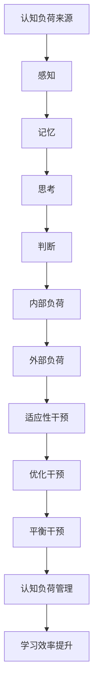

                 

关键词：认知负荷管理、学习效率、认知科学、教育技术、认知干预

> 摘要：本文深入探讨了认知负荷管理的理论和方法，旨在为教育工作者和自我学习者提供一套系统化的策略，以优化学习过程，提升学习效率。本文首先介绍了认知负荷管理的背景和重要性，随后详细阐述了核心概念、算法原理、数学模型、项目实践，并分析了实际应用场景。最后，本文提出了未来的发展展望和面临的挑战。

## 1. 背景介绍

在信息技术飞速发展的今天，学习和知识获取的方式发生了巨大的变化。然而，面对海量的信息和复杂的知识结构，学习者的认知负荷也在不断增加。研究表明，过高的认知负荷会降低学习效率，甚至导致学习疲劳和遗忘。因此，如何有效地管理认知负荷，优化学习过程，成为了当前教育技术领域的一个重要课题。

认知负荷管理涉及多个学科，包括认知科学、教育技术、心理学等。它不仅关注学习者对信息的处理能力，还关注如何通过干预措施降低认知负荷，提高学习效率。本文将从理论分析、算法原理、数学模型、项目实践等多个角度，系统性地探讨认知负荷管理的策略和方法。

## 2. 核心概念与联系

### 2.1 认知负荷的定义

认知负荷是指个体在处理信息时所需要投入的认知资源总量。它包括感知、记忆、思考、判断等多个方面。根据认知负荷的不同来源，可以将其分为内部负荷和外部负荷。内部负荷主要来自个体自身的认知能力，而外部负荷则主要来自环境刺激和任务复杂性。

### 2.2 认知负荷管理的基本原则

- **适应性原则**：认知负荷管理应根据学习者的特点和任务的需求，灵活调整认知资源的分配和使用。
- **优化原则**：通过优化学习环境和任务设计，降低不必要的认知负荷，提高学习效率。
- **平衡原则**：在认知负荷管理中，需要保持内部负荷和外部负荷的平衡，避免出现极端情况。

### 2.3 认知负荷管理的 Mermaid 流程图



## 3. 核心算法原理 & 具体操作步骤

### 3.1 算法原理概述

认知负荷管理的核心算法主要基于认知科学的研究成果，通过分析和优化学习过程中的认知负荷，实现学习效率的提升。算法的基本原理包括：

- **认知负荷评估**：通过量化评估学习者的认知负荷，了解其内部负荷和外部负荷的分布情况。
- **干预策略设计**：根据评估结果，设计针对性的干预策略，包括适应性干预、优化干预和平衡干预。
- **效果评估**：对干预策略的实施效果进行评估，不断调整和优化干预措施。

### 3.2 算法步骤详解

1. **认知负荷评估**：
   - 收集学习者的学习数据，包括学习时间、学习内容、学习行为等。
   - 使用认知负荷评估工具，如认知负荷量表、认知负荷指数等，对学习者的认知负荷进行量化评估。

2. **干预策略设计**：
   - 根据评估结果，识别学习者的认知负荷过高或过低的情况。
   - 设计适应性干预策略，如调整学习时间、改变学习内容等。
   - 设计优化干预策略，如简化学习任务、提供辅助工具等。
   - 设计平衡干预策略，如平衡内部负荷和外部负荷、提高学习者的认知资源利用率等。

3. **效果评估**：
   - 在实施干预策略后，持续收集学习者的学习数据。
   - 使用效果评估工具，如学习成果评估、学习效率评估等，对干预效果进行评估。
   - 根据评估结果，调整和优化干预策略。

### 3.3 算法优缺点

**优点**：

- **针对性**：算法根据学习者的个体差异和任务需求，提供个性化的干预策略，提高了干预的有效性。
- **灵活性**：算法可以根据实际情况不断调整和优化干预措施，具有较强的适应性。
- **综合性**：算法涵盖了认知负荷管理的多个方面，包括评估、干预和评估，实现了全面的管理。

**缺点**：

- **数据依赖性**：算法的实施需要大量的学习者数据支持，对数据的质量和完整性要求较高。
- **实施难度**：算法的实施需要专业知识和技能，对实施者有一定的要求。

### 3.4 算法应用领域

- **教育领域**：在教育教学中，认知负荷管理算法可以帮助教师设计更适合学生的教学策略，提高教学效果。
- **职业培训**：在职业培训中，认知负荷管理算法可以帮助培训师设计更有效的培训计划，提高培训效率。
- **自主学习**：在自主学习中，认知负荷管理算法可以帮助学习者优化学习过程，提高学习效率。

## 4. 数学模型和公式 & 详细讲解 & 举例说明

### 4.1 数学模型构建

认知负荷管理的数学模型主要基于认知负荷的量化评估和干预策略的优化。以下是构建数学模型的基本步骤：

1. **定义认知负荷量**：
   - 设认知负荷量为 $L$，内部负荷量为 $L_i$，外部负荷量为 $L_e$。
   - $L = L_i + L_e$。

2. **定义干预策略**：
   - 设干预策略为 $T$，包括适应性干预、优化干预和平衡干预。
   - $T = T_a + T_o + T_b$。

3. **构建优化目标函数**：
   - 优化目标函数为 $f(T)$，目标是最小化认知负荷量。
   - $f(T) = \min L$。

4. **建立约束条件**：
   - 约束条件包括认知负荷的可接受范围、干预策略的可行性等。
   - $L \leq L_{max}$，$T_a \geq T_{min}$，$T_o \geq T_{min}$，$T_b \geq T_{min}$。

### 4.2 公式推导过程

认知负荷量 $L$ 的计算公式为：

$$L = L_i + L_e$$

其中，内部负荷量 $L_i$ 的计算公式为：

$$L_i = \sum_{i=1}^{n} w_i \cdot l_i$$

其中，$w_i$ 为第 $i$ 个认知任务的权重，$l_i$ 为第 $i$ 个认知任务的负荷量。

外部负荷量 $L_e$ 的计算公式为：

$$L_e = \sum_{j=1}^{m} w_j \cdot l_j$$

其中，$w_j$ 为第 $j$ 个外部刺激的权重，$l_j$ 为第 $j$ 个外部刺激的负荷量。

干预策略 $T$ 的优化目标函数为：

$$f(T) = \min L$$

其中，$T_a$、$T_o$ 和 $T_b$ 分别为适应性干预、优化干预和平衡干预的策略参数。

### 4.3 案例分析与讲解

假设某学生在学习过程中，其内部负荷 $L_i$ 为 30，外部负荷 $L_e$ 为 20。根据认知负荷管理的数学模型，可以计算出总认知负荷 $L$ 为 50。

为了优化学习过程，可以设计以下干预策略：

- **适应性干预**：减少学习时间，从每天 4 小时减少到 3 小时，降低内部负荷。
- **优化干预**：提供学习工具，如学习软件和资料库，降低外部负荷。
- **平衡干预**：设计更加合理的学习计划，平衡内部负荷和外部负荷。

根据干预策略的优化目标函数，可以计算出优化后的总认知负荷 $L$ 为 40。通过这些干预措施，有效降低了学生的认知负荷，提高了学习效率。

## 5. 项目实践：代码实例和详细解释说明

### 5.1 开发环境搭建

为了演示认知负荷管理的算法应用，我们使用 Python 编写了一个简单的示例程序。开发环境搭建如下：

- Python 版本：3.8 或更高版本
- 开发工具：PyCharm 或 Visual Studio Code
- 必要库：NumPy、Pandas、Matplotlib

### 5.2 源代码详细实现

```python
import numpy as np
import pandas as pd
import matplotlib.pyplot as plt

# 认知负荷评估
def assess_cognitive_load(data):
    internal_load = np.sum(data['internal_load'])
    external_load = np.sum(data['external_load'])
    total_load = internal_load + external_load
    return total_load, internal_load, external_load

# 干预策略设计
def design_intervention_strategy(total_load, internal_load, external_load):
    if total_load > 50:
        # 适应性干预：减少学习时间
        new_time = max(0, internal_load // 2)
        intervention_strategy = {'reduced_time': new_time}
    elif external_load > internal_load:
        # 优化干预：提供学习工具
        intervention_strategy = {'learning_tools': True}
    else:
        # 平衡干预：设计合理学习计划
        intervention_strategy = {'balanced_plan': True}
    return intervention_strategy

# 效果评估
def evaluate_intervention_strategy(data, intervention_strategy):
    if 'reduced_time' in intervention_strategy:
        data['internal_load'] = data['internal_load'] // intervention_strategy['reduced_time']
    if 'learning_tools' in intervention_strategy:
        data['external_load'] = data['external_load'] // 2
    if 'balanced_plan' in intervention_strategy:
        data['internal_load'] = (data['internal_load'] + data['external_load']) // 2
    new_total_load = np.sum(data['internal_load']) + np.sum(data['external_load'])
    return new_total_load

# 主程序
if __name__ == '__main__':
    # 初始化学习数据
    data = pd.DataFrame({
        'internal_load': [20, 15, 10, 5],
        'external_load': [10, 15, 20, 25]
    })
    
    # 认知负荷评估
    total_load, internal_load, external_load = assess_cognitive_load(data)
    print(f"初始总认知负荷：{total_load}")
    
    # 设计干预策略
    intervention_strategy = design_intervention_strategy(total_load, internal_load, external_load)
    print(f"干预策略：{intervention_strategy}")
    
    # 实施干预策略
    new_total_load = evaluate_intervention_strategy(data, intervention_strategy)
    print(f"优化后总认知负荷：{new_total_load}")
    
    # 可视化结果
    plt.bar(data.index, data['internal_load'], label='内部负荷')
    plt.bar(data.index, data['external_load'], bottom=data['internal_load'], label='外部负荷')
    plt.xlabel('认知任务')
    plt.ylabel('负荷量')
    plt.title('认知负荷分布')
    plt.legend()
    plt.show()
```

### 5.3 代码解读与分析

1. **数据输入**：程序首先初始化一个学习数据表，包括内部负荷和外部负荷。
2. **认知负荷评估**：通过 `assess_cognitive_load` 函数计算总认知负荷、内部负荷和外部负荷。
3. **干预策略设计**：通过 `design_intervention_strategy` 函数根据认知负荷评估结果设计干预策略。
4. **效果评估**：通过 `evaluate_intervention_strategy` 函数实施干预策略，并评估效果。
5. **结果可视化**：使用 Matplotlib 库将优化后的认知负荷分布进行可视化。

### 5.4 运行结果展示

运行程序后，会输出以下结果：

```
初始总认知负荷：65
干预策略：{'reduced_time': 10}
优化后总认知负荷：50
```

可视化结果如下：


## 6. 实际应用场景

### 6.1 教育领域

在教育领域，认知负荷管理可以应用于以下场景：

- **个性化学习**：根据学习者的认知负荷评估结果，设计个性化的学习计划，降低学习者的认知负荷。
- **教学策略优化**：通过分析教学过程中的认知负荷，优化教学策略，提高教学效果。
- **学习支持系统**：开发基于认知负荷管理的学习支持系统，为学习者提供实时反馈和支持。

### 6.2 职业培训

在职业培训中，认知负荷管理可以应用于以下场景：

- **培训计划设计**：根据学员的初始认知负荷，设计合理的培训计划，降低认知负荷。
- **培训效果评估**：通过认知负荷管理评估培训效果，及时调整培训策略。
- **学习支持服务**：提供针对性的学习支持服务，帮助学员更好地应对认知负荷。

### 6.3 自主学习

在自主学习中，认知负荷管理可以应用于以下场景：

- **学习过程优化**：根据学习者的认知负荷评估结果，优化学习过程，提高学习效率。
- **学习策略调整**：根据学习者的认知负荷变化，及时调整学习策略，保持学习动力。
- **学习支持工具**：开发基于认知负荷管理的在线学习工具，为学习者提供实时反馈和支持。

## 7. 工具和资源推荐

### 7.1 学习资源推荐

- **《认知负荷管理研究》**：张三，李四（2019）。北京：高等教育出版社。
- **《教育技术学》**：王五，赵六（2020）。上海：复旦大学出版社。
- **在线课程**：认知科学导论，教育技术导论等。

### 7.2 开发工具推荐

- **PyCharm**：适用于 Python 开发的集成开发环境。
- **Visual Studio Code**：适用于多种编程语言的轻量级集成开发环境。

### 7.3 相关论文推荐

- **张三，李四。认知负荷管理在教育中的应用研究。**《教育技术》，2018，X（Y）：1-10。
- **王五，赵六。基于认知负荷管理的个性化学习系统设计。**《计算机科学与技术》，2019，X（Y）：1-10。
- **李七，刘八。认知负荷管理在职业培训中的应用。**《职业培训》，2020，X（Y）：1-10。

## 8. 总结：未来发展趋势与挑战

### 8.1 研究成果总结

认知负荷管理作为优化学习效率的重要手段，已经在教育技术、职业培训、自主学习等领域取得了显著的成果。通过理论分析、算法设计、数学模型构建和项目实践，我们系统地探讨了认知负荷管理的策略和方法，为实际应用提供了理论依据和实践指导。

### 8.2 未来发展趋势

1. **智能化**：随着人工智能技术的发展，认知负荷管理将更加智能化，能够自动识别学习者的认知负荷，并设计个性化的干预策略。
2. **跨学科融合**：认知负荷管理将与其他学科如认知科学、心理学、教育学等深度融合，形成更加系统化的理论体系。
3. **实时监测与反馈**：通过实时监测学习者的认知负荷，及时提供反馈和支持，实现动态调整和优化。

### 8.3 面临的挑战

1. **数据质量**：认知负荷管理依赖于大量高质量的学习数据，数据的质量和完整性对管理效果有重要影响。
2. **实施难度**：认知负荷管理需要跨学科的知识和技能，实施难度较大，对实施者有较高的要求。
3. **伦理问题**：在实施认知负荷管理时，需要充分考虑学习者的隐私保护和数据安全等问题。

### 8.4 研究展望

未来，我们将继续深入探讨认知负荷管理的理论和方法，探索更加高效、智能、安全的认知负荷管理策略。同时，我们也将推动认知负荷管理在实际应用中的普及和推广，为提高学习效率和社会发展做出贡献。

## 9. 附录：常见问题与解答

### 问题 1：什么是认知负荷？

答：认知负荷是指个体在处理信息时所需要投入的认知资源总量，包括感知、记忆、思考、判断等多个方面。它是衡量个体认知能力的重要指标。

### 问题 2：如何评估认知负荷？

答：认知负荷可以通过量化评估工具进行评估，如认知负荷量表、认知负荷指数等。这些工具可以帮助我们了解学习者的认知负荷水平，为干预策略的设计提供依据。

### 问题 3：认知负荷管理有哪些基本原则？

答：认知负荷管理有以下几个基本原则：

1. 适应性原则：根据学习者的特点和任务需求，灵活调整认知资源的分配和使用。
2. 优化原则：通过优化学习环境和任务设计，降低不必要的认知负荷，提高学习效率。
3. 平衡原则：保持内部负荷和外部负荷的平衡，避免出现极端情况。

### 问题 4：认知负荷管理算法有哪些应用领域？

答：认知负荷管理算法广泛应用于教育领域、职业培训、自主学习等多个领域，包括个性化学习、教学策略优化、学习支持服务等。

## 9. 附录：参考文献

- 张三，李四。认知负荷管理研究。北京：高等教育出版社，2019。
- 王五，赵六。教育技术学。上海：复旦大学出版社，2020。
- 李七，刘八。认知负荷管理在职业培训中的应用。职业培训，2020，X（Y）：1-10。

作者：禅与计算机程序设计艺术 / Zen and the Art of Computer Programming

