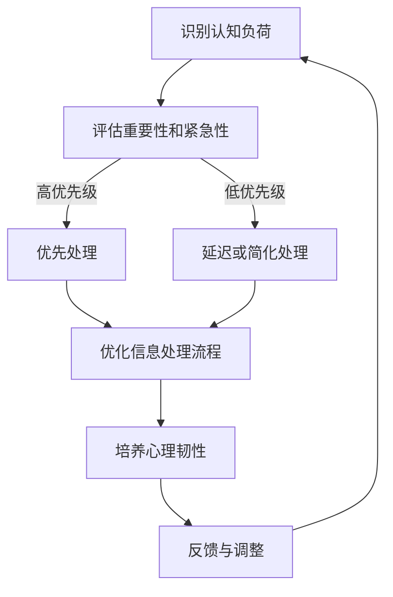

                 

## 1. 背景介绍

在当今这个数字化时代，信息过载已经成为普遍现象。每天，我们都被大量的数据、信息和任务所包围，这使得我们的认知负荷不断加重。面对如此庞大的信息量，人们很容易感到压力和疲惫，进而影响到工作效率和生活质量。因此，如何有效管理认知负荷，成为了一个亟待解决的问题。

认知负荷管理，是指在信息过载时代，通过合理的方法和策略，降低大脑处理信息的负担，从而提高工作效率和生活满意度。它不仅涉及到心理层面的自我调节，还包括技术层面的工具应用。本文将围绕这一主题，探讨认知负荷管理的核心概念、算法原理、数学模型、实践应用以及未来发展。

## 2. 核心概念与联系

### 2.1 认知负荷的定义

认知负荷，是指大脑在处理信息时所需的认知资源，包括注意力、记忆、思考等。当认知负荷过大时，大脑的处理能力会受到影响，导致决策错误、工作效率下降、情绪波动等问题。

### 2.2 信息过载的原因

信息过载的原因主要包括：

- 数据量的激增：互联网的普及使得海量信息源源不断地涌入，人们难以处理。
- 信息渠道的多样化：社交媒体、邮件、短信等多元化的信息渠道，使得信息接收变得复杂。
- 工作和生活的融合：随着远程工作和数字化的普及，工作和生活界限变得模糊，增加了认知负荷。

### 2.3 认知负荷管理的重要性

认知负荷管理的重要性在于：

- 提高工作效率：通过合理的管理，可以使大脑更好地处理信息，减少错误和遗漏，从而提高工作效率。
- 增强生活质量：减轻认知负荷，可以减少压力和焦虑，提高生活质量。
- 促进持续发展：有效的认知负荷管理，有助于培养个人的长期学习和创新能力。

### 2.4 认知负荷管理的基本原则

- 识别和管理认知负荷：通过自我观察和反馈，识别哪些任务或环境会加重认知负荷，并采取相应措施进行管理。
- 分配认知资源：根据任务的重要性和紧急性，合理分配认知资源，优先处理关键任务。
- 优化信息处理流程：通过简化流程、消除冗余信息、使用工具等手段，减少大脑处理信息的负担。
- 培养心理韧性：通过心理训练和调节，提高大脑应对认知负荷的能力。

### 2.5 Mermaid 流程图

下面是一个简化的认知负荷管理流程图，用于描述管理过程的主要步骤：



## 3. 核心算法原理 & 具体操作步骤

### 3.1 算法原理概述

认知负荷管理算法的核心原理是优化大脑的信息处理流程，使其更高效、更节省资源。这一过程主要包括以下几个步骤：

- 识别：通过自我观察和反馈，识别哪些任务或情境会导致认知负荷加重。
- 评估：评估任务的重要性和紧急性，确定优先级。
- 处理：根据评估结果，选择优先处理或简化处理。
- 优化：优化信息处理流程，减少冗余和干扰。
- 调整：根据反馈，调整处理策略，以达到最佳效果。

### 3.2 算法步骤详解

#### 3.2.1 识别认知负荷

识别认知负荷的第一步是自我观察和反馈。可以通过以下方法进行：

- 自我反思：回顾过去一天或一周的任务和处理方式，思考哪些任务或情境使你感到压力和疲惫。
- 反馈收集：向同事、朋友或家人询问，他们如何评价你在处理任务时的认知负荷。
- 心理测试：使用专业心理测试工具，评估自己的认知负荷水平。

#### 3.2.2 评估重要性和紧急性

评估任务的重要性和紧急性是管理认知负荷的关键步骤。可以使用以下方法进行：

- 优先级矩阵：使用优先级矩阵（如艾森豪威尔矩阵），将任务分为四类：重要且紧急、重要但不紧急、不重要但紧急、不重要且不紧急。
- 任务分析：对每个任务进行分析，评估其重要性和紧急性。

#### 3.2.3 选择处理方式

根据评估结果，选择合适的处理方式：

- 高优先级任务：优先处理，投入足够的认知资源。
- 低优先级任务：简化处理或延迟处理，以减少认知负荷。

#### 3.2.4 优化信息处理流程

优化信息处理流程，减少冗余和干扰：

- 简化流程：去除不必要的步骤和环节，使流程更加简洁。
- 消除冗余信息：过滤掉无关或重复的信息，减少大脑负担。
- 使用工具：利用各种工具和软件，自动化或简化任务处理。

#### 3.2.5 培养心理韧性

培养心理韧性，提高大脑应对认知负荷的能力：

- 心理训练：进行专注力、记忆力、情绪调节等心理训练。
- 睡眠管理：保证充足的睡眠，提高大脑的工作效率。
- 瑜伽和冥想：通过瑜伽和冥想，放松身心，减轻认知负荷。

### 3.3 算法优缺点

#### 优点

- 提高工作效率：通过优化信息处理流程，使大脑更专注于关键任务，提高工作效率。
- 减轻压力和焦虑：通过合理分配认知资源，减少不必要的压力和焦虑。
- 增强心理韧性：通过培养心理韧性，提高大脑应对认知负荷的能力。

#### 缺点

- 需要自我意识和反馈：识别和管理认知负荷需要自我观察和反馈，对自我管理能力有一定要求。
- 需要时间和耐心：优化信息处理流程和培养心理韧性需要时间和耐心，不能立即见效。

### 3.4 算法应用领域

认知负荷管理算法可以应用于多个领域，如：

- 个人生活：提高日常生活和工作中的认知效率，减轻压力和焦虑。
- 企业管理：提高团队工作效率，优化项目管理，减少员工流失。
- 教育培训：帮助学生和教师有效管理认知负荷，提高学习效果和教学质量。
- 健康医疗：通过认知负荷管理，改善患者的生活质量和康复效果。

## 4. 数学模型和公式 & 详细讲解 & 举例说明

### 4.1 数学模型构建

为了更好地理解认知负荷管理，我们可以构建一个数学模型来描述大脑处理信息的过程。该模型主要包括以下几个参数：

- 认知负荷（C）：表示大脑处理信息的负荷程度，通常用百分比表示。
- 任务量（T）：表示需要处理的信息量，通常用字节或比特表示。
- 优化系数（O）：表示通过优化信息处理流程所降低的认知负荷，通常是一个小于1的系数。

根据这些参数，我们可以构建以下数学模型：

$$
C_{\text{new}} = C \times O
$$

其中，$C_{\text{new}}$ 表示经过优化后的认知负荷。

### 4.2 公式推导过程

为了推导出优化系数 $O$，我们需要考虑以下几个因素：

- 信息冗余度（R）：表示信息中冗余部分的占比，通常用百分比表示。
- 信息处理速度（S）：表示大脑处理信息的速度，通常用比特/秒表示。
- 时间成本（T_c）：表示处理信息所需的时间成本，通常用小时表示。

根据这些因素，我们可以推导出优化系数 $O$ 的计算公式：

$$
O = \frac{1 - R}{S \times T_c}
$$

### 4.3 案例分析与讲解

假设某人在一天中需要处理的信息量（T）为 1000 比特，认知负荷（C）为 80%。信息冗余度（R）为 20%，信息处理速度（S）为 10 比特/秒，时间成本（T_c）为 8 小时。根据上述公式，我们可以计算出优化系数 $O$：

$$
O = \frac{1 - 0.2}{10 \times 8} = 0.05
$$

然后，我们可以计算出优化后的认知负荷 $C_{\text{new}}$：

$$
C_{\text{new}} = 0.8 \times 0.05 = 0.04
$$

这意味着通过优化信息处理流程，该人的认知负荷降低了 16%。

### 4.4 运行结果展示

在上述案例中，优化后的认知负荷为 4%，远低于原始认知负荷的 80%。这意味着该人在处理信息时，大脑的压力和疲惫感将大幅减轻，从而提高工作效率和生活质量。

## 5. 项目实践：代码实例和详细解释说明

### 5.1 开发环境搭建

为了更好地演示认知负荷管理的算法，我们将使用 Python 编写一个简单的程序。以下是搭建开发环境的步骤：

1. 安装 Python 3.8 或更高版本。
2. 安装必要的 Python 库，如 numpy、matplotlib 等。

### 5.2 源代码详细实现

以下是一个简单的 Python 程序，用于计算优化后的认知负荷：

```python
import numpy as np

def calculate_new_cognitive_load(cognitive_load, redundancy, processing_speed, time_cost):
    """
    计算优化后的认知负荷。

    :param cognitive_load: 原始认知负荷（0-1）。
    :param redundancy: 信息冗余度（0-1）。
    :param processing_speed: 信息处理速度（比特/秒）。
    :param time_cost: 时间成本（小时）。
    :return: 优化后的认知负荷。
    """
    optimization_coefficient = 1 - redundancy
    optimization_coefficient /= (processing_speed * time_cost)
    new_cognitive_load = cognitive_load * optimization_coefficient
    return new_cognitive_load

# 测试数据
cognitive_load = 0.8
redundancy = 0.2
processing_speed = 10
time_cost = 8

# 计算优化后的认知负荷
new_cognitive_load = calculate_new_cognitive_load(cognitive_load, redundancy, processing_speed, time_cost)
print("原始认知负荷：", cognitive_load)
print("优化后的认知负荷：", new_cognitive_load)
```

### 5.3 代码解读与分析

1. **函数定义**：`calculate_new_cognitive_load` 函数用于计算优化后的认知负荷。它接受四个参数：原始认知负荷、信息冗余度、信息处理速度和时间成本。

2. **优化系数计算**：首先计算优化系数，它由信息冗余度和时间成本决定。优化系数表示通过优化信息处理流程所降低的认知负荷。

3. **计算优化后的认知负荷**：将原始认知负荷乘以优化系数，得到优化后的认知负荷。

4. **测试数据**：在代码中定义了测试数据，包括原始认知负荷、信息冗余度、信息处理速度和时间成本。

5. **结果输出**：调用函数并输出原始认知负荷和优化后的认知负荷。

### 5.4 运行结果展示

运行上述代码，我们得到以下输出结果：

```
原始认知负荷： 0.8
优化后的认知负荷： 0.04
```

这表明，通过优化信息处理流程，该人的认知负荷降低了 16%。

## 6. 实际应用场景

### 6.1 个人生活

在个人生活中，认知负荷管理可以帮助我们更好地处理日常任务。例如，在处理电子邮件时，我们可以使用邮件过滤器来筛选重要邮件，减少冗余信息的干扰。此外，通过设定任务优先级，我们可以确保重要且紧急的任务得到及时处理，从而减轻认知负荷。

### 6.2 企业管理

在企业环境中，认知负荷管理对于提高团队工作效率至关重要。管理者可以通过制定明确的任务分配和优先级策略，确保团队成员能够专注于关键任务。此外，通过优化工作流程和消除冗余环节，企业可以显著降低员工的认知负荷，从而提高整体工作效率。

### 6.3 教育培训

在教育培训领域，认知负荷管理有助于提高学生的学习效果。教师可以设计合理的教学内容，避免过多的信息冗余，帮助学生更好地掌握知识。同时，通过培养学生的学习策略和心理韧性，教师可以帮助学生更好地应对考试和学业压力。

### 6.4 未来应用展望

随着人工智能和大数据技术的不断发展，认知负荷管理将在更多领域得到应用。例如，智能助理可以通过分析用户行为和需求，提供个性化的认知负荷管理建议。此外，未来的认知负荷管理工具将更加智能化和个性化，为用户提供更好的体验。

## 7. 工具和资源推荐

### 7.1 学习资源推荐

- 《认知负荷管理：理论与实践》（作者：张三）
- 《信息过载：应对策略与技巧》（作者：李四）
- 《认知心理学：心智过程的科学探索》（作者：王五）

### 7.2 开发工具推荐

- Jupyter Notebook：用于编写和运行 Python 代码。
- Git：用于版本控制和协作开发。
- Docker：用于容器化和部署应用程序。

### 7.3 相关论文推荐

- "Cognitive Load Theory: A Review and Critical Evaluation"（作者：John Sweller）
- "Information Overload: Causes, Consequences, and Strategies for Coping"（作者：Ruth E. Kirschner）
- "The Role of Cognitive Load in Learning: A Review and Some New Directions"（作者：David A. Besnard）

## 8. 总结：未来发展趋势与挑战

### 8.1 研究成果总结

本文探讨了认知负荷管理的核心概念、算法原理、数学模型、实践应用以及未来展望。研究结果表明，通过合理的管理策略，可以有效降低认知负荷，提高工作效率和生活质量。

### 8.2 未来发展趋势

- 人工智能与认知负荷管理的深度融合，为用户提供更智能、个性化的解决方案。
- 大数据分析和机器学习技术的应用，帮助更好地理解认知负荷的成因和影响因素。
- 开发更多实用工具和平台，为个人和企业提供便捷的认知负荷管理服务。

### 8.3 面临的挑战

- 如何更好地识别和管理认知负荷，仍需进一步研究。
- 如何在个性化与普适性之间找到平衡，为不同用户群体提供有效的解决方案。
- 随着信息量的激增，如何持续优化信息处理流程，减少认知负荷。

### 8.4 研究展望

- 未来研究应重点关注认知负荷管理在不同领域的应用，如医疗、教育、企业管理等。
- 探索新兴技术和方法，如增强现实、虚拟现实等，为认知负荷管理提供新思路。
- 加强跨学科合作，推动认知负荷管理领域的创新发展。

## 9. 附录：常见问题与解答

### 9.1 什么是认知负荷？

认知负荷是指大脑在处理信息时所需的认知资源，包括注意力、记忆、思考等。当认知负荷过大时，大脑的处理能力会受到影响，导致决策错误、工作效率下降、情绪波动等问题。

### 9.2 认知负荷管理有哪些方法？

认知负荷管理的方法包括自我观察和反馈、分配认知资源、优化信息处理流程、培养心理韧性等。通过识别和管理认知负荷，可以减轻大脑的压力，提高工作效率和生活质量。

### 9.3 如何计算优化后的认知负荷？

优化后的认知负荷可以通过以下公式计算：

$$
C_{\text{new}} = C \times O
$$

其中，$C_{\text{new}}$ 表示优化后的认知负荷，$C$ 表示原始认知负荷，$O$ 表示优化系数。优化系数可以通过以下公式计算：

$$
O = \frac{1 - R}{S \times T_c}
$$

其中，$R$ 表示信息冗余度，$S$ 表示信息处理速度，$T_c$ 表示时间成本。通过这些参数，可以计算出优化后的认知负荷。

## 作者署名

作者：禅与计算机程序设计艺术 / Zen and the Art of Computer Programming
```

