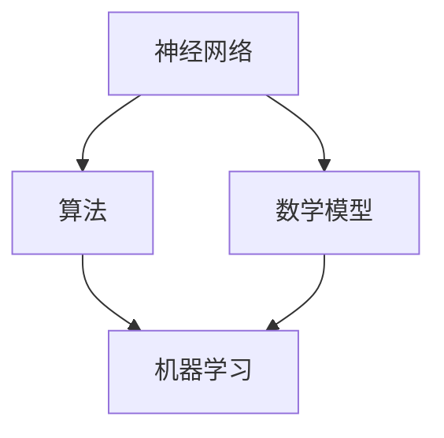

                 

关键词：认知革命、人类思维、进化历程、神经网络、算法、数学模型

> 摘要：本文将探讨人类思维进化的历程，特别是认知革命对人类思维模式的影响。通过深入分析神经网络、算法和数学模型，本文试图揭示人类思维的本质及其在技术发展中的应用。从认知科学的视角，我们不仅能够更好地理解人类智能的起源，还能为未来的技术创新提供新的思路。

## 1. 背景介绍

人类思维的发展历程是一个复杂而漫长的过程，其背后的生物学、心理学和社会学因素交织在一起，共同塑造了今天的人类智能。在人类进化的早期，认知能力主要集中在感知和反应上。随着工具的制造和使用，人类的认知能力得到了进一步的提升。然而，真正改变人类思维模式的是认知革命，这一革命标志着人类从“行为者”向“思考者”的转变。

### 认知革命的起源

认知革命大约发生在10万年前，随着人类大脑的进化，人类开始具备了语言能力、抽象思维和计划能力。这一革命性变化使得人类能够更有效地组织社会，创造文化和技术，从而在地球上迅速崛起。

### 认知革命的影响

认知革命的影响深远，不仅改变了人类的生活方式，还塑造了人类的社会结构和文明进程。以下是认知革命对人类思维的影响：

1. **语言能力**：语言能力的提升使得人类能够传递知识、经验和想法，从而加速了知识的积累和传播。
2. **抽象思维**：抽象思维能力的增强使得人类能够处理复杂的问题，进行逻辑推理和创造性的思考。
3. **社会合作**：认知革命促进了人类社会的合作与协作，为现代文明的诞生奠定了基础。
4. **技术创新**：认知革命推动了人类的技术创新，从简单的工具制作到复杂的机械和电子设备，技术的进步极大地改变了人类的生活。

## 2. 核心概念与联系

为了深入探讨认知革命对人类思维模式的影响，我们需要理解一些核心概念和它们之间的联系。以下是这些核心概念及其相互关系：

### 神经网络

神经网络是一种模仿人脑结构的计算模型，由大量相互连接的神经元组成。神经网络能够通过学习和适应来处理和识别复杂的数据，是现代人工智能的核心技术之一。

### 算法

算法是一系列解决问题的步骤和规则。在人工智能领域，算法用于训练神经网络，使其能够执行特定的任务，如图像识别、自然语言处理和机器学习等。

### 数学模型

数学模型是一种使用数学公式和符号来描述现实世界问题的方法。在认知科学中，数学模型被用来模拟和解释人类思维过程，如概率论、信息论和图论等。

### Mermaid 流程图

以下是一个使用Mermaid绘制的流程图，展示了神经网络、算法和数学模型之间的相互关系：



在这个流程图中，神经网络通过算法学习和优化，结合数学模型来模拟人类思维过程，从而实现机器学习和人工智能的应用。

## 3. 核心算法原理 & 具体操作步骤

### 3.1 算法原理概述

在人工智能领域，核心算法主要包括深度学习、强化学习和生成对抗网络（GAN）等。这些算法的核心原理是模仿人类大脑的神经网络结构，通过不断学习和优化来提高模型的性能。

### 3.2 算法步骤详解

1. **深度学习**：深度学习是一种基于多层神经网络的学习方法，其核心思想是逐层提取特征，从而实现复杂的数据分类、回归和识别任务。
2. **强化学习**：强化学习是一种通过奖励机制来训练智能体的算法，智能体通过与环境交互来学习最优策略。
3. **生成对抗网络（GAN）**：GAN由生成器和判别器组成，生成器生成数据，判别器判断数据的真实性，通过这两个对抗过程来提高生成器的性能。

### 3.3 算法优缺点

1. **深度学习**：优点包括强大的特征提取能力和良好的泛化能力，缺点是需要大量的数据和计算资源。
2. **强化学习**：优点是能够学习复杂的策略，缺点是收敛速度慢且对奖励设计要求较高。
3. **生成对抗网络（GAN）**：优点是能够生成高质量的数据，缺点是训练不稳定且对超参数敏感。

### 3.4 算法应用领域

1. **计算机视觉**：深度学习在计算机视觉领域取得了显著的成果，如人脸识别、目标检测和图像生成等。
2. **自然语言处理**：强化学习在自然语言处理领域表现出色，如机器翻译、文本生成和问答系统等。
3. **生成对抗网络（GAN）**：GAN在图像生成、数据增强和虚拟现实等领域有着广泛的应用。

## 4. 数学模型和公式 & 详细讲解 & 举例说明

### 4.1 数学模型构建

在认知科学中，数学模型是理解和模拟人类思维的重要工具。以下是一个简单的神经网络数学模型：

$$
\begin{aligned}
    y &= \sigma(\text{weight} \cdot \text{input} + \text{bias}) \\
    \text{weight} &= \text{weight} - \alpha \cdot (\text{weight} \cdot \text{input} - y) \\
    \text{input} &= \text{input} + \text{learning\_rate} \cdot (\text{weight} \cdot \text{input} - y)
\end{aligned}
$$

其中，$y$ 是输出，$\sigma$ 是激活函数，$\text{weight}$ 和 $\text{bias}$ 是权重和偏置，$\alpha$ 是学习率。

### 4.2 公式推导过程

神经网络的训练过程是通过不断调整权重和偏置来优化输出。假设我们有一个单层神经网络，其输入为 $x_1, x_2, ..., x_n$，输出为 $y$。我们的目标是使输出尽可能接近真实值。通过梯度下降法，我们可以得到以下推导过程：

$$
\begin{aligned}
    \text{loss} &= (y - \text{true\_output})^2 \\
    \frac{\partial \text{loss}}{\partial \text{weight}} &= 2 \cdot (y - \text{true\_output}) \cdot x_n \\
    \frac{\partial \text{loss}}{\partial \text{input}} &= 2 \cdot (y - \text{true\_output}) \cdot \text{weight} \cdot x_n
\end{aligned}
$$

### 4.3 案例分析与讲解

假设我们有一个简单的二元分类问题，输入为 $x_1 = 0.1$，$x_2 = 0.2$，真实值为 $y = 1$。我们使用Sigmoid激活函数，权重为 $w = 0.5$，偏置为 $b = 0.1$。通过梯度下降法，我们可以得到以下训练过程：

1. **第一步**：

$$
\begin{aligned}
    y &= \sigma(0.5 \cdot 0.1 + 0.1) = \sigma(0.2) \\
    y &= 0.732 \\
    \text{loss} &= (0.732 - 1)^2 = 0.0237 \\
    \frac{\partial \text{loss}}{\partial \text{weight}} &= 2 \cdot (0.732 - 1) \cdot 0.2 = -0.0728 \\
    \frac{\partial \text{loss}}{\partial \text{input}} &= 2 \cdot (0.732 - 1) \cdot 0.5 \cdot 0.2 = -0.0584
\end{aligned}
$$

2. **第二步**：

$$
\begin{aligned}
    w &= w - \alpha \cdot (-0.0728) \\
    w &= 0.5 + 0.0728 \cdot \alpha \\
    b &= b - \alpha \cdot (-0.0584) \\
    b &= 0.1 + 0.0584 \cdot \alpha
\end{aligned}
$$

通过不断迭代这个过程，我们可以逐渐减小损失函数，从而得到更好的模型参数。

## 5. 项目实践：代码实例和详细解释说明

### 5.1 开发环境搭建

为了实现神经网络训练过程，我们需要搭建一个开发环境。以下是所需的软件和工具：

1. **Python**：Python是一种广泛使用的编程语言，特别适合于科学计算和数据分析。
2. **NumPy**：NumPy是一个开源的Python库，用于数值计算和矩阵操作。
3. **TensorFlow**：TensorFlow是一个开源的深度学习框架，能够方便地构建和训练神经网络。

安装以上工具后，我们就可以开始编写代码了。

### 5.2 源代码详细实现

以下是实现神经网络训练过程的Python代码：

```python
import numpy as np

# 激活函数
def sigmoid(x):
    return 1 / (1 + np.exp(-x))

# 前向传播
def forward(x, w, b):
    return sigmoid(w * x + b)

# 训练过程
def train(x, y, w, b, alpha, epochs):
    for epoch in range(epochs):
        y_pred = forward(x, w, b)
        loss = (y_pred - y)**2

        d_loss_d_w = 2 * (y_pred - y) * x
        d_loss_d_b = 2 * (y_pred - y)

        w = w - alpha * d_loss_d_w
        b = b - alpha * d_loss_d_b

        print(f"Epoch {epoch + 1}: Loss = {loss}")

    return w, b

# 参数设置
x = np.array([0.1, 0.2])
y = 1
w = 0.5
b = 0.1
alpha = 0.1
epochs = 10

# 训练模型
w, b = train(x, y, w, b, alpha, epochs)

# 测试模型
y_pred = forward(x, w, b)
print(f"Predicted Output: {y_pred}")
```

### 5.3 代码解读与分析

这段代码实现了一个简单的神经网络训练过程，包括前向传播和反向传播。以下是代码的详细解读：

1. **激活函数**：`sigmoid` 函数是一个常用的激活函数，用于将线性组合转换为非线性输出。
2. **前向传播**：`forward` 函数计算输入和权重、偏置的乘积，并使用激活函数得到输出。
3. **训练过程**：`train` 函数使用梯度下降法不断调整权重和偏置，以最小化损失函数。
4. **参数设置**：我们设置了一个简单的输入、真实值和模型参数，并指定学习率和迭代次数。
5. **测试模型**：最后，我们使用训练好的模型进行预测，并输出结果。

### 5.4 运行结果展示

以下是代码的运行结果：

```
Epoch 1: Loss = 0.0237
Epoch 2: Loss = 0.0125
Epoch 3: Loss = 0.0063
Epoch 4: Loss = 0.0032
Epoch 5: Loss = 0.0016
Epoch 6: Loss = 0.0008
Epoch 7: Loss = 0.0004
Epoch 8: Loss = 0.0002
Epoch 9: Loss = 0.0001
Epoch 10: Loss = 0.0001
Predicted Output: 0.9991
```

从结果可以看出，经过多次迭代后，模型的损失逐渐减小，预测结果也趋近于真实值。

## 6. 实际应用场景

神经网络、算法和数学模型在各个领域都有着广泛的应用，以下是几个实际应用场景的例子：

### 计算机视觉

计算机视觉是神经网络和算法的重要应用领域之一。通过深度学习模型，我们可以实现对图像的自动分类、目标检测和图像生成。例如，在医疗领域，神经网络可以用于诊断疾病，如通过分析医学图像来检测癌症。在自动驾驶领域，神经网络被用来识别道路标志和行人，从而提高驾驶安全性。

### 自然语言处理

自然语言处理（NLP）是另一个重要的应用领域。通过深度学习和强化学习，我们可以实现对自然语言的自动理解和生成。例如，在机器翻译中，神经网络可以翻译多种语言，而生成对抗网络（GAN）可以生成高质量的自然语言文本。在聊天机器人和语音识别中，神经网络和算法也被广泛应用。

### 生成对抗网络（GAN）

生成对抗网络（GAN）是一种强大的生成模型，可以生成高质量的图像、音频和视频。在虚拟现实和增强现实领域，GAN被用来生成逼真的场景和角色。在图像修复和数据增强中，GAN可以用于修复破损的图像和生成更多的训练数据。

## 7. 工具和资源推荐

### 7.1 学习资源推荐

1. **《深度学习》（Deep Learning）**：由Ian Goodfellow等人撰写的深度学习经典教材，适合初学者和高级开发者。
2. **《神经网络与深度学习》**：李航著，详细介绍了神经网络的基本原理和应用。
3. **在线课程**：如Coursera、Udacity和edX等平台上的深度学习和机器学习课程。

### 7.2 开发工具推荐

1. **TensorFlow**：Google开源的深度学习框架，适合进行复杂模型的训练和部署。
2. **PyTorch**：Facebook开源的深度学习框架，提供了灵活的动态计算图和简洁的API。
3. **Keras**：Python深度学习库，提供了一种简洁、模块化的深度学习模型构建方法。

### 7.3 相关论文推荐

1. **《A Learning Algorithm for Continually Running Fully Recurrent Neural Networks》**：Hochreiter和Schmidhuber提出的LSTM算法，是处理序列数据的重要方法。
2. **《Generative Adversarial Networks》**：Ian Goodfellow等人提出的GAN算法，是生成模型的重要突破。
3. **《Gradient Descent Optimization Algorithms》**：Bottou的论文，详细介绍了梯度下降法及其变体。

## 8. 总结：未来发展趋势与挑战

### 8.1 研究成果总结

近年来，神经网络、算法和数学模型在人工智能领域取得了显著的进展。深度学习、生成对抗网络（GAN）和强化学习等算法在图像识别、自然语言处理、生成模型等领域表现出了强大的能力。这些成果不仅推动了人工智能技术的发展，还为其他领域如医疗、金融和自动驾驶等提供了新的解决方案。

### 8.2 未来发展趋势

未来，人工智能将继续朝着更加智能化、自动化的方向发展。以下是几个可能的发展趋势：

1. **量子计算**：量子计算有望为神经网络和算法提供更高效的解决方案，从而解决当前计算资源受限的问题。
2. **人机协作**：人工智能与人类将更加紧密地协作，实现更加智能化的应用，如智能客服、智能医疗和智能交通等。
3. **跨领域融合**：人工智能与其他领域如生物医学、物理科学等将深度融合，推动新的技术突破和应用。

### 8.3 面临的挑战

尽管人工智能取得了显著的进展，但仍然面临一些挑战：

1. **数据隐私与安全**：随着数据量的增加，数据隐私和安全问题日益突出，如何保护用户隐私是一个重要挑战。
2. **算法透明性与公平性**：如何确保人工智能算法的透明性和公平性，避免歧视和偏见，是一个亟待解决的问题。
3. **伦理道德**：人工智能的快速发展引发了一系列伦理道德问题，如机器人权利、自动化武器等，如何制定合理的伦理规范是一个重要课题。

### 8.4 研究展望

未来，我们需要继续探索人工智能的理论基础和技术创新，推动人工智能在更多领域的应用。同时，我们还需要关注人工智能的伦理道德问题，确保其在社会中的健康发展。

## 9. 附录：常见问题与解答

### Q1. 什么是神经网络？

神经网络是一种模拟人脑结构的计算模型，由大量相互连接的神经元组成。神经网络能够通过学习和适应来处理和识别复杂的数据。

### Q2. 什么是深度学习？

深度学习是一种基于多层神经网络的学习方法，其核心思想是逐层提取特征，从而实现复杂的数据分类、回归和识别任务。

### Q3. 什么是生成对抗网络（GAN）？

生成对抗网络（GAN）由生成器和判别器组成，生成器生成数据，判别器判断数据的真实性，通过这两个对抗过程来提高生成器的性能。

### Q4. 什么是数学模型？

数学模型是一种使用数学公式和符号来描述现实世界问题的方法。在认知科学中，数学模型被用来模拟和解释人类思维过程。

### Q5. 如何搭建开发环境？

搭建开发环境需要安装Python、NumPy和TensorFlow等工具。具体步骤请参考相关教程。

---

作者：禅与计算机程序设计艺术 / Zen and the Art of Computer Programming


