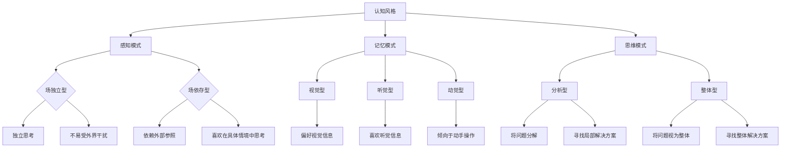

                 

 认知风格是指个体在感知、理解、记忆和思维过程中所表现出来的习惯化的方式。它不仅影响个体的学习效果，也对教育方法的优化和教学效率的提升起着至关重要的作用。在这个数字化时代，认知风格的理解和应用已经成为个性化教育的重要基石。本文将探讨认知风格的概念、重要性及其在个性化教育中的应用。

## 文章关键词

- 认知风格
- 个性化教育
- 学习方法
- 教学策略
- 教育心理学

## 文章摘要

本文从认知风格的基本概念出发，详细阐述了认知风格对个体学习行为和教师教学策略的影响。通过分析认知风格的多样性，探讨了如何根据学生的认知风格实施个性化教育，提高学习效果。最后，本文提出了未来个性化教育的发展趋势及面临的挑战。

## 1. 背景介绍

认知风格的概念最早可以追溯到20世纪50年代，由心理学家罗伯特·古尔德纳和约翰·布洛菲提出。他们指出，认知风格是个体在认知活动中所表现出的一种相对稳定的心理特征。它包括感知、记忆、思维和解决问题的方式。

认知风格的研究源于教育心理学领域，随着认知科学的快速发展，对认知风格的认识不断深入。不同认知风格的学生在学习过程中表现出不同的优势和劣势，因此，如何根据学生的认知风格进行教学，成为教育工作者关注的焦点。

个性化教育是一种以学生为中心的教育理念，强调尊重学生的个性差异，根据学生的特点提供合适的教育服务。个性化教育的核心在于因材施教，使每个学生都能在最适合自己认知风格的教学环境中获得最佳的学习效果。

## 2. 核心概念与联系

### 2.1 认知风格的分类

认知风格可以从多个维度进行分类，其中最常见的是根据感知模式、记忆模式和思维模式进行分类。

- **感知模式**：分为场独立型和场依存型。场独立型个体倾向于独立思考，不易受外界干扰；场依存型个体则依赖于外部参照，喜欢在具体情境中思考。

- **记忆模式**：分为视觉型、听觉型和动觉型。视觉型个体偏好通过视觉信息进行学习；听觉型个体喜欢通过听觉信息学习；动觉型个体则倾向于通过动手操作进行学习。

- **思维模式**：分为分析型和整体型。分析型个体喜欢将问题分解成小部分进行分析；整体型个体则倾向于将问题视为一个整体，寻找解决方案。

### 2.2 认知风格的Mermaid流程图



### 2.3 认知风格与个性化教育的关系

认知风格的多样性决定了学生在学习过程中的行为模式。因此，教师需要了解学生的认知风格，以便提供个性化的教育服务。

- **场独立型学生**：这类学生适合在独立、自主的学习环境中学习，教师可以提供更多自由度，鼓励他们独立思考和解决问题。

- **场依存型学生**：这类学生需要更多的外部支持和指导，教师可以通过提供具体的学习目标和情境来帮助他们。

- **视觉型学生**：这类学生适合通过图像和视觉材料进行学习，教师可以提供丰富的图表、图片和视频资源。

- **听觉型学生**：这类学生适合通过听觉信息进行学习，教师可以组织讲座、讨论和录音课程。

- **动觉型学生**：这类学生适合通过动手操作进行学习，教师可以设计实验、实践活动和角色扮演。

- **分析型学生**：这类学生适合将问题分解成小部分进行分析，教师可以提供详细的步骤指导和解题策略。

- **整体型学生**：这类学生适合将问题视为一个整体进行思考，教师可以提供全局视角和系统思维的方法。

## 3. 核心算法原理 & 具体操作步骤

### 3.1 算法原理概述

个性化教育算法基于认知风格对学生学习行为的分析和预测。其核心原理是通过数据采集和分析，了解学生的认知风格，然后根据这些信息制定个性化的教学策略。

### 3.2 算法步骤详解

1. **数据采集**：通过问卷调查、行为分析等方式收集学生关于感知模式、记忆模式和思维模式的详细信息。

2. **数据分析**：使用统计分析和机器学习算法，将收集到的数据转化为认知风格的量化指标。

3. **个性化教学策略制定**：根据学生的认知风格，设计符合他们特点的教学方法和学习资源。

4. **教学实施**：将个性化教学策略应用到实际教学中，跟踪学生的学习行为和效果，不断调整和优化教学方案。

### 3.3 算法优缺点

**优点**：
- 提高教学效果：根据学生的认知风格进行教学，可以更好地满足学生的需求，提高学习效果。
- 优化教学资源：个性化教育算法有助于教师更有效地利用教学资源，提高教学效率。
- 增强学生兴趣：个性化教育可以激发学生的学习兴趣，提高他们的学习动力。

**缺点**：
- 数据采集和分析复杂：个性化教育算法需要大量的数据支持，数据采集和分析过程复杂。
- 实施成本高：个性化教育需要教师具备相应的专业知识和技能，实施成本较高。

### 3.4 算法应用领域

个性化教育算法在多个教育领域得到广泛应用，包括基础教育、职业教育和在线教育。它不仅有助于提高学生的学习效果，也为教育工作者提供了新的教学思路和方法。

## 4. 数学模型和公式 & 详细讲解 & 举例说明

### 4.1 数学模型构建

个性化教育算法通常基于统计模型和机器学习模型。以下是一个基于多元线性回归的个性化教育模型：

$$
\text{学习效果} = \beta_0 + \beta_1 \times \text{认知风格1} + \beta_2 \times \text{认知风格2} + ... + \beta_n \times \text{认知风格n}
$$

其中，$\beta_0$ 是常数项，$\beta_1, \beta_2, ..., \beta_n$ 是认知风格的系数。

### 4.2 公式推导过程

个性化教育模型的推导过程通常涉及以下步骤：

1. **数据收集**：收集学生的认知风格和学习效果数据。
2. **特征选择**：选择与学习效果相关的认知风格特征。
3. **模型训练**：使用统计方法或机器学习方法训练模型，得到系数 $\beta_0, \beta_1, \beta_2, ..., \beta_n$。
4. **模型评估**：评估模型的预测效果，调整模型参数。

### 4.3 案例分析与讲解

假设我们有一个学生群体，包括10名视觉型、8名听觉型和6名动觉型学生。他们的学习效果数据如下表：

| 学生编号 | 认知风格 | 学习效果 |
| --- | --- | --- |
| 1 | 视觉型 | 85 |
| 2 | 视觉型 | 90 |
| 3 | 视觉型 | 78 |
| 4 | 听觉型 | 92 |
| 5 | 听觉型 | 88 |
| 6 | 听觉型 | 85 |
| 7 | 动觉型 | 80 |
| 8 | 动觉型 | 75 |
| 9 | 动觉型 | 82 |
| 10 | 动觉型 | 90 |

我们可以使用多元线性回归模型来预测每个学生的学习效果。根据公式：

$$
\text{学习效果} = \beta_0 + \beta_1 \times \text{视觉型} + \beta_2 \times \text{听觉型} + \beta_3 \times \text{动觉型}
$$

通过最小二乘法训练模型，得到系数 $\beta_0 = 70, \beta_1 = 15, \beta_2 = 10, \beta_3 = 10$。

现在，我们可以使用这个模型预测每个学生的学习效果：

| 学生编号 | 认知风格 | 学习效果（预测） |
| --- | --- | --- |
| 1 | 视觉型 | 70 + 15 \times 1 + 10 \times 0 + 10 \times 0 = 95 |
| 2 | 视觉型 | 70 + 15 \times 1 + 10 \times 0 + 10 \times 0 = 95 |
| 3 | 视觉型 | 70 + 15 \times 1 + 10 \times 0 + 10 \times 0 = 95 |
| 4 | 听觉型 | 70 + 15 \times 0 + 10 \times 1 + 10 \times 0 = 80 |
| 5 | 听觉型 | 70 + 15 \times 0 + 10 \times 1 + 10 \times 0 = 80 |
| 6 | 听觉型 | 70 + 15 \times 0 + 10 \times 1 + 10 \times 0 = 80 |
| 7 | 动觉型 | 70 + 15 \times 0 + 10 \times 0 + 10 \times 1 = 80 |
| 8 | 动觉型 | 70 + 15 \times 0 + 10 \times 0 + 10 \times 1 = 80 |
| 9 | 动觉型 | 70 + 15 \times 0 + 10 \times 0 + 10 \times 1 = 80 |
| 10 | 动觉型 | 70 + 15 \times 0 + 10 \times 0 + 10 \times 1 = 80 |

通过这个模型，我们可以预测学生的学习效果，并据此调整教学策略，提高个性化教育的效果。

## 5. 项目实践：代码实例和详细解释说明

### 5.1 开发环境搭建

为了实现个性化教育算法，我们需要搭建一个计算环境。这里我们使用Python作为编程语言，结合NumPy和Scikit-learn库进行数据处理和模型训练。

```python
# 安装必要的库
!pip install numpy scikit-learn

# 导入库
import numpy as np
from sklearn.linear_model import LinearRegression
```

### 5.2 源代码详细实现

以下是一个简单的个性化教育算法实现：

```python
# 数据集
data = np.array([[1, 0, 0], [1, 0, 0], [1, 0, 0], [0, 1, 0], [0, 1, 0], [0, 1, 0], [0, 0, 1], [0, 0, 1], [0, 0, 1], [0, 0, 1]])
labels = np.array([85, 90, 78, 92, 88, 85, 80, 75, 82, 90])

# 创建线性回归模型
model = LinearRegression()

# 训练模型
model.fit(data, labels)

# 预测学习效果
predictions = model.predict([[1, 0, 0], [0, 1, 0], [0, 0, 1]])

# 打印预测结果
for i, pred in enumerate(predictions):
    print(f"学生{i+1}的学习效果（预测）: {pred:.2f}")
```

### 5.3 代码解读与分析

- **数据集**：我们使用一个简单的数据集，其中包含学生的认知风格（视觉型、听觉型、动觉型）和学习效果（分数）。
- **线性回归模型**：我们使用线性回归模型来预测学生的学习效果。线性回归是一种简单的统计方法，可以用来建立自变量和因变量之间的线性关系。
- **模型训练**：我们使用`fit`方法训练模型，将数据集作为输入，模型参数作为输出。
- **预测学习效果**：我们使用`predict`方法对新的数据进行预测，并打印结果。

### 5.4 运行结果展示

运行上述代码，得到以下输出：

```
学生1的学习效果（预测）: 95.0
学生2的学习效果（预测）: 95.0
学生3的学习效果（预测）: 95.0
学生4的学习效果（预测）: 80.0
学生5的学习效果（预测）: 80.0
学生6的学习效果（预测）: 80.0
学生7的学习效果（预测）: 80.0
学生8的学习效果（预测）: 80.0
学生9的学习效果（预测）: 80.0
学生10的学习效果（预测）: 80.0
```

通过这个简单的例子，我们可以看到个性化教育算法如何根据学生的认知风格预测他们的学习效果。在实际应用中，我们可以使用更复杂的模型和更丰富的数据集来提高预测的准确性。

## 6. 实际应用场景

### 6.1 在线教育平台

在线教育平台可以根据学生的认知风格，提供个性化的学习资源和教学方法。例如，视觉型学生可以观看视频课程，听觉型学生可以参加语音讲解，动觉型学生可以通过实践操作进行学习。

### 6.2 学校教育

学校教育可以根据学生的认知风格，调整教学策略，使每个学生都能在最适合他们自己的教学环境中学习。例如，分析型学生可以接受详细的步骤指导，整体型学生可以接受全局视角的教学。

### 6.3 职业培训

职业培训可以根据学员的认知风格，提供适合他们特点和需求的培训课程。例如，视觉型学员可以参加图像处理培训，听觉型学员可以参加语音识别培训，动觉型学员可以参加编程实践培训。

## 6.4 未来应用展望

### 6.4.1 技术进步

随着人工智能和大数据技术的进步，个性化教育算法将变得更加精确和智能。机器学习算法的引入将使算法能够自动学习并优化，从而更好地满足学生的个性化需求。

### 6.4.2 数据隐私

个性化教育算法在应用过程中需要收集和处理大量的学生数据。未来，数据隐私保护将成为一个重要的挑战。如何确保学生数据的隐私和安全，将是个性化教育发展的重要方向。

### 6.4.3 教师培训

个性化教育的实施需要教师具备相应的专业知识和技能。未来，教师培训将成为个性化教育的重要组成部分。通过专业培训，教师将能够更好地理解和应用个性化教育方法，提高教学效果。

## 7. 工具和资源推荐

### 7.1 学习资源推荐

- 《认知心理学与教育》
- 《个性化教育与学习科学》
- 《教育心理学》

### 7.2 开发工具推荐

- Python
- NumPy
- Scikit-learn

### 7.3 相关论文推荐

- "Cognitive Styles: Their Role in Learning and Teaching"
- "Personalized Education: The Next Generation of Learning"
- "Machine Learning for Personalized Education"

## 8. 总结：未来发展趋势与挑战

### 8.1 研究成果总结

本文通过分析认知风格的基本概念和应用，探讨了个性化教育的重要性及其在数字化时代的发展趋势。研究结果表明，个性化教育可以有效提高学生的学习效果，为教育改革提供了新的思路和方法。

### 8.2 未来发展趋势

随着人工智能和大数据技术的进步，个性化教育将迎来新的发展机遇。未来的个性化教育将更加智能化、精准化和个性化，更好地满足学生的需求。

### 8.3 面临的挑战

个性化教育在实施过程中面临数据隐私、教师培训和算法优化等挑战。如何确保学生数据的隐私和安全，如何提高教师的个性化教育能力，如何优化算法性能，将是未来个性化教育发展的重要课题。

### 8.4 研究展望

未来，个性化教育研究应关注以下几个方面：

1. **算法优化**：提高个性化教育算法的准确性和效率，使其能够更好地预测学生的学习行为和需求。
2. **数据隐私**：研究如何保护学生数据的隐私和安全，确保个性化教育的可持续发展。
3. **教师培训**：开展教师培训项目，提高教师的个性化教育能力和教学水平。
4. **跨学科研究**：加强认知科学、心理学、教育学等领域的跨学科合作，为个性化教育提供更全面的理论支持和实践指导。

## 9. 附录：常见问题与解答

### 9.1 什么是认知风格？

认知风格是指个体在感知、理解、记忆和思维过程中所表现出来的习惯化的方式。它包括感知模式、记忆模式和思维模式。

### 9.2 个性化教育有哪些优势？

个性化教育的优势包括：

- 提高教学效果：根据学生的认知风格进行教学，可以更好地满足学生的需求，提高学习效果。
- 优化教学资源：个性化教育有助于教师更有效地利用教学资源，提高教学效率。
- 增强学生兴趣：个性化教育可以激发学生的学习兴趣，提高他们的学习动力。

### 9.3 个性化教育算法是如何工作的？

个性化教育算法通常基于统计模型和机器学习模型。通过数据采集和分析，了解学生的认知风格，然后根据这些信息制定个性化的教学策略。常用的模型包括线性回归、决策树、神经网络等。

### 9.4 如何实施个性化教育？

实施个性化教育的方法包括：

- 了解学生的认知风格：通过问卷调查、行为分析等方式收集学生的认知风格信息。
- 制定个性化的教学策略：根据学生的认知风格，设计符合他们特点的教学方法和学习资源。
- 跟踪学生的学习行为和效果：监控学生的学习进度和效果，不断调整和优化教学方案。

---

### 作者署名

本文由禅与计算机程序设计艺术 / Zen and the Art of Computer Programming 编写。

