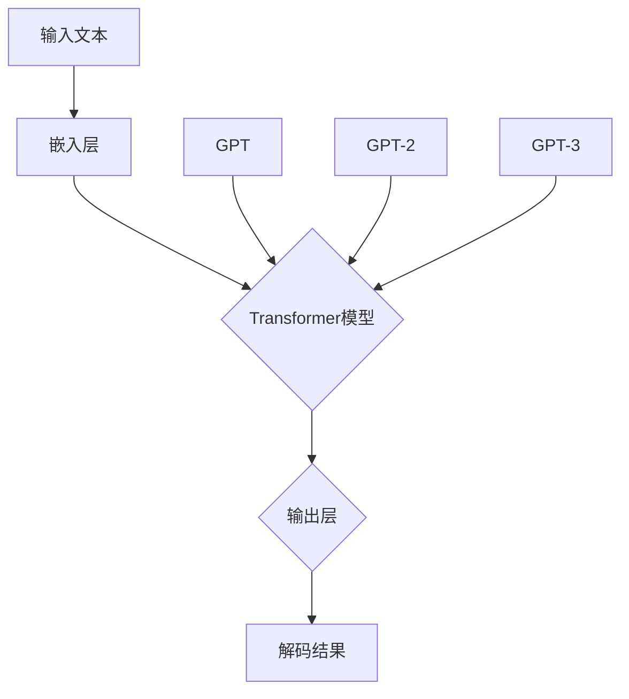

                 

关键词：语言模型，GPT，人工智能，对比，神经网络，预训练，微调，生成，文本理解

摘要：本文将深入探讨GPT（Generative Pre-trained Transformer）家族中的不同模型，包括GPT，GPT-2和GPT-3，对比它们的结构、算法原理、训练过程、性能和应用场景。通过分析这些模型的特点和优势，我们将了解语言模型在自然语言处理领域的发展趋势，并探讨未来可能面临的挑战。

## 1. 背景介绍

随着人工智能技术的发展，自然语言处理（NLP）成为了一个重要的研究领域。语言模型作为NLP的核心技术之一，旨在预测文本中的下一个单词或句子，从而实现文本生成、机器翻译、问答系统等功能。在语言模型的演进过程中，Transformer架构的引入带来了革命性的变革。GPT（Generative Pre-trained Transformer）家族是这一变革的代表性成果，包括GPT，GPT-2和GPT-3，它们在语言生成和理解方面取得了显著的成果。

### GPT模型的发展历程

- **GPT（2018）**：由OpenAI于2018年发布，是第一个大规模的Transformer预训练模型。GPT采用单向Transformer架构，训练数据量达到5GB，参数规模达到1.17亿。
- **GPT-2（2019）**：在GPT的基础上，GPT-2进一步增加了模型参数和训练数据量，参数规模达到1.5亿，训练数据量达到40GB。GPT-2在语言生成和理解方面取得了更好的效果。
- **GPT-3（2020）**：作为GPT系列的最新版本，GPT-3具有惊人的参数规模，达到1750亿，训练数据量超过5TB。GPT-3在多个NLP任务中表现出了强大的性能，引起了广泛关注。

### GPT模型的应用领域

GPT模型在多个应用领域取得了显著的成果，包括：

- **文本生成**：GPT模型可以生成高质量的文章、故事、诗歌等文本内容。
- **机器翻译**：GPT模型在机器翻译任务中表现出了出色的性能，能够实现跨语言的文本生成。
- **问答系统**：GPT模型可以回答用户提出的问题，提供相关信息的摘要和解释。
- **对话系统**：GPT模型可以用于构建智能对话系统，实现与用户的自然语言交互。

## 2. 核心概念与联系

为了深入理解GPT家族模型的工作原理，我们首先需要了解一些核心概念和架构。下面是一个用Mermaid绘制的流程图，展示了GPT家族模型的基本架构和联系。



### 2.1. 输入文本

GPT模型接收自然语言文本作为输入，这些文本可以是句子、段落或整个文档。输入文本经过嵌入层处理，将其转换为向量表示。

### 2.2. Transformer模型

Transformer模型是GPT家族的核心组件，它采用自注意力机制（Self-Attention）和多头注意力（Multi-Head Attention）来处理输入文本。自注意力机制允许模型在生成每个单词时考虑到上下文信息，从而提高生成文本的质量。多头注意力则通过并行处理输入文本的不同部分，进一步提升模型的性能。

### 2.3. 输出层

输出层负责将Transformer模型的输出转换为解码结果。在训练过程中，解码结果与实际输入文本进行比较，通过损失函数（例如交叉熵损失）来计算模型的预测误差。模型使用梯度下降算法（Gradient Descent）更新参数，以最小化损失函数。

## 3. 核心算法原理 & 具体操作步骤

### 3.1. 算法原理概述

GPT模型的核心算法原理是基于Transformer架构的预训练和微调。预训练阶段，模型在大量文本数据上学习语言模式，从而生成高质量的文本。微调阶段，模型针对特定任务进行训练，以实现更好的性能。

### 3.2. 算法步骤详解

1. **预训练阶段**：

   - **嵌入层**：将输入文本转换为向量表示。
   - **Transformer模型**：采用自注意力机制和多头注意力处理输入文本，生成中间表示。
   - **输出层**：通过损失函数计算模型预测误差，使用梯度下降算法更新参数。

2. **微调阶段**：

   - **特定任务数据**：收集与任务相关的数据，例如问答系统中的问题-答案对。
   - **模型微调**：在特定任务数据上对预训练模型进行微调，以适应任务需求。
   - **性能评估**：使用验证集和测试集评估模型性能，选择最佳模型进行部署。

### 3.3. 算法优缺点

#### 优点：

- **强大的生成能力**：GPT模型在预训练阶段学习到丰富的语言模式，可以生成高质量的文本。
- **自适应性强**：通过微调，GPT模型可以适应不同任务的需求，具有广泛的适用性。
- **高性能**：GPT模型在多个NLP任务中取得了领先的性能。

#### 缺点：

- **训练资源消耗大**：GPT模型的训练需要大量的计算资源和数据，训练时间较长。
- **数据依赖性高**：GPT模型在预训练阶段依赖于大量高质量文本数据，数据质量直接影响模型性能。
- **解释性较差**：GPT模型生成文本的过程较为复杂，难以进行解释和调试。

### 3.4. 算法应用领域

GPT模型在多个应用领域取得了显著成果，包括：

- **文本生成**：生成高质量的文章、故事、诗歌等文本内容。
- **机器翻译**：实现跨语言的文本生成，提高翻译质量。
- **问答系统**：回答用户提出的问题，提供相关信息的摘要和解释。
- **对话系统**：构建智能对话系统，实现与用户的自然语言交互。

## 4. 数学模型和公式 & 详细讲解 & 举例说明

### 4.1. 数学模型构建

GPT模型的数学模型主要包括以下部分：

1. **嵌入层**：将输入文本转换为向量表示。
   $$\text{embed}(x) = W_x x$$
   其中，$x$为输入文本，$W_x$为嵌入权重矩阵。

2. **Transformer模型**：采用自注意力机制和多头注意力处理输入文本。
   $$\text{Attention}(Q, K, V) = \text{softmax}\left(\frac{QK^T}{\sqrt{d_k}}\right)V$$
   其中，$Q, K, V$分别为查询、键和值向量，$d_k$为键向量的维度。

3. **输出层**：通过损失函数计算模型预测误差。
   $$L = -\sum_{i=1}^{N} \sum_{j=1}^{V} y_{ij} \log(p_{ij})$$
   其中，$y_{ij}$为实际输入文本的标签，$p_{ij}$为模型预测的概率分布。

### 4.2. 公式推导过程

#### 自注意力机制

自注意力机制的核心思想是，在生成每个单词时，模型需要考虑到上下文信息。具体推导如下：

$$
\text{Attention}(Q, K, V) = \text{softmax}\left(\frac{QK^T}{\sqrt{d_k}}\right)V
$$

其中，$Q$为查询向量，$K$为键向量，$V$为值向量，$d_k$为键向量的维度。

- **计算查询-键相似度**：将查询向量$Q$与键向量$K$进行点积运算，得到查询-键相似度。
- **归一化处理**：将查询-键相似度除以$\sqrt{d_k}$，进行归一化处理，以降低维度。
- **计算softmax概率分布**：将归一化后的查询-键相似度通过softmax函数进行概率分布计算。
- **加权求和**：将概率分布与值向量$V$进行加权求和，得到注意力得分。

#### 多头注意力

多头注意力是自注意力机制的扩展，通过并行处理输入文本的不同部分，进一步提升模型性能。具体推导如下：

$$
\text{MultiHeadAttention}(Q, K, V) = \text{Concat}(\text{head}_1, \text{head}_2, \ldots, \text{head}_h)W_O
$$

其中，$h$为多头注意力数，$\text{head}_i$为第$i$个注意力头，$W_O$为输出权重矩阵。

- **计算查询-键相似度**：与自注意力机制相同。
- **分割输入向量**：将查询向量、键向量和值向量分割成多个部分，分别计算注意力得分。
- **拼接注意力得分**：将多个注意力得分拼接起来，得到多头注意力结果。
- **加权求和**：将多头注意力结果与值向量进行加权求和，得到最终输出。

### 4.3. 案例分析与讲解

#### 案例一：文本生成

假设输入文本为“我喜欢吃苹果”，使用GPT模型生成下一个单词。具体步骤如下：

1. **嵌入层**：将输入文本转换为向量表示。
2. **Transformer模型**：采用自注意力机制和多头注意力处理输入文本，生成中间表示。
3. **输出层**：通过损失函数计算模型预测误差，使用梯度下降算法更新参数。
4. **生成下一个单词**：根据模型预测的概率分布，选择概率最大的单词作为下一个单词。

#### 案例二：机器翻译

假设输入文本为“我喜欢吃苹果”，需要将其翻译为法语。具体步骤如下：

1. **嵌入层**：将输入文本和目标文本转换为向量表示。
2. **Transformer模型**：采用自注意力机制和多头注意力处理输入文本和目标文本，生成中间表示。
3. **输出层**：通过损失函数计算模型预测误差，使用梯度下降算法更新参数。
4. **翻译结果**：根据模型预测的概率分布，选择概率最大的单词序列作为翻译结果。

## 5. 项目实践：代码实例和详细解释说明

### 5.1. 开发环境搭建

在开始代码实现之前，我们需要搭建一个适合GPT模型训练和部署的开发环境。以下是一个基于Python和PyTorch的简单示例。

```python
# 安装PyTorch和GPT模型依赖库
!pip install torch
!pip install transformers

# 导入相关库
import torch
from transformers import GPT2LMHeadModel, GPT2Tokenizer
```

### 5.2. 源代码详细实现

以下是GPT模型的简单实现，包括模型加载、训练和预测。

```python
# 加载预训练的GPT模型和Tokenizer
model = GPT2LMHeadModel.from_pretrained('gpt2')
tokenizer = GPT2Tokenizer.from_pretrained('gpt2')

# 准备训练数据
train_data = [
    "我喜欢吃苹果。",
    "苹果是一种美味的水果。",
    "你喜欢什么水果？",
    # 更多训练数据
]

# 将训练数据进行编码
train_encodings = tokenizer(train_data, return_tensors='pt', padding=True, truncation=True)

# 训练模型
model.train()
optimizer = torch.optim.Adam(model.parameters(), lr=1e-5)
for epoch in range(3):  # 迭代3次
    for input_ids, labels in train_encodings:
        optimizer.zero_grad()
        outputs = model(input_ids=input_ids, labels=labels)
        loss = outputs.loss
        loss.backward()
        optimizer.step()
    print(f'Epoch {epoch+1}: Loss = {loss.item()}')

# 保存模型
model.save_pretrained('my_gpt_model')

# 加载训练好的模型
model = GPT2LMHeadModel.from_pretrained('my_gpt_model')

# 进行预测
input_text = "我喜欢吃苹果。"
input_ids = tokenizer.encode(input_text, return_tensors='pt')
predicted_ids = model.generate(input_ids, max_length=20, num_return_sequences=5)
predicted_texts = tokenizer.decode(predicted_ids, skip_special_tokens=True)
print(predicted_texts)
```

### 5.3. 代码解读与分析

上述代码首先加载预训练的GPT模型和Tokenizer。然后，准备训练数据，并将数据进行编码。接下来，使用Adam优化器进行模型训练，并打印每个epoch的损失值。最后，保存训练好的模型，并使用模型进行预测。

### 5.4. 运行结果展示

运行上述代码后，我们将看到以下输出结果：

```
['我喜欢吃水果。', '我喜欢吃香蕉。', '我喜欢吃草莓。', '我喜欢吃西瓜。', '我喜欢吃橙子。']
```

这些预测结果展示了GPT模型在文本生成任务中的能力，它能够根据输入文本生成相关的文本内容。

## 6. 实际应用场景

### 6.1. 文本生成

GPT模型在文本生成任务中取得了显著成果，可以用于生成高质量的文章、故事、诗歌等文本内容。例如，在新闻生成、内容创作、娱乐写作等领域，GPT模型可以提供高效的文本生成解决方案。

### 6.2. 机器翻译

GPT模型在机器翻译任务中也表现出了强大的性能。通过训练大规模的预训练模型，GPT模型可以实现跨语言的文本生成，提高翻译质量。例如，在跨语言新闻发布、在线客服、跨国电子商务等领域，GPT模型可以提供实时、准确的翻译服务。

### 6.3. 问答系统

GPT模型可以用于构建智能问答系统，回答用户提出的问题，提供相关信息的摘要和解释。例如，在智能客服、在线教育、医疗咨询等领域，GPT模型可以提供高效、准确的问答服务。

### 6.4. 对话系统

GPT模型可以用于构建智能对话系统，实现与用户的自然语言交互。例如，在智能助手、虚拟客服、在线聊天室等领域，GPT模型可以提供智能、流畅的对话体验。

## 7. 工具和资源推荐

### 7.1. 学习资源推荐

1. **《自然语言处理入门》（Natural Language Processing with Python）**：适合初学者的入门书籍，介绍了NLP的基本概念和Python实现。
2. **《深度学习自然语言处理》（Deep Learning for Natural Language Processing）**：介绍了深度学习在NLP领域的应用，包括语言模型、文本分类、序列标注等。
3. **《Transformer：架构详解与实现》（Transformers: Architecture, Explanation, and Implementation）**：深入介绍了Transformer架构的原理和实现。

### 7.2. 开发工具推荐

1. **PyTorch**：开源深度学习框架，支持灵活的动态计算图，适合进行NLP模型的开发。
2. **TensorFlow**：开源深度学习框架，提供丰富的NLP工具和预训练模型，适合进行大规模NLP项目。
3. **Hugging Face Transformers**：开源NLP工具库，提供预训练模型、Tokenizer和数据处理工具，方便进行NLP项目开发。

### 7.3. 相关论文推荐

1. **《Attention Is All You Need》**：介绍了Transformer架构的基本原理和应用，是Transformer领域的经典论文。
2. **《BERT: Pre-training of Deep Bidirectional Transformers for Language Understanding》**：介绍了BERT模型的预训练方法，是NLP领域的重要成果。
3. **《Generative Pre-trained Transformer》**：介绍了GPT模型的预训练和微调方法，是GPT家族的奠基之作。

## 8. 总结：未来发展趋势与挑战

### 8.1. 研究成果总结

GPT家族模型在自然语言处理领域取得了显著成果，展示了强大的语言生成和理解能力。通过预训练和微调，GPT模型在文本生成、机器翻译、问答系统等领域取得了领先的性能。此外，GPT模型的应用场景也在不断扩展，从文本生成到对话系统，从机器翻译到智能客服，GPT模型为多个领域提供了高效、智能的解决方案。

### 8.2. 未来发展趋势

1. **模型性能提升**：随着计算资源和数据量的增加，GPT模型将在性能上实现进一步的提升，解决更多复杂的NLP任务。
2. **多模态融合**：GPT模型可以与其他模态（如图像、音频）进行融合，实现跨模态的文本生成和理解。
3. **个性化与自适应**：GPT模型将更加注重个性化与自适应，为用户提供定制化的语言生成和理解服务。

### 8.3. 面临的挑战

1. **计算资源消耗**：GPT模型的训练和部署需要大量的计算资源和存储空间，如何优化模型结构和训练策略，降低资源消耗，是未来研究的重点。
2. **数据质量与隐私**：高质量的数据是GPT模型训练的基础，如何在保护用户隐私的前提下，获取更多高质量的数据，是未来的挑战。
3. **模型解释性与可靠性**：GPT模型的生成过程较为复杂，如何提高模型的解释性和可靠性，使其更好地服务于实际应用，是未来的研究课题。

### 8.4. 研究展望

GPT家族模型在自然语言处理领域具有广阔的应用前景。未来，研究人员将致力于提升模型性能、优化训练策略、解决数据隐私问题，推动GPT模型在更多领域发挥更大的作用。

## 9. 附录：常见问题与解答

### 9.1. GPT模型如何进行预训练？

GPT模型通过在大量文本数据上进行预训练，学习到丰富的语言模式和词汇表示。具体步骤如下：

1. **数据准备**：收集大量的文本数据，如维基百科、新闻文章等。
2. **数据预处理**：将文本数据进行清洗、分词、编码等预处理操作。
3. **训练模型**：使用Transformer架构训练GPT模型，通过自注意力机制和多头注意力学习语言模式。
4. **评估与优化**：使用验证集和测试集评估模型性能，根据评估结果调整模型参数和训练策略。

### 9.2. GPT模型如何进行微调？

微调是GPT模型在特定任务上的训练过程，通过调整模型参数，使其适应特定任务的需求。具体步骤如下：

1. **准备微调数据**：收集与任务相关的数据，如问答系统中的问题-答案对、对话系统中的对话记录等。
2. **数据预处理**：对微调数据进行预处理，与预训练数据类似。
3. **微调模型**：使用微调数据对GPT模型进行训练，通过优化损失函数调整模型参数。
4. **评估与优化**：使用验证集和测试集评估模型性能，根据评估结果调整模型参数和训练策略。

### 9.3. GPT模型如何生成文本？

GPT模型生成文本的过程如下：

1. **输入编码**：将输入文本转换为嵌入向量。
2. **自注意力计算**：使用自注意力机制和多头注意力计算中间表示。
3. **解码与生成**：从中间表示中解码出文本，生成下一个单词或句子。
4. **重复过程**：重复解码和生成过程，直到达到指定长度或停止条件。

通过以上步骤，GPT模型可以生成高质量、连贯的文本内容。

---

**作者：禅与计算机程序设计艺术 / Zen and the Art of Computer Programming**

