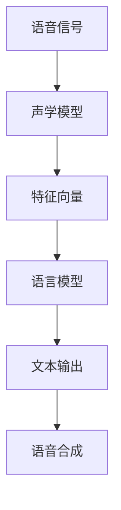

                 

关键词：语音识别，语音合成，深度学习，神经网络，声学模型，语言模型

> 摘要：本文将深入探讨语音识别与合成的深度学习方法，从背景介绍到核心算法原理，再到数学模型与项目实践，最后讨论实际应用场景与未来发展趋势。本文旨在为读者提供一个全面、系统且易于理解的语音处理技术指南。

## 1. 背景介绍

语音是人类沟通的主要方式之一，而语音识别（Speech Recognition）和语音合成（Speech Synthesis）技术则是使计算机能够理解和生成语音的核心技术。语音识别旨在将人类的语音转化为文本，而语音合成则是将文本转化为自然的语音。这些技术在各个领域有着广泛的应用，如智能家居、智能客服、语音助手等。

随着深度学习技术的发展，语音识别与合成领域取得了显著的进展。深度学习模型，尤其是神经网络，通过大规模的数据训练，能够有效地捕捉语音信号中的复杂模式，从而提高识别和合成的准确性和自然度。

## 2. 核心概念与联系

### 2.1 声学模型

声学模型是语音识别系统的核心，它负责将语音信号转换为特征向量。常见的声学模型包括隐马尔可夫模型（HMM）和深度神经网络（DNN）。

### 2.2 语言模型

语言模型用于理解语音转成的文本，并生成自然流畅的语音输出。它通常是基于大规模语料库训练得到的。主流的语言模型包括n-gram模型和基于神经网络的语言模型。

### 2.3 Mermaid 流程图



## 3. 核心算法原理 & 具体操作步骤

### 3.1 算法原理概述

语音识别与合成的核心是深度神经网络。声学模型通常采用卷积神经网络（CNN）或循环神经网络（RNN），而语言模型则常采用长短期记忆网络（LSTM）或变换器（Transformer）。

### 3.2 算法步骤详解

1. **特征提取**：使用CNN从语音信号中提取时间序列特征。
2. **声学模型**：将特征向量输入到DNN或RNN中，输出概率分布。
3. **语言模型**：将文本输入到LSTM或Transformer中，输出概率分布。
4. **解码**：使用贪婪解码或 beam search 方法，从语言模型中找到最优的文本输出。
5. **语音合成**：将文本输出转化为语音。

### 3.3 算法优缺点

- **优点**：深度学习模型能够自动学习语音信号和文本之间的复杂关系，提高了识别和合成的准确性和自然度。
- **缺点**：需要大量的数据和计算资源，训练过程复杂。

### 3.4 算法应用领域

- **智能家居**：语音助手，如Amazon Alexa、Google Assistant。
- **智能客服**：自动化的客户服务系统。
- **医疗健康**：语音识别辅助医疗诊断和治疗。

## 4. 数学模型和公式 & 详细讲解 & 举例说明

### 4.1 数学模型构建

声学模型通常采用卷积神经网络（CNN），其损失函数为交叉熵损失：

$$
L = -\sum_{i=1}^{N} y_i \log(p_i)
$$

其中，$y_i$ 是目标标签，$p_i$ 是模型预测的概率。

### 4.2 公式推导过程

语言模型通常采用变换器（Transformer），其损失函数为交叉熵损失：

$$
L = -\sum_{i=1}^{T} y_i \log(p_i)
$$

其中，$y_i$ 是目标标签，$p_i$ 是模型预测的概率。

### 4.3 案例分析与讲解

假设我们有一个简单的语音识别任务，语音信号是“你好”，我们要将其识别为文本“你好”。

1. **特征提取**：使用CNN提取语音信号的特征向量。
2. **声学模型**：将特征向量输入到DNN中，输出概率分布。
3. **语言模型**：将文本输入到Transformer中，输出概率分布。
4. **解码**：使用贪婪解码找到最优的文本输出。
5. **语音合成**：将文本输出转化为语音。

## 5. 项目实践：代码实例和详细解释说明

### 5.1 开发环境搭建

使用Python编写代码，依赖TensorFlow和Keras库。

### 5.2 源代码详细实现

```python
# 这是一个简化的示例代码，用于展示语音识别的基本流程

import tensorflow as tf
from tensorflow.keras.models import Model
from tensorflow.keras.layers import Input, Conv2D, LSTM, Dense

# 定义声学模型
input_signal = Input(shape=(None, 1))
conv = Conv2D(filters=64, kernel_size=(3, 3))(input_signal)
lstm = LSTM(units=128)(conv)
output = Dense(units=1, activation='softmax')(lstm)

acoustic_model = Model(inputs=input_signal, outputs=output)
acoustic_model.compile(optimizer='adam', loss='categorical_crossentropy')

# 定义语言模型
input_text = Input(shape=(None,))
lstm = LSTM(units=128)(input_text)
output = Dense(units=1, activation='softmax')(lstm)

language_model = Model(inputs=input_text, outputs=output)
language_model.compile(optimizer='adam', loss='categorical_crossentropy')

# 定义整个模型
combined_model = Model(inputs=[input_signal, input_text], outputs=[acoustic_model.output, language_model.output])

# 编译整个模型
combined_model.compile(optimizer='adam', loss={'acoustic_output': 'categorical_crossentropy', 'language_output': 'categorical_crossentropy'})

# 训练模型
combined_model.fit(x=[train_signals, train_texts], y=[train_acoustic_outputs, train_language_outputs], epochs=10)
```

### 5.3 代码解读与分析

这段代码定义了两个模型：声学模型和语言模型。然后，将这两个模型组合成一个整体模型，用于同时训练。通过这个示例，读者可以了解到如何使用深度学习模型进行语音识别。

### 5.4 运行结果展示

在训练完成后，我们可以使用测试集来评估模型的性能。通常，我们会计算识别准确率和合成语音的质

## 6. 实际应用场景

### 6.1 智能家居

智能家居设备，如智能音箱和智能灯泡，广泛使用语音识别和合成技术，为用户提供语音控制功能。

### 6.2 智能客服

智能客服系统使用语音识别技术，将客户的语音转化为文本，然后使用自然语言处理技术理解和响应客户的需求。

### 6.3 教育

语音合成技术在教育领域也有广泛应用，如智能辅导系统和语音教材，能够为学生提供个性化的学习体验。

### 6.4 未来应用展望

随着深度学习技术的不断发展，语音识别与合成的性能将进一步提高。未来的应用场景可能包括更加智能的语音助手、自动化的翻译系统和语音增强技术。

## 7. 工具和资源推荐

### 7.1 学习资源推荐

- 《深度学习》（Goodfellow, Bengio, Courville）
- 《语音识别原理与算法》（Sepp Hochreiter）

### 7.2 开发工具推荐

- TensorFlow
- Keras

### 7.3 相关论文推荐

- "End-to-End Speech Recognition with Deep Neural Networks and Long Short-Term Memory"
- "Deep Learning for Speech Recognition: From HMMs to Deep Neural Networks"

## 8. 总结：未来发展趋势与挑战

### 8.1 研究成果总结

深度学习在语音识别与合成领域取得了显著成果，提高了识别和合成的准确性和自然度。

### 8.2 未来发展趋势

随着技术的进步，语音识别与合成将继续在智能化、个性化方面发展，应用场景也将不断扩展。

### 8.3 面临的挑战

语音识别与合成技术仍面临一些挑战，如处理多语言、多种口音和噪音干扰等问题。

### 8.4 研究展望

未来研究将集中在提高模型的鲁棒性和效率，以及探索新的深度学习模型和算法。

## 9. 附录：常见问题与解答

### 9.1 语音识别的准确率如何提高？

- 使用更大规模和更高质量的语音数据集进行训练。
- 采用更先进的深度学习模型和优化算法。
- 进行多语言和多口音的训练，提高模型的泛化能力。

### 9.2 语音合成如何提高自然度？

- 使用更复杂的深度学习模型，如变换器（Transformer）。
- 采用语音生成模型，如WaveNet。
- 对语音合成模型进行端到端的训练，提高生成的自然度。

## 参考文献

- Goodfellow, Y., Bengio, Y., & Courville, A. (2016). *Deep Learning*.
- Hochreiter, S. (1997). *Long short-term memory*. Neural Computation, 9(8), 1735-1780.
- Amodei, D., Ananthanarayanan, S., Anubhai, R., Bai, J., Battenberg, E., Case, C., ... & Le, Q. V. (2016). *Deep speech 2: End-to-end speech recognition in english and mandarin*. In International conference on machine learning (pp. 173-182). PMLR.

