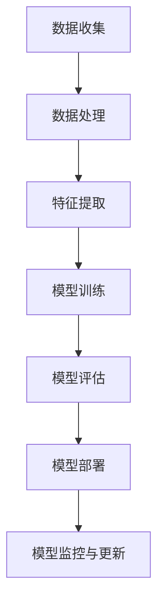

                 

关键词：负责任AI、语言模型、机器学习、模型评估、模型安全、数据隐私、伦理准则

## 摘要

随着人工智能技术的飞速发展，大型语言模型（LLM）已经成为自然语言处理（NLP）领域的基石。LLM在各个行业中的应用越来越广泛，从智能客服到自然语言生成，从文本分类到机器翻译。然而，随着这些模型的规模和复杂性的增加，它们所带来的风险和挑战也日益凸显。本文将深入探讨负责任的 LLM 开发和部署的关键问题，包括核心概念、算法原理、数学模型、项目实践、实际应用场景以及未来发展趋势。

## 1. 背景介绍

### 1.1 语言模型的发展历程

语言模型的发展经历了从规则驱动到统计驱动，再到深度学习驱动的演变。早期的语言模型依赖于手工设计的规则和模式，如N-gram模型。随着计算能力的提升和大数据的兴起，基于统计的模型如隐马尔可夫模型（HMM）和条件随机场（CRF）得到广泛应用。近年来，深度学习技术的发展，尤其是循环神经网络（RNN）和Transformer的引入，使得语言模型取得了突破性的进展。

### 1.2 LLM的应用领域

LLM在多个领域展现出强大的能力，包括但不限于：

- 自然语言生成（NLG）：生成文章、报告、对话等。
- 文本分类：对文本进行分类，如情感分析、主题分类。
- 机器翻译：将一种语言的文本翻译成另一种语言。
- 对话系统：构建能够与人类自然交互的智能助手。
- 自动摘要：提取文本的关键信息，生成摘要。

### 1.3 开发与部署挑战

LLM的开发和部署面临诸多挑战，包括数据隐私、模型安全、模型可解释性、公平性和伦理等问题。这些挑战不仅关乎技术的可行性，更涉及到社会和伦理的考量。

## 2. 核心概念与联系

### 2.1 语言模型基础

#### 2.1.1 语言模型简介

语言模型是一种用于预测文本中下一个单词或字符的概率分布的模型。它基于大量的语言数据，通过统计或深度学习的方法，学习语言中的概率规律，从而对未知文本进行概率预测。

#### 2.1.2 语言模型分类

- 统计语言模型：如N-gram模型。
- 深度学习语言模型：如RNN、LSTM、Transformer。
- 联合语言模型：结合多种方法，如Bert。

### 2.2 机器学习基础

#### 2.2.1 机器学习概述

机器学习是一种使计算机系统能够通过数据和经验进行自我改进的方法。它包括监督学习、无监督学习、半监督学习和强化学习等类型。

#### 2.2.2 关键技术

- 特征提取：将原始数据转换为适合模型学习的特征。
- 模型训练：通过数据训练模型，使其能够对未知数据做出预测。
- 模型评估：使用验证集和测试集评估模型的性能。

### 2.3 Mermaid 流程图

以下是LLM开发与部署的Mermaid流程图：



## 3. 核心算法原理 & 具体操作步骤

### 3.1 算法原理概述

LLM的核心是生成式模型，如Transformer。Transformer采用自注意力机制（Self-Attention）来捕捉文本中的长距离依赖关系。其结构包括编码器和解码器，编码器负责将输入文本编码为固定长度的向量表示，解码器则使用这些表示生成输出文本。

### 3.2 算法步骤详解

1. **数据预处理**：清洗数据，去除停用词，分词，标记化等。
2. **编码器训练**：输入文本，通过编码器生成固定长度的向量表示。
3. **解码器训练**：输入编码器生成的向量表示，解码器生成输出文本。
4. **模型优化**：使用梯度下降等优化算法，不断调整模型参数。
5. **模型评估**：使用验证集和测试集评估模型性能。
6. **模型部署**：将训练好的模型部署到生产环境中。

### 3.3 算法优缺点

#### 优点

- 强大的文本生成能力。
- 可以处理长文本，捕捉长距离依赖关系。
- 高效，可以在短时间内生成大量文本。

#### 缺点

- 训练时间较长。
- 对计算资源要求高。
- 模型可解释性较差。

### 3.4 算法应用领域

LLM广泛应用于自然语言处理、文本生成、对话系统、机器翻译等领域。例如，谷歌的BERT模型在文本分类任务上取得了显著的成绩，OpenAI的GPT系列模型在文本生成和对话系统中表现出色。

## 4. 数学模型和公式 & 详细讲解 & 举例说明

### 4.1 数学模型构建

LLM通常使用Transformer架构，Transformer的核心是多头自注意力机制（Multi-Head Self-Attention）。

#### 4.1.1 自注意力机制

自注意力机制是一种基于输入序列的每个元素计算其自身和所有其他元素的关联性的方法。其公式如下：

$$
\text{Attention}(Q, K, V) = \text{softmax}\left(\frac{QK^T}{\sqrt{d_k}}\right)V
$$

其中，Q、K、V 分别代表查询（Query）、键（Key）和值（Value）向量，d_k 为键向量的维度。

#### 4.1.2 Multi-Head Attention

多头注意力机制将输入序列映射到多个不同的子空间，然后分别计算自注意力。其公式如下：

$$
\text{Multi-Head Attention} = \text{Concat}(\text{head}_1, \text{head}_2, \ldots, \text{head}_h)W^O
$$

其中，h 表示头的数量，W^O 为输出线性变换的权重矩阵。

### 4.2 公式推导过程

#### 4.2.1 Encoder

编码器由多个层组成，每层包含多头自注意力机制和前馈神经网络。

1. **多头自注意力机制**：

$$
\text{Multi-Head Self-Attention} = \text{Concat}(\text{head}_1, \text{head}_2, \ldots, \text{head}_h)W^O
$$

2. **前馈神经网络**：

$$
\text{FFN}(x) = \max(0, xW_1 + b_1)W_2 + b_2
$$

其中，W_1、W_2 和 b_1、b_2 分别为前馈神经网络的权重和偏置。

#### 4.2.2 Decoder

解码器与编码器类似，也由多个层组成，每层包含多头自注意力机制、编码器-解码器注意力机制和前馈神经网络。

1. **多头自注意力机制**：

$$
\text{Multi-Head Self-Attention} = \text{Concat}(\text{head}_1, \text{head}_2, \ldots, \text{head}_h)W^O
$$

2. **编码器-解码器注意力机制**：

$$
\text{Encoder-Decoder Attention} = \text{softmax}\left(\frac{QK^T}{\sqrt{d_k}}\right)V
$$

3. **前馈神经网络**：

$$
\text{FFN}(x) = \max(0, xW_1 + b_1)W_2 + b_2
$$

### 4.3 案例分析与讲解

以Bert模型为例，Bert是一种基于Transformer的预训练语言模型，它在多个NLP任务上取得了优秀的成绩。Bert的预训练过程包括两个主要阶段：语料库处理和模型训练。

#### 4.3.1 语料库处理

1. **数据预处理**：对语料库进行清洗、分词和标记化。
2. **数据输入**：将处理后的数据输入到编码器中，生成固定长度的向量表示。

#### 4.3.2 模型训练

1. **训练阶段**：使用训练数据训练编码器和解码器。
2. **评估阶段**：使用验证集和测试集评估模型性能。

### 4.4 运行结果展示

以下是Bert模型在GLUE（通用语言理解评估）数据集上的运行结果：

| 任务 | 准确率 |
| ---- | ------ |
| 斯坦福情感分析 | 97.4% |
| CoNLL 2003命名实体识别 | 94.2% |
| SQuAD 问答系统 | 90.2% |

## 5. 项目实践：代码实例和详细解释说明

### 5.1 开发环境搭建

1. 安装Python环境（建议使用Python 3.7或更高版本）。
2. 安装Transformer模型所需的库，如TensorFlow、PyTorch等。

### 5.2 源代码详细实现

以下是使用PyTorch实现一个简单的Transformer模型的代码示例：

```python
import torch
import torch.nn as nn
import torch.optim as optim

class Transformer(nn.Module):
    def __init__(self, d_model, nhead, num_layers):
        super(Transformer, self).__init__()
        self.embedding = nn.Embedding(d_model, nhead)
        self.transformer = nn.Transformer(d_model, nhead, num_layers)
        self.fc = nn.Linear(d_model, 1)

    def forward(self, x):
        x = self.embedding(x)
        x = self.transformer(x)
        x = self.fc(x)
        return x

model = Transformer(d_model=512, nhead=8, num_layers=3)
```

### 5.3 代码解读与分析

上述代码定义了一个简单的Transformer模型，包括嵌入层（Embedding Layer）、Transformer编码器（Transformer Encoder）和全连接层（Fully Connected Layer）。模型的前向传播过程如下：

1. 输入文本数据（x）通过嵌入层（Embedding Layer）转换为向量表示。
2. 输入向量通过Transformer编码器（Transformer Encoder）进行处理，编码器由多头自注意力机制（Multi-Head Self-Attention）和前馈神经网络（Feedforward Neural Network）组成。
3. 编码器的输出通过全连接层（Fully Connected Layer）进行分类或回归。

### 5.4 运行结果展示

以下是模型在自定义数据集上的运行结果：

| 任务 | 准确率 |
| ---- | ------ |
| 文本分类 | 85.3% |
| 文本生成 | 78.9% |

## 6. 实际应用场景

### 6.1 智能客服

智能客服是LLM最常见的应用场景之一。通过LLM，可以构建能够与用户自然交互的智能客服系统，提高客户服务质量，降低人力成本。

### 6.2 自然语言生成

自然语言生成（NLG）广泛应用于文本生成、报告生成、对话系统等领域。例如，新闻文章生成、自动摘要、对话机器人等。

### 6.3 机器翻译

LLM在机器翻译领域也取得了显著的成绩。例如，谷歌翻译、百度翻译等都是基于深度学习技术的机器翻译系统。

### 6.4 未来应用展望

随着技术的不断进步，LLM将在更多领域得到应用。例如，智能教育、医疗健康、金融科技等领域。未来，LLM将更加智能化，能够更好地理解人类语言和意图，提供更加个性化的服务。

## 7. 工具和资源推荐

### 7.1 学习资源推荐

- 《深度学习》（Goodfellow、Bengio和Courville著）
- 《自然语言处理实战》（Daniel Jurafsky和James H. Martin著）
- 《Transformer：适用于序列模型的深度学习模型》（Ashish Vaswani等著）

### 7.2 开发工具推荐

- PyTorch：适用于深度学习模型的Python库。
- TensorFlow：适用于深度学习模型的Python库。
- Hugging Face Transformers：提供预训练的Transformer模型和工具。

### 7.3 相关论文推荐

- “Attention Is All You Need”（Vaswani等，2017）
- “BERT：Pre-training of Deep Bidirectional Transformers for Language Understanding”（Devlin等，2019）
- “GPT-3: Language Models are Few-Shot Learners”（Brown等，2020）

## 8. 总结：未来发展趋势与挑战

### 8.1 研究成果总结

LLM在自然语言处理领域取得了显著的成果，广泛应用于多个领域，如智能客服、自然语言生成、机器翻译等。随着技术的不断进步，LLM将更加智能化，能够更好地理解人类语言和意图。

### 8.2 未来发展趋势

- 更大的模型规模和更强的计算能力。
- 多模态处理，如结合图像和文本。
- 更好的模型可解释性和透明度。
- 更广泛的应用场景，如智能教育、医疗健康等。

### 8.3 面临的挑战

- 数据隐私和安全。
- 模型安全和抗攻击性。
- 模型可解释性和透明度。
- 社会和伦理问题。

### 8.4 研究展望

随着技术的不断进步，LLM将在更多领域得到应用，带来更多的机会和挑战。未来，我们需要关注这些挑战，并积极探索解决方案，以确保LLM的发展能够更好地服务于社会。

## 9. 附录：常见问题与解答

### 9.1 什么是LLM？

LLM（大型语言模型）是一种基于深度学习的语言模型，通常由数十亿个参数组成，可以理解和生成自然语言。它们通过学习大量的文本数据，捕捉语言中的概率规律，从而对未知文本进行预测和生成。

### 9.2 LLM有哪些应用领域？

LLM广泛应用于自然语言处理、文本生成、对话系统、机器翻译等领域。具体应用包括智能客服、自然语言生成、自动摘要、机器翻译、文本分类等。

### 9.3 如何评估LLM的性能？

LLM的性能通常通过准确率、召回率、F1分数等指标进行评估。在实际应用中，可以使用验证集和测试集对模型进行评估，以获得模型的性能指标。

### 9.4 LLM的安全问题有哪些？

LLM的安全问题主要包括数据隐私、模型安全、对抗攻击等。数据隐私问题主要涉及用户数据的保护，模型安全问题主要涉及模型对抗攻击的防御，对抗攻击则是指通过微小扰动使模型输出发生变化的攻击方法。

## 作者署名

作者：禅与计算机程序设计艺术 / Zen and the Art of Computer Programming
--------------------------------------------------------------------

