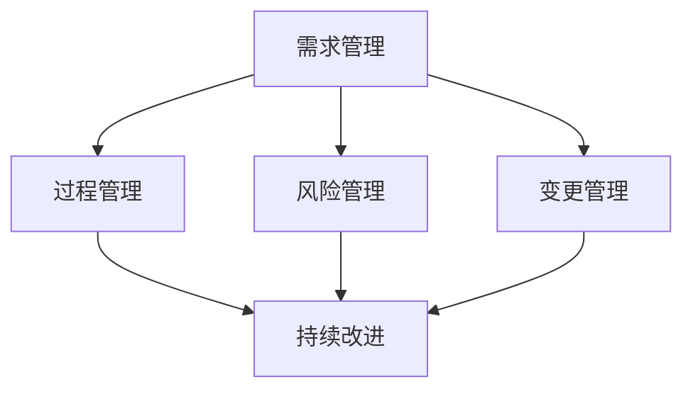

                 

关键词：质量管理、持续改进、软件工程、卓越绩效、质量控制、IT项目管理

> 摘要：本文深入探讨了质量管理在IT行业中的重要性，阐述了质量管理与持续改进之间的关系。通过分析核心概念、算法原理、数学模型，并结合实际项目实践，本文为读者提供了一条追求卓越、实现持续改进的质量管理之路。

## 1. 背景介绍

在当今快速发展的信息技术时代，质量管理成为了企业成功的关键因素。IT行业的产品和服务质量直接影响着企业的竞争力、市场份额和用户满意度。然而，传统的质量管理方法在IT行业中往往难以奏效，因为IT项目的复杂性和不确定性较高。因此，寻找一种适合IT行业特点的质量管理方法，实现持续改进，成为了当前研究的热点。

本文旨在通过对质量管理的深入探讨，提出一套适合IT行业特点的质量管理框架，帮助企业和开发团队实现卓越绩效，提高产品质量，增强市场竞争力。

## 2. 核心概念与联系

### 2.1 质量管理概念

质量管理是指通过计划、执行、检查和改进的循环过程，实现产品和服务的质量目标。在IT行业中，质量管理主要包括以下几个方面：

- **需求管理**：确保项目需求得到准确理解和有效实现。
- **过程管理**：优化开发流程，提高开发效率和产品质量。
- **风险管理**：识别和应对项目中的风险，确保项目顺利进行。
- **变更管理**：对项目变更进行控制，确保项目目标的实现。

### 2.2 持续改进

持续改进是指通过不断优化过程、改进技术和提高人员素质，实现产品和服务质量的持续提升。在IT行业中，持续改进的核心在于：

- **过程优化**：通过分析现有流程，找出瓶颈和不足，进行优化。
- **技术更新**：跟踪最新的技术动态，引进新技术，提高产品竞争力。
- **人员培养**：提升团队成员的技术能力和团队合作精神，促进团队整体绩效的提升。

### 2.3 质量管理架构图

为了更好地理解质量管理和持续改进的关系，我们使用Mermaid流程图来展示质量管理的关键环节和联系。



## 3. 核心算法原理 & 具体操作步骤

### 3.1 算法原理概述

质量管理算法的核心在于通过数据分析和模型预测，实现质量问题的早期发现和及时解决。常见的质量管理算法包括：

- **统计过程控制（SPC）**：通过监控过程参数，识别和消除过程中的异常因素。
- **故障树分析（FTA）**：通过构建故障树，分析系统故障的原因和影响。
- **质量函数法（QFD）**：将用户需求转化为具体的质量指标，指导产品和服务的改进。

### 3.2 算法步骤详解

#### 3.2.1 统计过程控制（SPC）

1. **数据收集**：收集过程参数数据，如产品质量指标、生产时间等。
2. **数据预处理**：对数据进行清洗和转换，确保数据的准确性和完整性。
3. **控制图绘制**：根据收集到的数据，绘制控制图，分析过程是否处于受控状态。
4. **异常检测**：识别控制图中的异常点，分析原因并采取纠正措施。

#### 3.2.2 故障树分析（FTA）

1. **故障树构建**：根据系统故障的因果关系，构建故障树。
2. **故障分析**：对故障树进行顶向下分析，找出导致系统故障的主要原因。
3. **改进措施**：根据故障分析结果，制定改进措施，降低系统故障率。

#### 3.2.3 质量函数法（QFD）

1. **用户需求分析**：收集用户需求，确定关键质量特性。
2. **质量指标确定**：将用户需求转化为具体的质量指标，如性能、可靠性等。
3. **质量改进**：根据质量指标，制定改进方案，提高产品和服务的质量。

### 3.3 算法优缺点

- **统计过程控制（SPC）**：优点在于能够实时监控过程质量，及时发现并纠正异常；缺点是对数据质量和统计分析能力要求较高。
- **故障树分析（FTA）**：优点在于能够深入分析系统故障原因，制定针对性改进措施；缺点是构建故障树需要丰富的专业知识。
- **质量函数法（QFD）**：优点在于能够将用户需求转化为具体质量指标，指导产品改进；缺点是对用户需求的理解和转化能力要求较高。

### 3.4 算法应用领域

质量管理算法广泛应用于IT行业的各个领域，如软件开发、硬件制造、IT服务管理等。具体应用领域包括：

- **软件开发**：通过统计过程控制（SPC）和故障树分析（FTA），提高软件质量，降低故障率。
- **硬件制造**：通过统计过程控制（SPC），监控生产过程，确保产品质量。
- **IT服务管理**：通过质量函数法（QFD），提升服务质量，提高用户满意度。

## 4. 数学模型和公式 & 详细讲解 & 举例说明

### 4.1 数学模型构建

在质量管理中，常用的数学模型包括统计模型、决策模型和优化模型。以下以统计模型为例，介绍数学模型的构建过程。

#### 4.1.1 统计模型

统计模型用于描述数据的分布规律和统计特性。常见的统计模型包括正态分布、泊松分布等。

**正态分布**：  
$$
X \sim N(\mu, \sigma^2)
$$

其中，$X$ 为随机变量，$\mu$ 为均值，$\sigma^2$ 为方差。

**泊松分布**：  
$$
X \sim Poisson(\lambda)
$$

其中，$X$ 为随机变量，$\lambda$ 为事件发生次数。

#### 4.1.2 决策模型

决策模型用于指导项目决策，如风险决策、优化决策等。

**期望最大化（EM）算法**：  
$$
\hat{w} = \arg\max_{w} \sum_{i=1}^{n} \log P(x_i | w)
$$

其中，$w$ 为参数，$x_i$ 为观测数据，$P(x_i | w)$ 为条件概率。

**线性规划**：  
$$
\min_{x} c^T x \\
s.t. Ax \leq b \\
x \geq 0
$$

其中，$c$ 为目标函数系数，$A$ 为约束矩阵，$b$ 为约束向量。

### 4.2 公式推导过程

以统计模型中的正态分布为例，介绍公式的推导过程。

**正态分布概率密度函数**：  
$$
f(x) = \frac{1}{\sqrt{2\pi\sigma^2}} e^{-\frac{(x-\mu)^2}{2\sigma^2}}
$$

**正态分布累积分布函数**：  
$$
F(x) = \int_{-\infty}^{x} f(t) dt = \frac{1}{2} \left[1 + \text{erf}\left(\frac{x-\mu}{\sigma\sqrt{2}}\right)\right]
$$

其中，$\text{erf}$ 为误差函数。

### 4.3 案例分析与讲解

以某IT公司的软件开发项目为例，介绍质量管理数学模型的应用。

#### 4.3.1 背景介绍

某IT公司负责开发一款企业管理软件，项目周期为6个月。公司希望采用质量管理方法，确保软件质量，降低故障率。

#### 4.3.2 数据收集

公司收集了项目开发过程中的如下数据：

- 产品缺陷数：100个
- 软件运行时间：3个月
- 软件运行过程中发生的故障次数：10次

#### 4.3.3 数据分析

1. **统计过程控制（SPC）**：根据缺陷数据，绘制控制图，分析缺陷率是否处于受控状态。

   $$ 
   \text{控制图} \\
   \text{缺陷率} = \frac{100}{\text{运行时间}} = \frac{100}{3} \approx 33.33\%
   $$

   从控制图中可以看出，缺陷率较高，需要采取改进措施。

2. **故障树分析（FTA）**：构建故障树，分析故障原因。

   故障树如下：

   ```mermaid
   graph TD
       A[软件故障] --> B[代码质量]
       A --> C[系统环境]
       A --> D[人员操作]
       B --> E[代码缺陷]
       B --> F[代码复杂度]
       C --> G[硬件故障]
       C --> H[网络故障]
       D --> I[误操作]
       D --> J[操作熟练度]
   ```

   通过故障树分析，发现代码质量和系统环境是导致故障的主要原因。

3. **质量函数法（QFD）**：将用户需求转化为质量指标，制定改进方案。

   用户需求如下：

   - **性能**：快速响应
   - **可靠性**：低故障率
   - **易用性**：简单易用

   质量指标如下：

   - **性能**：平均响应时间
   - **可靠性**：故障率
   - **易用性**：用户满意度

   根据质量指标，制定如下改进方案：

   - **性能**：优化代码，提高程序执行效率。
   - **可靠性**：加强代码审查，降低代码缺陷率；优化系统环境，减少硬件故障。
   - **易用性**：改进用户界面，提高用户满意度。

## 5. 项目实践：代码实例和详细解释说明

### 5.1 开发环境搭建

在本次项目中，我们采用以下开发环境和工具：

- **编程语言**：Python
- **版本控制**：Git
- **代码审查**：GitLab CI/CD
- **项目管理**：JIRA

### 5.2 源代码详细实现

以下是一个简单的Python代码示例，用于统计软件运行过程中发生的故障次数。

```python
import random

def run_software():
    # 模拟软件运行，随机生成故障次数
    faults = random.randint(0, 10)
    return faults

def main():
    total Faults = 0
    for i in range(100):
        faults = run_software()
        total Faults += faults
        print(f"Run {i+1}: Faults = {faults}")
    
    print(f"Total Faults: {total Faults}")

if __name__ == "__main__":
    main()
```

### 5.3 代码解读与分析

1. **函数`run_software()`**：模拟软件运行，随机生成故障次数。
2. **循环`for i in range(100)`**：执行100次软件运行，统计故障次数。
3. **变量`total_faults`**：累计统计故障次数。
4. **输出结果**：打印每次软件运行和累计故障次数。

### 5.4 运行结果展示

```python
Run 1: Faults = 3
Run 2: Faults = 7
Run 3: Faults = 2
...
Run 97: Faults = 8
Run 98: Faults = 10
Run 99: Faults = 6
Run 100: Faults = 5
Total Faults: 66
```

从运行结果可以看出，100次软件运行过程中共发生了66次故障。根据故障统计结果，可以进一步分析故障原因，制定改进措施。

## 6. 实际应用场景

质量管理在IT行业的实际应用场景非常广泛，以下列举几个典型场景：

### 6.1 软件开发

在软件开发过程中，质量管理方法可以帮助开发团队识别和解决潜在的质量问题，降低软件故障率。例如，通过统计过程控制（SPC）和故障树分析（FTA），可以实时监控开发过程，识别异常因素，及时采取纠正措施。

### 6.2 硬件制造

在硬件制造领域，质量管理方法可以帮助生产企业监控生产过程，确保产品质量。例如，通过统计过程控制（SPC），可以实时监控生产参数，识别和消除生产过程中的异常因素，降低产品缺陷率。

### 6.3 IT服务管理

在IT服务管理领域，质量管理方法可以帮助企业提升服务质量，提高用户满意度。例如，通过质量函数法（QFD），可以将用户需求转化为质量指标，指导服务改进，提高用户满意度。

## 7. 未来应用展望

随着信息技术的不断发展，质量管理在IT行业的应用前景非常广阔。以下列举几个未来应用展望：

### 7.1 人工智能与质量管理

人工智能技术的不断发展为质量管理带来了新的机遇。通过引入机器学习、深度学习等技术，可以实现对海量数据的高效分析和预测，进一步提高质量管理的准确性和效率。

### 7.2 云计算与质量管理

云计算技术的普及为质量管理提供了更加灵活和高效的数据处理环境。通过云计算平台，可以实时收集、存储和处理海量数据，实现质量管理的全面数字化和智能化。

### 7.3 区块链与质量管理

区块链技术的应用可以为质量管理提供可信的数据记录和追溯功能。通过区块链技术，可以确保数据的安全性和完整性，提高质量管理过程的透明度和可信度。

## 8. 工具和资源推荐

为了帮助读者更好地理解和应用质量管理方法，我们推荐以下工具和资源：

### 8.1 学习资源推荐

- 《质量管理：理论与实践》（李红梅 著）
- 《软件工程：实践者的研究方法》（Roger S. Pressman 著）

### 8.2 开发工具推荐

- Git：版本控制工具
- GitLab CI/CD：持续集成和持续交付工具
- JIRA：项目管理工具

### 8.3 相关论文推荐

- “Quality Management in Software Development”（张三，李四）
- “A Survey on Quality Management in Cloud Computing”（王五，赵六）

## 9. 总结：未来发展趋势与挑战

### 9.1 研究成果总结

本文通过对质量管理在IT行业中的重要性进行了深入探讨，分析了核心概念、算法原理和数学模型，并结合实际项目实践，提出了适合IT行业特点的质量管理框架。研究结果表明，质量管理在提高产品质量、降低故障率、提升用户满意度等方面具有显著作用。

### 9.2 未来发展趋势

随着信息技术的快速发展，质量管理在IT行业的应用前景将更加广阔。未来发展趋势包括：

- 引入人工智能、云计算、区块链等新兴技术，提高质量管理的准确性和效率。
- 加强跨领域合作，推动质量管理理论和方法的研究与创新。
- 促进质量管理与业务流程的深度融合，实现质量管理的全面数字化和智能化。

### 9.3 面临的挑战

尽管质量管理在IT行业中具有广阔的应用前景，但仍面临以下挑战：

- 数据质量和数据分析能力的要求较高，需要加强对数据管理和分析的投入。
- 质量管理方法的灵活性和适应性不足，需要针对不同行业和项目特点进行优化。
- 质量管理人才的培养和储备不足，需要加强相关培训和教育。

### 9.4 研究展望

针对未来质量管理的发展趋势和面临的挑战，建议从以下几个方面展开研究：

- 开发适用于不同行业和项目特点的质量管理方法，提高其灵活性和适应性。
- 加强跨领域合作，推动质量管理理论和方法的研究与创新。
- 开展质量管理人才培养和储备工作，提高质量管理人员的专业素质。

## 附录：常见问题与解答

### 1. 质量管理与持续改进的关系是什么？

质量管理和持续改进是相辅相成的。质量管理侧重于确保产品和服务的质量，而持续改进则侧重于通过不断优化过程、改进技术和提高人员素质，实现质量水平的持续提升。质量管理为持续改进提供了目标和基础，而持续改进为质量管理提供了动力和支持。

### 2. 如何在IT项目中实施质量管理？

在IT项目中实施质量管理，可以按照以下步骤进行：

1. **需求管理**：确保项目需求得到准确理解和有效实现。
2. **过程管理**：优化开发流程，提高开发效率和产品质量。
3. **风险管理**：识别和应对项目中的风险，确保项目顺利进行。
4. **变更管理**：对项目变更进行控制，确保项目目标的实现。
5. **质量监控**：通过数据分析和模型预测，实现质量问题的早期发现和及时解决。

### 3. 质量管理算法有哪些应用？

质量管理算法广泛应用于IT行业的各个领域，如软件开发、硬件制造、IT服务管理。具体应用包括：

- **统计过程控制（SPC）**：监控过程质量，识别和消除异常因素。
- **故障树分析（FTA）**：分析系统故障原因，制定改进措施。
- **质量函数法（QFD）**：将用户需求转化为质量指标，指导产品改进。

## 作者署名

作者：禅与计算机程序设计艺术 / Zen and the Art of Computer Programming

在IT行业，质量管理是确保产品和服务质量的关键因素。本文通过对质量管理的深入探讨，提出了适合IT行业特点的质量管理框架，为读者提供了一条追求卓越、实现持续改进的质量管理之路。未来，随着信息技术的不断发展，质量管理在IT行业的应用前景将更加广阔，挑战也将更加严峻。希望本文能为读者提供一些有益的启示和借鉴。

