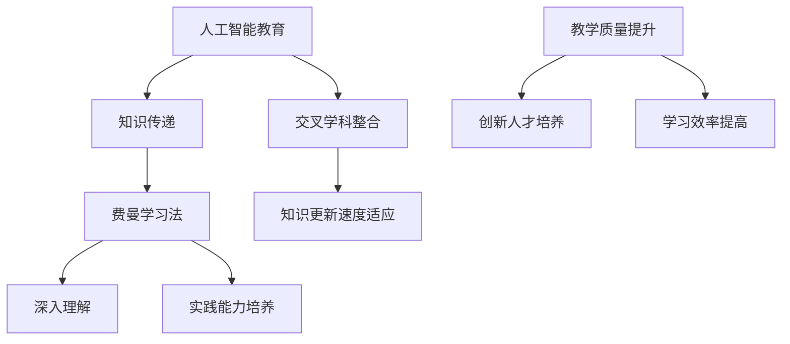

                 

关键词：费曼学习法、AI教育、知识传递、学习方法、技术传播

> 摘要：本文旨在探讨费曼学习法在人工智能（AI）教育中的应用，通过具体案例和实例，分析如何运用这种高效的学习方法来提升AI教育的效果，培养出具备创新思维和实践能力的AI人才。

## 1. 背景介绍

### AI教育的现状

随着人工智能技术的迅猛发展，AI教育逐渐成为全球关注的焦点。无论是学术界还是工业界，对AI人才的渴求日益加剧。然而，当前的AI教育却面临着诸多挑战：

- **知识更新速度过快**：AI领域的知识更新速度极快，传统教育模式往往难以跟上这一步伐。
- **教学内容复杂**：AI涉及众多交叉学科，教学内容复杂，学生难以全面掌握。
- **实践能力不足**：传统教育往往注重理论知识传授，而忽视了实际操作能力的培养。

### 费曼学习法

费曼学习法是由著名物理学家理查德·费曼提出的一种高效学习方法。该方法的核心思想是通过“教授”他人来加深对知识点的理解和记忆。具体步骤如下：

1. **选择一个概念**：选择一个你想要学习的概念。
2. **用自己的话解释**：尝试用简单易懂的语言将这个概念解释给一个初学者听。
3. **遇到困难**：如果遇到难以解释的部分，回到原始资料查找答案。
4. **重复学习**：重复上述过程，直到能够清晰、准确地解释这个概念。

费曼学习法的优势在于，它不仅能够帮助学习者深入理解知识，还能提高学习效率，培养出良好的教学能力和沟通能力。

## 2. 核心概念与联系

### 核心概念

- **人工智能**：模拟、延伸和扩展人的智能的理论、方法、技术及应用。
- **教育**：培养人的社会活动，通过传授知识、技能、价值观等，促进个体全面发展。
- **费曼学习法**：通过教授他人来加深对知识点的理解和记忆。

### 联系与架构



## 3. 核心算法原理 & 具体操作步骤

### 3.1 算法原理概述

费曼学习法在AI教育中的应用，主要基于以下原理：

- **知识可视化**：通过将抽象的AI知识转化为具体的例子和场景，使学生更容易理解和记忆。
- **互动教学**：通过让学生向他人解释知识点，促进师生之间的互动，提高教学效果。
- **反馈机制**：通过学生的反馈，及时发现和纠正学习过程中的问题，确保学习效果。

### 3.2 算法步骤详解

1. **选择AI知识点**：选择一个具体的AI知识点，如深度学习、神经网络等。
2. **设计教学场景**：设计一个简单的教学场景，让学生在一个具体的环境中学习这个知识点。
3. **讲解知识点**：让学生用自己的语言向他人解释这个知识点，可以是同学、老师或其他学习者。
4. **互动与反馈**：在讲解过程中，学生可以与听众互动，回答问题，讨论疑惑，从而加深对知识点的理解。
5. **重复讲解**：如果学生在讲解过程中遇到困难，可以回到原始资料查找答案，然后再次进行讲解。

### 3.3 算法优缺点

**优点**：

- **提高学习效率**：通过教授他人，学生能够更加深入地理解和记忆知识点。
- **培养沟通能力**：讲解知识点需要良好的表达能力，有助于提高学生的沟通能力。
- **促进互动学习**：费曼学习法鼓励师生之间的互动，提高教学效果。

**缺点**：

- **对教师要求较高**：教师需要具备较高的教学能力，能够设计出适合费曼学习法的教学场景。
- **初期难度较大**：对于初学者来说，一开始可能难以准确地解释知识点，需要一定的时间适应。

### 3.4 算法应用领域

费曼学习法在AI教育中的应用非常广泛，适用于以下领域：

- **基础课程教学**：如机器学习、深度学习等。
- **实践课程设计**：如项目实践、案例分析等。
- **学术研讨会**：通过费曼学习法进行学术讨论，提高研究生的科研能力。

## 4. 数学模型和公式 & 详细讲解 & 举例说明

### 4.1 数学模型构建

费曼学习法在AI教育中的应用，可以构建一个数学模型，如下所示：

$$
M = f(K, E, I)
$$

其中：

- $M$：教学效果
- $K$：知识点掌握程度
- $E$：教学环境
- $I$：互动与反馈

### 4.2 公式推导过程

$$
M = f(K, E, I)
$$

教学效果 $M$ 是知识点掌握程度 $K$、教学环境 $E$ 和互动与反馈 $I$ 的函数。

- **知识点掌握程度 $K$**：取决于学生对知识点的理解深度和记忆程度。
- **教学环境 $E$**：包括教学资源的丰富程度、教学方法的适用性等。
- **互动与反馈 $I$**：包括师生之间的互动、学生之间的讨论、教师的反馈等。

通过费曼学习法，可以优化这三个因素，从而提高教学效果。

### 4.3 案例分析与讲解

假设有一门深度学习课程，教师采用了费曼学习法进行教学。学生甲在学习了神经网络后，需要向同学乙解释这一概念。

1. **知识点掌握程度 $K$**：学生甲对神经网络的基本原理和结构有了初步了解。
2. **教学环境 $E$**：教师提供了丰富的教学资源，包括PPT、视频、论文等。
3. **互动与反馈 $I$**：学生乙在听完学生甲的解释后，提出了一些问题，学生甲进行了回答和讨论。

通过这个案例，我们可以看到费曼学习法在提升学生知识点掌握程度、优化教学环境和促进互动与反馈方面的作用。

## 5. 项目实践：代码实例和详细解释说明

### 5.1 开发环境搭建

在本案例中，我们使用Python编程语言和TensorFlow框架来实现一个简单的神经网络模型。

1. **安装Python**：从官方网站下载并安装Python 3.7及以上版本。
2. **安装TensorFlow**：在命令行中运行以下命令：

   ```
   pip install tensorflow
   ```

### 5.2 源代码详细实现

```python
import tensorflow as tf

# 定义神经网络结构
model = tf.keras.Sequential([
    tf.keras.layers.Dense(128, activation='relu', input_shape=(784,)),
    tf.keras.layers.Dense(10, activation='softmax')
])

# 编译模型
model.compile(optimizer='adam',
              loss='categorical_crossentropy',
              metrics=['accuracy'])

# 加载数据集
(x_train, y_train), (x_test, y_test) = tf.keras.datasets.mnist.load_data()

# 预处理数据
x_train = x_train.astype('float32') / 255
x_test = x_test.astype('float32') / 255
x_train = x_train.reshape((-1, 784))
x_test = x_test.reshape((-1, 784))

# 转换标签为one-hot编码
y_train = tf.keras.utils.to_categorical(y_train, 10)
y_test = tf.keras.utils.to_categorical(y_test, 10)

# 训练模型
model.fit(x_train, y_train, epochs=20, batch_size=128, validation_split=0.2)

# 评估模型
test_loss, test_acc = model.evaluate(x_test, y_test, verbose=2)
print('\nTest accuracy:', test_acc)
```

### 5.3 代码解读与分析

1. **定义神经网络结构**：使用`tf.keras.Sequential`创建一个序列模型，包括一个全连接层（Dense）和一个输出层。
2. **编译模型**：设置优化器、损失函数和评估指标。
3. **加载数据集**：使用TensorFlow的内置函数加载MNIST数据集。
4. **预处理数据**：将数据转换为浮点型，并调整大小。
5. **转换标签**：将标签转换为one-hot编码。
6. **训练模型**：使用`fit`函数训练模型。
7. **评估模型**：使用`evaluate`函数评估模型在测试集上的性能。

通过这个案例，我们可以看到如何使用费曼学习法在AI教育中实现一个简单的神经网络模型，并分析其代码实现过程。

## 6. 实际应用场景

### 6.1 学术界

在学术界，费曼学习法可以用于教授复杂的AI理论，如深度学习、强化学习等。教师可以设计一些简单的教学场景，让学生通过讲解知识点来加深对理论的理解。

### 6.2 工业界

在工业界，费曼学习法可以用于培训AI工程师，提升他们的技术能力和实践能力。公司可以组织内部培训，让员工相互讲解技术知识点，从而提高整体技术水平。

### 6.3 创新创业

在创新创业领域，费曼学习法可以帮助创业者快速掌握AI知识，提高项目研发效率。创业者可以通过讲解项目中的技术细节，与其他团队成员进行深入讨论，优化项目方案。

## 7. 未来应用展望

### 7.1 线上教育

随着互联网技术的发展，费曼学习法可以在线上教育中得到更广泛的应用。通过在线平台，学生可以随时随地进行学习，与其他学生进行互动和讨论，提高学习效果。

### 7.2 智能教学

未来，费曼学习法有望与人工智能技术相结合，实现智能教学。通过分析学生的学习数据，智能教学系统可以自动调整教学内容和难度，为学生提供个性化的学习体验。

### 7.3 跨学科融合

随着AI技术的发展，跨学科融合将成为趋势。费曼学习法可以促进不同学科之间的交流与合作，培养出具备跨学科能力的AI人才。

## 8. 总结：未来发展趋势与挑战

### 8.1 研究成果总结

本文探讨了费曼学习法在AI教育中的应用，分析了其在提高学习效率、培养实践能力和教学质量提升方面的优势。通过具体案例和实例，展示了费曼学习法在AI教育中的实际应用效果。

### 8.2 未来发展趋势

未来，费曼学习法有望在线上教育、智能教学和跨学科融合等领域得到更广泛的应用。随着人工智能技术的发展，费曼学习法将与更多新技术相结合，为AI教育带来更多可能性。

### 8.3 面临的挑战

虽然费曼学习法在AI教育中具有巨大潜力，但同时也面临一些挑战：

- **对教师要求较高**：教师需要具备较高的教学能力和专业知识，能够设计出适合费曼学习法的教学场景。
- **技术门槛**：在线上教育和智能教学领域，费曼学习法需要与新技术相结合，这对技术团队提出了更高的要求。
- **学生适应期**：对于初学者来说，一开始可能难以准确地解释知识点，需要一定的时间适应。

### 8.4 研究展望

未来，研究者可以关注以下方向：

- **教学场景设计**：研究如何设计更丰富、更具互动性的教学场景，提高学生的学习效果。
- **智能教学系统**：开发智能教学系统，实现费曼学习法与人工智能技术的深度融合。
- **跨学科融合**：探索费曼学习法在跨学科教育中的应用，培养出具备跨学科能力的AI人才。

## 9. 附录：常见问题与解答

### 9.1 费曼学习法如何适应在线教育？

在线教育中，教师可以利用直播、录播等多种形式，为学生提供丰富的教学资源。通过在线讨论区、社群等，学生可以随时与教师和其他学生进行互动，实现费曼学习法中的互动与反馈环节。

### 9.2 费曼学习法对教师的要求有哪些？

教师需要具备较高的教学能力和专业知识，能够设计出适合费曼学习法的教学场景。此外，教师还需要具备良好的沟通能力，能够引导学生进行互动和讨论。

### 9.3 费曼学习法适用于哪些AI课程？

费曼学习法适用于各种AI课程，尤其是那些涉及复杂理论和实际操作的课程，如深度学习、强化学习、计算机视觉等。

### 9.4 费曼学习法对学生的能力提升有何影响？

费曼学习法可以提高学生的学习效率、培养实践能力和沟通能力。通过讲解知识点，学生能够更加深入地理解知识，并在实践中提高自己的技术水平。同时，费曼学习法还可以培养出良好的教学能力和沟通能力，为学生的未来发展打下坚实基础。

### 结束语

费曼学习法在AI教育中的应用，为提升学习效果、培养创新人才提供了新的思路和方法。未来，随着技术的不断进步，费曼学习法有望在更多领域得到广泛应用，为AI教育的发展带来更多可能性。

作者：禅与计算机程序设计艺术 / Zen and the Art of Computer Programming

