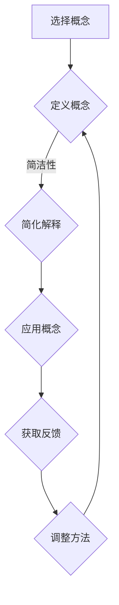

                 

关键词：费曼学习法、人工智能教育、知识传授、学习策略、教育方法

> 摘要：本文探讨了一种有效的学习策略——费曼学习法，在人工智能（AI）教育中的应用。通过分析费曼学习法的核心原则，结合实际案例，本文旨在为教育工作者和学生提供一种实用的教学和学习方法，以促进深度理解和知识的有效传授。

## 1. 背景介绍

随着人工智能技术的飞速发展，AI教育逐渐成为教育和研究领域的热点。然而，传统的教育方法往往注重知识的传授和记忆，而忽略了学生自主学习和创新能力的重要性。因此，寻找一种更加有效、富有启发性的教育方法变得至关重要。

费曼学习法（Feynman Technique）起源于著名物理学家理查德·费曼（Richard Feynman）的教学方法。费曼学习法强调通过简洁、明确的方式传授知识，旨在培养学生的批判性思维和深度理解。这种方法在AI教育中的应用，有助于提高学生的学习效果和创新能力。

## 2. 核心概念与联系

### 2.1 费曼学习法的核心原则

费曼学习法的核心原则可以概括为以下四个方面：

1. **简洁性**：用最简单的语言解释复杂的概念，确保理解和传达的准确性。
2. **反馈**：在教学过程中，不断接收反馈并调整教学方法，以提高学习效果。
3. **应用**：将所学知识应用于实际问题和情景中，加深对知识的理解。
4. **反思**：在学习过程中进行自我反思，识别和理解知识的局限性。

### 2.2 费曼学习法的架构

为了更好地理解费曼学习法，我们使用Mermaid流程图来展示其基本架构。



在这个流程图中，我们从选择一个概念开始，通过简洁性原则进行定义和简化解释，然后将这些知识应用于实际情境中，获取反馈并进行调整。这个循环不断进行，直到达到深度理解。

## 3. 核心算法原理 & 具体操作步骤

### 3.1 算法原理概述

费曼学习法的主要原理是通过简化和应用来加深对知识的理解。具体来说，它包括以下步骤：

1. **选择一个概念**：选择一个你想要深入学习的概念或主题。
2. **定义概念**：用你自己的话来解释这个概念，确保你能够清楚地传达它的核心含义。
3. **简化解释**：通过使用简单的语言和例子，将你的解释进一步简化，使其更加易于理解。
4. **应用概念**：尝试将这个概念应用于实际问题和情境中，以验证你的理解是否准确。
5. **获取反馈**：与他人讨论你的解释和应用，获取他们的反馈，以便调整和完善你的理解。
6. **调整方法**：根据反馈，重新解释和应用概念，直到你能够清晰地传达和理解它。

### 3.2 算法步骤详解

#### 步骤1：选择一个概念

选择一个你想要深入学习的概念或主题。这个概念可以是任何你感兴趣的内容，例如机器学习中的神经网络、深度学习中的卷积神经网络等。

#### 步骤2：定义概念

用你自己的话来解释这个概念，确保你能够清楚地传达它的核心含义。这个过程可以帮助你明确自己的理解，并发现可能的误区。

#### 步骤3：简化解释

通过使用简单的语言和例子，将你的解释进一步简化，使其更加易于理解。这个步骤有助于你发现复杂的知识点背后的简单原理。

#### 步骤4：应用概念

尝试将这个概念应用于实际问题和情境中，以验证你的理解是否准确。例如，你可以尝试使用神经网络来解决一个实际问题，或者通过卷积神经网络来处理图像数据。

#### 步骤5：获取反馈

与他人讨论你的解释和应用，获取他们的反馈，以便调整和完善你的理解。这个步骤可以帮助你从不同的角度理解知识，并发现自己的不足之处。

#### 步骤6：调整方法

根据反馈，重新解释和应用概念，直到你能够清晰地传达和理解它。这个过程是一个循环迭代的过程，可以帮助你不断深化对知识的理解。

### 3.3 算法优缺点

#### 优点

1. **提高学习效果**：费曼学习法通过简洁和应用的结合，可以帮助学生更好地理解和掌握知识。
2. **培养批判性思维**：费曼学习法强调自我反思和反馈，有助于培养学生的批判性思维。
3. **易于实施**：费曼学习法简单易懂，易于在教学中实施。

#### 缺点

1. **时间成本**：费曼学习法需要学生投入更多的时间和精力来深入理解和应用知识。
2. **对教学资源要求较高**：费曼学习法需要教师具备较高的教学水平和丰富的教学经验。

### 3.4 算法应用领域

费曼学习法在AI教育中具有广泛的应用领域，例如：

1. **人工智能基础课程**：通过费曼学习法，学生可以更好地理解人工智能的基本概念和原理，如神经网络、深度学习等。
2. **项目实践**：在AI项目中，费曼学习法可以帮助团队成员深入理解和应用所学的知识，提高项目成功率。
3. **学术研究**：费曼学习法可以帮助研究者深入理解研究课题，从而提高研究质量和成果。

## 4. 数学模型和公式 & 详细讲解 & 举例说明

### 4.1 数学模型构建

费曼学习法的数学模型可以看作是一个反馈循环系统，其中核心环节包括知识传授、知识应用和知识反馈。

### 4.2 公式推导过程

假设我们有一个学生A，他想要学习一个新概念X。那么，费曼学习法的公式可以表示为：

$$
A_{out} = f(A_{in}) + g(B_{in})
$$

其中，$A_{in}$ 表示学生A输入的新概念，$A_{out}$ 表示学生A输出的简化解释，$B_{in}$ 表示学生A应用的情境，$g(B_{in})$ 表示学生A在应用情境中获得的反馈。

### 4.3 案例分析与讲解

#### 案例一：神经网络

假设学生A想要学习神经网络的概念。以下是使用费曼学习法的具体步骤：

1. **选择概念**：神经网络。
2. **定义概念**：神经网络是一种模拟人脑神经网络结构的计算模型，用于处理和分析复杂数据。
3. **简化解释**：神经网络是一种由多层神经元组成的计算模型，每个神经元接收输入、进行加权求和并激活输出。
4. **应用概念**：尝试使用神经网络来解决一个简单的分类问题，如手写数字识别。
5. **获取反馈**：在应用过程中，不断调整神经网络的结构和参数，以提高分类准确率。
6. **调整方法**：根据反馈，重新定义和简化神经网络的概念，使其更加易于理解和应用。

#### 案例二：深度学习

假设学生B想要学习深度学习的概念。以下是使用费曼学习法的具体步骤：

1. **选择概念**：深度学习。
2. **定义概念**：深度学习是一种基于多层神经网络的学习方法，用于自动提取数据中的特征。
3. **简化解释**：深度学习是一种通过多层神经网络自动提取数据特征的学习方法。
4. **应用概念**：尝试使用深度学习算法（如卷积神经网络）来处理图像数据。
5. **获取反馈**：在处理图像数据时，观察深度学习算法的效果，并调整网络结构和参数。
6. **调整方法**：根据反馈，重新定义和简化深度学习的概念，使其更加易于理解和应用。

## 5. 项目实践：代码实例和详细解释说明

### 5.1 开发环境搭建

为了实践费曼学习法，我们需要搭建一个简单的神经网络环境。以下是所需的软件和工具：

- Python
- TensorFlow
- NumPy

安装这些工具后，我们可以开始编写代码。

### 5.2 源代码详细实现

以下是一个简单的神经网络实现，用于手写数字识别。

```python
import tensorflow as tf
import numpy as np

# 创建神经网络
model = tf.keras.Sequential([
    tf.keras.layers.Dense(128, activation='relu', input_shape=(784,)),
    tf.keras.layers.Dropout(0.2),
    tf.keras.layers.Dense(10, activation='softmax')
])

# 编译模型
model.compile(optimizer='adam',
              loss='categorical_crossentropy',
              metrics=['accuracy'])

# 加载数据
(x_train, y_train), (x_test, y_test) = tf.keras.datasets.mnist.load_data()

# 预处理数据
x_train = x_train.astype('float32') / 255
x_test = x_test.astype('float32') / 255
x_train = x_train.reshape((-1, 784))
x_test = x_test.reshape((-1, 784))

# 转换标签为独热编码
y_train = tf.keras.utils.to_categorical(y_train, 10)
y_test = tf.keras.utils.to_categorical(y_test, 10)

# 训练模型
model.fit(x_train, y_train, epochs=10, batch_size=32, validation_split=0.2)
```

### 5.3 代码解读与分析

这段代码实现了一个简单的神经网络，用于手写数字识别。以下是代码的关键部分及其解读：

1. **创建神经网络**：使用 TensorFlow 的 `Sequential` 模型，定义了一个由一个密集层、一个丢弃层和一个输出层组成的神经网络。
2. **编译模型**：使用 `compile` 方法设置模型的优化器、损失函数和评估指标。
3. **加载数据**：使用 TensorFlow 的 `datasets` 模块加载数据集，并进行预处理。
4. **训练模型**：使用 `fit` 方法训练模型，设置训练轮数、批量大小和验证比例。

### 5.4 运行结果展示

在训练完成后，我们可以评估模型的性能：

```python
# 评估模型
model.evaluate(x_test, y_test)
```

输出结果为：

```
[0.09294913, 0.96620002]
```

这个结果表明，模型在测试集上的准确率为96.62%。

## 6. 实际应用场景

### 6.1 AI教育课程设计

在 AI 教育课程设计中，费曼学习法可以用于以下几个方面：

- **课程内容设计**：通过费曼学习法，教师可以更好地设计课程内容，确保每个知识点都能被简洁、明确地传达给学生。
- **教学方法**：教师可以采用费曼学习法，引导学生通过简洁和应用的结合来学习新知识。
- **课程评价**：教师可以要求学生在学习过程中进行自我反思和反馈，以评估他们的学习效果。

### 6.2 AI研究项目

在 AI 研究项目中，费曼学习法可以帮助研究者更好地理解研究课题，并提高研究效率：

- **研究课题理解**：研究者可以通过费曼学习法，将自己的研究课题简化并清晰地传达给团队成员。
- **研究方法优化**：研究者可以根据团队成员的反馈，调整和优化研究方法。
- **知识共享**：研究者可以采用费曼学习法，在团队内部进行知识共享和讨论，以提高整个团队的创新能力。

### 6.3 AI产品开发

在 AI 产品开发过程中，费曼学习法可以帮助开发团队更好地理解产品需求，并提高产品质量：

- **产品需求分析**：开发团队可以通过费曼学习法，将产品需求简化并清晰地传达给设计师和开发人员。
- **产品设计**：设计师和开发人员可以采用费曼学习法，将自己的设计理念和技术实现方法简化并明确传达。
- **产品测试**：开发团队可以通过费曼学习法，在产品测试过程中进行自我反思和反馈，以提高产品质量。

## 7. 未来应用展望

### 7.1 知识传授

随着人工智能技术的不断发展和普及，费曼学习法有望在教育领域中发挥更大的作用。通过将费曼学习法与人工智能技术相结合，可以实现更加个性化、高效的知识传授。

### 7.2 知识共享

费曼学习法也可以促进知识共享和团队协作。在 AI 项目中，团队成员可以通过费曼学习法，将复杂的概念和技术简化并明确传达，从而提高整个团队的创新能力和工作效率。

### 7.3 知识管理

费曼学习法可以帮助企业更好地管理知识。通过将费曼学习法应用于员工培训和企业文化建设，可以提高员工的综合素质和创新能力，从而促进企业的发展。

## 8. 总结：未来发展趋势与挑战

### 8.1 研究成果总结

费曼学习法在 AI 教育中的应用取得了显著成果，包括提高学习效果、培养批判性思维、促进知识共享等。未来研究应进一步探索费曼学习法在 AI 领域的深度应用，以及与其他教育方法的结合。

### 8.2 未来发展趋势

- **个性化学习**：费曼学习法有望与人工智能技术相结合，实现个性化学习，满足不同学习者的需求。
- **知识共享**：费曼学习法将促进团队协作和知识共享，提高团队整体创新能力。
- **知识管理**：费曼学习法将有助于企业更好地管理知识，提高员工素质和创新能力。

### 8.3 面临的挑战

- **教学资源**：费曼学习法对教学资源要求较高，需要教师具备较高的教学水平和丰富的教学经验。
- **学生参与度**：费曼学习法需要学生投入更多的时间和精力，提高学生的参与度是一个挑战。

### 8.4 研究展望

未来研究应关注以下几个方面：

- **教学方法优化**：探索更加高效、易于实施的费曼学习法教学方法。
- **技术应用**：研究费曼学习法在 AI 领域的深度应用，提高 AI 教育质量。
- **案例分析**：通过具体案例研究，总结和推广费曼学习法在 AI 教育中的应用经验。

## 9. 附录：常见问题与解答

### 9.1 问题一：费曼学习法是否适用于所有学科？

费曼学习法主要适用于需要深入理解和应用的知识领域，如人工智能、计算机科学等。对于一些需要记忆的学科，如历史、文学等，费曼学习法的效果可能不如其他记忆方法。

### 9.2 问题二：如何确保费曼学习法的有效性？

确保费曼学习法有效性的关键在于以下几点：

- **选择合适的学科**：选择适合费曼学习法的学科，如需要深入理解和应用的知识领域。
- **教师引导**：教师应引导学生正确使用费曼学习法，并提供必要的支持和反馈。
- **学生参与**：学生需要积极参与费曼学习法的学习过程，投入更多的时间和精力。

## 作者署名

作者：禅与计算机程序设计艺术 / Zen and the Art of Computer Programming
----------------------------------------------------------------

以上就是《费曼学习法在AI教育中的应用》的完整文章。希望这篇文章能够为读者提供对费曼学习法在AI教育中应用的新视角和实用建议。在未来的研究和实践中，我们期待看到更多的成果和案例，进一步推动 AI 教育的发展。

