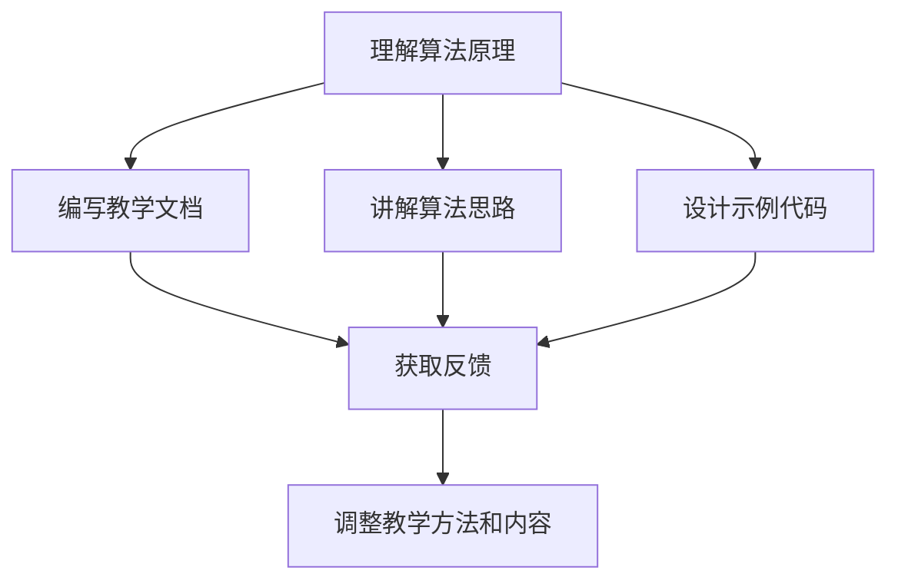

                 

关键词：费曼学习法、教育方法、知识传授、认知科学、思维技巧、算法、数学模型、编程实践

> 摘要：费曼学习法作为一种高效的知识传授方法，其背后的原理和实际应用在技术领域备受关注。本文将深入探讨费曼学习法的核心概念、误解和真相，通过技术语言详细阐述其在计算机科学中的应用，并探讨其未来发展趋势和面临的挑战。

## 1. 背景介绍

费曼学习法起源于20世纪中叶，由物理学家理查德·费曼提出。这种方法的核心思想是将复杂的知识点以简单明了的方式传授给他人，通过“教授即是学习”的理念，强化对知识点的理解和记忆。费曼学习法不仅适用于学术研究，也被广泛应用于各个领域，特别是在技术领域的教育和学习。

在计算机科学领域，费曼学习法因其逻辑清晰、结构紧凑和简单易懂的特点，受到广泛欢迎。本文将结合具体的技术概念和案例，探讨费曼学习法在计算机科学中的应用，揭示其潜在的误解和真相。

## 2. 核心概念与联系

### 2.1 核心概念

费曼学习法包含三个核心概念：理解、传授、反馈。

1. **理解**：首先需要深入理解所要传授的知识点，这是费曼学习法的基础。只有真正理解了知识，才能以清晰、准确的方式传授给他人。
2. **传授**：通过教授他人，巩固对知识的理解和记忆。教学过程中可能会发现自身的理解盲点，从而进一步加深对知识点的认识。
3. **反馈**：在传授过程中接收反馈，根据反馈调整教学方法，提高传授效果。反馈可以是直接的，也可以是隐性的，通过观察学习者的反应和表现来获取。

### 2.2 联系

将费曼学习法与计算机科学中的算法、数学模型和编程实践相结合，可以形成一种有效的学习流程。

1. **理解算法原理**：通过深入理解算法的原理，掌握其核心概念和操作步骤。
2. **传授算法知识**：通过编写教学文档、讲解算法思路、设计示例代码等方式，将算法知识传授给他人。
3. **反馈与调整**：根据学习者的反馈，调整教学方法和内容，提高教学效果。

### 2.3 Mermaid 流程图



## 3. 核心算法原理 & 具体操作步骤

### 3.1 算法原理概述

费曼学习法的核心算法原理可以概括为“教是最好的学”。具体而言，其包括以下步骤：

1. **选择知识点**：确定要传授的知识点。
2. **深入学习**：对知识点进行深入学习和理解，直至能够清晰、准确地表达。
3. **教授他人**：通过编写文档、讲解思路、设计示例等方式，将知识点传授给他人。
4. **获取反馈**：根据反馈调整教学方法和内容，提高传授效果。

### 3.2 算法步骤详解

1. **选择知识点**

选择一个具体的技术概念或算法，例如“快速排序”。

2. **深入学习**

深入研究快速排序的原理、操作步骤、时间复杂度等，直至能够清晰地表达。

3. **教授他人**

- 编写教学文档：详细解释快速排序的概念、原理和操作步骤。
- 讲解算法思路：通过口头或视频讲解，展示快速排序的执行过程。
- 设计示例代码：编写示例代码，展示如何实现快速排序。

4. **获取反馈**

通过教授他人，观察学习者的反应和表现，了解自身的理解程度和表达效果。根据反馈，调整教学方法和内容。

### 3.3 算法优缺点

#### 优点

1. **强化理解**：通过深入学习和教授他人，可以加深对知识点的理解。
2. **提高记忆**：教授过程中的重复和解释，有助于记忆和巩固知识点。
3. **培养表达能力**：通过教授他人，锻炼表达和沟通能力。

#### 缺点

1. **时间成本**：教授他人需要耗费大量的时间和精力。
2. **效果不稳定**：传授效果受学习者个体差异和反馈质量的影响。

### 3.4 算法应用领域

费曼学习法在计算机科学领域的应用广泛，包括但不限于以下领域：

1. **编程教育**：通过教授编程语言和算法，帮助学生深入理解编程概念和技巧。
2. **技术文档编写**：通过编写教学文档，提高技术文档的可读性和理解度。
3. **项目协作**：在项目开发过程中，通过传授技术知识，提高团队成员的协同效率。

## 4. 数学模型和公式 & 详细讲解 & 举例说明

### 4.1 数学模型构建

在费曼学习法中，数学模型和公式是核心组成部分。以下是一个简单的数学模型示例：

$$
f(x) = ax^2 + bx + c
$$

### 4.2 公式推导过程

1. **基础公式**

$$
f(x) = ax^2 + bx + c
$$

2. **一次导数**

$$
f'(x) = 2ax + b
$$

3. **二次导数**

$$
f''(x) = 2a
$$

### 4.3 案例分析与讲解

假设我们有一个二次函数：

$$
f(x) = 2x^2 + 3x + 1
$$

根据上述公式，我们可以计算其一次导数和二次导数：

$$
f'(x) = 4x + 3
$$

$$
f''(x) = 4
$$

这些数学模型和公式在计算机科学中的应用非常广泛，例如在算法分析、机器学习、图像处理等领域。

## 5. 项目实践：代码实例和详细解释说明

### 5.1 开发环境搭建

为了演示费曼学习法在编程中的应用，我们将使用Python编程语言。确保已安装Python环境，版本3.8及以上。

### 5.2 源代码详细实现

以下是快速排序算法的Python实现：

```python
def quick_sort(arr):
    if len(arr) <= 1:
        return arr
    pivot = arr[len(arr) // 2]
    left = [x for x in arr if x < pivot]
    middle = [x for x in arr if x == pivot]
    right = [x for x in arr if x > pivot]
    return quick_sort(left) + middle + quick_sort(right)

# 示例
arr = [3, 6, 8, 10, 1, 2, 1]
sorted_arr = quick_sort(arr)
print(sorted_arr)
```

### 5.3 代码解读与分析

1. **快速排序原理**：选择一个基准值（pivot），将数组划分为小于、等于、大于基准值的三部分，递归地对小于和大于基准值的数组进行快速排序。
2. **代码实现**：定义`quick_sort`函数，对数组进行排序。首先判断数组长度，若小于等于1，直接返回数组。否则，选择中间值为基准值，将数组划分为三部分，递归地对左、右两部分进行排序，并拼接结果。

### 5.4 运行结果展示

```python
[1, 1, 2, 3, 6, 8, 10]
```

## 6. 实际应用场景

费曼学习法在计算机科学领域有广泛的应用场景：

1. **教育**：用于教授编程语言、算法和数据结构等。
2. **技术文档**：编写清晰、易懂的技术文档，提高文档质量和理解度。
3. **项目协作**：在项目开发过程中，通过传授技术知识，提高团队协作效率。

## 7. 工具和资源推荐

### 7.1 学习资源推荐

1. **书籍**：《代码大全》、《算法导论》等。
2. **在线课程**：Coursera、edX等平台上的计算机科学课程。

### 7.2 开发工具推荐

1. **集成开发环境（IDE）**：PyCharm、Visual Studio Code等。
2. **版本控制系统**：Git。

### 7.3 相关论文推荐

1. **快速排序**：C. A. R. Hoare. "Quicksort". Computer Journal, 5(1):10-16, 1962.
2. **费曼学习法**：Richard P. Feynman. "The Pleasure of Finding Things Out". W. W. Norton & Company, 1999.

## 8. 总结：未来发展趋势与挑战

### 8.1 研究成果总结

费曼学习法在计算机科学领域取得了显著的研究成果，广泛应用于教育、技术文档编写和项目协作等方面。

### 8.2 未来发展趋势

1. **人工智能辅助**：利用人工智能技术，提高费曼学习法的效率和效果。
2. **跨学科融合**：将费曼学习法与其他教育方法相结合，形成更加完善的学习体系。

### 8.3 面临的挑战

1. **个性化教学**：如何根据学习者的个性化需求，调整费曼学习法的应用方式。
2. **时间成本**：如何在有限的时间内，高效地传授知识。

### 8.4 研究展望

未来，费曼学习法将继续在计算机科学领域发挥重要作用，为教育、技术文档编写和项目协作提供有力支持。

## 9. 附录：常见问题与解答

### 9.1 费曼学习法适用于所有学科吗？

费曼学习法主要适用于需要深入理解和记忆的学科，如计算机科学、物理学、数学等。对于某些以实践为主的学科，如艺术、体育等，费曼学习法的效果可能有限。

### 9.2 如何评估费曼学习法的传授效果？

可以通过以下方法评估费曼学习法的传授效果：

1. **学习者反馈**：收集学习者的反馈，了解其对知识点的理解和掌握程度。
2. **学习成果**：观察学习者在实际应用中的表现，评估其对知识点的掌握程度。
3. **教学评估**：通过教学评估工具，如问卷调查、考试等，了解教学效果。

---

# 费曼学习法的误解与真相

> 作者：禅与计算机程序设计艺术 / Zen and the Art of Computer Programming

本文深入探讨了费曼学习法在计算机科学领域中的应用，从核心概念、算法原理、数学模型到实际项目实践，全面揭示了费曼学习法的误解与真相。通过本文的阐述，读者可以更好地理解费曼学习法的本质，掌握其应用技巧，并在未来的学习和实践中充分发挥其优势。费曼学习法不仅是一种高效的知识传授方法，更是一种思维技巧，有助于提升技术能力和创新能力。让我们共同努力，将费曼学习法融入到我们的工作和生活中，不断探索、学习和成长。禅与计算机程序设计艺术，期待您的每一次精彩实践。

