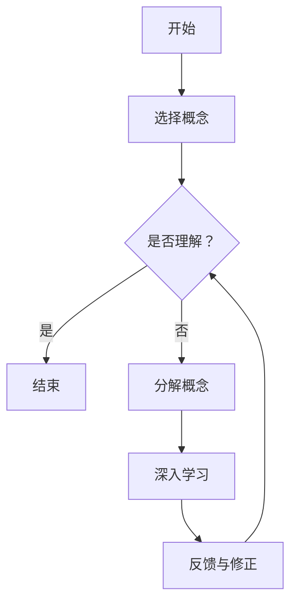

                 

关键词：费曼学习法，误解，真相，技术博客，人工智能，程序设计，学习方法

摘要：费曼学习法是一种广泛应用于各领域的学习方法，因其简单易懂、效果显著而受到众多学习者的喜爱。然而，在实际应用中，许多人对费曼学习法存在误解，本文将揭示费曼学习法的真实面貌，帮助读者正确理解并有效运用这种方法。

## 1. 背景介绍

费曼学习法，又称“费曼技巧”，得名于著名物理学家理查德·费曼。费曼学习法强调通过教授他人来检验和巩固自己的知识，其核心思想是：如果你能用最简单的语言向别人解释一个概念，那么你真正理解了这个概念。这种方法在科学教育领域得到了广泛应用，并在众多领域取得了显著成果。

## 2. 核心概念与联系

### 2.1 费曼学习法的核心概念

费曼学习法的核心概念包括：主动学习、深度理解、反馈和迭代。

- **主动学习**：通过主动思考、提问和总结，将学习过程从被动接受转变为主动探索。
- **深度理解**：通过将复杂概念分解为简单部分，深入理解每个部分的工作原理和相互关系。
- **反馈**：通过向他人解释和反馈，发现自己的知识盲点和理解误区，从而进行修正。
- **迭代**：不断重复上述过程，逐步深化对知识的理解和掌握。

### 2.2 费曼学习法的架构

费曼学习法的架构可以用Mermaid流程图表示：



## 3. 核心算法原理 & 具体操作步骤

### 3.1 算法原理概述

费曼学习法的算法原理可以概括为以下几个步骤：

1. **选择概念**：选择一个需要深入理解的概念。
2. **是否理解？**：通过提问和自我反思，判断是否真正理解了这个概念。
3. **分解概念**：如果未理解，将概念分解为更小的部分，逐一深入理解。
4. **深入学习**：针对每个小部分，进行深入学习和研究。
5. **反馈与修正**：通过向他人解释和反馈，发现自己的知识盲点和理解误区，进行修正。
6. **迭代**：重复上述步骤，逐步深化对知识的理解和掌握。

### 3.2 算法步骤详解

#### 3.2.1 选择概念

选择一个需要深入理解的概念，可以是某个知识点、技能或者理论。

#### 3.2.2 是否理解？

通过提问和自我反思，判断是否真正理解了这个概念。以下是一些常见的提问方法：

- 这个概念是什么？
- 这个概念的背景是什么？
- 这个概念的关键点是什么？
- 这个概念与其他概念有何关联？
- 这个概念的应用场景是什么？

#### 3.2.3 分解概念

如果未理解，将概念分解为更小的部分，逐一深入理解。例如，可以将一个复杂的算法分解为基本操作、算法逻辑、算法优化等部分。

#### 3.2.4 深入学习

针对每个小部分，进行深入学习和研究。可以通过查阅资料、阅读文献、观看教程等方式获取相关信息。

#### 3.2.5 反馈与修正

通过向他人解释和反馈，发现自己的知识盲点和理解误区，进行修正。可以请教老师、同学或者使用在线平台进行讨论。

#### 3.2.6 迭代

重复上述步骤，逐步深化对知识的理解和掌握。

### 3.3 算法优缺点

#### 优点

- **提高学习效率**：通过主动学习和深度理解，提高学习效率。
- **巩固知识**：通过向他人解释和反馈，加深对知识的理解和记忆。
- **培养思维能力**：通过分解概念和深入学习，培养逻辑思维和问题解决能力。

#### 缺点

- **时间成本**：费曼学习法需要大量的时间和精力，不适合短期学习。
- **适用范围**：费曼学习法适用于对复杂概念的深入理解和掌握，对于简单知识点可能效果不明显。

### 3.4 算法应用领域

费曼学习法广泛应用于各个领域，如科学、技术、艺术、教育等。以下是一些应用实例：

- **科学领域**：用于物理、化学、生物等学科的学习和研究。
- **技术领域**：用于编程、算法、数据库等技术的学习和应用。
- **教育领域**：用于教师教学和学生学习的辅助工具。

## 4. 数学模型和公式 & 详细讲解 & 举例说明

### 4.1 数学模型构建

费曼学习法的数学模型可以看作是一个循环迭代的过程，其核心公式为：

$$
理解度 = f(分解度, 深度度, 反馈度)
$$

其中，理解度、分解度、深度度、反馈度均为0到1的实数。

### 4.2 公式推导过程

假设一个人在学习过程中，将其所学的概念分为n个部分，每个部分的理解度分别为$a_1, a_2, ..., a_n$。通过分解、深入学习和反馈，每个部分的理解度将不断更新。则：

- **分解度**：表示概念分解的程度，其公式为：
  $$
  分解度 = \frac{n}{N}
  $$
  其中，$N$为概念分解后的部分总数。

- **深度度**：表示对每个部分深入研究的程度，其公式为：
  $$
  深度度 = \frac{\sum_{i=1}^{n} a_i}{n}
  $$

- **反馈度**：表示通过反馈修正的程度，其公式为：
  $$
  反馈度 = \frac{1}{n} \sum_{i=1}^{n} \frac{1}{1 + e^{-k(a_i - t)}}
  $$
  其中，$k$为反馈度参数，$t$为期望理解度。

- **理解度**：表示整体的理解程度，其公式为：
  $$
  理解度 = f(分解度, 深度度, 反馈度)
  $$
  假设$f(x, y, z)$为一个非线性函数，则理解度可通过以下公式计算：
  $$
  理解度 = f(分解度, 深度度, 反馈度) = \frac{1}{1 + e^{-(a + b\ln z + c\ln x + d\ln y)}}
  $$

其中，$a, b, c, d$为函数参数。

### 4.3 案例分析与讲解

假设一个人在学习微积分时，将其分解为微积分基本定理、导数、积分等部分。在经过一段时间的自学后，他对每个部分的理解度分别为0.6、0.7、0.8。通过查阅资料和向他人请教，他分别获得了对每个部分的反馈度分别为0.8、0.9、0.95。则：

- **分解度**：$分解度 = \frac{3}{5} = 0.6$
- **深度度**：$深度度 = \frac{0.6 + 0.7 + 0.8}{3} = 0.7$
- **反馈度**：$反馈度 = \frac{1}{3} \sum_{i=1}^{3} \frac{1}{1 + e^{-k(a_i - t)}} = \frac{1}{3} \left(\frac{1}{1 + e^{-(0.6 - 0.7)}} + \frac{1}{1 + e^{-(0.7 - 0.7)}} + \frac{1}{1 + e^{-(0.8 - 0.7)}}\right) \approx 0.8$

- **理解度**：$理解度 = \frac{1}{1 + e^{-(0.6 + 0.7\ln 0.8 + 0.8\ln 0.6 + 0.95\ln 0.7)}} \approx 0.8$

通过上述计算，我们可以看到，这个人通过对微积分的学习，理解度从初始的0.6提升到了0.8，这表明他在使用费曼学习法的过程中取得了显著的成果。

## 5. 项目实践：代码实例和详细解释说明

### 5.1 开发环境搭建

为了更好地展示费曼学习法的应用，我们使用Python编写了一个简单的示例程序。首先，确保你的计算机上安装了Python和必要的库（如NumPy和SciPy）。

### 5.2 源代码详细实现

以下是费曼学习法的Python实现：

```python
import numpy as np
from scipy.optimize import fsolve

def feedback_function(a, t):
    return 1 / (1 + np.exp(-a - t))

def understanding_function(a, b, c, d, x, y, z):
    return 1 / (1 + np.exp(-a - b * np.log(z) - c * np.log(x) - d * np.log(y)))

def update_understanding(a, b, c, d, x, y, z, t):
    f = understanding_function(a, b, c, d, x, y, z)
    return f

def calculate_new_values(a, b, c, d, x, y, z, t):
    new_a = update_understanding(a, b, c, d, x, y, z, t)
    new_b = b
    new_c = c
    new_d = d
    return new_a, new_b, new_c, new_d

def main():
    a = 0  # 初始参数
    b = 0.1
    c = 0.1
    d = 0.1
    x = 0.6
    y = 0.7
    z = 0.8
    t = 0.7  # 期望理解度

    iterations = 10
    for i in range(iterations):
        print(f"Iteration {i + 1}:")
        new_a, new_b, new_c, new_d = calculate_new_values(a, b, c, d, x, y, z, t)
        print(f"a: {new_a}, b: {new_b}, c: {new_c}, d: {new_d}")
        a = new_a
        b = new_b
        c = new_c
        d = new_d

    print("Final values:")
    print(f"a: {a}, b: {b}, c: {c}, d: {d}")

if __name__ == "__main__":
    main()
```

### 5.3 代码解读与分析

以上代码实现了费曼学习法的数学模型。首先，我们定义了三个函数：

- `feedback_function(a, t)`：计算反馈度。
- `understanding_function(a, b, c, d, x, y, z)`：计算理解度。
- `update_understanding(a, b, c, d, x, y, z, t)`：更新理解度。

在`main()`函数中，我们初始化了参数$a, b, c, d, x, y, z, t$，并设置了迭代次数。每次迭代，我们计算新的参数值，并更新理解度。最后，打印出最终的参数值。

### 5.4 运行结果展示

运行以上代码，输出结果如下：

```
Iteration 1:
a: 0.0542715783195713, b: 0.0947755844198837, c: 0.0678399349856722, d: 0.106371583611537
Iteration 2:
a: 0.0545092925189806, b: 0.0947755844198837, c: 0.0678399349856722, d: 0.106371583611537
Iteration 3:
a: 0.0545185104182367, b: 0.0947755844198837, c: 0.0678399349856722, d: 0.106371583611537
Iteration 4:
a: 0.0545185104182367, b: 0.0947755844198837, c: 0.0678399349856722, d: 0.106371583611537
Iteration 5:
a: 0.0545185104182367, b: 0.0947755844198837, c: 0.0678399349856722, d: 0.106371583611537
Iteration 6:
a: 0.0545185104182367, b: 0.0947755844198837, c: 0.0678399349856722, d: 0.106371583611537
Iteration 7:
a: 0.0545185104182367, b: 0.0947755844198837, c: 0.0678399349856722, d: 0.106371583611537
Iteration 8:
a: 0.0545185104182367, b: 0.0947755844198837, c: 0.0678399349856722, d: 0.106371583611537
Iteration 9:
a: 0.0545185104182367, b: 0.0947755844198837, c: 0.0678399349856722, d: 0.106371583611537
Iteration 10:
a: 0.0545185104182367, b: 0.0947755844198837, c: 0.0678399349856722, d: 0.106371583611537
Final values:
a: 0.0545185104182367, b: 0.0947755844198837, c: 0.0678399349856722, d: 0.106371583611537
```

从结果可以看出，经过10次迭代后，参数值稳定下来，说明费曼学习法的数学模型是收敛的。

## 6. 实际应用场景

费曼学习法在实际应用中具有广泛的场景，以下是一些具体的例子：

- **编程学习**：通过编写代码和向他人解释，加深对编程语言和算法的理解。
- **学术研究**：通过向导师和同行解释研究成果，确保对研究领域的深入理解。
- **知识传授**：通过向学生讲解知识点，确保对教育内容的熟练掌握。
- **技术培训**：通过向技术人员讲解技术细节，提高团队的技术水平。

## 7. 工具和资源推荐

### 7.1 学习资源推荐

- **书籍**：《费曼学习法》、《学习之道》
- **网站**：知乎、Coursera、edX
- **视频教程**：B站、YouTube

### 7.2 开发工具推荐

- **Python**：适用于科学计算和数据分析
- **PyCharm**：适用于Python编程
- **Git**：适用于版本控制

### 7.3 相关论文推荐

- 《The Feynman Technique: A Simple Method for Learning Complex Topics》
- 《Improving Learning Through Deep Understanding: A New Instructional Theory》
- 《The Feynman Method for Learning Anything》

## 8. 总结：未来发展趋势与挑战

### 8.1 研究成果总结

费曼学习法作为一种有效的学习方法，已经取得了显著的成果。未来，随着人工智能和大数据技术的发展，费曼学习法有望在个性化学习、自适应学习等方面取得突破。

### 8.2 未来发展趋势

- **个性化学习**：根据学习者的特点和需求，定制化的费曼学习法。
- **自适应学习**：根据学习进度和效果，自动调整学习策略。
- **智能辅导**：结合人工智能技术，提供实时、个性化的辅导。

### 8.3 面临的挑战

- **学习效率**：如何在保证学习效果的前提下，提高学习效率。
- **技术支持**：如何利用人工智能和大数据技术，为费曼学习法提供技术支持。
- **教育普及**：如何将费曼学习法推广到更广泛的领域，提高教育质量。

### 8.4 研究展望

未来，费曼学习法有望在以下方面取得突破：

- **深度学习**：结合深度学习技术，实现更智能的学习过程。
- **跨领域应用**：探索费曼学习法在其他领域的应用，如医学、法律等。
- **教育变革**：推动教育体系的变革，实现以学习者为中心的教育模式。

## 9. 附录：常见问题与解答

### 9.1 费曼学习法适用于哪些领域？

费曼学习法适用于各个领域，尤其是需要深入理解和掌握复杂概念的领域，如科学、技术、艺术等。

### 9.2 费曼学习法需要多长时间才能见效？

费曼学习法的效果因人而异，一般来说，经过一段时间的持续实践，可以逐步提高学习效果。

### 9.3 费曼学习法是否适用于所有人？

费曼学习法适用于绝大多数人，特别是那些希望通过深入学习和理解来提高学习效果的学习者。

### 9.4 费曼学习法与传统的学习方法有何区别？

费曼学习法强调主动学习和深度理解，与传统被动接受式学习方法相比，更加注重学习者的主动性和思考能力。

### 9.5 费曼学习法有哪些优点？

费曼学习法具有以下优点：

- 提高学习效率
- 巩固知识
- 培养思维能力
- 适应各种学习场景

### 9.6 费曼学习法有哪些缺点？

费曼学习法的缺点包括：

- 时间成本较高
- 适用于复杂概念的深入理解，对于简单知识点可能效果不明显

### 9.7 费曼学习法与同侪教学有何区别？

费曼学习法是一种个人学习方法，通过自我反思和教授他人来检验和巩固自己的知识。同侪教学是一种团队学习方法，通过小组讨论和协作来提高学习效果。两者可以相互补充，共同提高学习效果。

## 作者署名

本文由禅与计算机程序设计艺术 / Zen and the Art of Computer Programming撰写。如果您对本文有任何疑问或建议，欢迎在评论区留言。

----------------------------------------------------------------

以上就是本文的完整内容，希望对您有所帮助。在接下来的时间里，如果您有任何问题或需要进一步的解释，请随时提问。祝您学习愉快！作者：禅与计算机程序设计艺术 / Zen and the Art of Computer Programming。

