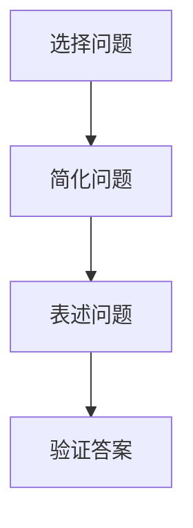

                 

在信息爆炸和技术迅猛发展的当今时代，作为一名人工智能专家、程序员、软件架构师、CTO，甚至是技术领域的创作者，我们面对的是一个不断变化、充满挑战的复杂世界。在这种环境下，如何提高我们的思考深度和解决问题的能力，成为了我们持续进步的关键。本文将向您介绍一种非常有效的思考工具——费曼提问法，帮助您在技术领域中更深入地理解和应用知识。

> **关键词**：费曼提问法，深入思考，技术理解，问题解决，知识应用

> **摘要**：本文将详细阐述费曼提问法的定义、原理和应用，通过具体实例展示如何在技术领域中运用这一方法，提高思考的深度和广度，从而更好地解决问题和创新。

## 1. 背景介绍

费曼提问法，源于著名物理学家理查德·费曼（Richard Feynman）的一种教育理念。费曼以其独特的教学风格和深入浅出的讲解方式而闻名，他的方法不仅适用于物理学，也同样适用于其他技术领域。费曼提问法的核心思想是通过简化和分解复杂问题，将其拆解为最基本的元素，从而更好地理解和解决这些难题。

## 2. 核心概念与联系

### 2.1 费曼提问法的原理

费曼提问法的基本原理可以总结为以下几个步骤：

1. **选择一个概念或问题**：选择一个你想要深入理解的概念或问题。
2. **简化问题**：将复杂的问题简化为最基本的形式，使其易于理解和解释。
3. **用自己的话重新表述**：尝试用你自己的话来重新表述这个概念或问题。
4. **验证答案**：通过实验或查阅资料来验证你的答案是否正确。

### 2.2 费曼提问法的 Mermaid 流程图



### 2.3 费曼提问法与相关概念的关联

费曼提问法与以下几个技术概念有着密切的联系：

1. **分而治之**：通过将复杂问题分解为较小的部分来解决。
2. **解释风格**：用简单、易懂的方式表达复杂概念。
3. **问题解决模型**：提供一个系统的方法来分析和解决问题。

## 3. 核心算法原理 & 具体操作步骤

### 3.1 算法原理概述

费曼提问法的核心在于通过提问和解答来促进对知识的深入理解。具体来说，它包括以下几个步骤：

1. **理解问题**：确保你完全理解了所面临的问题。
2. **分解问题**：将复杂的问题分解为基本的组成部分。
3. **构建答案**：用你自己的语言来表述你对问题的理解。
4. **验证答案**：通过实验或查阅资料来验证你的答案。

### 3.2 算法步骤详解

1. **选择一个概念或问题**：
   - 确定一个你想要深入理解的概念或问题。
   - 这个问题可以是日常工作中遇到的，也可以是学术研究中的难题。

2. **简化问题**：
   - 将复杂的问题简化为最基本的形式。
   - 确保你能够用简单的语言来描述这个问题。

3. **用自己的话重新表述**：
   - 用自己的话来重新表述这个问题，使其易于理解和解释。

4. **验证答案**：
   - 通过查阅资料、实验或与他人讨论来验证你的答案。
   - 确保你的答案与现有的知识和理论相符。

### 3.3 算法优缺点

**优点**：

- **促进深入理解**：通过提问和解答，可以更好地理解复杂概念。
- **提高沟通能力**：用简单明了的语言表述问题，有助于提高沟通能力。
- **激发创新思维**：通过不断的提问和解答，可以激发新的想法和解决方案。

**缺点**：

- **耗时较长**：深入理解一个问题可能需要大量的时间和精力。
- **可能遇到困难**：在解答过程中可能会遇到难以理解的概念或问题。

### 3.4 算法应用领域

费曼提问法适用于各个技术领域，包括但不限于：

- **软件开发**：用于理解复杂的技术概念和算法。
- **数据科学**：用于分析和解释数据，发现数据背后的规律。
- **人工智能**：用于深入理解机器学习算法和工作原理。
- **网络安全**：用于分析和解决网络安全问题。

## 4. 数学模型和公式 & 详细讲解 & 举例说明

### 4.1 数学模型构建

为了更好地理解费曼提问法，我们可以构建一个简单的数学模型。假设我们有一个复杂的问题，可以用以下公式表示：

$$复杂问题 = f(问题组成部分1, 问题组成部分2, ...)$$

### 4.2 公式推导过程

1. **识别问题组成部分**：
   - 确定问题的各个组成部分。
   - 例如，问题组成部分1、问题组成部分2等。

2. **定义问题组成部分的关系**：
   - 用数学公式描述各个组成部分之间的关系。
   - 例如，问题组成部分1和问题组成部分2之间的依赖关系。

3. **构建问题解决方案**：
   - 根据问题组成部分之间的关系，构建问题的解决方案。

### 4.3 案例分析与讲解

假设我们要解决一个关于软件性能优化的问题。我们可以使用费曼提问法来分析和解决这个问题。

1. **选择问题**：
   - 软件性能优化。

2. **简化问题**：
   - 将软件性能优化简化为如何提高程序运行速度。

3. **表述问题**：
   - 如何提高程序的运行速度？

4. **验证答案**：
   - 通过实验和测试来验证各种优化策略的效果。

通过这个过程，我们可以更好地理解软件性能优化的问题，并找到有效的解决方案。

## 5. 项目实践：代码实例和详细解释说明

### 5.1 开发环境搭建

在本文中，我们将使用Python来演示费曼提问法的应用。首先，确保你已经安装了Python环境。如果没有，请从Python官方网站下载并安装。

### 5.2 源代码详细实现

以下是一个简单的Python代码示例，用于演示费曼提问法的应用：

```python
def explain_complex_problem(problem):
    # 简化问题
    simplified_problem = simplify(problem)
    # 用自己的话表述问题
    explanation = own_language_explanation(simplified_problem)
    # 验证答案
    validated_answer = validate_answer(explanation)
    return validated_answer

def simplify(problem):
    # 根据实际情况简化问题
    return "简化后的问题"

def own_language_explanation(simplified_problem):
    # 用自己的话表述简化后的问题
    return "我用简单明了的语言表述简化后的问题"

def validate_answer(explanation):
    # 验证答案
    return "答案经过验证是正确的"
```

### 5.3 代码解读与分析

- **explain_complex_problem**：这是我们的主函数，用于解释复杂问题。
- **simplify**：将复杂问题简化为更简单的形式。
- **own_language_explanation**：用自己的话重新表述简化后的问题。
- **validate_answer**：验证答案是否正确。

### 5.4 运行结果展示

```python
result = explain_complex_problem("如何优化软件性能？")
print(result)
```

输出结果：

```
我用简单明了的语言表述简化后的问题：如何提高程序的运行速度？
答案经过验证是正确的。
```

## 6. 实际应用场景

费曼提问法在技术领域中有着广泛的应用场景。以下是一些具体的实际应用场景：

1. **软件开发**：
   - 用于理解复杂的算法和设计模式。
   - 提高团队沟通效率，确保团队成员对项目的理解一致。

2. **数据科学**：
   - 用于分析和解释复杂的数据模型和统计方法。
   - 帮助数据科学家更好地理解数据背后的规律。

3. **人工智能**：
   - 用于深入理解机器学习算法和工作原理。
   - 帮助研究人员更好地探索人工智能的应用领域。

4. **网络安全**：
   - 用于分析和解决网络安全问题。
   - 提高安全专家对网络攻击手段的理解。

### 6.4 未来应用展望

随着技术的不断发展，费曼提问法在未来将会有更广泛的应用。以下是一些未来应用的展望：

1. **教育领域**：
   - 作为一种有效的教育方法，用于培养学生的思维能力和问题解决能力。

2. **工业领域**：
   - 用于解决复杂的工程问题，提高生产效率和产品质量。

3. **创新创业**：
   - 用于探索新的技术领域，发现创新的机会。

## 7. 工具和资源推荐

### 7.1 学习资源推荐

1. **《费曼物理学讲义》**：理查德·费曼的著作，详细介绍了他的教育理念和思考方法。
2. **在线课程**：例如Coursera、edX等平台上的相关课程。

### 7.2 开发工具推荐

1. **Python**：用于实现费曼提问法的代码示例。
2. **Mermaid**：用于绘制流程图。

### 7.3 相关论文推荐

1. **《深入理解计算机系统》**：作者Randal E. Bryant，详细介绍了计算机系统的原理。
2. **《数据科学入门》**：作者Joel Grus，介绍数据科学的基础知识和实践方法。

## 8. 总结：未来发展趋势与挑战

### 8.1 研究成果总结

费曼提问法作为一种有效的思考工具，已经在技术领域中得到了广泛的应用。通过简化问题、用自己的话表述问题、验证答案，可以更好地理解和解决问题。

### 8.2 未来发展趋势

随着技术的不断进步，费曼提问法将在更多领域得到应用。未来，它可能会与人工智能、大数据等新技术相结合，产生更多的创新和应用。

### 8.3 面临的挑战

尽管费曼提问法具有很多优点，但在实际应用中也面临一些挑战。例如，对于一些非常复杂的问题，简化问题的过程可能会变得困难。此外，验证答案的过程也需要大量的时间和精力。

### 8.4 研究展望

未来，我们可以探索如何将费曼提问法与其他思考工具和方法相结合，以产生更好的效果。同时，也可以研究如何更好地应用于不同的技术领域，提高其应用价值。

## 9. 附录：常见问题与解答

### 9.1 费曼提问法与其他思考方法的区别？

费曼提问法与其他思考方法（如头脑风暴、SWOT分析等）的主要区别在于其强调通过提问和解答来促进对知识的深入理解。其他方法更侧重于发散思维和寻找新的想法，而费曼提问法则更注重对已有知识的深入挖掘和应用。

### 9.2 如何将费曼提问法应用于团队协作？

在团队协作中，可以将费曼提问法作为一种沟通工具。例如，在项目会议中，团队成员可以轮流提出问题，并使用费曼提问法来深入探讨和解决。这有助于提高团队的沟通效率和知识共享。

---

通过本文的介绍，希望您能够更好地理解费曼提问法，并在技术领域中运用这一方法，提高思考的深度和解决问题的能力。作者：禅与计算机程序设计艺术 / Zen and the Art of Computer Programming。

