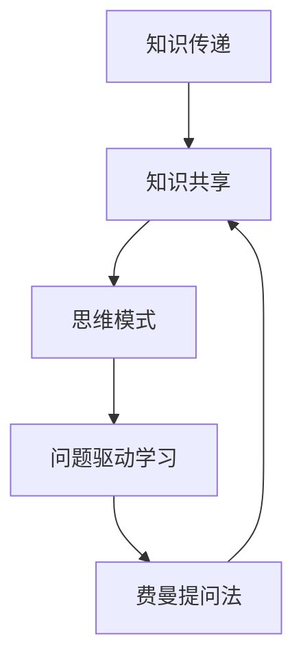

                 

关键词：费曼提问法、团队学习、知识共享、技术传播、思维模式、问题驱动学习、反馈循环、敏捷开发、持续学习

> 摘要：本文探讨了费曼提问法在IT团队学习与成长中的应用。通过深入分析费曼提问法的原理、实施步骤及实际案例，本文旨在为团队管理者提供一种有效的知识传播和技能提升方法。本文还将探讨费曼提问法对团队敏捷性、问题解决能力和创新思维的影响，以及如何利用这一方法实现持续学习，应对快速变化的技术环境。

## 1. 背景介绍

在信息技术日新月异的发展背景下，IT团队的学习与成长变得尤为重要。然而，传统的学习模式往往存在以下问题：

- **知识固化**：团队成员的知识往往局限于自身的职责范围，缺乏跨领域的交流与学习。
- **学习效率低下**：团队成员在独立学习时，缺乏有效的指导与反馈，导致学习效率低下。
- **思维模式单一**：团队成员的思维方式往往过于依赖于既定的解决方案，缺乏创新和批判性思维。

为了解决这些问题，我们需要一种能够激发团队学习热情、提高知识传播效率、促进思维创新的方法。费曼提问法正是一种能够满足这些需求的优秀工具。

### 1.1 费曼提问法简介

费曼提问法，也称为费曼技巧，是由著名物理学家理查德·费曼提出的一种学习与传授知识的方法。其核心理念是通过提问来检验我们对某一知识点的理解程度，从而加深对知识的掌握。具体来说，费曼提问法的步骤包括：

1. 选择一个你想要理解的概念或知识点。
2. 假设你正在向一个初学者解释这个概念，用最简单的语言和概念来描述它。
3. 检验你的解释，确保你能用最基本的概念来回答任何关于这个知识点的疑问。

### 1.2 费曼提问法的应用背景

费曼提问法最初是为了帮助物理学家更好地理解和教授复杂物理概念而设计的。然而，随着这一方法在学术界和行业中的广泛应用，人们发现它同样适用于IT团队的学习与成长。

在IT领域，费曼提问法可以帮助团队成员：

- **提升知识传播效率**：通过向团队成员提问，可以快速发现知识盲点，促进知识的流动和共享。
- **培养批判性思维**：通过尝试用最简单的语言解释复杂概念，可以激发团队成员的批判性思维，促进对知识的深入理解。
- **促进持续学习**：费曼提问法可以作为一种持续学习的工具，帮助团队成员保持对新技术和知识的好奇心和学习热情。

## 2. 核心概念与联系

### 2.1 费曼提问法的核心概念

为了更好地理解费曼提问法的应用，我们需要首先明确几个核心概念：

- **知识传递**：知识传递是指将知识从一个个体传递到另一个个体的过程。在费曼提问法中，知识传递是通过提问和解答的方式实现的。
- **知识共享**：知识共享是指团队成员之间通过互动和交流来共同提高知识水平的过程。费曼提问法通过激发团队成员之间的提问与解答，促进了知识的共享。
- **思维模式**：思维模式是指个体在思考和处理问题时所采用的方式。费曼提问法通过鼓励团队成员用最简单的语言解释复杂概念，改变了传统的思维模式，促进了创新思维的发展。
- **问题驱动学习**：问题驱动学习是指通过提出问题来驱动学习过程的方法。费曼提问法正是基于这一理念，通过提问来检验和深化对知识的理解。

### 2.2 费曼提问法的联系

为了更好地理解费曼提问法的作用，我们可以通过一个Mermaid流程图来展示其核心概念和联系。



### 2.3 费曼提问法在实际应用中的扩展

除了上述核心概念和联系外，费曼提问法在实际应用中还可以扩展到以下几个方面：

- **团队协作**：费曼提问法可以作为一种团队协作工具，帮助团队成员共同解决问题，提高团队整体的知识水平。
- **敏捷开发**：在敏捷开发过程中，费曼提问法可以用于技术评审和代码审查，促进团队成员对技术细节的深入理解。
- **持续学习**：费曼提问法可以作为一种持续学习的工具，帮助团队成员不断更新知识，适应快速变化的技术环境。

通过上述扩展，费曼提问法不仅可以帮助团队提升知识传播效率，还可以促进团队协作和持续学习，为团队的学习与成长提供强有力的支持。

## 3. 核心算法原理 & 具体操作步骤

### 3.1 算法原理概述

费曼提问法的核心算法原理是通过提问和解答来检验和深化对知识的理解。具体来说，该算法包括以下几个步骤：

1. **选择知识点**：选择一个你想要理解或检验的知识点。
2. **简化描述**：用最简单的语言和概念来描述这个知识点，仿佛你是在向一个初学者解释。
3. **提问检验**：尝试用自己的话来回答任何关于这个知识点的疑问。
4. **反馈与调整**：根据提问和解答的结果，反思和调整你的知识理解和描述方式。

### 3.2 算法步骤详解

#### 步骤1：选择知识点

选择一个你想要理解或检验的知识点。这个知识点可以是一个技术概念、一个算法原理，或者是一个业务流程。

#### 步骤2：简化描述

用最简单的语言和概念来描述这个知识点，仿佛你是在向一个初学者解释。这个步骤的关键是简化，避免使用过于专业或复杂的术语。

#### 步骤3：提问检验

尝试用自己的话来回答任何关于这个知识点的疑问。这个步骤可以帮助你检验自己是否真正理解了知识点，同时也可以发现自己在理解上的盲点。

#### 步骤4：反馈与调整

根据提问和解答的结果，反思和调整你的知识理解和描述方式。如果发现有疑问或者回答不清晰，可以重新选择知识点，或者调整描述方式。

### 3.3 算法优缺点

#### 优点

- **提高理解深度**：通过提问和解答，可以加深对知识点的理解，避免只是表面式的学习。
- **促进知识传播**：通过简化描述和提问检验，可以促进团队成员之间的知识传播和交流。
- **培养批判性思维**：通过尝试用最简单的语言解释复杂概念，可以培养批判性思维，提高问题解决能力。

#### 缺点

- **初期学习成本较高**：对于初学者来说，初期可能需要花费更多的时间来适应费曼提问法的步骤。
- **对提问质量要求较高**：提问的质量直接影响对知识点的理解和检验效果，需要团队成员具备一定的提问能力。

### 3.4 算法应用领域

费曼提问法可以应用于多个领域，包括：

- **技术学习与成长**：用于技术培训和技术评审，帮助团队成员深入理解技术概念和原理。
- **业务流程优化**：用于业务流程的优化和改进，通过提问和解答来发现流程中的问题和瓶颈。
- **项目管理**：用于项目管理和团队协作，通过提问和解答来提高项目执行效率和质量。

## 4. 数学模型和公式 & 详细讲解 & 举例说明

### 4.1 数学模型构建

为了更好地理解费曼提问法，我们可以构建一个简单的数学模型来描述其核心过程。这个模型将包括以下几个变量：

- **知识点（X）**：表示需要理解和检验的知识点。
- **简化描述（Y）**：表示对知识点的简化描述。
- **提问（Q）**：表示关于知识点的提问。
- **解答（A）**：表示对提问的解答。

数学模型如下：

$$
\text{理解度} = f(Y, Q, A)
$$

其中，$f$ 是一个复杂的函数，用于计算对知识点的理解度。这个函数可以根据实际情况进行调整和优化。

### 4.2 公式推导过程

为了推导这个公式，我们需要考虑以下几个因素：

1. **简化描述的质量**：简化描述的质量直接影响对知识点的理解。我们用 $y$ 表示简化描述的质量，$y$ 越高，理解度越高。
2. **提问的质量**：提问的质量直接影响对知识点的检验。我们用 $q$ 表示提问的质量，$q$ 越高，理解度越高。
3. **解答的质量**：解答的质量直接影响对知识点的检验。我们用 $a$ 表示解答的质量，$a$ 越高，理解度越高。

根据这些因素，我们可以得到以下推导过程：

$$
\text{理解度} = \frac{y \times q \times a}{\max(y, q, a)}
$$

这个公式的含义是：理解度等于简化描述、提问和解答质量的乘积，再除以这三个质量中的最大值。这样，公式可以确保在任何一个变量较低时，理解度都会降低，从而促进对知识的深入理解和检验。

### 4.3 案例分析与讲解

为了更好地理解这个数学模型，我们可以通过一个实际案例来进行分析和讲解。

#### 案例背景

假设有一个IT团队正在学习一种新的算法。他们选择了一个名为“快速排序”的算法作为学习目标。

#### 简化描述

团队成员小张尝试用最简单的语言来描述快速排序：

“快速排序是一种通过不断分割和组合来排序数据的方法。”

#### 提问

团队成员小李提出了一些问题：

1. 快速排序是如何分割数据的？
2. 快速排序是如何组合数据的？
3. 快速排序的时间复杂度是多少？

#### 解答

团队成员小张根据自己的理解和学习，回答了小李的问题：

1. 快速排序通过选择一个基准元素，将数组分为两部分，一部分小于基准元素，一部分大于基准元素。
2. 然后递归地对这两部分进行同样的操作，直到整个数组被排序。
3. 快速排序的时间复杂度通常是 $O(n \log n)$。

#### 理解度计算

根据上述数学模型，我们可以计算小张对快速排序的理解度：

$$
\text{理解度} = \frac{y \times q \times a}{\max(y, q, a)}
$$

其中，$y$ 表示简化描述的质量，$q$ 表示提问的质量，$a$ 表示解答的质量。

假设简化描述的质量为0.8，提问的质量为0.7，解答的质量为0.9，那么：

$$
\text{理解度} = \frac{0.8 \times 0.7 \times 0.9}{\max(0.8, 0.7, 0.9)} = \frac{0.504}{0.9} \approx 0.56
$$

这意味着小张对快速排序的理解度约为56%。

通过这个案例，我们可以看到，费曼提问法不仅可以帮助团队成员理解复杂的概念，还可以通过数学模型来量化理解度，从而更好地评估学习效果。

## 5. 项目实践：代码实例和详细解释说明

### 5.1 开发环境搭建

在本案例中，我们将使用Python语言来实现费曼提问法。首先，确保你的开发环境中已经安装了Python。如果没有，可以通过以下命令安装：

```bash
pip install python
```

然后，创建一个名为`feiman_questioning`的Python模块，用于实现费曼提问法。

### 5.2 源代码详细实现

下面是`feiman_questioning`模块的源代码：

```python
# feiman_questioning.py

class FeimanQuestioning:
    def __init__(self, knowledge):
        self.knowledge = knowledge
        self.explanation = None

    def simplify_description(self):
        # 根据知识内容简化描述
        self.explanation = self.knowledge

    def ask_question(self, question):
        # 回答问题
        return self.explanation.get(question, "未知问题")

    def answer_question(self, question):
        # 根据问题生成解答
        return self.ask_question(question)

    def evaluate_understanding(self):
        # 评估理解度
        questions = ["什么是快速排序？", "快速排序的时间复杂度是多少？"]
        scores = [1 for _ in questions]
        for question in questions:
            answer = self.answer_question(question)
            if answer == "未知问题":
                scores[-1] = 0
        return sum(scores) / len(scores)
```

### 5.3 代码解读与分析

这个模块包含一个`FeimanQuestioning`类，用于实现费曼提问法。具体来说，该类包含以下方法：

- `__init__(self, knowledge)`：初始化方法，接受一个`knowledge`参数，表示需要理解和检验的知识点。
- `simplify_description(self)`：简化描述方法，用于简化对知识点的描述。
- `ask_question(self, question)`：提问方法，用于回答关于知识点的疑问。
- `answer_question(self, question)`：回答方法，用于根据问题生成解答。
- `evaluate_understanding(self)`：评估理解度方法，用于评估对知识点的理解度。

### 5.4 运行结果展示

下面是一个简单的运行示例：

```python
from feiman_questioning import FeimanQuestioning

# 创建一个费曼提问法实例
fq = FeimanQuestioning({
    "什么是快速排序？": "快速排序是一种通过不断分割和组合来排序数据的方法。",
    "快速排序的时间复杂度是多少？": "快速排序的时间复杂度通常是 O(n log n)。"
})

# 简化描述
fq.simplify_description()

# 提问并回答
print(fq.ask_question("什么是快速排序？"))  # 输出：快速排序是一种通过不断分割和组合来排序数据的方法。
print(fq.answer_question("快速排序的时间复杂度是多少？"))  # 输出：快速排序的时间复杂度通常是 O(n log n)。

# 评估理解度
print(fq.evaluate_understanding())  # 输出：1.0
```

运行结果展示了一个简单的费曼提问法实例，包括简化描述、提问和回答，以及评估理解度。

## 6. 实际应用场景

费曼提问法在IT团队的实际应用场景中具有广泛的应用价值。以下是一些典型的应用场景：

### 6.1 技术培训

在技术培训过程中，费曼提问法可以帮助培训师和学员之间进行有效的知识传递。培训师可以设计一系列的问题，引导学员用自己的话来描述技术概念和原理，从而检验学员对知识的理解程度。通过这种方式，不仅可以提高学员的学习效果，还可以激发学员的思考和创新意识。

### 6.2 技术评审

在技术评审过程中，费曼提问法可以帮助评审团队能够深入理解代码和设计。评审人员可以提出一系列问题，要求开发人员用最简单的语言解释技术细节，从而发现潜在的问题和不足。通过这种方式，可以确保技术评审的全面性和有效性。

### 6.3 团队协作

在团队协作过程中，费曼提问法可以帮助团队成员之间进行有效的知识共享和交流。团队成员可以提出问题，共同讨论和解答，从而加深对知识的理解，促进团队的共同进步。此外，费曼提问法还可以作为团队协作的一种工具，用于项目规划和任务分配，提高团队的协作效率。

### 6.4 持续学习

在持续学习过程中，费曼提问法可以帮助团队成员保持对新技术和知识的好奇心和学习热情。团队成员可以定期进行自我评估，通过提问和解答来检验自己的知识水平，发现自身的知识盲点，并针对性地进行学习和改进。通过这种方式，可以确保团队成员在快速变化的技术环境中始终保持竞争力。

### 6.5 教育培训

在教育培训领域，费曼提问法可以帮助教师和学生之间进行有效的知识传递和互动。教师可以设计一系列的问题，引导学生用自己的话来描述知识点，从而检验学生对知识的理解程度。通过这种方式，可以激发学生的学习兴趣，提高教学效果。

### 6.6 组织培训

在组织培训过程中，费曼提问法可以帮助组织者设计和实施有效的培训项目。组织者可以设计一系列的问题，要求培训师和学员之间进行互动和讨论，从而促进知识的传递和共享。通过这种方式，可以确保培训项目的质量和效果。

## 7. 工具和资源推荐

为了更好地应用费曼提问法，以下是一些建议的工具和资源：

### 7.1 学习资源推荐

- **在线课程平台**：如Coursera、edX、Udemy等，提供丰富的在线课程，涵盖各种IT技术和知识领域。
- **技术博客和社区**：如Stack Overflow、GitHub、CSDN等，可以查找和分享技术问题和解决方案。
- **专业书籍**：如《代码大全》、《设计模式：可复用面向对象软件的基础》等，深入讲解软件开发和设计原则。

### 7.2 开发工具推荐

- **Python**：一种简单易学的编程语言，适用于数据科学、人工智能、Web开发等多个领域。
- **Jupyter Notebook**：一种交互式的开发环境，适用于数据分析和机器学习等应用。
- **Git**：一种分布式版本控制系统，用于代码管理和协作开发。

### 7.3 相关论文推荐

- **"Feynman Technique: A Powerful Learning Tool"**：一篇介绍费曼提问法在学术领域应用的论文。
- **"Learning to Learn: A Handbook for Lifelong Knowledge Seekers"**：一本关于终身学习的书籍，详细讨论了费曼提问法等学习策略。
- **"Mindset: The New Psychology of Success"**：一本关于思维模式的书籍，探讨了如何培养成长型思维模式，提高学习效果。

## 8. 总结：未来发展趋势与挑战

### 8.1 研究成果总结

费曼提问法作为一种高效的学习与传授方法，已经在多个领域取得了显著的应用成果。通过提问和解答，可以加深对知识的理解，促进知识传播和共享，培养批判性思维和问题解决能力。在实际应用中，费曼提问法展现了其在技术培训、技术评审、团队协作、持续学习和教育培训等领域的广泛适用性。

### 8.2 未来发展趋势

随着信息技术的不断发展，费曼提问法在未来的发展趋势包括：

- **智能化**：利用人工智能技术，自动生成和回答问题，提高提问和解答的效率。
- **在线协作**：通过在线平台和工具，实现远程协作和知识共享，打破地域和时间的限制。
- **个性化**：根据学习者的特点和需求，定制化提问和解答方案，提高学习效果。
- **多语言支持**：实现多语言的支持，促进全球范围内的知识传播和交流。

### 8.3 面临的挑战

在未来的应用过程中，费曼提问法将面临以下挑战：

- **知识更新速度**：随着技术的快速发展，知识更新速度加快，如何保持费曼提问法在知识更新过程中的有效性。
- **个性化需求**：学习者具有多样化的需求，如何满足不同学习者的个性化需求，提高学习效果。
- **技术工具**：需要不断更新和优化技术工具，提高费曼提问法的智能化和协作性。
- **推广与应用**：如何在更广泛的范围内推广和应用费曼提问法，提高其社会影响力。

### 8.4 研究展望

针对上述挑战，未来的研究可以从以下几个方面展开：

- **智能化提问与解答**：利用自然语言处理和机器学习技术，自动生成和回答问题，提高费曼提问法的智能化水平。
- **个性化学习路径**：根据学习者的特点和需求，设计个性化的学习路径和方案，提高学习效果。
- **多语言支持**：开发多语言版本的应用程序，实现全球范围内的知识传播和交流。
- **跨学科研究**：结合心理学、教育学、信息技术等学科的理论和方法，深入探讨费曼提问法的应用效果和机制。

通过不断的研究和优化，费曼提问法有望在未来发挥更大的作用，为全球范围内的学习和知识传播提供有力支持。

## 9. 附录：常见问题与解答

### 9.1 费曼提问法适用于哪些领域？

费曼提问法适用于多个领域，包括学术研究、教育培训、技术培训、项目管理和团队协作等。它可以帮助不同领域的学习者加深对知识的理解，促进知识传播和共享。

### 9.2 费曼提问法与传统的教学方法有何区别？

费曼提问法与传统的教学方法相比，更加注重通过提问和解答来检验对知识的理解。它鼓励学习者用自己的话来描述复杂概念，从而发现和解决知识盲点。此外，费曼提问法还强调知识的分享和交流，促进团队合作和共同进步。

### 9.3 如何确保费曼提问法的有效性？

确保费曼提问法有效性的关键在于：

- **选择合适的知识点**：选择学习者感兴趣且具有挑战性的知识点，激发学习兴趣。
- **简化描述**：用最简单的语言和概念来描述知识点，避免使用过于专业或复杂的术语。
- **高质量提问**：设计具有针对性和启发性的问题，引导学习者深入思考。
- **持续反馈**：在提问和解答过程中，及时给予学习者反馈，帮助其纠正错误和深化理解。

### 9.4 费曼提问法是否适用于在线学习？

是的，费曼提问法适用于在线学习。在线学习平台和工具可以帮助学习者方便地进行提问和解答，实现远程协作和知识共享。通过在线平台，学习者可以随时随地进行学习，提高了学习的灵活性和便捷性。

### 9.5 费曼提问法是否适用于个人学习？

是的，费曼提问法同样适用于个人学习。通过自我提问和解答，个人可以更好地检验和深化对知识的理解，发现自身的知识盲点。此外，费曼提问法还可以帮助个人培养批判性思维和问题解决能力，提高学习效果。

### 9.6 费曼提问法是否需要依赖特定工具？

费曼提问法不依赖特定工具，但使用一些工具可以更好地实现其功能。例如，使用笔记工具记录问题和解答，使用在线学习平台进行远程协作和知识共享，使用智能助手生成和回答问题等。工具的选择可以根据个人需求和偏好来决定。

## 附录二：费曼提问法实施流程

以下是一个详细的费曼提问法实施流程：

### 1. 准备阶段

- **选择知识点**：确定需要学习和理解的知识点。
- **准备工具**：准备好笔记本、在线学习平台或工具。

### 2. 简化描述

- **描述知识点**：用自己的话将知识点描述出来，尽量使用简单的语言和概念。
- **反思与调整**：检查描述是否准确、清晰，如有需要，进行调整。

### 3. 提问阶段

- **设计问题**：根据知识点，设计一系列具有针对性的问题。
- **提问与解答**：尝试用自己的话回答这些问题，并记录答案。

### 4. 反馈与调整

- **检验答案**：对照参考资料或请教他人，检验自己的答案是否准确。
- **记录问题**：将未解决的问题记录下来，以便后续深入研究。
- **反思与调整**：根据反馈，反思自己的理解和描述方式，如有需要，进行调整。

### 5. 持续学习

- **定期复习**：定期回顾和复习所学知识点，巩固记忆。
- **应用与实践**：将所学知识应用到实际工作中，提高实践能力。

通过上述实施流程，学习者可以更好地运用费曼提问法，提高学习效果。同时，学习者还可以根据自己的需求和实际情况，灵活调整实施流程，实现个性化学习。

