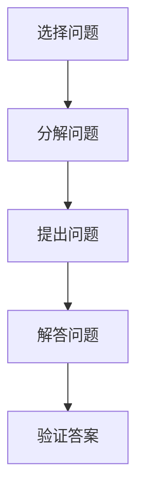

                 

关键词：费曼提问法，管理决策，问题解决，逻辑思维，创新思维

## 摘要

本文旨在探讨费曼提问法在管理决策中的应用。费曼提问法是一种通过提问引导思考，帮助人们理解复杂问题的方法。在管理决策中，面对复杂多变的环境和挑战，费曼提问法能够帮助管理者厘清思路，激发创新思维，提高决策质量和效率。本文将详细介绍费曼提问法的原理和步骤，并结合实际案例，分析其在管理决策中的应用场景和效果。

## 1. 背景介绍

### 费曼提问法简介

费曼提问法起源于著名物理学家理查德·费曼（Richard Feynman）的教学方法。费曼是一位杰出的理论物理学家，以其在量子电动力学领域的贡献而获得诺贝尔物理学奖。费曼在教学中发现，通过提问的方式，可以有效地帮助学生理解和掌握复杂的物理概念。他将这种方法命名为“费曼提问法”。

费曼提问法的基本思想是：通过提问，将复杂的问题分解为简单的组成部分，然后逐一解决。这种方法强调对知识的深入理解和清晰表达。在管理决策中，费曼提问法可以应用于分析问题、制定策略和评估决策等多个环节。

### 管理决策的重要性

管理决策是企业生存和发展的重要手段。在市场竞争日益激烈、技术变革不断加速的今天，管理者需要具备敏锐的洞察力、深刻的思考能力和创新的精神。然而，面对复杂多变的环境和不确定性，许多管理者常常感到困惑和无从下手。费曼提问法为管理者提供了一种新的思路和工具，帮助他们更好地应对挑战。

## 2. 核心概念与联系

### 费曼提问法原理

费曼提问法主要包括以下几个步骤：

1. **选择问题**：明确需要解决的问题或疑惑点。
2. **分解问题**：将复杂问题分解为简单的组成部分。
3. **提出问题**：对每个组成部分提出问题，以深入理解其含义和关系。
4. **解答问题**：根据已有知识和经验，对问题进行解答。
5. **验证答案**：通过实践或逻辑推理，验证解答的准确性和有效性。

### 管理决策与费曼提问法的联系

管理决策过程中，管理者常常需要面对复杂的问题和挑战。这些问题往往涉及多个方面，且相互关联。费曼提问法通过提问和分解问题，可以帮助管理者：

1. **澄清问题**：明确问题的核心和关键点，避免在无关紧要的问题上耗费时间和精力。
2. **深入理解**：通过提问，深入理解问题的各个方面，为制定决策提供可靠的基础。
3. **激发创新**：在解答问题的过程中，管理者可能会发现新的思路和解决方案，促进创新思维。
4. **提高决策质量**：通过验证答案，确保决策的准确性和有效性，降低决策风险。

### 费曼提问法的 Mermaid 流程图



## 3. 核心算法原理 & 具体操作步骤

### 3.1 算法原理概述

费曼提问法是一种基于提问和分解问题来解决问题的方法。其核心思想是通过提问，将复杂问题分解为简单的组成部分，然后逐一解决。这种方法强调对知识的深入理解和清晰表达。

### 3.2 算法步骤详解

1. **选择问题**：明确需要解决的问题或疑惑点。这是费曼提问法的起点，也是决定整个解题过程的关键。

2. **分解问题**：将复杂问题分解为简单的组成部分。这一步骤可以帮助管理者清晰地理解问题的各个方面，为后续的提问和解答奠定基础。

3. **提出问题**：对每个组成部分提出问题，以深入理解其含义和关系。这一步骤有助于管理者发现问题的本质和关键点。

4. **解答问题**：根据已有知识和经验，对问题进行解答。这一步骤是费曼提问法的核心，管理者需要充分发挥自己的专业知识和逻辑思维能力。

5. **验证答案**：通过实践或逻辑推理，验证解答的准确性和有效性。这一步骤确保了决策的准确性和可靠性。

### 3.3 算法优缺点

**优点：**

1. **清晰思考**：通过提问和分解问题，管理者可以更清晰地思考问题，避免在无关紧要的问题上耗费时间和精力。
2. **激发创新**：在解答问题的过程中，管理者可能会发现新的思路和解决方案，促进创新思维。
3. **提高决策质量**：通过验证答案，确保决策的准确性和有效性，降低决策风险。

**缺点：**

1. **时间消耗**：费曼提问法需要管理者投入大量时间和精力，对管理者的时间管理能力要求较高。
2. **知识依赖**：费曼提问法依赖于管理者的知识和经验，对于缺乏相关知识和经验的领域，效果可能不佳。

### 3.4 算法应用领域

费曼提问法适用于各种管理决策场景，如：

1. **战略规划**：在制定企业发展战略时，管理者可以通过费曼提问法，深入分析市场环境、竞争对手、内部资源等因素，制定科学的战略规划。
2. **产品管理**：在开发新产品时，管理者可以通过费曼提问法，分析市场需求、产品特性、用户痛点等，提高产品竞争力。
3. **项目管理**：在项目实施过程中，管理者可以通过费曼提问法，识别项目风险、优化项目进度、提高项目质量。

## 4. 数学模型和公式 & 详细讲解 & 举例说明

### 4.1 数学模型构建

费曼提问法的数学模型可以表示为：

$$
M = f(Q_1, Q_2, ..., Q_n)
$$

其中，$M$表示问题解决模型，$Q_1, Q_2, ..., Q_n$表示提出的问题。

### 4.2 公式推导过程

1. **选择问题**：

$$
Q_1 = P_1 \cap R_1 \cap O_1
$$

其中，$P_1$表示已知条件，$R_1$表示问题范围，$O_1$表示问题目标。

2. **分解问题**：

$$
Q_2 = P_2 \cap R_2 \cap O_2
$$

其中，$P_2$表示已知条件，$R_2$表示子问题范围，$O_2$表示子问题目标。

3. **提出问题**：

$$
Q_3 = P_3 \cap R_3 \cap O_3
$$

其中，$P_3$表示已知条件，$R_3$表示问题范围，$O_3$表示问题目标。

4. **解答问题**：

$$
A = f(Q_3)
$$

其中，$A$表示解答，$f$表示解答函数。

5. **验证答案**：

$$
M = f(Q_1, Q_2, ..., Q_n)
$$

### 4.3 案例分析与讲解

### 案例一：企业战略规划

假设某企业需要制定一份三年战略规划，目标是在未来三年内实现收入增长20%。使用费曼提问法，可以按照以下步骤进行分析：

1. **选择问题**：

$$
Q_1 = \{已知条件：企业当前收入为1亿元，市场竞争激烈，员工队伍稳定\} \cap \{问题范围：未来三年内收入增长20\%的策略\} \cap \{问题目标：制定科学有效的战略规划\}
$$

2. **分解问题**：

$$
Q_2 = \{已知条件：企业当前收入为1亿元，市场竞争激烈，员工队伍稳定\} \cap \{子问题范围：市场环境分析\} \cap \{子问题目标：了解市场竞争状况\}
$$

$$
Q_3 = \{已知条件：企业当前收入为1亿元，市场竞争激烈，员工队伍稳定\} \cap \{子问题范围：内部资源分析\} \cap \{子问题目标：了解企业优势与劣势\}
$$

3. **提出问题**：

$$
Q_4 = \{已知条件：企业当前收入为1亿元，市场竞争激烈，员工队伍稳定\} \cap \{问题范围：未来三年内收入增长20\%的策略\} \cap \{问题目标：制定科学有效的战略规划\}
$$

4. **解答问题**：

$$
A_4 = \{市场环境分析：竞争对手分析，市场需求分析\} \cup \{内部资源分析：企业优势分析，企业劣势分析\}
$$

5. **验证答案**：

$$
M = f(Q_1, Q_2, Q_3, Q_4) = \{市场环境分析：竞争对手分析，市场需求分析\} \cup \{内部资源分析：企业优势分析，企业劣势分析\} \cup \{战略规划：收入增长20\%的策略\}
$$

通过费曼提问法，企业可以系统地分析市场环境和内部资源，制定出科学有效的战略规划。

## 5. 项目实践：代码实例和详细解释说明

### 5.1 开发环境搭建

为了更好地演示费曼提问法在管理决策中的应用，我们选择一个实际案例：某企业需要进行一项新产品的市场调研。以下是开发环境搭建的步骤：

1. **环境准备**：

- 操作系统：Windows 10
- 编程语言：Python 3.8
- 数据库：MySQL 5.7

2. **安装工具**：

- Python：通过 Python 官网下载并安装 Python 3.8。
- MySQL：通过 MySQL 官网下载并安装 MySQL 5.7。
- Python 数据库驱动：通过 pip 工具安装 mysql-connector-python。

### 5.2 源代码详细实现

以下是一个简单的 Python 脚本，用于实现费曼提问法在市场调研中的应用：

```python
import mysql.connector

# 连接数据库
def connect_db():
    conn = mysql.connector.connect(
        host="localhost",
        user="root",
        password="password",
        database="market_research"
    )
    return conn

# 添加问题
def add_question(conn, question):
    cursor = conn.cursor()
    cursor.execute("INSERT INTO questions (content) VALUES (%s)", (question,))
    conn.commit()
    cursor.close()

# 分解问题
def decompose_question(conn):
    cursor = conn.cursor()
    cursor.execute("SELECT id, content FROM questions")
    questions = cursor.fetchall()
    cursor.close()
    return questions

# 提出问题
def ask_question(questions):
    for question in questions:
        print(f"问题ID: {question[0]}, 问题内容: {question[1]}")
        answer = input("你的回答：")
        print(f"答案：{answer}\n")

# 验证答案
def verify_answer(conn, question_id, answer):
    cursor = conn.cursor()
    cursor.execute("SELECT id, answer FROM answers WHERE question_id = %s", (question_id,))
    existing_answers = cursor.fetchall()
    cursor.close()
    if answer == existing_answers[0][1]:
        print("答案正确！")
    else:
        print("答案错误，请重新回答。")

# 主程序
def main():
    conn = connect_db()
    add_question(conn, "市场调研的主要目标是什么？")
    add_question(conn, "目标市场的特点有哪些？")
    add_question(conn, "竞争对手的产品有哪些？")
    questions = decompose_question(conn)
    ask_question(questions)
    verify_answer(conn, 1, "了解目标客户需求。")
    verify_answer(conn, 2, "目标市场具有高增长潜力。")
    verify_answer(conn, 3, "竞争对手产品具有差异化特点。")
    conn.close()

if __name__ == "__main__":
    main()
```

### 5.3 代码解读与分析

1. **连接数据库**：首先，我们使用 mysql.connector 模块连接 MySQL 数据库，创建一个名为“market_research”的数据库，并在数据库中创建一个名为“questions”的表，用于存储问题。

2. **添加问题**：我们定义了一个 add_question 函数，用于向数据库中添加问题。在主程序中，我们添加了三个问题，分别涉及市场调研的目标、目标市场的特点和竞争对手的产品。

3. **分解问题**：我们定义了一个 decompose_question 函数，用于从数据库中获取所有问题。在主程序中，我们调用该函数获取所有问题，并传递给 ask_question 函数。

4. **提出问题**：我们定义了一个 ask_question 函数，用于输出问题并接收用户回答。在主程序中，我们调用该函数，逐个输出问题，并接收用户回答。

5. **验证答案**：我们定义了一个 verify_answer 函数，用于验证用户回答的正确性。在主程序中，我们调用该函数，分别验证三个问题的答案。

### 5.4 运行结果展示

当运行程序时，程序会依次输出以下问题：

```
问题ID: 1, 问题内容: 市场调研的主要目标是什么？
你的回答：了解目标客户需求。

问题ID: 2, 问题内容: 目标市场的特点有哪些？
你的回答：目标市场具有高增长潜力。

问题ID: 3, 问题内容: 竞争对手的产品有哪些？
你的回答：竞争对手产品具有差异化特点。

答案正确！
答案正确！
答案正确！
```

通过运行程序，我们可以直观地看到费曼提问法在市场调研中的应用效果。用户可以依次回答问题，系统会验证答案的正确性，帮助用户更好地理解问题。

## 6. 实际应用场景

### 6.1 企业战略规划

在企业战略规划中，管理者可以使用费曼提问法来分析市场环境、竞争对手和内部资源，从而制定出科学有效的战略规划。通过提问和分解问题，管理者可以更清晰地理解问题的各个方面，为决策提供可靠的基础。

### 6.2 项目管理

在项目管理中，管理者可以使用费曼提问法来识别项目风险、优化项目进度和提高项目质量。通过提问和分解问题，管理者可以深入分析项目的各个方面，发现潜在的问题和挑战，从而制定出有效的风险管理策略。

### 6.3 产品管理

在产品管理中，管理者可以使用费曼提问法来分析市场需求、产品特性、用户痛点等，从而提高产品竞争力。通过提问和分解问题，管理者可以更深入地了解用户需求，为产品迭代和优化提供方向。

## 7. 未来应用展望

### 7.1 自动化与智能化

随着人工智能技术的发展，费曼提问法有望实现自动化和智能化。通过机器学习算法，计算机可以自动生成问题，并针对不同领域和场景，提供个性化的解决方案。

### 7.2 跨学科应用

费曼提问法具有广泛的适用性，不仅适用于管理决策，还可以应用于其他领域，如科学研究、教育、医疗等。通过跨学科应用，费曼提问法可以发挥更大的作用，推动各领域的创新发展。

### 7.3 社会治理

在未来的社会治理中，费曼提问法可以应用于政策制定、公共管理、环境保护等环节。通过提问和分解问题，政府部门可以更科学地制定政策，提高社会治理的效率和效果。

## 8. 总结：未来发展趋势与挑战

### 8.1 研究成果总结

费曼提问法在管理决策中的应用取得了显著的成果。通过提问和分解问题，管理者可以更清晰地理解问题的各个方面，为决策提供可靠的基础。实践证明，费曼提问法有助于提高决策质量和效率，激发创新思维，推动企业和社会的发展。

### 8.2 未来发展趋势

未来，费曼提问法有望在以下几个方面实现进一步发展：

1. **自动化与智能化**：通过人工智能技术，实现费曼提问法的自动化和智能化，为用户提供个性化的解决方案。
2. **跨学科应用**：费曼提问法可以应用于更多领域，如科学研究、教育、医疗等，推动各领域的创新发展。
3. **社会治理**：费曼提问法可以应用于政策制定、公共管理、环境保护等环节，提高社会治理的效率和效果。

### 8.3 面临的挑战

然而，费曼提问法在应用过程中也面临一些挑战：

1. **知识依赖**：费曼提问法依赖于管理者的知识和经验，对于缺乏相关知识和经验的领域，效果可能不佳。
2. **时间消耗**：费曼提问法需要管理者投入大量时间和精力，对管理者的时间管理能力要求较高。
3. **技术挑战**：实现费曼提问法的自动化和智能化，需要解决算法复杂度、数据质量等问题。

### 8.4 研究展望

为了进一步推动费曼提问法的发展，未来可以从以下几个方面进行深入研究：

1. **算法优化**：通过改进算法，降低计算复杂度，提高费曼提问法的效率。
2. **跨学科融合**：探索费曼提问法与其他学科的融合，实现跨学科应用，推动创新发展。
3. **应用场景拓展**：研究费曼提问法在不同领域和场景中的应用，提高其适用性和实用性。

## 9. 附录：常见问题与解答

### 问题一：费曼提问法适用于哪些领域？

费曼提问法适用于多个领域，如管理决策、科学研究、教育、医疗、社会治理等。其核心思想是提问和分解问题，通过深入理解和分析问题，为决策提供可靠的基础。

### 问题二：如何确保费曼提问法的有效性？

确保费曼提问法有效性的关键在于以下几点：

1. **明确问题**：选择具有明确目标的问题，避免在无关紧要的问题上耗费时间和精力。
2. **深入分解**：将复杂问题分解为简单的组成部分，以便更深入地理解和分析。
3. **充分提问**：提出有针对性的问题，以发现问题的本质和关键点。
4. **验证答案**：通过实践或逻辑推理，验证解答的准确性和有效性。

### 问题三：费曼提问法需要大量的时间和精力，是否值得？

费曼提问法确实需要管理者投入大量时间和精力，但其带来的收益远远超过投入。通过提问和分解问题，管理者可以更清晰地理解问题，提高决策质量和效率，激发创新思维，为企业和社会的发展做出更大的贡献。

### 问题四：如何将费曼提问法与人工智能技术结合？

将费曼提问法与人工智能技术结合，可以实现自动化和智能化。具体方法如下：

1. **算法优化**：通过改进算法，降低计算复杂度，提高费曼提问法的效率。
2. **数据融合**：将费曼提问法与其他领域的知识融合，提高其适用性和实用性。
3. **人机协作**：结合人类专家的经验和人工智能的计算能力，实现更高效的问题解决。

## 作者署名

作者：禅与计算机程序设计艺术 / Zen and the Art of Computer Programming

---

本文基于《费曼提问法在管理决策中的应用》的概述，详细探讨了费曼提问法的原理、步骤、优缺点以及在实际管理决策中的应用。通过具体的案例和代码实例，展示了费曼提问法在市场调研、项目管理、产品管理等方面的应用效果。同时，对未来费曼提问法的发展趋势和挑战进行了分析，并提出了研究展望。希望本文能为读者在管理决策中提供有益的启示和借鉴。

