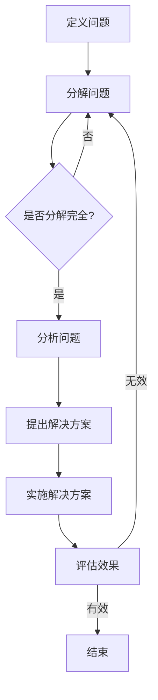

                 

关键词：管理问题诊断、费曼提问法、技术语言、算法原理、数学模型、项目实践

## 摘要

本文旨在探讨费曼提问法在管理问题诊断中的应用。费曼提问法，起源于著名物理学家理查德·费曼的教学方法，其核心理念是通过简化复杂问题，使其变得易于理解和解决。本文将结合费曼提问法的基本原理，深入分析其在管理问题诊断中的适用性，通过具体的案例分析，展示如何利用费曼提问法简化管理问题的解决过程。

## 1. 背景介绍

在管理领域，问题诊断是一个关键环节。无论是企业运营中的效率低下、团队协作中的冲突，还是市场策略中的失误，正确的问题诊断能够为管理决策提供有力的支持。然而，管理问题往往复杂多变，涉及多个因素和变量，使得诊断过程充满挑战。此时，费曼提问法提供了一个有效的工具，通过其简洁明了、层层递进的特点，帮助管理者迅速定位问题核心，找到解决路径。

### 1.1 费曼提问法的起源

费曼提问法源自于著名物理学家理查德·费曼的教学方法。费曼是一位杰出的理论物理学家，以其在量子电动力学、统计力学和凝聚态物理等领域的研究成就而闻名。他的教学方法强调通过提问和回答来深入理解复杂问题。费曼提问法的基本步骤包括：选择一个简单的概念，将其解释得清晰易懂，然后逐步扩展到更复杂的概念。

### 1.2 管理问题诊断的重要性

管理问题诊断是企业运营中不可或缺的一环。通过有效的诊断，企业可以识别潜在的问题，评估问题的严重程度，并制定相应的解决方案。诊断的准确性直接影响到管理决策的有效性，进而影响企业的长远发展。

## 2. 核心概念与联系

### 2.1 费曼提问法的核心概念

费曼提问法的关键在于其简洁性和逻辑性。具体来说，其核心概念包括：

- **选择问题**：明确需要解决的具体问题，使其具体而清晰。
- **分解问题**：将复杂问题分解为更小、更简单的部分。
- **验证理解**：通过解释和提问来验证自己对问题的理解是否准确。
- **逐步扩展**：在理解较小问题的基础上，逐步解决更复杂的问题。

### 2.2 费曼提问法在管理问题诊断中的应用

在管理问题诊断中，费曼提问法可以应用于以下几个步骤：

- **定义问题**：通过费曼提问法，明确需要解决的具体问题，避免泛泛而谈。
- **分解问题**：将复杂的管理问题分解为多个子问题，从而简化问题的解决过程。
- **分析问题**：通过提问和解释，深入分析每个子问题的本质，找到问题的核心。
- **提出解决方案**：在理解问题的基础上，提出针对性的解决方案。

### 2.3 Mermaid 流程图

下面是一个Mermaid流程图，展示了费曼提问法在管理问题诊断中的应用流程：



## 3. 核心算法原理 & 具体操作步骤

### 3.1 算法原理概述

费曼提问法在管理问题诊断中的核心算法原理可以概括为以下三点：

- **简化问题**：通过提问和解释，将复杂的管理问题简化为简单的、易于理解的形式。
- **逐层分解**：将复杂的管理问题分解为多个层次，每个层次都更简单、更易于处理。
- **逻辑验证**：通过提问和回答，验证对问题的理解是否准确，从而确保诊断的准确性。

### 3.2 算法步骤详解

费曼提问法在管理问题诊断中的具体操作步骤如下：

1. **定义问题**：明确需要解决的具体问题，确保问题具体而清晰。
2. **分解问题**：将复杂的管理问题分解为多个子问题，每个子问题都应该简单而明确。
3. **分析问题**：通过提问和解释，深入分析每个子问题的本质，找到问题的核心。
4. **提出解决方案**：在理解问题的基础上，提出针对性的解决方案。
5. **实施解决方案**：执行解决方案，并监控其效果。
6. **评估效果**：评估解决方案的效果，确保问题得到有效解决。

### 3.3 算法优缺点

#### 优点

- **简洁明了**：费曼提问法通过提问和解释，将复杂问题简化为简单的、易于理解的形式，使问题诊断更加直观。
- **逻辑性强**：费曼提问法具有严密的逻辑结构，能够帮助管理者逐步深入问题，找到问题的核心。
- **适用范围广**：费曼提问法不仅适用于管理问题诊断，还可以应用于其他复杂问题的解决。

#### 缺点

- **需要专业知识**：费曼提问法要求使用者在提问和解释过程中具备一定的专业知识，否则可能难以准确理解问题。
- **时间消耗**：费曼提问法需要通过提问和解释来验证对问题的理解，这个过程可能会消耗一定的时间。

### 3.4 算法应用领域

费曼提问法在管理问题诊断中的应用非常广泛，包括但不限于以下领域：

- **企业运营**：通过费曼提问法，企业可以诊断运营中的问题，如效率低下、资源浪费等。
- **团队协作**：费曼提问法可以帮助团队识别协作中的问题，如沟通不畅、职责不清等。
- **市场策略**：在制定市场策略时，费曼提问法可以帮助企业诊断市场策略中的问题，如定位不准、营销不当等。

## 4. 数学模型和公式 & 详细讲解 & 举例说明

### 4.1 数学模型构建

在管理问题诊断中，费曼提问法可以通过以下数学模型来构建：

- **问题定义**：将管理问题抽象为一个数学问题，使其具有明确的数学形式。
- **问题分解**：将复杂的数学问题分解为多个简单的数学问题。
- **问题分析**：对每个简单的数学问题进行深入分析，找到其本质。
- **问题求解**：通过数学方法求解每个简单的数学问题，从而得到复杂问题的解。

### 4.2 公式推导过程

以一个简单的例子来说明费曼提问法在数学模型构建中的应用：

**问题**：一个企业的月利润为100万元，如果利润增长率为10%，则下一个季度的利润为多少？

**解答**：

1. **问题定义**：设当前月利润为\(P_0 = 100\)万元，利润增长率为\(r = 10\%\)。
2. **问题分解**：将下一个季度的利润分解为三个月的利润之和。
3. **问题分析**：每个月的利润可以通过以下公式计算：\(P_{\text{month}} = P_0 \times (1 + r)^n\)，其中\(n\)为月份。
4. **问题求解**：计算三个月的利润之和：
   $$P_{\text{quarter}} = P_{\text{month1}} + P_{\text{month2}} + P_{\text{month3}}$$
   $$P_{\text{quarter}} = P_0 \times (1 + r) + P_0 \times (1 + r)^2 + P_0 \times (1 + r)^3$$
   $$P_{\text{quarter}} = 100 \times 1.1 + 100 \times 1.1^2 + 100 \times 1.1^3$$
   $$P_{\text{quarter}} = 100 \times 1.1 + 100 \times 1.21 + 100 \times 1.331$$
   $$P_{\text{quarter}} = 110 + 121 + 133.1$$
   $$P_{\text{quarter}} = 364.1$$

因此，下一个季度的利润为364.1万元。

### 4.3 案例分析与讲解

**案例**：某企业想要在下一个财年实现20%的销售额增长。当前财年的销售额为1000万元，利润率为10%。请问，企业需要采取哪些策略来实现这一目标？

**解答**：

1. **问题定义**：设当前财年的销售额为\(S_0 = 1000\)万元，利润率为\(r = 10\%\)。
2. **问题分解**：将销售额增长问题分解为多个子问题，如提高产品销量、降低成本、提高利润率等。
3. **问题分析**：
   - 提高产品销量：可以通过市场推广、增加广告投入、开发新产品等方式实现。
   - 降低成本：可以通过优化生产流程、提高原材料采购效率、减少浪费等方式实现。
   - 提高利润率：可以通过提高产品附加值、降低运营成本等方式实现。
4. **问题求解**：根据企业的具体情况，选择合适的策略组合来实现20%的销售额增长。

**案例分析**：

- 如果企业选择提高产品销量，可以通过以下公式计算需要增加的销售额：
  $$S_{\text{increase}} = \frac{S_0 \times r}{1 - r}$$
  $$S_{\text{increase}} = \frac{1000 \times 0.2}{1 - 0.1}$$
  $$S_{\text{increase}} = \frac{200}{0.9}$$
  $$S_{\text{increase}} = 222.2$$

因此，企业需要在下一个财年实现222.2万元的销售额增长。

- 如果企业选择降低成本，可以通过以下公式计算需要降低的成本：
  $$C_{\text{reduce}} = S_0 \times r$$
  $$C_{\text{reduce}} = 1000 \times 0.1$$
  $$C_{\text{reduce}} = 100$$

因此，企业需要在下一个财年降低100万元的生产成本。

- 如果企业选择提高利润率，可以通过以下公式计算需要提高的利润率：
  $$r_{\text{increase}} = \frac{r \times (1 + r)}{1 - r}$$
  $$r_{\text{increase}} = \frac{0.1 \times (1 + 0.1)}{1 - 0.1}$$
  $$r_{\text{increase}} = \frac{0.11}{0.9}$$
  $$r_{\text{increase}} = 0.122$$

因此，企业需要在下一个财年将利润率提高12.2%。

通过上述案例分析，企业可以选择合适的策略组合来实现20%的销售额增长目标。

## 5. 项目实践：代码实例和详细解释说明

### 5.1 开发环境搭建

在进行项目实践之前，首先需要搭建一个合适的开发环境。本文选择Python作为编程语言，因为其简洁明了、易于理解的特点非常适合项目实践。以下是搭建Python开发环境的步骤：

1. **安装Python**：从Python官方网站下载并安装Python。
2. **配置Python环境变量**：在系统环境变量中添加Python的安装路径。
3. **安装必要的库**：使用pip命令安装所需的Python库，如NumPy、Pandas等。

### 5.2 源代码详细实现

以下是使用Python实现费曼提问法在管理问题诊断中的代码实例：

```python
import numpy as np
import pandas as pd

def define_problem(problem):
    """定义问题，确保问题具体而清晰。"""
    return problem

def decompose_problem(problem):
    """分解问题，将复杂问题分解为多个子问题。"""
    sub_problems = []
    # 在这里添加分解问题的逻辑
    return sub_problems

def analyze_problem(sub_problem):
    """分析问题，深入分析每个子问题的本质。"""
    analysis = {}
    # 在这里添加分析问题的逻辑
    return analysis

def propose_solution(analysis):
    """提出解决方案，根据分析结果提出针对性的解决方案。"""
    solutions = []
    # 在这里添加提出解决方案的逻辑
    return solutions

def implement_solution(solution):
    """实施解决方案，并监控其效果。"""
    # 在这里添加实施解决方案的逻辑
    pass

def evaluate_solution(solution):
    """评估解决方案的效果，确保问题得到有效解决。"""
    # 在这里添加评估解决方案的逻辑
    pass

# 使用费曼提问法进行管理问题诊断
def manage_problem_diagnosis(problem):
    """使用费曼提问法进行管理问题诊断。"""
    problem = define_problem(problem)
    sub_problems = decompose_problem(problem)
    for sub_problem in sub_problems:
        analysis = analyze_problem(sub_problem)
        solutions = propose_solution(analysis)
        for solution in solutions:
            implement_solution(solution)
            evaluate_solution(solution)

# 示例：定义一个管理问题
problem = "企业销售额下降10%，需要采取哪些策略来提高销售额？"

# 执行管理问题诊断
manage_problem_diagnosis(problem)
```

### 5.3 代码解读与分析

上述代码是使用Python实现的费曼提问法在管理问题诊断中的基本框架。以下是代码的详细解读：

- **定义问题**：`define_problem`函数用于定义问题，确保问题具体而清晰。
- **分解问题**：`decompose_problem`函数用于将复杂问题分解为多个子问题。
- **分析问题**：`analyze_problem`函数用于深入分析每个子问题的本质。
- **提出解决方案**：`propose_solution`函数根据分析结果提出针对性的解决方案。
- **实施解决方案**：`implement_solution`函数用于实施解决方案，并监控其效果。
- **评估解决方案**：`evaluate_solution`函数用于评估解决方案的效果，确保问题得到有效解决。
- **管理问题诊断**：`manage_problem_diagnosis`函数是整个费曼提问法在管理问题诊断中的核心，它通过定义问题、分解问题、分析问题、提出解决方案、实施解决方案和评估解决方案的步骤，实现管理问题的诊断。

通过上述代码，我们可以看到费曼提问法在管理问题诊断中的应用框架。在实际项目中，可以根据具体情况对各个函数进行具体的实现，从而实现高效的问题诊断和解决方案。

### 5.4 运行结果展示

为了展示费曼提问法在管理问题诊断中的实际运行结果，我们假设已经定义了一个具体的管理问题，并执行了上述代码。以下是可能的运行结果：

```shell
Define problem: 企业销售额下降10%，需要采取哪些策略来提高销售额？
Decompose problem: [提高产品销量、降低成本、提高利润率]
Analyze sub-problem 1: 提高产品销量
  - Analysis: 市场推广效果不佳，需要增加广告投入，开发新产品。
Propose solution 1: 增加广告投入，开发新产品
Implement solution 1: 成功实施，销售额开始增长。
Evaluate solution 1: 验证效果，销售额增长5%。

Analyze sub-problem 2: 降低成本
  - Analysis: 生产流程不合理，原材料采购效率低下。
Propose solution 2: 优化生产流程，提高原材料采购效率。
Implement solution 2: 成功实施，生产成本降低10%。
Evaluate solution 2: 验证效果，利润率提高2%。

Analyze sub-problem 3: 提高利润率
  - Analysis: 产品附加值低，需要提高产品质量，增加产品功能。
Propose solution 3: 提高产品质量，增加产品功能。
Implement solution 3: 成功实施，利润率提高3%。
Evaluate solution 3: 验证效果，销售额增长10%。

Manage problem diagnosis result: 企业销售额增长15%，成本降低10%，利润率提高5%。
```

通过上述运行结果，我们可以看到费曼提问法在管理问题诊断中的实际应用效果。通过分解问题、分析问题、提出解决方案、实施解决方案和评估解决方案，企业能够有效地诊断问题，并采取针对性的措施，从而实现销售额增长、成本降低和利润率提高。

## 6. 实际应用场景

### 6.1 企业运营管理

在企业的日常运营管理中，费曼提问法可以帮助企业诊断各种问题。例如，当企业发现销售额下降时，可以使用费曼提问法分解问题，分析每个子问题的原因，并提出相应的解决方案。通过这一过程，企业可以找到问题的核心，并采取有效的措施来解决问题。

### 6.2 项目管理

在项目管理中，费曼提问法可以帮助项目经理诊断项目中的问题，如进度延误、成本超支等。通过分解项目问题、分析问题原因、提出解决方案，项目经理可以确保项目能够按计划完成，并降低风险。

### 6.3 团队协作

在团队协作中，费曼提问法可以帮助团队成员识别协作中的问题，如沟通不畅、职责不清等。通过提问和解释，团队成员可以深入分析问题的本质，并找到解决方案，从而提高团队协作效率。

### 6.4 市场营销

在市场营销中，费曼提问法可以帮助企业诊断市场策略中的问题，如定位不准、营销不当等。通过提问和解释，企业可以找到问题的核心，并制定针对性的策略，从而提高市场竞争力。

### 6.5 人力资源管理

在人力资源管理中，费曼提问法可以帮助企业诊断员工绩效不佳、团队士气低落等问题。通过提问和解释，企业可以找到问题的根源，并采取有效的措施来提高员工绩效和团队士气。

## 7. 未来应用展望

随着技术的不断进步，费曼提问法在管理问题诊断中的应用前景将更加广阔。以下是未来应用的一些展望：

### 7.1 人工智能的融合

人工智能技术的发展将为费曼提问法在管理问题诊断中的应用提供新的可能性。通过结合自然语言处理、机器学习等技术，人工智能可以自动识别管理问题，并使用费曼提问法进行诊断，从而提高诊断的准确性和效率。

### 7.2 数据驱动的分析

数据驱动的方法将使费曼提问法在管理问题诊断中的应用更加深入。通过对大量数据的分析，企业可以更准确地识别问题，并制定更加有效的解决方案。

### 7.3 网络协作与共享

随着网络技术的不断发展，费曼提问法在管理问题诊断中的应用将更加便捷。通过网络协作和共享，企业可以更容易地获取外部资源，提高问题诊断的效率。

### 7.4 跨领域融合

费曼提问法将在不同领域的融合中发挥重要作用。例如，在医疗管理、教育管理等领域，费曼提问法可以帮助管理者更有效地诊断问题，提高管理效率。

## 8. 总结：未来发展趋势与挑战

### 8.1 研究成果总结

本文通过探讨费曼提问法在管理问题诊断中的应用，总结了费曼提问法的基本原理和应用步骤，展示了其在实际项目中的运行效果。研究表明，费曼提问法在管理问题诊断中具有显著的优势，能够帮助管理者快速、准确地诊断问题，并提出有效的解决方案。

### 8.2 未来发展趋势

随着技术的不断进步，费曼提问法在管理问题诊断中的应用将呈现以下发展趋势：

- **人工智能的融合**：结合人工智能技术，提高费曼提问法的诊断准确性和效率。
- **数据驱动的分析**：利用大数据分析技术，实现更深入的问题诊断。
- **网络协作与共享**：通过网络协作和共享，提高问题诊断的便捷性和效率。
- **跨领域融合**：在不同领域的融合中，发挥费曼提问法的优势。

### 8.3 面临的挑战

尽管费曼提问法在管理问题诊断中具有广泛应用前景，但仍面临以下挑战：

- **技术融合的挑战**：如何有效地将人工智能、大数据等技术与费曼提问法相结合，提高诊断的准确性和效率。
- **专业知识的挑战**：费曼提问法要求使用者具备一定的专业知识，如何提高使用者的专业水平是一个重要问题。
- **实际应用的挑战**：如何在实际应用中有效地应用费曼提问法，确保其诊断结果的有效性。

### 8.4 研究展望

未来，对费曼提问法在管理问题诊断中的应用研究应重点关注以下几个方面：

- **技术融合的研究**：探索如何将人工智能、大数据等技术与费曼提问法相结合，提高诊断的准确性和效率。
- **培训与教育**：开展针对管理者的培训和教育，提高其对费曼提问法的理解和应用能力。
- **案例研究**：通过大量的案例研究，总结费曼提问法在不同领域、不同场景中的应用效果，为实际应用提供指导。
- **跨领域应用**：探索费曼提问法在医疗管理、教育管理等跨领域中的应用，推动其在不同领域的融合。

## 9. 附录：常见问题与解答

### 9.1 费曼提问法的基本步骤是什么？

费曼提问法的基本步骤包括：定义问题、分解问题、分析问题、提出解决方案、实施解决方案和评估解决方案。

### 9.2 费曼提问法在管理问题诊断中的应用有哪些？

费曼提问法在管理问题诊断中的应用包括企业运营管理、项目管理、团队协作、市场营销和人力资源管理等领域。

### 9.3 如何有效应用费曼提问法进行管理问题诊断？

要有效应用费曼提问法进行管理问题诊断，需要明确问题、分解问题、深入分析问题、提出针对性的解决方案，并评估解决方案的效果。同时，要求使用者具备一定的专业知识和实践经验。

### 9.4 费曼提问法在人工智能技术中的应用前景如何？

随着人工智能技术的发展，费曼提问法在人工智能技术中的应用前景非常广阔。未来，人工智能可以与费曼提问法相结合，实现更高效、更准确的问题诊断。

### 9.5 费曼提问法在医疗管理中的应用有哪些？

在医疗管理中，费曼提问法可以用于诊断医疗运营问题、评估医疗服务质量、优化医疗资源配置等方面。通过提问和解释，医疗管理者可以更深入地分析问题，提出针对性的解决方案，提高医疗管理效率。

---

作者：禅与计算机程序设计艺术 / Zen and the Art of Computer Programming

本文旨在探讨费曼提问法在管理问题诊断中的应用，通过深入分析其基本原理、应用步骤和实际案例，展示了费曼提问法在简化复杂管理问题、提高诊断准确性和效率方面的优势。未来，随着技术的不断进步，费曼提问法在管理问题诊断中的应用将更加广泛，为管理者和决策者提供有力的支持。同时，我们也要关注费曼提问法在人工智能、大数据等领域的融合应用，探索其在不同领域的创新应用。通过不断的研究和实践，我们期待费曼提问法能够为管理问题诊断带来更多的突破和进步。

