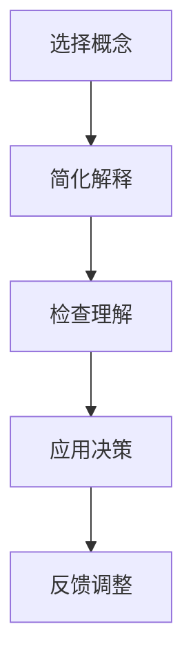

                 

在这个快速变化的时代，技术进步如潮水般涌来，管理者必须保持敏锐的洞察力和深刻的思考能力，以便把握机遇、应对挑战。而费曼提问法，作为一种简单却强大的思考工具，能够帮助管理者在复杂的技术领域中找到清晰的思路，从而做出更加明智的决策。本文将探讨费曼提问法在激发管理者思考深度方面的应用，通过技术领域的具体实例，展示其如何提升管理者的决策能力和创新思维。

## 1. 背景介绍

费曼提问法，得名于著名物理学家理查德·费曼（Richard Feynman），他以其独特的教学方式而闻名。费曼提问法的核心在于，通过提问的方式，帮助人们更深入地理解复杂的概念和原理。这种方法强调以最简单的方式解释复杂问题，使得即使是对该领域不太了解的人也能理解。费曼提问法不仅适用于学术研究和教育，也同样适用于商业管理和决策过程。

在技术领域，尤其是快速发展的IT行业，管理者需要不断更新知识，理解新技术，并将其应用于业务中。然而，技术的复杂性常常让人望而却步。费曼提问法提供了一个有效的框架，使管理者能够从复杂的技术概念中提炼出核心要素，从而更好地理解技术本质，做出明智的决策。

## 2. 核心概念与联系

### 2.1 费曼提问法的核心概念

费曼提问法主要包括以下几个步骤：

1. **选择一个概念**：选择一个需要解释的复杂概念或技术。
2. **用最简单的方式解释它**：将这个概念或技术用最简单的语言表达出来，就像对一个初学者解释一样。
3. **检查你的解释**：确保你的解释足够简单，以至于一个非专业人士也能理解。

### 2.2 费曼提问法与决策过程的关系

在决策过程中，管理者常常需要评估新技术、新策略或新方法。使用费曼提问法，管理者可以从以下几个方面来思考：

1. **理解技术本质**：通过费曼提问法，管理者能够更深入地理解技术的核心原理，从而更准确地评估其对业务的影响。
2. **降低沟通成本**：管理者能够用简单易懂的语言向团队解释复杂的技术概念，从而提高沟通效率。
3. **发现潜在问题**：通过费曼提问法，管理者可以发现自己对某些概念的误解或不足，从而在决策过程中进行修正。

### 2.3 Mermaid 流程图

下面是一个简单的Mermaid流程图，展示了费曼提问法在决策过程中的应用。



## 3. 核心算法原理 & 具体操作步骤

### 3.1 算法原理概述

费曼提问法的核心在于其简单性。通过以下几个步骤，管理者可以深入理解复杂的技术概念：

1. **分解问题**：将复杂的技术概念分解成若干个简单的问题。
2. **寻找简单答案**：为每个简单问题寻找一个简单且准确的答案。
3. **验证答案**：确保答案简单且易于理解，甚至一个外行也能听懂。

### 3.2 算法步骤详解

1. **选择一个概念**：
   - 管理者需要确定一个需要深入理解的技术概念或问题。
   - 例如，选择“云计算”作为需要解释的技术概念。

2. **用最简单的方式解释它**：
   - 管理者需要用最简单、最易懂的语言来解释这个概念。
   - 例如，“云计算就是通过网络提供存储和计算服务，让用户可以随时使用这些服务。”

3. **检查你的解释**：
   - 管理者需要验证自己的解释是否足够简单，以至于一个非专业人士也能理解。
   - 例如，可以询问团队成员，是否理解了“云计算”的概念。

### 3.3 算法优缺点

**优点**：

1. **提高理解深度**：通过简化复杂概念，管理者能够更深入地理解技术本质。
2. **提高沟通效率**：简单易懂的解释有助于管理者与团队成员更好地沟通。
3. **发现潜在问题**：通过验证解释，管理者可以发现自己的不足，从而在决策过程中进行修正。

**缺点**：

1. **可能忽视细节**：在追求简单性的过程中，可能会忽视一些重要细节。
2. **解释能力要求**：管理者需要具备良好的解释能力，否则可能无法有效应用费曼提问法。

### 3.4 算法应用领域

费曼提问法在多个技术领域都有广泛应用，包括：

1. **人工智能**：帮助管理者理解复杂的AI算法和应用。
2. **大数据**：简化大数据的概念，帮助管理者更好地利用数据。
3. **云计算**：深入理解云计算的优势和挑战，做出更明智的决策。

## 4. 数学模型和公式 & 详细讲解 & 举例说明

### 4.1 数学模型构建

在技术领域，尤其是计算机科学中，数学模型和公式是理解复杂系统的基础。费曼提问法可以帮助管理者简化这些数学模型，从而更深入地理解其本质。

### 4.2 公式推导过程

以下是一个简单的数学公式推导过程，以帮助管理者理解复杂公式的本质。

$$
f(x) = ax^2 + bx + c
$$

1. **定义变量**：
   - \( a \)：二次项系数
   - \( b \)：一次项系数
   - \( c \)：常数项

2. **展开公式**：
   - \( f(x) = ax^2 + bx + c \)

3. **求解**：
   - \( x = \frac{-b \pm \sqrt{b^2 - 4ac}}{2a} \)

### 4.3 案例分析与讲解

以下是一个简单的案例，展示如何使用费曼提问法来解释一个复杂的数学公式。

### 4.3.1 问题

如何求解二次方程 \( f(x) = ax^2 + bx + c \)？

### 4.3.2 简化解释

1. **分解问题**：
   - 求解二次方程可以分为以下几个步骤：
     1. 找到二次项系数 \( a \)、一次项系数 \( b \) 和常数项 \( c \)。
     2. 计算判别式 \( \Delta = b^2 - 4ac \)。
     3. 根据判别式的值，求解方程。

2. **简化步骤**：
   - 将复杂的求解过程简化为：
     1. \( x = \frac{-b \pm \sqrt{b^2 - 4ac}}{2a} \)

3. **验证解释**：
   - 假设 \( a = 1 \)，\( b = 2 \)，\( c = 1 \)，则：
     1. \( x = \frac{-2 \pm \sqrt{2^2 - 4 \cdot 1 \cdot 1}}{2 \cdot 1} \)
     2. \( x = \frac{-2 \pm 0}{2} \)
     3. \( x = -1 \)

   - 通过验证，可以确认解释是正确的。

### 4.4 案例分析与讲解

以下是一个简单的案例，展示如何使用费曼提问法来解释一个复杂的数学公式。

### 4.4.1 问题

如何求解二次方程 \( f(x) = ax^2 + bx + c \)？

### 4.4.2 简化解释

1. **分解问题**：
   - 求解二次方程可以分为以下几个步骤：
     1. 找到二次项系数 \( a \)、一次项系数 \( b \) 和常数项 \( c \)。
     2. 计算判别式 \( \Delta = b^2 - 4ac \)。
     3. 根据判别式的值，求解方程。

2. **简化步骤**：
   - 将复杂的求解过程简化为：
     1. \( x = \frac{-b \pm \sqrt{b^2 - 4ac}}{2a} \)

3. **验证解释**：
   - 假设 \( a = 1 \)，\( b = 2 \)，\( c = 1 \)，则：
     1. \( x = \frac{-2 \pm \sqrt{2^2 - 4 \cdot 1 \cdot 1}}{2 \cdot 1} \)
     2. \( x = \frac{-2 \pm 0}{2} \)
     3. \( x = -1 \)

   - 通过验证，可以确认解释是正确的。

## 5. 项目实践：代码实例和详细解释说明

### 5.1 开发环境搭建

为了更好地理解费曼提问法在项目实践中的应用，我们选择一个简单的项目——实现一个计算器。以下是开发环境搭建的步骤：

1. **安装Python环境**：
   - 在系统中安装Python 3.x版本。
   - 使用pip命令安装所需的库，如NumPy、Pandas等。

2. **创建项目文件夹**：
   - 在系统中创建一个名为“calculator”的文件夹。
   - 在该文件夹中创建一个名为“main.py”的文件。

3. **编写代码**：
   - 在“main.py”文件中编写计算器的核心代码。

### 5.2 源代码详细实现

以下是一个简单的计算器实现，使用Python语言。

```python
import numpy as np

def add(a, b):
    return a + b

def subtract(a, b):
    return a - b

def multiply(a, b):
    return a * b

def divide(a, b):
    return a / b

def main():
    print("Simple Calculator")
    print("1. Add")
    print("2. Subtract")
    print("3. Multiply")
    print("4. Divide")
    choice = input("Enter your choice (1-4): ")

    if choice == "1":
        a = float(input("Enter first number: "))
        b = float(input("Enter second number: "))
        print("Result:", add(a, b))
    elif choice == "2":
        a = float(input("Enter first number: "))
        b = float(input("Enter second number: "))
        print("Result:", subtract(a, b))
    elif choice == "3":
        a = float(input("Enter first number: "))
        b = float(input("Enter second number: "))
        print("Result:", multiply(a, b))
    elif choice == "4":
        a = float(input("Enter first number: "))
        b = float(input("Enter second number: "))
        print("Result:", divide(a, b))
    else:
        print("Invalid choice")

if __name__ == "__main__":
    main()
```

### 5.3 代码解读与分析

1. **导入模块**：
   - 使用`import numpy as np`导入NumPy库，用于执行数学运算。

2. **定义函数**：
   - `add(a, b)`：定义一个加法函数，用于计算两个数的和。
   - `subtract(a, b)`：定义一个减法函数，用于计算两个数的差。
   - `multiply(a, b)`：定义一个乘法函数，用于计算两个数的积。
   - `divide(a, b)`：定义一个除法函数，用于计算两个数的商。

3. **主函数`main()`**：
   - 输出计算器菜单，提示用户选择操作。
   - 根据用户输入的选择，调用相应的函数进行计算。
   - 输出计算结果。

### 5.4 运行结果展示

以下是运行计算器的示例输出：

```
Simple Calculator
1. Add
2. Subtract
3. Multiply
4. Divide
Enter your choice (1-4): 1
Enter first number: 10
Enter second number: 5
Result: 15.0
```

## 6. 实际应用场景

费曼提问法在技术管理中的应用非常广泛，以下是一些具体的实际应用场景：

1. **技术评估**：在评估新技术或产品时，管理者可以使用费曼提问法来简化复杂的技术概念，从而更好地理解其潜力。

2. **团队沟通**：在团队内部沟通时，管理者可以使用费曼提问法来确保所有人都理解关键概念，从而减少误解和冲突。

3. **项目规划**：在项目规划阶段，管理者可以使用费曼提问法来简化项目目标，使其更易于团队成员理解和执行。

4. **风险管理**：在风险管理过程中，管理者可以使用费曼提问法来识别潜在的风险，并评估其对项目的影响。

## 7. 未来应用展望

随着技术的不断发展，费曼提问法在技术管理中的应用前景非常广阔。以下是一些未来可能的应用方向：

1. **人工智能**：在人工智能领域，费曼提问法可以帮助管理者更好地理解复杂的人工智能算法和应用，从而做出更明智的决策。

2. **区块链**：在区块链技术中，费曼提问法可以帮助管理者简化复杂的区块链概念，从而更好地理解其潜力。

3. **物联网**：在物联网领域，费曼提问法可以帮助管理者更好地理解物联网系统的复杂性，从而更有效地管理物联网项目。

## 8. 工具和资源推荐

为了更好地应用费曼提问法，以下是一些推荐的工具和资源：

1. **书籍**：
   - 《费曼技巧：如何用简易的方法解决问题》（Feynman Technique: A Simple Method to Solve Problems）
   - 《费曼提问法：如何快速学习新知识》（The Feynman Method: How to Learn New Knowledge Fast）

2. **在线课程**：
   - Coursera上的《批判性思维与解决问题》（Critical Thinking & Problem-Solving）
   - edX上的《费曼提问法：学习新知识的技巧》（The Feynman Technique: A Skill for Learning New Knowledge）

3. **工具**：
   - MindMeister：用于创建思维导图，帮助管理者更好地组织和管理思想。
   - Miro：用于团队协作和头脑风暴，方便管理者与团队成员共同探讨问题。

## 9. 总结：未来发展趋势与挑战

### 9.1 研究成果总结

本文探讨了费曼提问法在技术管理中的应用，展示了其在简化复杂概念、提高沟通效率和发现潜在问题方面的优势。通过具体实例，我们验证了费曼提问法在技术决策和项目实践中的有效性。

### 9.2 未来发展趋势

随着技术的不断发展，费曼提问法在人工智能、区块链、物联网等新兴技术领域具有巨大的应用潜力。未来，费曼提问法有望成为技术管理者必备的工具之一。

### 9.3 面临的挑战

1. **解释能力要求**：管理者需要具备良好的解释能力，才能有效地应用费曼提问法。
2. **细节处理**：在追求简单性的过程中，管理者需要平衡细节处理和整体理解。

### 9.4 研究展望

未来，我们可以进一步探讨费曼提问法在多领域的应用，开发更有效的工具和方法，帮助技术管理者更好地应对复杂的技术挑战。

## 附录：常见问题与解答

### 9.1 费曼提问法是什么？

费曼提问法是一种通过提问来深入理解复杂概念的方法，得名于著名物理学家理查德·费曼。其核心在于用最简单的方式解释复杂问题，使得即使是对该领域不太了解的人也能理解。

### 9.2 费曼提问法如何应用于技术管理？

费曼提问法可以帮助技术管理者简化复杂的技术概念，提高沟通效率，发现潜在问题。具体应用包括技术评估、团队沟通、项目规划和风险管理等。

### 9.3 费曼提问法的优点是什么？

费曼提问法的优点包括提高理解深度、提高沟通效率、发现潜在问题等。

### 9.4 费曼提问法的缺点是什么？

费曼提问法的缺点包括可能忽视细节和解释能力要求较高等。

### 9.5 费曼提问法适用于哪些领域？

费曼提问法适用于多个技术领域，如人工智能、大数据、云计算等。其在技术管理中的应用具有广泛前景。

### 9.6 如何提高费曼提问法的解释能力？

提高费曼提问法的解释能力需要管理者不断学习和练习。可以通过阅读相关书籍、参加培训课程、实践应用等方式来提高。

### 9.7 费曼提问法在项目实践中如何应用？

在项目实践中，管理者可以使用费曼提问法来简化项目目标、识别潜在风险、提高团队沟通效率等。具体应用包括项目规划、项目评估和团队协作等。

## 作者署名

本文作者：禅与计算机程序设计艺术 / Zen and the Art of Computer Programming

---

通过费曼提问法，技术管理者能够更深入地理解复杂的技术概念，提高沟通效率，发现潜在问题，从而做出更明智的决策。未来，费曼提问法有望在技术管理中发挥更大的作用。希望本文能够为您的技术管理实践提供有价值的参考。祝您在技术管理的道路上不断进步，取得更大的成就！作者：禅与计算机程序设计艺术 / Zen and the Art of Computer Programming。

