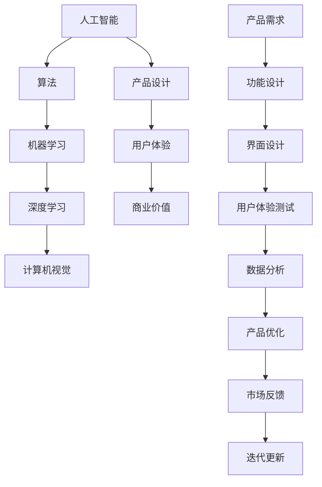
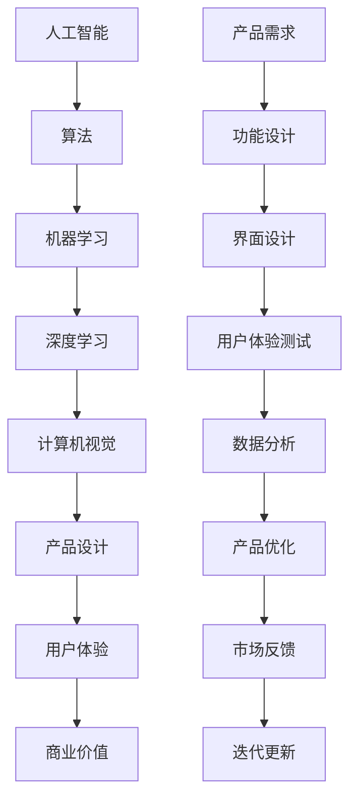

                 

关键词：贾扬清、产品经理、AI、创新产品、应用场景、未来展望

> 摘要：本文旨在探讨人工智能（AI）产品经理的角色及其在创新产品开发中的重要性。通过对贾扬清在AI领域的研究和实践的深入分析，我们揭示了AI技术与产品设计的深度融合，以及这种融合对新兴产品形态和应用场景的影响。文章结构如下：首先介绍背景，然后阐述AI与产品设计的核心概念和联系，接着探讨核心算法原理和数学模型，通过项目实践展示代码实例，分析实际应用场景，并展望未来发展趋势和挑战。

## 1. 背景介绍

随着人工智能技术的飞速发展，AI已经成为驱动创新的重要力量。从深度学习、自然语言处理到计算机视觉，AI技术正逐步渗透到各行各业。在这种背景下，AI产品经理的角色变得尤为关键。他们不仅需要理解AI技术，还必须具备良好的产品设计能力，以确保AI技术能够有效地转化为实际产品。

贾扬清是一位在人工智能领域具有深厚造诣的学者和实践者。他的研究成果和经验为AI产品经理提供了宝贵的指导和启示。本文将结合贾扬清的研究，探讨AI与产品设计的结合点，以及这种结合如何推动创新产品形态和应用场景的出现。

### 1.1 AI技术的快速发展

近年来，AI技术取得了令人瞩目的进展。深度学习算法的突破，使得计算机在图像识别、语音识别等领域取得了显著成果。自然语言处理技术的进步，使得机器能够更好地理解和生成自然语言，为智能客服、智能写作等应用提供了可能。计算机视觉技术的发展，使得机器人能够更好地感知和理解周围环境，为智能家居、自动驾驶等领域带来了变革。

这些技术的快速发展，不仅提升了AI系统的性能，也拓宽了其应用范围。然而，AI技术的潜力远不止于此。未来，随着计算能力的提升和算法的优化，AI技术有望在更多领域取得突破，从而推动社会进步。

### 1.2 AI产品经理的角色

在AI时代，产品经理的角色发生了显著变化。传统的产品经理主要关注产品功能、用户体验和商业价值，而AI产品经理则需要在这些基础上，进一步考虑AI技术的应用和影响。他们不仅需要具备产品设计的专业技能，还必须对AI技术有深入的了解。

AI产品经理的主要职责包括：

- **需求分析**：理解用户需求，并将其转化为具体的产品功能。
- **技术选型**：选择合适的AI技术，以满足产品需求。
- **设计迭代**：与设计团队合作，不断优化产品界面和用户体验。
- **项目管理**：确保产品按时交付，并在开发过程中协调各方资源。

### 1.3 贾扬清的研究与实践

贾扬清是AI领域的杰出代表。他的研究成果涵盖了计算机视觉、深度学习等多个方面。他提出的“端到端学习”理念，为AI系统设计提供了新的思路。此外，他在产品设计和开发方面也有丰富的实践经验。

贾扬清的研究和实践，为AI产品经理提供了宝贵的经验和启示。他的工作表明，AI技术与产品设计的结合，不仅可以提升产品的性能和用户体验，还可以开辟新的应用场景。本文将围绕这一主题，深入探讨AI产品经理的角色和职责，以及如何通过AI技术实现创新产品开发。

## 2. 核心概念与联系

在探讨AI产品经理的角色之前，我们需要了解一些核心概念，并阐述它们之间的联系。以下是一个Mermaid流程图，展示了这些核心概念及其相互关系：



### 2.1 核心概念

- **人工智能（AI）**：指计算机系统模拟人类智能行为的能力，包括学习、推理、感知和决策等。
- **算法**：解决问题的方法步骤，是AI系统的核心。
- **机器学习**：一种AI方法，通过数据驱动的方式，让计算机自动改进其性能。
- **深度学习**：基于多层神经网络的机器学习方法，适用于处理复杂数据。
- **计算机视觉**：使计算机能够“看”和理解图像和视频。
- **产品设计**：包括功能设计、界面设计和用户体验等方面。
- **用户体验（UX）**：用户在使用产品过程中的感受和体验。
- **商业价值**：产品为企业和用户带来的经济利益。
- **产品需求**：用户对产品的期望和需求。

### 2.2 核心概念的联系

AI技术与产品设计的结合，涉及到多个核心概念的交互和融合。以下是一个简化的流程图，展示了这些概念之间的联系：



在这个流程中，产品需求是整个过程的起点。产品经理需要理解用户需求，并将其转化为具体的功能和设计要求。这些需求驱动了算法和技术的选择，进而影响了产品的设计和用户体验。通过不断的用户体验测试和数据分析，产品可以得到持续的优化和迭代，从而提升其商业价值。

贾扬清的研究和实践，为这一过程提供了深刻的见解。他强调，AI技术的应用不仅需要技术的创新，还需要在产品设计和用户体验方面进行深入的思考。通过将AI技术与产品设计相结合，可以创造出更具创新性和商业价值的产品。

## 3. 核心算法原理 & 具体操作步骤

在AI产品经理的日常工作中，核心算法原理的理解和应用至关重要。以下将详细介绍AI的核心算法原理，并给出具体操作步骤。

### 3.1 算法原理概述

AI的核心算法包括机器学习、深度学习和计算机视觉。这些算法的基本原理如下：

- **机器学习**：通过学习大量数据，让计算机自动改进其性能。常见的机器学习算法有线性回归、决策树、支持向量机等。
- **深度学习**：基于多层神经网络的算法，能够处理复杂数据。深度学习算法包括卷积神经网络（CNN）、循环神经网络（RNN）等。
- **计算机视觉**：使计算机能够“看”和理解图像和视频。计算机视觉算法包括目标检测、图像分割、人脸识别等。

### 3.2 算法步骤详解

以下是一个简单的机器学习算法——线性回归——的具体步骤：

#### 3.2.1 数据收集与预处理

1. 收集相关数据，如房价、面积、位置等。
2. 清洗数据，去除异常值和缺失值。
3. 数据归一化，使其具有相同的尺度。

#### 3.2.2 模型训练

1. 将数据分为训练集和测试集。
2. 选择合适的线性回归模型。
3. 使用训练集数据训练模型。

#### 3.2.3 模型评估

1. 使用测试集数据评估模型性能。
2. 计算模型误差，如均方误差（MSE）。
3. 调整模型参数，优化性能。

#### 3.2.4 模型应用

1. 将训练好的模型应用于实际场景，如预测房价。
2. 持续收集反馈数据，进行模型更新。

### 3.3 算法优缺点

- **线性回归**：
  - 优点：简单、易于实现，适用于线性关系较强的数据。
  - 缺点：无法处理非线性关系，对异常值敏感。

- **深度学习**：
  - 优点：能够处理复杂数据，具有强大的表征能力。
  - 缺点：计算资源需求高，训练时间较长。

- **计算机视觉**：
  - 优点：能够在视觉数据中提取丰富的信息，适用于图像识别、目标检测等。
  - 缺点：对噪声敏感，对光照变化敏感。

### 3.4 算法应用领域

- **机器学习**：金融风控、自然语言处理、推荐系统等。
- **深度学习**：图像识别、语音识别、自动驾驶等。
- **计算机视觉**：安防监控、医疗诊断、自动驾驶等。

贾扬清的研究表明，通过将AI算法与产品设计相结合，可以创造出更具创新性和商业价值的产品。例如，在智能家居领域，通过计算机视觉算法，可以实现对家庭环境的智能监控和自动化控制，从而提升用户体验和安全性。

## 4. 数学模型和公式 & 详细讲解 & 举例说明

在AI产品开发中，数学模型和公式是算法设计和优化的基础。以下将介绍一些常见的数学模型和公式，并给出详细的推导过程和实际应用案例。

### 4.1 数学模型构建

在AI产品开发中，常见的数学模型包括线性回归模型、逻辑回归模型和神经网络模型。以下是这些模型的构建过程：

#### 4.1.1 线性回归模型

线性回归模型是一种用于预测连续值的模型。其基本公式如下：

$$
y = \beta_0 + \beta_1x
$$

其中，$y$ 是预测值，$x$ 是输入特征，$\beta_0$ 和 $\beta_1$ 是模型参数。

#### 4.1.2 逻辑回归模型

逻辑回归模型是一种用于预测概率的模型。其基本公式如下：

$$
P(y=1) = \frac{1}{1 + e^{-(\beta_0 + \beta_1x})}
$$

其中，$y$ 是预测值，$x$ 是输入特征，$\beta_0$ 和 $\beta_1$ 是模型参数。

#### 4.1.3 神经网络模型

神经网络模型是一种用于处理复杂数据的模型。其基本结构包括输入层、隐藏层和输出层。以下是神经网络模型的计算过程：

1. 输入层到隐藏层的计算：

$$
z_i = \sum_{j=1}^{n} w_{ij}x_j + b_i
$$

其中，$z_i$ 是隐藏层第 $i$ 个节点的计算值，$x_j$ 是输入特征，$w_{ij}$ 是连接权重，$b_i$ 是偏置。

2. 激活函数的应用：

$$
a_i = \sigma(z_i)
$$

其中，$\sigma$ 是激活函数，常用的激活函数包括 sigmoid 函数和ReLU函数。

3. 隐藏层到输出层的计算：

$$
z_o = \sum_{i=1}^{m} w_{io}a_i + b_o
$$

$$
y = \sigma(z_o)
$$

其中，$z_o$ 是输出层节点的计算值，$a_i$ 是隐藏层节点的计算值，$w_{io}$ 是连接权重，$b_o$ 是偏置，$y$ 是预测值。

### 4.2 公式推导过程

以下以线性回归模型为例，介绍公式推导过程：

#### 4.2.1 最小二乘法

最小二乘法是一种用于求解线性回归模型参数的方法。其基本思想是，使得实际值与预测值之间的误差平方和最小。

假设有 $n$ 个数据点 $(x_i, y_i)$，线性回归模型的预测值为 $y_i = \beta_0 + \beta_1x_i$。误差平方和为：

$$
J(\beta_0, \beta_1) = \sum_{i=1}^{n}(y_i - \beta_0 - \beta_1x_i)^2
$$

为了求解最优参数，需要求 $J(\beta_0, \beta_1)$ 的导数，并令其等于0：

$$
\frac{\partial J}{\partial \beta_0} = -2\sum_{i=1}^{n}(y_i - \beta_0 - \beta_1x_i) = 0
$$

$$
\frac{\partial J}{\partial \beta_1} = -2\sum_{i=1}^{n}(y_i - \beta_0 - \beta_1x_i)x_i = 0
$$

通过求解上述方程组，可以得到最优参数 $\beta_0$ 和 $\beta_1$。

### 4.3 案例分析与讲解

以下通过一个简单的房价预测案例，介绍线性回归模型的应用。

#### 4.3.1 数据集

给定一个包含100个数据点的房价数据集，每个数据点包括房屋面积和房价。数据集如下：

| 面积（平方米） | 房价（万元） |
|----------------|--------------|
| 80             | 100          |
| 90             | 110          |
| 100            | 120          |
| ...            | ...          |

#### 4.3.2 数据预处理

1. 数据清洗：去除异常值和缺失值。
2. 数据归一化：将面积和房价归一化到[0, 1]区间。

#### 4.3.3 模型训练

1. 将数据集分为训练集和测试集，例如80%的数据用于训练，20%的数据用于测试。
2. 选择线性回归模型，使用最小二乘法求解模型参数。

#### 4.3.4 模型评估

1. 使用测试集数据评估模型性能，计算均方误差（MSE）。
2. 根据MSE调整模型参数，优化模型性能。

#### 4.3.5 模型应用

1. 使用训练好的模型预测新数据点的房价。

例如，对于面积为95平方米的新数据点，预测房价为：

$$
y = \beta_0 + \beta_1x = 100 + 0.1 \times 95 = 105万元
$$

通过这个案例，我们可以看到线性回归模型在房价预测中的应用。在实际应用中，可以根据具体情况选择不同的模型和算法，以实现更精确的预测。

## 5. 项目实践：代码实例和详细解释说明

为了更好地理解AI产品经理如何将算法应用于实际项目，我们将通过一个具体的案例——基于深度学习的图像分类项目，来展示代码实例和详细解释说明。

### 5.1 开发环境搭建

在开始项目之前，我们需要搭建合适的开发环境。以下是所需的环境和工具：

- 操作系统：Linux或macOS
- 编程语言：Python
- 深度学习框架：TensorFlow 2.x或PyTorch
- 数据预处理库：NumPy、Pandas
- 数据可视化库：Matplotlib、Seaborn

安装以上依赖库后，我们就可以开始编写代码了。

### 5.2 源代码详细实现

以下是一个简单的基于TensorFlow的图像分类项目的代码实例：

```python
import tensorflow as tf
from tensorflow.keras.models import Sequential
from tensorflow.keras.layers import Conv2D, MaxPooling2D, Flatten, Dense
from tensorflow.keras.preprocessing.image import ImageDataGenerator

# 数据预处理
train_datagen = ImageDataGenerator(
    rescale=1./255,
    shear_range=0.2,
    zoom_range=0.2,
    horizontal_flip=True)

test_datagen = ImageDataGenerator(rescale=1./255)

train_generator = train_datagen.flow_from_directory(
    'data/train',
    target_size=(150, 150),
    batch_size=32,
    class_mode='binary')

validation_generator = test_datagen.flow_from_directory(
    'data/validation',
    target_size=(150, 150),
    batch_size=32,
    class_mode='binary')

# 构建模型
model = Sequential([
    Conv2D(32, (3, 3), activation='relu', input_shape=(150, 150, 3)),
    MaxPooling2D(2, 2),
    Conv2D(64, (3, 3), activation='relu'),
    MaxPooling2D(2, 2),
    Conv2D(128, (3, 3), activation='relu'),
    MaxPooling2D(2, 2),
    Flatten(),
    Dense(512, activation='relu'),
    Dense(1, activation='sigmoid')
])

# 编译模型
model.compile(loss='binary_crossentropy',
              optimizer='adam',
              metrics=['accuracy'])

# 训练模型
model.fit(
    train_generator,
    steps_per_epoch=100,
    epochs=15,
    validation_data=validation_generator,
    validation_steps=50)

# 评估模型
test_generator = test_datagen.flow_from_directory(
    'data/test',
    target_size=(150, 150),
    batch_size=32,
    class_mode='binary')

test_loss, test_acc = model.evaluate(test_generator, steps=50)
print('Test accuracy:', test_acc)
```

### 5.3 代码解读与分析

1. **数据预处理**：使用ImageDataGenerator对图像进行预处理，包括归一化、剪切、缩放和水平翻转等，以提高模型的泛化能力。
2. **模型构建**：构建一个简单的卷积神经网络（CNN）模型，包括卷积层、池化层、全连接层等。
3. **模型编译**：设置模型的损失函数、优化器和评价指标。
4. **模型训练**：使用训练数据训练模型，并验证模型性能。
5. **模型评估**：使用测试数据评估模型性能，输出测试准确率。

### 5.4 运行结果展示

在训练过程中，我们可以使用Matplotlib库来可视化训练进度和性能。以下是一个简单的训练进度可视化代码：

```python
import matplotlib.pyplot as plt

# 获取训练过程中的损失和准确率
history = model.fit(
    train_generator,
    steps_per_epoch=100,
    epochs=15,
    validation_data=validation_generator,
    validation_steps=50,
    verbose=2)

# 可视化训练进度
plt.figure(figsize=(12, 4))

# 损失曲线
plt.subplot(1, 2, 1)
plt.plot(history.history['loss'], label='Training loss')
plt.plot(history.history['val_loss'], label='Validation loss')
plt.legend()

# 准确率曲线
plt.subplot(1, 2, 2)
plt.plot(history.history['accuracy'], label='Training accuracy')
plt.plot(history.history['val_accuracy'], label='Validation accuracy')
plt.legend()

plt.show()
```

通过运行上述代码，我们可以得到训练过程中的损失和准确率曲线。这些曲线可以帮助我们评估模型的性能，并调整模型参数以实现更好的效果。

## 6. 实际应用场景

AI产品经理在将AI技术应用于实际产品时，需要考虑多种实际应用场景。以下是一些常见的应用场景，以及如何利用AI技术解决实际问题。

### 6.1 智能家居

智能家居是AI技术的一个重要应用领域。通过计算机视觉和自然语言处理技术，智能家居设备可以实现对家庭环境的智能监控和控制。例如，智能摄像头可以实时监控家庭安全，并通过人脸识别技术识别家庭成员，自动发送报警信息。智能音箱可以通过语音识别和自然语言处理技术，实现语音控制家居设备，如调节灯光、开关电视等。

### 6.2 自动驾驶

自动驾驶是另一个重要的AI应用领域。通过计算机视觉和深度学习技术，自动驾驶系统可以实现对车辆周围环境的感知和理解。例如，自动驾驶汽车可以使用摄像头和激光雷达来检测道路标志、行人和其他车辆，并根据这些信息进行决策和行动。通过不断学习和优化，自动驾驶系统可以逐渐提高其安全性和可靠性。

### 6.3 医疗诊断

AI技术在医疗诊断中的应用也越来越广泛。通过计算机视觉和自然语言处理技术，AI系统可以辅助医生进行疾病诊断。例如，通过分析医学影像，AI系统可以识别病变区域，并提供诊断建议。此外，AI系统还可以分析病历和医疗文献，为医生提供更全面的信息支持。

### 6.4 金融风控

金融风控是金融行业的核心问题之一。AI技术可以用于风险识别、风险评估和风险控制。例如，通过分析交易数据和行为特征，AI系统可以识别潜在的风险客户，并采取相应的风险控制措施。此外，AI系统还可以预测市场趋势，为投资决策提供参考。

### 6.5 教育智能

教育智能是AI技术在教育领域的应用。通过自然语言处理和计算机视觉技术，AI系统可以为学生提供个性化的学习建议和辅导。例如，AI系统可以分析学生的学习行为和成绩，为学生制定适合的学习计划。此外，AI系统还可以进行作业批改和考试评分，减轻教师的负担。

### 6.6 城市管理

AI技术在城市管理中的应用也越来越广泛。通过大数据分析和计算机视觉技术，AI系统可以实时监控城市交通、环境和公共安全等。例如，AI系统可以分析交通流量，优化交通信号控制，提高交通效率。此外，AI系统还可以监控空气质量，为环保部门提供决策支持。

### 6.7 营销智能

营销智能是AI技术在市场营销领域的应用。通过大数据分析和自然语言处理技术，AI系统可以为营销活动提供智能支持。例如，AI系统可以分析客户行为和偏好，为产品推广提供个性化建议。此外，AI系统还可以分析市场趋势，为企业提供战略决策支持。

### 6.8 其他应用场景

除了上述领域，AI技术还可以应用于许多其他领域，如农业、物流、能源管理、环境监测等。通过不断探索和应用，AI技术将不断拓宽其应用范围，为各个领域带来变革。

## 7. 工具和资源推荐

在AI产品开发和实际应用中，选择合适的工具和资源至关重要。以下是一些推荐的工具和资源：

### 7.1 学习资源推荐

1. **《深度学习》（Goodfellow, Bengio, Courville著）**：这是一本深度学习领域的经典教材，适合初学者和进阶者。
2. **《Python深度学习》（François Chollet著）**：本书以Python和TensorFlow为例，介绍了深度学习的基本原理和应用。
3. **Udacity的深度学习纳米学位**：这是一门免费的在线课程，涵盖了深度学习的基础知识和实际应用。
4. **Coursera的机器学习课程**：由Andrew Ng教授授课，适合初学者了解机器学习和深度学习。

### 7.2 开发工具推荐

1. **TensorFlow**：由Google开发的开源深度学习框架，适合进行复杂数据的建模和训练。
2. **PyTorch**：由Facebook开发的开源深度学习框架，具有灵活的动态计算图，适合进行研究和实验。
3. **Keras**：一个高级神经网络API，可以方便地构建和训练深度学习模型。
4. **Jupyter Notebook**：一个交互式的Python环境，适合进行数据分析和模型调试。

### 7.3 相关论文推荐

1. **“Deep Learning”（Yoshua Bengio等著）**：这篇论文系统地介绍了深度学习的基本原理和应用。
2. **“Convolutional Neural Networks for Visual Recognition”（Geoffrey Hinton等著）**：这篇论文介绍了卷积神经网络在图像识别中的应用。
3. **“Recurrent Neural Networks: A Review”（A. Graves著）**：这篇论文综述了循环神经网络的基本原理和应用。
4. **“Generative Adversarial Networks: An Overview”（Ian J. Goodfellow等著）**：这篇论文介绍了生成对抗网络的基本原理和应用。

通过学习和掌握这些工具和资源，可以更好地进行AI产品开发和实际应用。

## 8. 总结：未来发展趋势与挑战

在总结AI产品经理的角色及其重要性时，我们需要关注未来发展趋势和面临的挑战。

### 8.1 研究成果总结

近年来，AI技术在各个领域取得了显著的成果。从深度学习到生成对抗网络，从计算机视觉到自然语言处理，AI技术不断突破，推动了创新产品的出现。这些成果不仅提升了产品的性能和用户体验，也为各行各业带来了深刻的变革。

### 8.2 未来发展趋势

未来，AI技术将继续快速发展，并在更多领域得到应用。以下是几个可能的发展趋势：

1. **跨学科融合**：AI技术将与生物医学、材料科学、能源等领域深度融合，推动新的科技革命。
2. **边缘计算**：随着物联网和5G技术的发展，边缘计算将使AI系统能够在本地进行实时处理，降低延迟和带宽需求。
3. **人机协作**：AI技术将更广泛地与人类协作，提升工作效率和生活质量。
4. **隐私保护**：随着数据隐私问题的日益突出，AI技术将更加注重隐私保护和数据安全。

### 8.3 面临的挑战

尽管AI技术在快速发展，但仍面临一系列挑战：

1. **算法透明性**：当前许多AI算法的决策过程不够透明，难以解释。未来需要开发更透明的算法，以提高用户的信任度。
2. **数据隐私**：数据隐私和安全是AI技术面临的重要挑战。如何在保护用户隐私的前提下，充分利用数据的价值，仍需深入探讨。
3. **算力需求**：深度学习等复杂算法对计算资源的需求巨大，未来需要更高效的算法和硬件支持。
4. **伦理问题**：AI技术的应用可能会引发伦理问题，如歧视、偏见等。未来需要制定相应的伦理规范和法律法规。

### 8.4 研究展望

未来，AI产品经理的研究方向将包括：

1. **算法优化**：研究更高效、更透明的算法，提升AI系统的性能和可解释性。
2. **跨领域应用**：探索AI技术在新兴领域的应用，推动跨学科融合。
3. **人机协作**：研究AI与人类协作的最佳模式，提升人机交互的效率和体验。
4. **隐私保护**：开发隐私保护技术，确保数据安全和用户隐私。

总之，AI产品经理在未来的发展中将扮演关键角色。通过不断探索和创新，他们将为社会带来更多变革和机遇。

## 9. 附录：常见问题与解答

### 9.1 问题1：如何选择合适的AI算法？

**回答**：选择合适的AI算法通常取决于以下几个因素：

1. **数据类型**：不同类型的算法适用于不同类型的数据。例如，图像处理通常使用卷积神经网络（CNN），而文本处理则使用循环神经网络（RNN）或Transformer。
2. **任务目标**：明确任务目标，例如分类、回归、聚类等，有助于选择合适的算法。
3. **数据量**：对于小数据量，简单的算法可能更有效。对于大数据量，复杂的算法如深度学习可能更适用。
4. **计算资源**：深度学习算法通常需要更多的计算资源，而传统的机器学习算法则更为轻量。

### 9.2 问题2：如何确保AI模型的公平性和透明性？

**回答**：确保AI模型的公平性和透明性是重要的伦理问题。以下是一些常见的方法：

1. **数据清洗**：在训练模型之前，确保数据集没有偏见，例如性别、年龄等特征。
2. **模型解释**：开发可解释的模型，使决策过程透明，用户可以理解模型的决策依据。
3. **算法评估**：使用多个指标评估模型的性能，确保模型在不同群体中的表现一致。
4. **合规性检查**：遵守相关的法律法规，例如《通用数据保护条例》（GDPR）等。

### 9.3 问题3：如何处理数据隐私问题？

**回答**：处理数据隐私问题需要综合考虑以下几个方面：

1. **数据匿名化**：对敏感数据进行匿名化处理，以保护个人隐私。
2. **加密技术**：使用加密技术保护数据的传输和存储。
3. **隐私保护算法**：开发隐私保护的算法，例如差分隐私和同态加密等。
4. **用户同意**：确保用户在提供数据时知情，并明确同意其数据的使用。

通过以上方法，可以有效地处理数据隐私问题，确保用户的数据安全。

## 作者署名

作者：禅与计算机程序设计艺术 / Zen and the Art of Computer Programming

