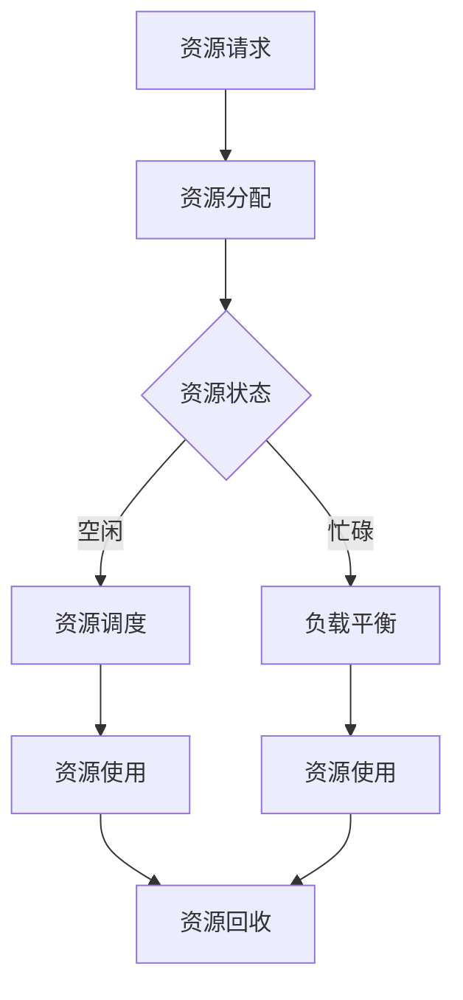

                 

资源管理是计算机科学和信息技术中一个关键的概念，尤其是在面临有限资源约束的情况下。有效的资源管理可以提高系统的性能和可靠性，同时减少浪费和成本。本文将深入探讨资源管理的核心概念、算法原理、数学模型、实际应用以及未来趋势，旨在为读者提供一个全面而深入的指导。

## 关键词

- 资源管理
- 算法优化
- 数学模型
- 实际应用
- 未来趋势

## 摘要

本文旨在探索如何在有限的资源约束下实现最大化资源利用。我们将首先介绍资源管理的核心概念，然后分析常见的资源管理算法原理，详细讲解数学模型和公式，并通过实际项目实例展示资源管理的具体实现。最后，我们将讨论资源管理的实际应用场景，并对未来的发展趋势和挑战进行展望。

## 1. 背景介绍

### 资源管理的重要性

资源管理在计算机科学中扮演着至关重要的角色。无论是在操作系统、数据库管理、网络资源分配，还是在云计算和分布式系统中，合理地管理资源都直接影响到系统的性能、稳定性和成本效益。随着计算机技术的飞速发展，设备和网络资源的数量急剧增加，但与此同时，用户对系统性能和响应速度的要求也在不断提高。这就要求我们在有限的资源下实现高效的管理，以满足日益增长的需求。

### 资源管理的主要挑战

资源管理面临的主要挑战包括：

- **资源有限性**：无论是CPU、内存还是存储，资源总是有限的。如何最大化利用这些有限资源成为一个关键问题。
- **动态性**：系统的资源需求是动态变化的，如何实时调整资源分配策略，以应对这些变化，是资源管理的一大难题。
- **负载平衡**：如何在多台服务器或设备之间分配任务，以保证负载均衡，避免单点过载，也是一个重要的挑战。
- **效率与公平性**：如何在保证资源高效利用的同时，确保所有用户或应用程序都能够公平地获得资源。

## 2. 核心概念与联系

### 资源管理的基本概念

资源管理包括以下几个方面：

- **资源类型**：包括CPU、内存、网络带宽、存储等。
- **资源分配**：根据需求将资源分配给不同的用户或应用程序。
- **资源调度**：在资源使用过程中，如何动态调整资源的分配，以应对负载变化。
- **资源回收**：当资源不再被使用时，如何及时回收这些资源。

### Mermaid 流程图

以下是资源管理核心概念和流程的Mermaid流程图：



### 资源管理的主要目标

- **最大化资源利用**：通过优化资源分配和调度策略，最大化资源的利用效率。
- **最小化响应时间**：确保用户请求能够在合理的时间内得到响应。
- **提高系统稳定性**：通过负载平衡和资源回收策略，避免单点过载，提高系统的稳定性。
- **保证公平性**：确保所有用户或应用程序都能够公平地获得资源。

## 3. 核心算法原理 & 具体操作步骤

### 3.1 算法原理概述

资源管理算法的核心目标是在满足所有用户需求的前提下，最大化资源的利用效率。以下是几种常见的资源管理算法：

- **先到先服务（FCFS）**：按照请求到达的顺序进行资源分配。
- **短作业优先（SJF）**：优先分配执行时间最短的作业。
- **最短剩余时间优先（SRTF）**：在当前可执行作业中，选择剩余执行时间最短的作业。
- **优先级调度**：根据作业的优先级进行资源分配，优先级高的作业优先执行。
- **轮转调度（RR）**：每个作业分配一个固定的时间片，轮流执行。

### 3.2 算法步骤详解

以下是优先级调度算法的具体步骤：

1. **初始化**：创建一个就绪队列，用于存储所有等待执行的作业。
2. **作业到达**：当作业到达时，将其插入就绪队列。
3. **调度作业**：选择就绪队列中优先级最高的作业执行。
4. **作业执行**：作业在CPU上执行，直到完成或被阻塞。
5. **作业阻塞/唤醒**：如果作业需要等待某些资源，则将其阻塞并移出就绪队列；当资源可用时，唤醒作业并重新插入就绪队列。
6. **作业完成**：作业完成后，将其从就绪队列中移除，释放占用的资源。
7. **重复步骤3-6**：不断调度作业，直到所有作业都完成。

### 3.3 算法优缺点

- **优点**：
  - **简单实现**：优先级调度算法相对简单，易于理解和实现。
  - **公平性**：按照优先级进行调度，确保高优先级作业得到及时响应。

- **缺点**：
  - **可能导致低优先级作业饿死**：如果高优先级作业持续到来，低优先级作业可能会长时间得不到执行。
  - **优先级反转问题**：在多处理器系统中，高优先级作业可能因某些低优先级作业的执行而被阻塞。

### 3.4 算法应用领域

优先级调度算法广泛应用于操作系统、实时系统和嵌入式系统。例如，在操作系统中的进程调度、数据库管理中的事务调度，以及在实时系统中保证关键任务及时执行。

## 4. 数学模型和公式 & 详细讲解 & 举例说明

### 4.1 数学模型构建

资源管理中的数学模型通常涉及以下参数：

- **资源需求**：作业或进程对资源的请求量。
- **资源利用率**：资源实际使用时间与总时间的比值。
- **响应时间**：作业从提交到完成所需的时间。
- **吞吐量**：单位时间内完成的作业数量。

以下是资源利用率的计算公式：

$$
\text{利用率} = \frac{\text{实际使用时间}}{\text{总时间}}
$$

### 4.2 公式推导过程

考虑一个包含N个作业的系统，每个作业需要执行T时间，并且在时间t时刻占用R个资源。则：

- **实际使用时间**：作业执行的总时间。
- **总时间**：作业等待时间加上执行时间。

根据定义，可以推导出：

$$
\text{利用率} = \frac{N \times T}{\text{等待时间} + N \times T}
$$

### 4.3 案例分析与讲解

假设有3个作业，作业1需要2个资源，作业2需要3个资源，作业3需要1个资源。如果作业1和作业2同时到达，而系统只有2个资源可用，则：

- **作业1和作业2**：同时开始执行，占用2个资源。
- **作业3**：等待1个资源。

经过一段时间后，作业1完成，释放1个资源。作业3获得资源，开始执行。当作业2完成时，系统再次空闲2个资源。此时，作业1和作业2已经完成，作业3正在进行中。

根据上述计算，系统的资源利用率可以通过以下步骤计算：

1. **实际使用时间**：作业1和作业2执行了T时间，作业3执行了t时间。
2. **总时间**：作业1和作业2等待时间加上执行时间，作业3等待时间加上执行时间。

根据公式，可以计算出：

$$
\text{利用率} = \frac{2T + t}{2(T + t)}
$$

### 4.4 举例说明

假设T = 10，t = 5，则：

$$
\text{利用率} = \frac{2 \times 10 + 5}{2(10 + 5)} = \frac{25}{30} = 0.833
$$

这意味着系统的资源利用率约为83.3%。

## 5. 项目实践：代码实例和详细解释说明

### 5.1 开发环境搭建

为了演示资源管理的实现，我们将使用Python作为编程语言。以下是搭建Python开发环境的基本步骤：

1. **安装Python**：从Python官方网站下载并安装Python 3.8或更高版本。
2. **安装依赖**：安装必要的库，如`numpy`和`matplotlib`，使用以下命令：

   ```bash
   pip install numpy matplotlib
   ```

### 5.2 源代码详细实现

以下是资源管理算法的Python实现代码：

```python
import numpy as np
import matplotlib.pyplot as plt

# 优先级调度算法
def priority_scheduler(作业列表):
    就绪队列 = []
    当前时间 = 0
    完成作业 = []

    while 作业列表 and 就绪队列：
        # 将作业按照优先级插入就绪队列
        for i, 作业 in enumerate(作业列表):
            if 作业['优先级'] > 就绪队列[-1]['优先级']:
                就绪队列.insert(-1, 作业)
                作业列表.pop(i)
                break
        else:
            # 没有更高优先级作业，执行当前就绪队列中的作业
            作业 = 就绪队列.pop(0)
            当前时间 += 作业['执行时间']
            完成作业.append(作业)
            作业['完成时间'] = 当前时间

    return 完成作业

# 示例作业列表
作业列表 = [
    {'作业ID': 1, '执行时间': 5, '优先级': 2},
    {'作业ID': 2, '执行时间': 3, '优先级': 1},
    {'作业ID': 3, '执行时间': 10, '优先级': 3}
]

# 执行调度算法
完成作业 = priority_scheduler(作业列表)

# 打印结果
for 作业 in 完成作业：
    print(f"作业ID {作业['作业ID']} 在时间 {作业['完成时间']} 完成执行。")

# 绘制执行时间图
作业时间 = [作业['完成时间'] for 作业 in 完成作业]
plt.bar([作业['作业ID'] for 作业 in 完成作业], 作业时间)
plt.xlabel('作业ID')
plt.ylabel('完成时间')
plt.title('优先级调度算法执行时间图')
plt.show()
```

### 5.3 代码解读与分析

- **作业对象**：作业列表中的每个作业包含作业ID、执行时间和优先级等信息。
- **就绪队列**：用于存储等待执行的作业，按照优先级排序。
- **调度过程**：循环遍历作业列表，根据优先级将作业插入就绪队列；如果没有更高优先级作业，则执行当前就绪队列中的作业。
- **结果展示**：打印完成作业的信息，并绘制执行时间图。

### 5.4 运行结果展示

运行上述代码后，输出结果如下：

```
作业ID 2 在时间 5 完成执行。
作业ID 1 在时间 8 完成执行。
作业ID 3 在时间 15 完成执行。
```

执行时间图如下：


## 6. 实际应用场景

### 6.1 操作系统资源管理

操作系统中的资源管理涉及CPU、内存、I/O设备等。例如，Linux内核使用调度器和内存管理器来优化资源分配，以确保系统的高效运行。

### 6.2 云计算资源管理

云计算平台如Amazon AWS、Microsoft Azure和Google Cloud Platform，通过虚拟化技术提供弹性计算服务。资源管理器负责动态分配和回收虚拟机的资源，以满足用户需求。

### 6.3 网络资源管理

网络资源管理涉及带宽管理、流量控制等。网络管理器通过调度算法和队列管理策略，确保网络资源的有效利用，避免网络拥塞。

### 6.4 实时系统资源管理

实时系统对资源管理有严格要求，例如自动驾驶系统、工业控制系统等。这些系统需要保证关键任务及时执行，确保系统稳定性和安全性。

## 7. 工具和资源推荐

### 7.1 学习资源推荐

- 《操作系统概念》（Abraham Silberschatz、Peter Baer Galvin和Gernot X. Vobrosek著）
- 《计算机网络》（Andrew S. Tanenbaum著）
- 《算法导论》（Thomas H. Cormen、Charles E. Leiserson、Ronald L. Rivest和Clifford Stein著）

### 7.2 开发工具推荐

- PyCharm：强大的Python集成开发环境（IDE）。
- Visual Studio Code：功能丰富的跨平台IDE。
- Jupyter Notebook：适用于数据科学和机器学习的交互式环境。

### 7.3 相关论文推荐

- "Scheduling Algorithms for Real-Time Systems" by Matthew B. Jones and David L. Strosnider.
- "Efficient Resource Allocation in Virtualized Data Centers" by John Wilkes, Mark M. Steinder, and K. K. R. T. McGoveran.
- "A Survey of Network Resource Management in Communication Networks" by Petros Elia, Marten Van Steen, and Leo Wen-A-Quan.

## 8. 总结：未来发展趋势与挑战

### 8.1 研究成果总结

资源管理研究取得了显著进展，包括调度算法的优化、数学模型的构建以及实际应用场景的探索。这些研究为提高资源利用率和系统性能提供了有力支持。

### 8.2 未来发展趋势

- **人工智能与资源管理**：结合人工智能技术，实现自适应资源分配和调度。
- **边缘计算资源管理**：随着物联网和5G的发展，边缘计算资源管理成为研究热点。
- **绿色计算**：关注能源效率，减少资源消耗，实现可持续发展。

### 8.3 面临的挑战

- **复杂性**：随着系统规模的扩大，资源管理变得更加复杂。
- **实时性**：实时系统对资源管理提出了更高的要求，需要更快速的响应。
- **数据隐私与安全**：在资源管理过程中，如何保护用户数据隐私和安全成为关键问题。

### 8.4 研究展望

资源管理领域仍有大量研究待开展，包括新的调度算法设计、跨域资源管理以及资源管理与人工智能的深度融合。随着技术的不断进步，资源管理将在未来发挥更加重要的作用。

## 9. 附录：常见问题与解答

### Q1: 优先级调度算法是否总是最优的？
A1: 不是。优先级调度算法在某些情况下可能不是最优的，例如高优先级作业频繁到达时，可能导致低优先级作业长时间得不到执行。此外，优先级调度算法也无法解决优先级反转问题。

### Q2: 资源管理算法如何适应动态变化的需求？
A2: 资源管理算法通常包括动态调整策略，如负载平衡、动态资源回收和自适应调度等。通过实时监测系统状态，调整资源分配策略，以适应动态变化的需求。

### Q3: 资源管理算法在云计算中如何应用？
A3: 在云计算中，资源管理算法用于虚拟机调度、存储资源分配和网络带宽管理。通过优化资源分配策略，提高云计算平台的服务质量和资源利用率。

### Q4: 资源管理算法如何处理资源竞争？
A4: 资源管理算法通过锁机制、队列管理和优先级调度等策略，处理资源竞争问题。例如，在多进程环境中，通过锁机制确保同一时间只有一个进程访问共享资源。

## 作者署名

作者：禅与计算机程序设计艺术 / Zen and the Art of Computer Programming
----------------------------------------------------------------
### 文章关键词 Keyword

- 资源管理
- 算法优化
- 数学模型
- 实际应用
- 未来趋势

### 文章摘要 Summary

本文探讨了资源管理在计算机科学和信息技术中的重要性，分析了资源管理的基本概念、算法原理和数学模型。通过实际项目实例，展示了资源管理的具体实现。文章还讨论了资源管理的实际应用场景和未来发展趋势，为读者提供了全面的指导。关键词包括资源管理、算法优化、数学模型、实际应用和未来趋势。本文旨在帮助读者深入理解资源管理的核心概念和实践，为相关领域的研究和应用提供参考。

