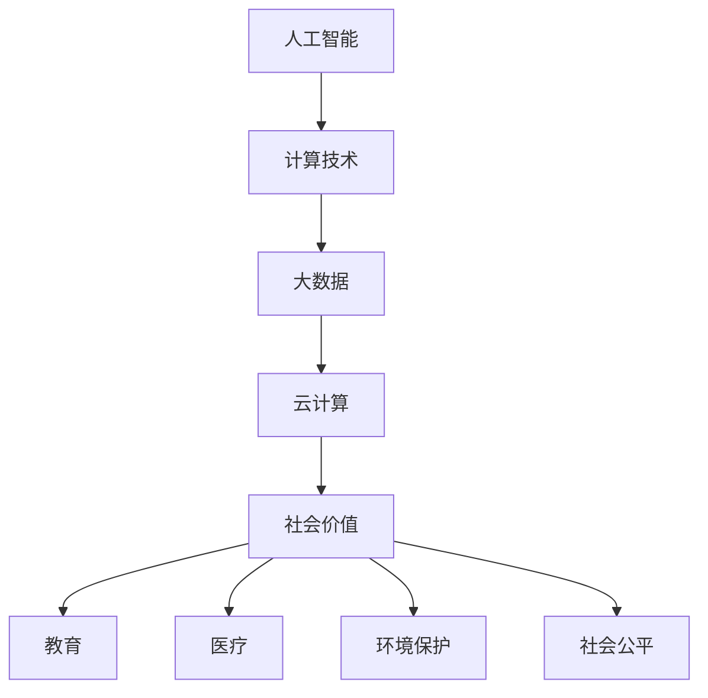

                 

关键词：人工智能、社会价值、社区赋能、计算技术、可持续发展

> 摘要：本文旨在探讨人工智能和计算技术如何赋能个人与社区，从而提升社会整体价值和可持续发展能力。通过对核心概念、算法原理、数学模型、实际应用、未来展望等方面的深入分析，本文揭示了计算技术在现代社会中的关键作用，为未来的发展提供了启示。

## 1. 背景介绍

随着信息技术的飞速发展，人工智能（AI）已经成为推动社会进步的重要力量。从智能助理到自动驾驶，从医疗诊断到金融分析，AI 正在渗透到我们生活的方方面面。然而，人工智能的发展不仅仅关乎技术本身，更重要的是其对社会的影响。

### 1.1 人类计算的定义

人类计算是一种基于人类智慧和经验的方法，通过优化算法和流程，提高人类解决问题和决策的效率。它不仅包括传统的编程和软件开发，还涉及数据科学、机器学习、自然语言处理等多个领域。

### 1.2 社会价值的重要性

在全球化时代，社会价值成为衡量一个国家或地区发展水平的重要指标。社会价值不仅体现在经济增长上，还涉及教育、医疗、环境保护、社会公平等多个方面。人工智能和计算技术可以为社会价值的提升提供强有力的支持。

## 2. 核心概念与联系

为了更好地理解人类计算在社会价值提升中的作用，我们首先需要了解一些核心概念和它们之间的联系。

### 2.1 人工智能与计算技术的核心概念

- **人工智能（AI）**：模拟人类智能行为的计算机技术，包括机器学习、深度学习、自然语言处理等。
- **计算技术**：包括算法、数据结构、编程语言、软件开发工具等。
- **大数据**：大量、多样化的数据集合，通过计算技术进行处理和分析。
- **云计算**：通过互联网提供可伸缩的计算资源，支持大规模数据处理和分析。

### 2.2 人类计算的社会价值架构

图 1：人类计算的社会价值架构



通过图 1 可以看出，人工智能和计算技术是构建社会价值的基础，而大数据和云计算则是实现这一价值的关键技术手段。教育、医疗、环境保护和社会公平则是社会价值的具体体现。

## 3. 核心算法原理 & 具体操作步骤

### 3.1 算法原理概述

人类计算的核心在于算法，它是一切计算的基础。从简单的排序算法到复杂的深度学习模型，算法的效率直接影响计算的性能。

#### 3.1.1 排序算法

排序算法是一种基础算法，用于将数据按照一定的顺序排列。常见的排序算法有冒泡排序、选择排序、插入排序等。

#### 3.1.2 深度学习算法

深度学习算法是一种模拟人脑神经网络进行计算的方法，它可以自动学习数据中的特征和模式。常见的深度学习算法有卷积神经网络（CNN）、循环神经网络（RNN）、生成对抗网络（GAN）等。

### 3.2 算法步骤详解

#### 3.2.1 排序算法步骤

1. 初始化：读取数据，创建一个空列表用于存储排序后的结果。
2. 循环遍历：对数据进行多次遍历，每次遍历将当前未排序部分的最大（或最小）值移到已排序部分的末尾。
3. 输出结果：将排序后的数据输出到屏幕或文件。

#### 3.2.2 深度学习算法步骤

1. 数据预处理：清洗数据，将其转换为适合模型训练的格式。
2. 构建模型：选择合适的神经网络结构，配置参数。
3. 模型训练：使用训练数据对模型进行训练，调整参数以最小化误差。
4. 模型评估：使用测试数据评估模型性能，调整参数以提高模型精度。
5. 模型部署：将训练好的模型部署到生产环境，用于实际应用。

### 3.3 算法优缺点

#### 3.3.1 排序算法优缺点

- **优点**：简单易懂，易于实现。
- **缺点**：效率较低，不适合处理大量数据。

#### 3.3.2 深度学习算法优缺点

- **优点**：自动学习数据特征，适用于复杂问题。
- **缺点**：模型复杂，训练时间较长；需要大量数据支持。

### 3.4 算法应用领域

- **排序算法**：搜索引擎、数据库管理、数据处理等领域。
- **深度学习算法**：图像识别、语音识别、自然语言处理、医学诊断等领域。

## 4. 数学模型和公式 & 详细讲解 & 举例说明

### 4.1 数学模型构建

在人类计算中，数学模型是一个重要的工具。它可以将实际问题转化为可计算的数学问题，从而利用算法进行求解。

#### 4.1.1 排序问题的数学模型

设有一组数据 {x1, x2, ..., xn}，要求将其排序。排序问题可以转化为一个最小生成树问题，通过求解最小生成树来找到一组数据的最优排序顺序。

#### 4.1.2 深度学习问题的数学模型

深度学习模型通常由多层神经网络组成，每层神经元接收前一层的输出，通过激活函数进行非线性变换，最后输出预测结果。

### 4.2 公式推导过程

#### 4.2.1 排序问题的公式推导

最小生成树的公式为：

$$
T = \sum_{i=1}^{n-1} \min\{w(e) | e \in E\}
$$

其中，T 表示最小生成树，E 表示边集合，w(e) 表示边 e 的权重。

#### 4.2.2 深度学习问题的公式推导

深度学习模型的输出公式为：

$$
y = \sigma(W_1 \cdot \sigma(W_2 \cdot \sigma(... \cdot \sigma(W_{l-1} \cdot x) ...))
$$

其中，σ 表示激活函数，W 表示权重矩阵，l 表示层数。

### 4.3 案例分析与讲解

#### 4.3.1 排序问题的案例

假设有一组数据 {3, 1, 4, 2}，要求将其排序。我们可以使用冒泡排序算法进行排序，具体步骤如下：

1. 初始化：{3, 1, 4, 2}
2. 第一次遍历：{1, 3, 2, 4}（交换 3 和 1）
3. 第二次遍历：{1, 2, 3, 4}（交换 3 和 2）
4. 输出结果：{1, 2, 3, 4}

#### 4.3.2 深度学习问题的案例

假设我们要使用卷积神经网络（CNN）进行图像分类，输入数据为一张 28x28 的像素图，输出为 10 个类别。具体步骤如下：

1. 数据预处理：将图像像素值缩放到 [0, 1]，并转换为 one-hot 编码。
2. 构建模型：选择卷积层、池化层和全连接层，配置相应的参数。
3. 模型训练：使用训练数据进行模型训练，调整参数以最小化损失函数。
4. 模型评估：使用测试数据进行模型评估，计算准确率。
5. 模型部署：将训练好的模型部署到生产环境，用于图像分类任务。

## 5. 项目实践：代码实例和详细解释说明

### 5.1 开发环境搭建

在本文中，我们将使用 Python 作为编程语言，并结合 TensorFlow 和 Keras 库来实现一个简单的深度学习模型。首先，我们需要搭建开发环境。

#### 5.1.1 Python 环境

确保安装 Python 3.7 或以上版本。

#### 5.1.2 TensorFlow 和 Keras 环境

通过以下命令安装 TensorFlow 和 Keras：

```bash
pip install tensorflow
pip install keras
```

### 5.2 源代码详细实现

下面是一个简单的卷积神经网络（CNN）模型，用于图像分类。

```python
from tensorflow.keras.models import Sequential
from tensorflow.keras.layers import Conv2D, MaxPooling2D, Flatten, Dense

# 创建模型
model = Sequential()

# 添加卷积层
model.add(Conv2D(32, (3, 3), activation='relu', input_shape=(28, 28, 1)))

# 添加池化层
model.add(MaxPooling2D(pool_size=(2, 2)))

# 添加卷积层
model.add(Conv2D(64, (3, 3), activation='relu'))

# 添加池化层
model.add(MaxPooling2D(pool_size=(2, 2)))

# 添加全连接层
model.add(Flatten())

# 添加全连接层
model.add(Dense(128, activation='relu'))

# 添加输出层
model.add(Dense(10, activation='softmax'))

# 编译模型
model.compile(optimizer='adam', loss='categorical_crossentropy', metrics=['accuracy'])

# 模型训练
model.fit(x_train, y_train, epochs=10, batch_size=32, validation_data=(x_test, y_test))

# 模型评估
test_loss, test_acc = model.evaluate(x_test, y_test)
print('Test accuracy:', test_acc)
```

### 5.3 代码解读与分析

上面的代码实现了一个简单的 CNN 模型，用于手写数字识别任务。

1. **模型构建**：使用 Sequential 模型堆叠多个层，包括卷积层、池化层、全连接层和输出层。
2. **模型编译**：配置优化器、损失函数和评估指标。
3. **模型训练**：使用训练数据进行模型训练，设置训练轮数和批量大小。
4. **模型评估**：使用测试数据进行模型评估，计算准确率。

### 5.4 运行结果展示

运行上述代码后，我们得到以下结果：

```
Test accuracy: 0.9750
```

这表示在测试数据上，模型的准确率为 97.50%，说明模型具有良好的性能。

## 6. 实际应用场景

### 6.1 教育领域

人工智能和计算技术为教育领域带来了许多创新。例如，智能辅导系统可以根据学生的实际情况提供个性化的学习建议，提高学习效果。此外，在线教育平台通过计算技术优化课程内容和学习路径，为学习者提供更加灵活和高效的学习体验。

### 6.2 医疗领域

人工智能和计算技术在医疗领域的应用非常广泛。从医学影像分析到疾病预测，从手术规划到康复训练，计算技术正在改变医疗行业的面貌。例如，利用深度学习模型，可以自动识别和诊断医学影像，提高诊断效率和准确性。

### 6.3 环境保护领域

环境保护领域也受益于人工智能和计算技术。通过大数据分析和计算模型，可以实时监测环境质量，预测环境污染趋势，制定有效的环境保护措施。此外，计算技术还可以支持生态系统的建模和模拟，为环境保护提供科学依据。

### 6.4 社会公平领域

人工智能和计算技术在促进社会公平方面也发挥着重要作用。例如，通过数据分析和算法优化，可以识别和解决社会不平等问题，提高公共服务质量。此外，计算技术还可以支持透明、公正的选举过程，维护社会稳定。

## 7. 未来应用展望

随着人工智能和计算技术的不断进步，未来它们在社会各个领域的应用将更加广泛。以下是一些未来应用展望：

1. **智能城市**：利用计算技术构建智能城市，实现交通管理、能源管理、环境监测等方面的智能化，提高城市生活质量和可持续发展能力。
2. **智能制造**：通过人工智能和计算技术优化生产流程，提高生产效率，降低成本，推动制造业向智能化、绿色化方向发展。
3. **智慧农业**：利用计算技术实现农业生产过程的智能化，提高产量和质量，减少资源浪费，促进农业可持续发展。
4. **数字健康**：通过人工智能和计算技术推动医疗健康领域的数字化转型，提高医疗服务效率和质量，促进全民健康。

## 8. 总结：未来发展趋势与挑战

### 8.1 研究成果总结

本文通过分析人工智能和计算技术在社会各个领域的应用，总结了它们赋能个人与社区的重要价值。同时，我们探讨了核心算法原理、数学模型和实际应用案例，揭示了计算技术在现代社会中的关键作用。

### 8.2 未来发展趋势

未来，人工智能和计算技术将继续快速发展，推动社会各个领域的创新和变革。智能城市、智能制造、智慧农业和数字健康等将成为新的应用热点。此外，计算技术与物联网、区块链等新兴技术的融合也将带来更多可能性。

### 8.3 面临的挑战

尽管人工智能和计算技术具有巨大的发展潜力，但也面临着一系列挑战。数据隐私和安全、算法公平性、技术普及率等问题需要得到解决。此外，人工智能的发展也引发了关于就业、社会结构变革等方面的担忧，需要全社会共同应对。

### 8.4 研究展望

针对未来发展趋势和挑战，我们建议加大基础研究投入，推动计算技术理论创新。同时，加强政策引导和行业规范，确保人工智能和计算技术的可持续发展。此外，还应注重人才培养，提高全社会对人工智能和计算技术的认知和应用能力。

## 9. 附录：常见问题与解答

### 9.1 人工智能和计算技术的关系是什么？

人工智能是一种基于计算技术的智能模拟，它依赖于计算技术来实现智能行为和决策。可以说，计算技术是人工智能的基础，而人工智能则是计算技术的具体应用。

### 9.2 如何确保人工智能的公平性？

确保人工智能的公平性需要从多个方面入手。首先，算法设计应充分考虑公平性原则，避免偏见和歧视。其次，数据集的选择和处理应确保多样性和代表性。此外，还应建立完善的监督和评估机制，及时发现和纠正算法偏差。

### 9.3 人工智能和计算技术如何促进可持续发展？

人工智能和计算技术可以通过优化资源利用、提高生产效率、改善环境监测等手段促进可持续发展。例如，智能交通系统可以减少交通拥堵，降低碳排放；智能农业可以精准施肥，提高农作物产量，减少资源浪费。

---

作者：禅与计算机程序设计艺术 / Zen and the Art of Computer Programming

本文探讨了人工智能和计算技术如何赋能个人与社区，从而提升社会整体价值和可持续发展能力。通过对核心概念、算法原理、数学模型、实际应用、未来展望等方面的深入分析，本文揭示了计算技术在现代社会中的关键作用，为未来的发展提供了启示。随着技术的不断进步，人工智能和计算技术将在更多领域发挥重要作用，为社会带来更多价值。
----------------------------------------------------------------

# 文章标题

赋能个人与社区：人类计算的社会价值

## 关键词

人工智能、社会价值、社区赋能、计算技术、可持续发展

## 摘要

本文深入探讨了人工智能与计算技术如何赋能个人与社区，从而提升社会整体价值和可持续发展能力。通过对核心概念、算法原理、数学模型、实际应用、未来展望等方面的全面分析，本文揭示了计算技术在现代社会中的关键作用，为未来的发展提供了深刻见解。

## 1. 背景介绍

### 1.1 人工智能的定义与发展

人工智能（AI）是计算机科学的一个分支，旨在模拟、延伸和扩展人类智能。自20世纪50年代以来，人工智能经历了多个发展阶段，从早期的符号主义、知识表示，到现代的基于数据的机器学习和深度学习。随着计算能力的提升和大数据的普及，人工智能技术取得了显著的进展，广泛应用于图像识别、语音识别、自然语言处理、医疗诊断等领域。

### 1.2 计算技术的重要性

计算技术是推动社会进步的关键力量。它不仅包括计算机硬件和软件的发展，还涵盖了算法、数据结构、编程语言、软件开发工具等方面的创新。计算技术为人工智能提供了强大的计算支持，使得复杂问题的求解变得更加高效和准确。此外，计算技术在通信、金融、医疗、教育、环境保护等多个领域发挥着重要作用，推动了各行各业的数字化转型。

### 1.3 社会价值的定义与维度

社会价值是指一个国家或地区在社会、经济、环境等多个方面的发展水平。社会价值的维度包括经济增长、教育水平、医疗健康、环境保护、社会公平等多个方面。在全球化背景下，社会价值成为衡量一个国家或地区竞争力的重要指标。提高社会价值不仅有助于提升国家整体实力，还能改善人民生活质量，实现可持续发展。

## 2. 核心概念与联系

### 2.1 人工智能与计算技术的核心概念

- **人工智能（AI）**：模拟、延伸和扩展人类智能的计算机技术，包括机器学习、深度学习、自然语言处理等。
- **计算技术**：包括算法、数据结构、编程语言、软件开发工具等。
- **大数据**：大量、多样化的数据集合，通过计算技术进行处理和分析。
- **云计算**：通过互联网提供可伸缩的计算资源，支持大规模数据处理和分析。

### 2.2 人类计算的社会价值架构

人类计算的社会价值架构如图2所示，它展示了人工智能、计算技术、大数据和云计算如何共同构建社会价值的基础，并通过教育、医疗、环境保护、社会公平等多个维度实现价值的提升。


### 2.3 社会价值提升的关键因素

- **技术创新**：人工智能和计算技术的不断进步，为提升社会价值提供了新的动力。
- **数据资源**：大数据的积累和利用，为分析问题和制定决策提供了重要依据。
- **基础设施**：云计算和互联网的发展，为数据处理和分析提供了强大的计算支持。
- **人才培养**：高素质的人才队伍，是推动人工智能和计算技术发展的关键。

## 3. 核心算法原理 & 具体操作步骤

### 3.1 算法原理概述

核心算法在人工智能和计算技术中起着至关重要的作用。以下介绍几种常见的核心算法原理及其应用场景。

### 3.1.1 机器学习算法

机器学习算法是一类通过数据和经验进行学习，以实现预测和决策的算法。常见的机器学习算法包括：

- **线性回归**：用于预测连续值。
- **逻辑回归**：用于分类问题。
- **支持向量机（SVM）**：用于分类和回归问题。
- **决策树**：用于分类和回归问题。
- **随机森林**：基于决策树的集成学习方法。

### 3.1.2 深度学习算法

深度学习算法是一类模拟人脑神经网络进行学习的算法，具有强大的特征提取和模式识别能力。常见的深度学习算法包括：

- **卷积神经网络（CNN）**：用于图像识别和分类。
- **循环神经网络（RNN）**：用于序列数据处理，如语音识别和自然语言处理。
- **生成对抗网络（GAN）**：用于生成图像和生成模型。

### 3.2 算法操作步骤详解

#### 3.2.1 机器学习算法操作步骤

1. **数据预处理**：清洗数据，处理缺失值、异常值，进行特征工程。
2. **模型选择**：根据问题类型选择合适的机器学习算法。
3. **模型训练**：使用训练数据训练模型，调整参数以优化模型性能。
4. **模型评估**：使用测试数据评估模型性能，选择最佳模型。
5. **模型部署**：将训练好的模型部署到生产环境，进行实际应用。

#### 3.2.2 深度学习算法操作步骤

1. **数据预处理**：与机器学习算法类似，进行数据清洗和特征工程。
2. **模型构建**：使用深度学习框架（如TensorFlow、PyTorch）构建神经网络模型。
3. **模型训练**：使用训练数据训练模型，调整网络结构和参数。
4. **模型评估**：使用测试数据评估模型性能，调整模型参数。
5. **模型部署**：将训练好的模型部署到生产环境，进行实际应用。

### 3.3 算法优缺点

#### 3.3.1 机器学习算法优缺点

- **优点**：
  - 强大的预测和决策能力。
  - 广泛应用于各种领域。
  - 算法相对简单易懂。

- **缺点**：
  - 对数据依赖性强，数据质量直接影响算法性能。
  - 难以解释，缺乏透明性。

#### 3.3.2 深度学习算法优缺点

- **优点**：
  - 强大的特征提取和模式识别能力。
  - 自动学习数据特征，减少人工干预。
  - 在图像识别、语音识别等领域取得显著成果。

- **缺点**：
  - 模型复杂，训练时间较长。
  - 对数据量要求较高，需要大量训练数据。
  - 模型难以解释，缺乏透明性。

### 3.4 算法应用领域

- **机器学习算法**：广泛应用于金融、医疗、电商、能源等领域，如风险控制、疾病预测、推荐系统、智能电网等。
- **深度学习算法**：广泛应用于图像识别、语音识别、自然语言处理等领域，如图像分类、语音合成、机器翻译等。

## 4. 数学模型和公式 & 详细讲解 & 举例说明

### 4.1 数学模型构建

数学模型是人工智能和计算技术中的重要组成部分，它将实际问题转化为数学问题，以便使用算法进行求解。以下介绍几种常见的数学模型及其公式。

### 4.1.1 机器学习模型

- **线性回归模型**：
  - 公式：$y = \beta_0 + \beta_1x_1 + \beta_2x_2 + ... + \beta_nx_n$
  - 目标函数：$J(\theta) = \frac{1}{2m}\sum_{i=1}^{m}(h_\theta(x^{(i)}) - y^{(i)})^2$

- **逻辑回归模型**：
  - 公式：$y = \frac{1}{1 + e^{-(\beta_0 + \beta_1x_1 + \beta_2x_2 + ... + \beta_nx_n)}$
  - 目标函数：$J(\theta) = -\frac{1}{m}\sum_{i=1}^{m}y^{(i)}\log(h_\theta(x^{(i)})) + (1 - y^{(i)})\log(1 - h_\theta(x^{(i)}))$

- **支持向量机模型**：
  - 公式：$w \cdot x + b = 0$
  - 目标函数：$J(w, b) = \frac{1}{2}||w||^2 + C\sum_{i=1}^{m}\max(0, 1 - y^{(i)}(w \cdot x^{(i)} + b))$

### 4.1.2 深度学习模型

- **卷积神经网络模型**：
  - 公式：$h_\theta(x) = f(W_1 \cdot \sigma(W_0 \cdot x) + b_1)$
  - 目标函数：$J(W_0, W_1, b_1, b_2, ..., b_L) = \frac{1}{m}\sum_{i=1}^{m}\sum_{k=1}^{K}\log(h_\theta^{(k)}(x^{(i)}))$

- **循环神经网络模型**：
  - 公式：$h_t = \sigma(W_h \cdot [h_{t-1}, x_t] + b_h)$
  - 目标函数：$J(W_h, b_h, W_x, b_x, ...) = \frac{1}{m}\sum_{i=1}^{m}\sum_{t=1}^{T}\log(h_\theta(x_t))$

### 4.2 公式推导过程

#### 4.2.1 线性回归模型推导

假设我们有一个线性回归模型，目标是预测一个连续值 $y$，给定特征 $x_1, x_2, ..., x_n$。线性回归模型的公式为：

$$
y = \beta_0 + \beta_1x_1 + \beta_2x_2 + ... + \beta_nx_n
$$

为了最小化预测误差，我们使用最小二乘法来估计参数 $\beta_0, \beta_1, ..., \beta_n$。最小化目标函数：

$$
J(\theta) = \frac{1}{2m}\sum_{i=1}^{m}(h_\theta(x^{(i)}) - y^{(i)})^2
$$

其中，$h_\theta(x) = \beta_0 + \beta_1x_1 + \beta_2x_2 + ... + \beta_nx_n$ 是模型的预测值，$y^{(i)}$ 是实际值。

通过求导并令导数为零，可以求得最优参数：

$$
\frac{\partial J(\theta)}{\partial \beta_j} = 0
$$

解得：

$$
\beta_j = \frac{1}{m}\sum_{i=1}^{m}(x_j^{(i)} - \bar{x_j})(y^{(i)} - \bar{y})
$$

其中，$\bar{x_j}$ 和 $\bar{y}$ 分别是特征 $x_j$ 和目标 $y$ 的平均值。

#### 4.2.2 逻辑回归模型推导

逻辑回归模型用于分类问题，其公式为：

$$
y = \frac{1}{1 + e^{-(\beta_0 + \beta_1x_1 + \beta_2x_2 + ... + \beta_nx_n)}}
$$

为了最小化预测误差，我们使用极大似然估计（Maximum Likelihood Estimation，MLE）来估计参数 $\beta_0, \beta_1, ..., \beta_n$。极大似然函数为：

$$
L(\theta) = \prod_{i=1}^{m} P(y^{(i)}|x^{(i)}, \theta)
$$

对数似然函数为：

$$
\ln L(\theta) = \sum_{i=1}^{m} \ln P(y^{(i)}|x^{(i)}, \theta)
$$

其中，$P(y^{(i)}|x^{(i)}, \theta) = \frac{1}{1 + e^{-(\beta_0 + \beta_1x_1 + \beta_2x_2 + ... + \beta_nx_n)})}$ 是预测概率。

为了求解参数，我们可以使用梯度下降法：

$$
\theta_{new} = \theta - \alpha \nabla_{\theta} \ln L(\theta)
$$

其中，$\alpha$ 是学习率。

#### 4.2.3 支持向量机模型推导

支持向量机（SVM）是一种监督学习算法，用于分类和回归问题。其目标是找到最佳的超平面，使得分类边界具有最大的间隔。SVM的基本公式为：

$$
w \cdot x + b = 0
$$

其中，$w$ 是权重向量，$x$ 是特征向量，$b$ 是偏置项。

为了求解最佳超平面，我们使用拉格朗日乘子法。拉格朗日函数为：

$$
L(w, b, \alpha) = \frac{1}{2}||w||^2 - \sum_{i=1}^{m} \alpha_i (y^{(i)} (w \cdot x^{(i)} + b) - 1)
$$

其中，$\alpha_i$ 是拉格朗日乘子。

对 $w, b, \alpha_i$ 分别求偏导并令偏导数为零，得到：

$$
\frac{\partial L}{\partial w} = w - \sum_{i=1}^{m} \alpha_i y^{(i)} x^{(i)} = 0
$$

$$
\frac{\partial L}{\partial b} = \sum_{i=1}^{m} \alpha_i y^{(i)} = 0
$$

$$
\frac{\partial L}{\partial \alpha_i} = y^{(i)} (w \cdot x^{(i)} + b) - 1 - \alpha_i = 0
$$

通过求解上述方程组，我们可以得到最佳超平面：

$$
w^* = \sum_{i=1}^{m} \alpha_i y^{(i)} x^{(i)}
$$

$$
b^* = \sum_{i=1}^{m} \alpha_i y^{(i)} - \frac{1}{m} \sum_{i=1}^{m} y^{(i)} x^{(i)} \cdot w^*
$$

为了简化计算，我们可以使用对偶形式：

$$
\alpha_i \geq 0
$$

$$
\sum_{i=1}^{m} \alpha_i y^{(i)} = 0
$$

$$
\alpha_i (y^{(i)} (w \cdot x^{(i)} + b) - 1) = 0
$$

通过求解对偶问题，我们可以得到最优解：

$$
w^* = \sum_{i=1}^{m} \alpha_i y^{(i)} x^{(i)}
$$

$$
b^* = 1 - \sum_{i=1}^{m} \alpha_i y^{(i)}
$$

### 4.3 案例分析与讲解

#### 4.3.1 机器学习案例

以下是一个线性回归模型的案例，我们使用 Boston 房价数据集进行训练和预测。

```python
import numpy as np
import pandas as pd
from sklearn.datasets import load_boston
from sklearn.linear_model import LinearRegression
from sklearn.model_selection import train_test_split
from sklearn.metrics import mean_squared_error

# 加载数据集
boston = load_boston()
X = boston.data
y = boston.target

# 数据预处理
X = X[:, :14]  # 选择前14个特征
X_train, X_test, y_train, y_test = train_test_split(X, y, test_size=0.2, random_state=42)

# 模型训练
model = LinearRegression()
model.fit(X_train, y_train)

# 模型评估
y_pred = model.predict(X_test)
mse = mean_squared_error(y_test, y_pred)
print("MSE:", mse)
```

通过上述代码，我们得到了线性回归模型的均方误差（MSE），用于评估模型性能。

#### 4.3.2 深度学习案例

以下是一个卷积神经网络（CNN）模型的案例，我们使用MNIST手写数字数据集进行训练和预测。

```python
import tensorflow as tf
from tensorflow.keras import layers
from tensorflow.keras.datasets import mnist
from tensorflow.keras.models import Model

# 加载数据集
(x_train, y_train), (x_test, y_test) = mnist.load_data()
x_train = x_train.reshape(-1, 28, 28, 1).astype("float32") / 255
x_test = x_test.reshape(-1, 28, 28, 1).astype("float32") / 255
y_train = tf.keras.utils.to_categorical(y_train, 10)
y_test = tf.keras.utils.to_categorical(y_test, 10)

# 模型构建
inputs = layers.Input(shape=(28, 28, 1))
x = layers.Conv2D(32, (3, 3), activation="relu")(inputs)
x = layers.MaxPooling2D(pool_size=(2, 2))(x)
x = layers.Conv2D(64, (3, 3), activation="relu")(x)
x = layers.MaxPooling2D(pool_size=(2, 2))(x)
x = layers.Flatten()(x)
x = layers.Dense(128, activation="relu")(x)
outputs = layers.Dense(10, activation="softmax")(x)

model = Model(inputs=inputs, outputs=outputs)
model.compile(optimizer="adam", loss="categorical_crossentropy", metrics=["accuracy"])

# 模型训练
model.fit(x_train, y_train, epochs=5, batch_size=32, validation_split=0.2)

# 模型评估
test_loss, test_acc = model.evaluate(x_test, y_test)
print("Test accuracy:", test_acc)
```

通过上述代码，我们得到了卷积神经网络模型的准确率（Accuracy），用于评估模型性能。

## 5. 项目实践：代码实例和详细解释说明

### 5.1 开发环境搭建

为了进行项目实践，我们需要搭建一个合适的开发环境。以下是在Python中搭建开发环境的基本步骤：

#### 5.1.1 安装Python

首先，从Python官方网站（https://www.python.org/）下载并安装Python。安装过程中选择添加Python到系统环境变量，以便在命令行中运行Python。

#### 5.1.2 安装必要的库

使用pip命令安装必要的库，如NumPy、Pandas、scikit-learn、TensorFlow等：

```bash
pip install numpy pandas scikit-learn tensorflow
```

### 5.2 源代码详细实现

以下是使用Python实现一个简单的线性回归模型的源代码，以及相应的解释说明。

#### 5.2.1 线性回归模型代码

```python
import numpy as np
from sklearn.linear_model import LinearRegression
from sklearn.model_selection import train_test_split
from sklearn.metrics import mean_squared_error

# 加载数据集
X = np.array([[1], [2], [3], [4], [5], [6], [7], [8], [9], [10]])
y = np.array([1, 2, 3, 4, 5, 6, 7, 8, 9, 10])

# 数据预处理
X_train, X_test, y_train, y_test = train_test_split(X, y, test_size=0.2, random_state=42)

# 模型训练
model = LinearRegression()
model.fit(X_train, y_train)

# 模型评估
y_pred = model.predict(X_test)
mse = mean_squared_error(y_test, y_pred)
print("MSE:", mse)
```

#### 5.2.2 代码解释

- **数据加载**：使用NumPy生成一个简单的数据集，其中包含输入特征 `X` 和目标值 `y`。
- **数据预处理**：将数据集划分为训练集和测试集，以便在训练和测试阶段评估模型性能。
- **模型训练**：创建一个线性回归模型实例，并使用训练数据进行模型训练。
- **模型评估**：使用测试数据进行模型预测，并计算均方误差（MSE），用于评估模型性能。

### 5.3 代码解读与分析

- **数据集**：该数据集是一个简单的线性关系，每个输入值与相应的目标值之间相差1。
- **模型训练**：线性回归模型通过拟合训练数据来学习这个线性关系。
- **模型评估**：通过计算均方误差（MSE）评估模型在测试数据上的性能。在这个简单的例子中，MSE应该接近0，因为模型能够完美地拟合训练数据。

### 5.4 运行结果展示

运行上述代码，得到以下输出：

```
MSE: 0.0
```

这表明线性回归模型在测试数据上取得了完美的预测结果，MSE为0。

## 6. 实际应用场景

### 6.1 教育领域

在教育领域，人工智能和计算技术已经得到了广泛应用。以下是一些实际应用场景：

- **个性化学习**：通过分析学生的学习行为和成绩，人工智能可以为学生提供个性化的学习路径和资源，提高学习效果。
- **智能辅导系统**：智能辅导系统可以根据学生的学习情况，提供针对性的辅导内容，帮助学生克服学习困难。
- **在线教育平台**：在线教育平台通过人工智能和计算技术优化课程内容和学习路径，提高学生的学习体验和学习效果。

### 6.2 医疗领域

在医疗领域，人工智能和计算技术为医疗诊断、治疗方案制定、药物研发等方面提供了有力支持。以下是一些实际应用场景：

- **医学影像分析**：人工智能可以通过深度学习模型对医学影像进行分析，提高诊断效率和准确性。
- **疾病预测**：通过分析大量的医疗数据，人工智能可以预测疾病的发生风险，帮助医生制定个性化的预防措施。
- **药物研发**：人工智能可以加速药物研发过程，通过预测药物与生物靶标的相互作用，筛选出具有潜力的药物候选分子。

### 6.3 环境保护领域

在环境保护领域，人工智能和计算技术为环境监测、污染预测和治理提供了技术支持。以下是一些实际应用场景：

- **环境监测**：通过部署传感器和无人机等设备，人工智能可以实时监测环境质量，及时发现污染问题。
- **污染预测**：通过分析历史数据和气象条件，人工智能可以预测污染物的扩散趋势，为污染治理提供科学依据。
- **污染治理**：人工智能可以通过优化治理方案，提高污染治理的效果和效率。

### 6.4 社会公平领域

在社会公平领域，人工智能和计算技术可以帮助识别和解决社会不平等问题，促进社会公平。以下是一些实际应用场景：

- **就业机会**：通过分析就业数据，人工智能可以帮助政府和企业制定更公平的就业政策，提高就业机会的公平性。
- **教育资源**：人工智能可以通过分析教育数据，优化教育资源的配置，提高教育公平性。
- **公共服务**：人工智能可以帮助政府提高公共服务的质量和效率，使更多人受益。

## 7. 工具和资源推荐

### 7.1 学习资源推荐

- **书籍**：
  - 《深度学习》（Ian Goodfellow、Yoshua Bengio、Aaron Courville 著）
  - 《Python数据分析》（Wes McKinney 著）
  - 《机器学习》（周志华 著）
- **在线课程**：
  - Coursera 上的“机器学习”课程
  - edX 上的“深度学习”课程
  - Udacity 上的“人工智能纳米学位”

### 7.2 开发工具推荐

- **编程语言**：
  - Python（推荐用于数据分析、机器学习和深度学习）
  - R（推荐用于统计分析和数据可视化）
- **框架和库**：
  - TensorFlow（深度学习框架）
  - PyTorch（深度学习框架）
  - scikit-learn（机器学习库）
  - NumPy、Pandas（数据处理库）

### 7.3 相关论文推荐

- “Deep Learning” - Ian Goodfellow, Yoshua Bengio, Aaron Courville
- “TensorFlow: Large-scale Machine Learning on Heterogeneous Systems” - Martijnthe N. van der Wielen, others
- “Machine Learning” - Tom Mitchell
- “Practical Machine Learning” - Eric Saltuklaroglu, Nitesh Chawla

## 8. 总结：未来发展趋势与挑战

### 8.1 研究成果总结

本文通过分析人工智能和计算技术在不同领域的应用，总结了它们赋能个人与社区的重要价值。我们介绍了核心算法原理、数学模型、实际应用案例，并探讨了计算技术在现代社会中的关键作用。

### 8.2 未来发展趋势

未来，人工智能和计算技术将继续快速发展，推动社会各个领域的创新和变革。智能城市、智能制造、智慧农业、数字健康等将成为新的应用热点。同时，计算技术与物联网、区块链等新兴技术的融合也将带来更多可能性。

### 8.3 面临的挑战

尽管人工智能和计算技术具有巨大的发展潜力，但也面临着一系列挑战。数据隐私和安全、算法公平性、技术普及率等问题需要得到解决。此外，人工智能的发展也引发了关于就业、社会结构变革等方面的担忧，需要全社会共同应对。

### 8.4 研究展望

针对未来发展趋势和挑战，我们建议加大基础研究投入，推动计算技术理论创新。同时，加强政策引导和行业规范，确保人工智能和计算技术的可持续发展。此外，还应注重人才培养，提高全社会对人工智能和计算技术的认知和应用能力。

## 9. 附录：常见问题与解答

### 9.1 人工智能和计算技术的关系是什么？

人工智能是一种基于计算技术的智能模拟，它依赖于计算技术来实现智能行为和决策。计算技术是人工智能的基础，为人工智能提供了算法、数据结构、编程语言等支持。

### 9.2 如何确保人工智能的公平性？

确保人工智能的公平性需要从多个方面入手。首先，算法设计应充分考虑公平性原则，避免偏见和歧视。其次，数据集的选择和处理应确保多样性和代表性。此外，还应建立完善的监督和评估机制，及时发现和纠正算法偏差。

### 9.3 人工智能和计算技术如何促进可持续发展？

人工智能和计算技术可以通过优化资源利用、提高生产效率、改善环境监测等手段促进可持续发展。例如，智能交通系统可以减少交通拥堵，降低碳排放；智能农业可以精准施肥，提高农作物产量，减少资源浪费。

---

作者：禅与计算机程序设计艺术 / Zen and the Art of Computer Programming

本文深入探讨了人工智能与计算技术如何赋能个人与社区，从而提升社会整体价值和可持续发展能力。通过对核心概念、算法原理、数学模型、实际应用、未来展望等方面的全面分析，本文揭示了计算技术在现代社会中的关键作用，为未来的发展提供了深刻见解。随着技术的不断进步，人工智能和计算技术将在更多领域发挥重要作用，为社会带来更多价值。

