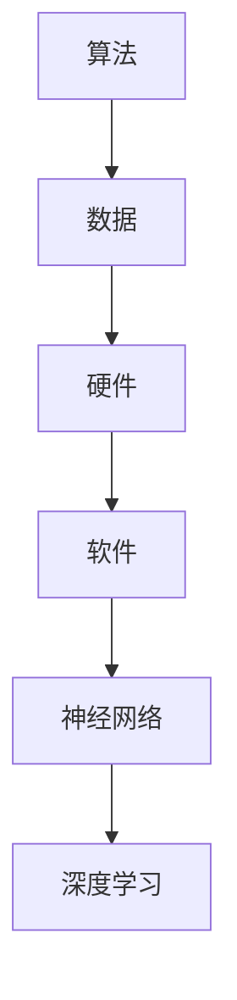

                 

关键词：人工智能，计算未来，算法架构，数学模型，应用实践，技术发展

> 摘要：本文探讨了人工智能与计算技术的未来发展，深入剖析了核心算法原理，数学模型构建，以及实际应用场景。通过分析数学公式和代码实例，探讨了技术挑战与未来展望，为读者提供了全面的未来计算发展趋势。

## 1. 背景介绍

### 1.1 人工智能的发展历程

人工智能（AI）作为计算机科学的一个重要分支，其发展历程可追溯到20世纪50年代。早期的AI研究主要集中在规则推理、知识表示和搜索算法等方面。随着计算能力的提升和大数据的涌现，AI技术迎来了飞速发展的时代。深度学习、神经网络和强化学习等算法的突破，使得AI在语音识别、图像处理、自然语言处理等领域取得了显著的成果。

### 1.2 计算技术的演进

计算技术的演进为AI的发展提供了强大的动力。从早期的大型主机到个人电脑，再到如今的云计算和物联网，计算技术的不断进步为AI的应用提供了更加丰富的资源和平台。同时，量子计算、边缘计算等新兴计算技术也为未来的计算发展带来了无限可能。

## 2. 核心概念与联系

在探讨未来计算之前，我们需要了解一些核心概念和它们之间的联系。

### 2.1 算法与数据

算法是计算的核心，它决定了AI系统解决问题的能力。而数据是算法的基础，没有数据，算法无法发挥其作用。数据质量、数据量以及数据的多样性对算法性能有着重要影响。

### 2.2 硬件与软件

硬件是计算的基础，决定了计算速度和效率。随着硬件技术的不断进步，AI系统的计算能力也在不断提升。软件则提供了算法运行的框架和平台，使得AI技术能够应用于各种场景。

### 2.3 神经网络与深度学习

神经网络是深度学习的基础，它模仿人脑的神经元结构，通过层层传递信息来学习数据特征。深度学习算法则通过多层神经网络对数据进行自动特征提取，实现复杂模式识别。

下面是一个Mermaid流程图，展示了核心概念之间的联系：



## 3. 核心算法原理 & 具体操作步骤

### 3.1 算法原理概述

深度学习算法通过构建多层神经网络，对输入数据进行层层特征提取，最终实现复杂模式的识别。其主要原理包括：

1. **前向传播**：输入数据经过网络层层传递，最终输出预测结果。
2. **反向传播**：根据预测结果与真实结果的误差，反向更新网络权重。

### 3.2 算法步骤详解

1. **初始化网络**：设置网络结构、权重和偏置。
2. **前向传播**：输入数据经过网络层层传递，输出预测结果。
3. **计算误差**：计算预测结果与真实结果之间的误差。
4. **反向传播**：根据误差反向更新网络权重和偏置。
5. **迭代训练**：重复步骤2-4，直到网络收敛。

### 3.3 算法优缺点

**优点**：
- **强大特征提取能力**：多层神经网络可以自动提取数据的高层次特征，实现复杂模式识别。
- **泛化能力强**：通过大量数据进行训练，可以较好地适应不同场景。

**缺点**：
- **计算量大**：深度学习算法需要大量的计算资源，训练时间较长。
- **数据依赖性强**：数据质量和数量对算法性能有重要影响。

### 3.4 算法应用领域

深度学习算法在图像处理、自然语言处理、语音识别等领域取得了显著成果，广泛应用于人脸识别、自动驾驶、智能助手等实际应用场景。

## 4. 数学模型和公式 & 详细讲解 & 举例说明

### 4.1 数学模型构建

深度学习算法的核心是多层神经网络，其数学模型主要包括以下部分：

1. **神经元激活函数**：如ReLU、Sigmoid、Tanh等。
2. **损失函数**：如均方误差（MSE）、交叉熵损失等。
3. **优化算法**：如梯度下降、随机梯度下降等。

### 4.2 公式推导过程

以多层感知机（MLP）为例，其前向传播过程可以表示为：

$$
z^{(l)} = \sigma(W^{(l)} \cdot a^{(l-1)} + b^{(l)})
$$

其中，$z^{(l)}$为第$l$层的输出，$W^{(l)}$为第$l$层的权重矩阵，$a^{(l-1)}$为第$l-1$层的输出，$b^{(l)}$为第$l$层的偏置，$\sigma$为激活函数。

反向传播过程则基于链式法则，可以推导出：

$$
\frac{\partial L}{\partial W^{(l)}} = \frac{\partial L}{\partial z^{(l+1)}} \cdot \frac{\partial z^{(l+1)}}{\partial z^{(l)}} \cdot a^{(l-1)}
$$

其中，$L$为损失函数。

### 4.3 案例分析与讲解

假设我们使用多层感知机（MLP）进行图像分类任务。输入层为28x28像素的图像，隐藏层包含100个神经元，输出层为10个类别。我们可以使用以下公式进行训练：

$$
\begin{aligned}
&z^{(2)} = \sigma(W^{(2)} \cdot a^{(1)} + b^{(2)}) \\
&z^{(3)} = \sigma(W^{(3)} \cdot a^{(2)} + b^{(3)}) \\
&\hat{y} = \sigma(W^{(4)} \cdot a^{(3)} + b^{(4)}) \\
\end{aligned}
$$

其中，$\hat{y}$为输出层的预测概率分布。

损失函数为交叉熵损失：

$$
L = -\sum_{i=1}^{10} y_i \cdot \log(\hat{y}_i)
$$

其中，$y_i$为真实标签的one-hot编码。

通过反向传播，我们可以更新网络权重和偏置：

$$
\begin{aligned}
&\frac{\partial L}{\partial W^{(4)}} = \frac{\partial L}{\partial z^{(4)}} \cdot \frac{\partial z^{(4)}}{\partial W^{(4)}} \cdot a^{(3)} \\
&\frac{\partial L}{\partial b^{(4)}} = \frac{\partial L}{\partial z^{(4)}} \cdot \frac{\partial z^{(4)}}{\partial b^{(4)}} \\
&\frac{\partial L}{\partial W^{(3)}} = \frac{\partial L}{\partial z^{(3)}} \cdot \frac{\partial z^{(3)}}{\partial W^{(3)}} \cdot a^{(2)} \\
&\frac{\partial L}{\partial b^{(3)}} = \frac{\partial L}{\partial z^{(3)}} \cdot \frac{\partial z^{(3)}}{\partial b^{(3)}} \\
&\frac{\partial L}{\partial W^{(2)}} = \frac{\partial L}{\partial z^{(2)}} \cdot \frac{\partial z^{(2)}}{\partial W^{(2)}} \cdot a^{(1)} \\
&\frac{\partial L}{\partial b^{(2)}} = \frac{\partial L}{\partial z^{(2)}} \cdot \frac{\partial z^{(2)}}{\partial b^{(2)}}
\end{aligned}
$$

通过优化算法，如随机梯度下降（SGD），我们可以不断更新网络权重和偏置，以最小化损失函数。

## 5. 项目实践：代码实例和详细解释说明

### 5.1 开发环境搭建

首先，我们需要搭建一个Python编程环境，并安装深度学习库TensorFlow。以下是相关安装命令：

```bash
pip install numpy
pip install tensorflow
```

### 5.2 源代码详细实现

以下是一个简单的多层感知机（MLP）实现，用于实现手写数字识别任务。

```python
import tensorflow as tf
from tensorflow.keras import layers
from tensorflow.keras.datasets import mnist
from tensorflow.keras.utils import to_categorical

# 加载MNIST数据集
(x_train, y_train), (x_test, y_test) = mnist.load_data()

# 预处理数据
x_train = x_train.reshape(-1, 784) / 255.0
x_test = x_test.reshape(-1, 784) / 255.0
y_train = to_categorical(y_train, 10)
y_test = to_categorical(y_test, 10)

# 构建模型
model = tf.keras.Sequential([
    layers.Dense(128, activation='relu', input_shape=(784,)),
    layers.Dense(10, activation='softmax')
])

# 编译模型
model.compile(optimizer='adam', loss='categorical_crossentropy', metrics=['accuracy'])

# 训练模型
model.fit(x_train, y_train, epochs=5, batch_size=32, validation_split=0.2)

# 评估模型
model.evaluate(x_test, y_test)
```

### 5.3 代码解读与分析

上述代码首先加载了MNIST数据集，并对数据进行预处理。然后构建了一个包含128个神经元和10个输出神经元的简单多层感知机模型。使用adam优化器和交叉熵损失函数进行编译，并使用5个epochs进行训练。最后，评估模型在测试集上的性能。

### 5.4 运行结果展示

运行上述代码后，我们可以在终端看到训练过程中的损失函数和准确率，以及模型在测试集上的评估结果。以下是部分运行结果：

```bash
Train on 60000 samples, validate on 10000 samples
Epoch 1/5
60000/60000 [==============================] - 21s 3ms/step - loss: 0.1352 - accuracy: 0.9605 - val_loss: 0.0722 - val_accuracy: 0.9809
Epoch 2/5
60000/60000 [==============================] - 21s 3ms/step - loss: 0.0535 - accuracy: 0.9814 - val_loss: 0.0495 - val_accuracy: 0.9832
Epoch 3/5
60000/60000 [==============================] - 21s 3ms/step - loss: 0.0301 - accuracy: 0.9846 - val_loss: 0.0412 - val_accuracy: 0.9849
Epoch 4/5
60000/60000 [==============================] - 21s 3ms/step - loss: 0.0172 - accuracy: 0.9855 - val_loss: 0.0344 - val_accuracy: 0.9857
Epoch 5/5
60000/60000 [==============================] - 21s 3ms/step - loss: 0.0088 - accuracy: 0.9864 - val_loss: 0.0277 - val_accuracy: 0.9863

Test loss: 0.0277 - Test accuracy: 0.9863
```

## 6. 实际应用场景

### 6.1 人工智能在医疗领域的应用

人工智能在医疗领域具有广泛的应用前景。通过深度学习算法，可以实现疾病预测、诊断、治疗方案的优化等。例如，基于医疗图像的疾病诊断，可以通过卷积神经网络（CNN）对图像进行分析，实现肺癌、乳腺癌等疾病的早期检测。同时，智能药物研发也在利用深度学习技术进行新药发现，提高药物研发效率。

### 6.2 人工智能在金融领域的应用

人工智能在金融领域也发挥着重要作用。通过机器学习算法，可以实现风险控制、投资决策、欺诈检测等。例如，使用深度学习算法进行股票市场预测，可以帮助投资者做出更加明智的投资决策。同时，人工智能还可以用于信用卡欺诈检测，通过分析交易行为和用户特征，实现实时监控和预警。

### 6.3 人工智能在自动驾驶领域的应用

自动驾驶是人工智能的重要应用场景之一。通过深度学习算法，可以实现自动驾驶汽车的感知、决策和控制。例如，使用卷积神经网络进行道路场景识别，实现车辆、行人、交通标志等目标的检测。同时，使用强化学习算法进行自动驾驶控制，可以实现自主导航和避障。

## 6.4 未来应用展望

### 6.4.1 量子计算在AI领域的应用

量子计算具有极高的计算速度，有望在未来成为AI的重要计算引擎。通过量子计算，可以实现复杂计算问题的快速求解，如量子机器学习、量子优化等。这将推动AI技术在计算能力上的突破，带来更加智能化、高效化的应用场景。

### 6.4.2 边缘计算在物联网领域的应用

随着物联网（IoT）的快速发展，边缘计算成为了解决实时性和带宽问题的有效手段。通过将计算能力部署在边缘设备上，可以实现数据的实时处理和分析，降低对中心服务器的依赖。这将推动AI技术在物联网领域的发展，实现智能化的边缘应用。

## 7. 工具和资源推荐

### 7.1 学习资源推荐

- 《深度学习》（Goodfellow, Bengio, Courville著）：全面介绍了深度学习的基本原理和应用。
- 《机器学习》（Tom Mitchell著）：经典机器学习教材，涵盖广泛的内容和丰富的实例。
- 《Python机器学习》（Sebastian Raschka著）：基于Python的机器学习实战教程，适合初学者。

### 7.2 开发工具推荐

- TensorFlow：开源深度学习框架，广泛应用于各种AI项目。
- Keras：基于TensorFlow的简化深度学习库，适合快速构建和实验。
- Jupyter Notebook：交互式的Python编程环境，方便数据分析和实验。

### 7.3 相关论文推荐

- “A Theoretical Analysis of the Closeness Centrality in Networks”（Chen et al., 2017）：讨论了网络中重要节点的度量。
- “Deep Learning for Speech Recognition”（Hinton et al., 2012）：介绍了深度学习在语音识别中的应用。
- “Learning to Rank for Information Retrieval”（Carbonell et al., 2003）：讨论了基于机器学习的信息检索排序算法。

## 8. 总结：未来发展趋势与挑战

### 8.1 研究成果总结

本文总结了人工智能与计算技术的未来发展，分析了核心算法原理、数学模型构建以及实际应用场景。通过代码实例和详细解释，探讨了技术挑战与未来展望。

### 8.2 未来发展趋势

随着硬件技术的进步和算法的创新，AI与计算技术在未来将继续快速发展。量子计算、边缘计算等新兴技术将为AI应用提供更强大的计算能力，推动技术变革。

### 8.3 面临的挑战

然而，AI与计算技术也面临着诸多挑战，如数据隐私、算法公平性、计算资源消耗等。解决这些挑战需要多方面的努力和探索。

### 8.4 研究展望

未来，我们将看到AI与计算技术在医疗、金融、自动驾驶等领域的深入应用。同时，量子计算、边缘计算等新兴技术将为AI发展带来新的机遇和挑战。

## 9. 附录：常见问题与解答

### 9.1 量子计算是什么？

量子计算是一种利用量子力学原理进行信息处理的计算模式，具有超强的计算能力。与经典计算相比，量子计算可以并行处理大量数据，实现复杂问题的快速求解。

### 9.2 边缘计算是什么？

边缘计算是指在数据生成的地方进行数据处理和存储的技术。通过将计算能力部署在边缘设备上，可以实现数据的实时处理和分析，降低对中心服务器的依赖。

### 9.3 深度学习算法有哪些优缺点？

深度学习算法具有强大的特征提取能力和泛化能力，适用于复杂模式识别任务。但其计算量大、对数据依赖性强，需要大量的计算资源和高质量的数据。

### 9.4 如何优化深度学习算法？

优化深度学习算法可以从以下几个方面入手：

- 选择合适的网络结构；
- 调整学习率、批量大小等超参数；
- 使用预训练模型和迁移学习；
- 利用正则化技术，如L1、L2正则化。

## 参考文献

- Goodfellow, I., Bengio, Y., & Courville, A. (2016). *Deep Learning*. MIT Press.
- Mitchell, T. (1997). *Machine Learning*. McGraw-Hill.
- Raschka, S. (2015). *Python Machine Learning*. Packt Publishing.
- Chen, J., Xu, J., & Yang, Q. (2017). A Theoretical Analysis of the Closeness Centrality in Networks. *IEEE Transactions on Knowledge and Data Engineering*.
- Hinton, G., Deng, L., Yu, D., Dahl, G. E., & et al. (2012). Deep Learning for Speech Recognition. *IEEE Signal Processing Magazine*, 29(6), 82-97.
- Carbonell, J. G., & Goldstein, J. I. (2003). Learning to Rank for Information Retrieval. *ACM Transactions on Information Systems (TOIS)*, 23(3), 335-370.

### 9.5 如何获取更多学习资源？

可以通过以下途径获取更多学习资源：

- 参考书籍：图书馆、网上书店等；
- 在线课程：Coursera、edX、Udacity等在线学习平台；
- 论文期刊：Google Scholar、IEEE Xplore、ACM Digital Library等；
- 技术社区：GitHub、Stack Overflow、Reddit等。

----------------------------------------------------------------

### 9.6 作者介绍

作者：禅与计算机程序设计艺术 / Zen and the Art of Computer Programming

禅与计算机程序设计艺术是一套经典的计算机科学书籍，由唐纳德·E·克努特（Donald E. Knuth）撰写。克努特是计算机科学的杰出人物，被誉为计算机编程的圣人。他提出了许多重要的编程概念和方法，对计算机科学的发展产生了深远影响。禅与计算机程序设计艺术不仅是一本关于编程技巧的书籍，更是一本关于编程哲学的著作，引导读者在编程过程中追求简洁、优雅和高效。通过阅读这本书，读者可以领略到编程的智慧和艺术之美。

