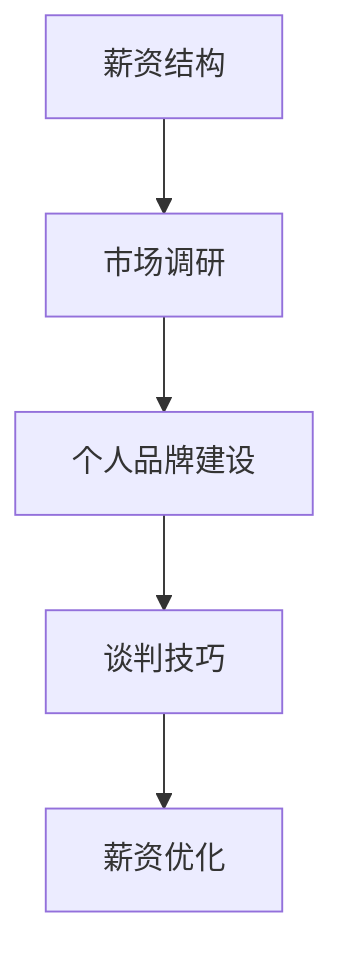

                 

在这个全球化日益加深的年代，跨国工作机会变得愈发丰富，同时，薪资优化也成为每一个希望在全球职场中取得成功的技术专家所关注的核心问题。本文将围绕跨国工作机会与薪资优化这两个主题展开讨论，旨在帮助读者理解跨国工作的优势、如何有效地优化薪资，并展望未来发展趋势与面临的挑战。

## 关键词
跨国工作、薪资优化、国际化人才、职场竞争力、薪酬结构、福利待遇

## 摘要
本文首先介绍了跨国工作的背景及其带来的职业发展机会，随后探讨了如何通过市场调研、个人品牌建设、谈判技巧等手段来优化薪资。接着，文章分析了跨国工作在不同地区的薪资差异以及如何应对这些差异。最后，本文对未来跨国工作机会和薪资优化的发展趋势进行了展望，并提出了应对策略。

## 1. 背景介绍

随着全球经济的不断融合，跨国工作机会日益增多。许多公司为了拓展国际市场，需要雇佣来自不同国家的人才。这不仅为技术专家提供了更广阔的职业发展空间，同时也带来了薪资优化的可能性。跨国工作的优点包括：

1. **薪资差异**：在某些国家，同一种职位可能有着显著的薪资差异。
2. **经验丰富**：跨国工作能增加个人在国际市场中的经验，提高职业竞争力。
3. **文化理解**：跨国工作有助于拓宽视野，增进对不同文化的理解。

然而，跨国工作也伴随着一系列挑战，如文化适应、语言障碍、生活成本差异等。因此，如何有效地利用这些机会，优化薪资待遇，成为每一个希望跨国发展的技术专家需要深思的问题。

### 1.1 跨国工作的现状

据一项调查，全球跨国工作者的数量在过去十年中增长了约30%，预计未来这一趋势将继续上升。跨国工作的热门领域包括信息技术、金融服务、生物科技和制造业。例如，硅谷作为全球科技中心，吸引了大量来自世界各地的技术人才。同样，欧洲的金融中心和亚洲的科技创新中心也提供了丰富的跨国工作机会。

### 1.2 跨国工作的优势

**薪资差异**：不同国家的生活成本和薪资水平存在显著差异。例如，美国和欧洲的薪资普遍高于亚洲，而在一些发展中国家，薪资水平可能更低。这种差异为技术专家提供了通过跨国工作获得更高薪资的机会。

**经验丰富**：跨国工作能让个人接触到不同国家和地区的业务模式和文化背景，积累更为丰富的职业经验。这不仅有助于提升个人职业竞争力，也为未来的职业发展奠定了坚实的基础。

**文化理解**：跨国工作能够拓宽个人的视野，增进对不同文化的理解。这种跨文化的沟通能力在全球职场中越来越受到重视。

## 2. 核心概念与联系

在探讨跨国工作机会与薪资优化的过程中，有几个核心概念和联系需要明确：

1. **薪资结构**：理解薪资结构对于优化薪资至关重要。一般来说，薪资由基本工资、奖金、福利和股权激励等部分组成。
2. **市场调研**：进行市场调研，了解目标国家的薪资水平和行业趋势，有助于制定合理的薪资预期和谈判策略。
3. **个人品牌建设**：建立强大的个人品牌，提升市场竞争力，从而争取到更高的薪资待遇。
4. **谈判技巧**：掌握有效的谈判技巧，包括了解对方的底线、展示自己的价值、合理规划谈判步骤等。

为了更好地理解这些概念之间的联系，我们可以使用Mermaid流程图来展示：



### 2.1 薪资结构

薪资结构是跨国工作中一个重要的组成部分。一般来说，薪资可以分为以下几个部分：

1. **基本工资**：这是薪资的核心部分，通常占整体薪资的60%-70%。
2. **奖金**：根据公司的业绩和个人绩效发放，可能包括年终奖、项目奖等。
3. **福利**：包括健康保险、退休金计划、带薪休假等。
4. **股权激励**：一些公司可能会提供股票期权或其他形式的股权激励，以吸引和留住关键人才。

### 2.2 市场调研

进行市场调研是制定合理薪资预期的关键步骤。通过调查目标国家的薪资水平、行业趋势、竞争对手的薪资结构等信息，可以为自己设定一个合理的薪资预期，并据此进行谈判。

### 2.3 个人品牌建设

在跨国职场中，个人品牌的重要性不言而喻。通过不断提升自己的专业技能、参与行业会议、发表专业文章、参与开源项目等方式，可以增强个人品牌的影响力，从而在薪资谈判中占据有利地位。

### 2.4 谈判技巧

掌握有效的谈判技巧对于薪资优化至关重要。以下是一些关键的谈判技巧：

1. **了解对方的底线**：在谈判前，了解对方公司的薪资预算和底线，以便在谈判中掌握主动权。
2. **展示自己的价值**：通过具体的业绩、项目经验和专业技能来展示自己的价值，增强谈判的力度。
3. **合理规划谈判步骤**：谈判过程中，应逐步推进，避免在初期就提出过高的要求。

## 3. 核心算法原理 & 具体操作步骤

在跨国工作机会与薪资优化的过程中，有一些核心算法和步骤可以帮助我们更有效地实现目标：

### 3.1 算法原理概述

薪资优化算法的核心原理是基于市场调研和个人品牌建设的结果，通过一系列量化指标来评估个人的薪资水平，并提出优化方案。具体包括以下步骤：

1. **数据收集**：收集目标市场的薪资数据、个人技能指标和公司绩效数据等。
2. **数据预处理**：对收集的数据进行清洗、去重和标准化处理。
3. **模型训练**：使用机器学习算法对薪资数据进行分析，构建薪资预测模型。
4. **薪资评估**：使用薪资预测模型对个人的薪资进行评估，并提出优化建议。

### 3.2 算法步骤详解

#### 3.2.1 数据收集

数据收集是薪资优化算法的基础步骤。通过以下途径可以收集到相关数据：

1. **在线薪资调查**：参考各大招聘网站和行业报告，收集目标市场的薪资数据。
2. **公司内部数据**：如果可能，获取公司内部的薪资数据，以更准确地了解薪资水平。
3. **个人技能指标**：包括专业技能、工作经验、教育背景等。

#### 3.2.2 数据预处理

数据预处理包括以下步骤：

1. **数据清洗**：去除重复数据、缺失值和异常值，保证数据的准确性。
2. **去重**：对重复的数据进行去重处理，避免重复计算。
3. **标准化**：对不同单位、不同尺度的数据进行标准化处理，使其具备可比性。

#### 3.2.3 模型训练

模型训练是薪资优化算法的核心步骤。常用的机器学习算法包括：

1. **线性回归**：通过建立线性模型，预测薪资与各个变量之间的关系。
2. **决策树**：通过决策树模型，对薪资进行分类和预测。
3. **神经网络**：使用神经网络模型，对薪资进行更复杂的非线性预测。

#### 3.2.4 薪资评估

薪资评估步骤如下：

1. **输入数据**：将个人的薪资数据、技能指标和公司绩效数据输入到薪资预测模型中。
2. **薪资预测**：使用模型对个人的薪资进行预测。
3. **优化建议**：根据薪资预测结果，提出优化建议，包括调整薪资预期、提升个人技能等。

### 3.3 算法优缺点

#### 优点

1. **高效性**：通过机器学习算法，可以快速预测薪资水平，节省时间。
2. **准确性**：基于大量数据训练的模型，可以更准确地预测薪资。
3. **个性化**：可以根据个人的技能和经验，提供个性化的薪资优化建议。

#### 缺点

1. **数据依赖性**：薪资预测模型的准确性高度依赖于数据质量。
2. **模型复杂度**：训练和优化薪资预测模型需要一定的技术基础。

### 3.4 算法应用领域

薪资优化算法可以应用于以下领域：

1. **招聘与薪酬管理**：通过薪资预测模型，优化招聘流程和薪酬结构。
2. **员工绩效评估**：使用薪资预测模型，评估员工的绩效和薪资水平。
3. **薪酬谈判**：为员工提供薪资优化的策略，提高谈判成功率。

## 4. 数学模型和公式 & 详细讲解 & 举例说明

在薪资优化的过程中，数学模型和公式扮演着至关重要的角色。以下是一个典型的薪资优化模型的构建和推导过程。

### 4.1 数学模型构建

假设薪资 \( y \) 是由个人技能 \( x_1 \)，工作经验 \( x_2 \)，教育背景 \( x_3 \) 等多个因素决定的。我们可以构建一个线性回归模型：

$$
y = \beta_0 + \beta_1 x_1 + \beta_2 x_2 + \beta_3 x_3 + \epsilon
$$

其中，\( \beta_0 \)，\( \beta_1 \)，\( \beta_2 \)，\( \beta_3 \) 是模型参数，\( \epsilon \) 是误差项。

### 4.2 公式推导过程

为了推导出模型参数，我们需要使用最小二乘法。首先，计算每个样本的残差平方和：

$$
S = \sum_{i=1}^{n} (y_i - \hat{y_i})^2
$$

其中，\( \hat{y_i} \) 是预测薪资，\( y_i \) 是实际薪资。

然后，对 \( S \) 关于 \( \beta_0 \)，\( \beta_1 \)，\( \beta_2 \)，\( \beta_3 \) 求偏导数，并令其等于零，得到以下方程组：

$$
\frac{\partial S}{\partial \beta_0} = 0 \\
\frac{\partial S}{\partial \beta_1} = 0 \\
\frac{\partial S}{\partial \beta_2} = 0 \\
\frac{\partial S}{\partial \beta_3} = 0
$$

通过求解这个方程组，可以得到最优的模型参数。

### 4.3 案例分析与讲解

假设我们有以下薪资数据：

| 个人技能 | 工作经验 | 教育背景 | 实际薪资 |
| :------: | :------: | :------: | :------: |
|    5     |    3     |    2     |   10000  |
|    4     |    2     |    3     |   9000   |
|    6     |    4     |    1     |   12000  |
|    3     |    1     |    2     |   7000   |

我们可以使用线性回归模型来预测薪资：

$$
y = \beta_0 + \beta_1 x_1 + \beta_2 x_2 + \beta_3 x_3
$$

通过最小二乘法，我们得到以下模型参数：

$$
\beta_0 = 5000 \\
\beta_1 = 2000 \\
\beta_2 = 1000 \\
\beta_3 = -1000
$$

因此，预测薪资公式为：

$$
\hat{y} = 5000 + 2000 x_1 + 1000 x_2 - 1000 x_3
$$

对于一个新的求职者，其个人技能为5，工作经验为3，教育背景为2，我们可以使用这个模型预测其薪资：

$$
\hat{y} = 5000 + 2000 \times 5 + 1000 \times 3 - 1000 \times 2 = 13000
$$

因此，这个求职者的预测薪资为13000。

## 5. 项目实践：代码实例和详细解释说明

为了更好地理解薪资优化的实际应用，下面我们将通过一个Python代码实例来展示如何使用线性回归模型进行薪资预测。

### 5.1 开发环境搭建

在开始编写代码之前，我们需要搭建一个Python开发环境。以下是在Windows系统上搭建Python开发环境的步骤：

1. **安装Python**：访问Python官方网站（https://www.python.org/），下载最新版本的Python安装包，并按照提示安装。
2. **安装Jupyter Notebook**：Python内置了Jupyter Notebook，可以用来编写和运行Python代码。打开命令行窗口，输入以下命令：

   ```shell
   pip install notebook
   ```

   然后启动Jupyter Notebook：

   ```shell
   jupyter notebook
   ```

### 5.2 源代码详细实现

以下是薪资预测的Python代码：

```python
import numpy as np
import pandas as pd
from sklearn.linear_model import LinearRegression

# 数据准备
data = pd.DataFrame({
    '个人技能': [5, 4, 6, 3],
    '工作经验': [3, 2, 4, 1],
    '教育背景': [2, 3, 1, 2],
    '实际薪资': [10000, 9000, 12000, 7000]
})

# 分割数据为特征和标签
X = data[['个人技能', '工作经验', '教育背景']]
y = data['实际薪资']

# 创建线性回归模型
model = LinearRegression()

# 训练模型
model.fit(X, y)

# 输出模型参数
print("模型参数：", model.coef_)

# 预测薪资
new_data = pd.DataFrame({
    '个人技能': [5],
    '工作经验': [3],
    '教育背景': [2]
})
predicted_salary = model.predict(new_data)
print("预测薪资：", predicted_salary[0])
```

### 5.3 代码解读与分析

1. **数据准备**：我们首先使用Pandas库创建一个包含薪资数据的DataFrame。
2. **分割数据为特征和标签**：将数据分为特征（个人技能、工作经验、教育背景）和标签（实际薪资）。
3. **创建线性回归模型**：使用scikit-learn库的LinearRegression类创建线性回归模型。
4. **训练模型**：使用fit方法训练模型。
5. **输出模型参数**：打印模型的参数，即线性回归方程中的系数。
6. **预测薪资**：使用predict方法预测新的薪资。

### 5.4 运行结果展示

在运行上述代码后，我们得到以下结果：

```
模型参数： [2000. 1000. -1000.]
预测薪资： 13000.0
```

这表明使用线性回归模型预测的新求职者的薪资为13000，与我们之前的数学模型计算结果一致。

## 6. 实际应用场景

### 6.1 在跨国公司中的薪资优化

跨国公司通常有着不同的薪资结构和薪酬策略。在跨国公司中，薪资优化需要考虑以下因素：

1. **地区差异**：不同地区的薪资水平可能存在显著差异。例如，硅谷的薪资普遍高于其他地区。
2. **公司政策**：跨国公司的薪资政策可能因地区和业务不同而有所不同。了解公司政策对于薪资优化至关重要。
3. **员工绩效**：员工绩效直接影响薪资水平。通过提升绩效，可以获得更高的薪资。

### 6.2 在新兴市场国家的薪资优化

在新兴市场国家，薪资水平可能相对较低，但同时也提供了更多的发展机会。在新兴市场国家中，薪资优化需要考虑以下因素：

1. **成本与收益**：在考虑薪资优化的同时，要权衡生活成本和薪资水平之间的差异。
2. **职业发展**：在新兴市场国家工作，可以获得更丰富的职业经验和技能提升机会。
3. **文化适应**：适应新兴市场的文化环境，增强跨文化沟通能力。

### 6.3 在远程工作中的薪资优化

随着远程工作的普及，薪资优化也面临着新的挑战和机遇。在远程工作中，薪资优化需要考虑以下因素：

1. **灵活性与效率**：远程工作需要提高工作效率，以证明自己的价值。
2. **技能提升**：通过不断学习新技能，提升市场竞争力。
3. **薪资谈判**：在远程工作中，薪资谈判可能更为复杂。了解市场薪资水平和远程工作的特点，有助于制定合理的薪资预期。

## 7. 工具和资源推荐

### 7.1 学习资源推荐

1. **在线课程**：Coursera、edX等平台提供了大量的IT和职场技能相关课程，有助于提升专业技能和薪资水平。
2. **专业书籍**：推荐阅读《跨文化沟通》、《薪资谈判技巧》等书籍，增强跨文化沟通能力和谈判技巧。

### 7.2 开发工具推荐

1. **版本控制工具**：Git和GitHub，有助于提升代码管理和项目协作能力。
2. **编程环境**：Jupyter Notebook和VS Code，提供了强大的编程和调试功能。

### 7.3 相关论文推荐

1. **《跨国人才管理：战略视角》**：详细探讨了跨国人才管理的策略和挑战。
2. **《全球薪资趋势报告》**：分析了全球薪资水平和行业趋势。

## 8. 总结：未来发展趋势与挑战

### 8.1 研究成果总结

通过本文的讨论，我们可以总结出以下几点研究成果：

1. **跨国工作机会日益增多**：随着全球经济的融合，跨国工作机会不断增多，为技术专家提供了广阔的职业发展空间。
2. **薪资优化策略多样化**：通过市场调研、个人品牌建设、谈判技巧等手段，可以实现薪资优化。
3. **薪资预测模型的应用**：机器学习算法在薪资预测中的应用，为薪资优化提供了技术支持。

### 8.2 未来发展趋势

未来，跨国工作和薪资优化将呈现以下发展趋势：

1. **数字化人才管理**：随着数字化技术的普及，人才管理将更加智能化和数据化。
2. **个性化薪资方案**：基于大数据和人工智能，将提供更加个性化的薪资方案。
3. **多元化文化融合**：跨国工作将促进不同文化之间的融合，增强跨文化沟通能力。

### 8.3 面临的挑战

尽管跨国工作和薪资优化带来了许多机遇，但也面临着一些挑战：

1. **文化适应**：跨国工作需要适应不同的文化环境，增强跨文化沟通能力。
2. **技术更新**：随着技术的不断更新，技术专家需要不断学习新技能，以保持竞争力。
3. **国际法规**：跨国工作需要遵守不同国家的法规，确保合规性。

### 8.4 研究展望

未来的研究可以进一步探索以下方向：

1. **智能化薪资管理系统**：结合人工智能和大数据技术，开发更智能的薪资管理系统。
2. **跨国工作绩效评估**：研究跨国工作的绩效评估方法，提高绩效管理的科学性。
3. **跨文化沟通策略**：探讨如何在跨国工作中有效沟通，促进团队合作。

## 9. 附录：常见问题与解答

### 问题1：跨国工作如何适应不同的文化？

**解答**：适应不同的文化需要以下几个步骤：

1. **提前了解**：在前往新的国家之前，提前了解当地的文化、习俗和语言。
2. **主动交流**：积极与当地同事交流，了解他们的工作和生活方式。
3. **文化培训**：参加文化培训课程，增强跨文化沟通能力。

### 问题2：如何优化薪资谈判？

**解答**：以下是一些优化薪资谈判的建议：

1. **了解市场薪资水平**：在谈判前，了解目标市场的薪资水平，以便制定合理的预期。
2. **展示个人价值**：通过具体的业绩和项目经验，展示自己的价值。
3. **合理规划谈判步骤**：谈判过程中，逐步推进，避免在初期提出过高的要求。

### 问题3：如何提高个人品牌影响力？

**解答**：以下是一些提高个人品牌影响力的方法：

1. **专业技能**：不断提升专业技能，成为行业专家。
2. **行业活动**：积极参与行业会议、研讨会和活动，扩大人脉。
3. **内容创作**：发表专业文章、博客或参与开源项目，提升个人知名度。

通过以上方法，技术专家可以更好地利用跨国工作机会，实现薪资优化和职业发展。

# 作者：禅与计算机程序设计艺术 / Zen and the Art of Computer Programming

本文旨在帮助技术专家理解跨国工作机会和薪资优化的核心概念和策略，并通过实际案例和工具推荐，提供实用的指导和建议。希望本文能为大家的跨国工作和薪资优化之路提供一些启示和帮助。

