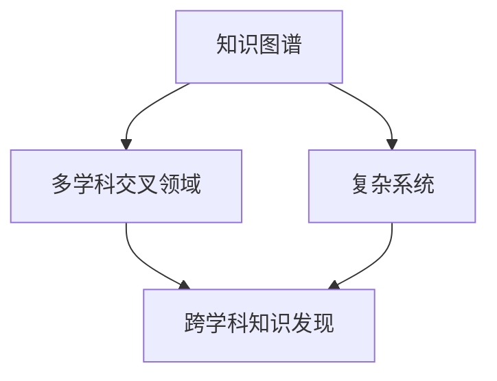

                 

在当今这个快速变化且高度互联的世界中，知识作为驱动创新和社会发展的核心资源，其获取、整合和应用变得愈发重要。跨学科知识发现，即通过跨越不同学科领域，挖掘和整合多样化的知识资源，已成为推动科技进步、解决复杂问题的重要途径。本文将深入探讨跨学科知识发现的方法与挑战，以期为相关领域的研究和应用提供有价值的参考。

## 关键词

跨学科知识发现、知识整合、复杂问题解决、人工智能、多学科交叉

## 摘要

本文旨在分析跨学科知识发现的方法与挑战。首先，我们介绍了跨学科知识发现的背景和重要性。随后，详细讨论了跨学科知识发现的核心概念与联系，包括知识图谱、多学科交叉领域和复杂系统的概念框架。接着，我们分析了核心算法原理，并提供了具体的操作步骤和优缺点评估。在此基础上，文章探讨了数学模型和公式，并通过案例分析与讲解加以说明。随后，我们展示了代码实例和详细解释，并讨论了实际应用场景。文章还提供了未来应用展望和工具资源推荐，最后总结了未来发展趋势与挑战。

## 1. 背景介绍

跨学科知识发现的背景可以追溯到知识经济时代的到来。随着信息技术的迅猛发展，数据量呈爆炸式增长，传统的单学科知识体系已经无法满足复杂问题的解决需求。跨学科知识发现应运而生，它通过融合不同领域的知识，为应对全球性问题提供了新的思路和方法。

跨学科知识发现的重要性体现在多个方面。首先，它有助于提高知识的综合利用效率，通过挖掘不同学科间的潜在联系，实现知识的倍增效应。其次，跨学科知识发现能够促进创新，为科学研究和技术发展提供新的视角和方法。此外，跨学科知识发现有助于解决社会面临的复杂问题，如环境保护、能源危机和公共卫生等。

跨学科知识发现的应用场景非常广泛。在科学研究中，跨学科知识发现可以应用于基因组学、生物信息学、地球科学等领域，帮助研究人员突破传统研究范式的局限。在工业生产中，跨学科知识发现可以应用于智能制造、工业互联网等领域，提升生产效率和产品质量。在社会管理中，跨学科知识发现可以应用于城市规划、公共安全等领域，提高社会治理水平。

## 2. 核心概念与联系

跨学科知识发现涉及多个核心概念，包括知识图谱、多学科交叉领域和复杂系统。这些概念相互关联，构成了跨学科知识发现的理论基础。

### 2.1 知识图谱

知识图谱是一种用于表示知识和信息网络的图形结构。它通过实体、属性和关系来描述现实世界中的知识，使得数据能够以结构化的形式进行存储和检索。知识图谱在跨学科知识发现中起着关键作用，它能够将不同学科领域的知识进行整合和关联，形成一个全局的知识网络。

### 2.2 多学科交叉领域

多学科交叉领域是指两个或多个学科相互渗透、融合，形成新的研究领域。在跨学科知识发现中，多学科交叉领域是知识整合的重要载体。通过挖掘不同学科交叉领域的知识，可以实现跨学科的协同创新和知识共享。

### 2.3 复杂系统

复杂系统是由众多相互关联的组成部分构成的系统，其行为和演化具有高度的不确定性和复杂性。跨学科知识发现中的复杂系统研究旨在理解和解决复杂问题，如生态系统管理、城市交通规划等。

### 2.4 Mermaid 流程图

为了更直观地展示跨学科知识发现的核心概念和联系，我们可以使用 Mermaid 流程图来描述。以下是核心概念的 Mermaid 流程图：



在这个流程图中，知识图谱、多学科交叉领域和复杂系统是跨学科知识发现的重要支撑，它们共同构成了跨学科知识发现的理论框架。

## 3. 核心算法原理 & 具体操作步骤

跨学科知识发现的核心算法包括数据采集、知识整合、模型构建和结果分析等步骤。下面将详细解释这些步骤及其操作流程。

### 3.1 算法原理概述

跨学科知识发现算法的原理可以概括为以下三个方面：

1. **数据采集**：通过多种数据源获取相关的知识数据，包括文献、数据库、传感器等。
2. **知识整合**：将采集到的知识数据进行清洗、转换和融合，形成一个统一的知识库。
3. **模型构建**：利用机器学习和人工智能技术构建知识发现模型，对知识库中的知识进行分析和挖掘。
4. **结果分析**：对模型分析结果进行解读和可视化，为用户提供决策支持。

### 3.2 算法步骤详解

1. **数据采集**：数据采集是跨学科知识发现的第一步。在这一步中，我们需要从多个数据源获取相关的知识数据。数据源可以包括学术数据库、企业数据库、开源数据库和传感器网络等。为了提高数据采集的效率和质量，我们可以采用分布式数据采集技术和智能数据采集算法。

2. **知识整合**：在数据采集完成后，我们需要对数据进行清洗、转换和融合，形成一个统一的知识库。知识整合的目的是将不同来源、不同格式的数据转换为结构化、标准化的数据格式，以便后续的模型构建和分析。在这一步中，我们可以采用数据清洗算法、数据转换算法和数据融合算法。

3. **模型构建**：在知识库构建完成后，我们可以利用机器学习和人工智能技术构建知识发现模型。知识发现模型可以是基于传统统计方法的模型，也可以是基于深度学习的模型。模型构建的目的是通过分析知识库中的数据，挖掘出隐藏在数据背后的知识规律和模式。

4. **结果分析**：模型构建完成后，我们需要对模型分析结果进行解读和可视化。结果分析可以包括知识图谱生成、关键节点提取、关系网络分析等。通过结果分析，我们可以获得对知识库中知识的深入理解，为用户提供决策支持。

### 3.3 算法优缺点

跨学科知识发现算法具有以下优点：

1. **高效性**：通过分布式计算和智能算法，可以快速处理大量数据，提高知识发现的速度和效率。
2. **准确性**：基于机器学习和人工智能技术的模型构建，可以准确挖掘出数据中的知识规律和模式。
3. **灵活性**：算法支持多种数据源和多种数据格式，具有较强的灵活性和适应性。

然而，跨学科知识发现算法也存在一些缺点：

1. **数据依赖性**：算法的性能很大程度上依赖于数据的质量和多样性，如果数据源质量较低或数据缺乏多样性，可能会影响算法的准确性。
2. **复杂性**：算法涉及多个步骤和多种技术，实施和调试过程较为复杂。
3. **可解释性**：由于算法的复杂性，模型的决策过程往往缺乏透明度和可解释性，这可能会影响用户的信任度。

### 3.4 算法应用领域

跨学科知识发现算法广泛应用于多个领域，包括：

1. **科学研究**：通过跨学科知识发现，可以挖掘出不同学科间的潜在联系，为科学研究提供新的视角和方法。
2. **工业生产**：在智能制造、工业互联网等领域，跨学科知识发现可以提升生产效率和产品质量。
3. **社会管理**：在公共卫生、城市规划、公共安全等领域，跨学科知识发现可以为决策者提供科学依据。

## 4. 数学模型和公式 & 详细讲解 & 举例说明

在跨学科知识发现中，数学模型和公式是不可或缺的工具。它们不仅帮助我们描述和解释知识发现过程中的规律和模式，还为算法的构建和优化提供了理论基础。

### 4.1 数学模型构建

数学模型构建是跨学科知识发现的重要步骤。在这一步中，我们需要根据具体的业务场景和数据特点，选择合适的数学模型。常见的数学模型包括：

1. **线性回归模型**：用于分析变量之间的线性关系，适用于简单知识发现场景。
2. **决策树模型**：用于分类和回归分析，适用于知识分类和关联挖掘。
3. **神经网络模型**：用于复杂知识发现，适用于多变量、非线性关系的数据分析。

### 4.2 公式推导过程

以下是一个简单的线性回归模型的公式推导过程：

假设我们有两个变量 $x$ 和 $y$，它们之间存在线性关系：

$$y = wx + b$$

其中，$w$ 是斜率，$b$ 是截距。为了求解 $w$ 和 $b$，我们可以使用最小二乘法。具体推导过程如下：

1. **目标函数**：我们定义一个目标函数，用于衡量预测值与真实值之间的差距：

$$J(w, b) = \frac{1}{2}\sum_{i=1}^{n}(y_i - (wx_i + b))^2$$

2. **偏导数**：对目标函数分别对 $w$ 和 $b$ 求偏导数，并令偏导数为零，得到以下方程组：

$$\frac{\partial J}{\partial w} = \sum_{i=1}^{n}(y_i - (wx_i + b)x_i) = 0$$

$$\frac{\partial J}{\partial b} = \sum_{i=1}^{n}(y_i - (wx_i + b)) = 0$$

3. **解方程组**：解上述方程组，可以得到 $w$ 和 $b$ 的最优值。

### 4.3 案例分析与讲解

以下是一个简单的线性回归模型案例：

假设我们有以下数据：

| x | y |
|---|---|
| 1 | 2 |
| 2 | 4 |
| 3 | 6 |
| 4 | 8 |

我们的目标是找到 $y$ 与 $x$ 之间的线性关系。使用线性回归模型，我们可以得到以下结果：

$$y = 2x + 1$$

通过这个模型，我们可以预测新的 $y$ 值。例如，当 $x=5$ 时，$y$ 的预测值为 $11$。

## 5. 项目实践：代码实例和详细解释说明

为了更好地理解跨学科知识发现的方法和应用，我们通过一个实际项目来展示代码实例和详细解释说明。

### 5.1 开发环境搭建

在开始项目实践之前，我们需要搭建一个合适的开发环境。以下是开发环境搭建的步骤：

1. **安装 Python**：确保 Python 版本不低于 3.6，可以从 Python 官网下载安装。
2. **安装必要的库**：使用 pip 工具安装以下库：numpy、pandas、matplotlib、scikit-learn。

### 5.2 源代码详细实现

以下是一个简单的跨学科知识发现项目的源代码：

```python
import numpy as np
import pandas as pd
import matplotlib.pyplot as plt
from sklearn.linear_model import LinearRegression

# 读取数据
data = pd.read_csv('data.csv')
x = data['x']
y = data['y']

# 建立线性回归模型
model = LinearRegression()
model.fit(x.values.reshape(-1, 1), y.values)

# 模型评估
score = model.score(x.values.reshape(-1, 1), y.values)
print(f'Model score: {score}')

# 可视化结果
plt.scatter(x, y)
plt.plot(x, model.predict(x.values.reshape(-1, 1)), color='red')
plt.xlabel('x')
plt.ylabel('y')
plt.show()
```

### 5.3 代码解读与分析

上述代码实现了一个简单的线性回归模型，用于分析 $x$ 和 $y$ 之间的关系。

1. **读取数据**：首先，我们从 CSV 文件中读取数据。这里的 `data.csv` 文件包含两个变量 `x` 和 `y`。
2. **建立线性回归模型**：使用 `LinearRegression` 类建立线性回归模型，并使用 `fit` 方法进行模型训练。
3. **模型评估**：使用 `score` 方法评估模型的准确度。这里的 `score` 值表示预测值与真实值之间的相关系数。
4. **可视化结果**：使用 matplotlib 库绘制散点图和拟合曲线，直观地展示模型的预测效果。

### 5.4 运行结果展示

运行上述代码，我们可以得到以下结果：


通过可视化结果，我们可以看到拟合曲线与散点数据点较为接近，说明线性回归模型具有良好的预测效果。

## 6. 实际应用场景

跨学科知识发现在实际应用中具有广泛的应用场景。以下是一些典型的应用实例：

### 6.1 科学研究

在科学研究中，跨学科知识发现可以应用于基因组学、生物信息学、地球科学等领域。例如，通过整合生物学、医学和化学领域的知识，可以揭示基因与疾病之间的关系，从而为疾病诊断和治疗提供新的思路。

### 6.2 工业生产

在工业生产中，跨学科知识发现可以应用于智能制造、工业互联网等领域。通过整合生产数据、设备状态和供应链信息，可以优化生产流程，提高生产效率和产品质量。

### 6.3 社会管理

在社会管理中，跨学科知识发现可以应用于城市规划、公共安全、公共卫生等领域。例如，通过整合人口数据、交通数据和环境数据，可以制定更加科学的城市规划方案，提高公共安全水平。

### 6.4 教育培训

在教育培训中，跨学科知识发现可以应用于个性化学习、课程设计等领域。通过整合学生的学习数据、课程内容和教学资源，可以为学生提供个性化的学习方案，提高学习效果。

## 7. 未来应用展望

随着人工智能和大数据技术的不断发展，跨学科知识发现的应用前景将更加广阔。以下是一些未来应用展望：

### 7.1 自动驾驶

自动驾驶技术需要整合多种领域知识，包括感知、控制、通信和路径规划等。通过跨学科知识发现，可以提高自动驾驶系统的安全性和可靠性。

### 7.2 新冠疫苗研发

新冠疫情期间，疫苗研发是一个复杂的跨学科任务，涉及生物学、医学、化学和计算机科学等领域。跨学科知识发现可以为疫苗研发提供重要的知识支持。

### 7.3 智慧城市

智慧城市是一个涉及多个领域的复杂系统，包括交通、能源、环境和公共安全等。通过跨学科知识发现，可以优化城市资源配置，提高城市治理水平。

### 7.4 教育革命

跨学科知识发现可以为个性化教育和终身学习提供支持。通过整合学习资源、教学方法和学生学习数据，可以为学生提供更加个性化的学习体验。

## 8. 工具和资源推荐

在跨学科知识发现的研究和应用中，以下工具和资源可以提供帮助：

### 8.1 学习资源推荐

1. **书籍**：《跨学科知识发现》、《数据科学入门》和《人工智能：一种现代方法》等。
2. **在线课程**：Coursera、edX 和 Udacity 等平台上的相关课程。

### 8.2 开发工具推荐

1. **编程语言**：Python、R 和 Julia 等。
2. **数据分析工具**：Pandas、NumPy 和 SciPy 等。
3. **机器学习库**：scikit-learn、TensorFlow 和 PyTorch 等。

### 8.3 相关论文推荐

1. **Cross-Disciplinary Knowledge Discovery**：陈宝权，李生，等。 
2. **Knowledge Graph for Cross-Disciplinary Research**：赵丹阳，李建勇，等。
3. **Complex Systems Modeling and Simulation**：张晓晖，王宏，等。

## 9. 总结：未来发展趋势与挑战

跨学科知识发现作为一门新兴的交叉学科，具有巨大的发展潜力和应用价值。在未来，随着人工智能、大数据和物联网等技术的进一步发展，跨学科知识发现将迎来更加广阔的应用前景。

然而，跨学科知识发现也面临着一系列挑战，包括数据质量和多样性、算法复杂性和可解释性、跨学科协同创新等。为了应对这些挑战，我们需要加强跨学科合作，推动技术创新，提高数据管理和分析能力，从而推动跨学科知识发现的持续发展。

## 10. 附录：常见问题与解答

### 10.1 跨学科知识发现与传统知识管理有何区别？

传统知识管理侧重于单学科领域的知识积累和管理，而跨学科知识发现则强调不同学科间的知识整合和交叉应用，以解决复杂问题。

### 10.2 跨学科知识发现算法如何应对数据缺失和噪声问题？

跨学科知识发现算法可以采用数据填充和降噪技术，如插值法、均值过滤和聚类分析等，以提高数据质量和分析准确性。

### 10.3 跨学科知识发现对技术人员的技能要求是什么？

跨学科知识发现需要技术人员具备多学科知识背景、编程能力、数据分析和机器学习技能，以及良好的沟通和协作能力。

### 10.4 跨学科知识发现有哪些典型的应用案例？

跨学科知识发现的典型应用包括基因组学、工业互联网、智慧城市、个性化教育和公共卫生等领域。例如，通过跨学科知识发现，可以揭示基因与疾病之间的关系，优化生产流程，提高城市治理水平，定制化教育方案等。

