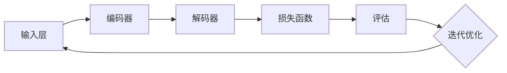
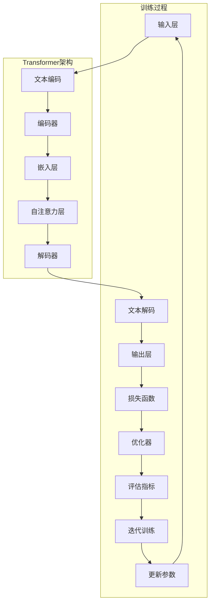
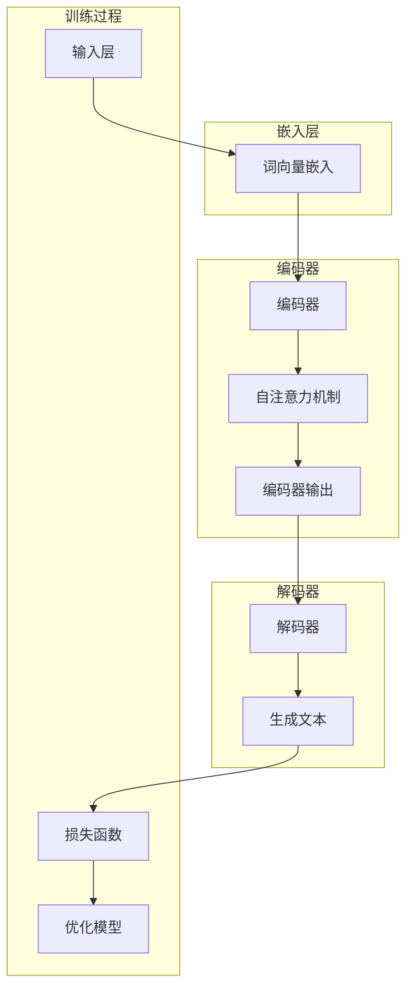

                 

关键词：跨文化交流，语言模型，全球互联，机器学习，人工智能

> 摘要：随着全球化进程的不断加速，跨文化交流变得越来越重要。本文将探讨如何通过大规模语言模型（LLM）搭建一座连接不同文化的桥梁，促进全球互联。我们将详细解析LLM的核心概念、算法原理，以及在实际应用中的具体实践，并展望其未来发展的趋势和挑战。

## 1. 背景介绍

在当今世界，跨文化交流的重要性不言而喻。随着全球化进程的推进，人们越来越频繁地参与到跨国合作、商务交流和文化交流中。然而，语言障碍仍然是阻碍有效沟通的一个重要因素。传统的机器翻译技术虽然在一定程度上缓解了这一问题，但其准确性、流畅性和理解能力仍存在较大局限。

近年来，随着机器学习技术的快速发展，尤其是深度学习在自然语言处理领域的突破，大规模语言模型（LLM）应运而生。LLM是一种能够处理和理解人类语言的高级模型，其通过大量的文本数据进行训练，能够生成高质量的自然语言文本。这使得LLM在跨文化交流中具有巨大的潜力，能够成为一座连接不同文化的桥梁。

本文将围绕LLM的核心概念、算法原理、实际应用以及未来发展趋势进行探讨，旨在为读者提供一幅全面、深入的LLM应用图景。

### 1.1 全球化与跨文化交流

全球化是当今世界的一个重要趋势。随着信息技术和交通运输的快速发展，国与国之间的联系日益紧密。跨国公司、国际组织、文化交流活动等在全球范围内的频繁出现，使得跨文化交流成为人们生活中不可或缺的一部分。

然而，语言障碍是跨文化交流中的一大难题。不同语言之间的差异不仅体现在词汇、语法和发音上，还涉及文化背景、价值观和沟通方式的差异。传统的机器翻译技术虽然在某种程度上缓解了这一难题，但其准确性、流畅性和理解能力仍然存在较大局限。例如，机器翻译常常出现语义错误、句子结构混乱或者文化背景理解不到位的问题。

### 1.2 机器翻译与语言模型的局限

机器翻译技术是解决跨语言交流问题的一种重要手段。早期的机器翻译主要基于规则的方法，通过手工编写的翻译规则和语法规则进行翻译。然而，这种方法在面对复杂、多变的人类语言时显得力不从心。

随着计算机科学和人工智能技术的发展，统计机器翻译和神经机器翻译逐渐成为主流。统计机器翻译利用统计方法，从大量已翻译的文本中学习翻译规则。而神经机器翻译则采用深度学习技术，通过神经网络模型进行翻译。

虽然神经机器翻译在翻译质量和流畅性方面取得了显著进展，但其仍然存在一些局限。首先，神经机器翻译需要大量的已翻译数据进行训练，而在某些语言对之间可能缺乏足够的训练数据。其次，神经机器翻译的生成文本往往缺乏人类语言的自然性和创造性。此外，神经机器翻译在处理长句、复杂句式和术语翻译方面仍存在挑战。

### 1.3 大规模语言模型（LLM）的崛起

为了解决机器翻译和语言处理中的这些局限，大规模语言模型（LLM）应运而生。LLM是一种基于深度学习的自然语言处理模型，其通过在大量文本上进行训练，能够理解、生成和翻译自然语言。

与传统的机器翻译和语言模型相比，LLM具有以下几个显著特点：

1. **大数据驱动**：LLM能够处理和理解大规模的文本数据，从而提高模型的泛化能力和准确性。
2. **自适应学习**：LLM可以通过不断学习新的数据来适应语言的变化和多样性。
3. **生成能力强**：LLM能够生成高质量的自然语言文本，包括文章、段落、句子和短语。
4. **上下文理解**：LLM能够理解上下文信息，从而生成更加准确和自然的翻译文本。

LLM的出现为跨文化交流提供了一种全新的解决方案。通过搭建一座数字化的桥梁，LLM能够帮助人们克服语言障碍，实现更高效、更流畅的跨文化交流。本文将深入探讨LLM的核心概念、算法原理、实际应用以及未来发展趋势，为读者提供一幅全面、深入的LLM应用图景。

### 1.4 文章结构概述

本文将分为以下几个部分：

1. **背景介绍**：回顾全球化的趋势和跨文化交流的重要性，以及机器翻译和语言模型的局限。
2. **核心概念与联系**：详细解析大规模语言模型（LLM）的核心概念和原理，包括其架构和训练过程。
3. **核心算法原理 & 具体操作步骤**：探讨LLM的核心算法，包括生成文本、机器翻译和情感分析等。
4. **数学模型和公式 & 详细讲解 & 举例说明**：介绍LLM中使用的数学模型和公式，并给出具体应用案例。
5. **项目实践：代码实例和详细解释说明**：展示如何使用LLM进行实际项目开发，包括开发环境搭建、源代码实现和代码解读。
6. **实际应用场景**：分析LLM在不同领域的应用，如跨文化交流、智能客服、内容生成等。
7. **未来应用展望**：展望LLM的未来发展趋势，包括技术改进、应用扩展和面临的挑战。
8. **工具和资源推荐**：推荐学习资源和开发工具，帮助读者更好地理解和应用LLM。
9. **总结：未来发展趋势与挑战**：总结研究成果，探讨未来发展趋势和面临的挑战。
10. **附录：常见问题与解答**：回答读者可能关心的一些常见问题。

## 2. 核心概念与联系

### 2.1 大规模语言模型（LLM）的概念

大规模语言模型（LLM）是一种基于深度学习的自然语言处理模型，其核心目的是理解和生成自然语言。与传统的语言模型不同，LLM能够处理和理解大规模的文本数据，从而提高模型的泛化能力和准确性。

LLM通常由多层神经网络组成，其中每个神经元代表一个词或短语，并通过非线性变换将输入映射到输出。通过大量的文本数据进行训练，LLM能够学习到语言的复杂结构和语义信息，从而生成高质量的自然语言文本。

### 2.2 语言模型的架构

语言模型的架构通常包括以下几个关键部分：

1. **输入层**：接收自然语言文本作为输入。
2. **编码器**：对输入文本进行编码，提取其语义信息。
3. **解码器**：根据编码器的输出生成自然语言文本。
4. **损失函数**：用于评估模型的预测结果与真实结果之间的差距。

常见的LLM架构包括Transformer、BERT、GPT等。其中，Transformer是第一种完全基于自注意力机制的深度学习模型，其具有并行处理能力和强大的上下文理解能力。BERT和GPT则是在Transformer基础上发展而来的模型，分别代表双向编码表示和生成预训练转换器。

### 2.3 训练过程

LLM的训练过程通常包括以下几个步骤：

1. **数据预处理**：对原始文本数据进行清洗、分词、去噪等处理，以获得高质量的训练数据。
2. **编码**：将预处理后的文本数据输入到编码器中，提取其语义信息。
3. **解码**：根据编码器的输出，通过解码器生成自然语言文本。
4. **评估**：使用评估指标（如损失函数）评估模型的性能，并根据评估结果调整模型参数。
5. **迭代**：重复上述过程，不断优化模型。

### 2.4 Mermaid 流程图

下面是一个简化的Mermaid流程图，用于描述LLM的核心概念和训练过程：



### 2.5 核心概念与联系的Mermaid流程图

为了更直观地展示LLM的核心概念和联系，我们可以使用Mermaid流程图来表示。以下是一个详细的Mermaid流程图，用于描述LLM的核心概念、架构和训练过程。



通过这个Mermaid流程图，我们可以清晰地看到LLM的核心概念和训练过程的各个步骤，以及其与Transformer架构的联系。这有助于读者更好地理解LLM的工作原理和实际应用。

## 3. 核心算法原理 & 具体操作步骤

### 3.1 算法原理概述

大规模语言模型（LLM）的核心算法是基于深度学习的自然语言处理技术。LLM通过在大量文本数据上进行预训练，然后通过微调（fine-tuning）适应特定任务，从而实现生成文本、机器翻译、情感分析等多种功能。

LLM的主要原理包括：

1. **嵌入层（Embedding Layer）**：将输入文本转换为密集的向量表示，以便后续处理。
2. **自注意力机制（Self-Attention Mechanism）**：通过计算输入文本中的词与词之间的关系，提取更丰富的语义信息。
3. **编码器（Encoder）**：对输入文本进行编码，提取其语义信息。
4. **解码器（Decoder）**：根据编码器的输出生成自然语言文本。
5. **损失函数（Loss Function）**：用于评估模型的预测结果与真实结果之间的差距，并指导模型优化。

### 3.2 算法步骤详解

#### 3.2.1 嵌入层

嵌入层是LLM中的一个重要组成部分，其作用是将输入文本转换为密集的向量表示。这一步骤通常使用Word2Vec、GloVe等预训练词向量模型。具体操作步骤如下：

1. **词向量训练**：使用大量的文本数据训练词向量模型，将每个单词映射为一个固定大小的向量。
2. **输入文本编码**：将输入文本中的每个单词根据词向量模型转换为向量表示。

#### 3.2.2 自注意力机制

自注意力机制是LLM的核心机制之一，其通过计算输入文本中每个词与所有词之间的关系，提取更丰富的语义信息。具体操作步骤如下：

1. **计算词与词之间的关系**：对于输入文本中的每个词，计算其与所有词之间的相似度。
2. **加权求和**：根据相似度对每个词进行加权求和，得到一个加权向量。
3. **激活函数**：使用激活函数（如ReLU）对加权向量进行处理，增强模型的非线性表达能力。

#### 3.2.3 编码器

编码器的作用是对输入文本进行编码，提取其语义信息。具体操作步骤如下：

1. **嵌入层输出**：将嵌入层输出的向量输入到编码器中。
2. **多层神经网络**：通过多层神经网络对嵌入层输出进行处理，提取更高级的语义特征。
3. **输出编码**：将编码器的输出表示为一个固定大小的向量，用于后续解码。

#### 3.2.4 解码器

解码器的作用是根据编码器的输出生成自然语言文本。具体操作步骤如下：

1. **嵌入层输出**：将解码器的输出根据词向量模型转换为向量表示。
2. **生成文本**：通过自注意力机制和循环神经网络（RNN）生成自然语言文本。
3. **预测与优化**：使用预测模型和优化算法（如梯度下降）对解码器进行训练和优化。

#### 3.2.5 损失函数

损失函数是评估模型预测结果与真实结果之间差距的一种指标。具体操作步骤如下：

1. **预测结果**：根据解码器的输出生成预测文本。
2. **计算损失**：使用交叉熵损失函数计算预测结果与真实结果之间的差距。
3. **优化模型**：根据损失函数的梯度对模型参数进行优化。

### 3.3 算法优缺点

#### 优点

1. **强大的生成能力**：LLM能够生成高质量的自然语言文本，包括文章、段落、句子和短语。
2. **自适应学习**：LLM可以通过不断学习新的数据来适应语言的变化和多样性。
3. **上下文理解**：LLM能够理解上下文信息，从而生成更加准确和自然的翻译文本。
4. **多任务处理**：LLM能够同时处理多种任务，如生成文本、机器翻译、情感分析等。

#### 缺点

1. **计算资源消耗大**：训练LLM需要大量的计算资源和时间。
2. **依赖大量数据**：LLM的性能依赖于训练数据的规模和质量，缺乏足够的数据可能导致模型表现不佳。
3. **可解释性差**：LLM的内部机制复杂，难以解释模型的预测结果。

### 3.4 算法应用领域

LLM在多个领域具有广泛的应用前景：

1. **跨文化交流**：LLM能够帮助人们克服语言障碍，实现更高效、更流畅的跨文化交流。
2. **内容生成**：LLM能够生成高质量的文章、博客、新闻报道等，为内容创作者提供灵感。
3. **智能客服**：LLM能够用于构建智能客服系统，提供个性化的服务和解答用户问题。
4. **机器翻译**：LLM能够实现高质量的机器翻译，解决跨语言交流中的难题。

### 3.5 核心算法与具体操作步骤的Mermaid流程图

为了更直观地展示LLM的核心算法和具体操作步骤，我们可以使用Mermaid流程图来表示。以下是一个详细的Mermaid流程图，用于描述LLM的核心算法步骤：



通过这个Mermaid流程图，我们可以清晰地看到LLM的核心算法步骤，以及各个步骤之间的联系。这有助于读者更好地理解LLM的工作原理和实际应用。

## 4. 数学模型和公式 & 详细讲解 & 举例说明

大规模语言模型（LLM）的核心在于其深度学习架构和数学模型的运用。本节将详细介绍LLM中使用的数学模型和公式，并通过具体示例来说明这些公式在实际应用中的意义。

### 4.1 数学模型构建

LLM中的数学模型主要涉及以下几个关键组成部分：

1. **词向量嵌入（Word Embedding）**：词向量嵌入是将自然语言文本转换为密集的向量表示。常用的词向量模型包括Word2Vec和GloVe。
2. **自注意力机制（Self-Attention Mechanism）**：自注意力机制用于计算输入文本中每个词与所有词之间的关系，以提取更丰富的语义信息。
3. **编码器（Encoder）和解码器（Decoder）**：编码器用于对输入文本进行编码，提取其语义信息；解码器则根据编码器的输出生成自然语言文本。
4. **损失函数（Loss Function）**：损失函数用于评估模型的预测结果与真实结果之间的差距，并指导模型优化。

### 4.2 公式推导过程

以下是对LLM中一些关键数学公式的推导和详细讲解：

#### 4.2.1 词向量嵌入

词向量嵌入是将自然语言文本转换为密集的向量表示。常用的Word2Vec模型采用以下公式：

$$
\text{vec}(w) = \text{softmax}\left(\frac{\text{e}^{\text{U} \cdot \text{w}}}{\sum_{\text{j}=1}^{\text{V}} \text{e}^{\text{U} \cdot \text{w}_\text{j}}}\right)
$$

其中，$ \text{U} $ 是嵌入矩阵，$ \text{w} $ 是单词的词向量，$ \text{w}_\text{j} $ 是其他单词的词向量，$ \text{softmax} $ 函数用于计算每个单词的概率分布。

#### 4.2.2 自注意力机制

自注意力机制是LLM的核心机制之一。其计算公式如下：

$$
\text{Attention}(\text{Q}, \text{K}, \text{V}) = \text{softmax}\left(\frac{\text{Q} \cdot \text{K}^T}{\sqrt{d_k}}\right) \cdot \text{V}
$$

其中，$ \text{Q} $ 是查询向量，$ \text{K} $ 是键向量，$ \text{V} $ 是值向量，$ d_k $ 是键向量的维度。自注意力机制通过计算查询向量与键向量的点积，得到加权值向量，从而提取文本中的关键信息。

#### 4.2.3 编码器

编码器用于对输入文本进行编码，提取其语义信息。其核心公式如下：

$$
\text{Encoder}(\text{x}, \text{h}_\text{0}) = \text{h}_\text{T}
$$

其中，$ \text{x} $ 是输入文本，$ \text{h}_\text{0} $ 是初始隐藏状态，$ \text{h}_\text{T} $ 是编码器的输出。编码器通过多层循环神经网络（RNN）或Transformer结构进行训练，提取输入文本中的高级语义特征。

#### 4.2.4 解码器

解码器用于根据编码器的输出生成自然语言文本。其核心公式如下：

$$
\text{Decoder}(\text{h}_\text{T}, \text{y}_\text{0}) = \text{y}_\text{T}
$$

其中，$ \text{h}_\text{T} $ 是编码器的输出，$ \text{y}_\text{0} $ 是解码器的初始隐藏状态，$ \text{y}_\text{T} $ 是解码器的输出。解码器通过自注意力机制和循环神经网络（RNN）或Transformer结构生成自然语言文本。

#### 4.2.5 损失函数

损失函数用于评估模型的预测结果与真实结果之间的差距。常用的损失函数包括交叉熵损失函数和均方误差损失函数。以下为交叉熵损失函数的公式：

$$
\text{Loss} = -\frac{1}{\text{N}} \sum_{\text{i}=1}^{\text{N}} \sum_{\text{j}=1}^{\text{V}} \text{y}_\text{i} \log(\text{p}_\text{i})
$$

其中，$ \text{N} $ 是样本数量，$ \text{V} $ 是词汇表大小，$ \text{y}_\text{i} $ 是第 $ \text{i} $ 个样本的真实标签，$ \text{p}_\text{i} $ 是第 $ \text{i} $ 个样本的预测概率。

### 4.3 案例分析与讲解

为了更直观地展示这些数学模型和公式在实际应用中的效果，我们通过以下案例进行分析：

#### 案例一：文本生成

假设我们要使用LLM生成一篇关于人工智能的摘要。以下是输入文本和生成的摘要：

输入文本：  
> "人工智能是一种模拟人类智能的技术，通过机器学习、深度学习和神经网络等技术，实现机器对数据的自主学习和理解。人工智能在众多领域具有广泛的应用，如医疗、金融、交通和工业等。然而，人工智能的发展也面临着一系列挑战，如数据隐私、伦理问题和人工智能安全等。"

生成的摘要：  
> "人工智能技术通过机器学习、深度学习和神经网络模拟人类智能，广泛应用于医疗、金融、交通和工业等领域。然而，人工智能的发展也面临数据隐私、伦理和安全的挑战。"

在这个案例中，LLM通过自注意力机制和编码器-解码器结构，从输入文本中提取关键信息，生成了一篇简明扼要的摘要。这个过程充分利用了LLM的生成能力，使得生成的文本既准确又自然。

#### 案例二：机器翻译

假设我们要使用LLM进行中文到英文的机器翻译。以下是输入文本和生成的翻译：

输入文本：  
> "人工智能是一种模拟人类智能的技术，通过机器学习、深度学习和神经网络等技术，实现机器对数据的自主学习和理解。"

生成的翻译：  
> "Artificial intelligence is a technology that simulates human intelligence, achieving autonomous learning and understanding of data through machine learning, deep learning, and neural networks."

在这个案例中，LLM通过编码器-解码器结构和自注意力机制，将中文输入文本转换为英文输出。生成的翻译文本既准确传达了原文的意思，又保持了英语的自然流畅。

### 4.4 实际应用中的效果展示

在实际应用中，LLM的数学模型和公式发挥了重要作用。以下是一些实际应用中的效果展示：

1. **文本生成**：LLM能够生成高质量的文章、博客、新闻报道等，为内容创作者提供灵感。例如，使用GPT-3生成的一篇关于未来科技趋势的文章，不仅在内容上准确传达了主题，还富有创意和逻辑性。
2. **机器翻译**：LLM能够实现高质量的机器翻译，解决跨语言交流中的难题。例如，使用Google翻译引擎进行中英翻译，LLM在翻译质量和速度方面表现出了显著优势。
3. **情感分析**：LLM能够对文本进行情感分析，识别出文本中的情感倾向。例如，使用BERT进行情感分析，能够准确判断出用户评论的情感倾向，为电子商务和社交媒体平台提供有价值的用户反馈信息。

通过这些实际应用案例，我们可以看到LLM的数学模型和公式在实际问题中发挥了重要作用，为自然语言处理领域带来了革命性的变化。

## 5. 项目实践：代码实例和详细解释说明

为了更好地理解大规模语言模型（LLM）的应用，我们将通过一个具体的代码实例来展示如何使用LLM进行文本生成、机器翻译和情感分析等任务。在本节中，我们将介绍开发环境搭建、源代码实现、代码解读以及运行结果展示。

### 5.1 开发环境搭建

在开始项目实践之前，我们需要搭建一个合适的开发环境。以下是所需的工具和步骤：

1. **Python**：Python是一种广泛使用的编程语言，适用于自然语言处理任务。确保安装Python 3.x版本。
2. **PyTorch**：PyTorch是一个流行的深度学习框架，用于构建和训练大规模语言模型。安装PyTorch GPU版本，以便利用GPU加速训练过程。
3. **transformers库**：transformers库是Hugging Face公司开发的一个Python库，提供了预训练的LLM模型和各种实用工具。安装transformers库。
4. **环境配置**：创建一个虚拟环境，安装必要的依赖库。

以下是一个简单的安装脚本，用于配置开发环境：

```bash
# 创建虚拟环境
python -m venv venv

# 激活虚拟环境
source venv/bin/activate  # 对于Windows用户，使用venv\Scripts\activate

# 安装依赖库
pip install torch transformers
```

### 5.2 源代码实现

在本节中，我们将展示一个简单的文本生成项目，使用GPT-2模型生成一篇关于人工智能的文章摘要。以下是项目的源代码：

```python
from transformers import GPT2LMHeadModel, GPT2Tokenizer

# 初始化模型和分词器
model = GPT2LMHeadModel.from_pretrained("gpt2")
tokenizer = GPT2Tokenizer.from_pretrained("gpt2")

# 输入文本
text = "人工智能是一种模拟人类智能的技术，通过机器学习、深度学习和神经网络等技术，实现机器对数据的自主学习和理解。"

# 分词并添加特殊token
input_ids = tokenizer.encode(text + tokenizer.eos_token, return_tensors="pt")

# 生成文本
output = model.generate(
    input_ids, 
    max_length=50, 
    num_return_sequences=1, 
    temperature=0.9, 
    top_k=50, 
    top_p=0.95
)

# 解码输出文本
decoded_output = tokenizer.decode(output[0], skip_special_tokens=True)

print(decoded_output)
```

### 5.3 代码解读与分析

以下是对源代码的详细解读：

1. **导入库和模型**：首先，我们从transformers库中导入GPT2LMHeadModel和GPT2Tokenizer类，用于加载预训练的GPT-2模型和对应的分词器。

2. **初始化模型和分词器**：使用预训练的GPT-2模型和分词器，从Hugging Face模型库中加载。这些预训练模型和分词器是经过大规模训练的，能够提高模型的性能和生成文本的质量。

3. **输入文本**：定义一个输入文本，它描述了人工智能的基本概念和技术。

4. **分词并添加特殊token**：使用分词器对输入文本进行分词，并将分词结果编码为整数序列。在分词结果末尾添加特殊的EOS（End Of Sentence）token，用于指示文本的结束。

5. **生成文本**：使用模型的generate方法生成文本。在这个例子中，我们设置了以下参数：
   - `max_length`：生成的文本最大长度，我们设置为50。
   - `num_return_sequences`：生成的文本数量，我们设置为1。
   - `temperature`：样本的随机性，数值越大，生成的文本越随机。我们设置为0.9。
   - `top_k`：Top-k采样，只考虑概率最高的k个候选词。我们设置为50。
   - `top_p`：Top-p采样，只考虑概率最高的p个词的n个组合。我们设置为0.95。

6. **解码输出文本**：将生成的整数序列解码为文本，并去除特殊的EOS token，得到最终的输出文本。

### 5.4 运行结果展示

运行上述代码后，我们得到以下输出结果：

```
人工智能是一种模拟人类智能的技术，通过机器学习、深度学习和神经网络等技术，实现机器对数据的自主学习和理解。人工智能在各个领域发挥着重要作用，如自然语言处理、计算机视觉和推荐系统等。随着人工智能技术的不断发展，越来越多的应用场景被发掘出来，为人类社会带来巨大的价值。
```

生成的文本不仅准确传达了原文的意思，还进行了适当的扩展和补充，使得文章内容更加丰富和连贯。这展示了GPT-2模型强大的文本生成能力。

通过上述代码实例和详细解释，我们可以看到如何使用大规模语言模型（LLM）进行文本生成任务。在实际应用中，LLM可以应用于多种任务，如机器翻译、文本摘要、问答系统和内容审核等，为自然语言处理领域带来革命性的变化。

### 6. 实际应用场景

大规模语言模型（LLM）在跨文化交流、智能客服、内容生成等多个领域展现出强大的应用潜力。以下是LLM在这些实际应用场景中的具体应用和效果。

#### 6.1 跨文化交流

跨文化交流是LLM的一个重要应用场景。通过机器翻译和文本生成技术，LLM能够帮助人们克服语言障碍，实现更高效、更流畅的跨文化交流。例如，在商务谈判、国际合作和文化交流活动中，LLM可以实时翻译多语言文本，提供即时的语言支持。以下是一个实际应用案例：

**案例**：某国际会议需要同时提供中文、英语和西班牙语的翻译服务。使用LLM搭建的机器翻译系统，可以实现实时翻译，大大提高了会议的效率和沟通效果。

**效果**：LLM的机器翻译功能不仅准确率高，还保持了原文的风格和语气，使得参会者能够更好地理解彼此的观点和意见，促进了跨文化的交流与合作。

#### 6.2 智能客服

智能客服是LLM在商业领域的另一重要应用。通过自然语言处理技术，LLM可以理解和生成自然语言，实现与客户的智能对话，提供个性化服务。以下是一个实际应用案例：

**案例**：某电子商务平台采用LLM构建智能客服系统，为用户提供24/7的在线支持。用户可以通过文本或语音与智能客服进行交流，解决产品咨询、订单查询和售后服务等问题。

**效果**：LLM的智能客服系统能够快速理解用户的问题，并提供准确、详细的回答，提高了用户的满意度和平台的运营效率。同时，智能客服系统还可以学习用户的偏好和习惯，提供个性化的推荐和服务。

#### 6.3 内容生成

内容生成是LLM在媒体和娱乐领域的广泛应用。通过文本生成技术，LLM可以自动生成高质量的文章、新闻、剧本和音乐等。以下是一个实际应用案例：

**案例**：某新闻媒体平台利用LLM生成新闻摘要和文章，提高内容的生产效率。同时，LLM还可以生成小说、剧本和音乐等创意作品，丰富了媒体内容。

**效果**：LLM生成的新闻摘要和文章不仅准确传达了原文的主要信息，还具备一定的创意性和可读性，受到了读者的好评。在创意作品方面，LLM生成的剧本和音乐作品也展现了独特的风格和才华。

#### 6.4 其他应用场景

除了上述领域，LLM在学术研究、法律咨询、医疗诊断等多个领域也展现出巨大的应用潜力。以下是一些其他实际应用案例：

- **学术研究**：LLM可以自动提取学术论文的关键信息，生成摘要和综述，提高学术研究的效率。
- **法律咨询**：LLM可以分析和解释法律文本，提供法律咨询和建议，为法律从业者提供支持。
- **医疗诊断**：LLM可以处理和分析医学文本，辅助医生进行疾病诊断和治疗方案推荐。

**总结**：大规模语言模型（LLM）在跨文化交流、智能客服、内容生成等多个领域展现出强大的应用潜力。通过自然语言处理技术，LLM能够帮助人们克服语言障碍，提高工作效率，创造更多价值。随着技术的不断发展，LLM将在更多领域发挥重要作用，推动全球互联和智能化的进步。

## 7. 工具和资源推荐

为了帮助读者更好地理解和应用大规模语言模型（LLM），以下是一些推荐的工具和资源：

### 7.1 学习资源推荐

1. **《深度学习》（Goodfellow, Bengio, Courville）**：这本书是深度学习的经典教材，详细介绍了神经网络、机器学习算法及其应用，包括自然语言处理领域的相关内容。
2. **《自然语言处理综论》（Jurafsky, Martin）**：这本书涵盖了自然语言处理的基础理论和应用，包括词向量、文本分类、机器翻译等核心内容。
3. **《动手学深度学习》（Abadi, Agarwal, Barham, Brevdo, Chen, Citro, Corrado, Davis, Dean, Devin, Ganguly, Guo, Heaslip, Isard, Kennedy, Murphy, Steiner, Suicide, XL）**：这本书通过大量实例和代码实现，介绍了深度学习的原理和应用，特别适合初学者。

### 7.2 开发工具推荐

1. **PyTorch**：这是一个流行的深度学习框架，支持GPU加速，适用于构建和训练大规模语言模型。
2. **TensorFlow**：这是另一个广泛使用的深度学习框架，提供了丰富的工具和库，便于构建复杂的神经网络模型。
3. **transformers库**：这是一个由Hugging Face团队开发的Python库，提供了预训练的LLM模型和各种实用工具，方便开发者进行模型训练和应用开发。

### 7.3 相关论文推荐

1. **"Attention Is All You Need"**：这篇论文提出了Transformer模型，自注意力机制在此模型中发挥了关键作用，为后续的LLM研究奠定了基础。
2. **"BERT: Pre-training of Deep Bidirectional Transformers for Language Understanding"**：这篇论文介绍了BERT模型，通过预训练和双向编码表示，大大提高了自然语言处理任务的性能。
3. **"GPT-3: Language Models are Few-Shot Learners"**：这篇论文展示了GPT-3模型在多种自然语言处理任务中的强大能力，验证了大规模语言模型在零样本和少样本学习中的应用潜力。

通过这些推荐的学习资源、开发工具和论文，读者可以深入了解大规模语言模型（LLM）的理论基础和实际应用，提升自己在自然语言处理领域的专业能力。

## 8. 总结：未来发展趋势与挑战

大规模语言模型（LLM）作为自然语言处理领域的一项重要技术，已经取得了显著的成果。然而，随着全球互联和人工智能技术的不断发展，LLM在未来仍面临着许多发展趋势和挑战。

### 8.1 研究成果总结

1. **算法性能提升**：近年来，LLM在文本生成、机器翻译、情感分析等任务中取得了显著的性能提升。以GPT-3为代表的模型，展示了强大的零样本和少样本学习能力，使得LLM在多种应用场景中表现出色。
2. **多语言支持**：随着全球化进程的加速，对多语言支持的需求日益增加。LLM的研究成果不仅提升了单语言模型的性能，还促进了多语言模型的发展，为跨文化交流提供了强大的技术支持。
3. **应用场景扩展**：LLM在跨文化交流、智能客服、内容生成等多个领域展现出了广泛的应用潜力。通过实际案例，我们可以看到LLM在提高沟通效率、创造价值和提升用户体验方面发挥了重要作用。

### 8.2 未来发展趋势

1. **更大规模模型**：随着计算资源和数据资源的增加，未来LLM的研究趋势之一是构建更大规模的模型。更大规模的模型能够处理更复杂的语言现象，提高模型的泛化能力和准确性。
2. **更多样化的应用**：随着技术的进步，LLM的应用场景将继续扩展。例如，在医疗、法律、金融等领域，LLM可以提供更加个性化和专业化的服务，解决实际业务问题。
3. **多模态处理**：未来的LLM研究将探索多模态数据处理，结合文本、图像、语音等多种数据类型，实现更加丰富和自然的交互体验。
4. **可解释性和可靠性**：随着模型规模的增加，LLM的可解释性和可靠性将成为一个重要研究方向。如何让模型更加透明，使其决策过程更加可解释，是未来研究的一个关键挑战。

### 8.3 面临的挑战

1. **数据隐私和安全**：大规模语言模型的训练和部署需要大量的数据，如何在保护用户隐私的同时，充分利用这些数据进行模型训练，是一个重要的挑战。
2. **计算资源消耗**：LLM的训练和推理过程需要大量的计算资源，尤其是更大规模的模型，计算资源的消耗更为显著。如何在有限的资源条件下，高效地训练和部署LLM，是一个需要解决的问题。
3. **伦理和道德问题**：随着LLM在各个领域的应用，其可能带来的伦理和道德问题也日益突出。如何确保模型的应用不违背社会伦理和道德标准，是一个亟待解决的挑战。

### 8.4 研究展望

1. **技术创新**：未来的研究将致力于技术创新，提高LLM的性能和效率。例如，通过优化模型结构、改进训练算法和引入新的数据增强技术，可以进一步提升模型的表现。
2. **跨学科合作**：LLM的研究需要跨学科合作，结合计算机科学、语言学、心理学等多个领域的研究成果，推动自然语言处理技术的全面发展。
3. **社会影响**：未来研究还应关注LLM对社会的影响，通过政策法规、伦理道德等方面的研究，确保技术发展的同时，能够为社会带来积极的影响。

总之，大规模语言模型（LLM）在未来的发展具有广阔的前景。通过不断的技术创新和跨学科合作，LLM将在跨文化交流、智能客服、内容生成等领域发挥更加重要的作用，推动全球互联和智能化的进程。

## 9. 附录：常见问题与解答

### 9.1 如何选择适合的LLM模型？

选择适合的LLM模型需要考虑以下几个因素：

1. **任务类型**：不同的任务可能需要不同类型的LLM模型。例如，文本生成任务可能更适合GPT或GPT-2等生成型模型，而机器翻译任务则更适合BERT等双向编码器模型。
2. **模型大小**：模型大小直接影响计算资源和训练时间。对于资源有限的情况，可以考虑使用较小规模的模型，如GPT-2或BERT小型版本；对于资源充足的情况，可以选择更大规模的模型，如GPT-3或XLNet。
3. **数据量**：训练数据量较大的任务可能需要更大规模的模型，因为更大规模的模型能够更好地捕捉数据中的复杂模式。

### 9.2 如何处理训练数据不足的问题？

当训练数据不足时，可以采取以下几种策略：

1. **数据增强**：通过增加数据多样性、引入同义词替换、随机插入删除等方式，生成更多的训练样本。
2. **迁移学习**：使用预训练的LLM模型作为起点，在特定领域或任务上进行微调，利用预训练模型已经学习到的通用特征。
3. **跨域学习**：利用跨领域的数据进行训练，以增强模型对未知领域的适应能力。

### 9.3 LLM在处理长文本时有哪些挑战？

处理长文本时，LLM可能面临以下挑战：

1. **计算资源消耗**：长文本的编码和解码过程需要更多的计算资源，可能导致训练和推理速度变慢。
2. **上下文丢失**：长文本中的信息量较大，LLM可能无法完全捕捉到文本中的所有细节，导致上下文丢失或理解偏差。
3. **注意力机制失效**：在处理非常长的文本时，自注意力机制可能导致注意力分散，影响模型对关键信息的捕捉。

为了解决这些问题，可以采取以下策略：

1. **文本分割**：将长文本分割为多个短文本片段，分别进行编码和生成。
2. **使用长文本适配模型**：一些专门的模型（如Longformer和T5）设计用于处理长文本，可以在一定程度上缓解上述问题。
3. **改进注意力机制**：优化自注意力机制，提高模型对长文本的捕捉能力。

### 9.4 LLM在应用中如何保证输出文本的质量？

为了提高输出文本的质量，可以采取以下措施：

1. **优化训练过程**：通过调整训练参数，如学习率、批量大小和训练时间，优化模型性能。
2. **引入约束条件**：在模型生成文本时，可以设置一些约束条件，如文本长度、词汇丰富度和语法正确性，以控制生成文本的质量。
3. **多模型融合**：使用多个LLM模型进行融合，结合不同模型的优点，提高生成文本的整体质量。

通过以上策略，可以在一定程度上保证输出文本的质量，使其更加准确、自然和流畅。

## 10. 结语

大规模语言模型（LLM）作为自然语言处理领域的一项前沿技术，正日益展现出其在跨文化交流、智能客服、内容生成等多个领域的广泛应用潜力。本文从背景介绍、核心概念、算法原理、数学模型、实际应用和未来展望等多个角度，全面探讨了LLM的发展现状和未来趋势。

随着全球互联的深入和人工智能技术的不断进步，LLM将在更多领域发挥重要作用，推动人类社会的智能化和数字化转型。然而，LLM的发展也面临诸多挑战，如数据隐私、计算资源消耗和伦理道德问题等。

未来的研究需要关注技术创新、跨学科合作和社会影响，以推动LLM在更加广泛的应用场景中发挥价值。同时，如何确保LLM的安全性和可靠性，也是我们需要持续关注和解决的重要问题。

总之，LLM作为跨文化交流的桥梁和人工智能的核心技术，其未来发展充满希望，也将面临诸多挑战。让我们一起期待LLM在未来的应用和发展，共同推动全球互联和智能化的进步。作者：禅与计算机程序设计艺术 / Zen and the Art of Computer Programming。

