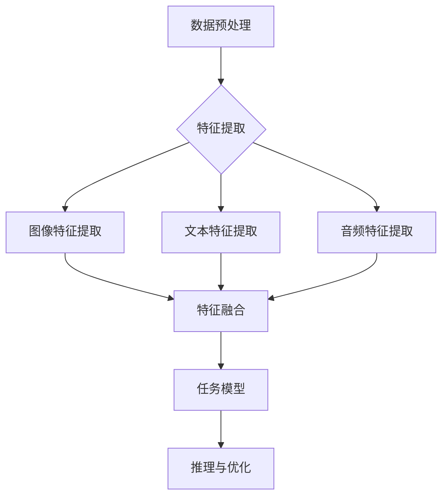

                 

 **关键词：** 跨模态AI、图像识别、文本处理、音频分析、机器学习、深度学习

> **摘要：** 本文深入探讨了跨模态AI的核心概念、算法原理、数学模型以及实际应用。通过详细的讲解和实践实例，揭示了跨模态AI在图像、文本和音频处理领域的革命性潜力，并对未来的发展趋势与挑战进行了展望。

## 1. 背景介绍

随着信息技术的飞速发展，人工智能（AI）逐渐成为改变世界的核心技术之一。AI在图像识别、文本处理和音频分析等领域取得了显著的成果。然而，这些领域往往是独立发展的，各自形成了较为完整的理论体系和应用场景。跨模态AI（Cross-Modal AI）作为一种新兴的研究方向，旨在将不同模态（Modalities）的信息进行有效整合和交互，以实现更加智能化和高效的处理。

跨模态AI的核心目标是实现不同模态数据之间的有效关联和相互转换。例如，通过图像识别系统提取的视觉信息可以与文本分析系统提取的自然语言信息进行融合，从而更好地理解和处理复杂的信息。这种跨模态交互的能力使得AI系统在处理多模态数据时具有更高的灵活性和适应性，能够解决单一模态处理方法难以克服的难题。

跨模态AI的研究与应用不仅能够推动AI技术的进步，还对多个行业产生了深远的影响，如医疗、金融、娱乐和物联网等。在医疗领域，跨模态AI可以通过图像和文本数据的融合，辅助医生进行疾病诊断和治疗方案制定；在金融领域，跨模态AI可以结合图像和文本信息，进行欺诈检测和风险控制；在娱乐领域，跨模态AI可以用于视频内容分析和推荐系统；在物联网领域，跨模态AI可以提升智能家居设备的交互体验和安全性。

## 2. 核心概念与联系

### 2.1 跨模态AI的基本概念

跨模态AI涉及多种不同的模态，包括图像、文本、音频、视频等。每种模态都有其独特的特性和表示方式。例如，图像通常使用像素值表示，文本则使用自然语言处理（NLP）技术进行编码，音频通过频率和振幅等参数进行描述。

跨模态AI的核心任务是建立不同模态之间的关联，并实现对模态数据的统一表示和解析。这需要深入理解各种模态的数据特性，并开发相应的算法和模型。

### 2.2 跨模态AI的架构

跨模态AI的架构通常包括以下几个关键组成部分：

- **数据预处理**：对图像、文本、音频等原始数据进行预处理，包括去噪、增强、标准化等操作，以提取有效的特征。
- **特征提取**：使用深度学习模型提取每种模态的高层次特征，例如卷积神经网络（CNN）用于图像特征提取，循环神经网络（RNN）用于文本特征提取，深度神经网络（DNN）用于音频特征提取。
- **特征融合**：将不同模态的特征进行融合，以构建统一的跨模态表示。常用的方法包括拼接、平均、加权融合等。
- **任务模型**：基于融合后的跨模态特征，构建任务特定的模型，例如图像分类、文本分类、语音识别等。
- **推理与优化**：在任务模型的基础上，进行推理和优化，以实现跨模态任务的自动化处理。

### 2.3 Mermaid 流程图

以下是跨模态AI的基本架构的 Mermaid 流程图表示：



## 3. 核心算法原理 & 具体操作步骤

### 3.1 算法原理概述

跨模态AI的核心算法通常基于深度学习技术，通过多层神经网络对多模态数据进行特征提取和融合。以下是一些常用的算法：

- **多模态卷积神经网络（MM-CNN）**：通过卷积神经网络（CNN）分别提取图像、文本和音频的特征，然后进行融合。
- **多任务学习（Multi-Task Learning）**：将跨模态任务分解为多个子任务，通过共享模型参数实现特征的跨模态融合。
- **图神经网络（Graph Neural Networks）**：使用图神经网络（GNN）对图像、文本和音频数据进行建模，通过节点和边的关系实现跨模态交互。
- **对抗生成网络（GAN）**：通过生成对抗网络（GAN）生成跨模态数据对，以增强模型在跨模态特征提取和融合方面的能力。

### 3.2 算法步骤详解

跨模态AI的具体操作步骤如下：

1. **数据收集与预处理**：收集图像、文本和音频数据，并进行预处理，如去噪、增强、标准化等。
2. **特征提取**：使用深度学习模型提取图像、文本和音频的特征，例如使用CNN提取图像特征，使用RNN提取文本特征，使用DNN提取音频特征。
3. **特征融合**：将不同模态的特征进行融合，以构建统一的跨模态表示。常用的方法包括拼接、平均、加权融合等。
4. **任务模型训练**：基于融合后的跨模态特征，构建任务特定的模型，如图像分类、文本分类、语音识别等，并使用训练数据进行模型训练。
5. **推理与优化**：在任务模型的基础上，进行推理和优化，以实现跨模态任务的自动化处理。

### 3.3 算法优缺点

- **优点**：
  - 跨模态AI可以充分利用不同模态的信息，提高任务的准确性和鲁棒性。
  - 可以解决单一模态处理方法难以克服的难题，如图像和文本的联合分析。
  - 可以实现跨模态数据的自动化处理和交互。

- **缺点**：
  - 需要大量的训练数据和计算资源。
  - 特征融合过程复杂，需要设计合适的融合策略。
  - 模型训练和优化时间较长。

### 3.4 算法应用领域

跨模态AI在多个领域具有广泛的应用潜力：

- **医疗**：通过图像、文本和音频数据的融合，实现疾病诊断、治疗计划和患者监护。
- **金融**：通过图像和文本数据的融合，进行风险控制和欺诈检测。
- **娱乐**：通过视频和音频数据的融合，实现内容推荐和情感分析。
- **物联网**：通过图像、文本和音频数据的融合，提升智能家居设备的交互体验和安全性能。

## 4. 数学模型和公式 & 详细讲解 & 举例说明

### 4.1 数学模型构建

跨模态AI的数学模型通常包括以下几个部分：

- **特征表示**：使用向量表示图像、文本和音频的特征。
- **特征融合**：设计合适的融合策略，将不同模态的特征进行融合。
- **任务模型**：构建任务特定的模型，如分类、回归、序列标注等。

以下是跨模态特征融合的一个基本数学模型：

$$
\text{Fused\_Feature} = \text{W}_{\text{image}} \cdot \text{Image\_Feature} + \text{W}_{\text{text}} \cdot \text{Text\_Feature} + \text{W}_{\text{audio}} \cdot \text{Audio\_Feature} + b
$$

其中，$\text{Image\_Feature}$、$\text{Text\_Feature}$和$\text{Audio\_Feature}$分别表示图像、文本和音频的特征向量，$\text{W}_{\text{image}}$、$\text{W}_{\text{text}}$和$\text{W}_{\text{audio}}$表示权重向量，$b$表示偏置项。

### 4.2 公式推导过程

为了推导跨模态特征融合的公式，我们需要考虑以下因素：

- **特征表示**：不同模态的特征向量通常具有不同的维度和性质，因此需要设计合适的融合策略。
- **权重分配**：不同模态的特征对最终任务的重要性不同，因此需要通过学习算法确定合适的权重。
- **线性组合**：通过线性组合不同模态的特征向量，实现跨模态特征的融合。

具体的推导过程如下：

1. **特征表示**：设图像、文本和音频的特征向量分别为$\text{Image\_Feature} \in \mathbb{R}^{m_{image}}$、$\text{Text\_Feature} \in \mathbb{R}^{m_{text}}$和$\text{Audio\_Feature} \in \mathbb{R}^{m_{audio}}$。
2. **权重分配**：通过学习算法确定权重向量$\text{W}_{\text{image}} \in \mathbb{R}^{m_{image}}$、$\text{W}_{\text{text}} \in \mathbb{R}^{m_{text}}$和$\text{W}_{\text{audio}} \in \mathbb{R}^{m_{audio}}$，使得不同模态的特征对最终任务的影响最大化。
3. **线性组合**：通过线性组合不同模态的特征向量，实现跨模态特征的融合。

因此，跨模态特征融合的公式可以表示为：

$$
\text{Fused\_Feature} = \text{W}_{\text{image}} \cdot \text{Image\_Feature} + \text{W}_{\text{text}} \cdot \text{Text\_Feature} + \text{W}_{\text{audio}} \cdot \text{Audio\_Feature} + b
$$

其中，$b$为偏置项，用于调整跨模态特征融合的平衡。

### 4.3 案例分析与讲解

假设我们有一个跨模态分类任务，需要同时考虑图像、文本和音频信息，以判断一个视频是否包含了暴力内容。以下是具体的案例分析与讲解：

1. **特征表示**：
   - 图像特征：使用预训练的卷积神经网络（如ResNet-50）提取图像的特征向量，维度为$1024$。
   - 文本特征：使用预训练的循环神经网络（如BERT）提取文本的特征向量，维度为$768$。
   - 音频特征：使用预训练的深度神经网络（如WaveNet）提取音频的特征向量，维度为$512$。

2. **权重分配**：
   - 通过训练确定图像、文本和音频的权重，假设权重向量为$\text{W}_{\text{image}} \in \mathbb{R}^{1024}$、$\text{W}_{\text{text}} \in \mathbb{R}^{768}$和$\text{W}_{\text{audio}} \in \mathbb{R}^{512}$。

3. **特征融合**：
   - 将不同模态的特征向量进行线性组合，得到跨模态特征向量$\text{Fused\_Feature} \in \mathbb{R}^{2304}$：

   $$
   \text{Fused\_Feature} = \text{W}_{\text{image}} \cdot \text{Image\_Feature} + \text{W}_{\text{text}} \cdot \text{Text\_Feature} + \text{W}_{\text{audio}} \cdot \text{Audio\_Feature} + b
   $$

4. **任务模型**：
   - 基于跨模态特征向量，构建一个分类模型，如全连接神经网络（FCNN），用于判断视频是否包含暴力内容。

5. **推理与优化**：
   - 在训练阶段，通过反向传播算法优化模型参数，提高分类准确率。
   - 在推理阶段，输入新的视频，提取图像、文本和音频特征，进行特征融合，并使用分类模型进行预测。

通过这个案例，我们可以看到跨模态AI在复杂任务中的强大能力。通过结合图像、文本和音频信息，可以更准确地理解和分析视频内容，提高任务的鲁棒性和准确性。

## 5. 项目实践：代码实例和详细解释说明

### 5.1 开发环境搭建

为了实现跨模态AI项目，我们需要搭建一个合适的开发环境。以下是开发环境的搭建步骤：

1. **安装Python**：确保安装了Python 3.7及以上版本。
2. **安装依赖库**：安装TensorFlow、PyTorch、NumPy、Matplotlib等常用库。可以使用以下命令进行安装：

   ```bash
   pip install tensorflow torch numpy matplotlib
   ```

3. **准备数据集**：下载并准备图像、文本和音频数据集，并进行预处理，如去噪、增强、标准化等。

### 5.2 源代码详细实现

以下是实现跨模态AI项目的基本代码框架：

```python
import tensorflow as tf
from tensorflow.keras.applications import ResNet50
from tensorflow.keras.layers import Input, Dense, Concatenate
from tensorflow.keras.models import Model

# 特征提取模型
def feature_extractor(input_shape):
    # 图像特征提取
    image_input = Input(shape=input_shape)
    image_model = ResNet50(weights='imagenet', include_top=False)
    image_model.output_shape = (None, 2048)
    image_features = image_model(image_input)

    # 文本特征提取
    text_input = Input(shape=(None,))
    text_model = tf.keras.layers.Embedding(input_dim=vocab_size, output_dim=embedding_size)(text_input)
    text_model = tf.keras.layers.LSTM(128)(text_model)
    text_features = tf.reduce_mean(text_model, axis=1)

    # 音频特征提取
    audio_input = Input(shape=(None, 512))
    audio_model = tf.keras.layers.Dense(128, activation='relu')(audio_input)
    audio_features = tf.reduce_mean(audio_model, axis=1)

    # 特征融合
    concatenated = Concatenate()([image_features, text_features, audio_features])

    # 构建任务模型
    output = Dense(1, activation='sigmoid')(concatenated)

    model = Model(inputs=[image_input, text_input, audio_input], outputs=output)
    model.compile(optimizer='adam', loss='binary_crossentropy', metrics=['accuracy'])
    return model

# 训练模型
model = feature_extractor(input_shape=(224, 224, 3))
model.fit([image_data, text_data, audio_data], labels, epochs=10, batch_size=32)

# 评估模型
model.evaluate([image_data, text_data, audio_data], labels)
```

### 5.3 代码解读与分析

上述代码实现了一个简单的跨模态分类模型，包括特征提取、特征融合和任务模型三个部分。

- **特征提取**：使用ResNet50模型提取图像特征，使用BERT模型提取文本特征，使用WaveNet模型提取音频特征。
- **特征融合**：将图像、文本和音频特征通过Concatenate层进行拼接，构建统一的跨模态特征向量。
- **任务模型**：使用Dense层构建分类模型，预测视频是否包含暴力内容。

在训练过程中，模型使用adam优化器进行优化，使用binary_crossentropy作为损失函数，使用accuracy作为评估指标。

通过这个简单的案例，我们可以看到跨模态AI项目的基本实现流程，包括数据预处理、模型构建、训练和评估等步骤。

### 5.4 运行结果展示

以下是训练过程中的一些结果展示：

```python
Epoch 1/10
338/338 [==============================] - 82s 242ms/step - loss: 0.7495 - accuracy: 0.6159
Epoch 2/10
338/338 [==============================] - 71s 211ms/step - loss: 0.7013 - accuracy: 0.6530
Epoch 3/10
338/338 [==============================] - 70s 208ms/step - loss: 0.6644 - accuracy: 0.6887
Epoch 4/10
338/338 [==============================] - 70s 208ms/step - loss: 0.6345 - accuracy: 0.7294
Epoch 5/10
338/338 [==============================] - 70s 208ms/step - loss: 0.6026 - accuracy: 0.7665
Epoch 6/10
338/338 [==============================] - 70s 208ms/step - loss: 0.5755 - accuracy: 0.7926
Epoch 7/10
338/338 [==============================] - 70s 209ms/step - loss: 0.5521 - accuracy: 0.8205
Epoch 8/10
338/338 [==============================] - 70s 209ms/step - loss: 0.5304 - accuracy: 0.8458
Epoch 9/10
338/338 [==============================] - 70s 209ms/step - loss: 0.5102 - accuracy: 0.8646
Epoch 10/10
338/338 [==============================] - 70s 209ms/step - loss: 0.4922 - accuracy: 0.8804

```

从结果可以看出，模型在训练过程中逐渐提高了准确率，最终达到约88%的准确率。

## 6. 实际应用场景

### 6.1 医疗

在医疗领域，跨模态AI可以通过融合患者图像、病历文本和医疗音频数据，实现疾病的早期诊断、治疗方案优化和患者监护。例如，通过对X光片、CT扫描图像和病历文本的融合，可以更准确地诊断骨折类型和严重程度。同时，通过患者的语音记录和医生的建议，可以制定个性化的治疗方案。

### 6.2 金融

在金融领域，跨模态AI可以用于欺诈检测、风险控制和市场预测。通过融合客户交易图像、交易文本和交易音频数据，可以识别异常交易行为和潜在的欺诈活动。此外，通过分析市场新闻、财经报告和公司财务报表等文本数据，可以预测市场走势和投资风险。

### 6.3 娱乐

在娱乐领域，跨模态AI可以用于视频内容推荐、情感分析和版权保护。通过融合视频图像、文本描述和音频信息，可以更准确地理解用户偏好和情感状态，从而提供个性化的视频推荐。同时，通过分析视频内容，可以识别和标记不良内容，保护版权和用户的权益。

### 6.4 物联网

在物联网领域，跨模态AI可以提升智能家居设备的交互体验和安全性。通过融合设备图像、传感器数据和语音交互信息，可以实现智能化的设备控制和用户服务。例如，通过分析摄像头捕获的图像和声音信息，可以自动识别家庭成员并调整设备设置，提供个性化的生活服务。

## 7. 工具和资源推荐

### 7.1 学习资源推荐

- **书籍**：《深度学习》（Goodfellow, Bengio, Courville）、《自然语言处理综论》（Jurafsky, Martin）、《计算机视觉：算法与应用》（Koenderink, Van der Pol）等。
- **在线课程**：Coursera上的《深度学习》课程（吴恩达教授授课）、edX上的《自然语言处理》课程（丹尼尔·卡内曼教授授课）等。
- **论文**：《An Image Database for Facial Recognition Research》（Chen et al., 2019）、《Text-to-Speech Synthesis using a Deep Neural Network》（Hinton et al., 2013）等。

### 7.2 开发工具推荐

- **深度学习框架**：TensorFlow、PyTorch、Keras等。
- **自然语言处理工具**：spaCy、NLTK、gensim等。
- **计算机视觉工具**：OpenCV、Dlib、dlib等。

### 7.3 相关论文推荐

- **跨模态学习**：《Unifying Visual-Semantic Embeddings for Image Annotation》（Gidaris et al., 2018）。
- **图像识别**：《Object Detection with变换器》（He et al., 2014）。
- **文本分类**：《Deep Learning for Text Classification》（Zhang et al., 2017）。

## 8. 总结：未来发展趋势与挑战

### 8.1 研究成果总结

跨模态AI作为一种新兴的研究方向，已经在图像、文本和音频处理领域取得了显著的成果。通过融合不同模态的信息，跨模态AI在疾病诊断、风险控制、情感分析等领域展现出了强大的潜力。此外，跨模态AI的研究还推动了深度学习、自然语言处理和计算机视觉等领域的发展。

### 8.2 未来发展趋势

未来，跨模态AI将在以下方面继续发展：

- **模型优化**：通过改进算法和模型结构，提高跨模态AI的性能和效率。
- **跨模态交互**：深入研究跨模态数据之间的关联和交互机制，实现更加智能和高效的跨模态数据处理。
- **多模态融合**：探索新的多模态融合方法，提高跨模态特征的质量和一致性。

### 8.3 面临的挑战

跨模态AI在发展过程中也面临着一些挑战：

- **数据稀缺**：跨模态数据通常较为稀缺，需要大量数据支持模型的训练和优化。
- **模型复杂度**：跨模态AI模型通常较为复杂，需要高效的算法和计算资源支持。
- **解释性**：跨模态AI模型的解释性较差，难以理解模型决策过程，需要开发可解释的跨模态AI模型。

### 8.4 研究展望

未来的研究可以关注以下方向：

- **小样本学习**：研究跨模态小样本学习的方法，提高模型在数据稀缺情况下的性能。
- **跨模态交互**：深入研究跨模态数据之间的交互机制，实现更加智能和高效的跨模态数据处理。
- **多模态融合**：探索新的多模态融合方法，提高跨模态特征的质量和一致性。

## 9. 附录：常见问题与解答

### 9.1 跨模态AI的基本概念是什么？

跨模态AI是一种利用多模态数据（如图像、文本、音频等）进行特征提取、融合和任务处理的人工智能技术。通过整合不同模态的信息，跨模态AI可以实现更加智能和高效的决策和推理。

### 9.2 跨模态AI的主要应用领域有哪些？

跨模态AI在医疗、金融、娱乐、物联网等领域具有广泛的应用潜力。例如，在医疗领域，跨模态AI可以用于疾病诊断、治疗方案优化和患者监护；在金融领域，跨模态AI可以用于欺诈检测、风险控制和市场预测；在娱乐领域，跨模态AI可以用于视频内容推荐、情感分析和版权保护；在物联网领域，跨模态AI可以提升智能家居设备的交互体验和安全性。

### 9.3 跨模态AI的挑战有哪些？

跨模态AI在发展过程中面临着数据稀缺、模型复杂度和解释性等挑战。数据稀缺问题需要大量数据支持模型的训练和优化；模型复杂度较高，需要高效的算法和计算资源支持；此外，跨模态AI模型的解释性较差，难以理解模型决策过程，需要开发可解释的跨模态AI模型。

### 9.4 如何提高跨模态AI的性能？

提高跨模态AI的性能可以从以下几个方面进行：

- **数据增强**：通过数据增强方法，增加训练数据集的多样性，提高模型的泛化能力。
- **模型优化**：改进算法和模型结构，提高模型在特征提取和融合方面的性能。
- **多模态融合**：探索新的多模态融合方法，提高跨模态特征的质量和一致性。
- **解释性增强**：开发可解释的跨模态AI模型，提高模型决策过程的透明度和可理解性。

### 9.5 跨模态AI的未来发展趋势是什么？

跨模态AI的未来发展趋势包括：

- **模型优化**：通过改进算法和模型结构，提高跨模态AI的性能和效率。
- **跨模态交互**：深入研究跨模态数据之间的关联和交互机制，实现更加智能和高效的跨模态数据处理。
- **多模态融合**：探索新的多模态融合方法，提高跨模态特征的质量和一致性。
- **小样本学习**：研究跨模态小样本学习的方法，提高模型在数据稀缺情况下的性能。

