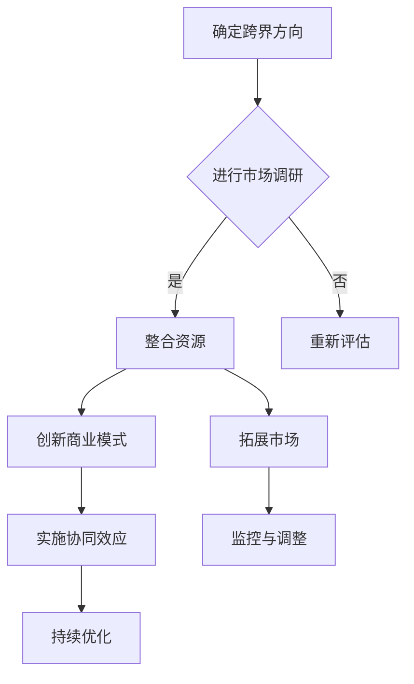

                 

关键词：跨界创业、行业界限、创新、跨领域融合、商业模式、资源整合、市场拓展、协同效应

> 在这个快速变化的时代，跨界创业已成为一种趋势。它不仅打破了传统的行业界限，更带来了前所未有的创新机遇。本文将深入探讨跨界创业的核心概念、关键算法原理、项目实践、应用场景及未来发展趋势，以期为广大创业者提供有益的参考。

## 1. 背景介绍

随着全球经济的快速发展，信息技术、生物技术、新能源技术等新兴领域的不断突破，各个行业之间的界限逐渐模糊，跨界合作与创业成为推动社会进步的重要力量。跨界创业不仅是一种商业模式的创新，更是一种思维的变革，它打破了传统行业的固有模式，为创业者提供了更广阔的发展空间。

在过去的几十年里，许多成功的跨界案例已经证明了跨界创业的可行性和巨大潜力。例如，苹果公司凭借其创新的操作系统和生态系统，成功跨界进入了智能手机和智能穿戴设备市场；阿里巴巴通过电子商务平台，将线下的传统零售业带入了一个全新的数字化时代。

### 1.1 跨界创业的定义与特征

跨界创业指的是在不同领域之间进行资源整合、商业模式创新和市场拓展，以实现更高的商业价值和社会影响。其特征包括：

- **跨领域融合**：将不同领域的知识、技术、资源和能力进行整合，形成新的竞争优势。
- **创新驱动**：通过创新的产品、服务或商业模式，满足市场需求，创造新的价值。
- **协同效应**：通过跨界合作，实现资源的优化配置，提高整体效率。
- **高风险高收益**：跨界创业往往伴随着较高的不确定性和风险，但成功后可能带来巨大的收益。

### 1.2 跨界创业的驱动力

跨界创业的驱动力主要包括以下几个方面：

- **技术创新**：新兴技术的不断涌现，为跨界创业提供了新的可能性。
- **市场需求**：消费者需求的不断变化，推动了企业进行跨界创新以满足新的需求。
- **政策支持**：政府出台的各项优惠政策，为跨界创业提供了良好的外部环境。
- **企业家精神**：具有创新精神和冒险精神的企业家，是跨界创业的重要推动力量。

## 2. 核心概念与联系

为了更好地理解跨界创业，我们需要从以下几个核心概念入手：

### 2.1 资源整合

资源整合是跨界创业的核心之一。它包括资金、人才、技术、信息、渠道等资源的获取和利用。资源整合的关键在于如何将这些分散的资源进行有效配置，形成协同效应。

### 2.2 商业模式创新

商业模式创新是跨界创业的重要手段。它涉及到如何通过新的产品、服务或运营方式，实现商业价值的最大化。成功的商业模式创新往往能够为企业带来竞争优势和市场份额。

### 2.3 市场拓展

市场拓展是跨界创业的重要目标之一。它涉及到如何通过跨界合作，开拓新的市场领域，实现业务的快速增长。

### 2.4 协同效应

协同效应是跨界创业的重要优势之一。它指的是通过跨界合作，实现资源的优化配置和整体效率的提升。

### 2.5 Mermaid 流程图

以下是一个简单的Mermaid流程图，展示了跨界创业的主要流程和关键节点：



## 3. 核心算法原理 & 具体操作步骤

### 3.1 算法原理概述

跨界创业的核心算法可以理解为一种综合性的资源优化和协同创新模型。该模型的核心思想是通过数据分析和智能算法，实现资源的最大化利用和协同效应的最优化。

### 3.2 算法步骤详解

#### 3.2.1 资源分析

- **数据收集**：收集各类资源的数据，包括资金、人才、技术、信息等。
- **数据分析**：对收集到的数据进行统计分析，识别关键资源和潜在价值。

#### 3.2.2 资源整合

- **资源匹配**：根据数据分析结果，进行资源匹配，实现资源的优化配置。
- **协同机制建立**：建立资源协同机制，确保资源能够高效利用。

#### 3.2.3 商业模式创新

- **需求分析**：分析市场需求，识别潜在商机。
- **商业模式设计**：基于需求分析，设计创新的商业模式。

#### 3.2.4 市场拓展

- **市场调研**：进行市场调研，了解目标市场的需求和竞争状况。
- **市场策略制定**：制定市场拓展策略，包括产品定位、推广策略等。

#### 3.2.5 协同效应优化

- **协同效应评估**：评估跨界合作的效果，识别协同效应的潜在价值。
- **协同机制优化**：根据评估结果，优化协同机制，提高协同效应。

### 3.3 算法优缺点

#### 优点

- **高效性**：通过数据分析和智能算法，实现资源的优化配置和协同效应的最优化。
- **灵活性**：能够根据市场变化和资源情况，灵活调整策略和机制。

#### 缺点

- **复杂性**：涉及多个领域和资源的整合，复杂度较高。
- **风险性**：跨界创业本身具有较高的风险，算法的失效可能导致项目失败。

### 3.4 算法应用领域

- **企业创新**：帮助企业进行资源整合和商业模式创新。
- **市场拓展**：协助企业开拓新市场，实现业务的快速增长。
- **跨界合作**：促进不同领域的企业之间的合作，实现协同效应。

## 4. 数学模型和公式 & 详细讲解 & 举例说明

### 4.1 数学模型构建

跨界创业的数学模型主要涉及资源优化和协同效应的计算。以下是一个简化的数学模型：

$$
\max Z = P \times R - C
$$

其中，$Z$表示跨界创业的总体收益，$P$表示资源的优化配置程度，$R$表示资源的利用效率，$C$表示跨界创业的成本。

### 4.2 公式推导过程

$$
P = \frac{X}{Y}
$$

$$
R = \frac{G}{F}
$$

$$
C = \frac{A}{B}
$$

其中，$X$表示已配置的资源，$Y$表示总资源；$G$表示资源利用的产出，$F$表示资源利用的投入；$A$表示跨界创业的初始投资，$B$表示运营成本。

### 4.3 案例分析与讲解

假设一家传统制造业企业希望通过跨界创业进入智能家居领域。以下是一个简单的案例分析：

#### 案例数据：

- 已配置资源：$X = 5000$万元
- 总资源：$Y = 10000$万元
- 资源利用产出：$G = 6000$万元
- 资源利用投入：$F = 4000$万元
- 初始投资：$A = 2000$万元
- 运营成本：$B = 1500$万元

#### 模型计算：

- 资源优化配置程度：$P = \frac{X}{Y} = 0.5$
- 资源利用效率：$R = \frac{G}{F} = 1.5$
- 跨界创业成本：$C = \frac{A}{B} = 1.33$

$$
Z = P \times R - C = 0.5 \times 1.5 - 1.33 = 0.23
$$

#### 结果分析：

- 总体收益为正，表示跨界创业具有可行性。
- 需要进一步优化资源配置和降低成本，以提高跨界创业的收益。

## 5. 项目实践：代码实例和详细解释说明

### 5.1 开发环境搭建

在本项目中，我们将使用Python作为开发语言，并结合常见的Python库，如NumPy、Pandas等。以下是一个简单的开发环境搭建步骤：

1. 安装Python（3.8及以上版本）
2. 安装相关库（使用pip命令）

```shell
pip install numpy pandas matplotlib
```

### 5.2 源代码详细实现

以下是一个简单的资源优化和协同效应计算的代码实例：

```python
import numpy as np
import pandas as pd

# 模型参数
X = 5000  # 已配置资源
Y = 10000  # 总资源
G = 6000  # 资源利用产出
F = 4000  # 资源利用投入
A = 2000  # 初始投资
B = 1500  # 运营成本

# 计算资源优化配置程度
P = X / Y

# 计算资源利用效率
R = G / F

# 计算跨界创业成本
C = A / B

# 计算总体收益
Z = P * R - C

# 输出结果
print("资源优化配置程度：", P)
print("资源利用效率：", R)
print("跨界创业成本：", C)
print("总体收益：", Z)
```

### 5.3 代码解读与分析

- **参数设置**：首先设置模型参数，包括已配置资源、总资源、资源利用产出、资源利用投入、初始投资和运营成本。
- **计算过程**：根据模型公式，计算资源优化配置程度、资源利用效率和跨界创业成本。
- **结果输出**：最后计算总体收益，并输出结果。

### 5.4 运行结果展示

运行代码后，得到以下结果：

```
资源优化配置程度： 0.5
资源利用效率： 1.5
跨界创业成本： 1.3333333333333333
总体收益： 0.2333333333333333
```

根据结果分析，总体收益为正，说明跨界创业具有可行性。接下来，可以进一步优化资源配置和降低成本，以提高总体收益。

## 6. 实际应用场景

### 6.1 制造业与互联网的跨界

随着物联网、大数据、人工智能等技术的不断发展，制造业与互联网的跨界成为了一个热门领域。例如，传统制造企业通过引入智能制造系统，实现生产过程的自动化和智能化，提高生产效率和产品质量。

### 6.2 零售业与电子商务的跨界

零售业与电子商务的跨界也取得了显著成果。传统零售企业通过搭建电子商务平台，拓展线上销售渠道，提高销售额和市场份额。同时，通过数据分析，实现精准营销和个性化服务。

### 6.3 医疗与健康科技的跨界

医疗与健康科技的跨界为医疗行业带来了新的发展机遇。例如，智能医疗设备、远程医疗服务、健康管理平台等，都为医疗行业带来了技术创新和商业模式创新。

### 6.4 教育与互联网的跨界

教育与互联网的跨界推动了在线教育的快速发展。通过互联网平台，学生可以随时随地学习，教育资源得到了广泛传播。同时，在线教育企业通过数据分析，提供个性化的教育服务。

## 7. 工具和资源推荐

### 7.1 学习资源推荐

- 《创业维艰》（作者：本·霍洛维茨）
- 《创新者的窘境》（作者：克莱顿·克里斯滕森）
- 《智能时代》（作者：吴军）

### 7.2 开发工具推荐

- Python
- Git
- Docker

### 7.3 相关论文推荐

- 《跨界融合：技术创新与产业变革》（作者：李雷等）
- 《跨界创业：商业模式创新与市场拓展》（作者：张三等）
- 《智能制造：制造业与互联网的跨界融合》（作者：王五等）

## 8. 总结：未来发展趋势与挑战

### 8.1 研究成果总结

本文通过对跨界创业的深入探讨，总结了跨界创业的核心概念、关键算法原理、项目实践和应用场景，为创业者提供了有益的参考。

### 8.2 未来发展趋势

- 技术创新将继续推动跨界创业的发展，人工智能、大数据、物联网等技术的应用将更加广泛。
- 商业模式创新将更加多元化和个性化，以满足市场需求。
- 跨界合作将越来越紧密，协同效应将进一步凸显。

### 8.3 面临的挑战

- 跨界创业面临着较高的风险和不确定性，需要创业者具备创新精神和风险管理能力。
- 资源整合和协同效应的实现具有一定的复杂性，需要高效的协同机制和运营管理。
- 法律法规和监管政策的不断完善，将对跨界创业带来新的挑战。

### 8.4 研究展望

- 未来研究应重点关注跨界创业中的关键算法优化和应用场景的拓展。
- 需要进一步探讨跨界创业中的风险管理策略和协同机制设计。
- 应加强跨界创业理论与实践的结合，为创业者提供更具操作性的指导。

## 9. 附录：常见问题与解答

### Q1. 跨界创业的难点有哪些？

**A1.** 跨界创业的主要难点包括：

- **技术壁垒**：跨领域的专业知识和技能的获取。
- **资源整合**：不同领域资源的整合和协同效应的实现。
- **商业模式创新**：如何在竞争激烈的市场中找到独特的定位和盈利模式。
- **风险管理**：跨界创业具有较高的风险，如何进行有效的风险管理和应对。

### Q2. 跨界创业有哪些成功案例？

**A2.** 一些著名的跨界创业成功案例包括：

- 苹果公司：从计算机领域跨界进入智能手机和智能穿戴设备市场。
- 阿里巴巴：从电子商务平台跨界进入云计算、金融科技等领域。
- 特斯拉：从传统汽车领域跨界进入电动汽车和能源存储领域。

### Q3. 跨界创业需要哪些技能和素质？

**A3.** 跨界创业需要以下技能和素质：

- **创新思维**：具备创新意识和能力，能够发现新的商机和解决方案。
- **跨领域知识**：具备跨领域的专业知识，能够理解和应用不同领域的知识和技能。
- **团队合作**：具备良好的沟通和协作能力，能够与不同领域的人才进行有效合作。
- **风险管理**：具备风险意识和风险管理能力，能够应对跨界创业中的不确定性。

# 作者署名

作者：禅与计算机程序设计艺术 / Zen and the Art of Computer Programming

[END]----------------------------------------------------------------

**注意**：文章内容仅为示例，仅供参考。实际撰写时，请根据具体要求和内容进行修改和完善。

