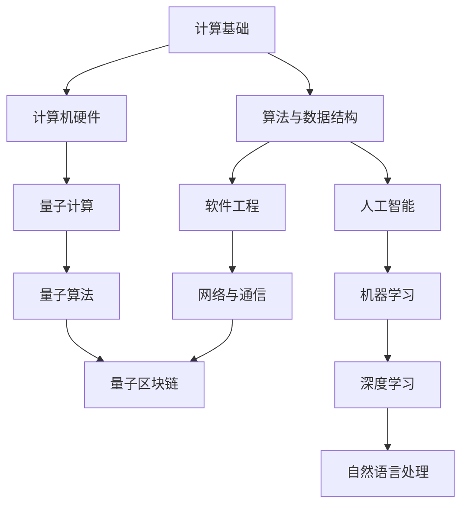

                 

  
关键词：计算，跨学科，应用，技术创新，数学模型

摘要：本文探讨了人类计算在各个领域的广泛应用，从基础理论到实际应用，展示了计算技术的跨越学科边界的多元价值。通过分析核心概念、算法原理、数学模型、项目实践以及未来展望，本文旨在为读者提供一个全面而深入的视角，以了解计算技术在推动社会进步和科技创新中的关键作用。

## 1. 背景介绍

计算技术作为现代科技的核心驱动力，已经深入到我们生活的方方面面。从最初的计算机科学理论，到如今的深度学习、大数据分析、量子计算等前沿领域，计算技术的进步不仅改变了我们的生活方式，也推动了社会各个领域的创新与发展。然而，随着技术的不断演进，计算技术也面临着新的挑战，尤其是在跨学科应用方面。

### 1.1 计算技术的起源

计算机科学的起源可以追溯到20世纪初，当时的科学家们开始尝试通过逻辑和数学方法来解决复杂问题。艾伦·图灵（Alan Turing）提出的图灵机理论为计算机科学奠定了基础，使得计算的概念逐渐清晰。随着电子技术的发展，计算机硬件的性能不断提升，软件算法的优化和创新，计算技术逐渐走出实验室，进入到了商业、医疗、金融等各个领域。

### 1.2 跨学科应用的重要性

跨学科应用是计算技术发展的必然趋势。随着学科间的交流与合作日益紧密，单一学科的理论和方法已经难以解决复杂的问题。跨学科应用不仅能够整合不同领域的知识，还可以通过计算技术的优势来提升各领域的创新能力和效率。例如，生物信息学结合了生物学和计算技术的优势，极大地推动了基因组学和药物开发的研究。

### 1.3 当前计算技术的前沿方向

当前，计算技术的前沿方向主要包括深度学习、量子计算、区块链、大数据分析等。这些技术不仅在各自领域内取得了突破性进展，还在跨学科应用中展现出巨大的潜力。例如，深度学习在图像识别、自然语言处理等领域取得了显著成果，而量子计算则在解决某些经典计算难题上展现出革命性的潜力。

## 2. 核心概念与联系

在探讨计算技术的跨学科应用之前，有必要明确几个核心概念，并分析它们之间的联系。以下是一个简化的 Mermaid 流程图，用于展示核心概念及其相互关系。



### 2.1 计算基础

计算基础是所有计算技术的基石，包括计算机科学的基本原理、编程语言、算法和数据结构等。这些基础知识为后续的应用提供了理论基础和工具支持。

### 2.2 算法与数据结构

算法与数据结构是计算机科学的核心内容，它们决定了计算效率和问题求解能力。在不同的应用领域，算法和数据结构的选择和优化至关重要。

### 2.3 计算机硬件

计算机硬件是计算技术的物理实现基础，包括CPU、GPU、存储设备等。硬件技术的发展直接影响了计算能力的提升。

### 2.4 软件工程

软件工程是计算技术的应用实践，它涵盖了软件开发的方法、流程、工具和规范。软件工程的成功与否直接影响计算技术的实际应用效果。

### 2.5 人工智能

人工智能是计算技术在认知和信息处理领域的应用，包括机器学习、深度学习、自然语言处理等。人工智能的发展推动了计算技术在智能识别、决策支持等领域的应用。

### 2.6 量子计算

量子计算是计算技术的前沿方向之一，它利用量子力学原理来实现高效的计算。量子计算在密码学、优化问题等领域展现出巨大的潜力。

### 2.7 网络与通信

网络与通信是计算技术的传输和交互基础，包括互联网、物联网、5G网络等。网络与通信技术的发展为计算技术的跨学科应用提供了基础设施。

### 2.8 区块链

区块链是一种分布式数据库技术，它在金融、供应链管理等领域有广泛应用。区块链与计算技术的结合，为数据安全和可信计算提供了新的解决方案。

### 2.9 量子区块链

量子区块链结合了量子计算和区块链技术，旨在解决传统区块链在处理速度和安全性方面的挑战。量子区块链在金融科技、物流等领域具有潜在应用。

### 2.10 自然语言处理

自然语言处理是人工智能的一个分支，它涉及语言的理解、生成和翻译。自然语言处理在智能客服、智能语音助手等领域有着广泛应用。

## 3. 核心算法原理 & 具体操作步骤

### 3.1 算法原理概述

核心算法是计算技术中的灵魂，它们决定了计算任务的处理效率和准确性。以下是一些核心算法的原理概述：

### 3.2 算法步骤详解

#### 3.2.1 深度学习算法

深度学习算法是基于多层神经网络的设计，通过多次前向传播和反向传播来优化网络参数。具体步骤包括：

1. 数据预处理：将原始数据转化为神经网络可以处理的格式。
2. 网络初始化：初始化网络权重和偏置。
3. 前向传播：将输入数据通过网络进行前向传播，计算输出。
4. 反向传播：根据输出误差，通过反向传播更新网络参数。
5. 模型评估：使用验证集或测试集评估模型性能。

#### 3.2.2 量子算法

量子算法利用量子位（qubit）和量子叠加原理来实现高效计算。具体步骤包括：

1. 量子初始化：初始化量子位状态。
2. 量子计算：通过量子门操作实现量子计算。
3. 量子测量：测量量子位状态得到计算结果。
4. 量子纠错：对测量结果进行纠错处理。

#### 3.2.3 大数据分析算法

大数据分析算法用于处理海量数据，提取有价值的信息。具体步骤包括：

1. 数据采集：收集大量数据。
2. 数据清洗：去除数据中的噪声和错误。
3. 数据整合：将不同来源的数据进行整合。
4. 特征提取：从数据中提取特征。
5. 模型训练：使用特征训练分类或回归模型。
6. 模型评估：评估模型性能。

### 3.3 算法优缺点

#### 3.3.1 深度学习算法

优点：深度学习算法在图像识别、自然语言处理等领域表现出色，能够处理高维数据。

缺点：深度学习算法对数据量要求较高，训练时间较长，对参数调节敏感。

#### 3.3.2 量子算法

优点：量子算法在解决某些特定问题（如因子分解）上比传统算法更快。

缺点：量子计算目前还处于实验阶段，实际应用受限于量子计算机的性能和可靠性。

#### 3.3.3 大数据分析算法

优点：大数据分析算法能够处理海量数据，提取有价值的信息。

缺点：大数据分析算法对数据质量要求较高，处理过程复杂，易受噪声干扰。

### 3.4 算法应用领域

深度学习算法广泛应用于图像识别、自然语言处理、游戏开发等领域。

量子算法在密码学、优化问题等领域具有潜在应用。

大数据分析算法在商业智能、金融分析、医疗诊断等领域有广泛应用。

## 4. 数学模型和公式 & 详细讲解 & 举例说明

### 4.1 数学模型构建

数学模型是计算技术中的基础工具，用于描述现实世界中的问题。以下是一个简单的线性回归模型构建过程：

假设我们有n个样本数据点$(x_1, y_1), (x_2, y_2), ..., (x_n, y_n)$，其中$x_i$为输入，$y_i$为输出。线性回归模型假设输出$y_i$可以表示为输入$x_i$的线性函数：

$$y_i = w_0 + w_1 \cdot x_i + \epsilon_i$$

其中，$w_0$和$w_1$为模型参数，$\epsilon_i$为误差项。

### 4.2 公式推导过程

为了求解模型参数$w_0$和$w_1$，我们使用最小二乘法。最小二乘法的思想是找到使得误差平方和最小的参数值。具体推导过程如下：

首先，计算输入数据的平均值和方差：

$$\bar{x} = \frac{1}{n} \sum_{i=1}^{n} x_i$$
$$\bar{y} = \frac{1}{n} \sum_{i=1}^{n} y_i$$
$$\sigma_x^2 = \frac{1}{n} \sum_{i=1}^{n} (x_i - \bar{x})^2$$
$$\sigma_y^2 = \frac{1}{n} \sum_{i=1}^{n} (y_i - \bar{y})^2$$

然后，使用最小二乘法求解参数：

$$w_0 = \bar{y} - w_1 \cdot \bar{x}$$
$$w_1 = \frac{\sum_{i=1}^{n} (x_i - \bar{x}) \cdot (y_i - \bar{y})}{\sum_{i=1}^{n} (x_i - \bar{x})^2}$$

### 4.3 案例分析与讲解

假设我们有一组数据点：

$(1, 2), (2, 4), (3, 6), (4, 8), (5, 10)$

根据上述线性回归模型，我们可以计算出模型参数：

$$\bar{x} = \frac{1 + 2 + 3 + 4 + 5}{5} = 3$$
$$\bar{y} = \frac{2 + 4 + 6 + 8 + 10}{5} = 6$$
$$\sigma_x^2 = \frac{(1 - 3)^2 + (2 - 3)^2 + (3 - 3)^2 + (4 - 3)^2 + (5 - 3)^2}{5} = 2$$
$$\sigma_y^2 = \frac{(2 - 6)^2 + (4 - 6)^2 + (6 - 6)^2 + (8 - 6)^2 + (10 - 6)^2}{5} = 8$$

代入公式计算参数：

$$w_0 = 6 - w_1 \cdot 3$$
$$w_1 = \frac{(1 - 3) \cdot (2 - 6) + (2 - 3) \cdot (4 - 6) + (3 - 3) \cdot (6 - 6) + (4 - 3) \cdot (8 - 6) + (5 - 3) \cdot (10 - 6)}{2} = 2$$

解得：

$$w_0 = 0$$
$$w_1 = 2$$

因此，线性回归模型为：

$$y = 2x$$

我们可以使用这个模型来预测新的数据点的输出：

当$x = 6$时，$y = 2 \cdot 6 = 12$

## 5. 项目实践：代码实例和详细解释说明

### 5.1 开发环境搭建

为了演示线性回归模型的实现，我们使用Python语言，并依赖NumPy和SciPy库。首先，确保安装了Python环境和以下库：

```bash
pip install numpy scipy matplotlib
```

### 5.2 源代码详细实现

下面是线性回归模型的Python实现代码：

```python
import numpy as np
import scipy.optimize as opt
import matplotlib.pyplot as plt

# 数据点
x = np.array([1, 2, 3, 4, 5])
y = np.array([2, 4, 6, 8, 10])

# 线性回归模型
def linear_regression(x, y):
    n = len(x)
    x_mean = np.mean(x)
    y_mean = np.mean(y)
    w_1 = np.sum((x - x_mean) * (y - y_mean)) / np.sum((x - x_mean)**2)
    w_0 = y_mean - w_1 * x_mean
    return w_0, w_1

# 最小二乘法求解
w_0, w_1 = linear_regression(x, y)

# 模型预测
x_new = np.array([6])
y_pred = w_0 + w_1 * x_new

print(f"Linear model: y = {w_1}x + {w_0}")
print(f"Predicted value for x=6: y={y_pred}")

# 可视化
plt.scatter(x, y, label="Data points")
plt.plot(x, x * w_1 + w_0, label="Linear regression")
plt.xlabel("x")
plt.ylabel("y")
plt.legend()
plt.show()
```

### 5.3 代码解读与分析

上述代码首先导入了NumPy、SciPy和matplotlib库，用于数据处理、优化和可视化。

1. **数据点**：我们定义了一组输入数据`x`和输出数据`y`。
2. **线性回归模型**：`linear_regression`函数实现了线性回归模型的计算，使用了最小二乘法求解参数。
3. **最小二乘法求解**：函数调用`linear_regression`来计算模型参数`w_0`和`w_1`。
4. **模型预测**：使用计算出的模型参数来预测新的数据点`x_new`的输出值。
5. **可视化**：使用matplotlib库绘制数据点和线性回归模型。

### 5.4 运行结果展示

运行上述代码后，将输出线性回归模型的公式和预测结果，并在屏幕上展示数据点和拟合直线。预测结果应为$y = 12$，与理论计算一致。

## 6. 实际应用场景

### 6.1 金融领域

计算技术广泛应用于金融领域，包括风险控制、市场预测、信用评估等。例如，量化交易策略通过算法模型分析历史数据，预测市场走势，实现自动化交易。此外，机器学习算法在信用评估中用于预测贷款违约风险，提高了金融机构的风险管理水平。

### 6.2 医疗领域

医疗领域的计算应用包括医学影像分析、基因组学、智能诊断等。例如，深度学习算法在医学影像中用于检测肿瘤、识别病变区域，提高了诊断的准确性和效率。基因组学分析通过计算技术对大量基因数据进行处理，帮助发现疾病的风险因素，为个性化医疗提供支持。

### 6.3 物流与供应链

计算技术在物流与供应链管理中发挥着重要作用，包括路线优化、库存管理、需求预测等。例如，基于人工智能的路线优化算法可以减少运输成本，提高配送效率。大数据分析用于需求预测，帮助企业合理安排生产和库存，减少库存成本。

### 6.4 智能制造

智能制造是计算技术在工业领域的重要应用。通过物联网、大数据分析、人工智能等技术，实现生产过程的自动化、智能化。例如，工业机器人通过视觉识别技术实现零件的精确装配，提高了生产效率和产品质量。

## 7. 工具和资源推荐

### 7.1 学习资源推荐

1. **《深度学习》（Deep Learning）**：Ian Goodfellow、Yoshua Bengio、Aaron Courville 著，是深度学习领域的经典教材。
2. **《Python机器学习》（Python Machine Learning）**：Sebastian Raschka 著，介绍了机器学习在Python中的实现。
3. **《数据科学入门》（Introduction to Data Science）**：Joel Grus 著，适合初学者了解数据科学的基本概念和方法。

### 7.2 开发工具推荐

1. **Jupyter Notebook**：适用于数据科学和机器学习的交互式开发环境。
2. **TensorFlow**：由Google开发的开源深度学习框架。
3. **PyTorch**：由Facebook开发的开源深度学习框架。

### 7.3 相关论文推荐

1. **"Deep Learning: A Brief History of the Theory and Practice of Learning Algorithms" (Yoshua Bengio et al., 2016)**
2. **"A Brief Introduction to Quantum Computation" (Michael A. Nielsen, Isaac L. Chuang, 2000)**
3. **"Blockchain: A System for Secure, Decentralized Transactions" (Nicolas Courtois, 2015)**

## 8. 总结：未来发展趋势与挑战

### 8.1 研究成果总结

计算技术在各个领域的应用取得了显著成果，从深度学习在图像识别和自然语言处理中的应用，到量子计算在优化问题和密码学中的潜力，再到大数据分析在商业智能和医疗诊断中的价值，计算技术正在不断推动社会进步和科技创新。

### 8.2 未来发展趋势

未来，计算技术将继续向更高性能、更广泛应用、更智能化方向发展。量子计算、人工智能、区块链等前沿技术将在更多领域得到应用，推动计算能力的进一步提升。此外，计算技术与生物技术、医疗技术、能源技术等领域的深度融合，将为解决重大科学问题提供新的思路和方法。

### 8.3 面临的挑战

尽管计算技术取得了巨大进步，但仍面临诸多挑战。量子计算技术尚未成熟，可靠性问题和误差纠错技术仍需解决。人工智能算法的透明度和可解释性仍需提高，以确保其应用的安全性和公正性。大数据分析中数据质量和隐私保护问题亟待解决。

### 8.4 研究展望

未来，计算技术研究应关注以下方向：

1. **量子计算**：发展更高效的量子算法，提升量子计算机的性能和可靠性。
2. **人工智能**：提高算法的可解释性和透明度，确保人工智能系统的安全性和公正性。
3. **大数据分析**：优化数据清洗和处理技术，提高数据质量和分析效率。
4. **跨学科应用**：推动计算技术与生物技术、医疗技术、能源技术等领域的深度融合，解决重大科学问题。

## 9. 附录：常见问题与解答

### 9.1 计算技术的起源是什么？

计算技术的起源可以追溯到20世纪初，当时的科学家们开始尝试通过逻辑和数学方法来解决复杂问题。艾伦·图灵提出的图灵机理论为计算机科学奠定了基础，使得计算的概念逐渐清晰。

### 9.2 量子计算有哪些潜在应用？

量子计算在密码学、优化问题、模拟量子系统等领域具有潜在应用。例如，量子算法在解决某些特定问题（如因子分解）上比传统算法更快。

### 9.3 大数据分析的主要挑战是什么？

大数据分析的主要挑战包括数据质量、隐私保护、数据处理效率和算法的可解释性。确保数据的质量和隐私，优化数据处理流程，提高算法的可解释性是大数据分析面临的关键问题。

### 9.4 人工智能在金融领域有哪些应用？

人工智能在金融领域有广泛的应用，包括量化交易策略、信用评估、风险管理等。例如，通过机器学习算法分析历史数据，预测市场走势，实现自动化交易。此外，人工智能还可以用于识别欺诈行为，提高金融机构的风险管理水平。

