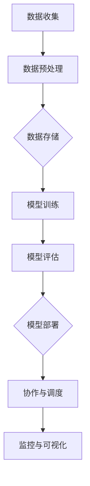

                 

关键词：跨部门AI协作、Lepton AI、内部生态、技术框架、系统设计、人工智能应用、协作流程

## 摘要

本文将探讨Lepton AI作为一个跨部门协作的AI系统的内部生态。我们将首先介绍Lepton AI的背景和目标，然后深入剖析其核心概念与架构，详细讲解其算法原理和数学模型，并通过具体项目实践展示其实际应用。最后，我们将讨论Lepton AI在实际应用场景中的挑战与未来展望。

## 1. 背景介绍

在当今快速发展的数字经济时代，人工智能（AI）已成为企业创新和竞争的关键驱动力。为了充分利用AI技术，许多公司开始考虑如何在不同的部门之间协作，从而最大化AI的价值。Lepton AI应运而生，旨在通过构建一个跨部门的协作平台，实现AI资源的整合与优化。

Lepton AI的愿景是打造一个智能、高效、易于扩展的内部生态系统，支持企业内部不同部门之间的数据共享、模型协作和资源调度。该系统不仅能够提高各部门的AI应用效率，还能够降低整体运营成本，增强企业的创新能力。

### Lepton AI的目标

- **提高协作效率**：通过跨部门的数据共享和协作，减少信息孤岛，加速决策过程。
- **降低运营成本**：通过自动化流程和资源优化，减少重复工作，提高资源利用率。
- **增强创新能力**：促进跨部门的知识交流和经验分享，激发创新的火花。
- **提升用户体验**：通过智能分析和个性化推荐，提供更优质的产品和服务。

## 2. 核心概念与联系

### 2.1 系统架构

Lepton AI的系统架构采用模块化设计，主要分为以下几个核心模块：

1. **数据收集与处理模块**：负责从各个部门收集数据，并进行预处理和清洗。
2. **模型训练与部署模块**：负责AI模型的训练、评估和部署。
3. **协作与调度模块**：负责跨部门的协作和资源调度。
4. **可视化与监控模块**：提供系统运行状态的实时监控和可视化报表。

### 2.2 核心概念

- **数据湖（Data Lake）**：用于存储海量原始数据，支持快速数据访问和分析。
- **模型仓库（Model Repository）**：用于存储和版本管理AI模型。
- **协作网络（Collaborative Network）**：实现不同部门之间的数据共享和协作。
- **自动化调度（Automated Scheduling）**：根据资源需求和优先级自动调度任务。

### 2.3 Mermaid 流程图

以下是一个简化的Mermaid流程图，展示Lepton AI的基本工作流程：



## 3. 核心算法原理 & 具体操作步骤

### 3.1 算法原理概述

Lepton AI的核心算法基于深度学习和强化学习，结合了多种先进的机器学习技术，如卷积神经网络（CNN）、循环神经网络（RNN）和生成对抗网络（GAN）。这些算法能够从大量数据中自动提取特征，进行模型训练和优化，从而实现智能决策和资源调度。

### 3.2 算法步骤详解

1. **数据收集与预处理**：从各个部门收集原始数据，包括结构化和非结构化数据。然后进行数据清洗、去重和格式转换，使其适合模型训练。

2. **特征提取与建模**：使用CNN和RNN对数据进行特征提取，结合GAN生成额外的训练数据，提高模型的泛化能力。

3. **模型训练与优化**：使用训练数据对模型进行训练，并通过交叉验证和超参数调整优化模型性能。

4. **模型评估与部署**：对训练好的模型进行评估，确保其满足性能要求后，部署到生产环境。

5. **协作与调度**：利用强化学习算法，根据实时数据和系统状态进行任务调度和资源分配。

### 3.3 算法优缺点

- **优点**：高效的数据处理和模型训练能力，灵活的协作和调度机制。
- **缺点**：算法复杂度较高，对计算资源和数据质量要求较高。

### 3.4 算法应用领域

Lepton AI的算法适用于多种场景，包括生产调度、库存管理、客户服务、推荐系统等。通过跨部门的协作和智能决策，实现业务流程的优化和效率提升。

## 4. 数学模型和公式 & 详细讲解 & 举例说明

### 4.1 数学模型构建

Lepton AI的数学模型主要包括以下几个部分：

1. **损失函数**：用于评估模型预测的准确性。
2. **优化算法**：用于调整模型参数，降低损失函数值。
3. **强化学习策略**：用于决策和资源调度。

### 4.2 公式推导过程

1. **损失函数**：
   $$ L(y, \hat{y}) = \frac{1}{2} (y - \hat{y})^2 $$
   其中，$y$ 为真实标签，$\hat{y}$ 为模型预测值。

2. **优化算法**：
   使用梯度下降算法：
   $$ \theta_{\text{new}} = \theta_{\text{current}} - \alpha \nabla_\theta L(\theta) $$
   其中，$\theta$ 为模型参数，$\alpha$ 为学习率，$\nabla_\theta L(\theta)$ 为损失函数关于 $\theta$ 的梯度。

3. **强化学习策略**：
   使用Q学习算法：
   $$ Q(s, a) = r + \gamma \max_{a'} Q(s', a') $$
   其中，$s$ 为当前状态，$a$ 为动作，$r$ 为即时奖励，$\gamma$ 为折扣因子，$s'$ 和 $a'$ 为下一个状态和动作。

### 4.3 案例分析与讲解

假设有一个生产调度问题，我们需要根据机器的状态和订单的需求，选择最优的调度策略。以下是具体的案例分析和公式推导：

1. **状态表示**：机器的状态（空闲、运行、故障）和订单的优先级。
2. **动作表示**：启动、停止、修复。
3. **奖励函数**：根据订单完成时间和机器的利用率计算。

通过Q学习算法，我们可以得到以下Q值表：

$$
\begin{array}{c|c|c|c}
\text{状态} & \text{动作} & Q(\text{状态}, \text{动作}) \\
\hline
\text{空闲} & 启动 & 0.8 \\
\text{运行} & 停止 & 0.6 \\
\text{故障} & 修复 & 0.9 \\
\end{array}
$$

根据Q值表，我们可以选择最优的动作（启动），从而实现生产调度的优化。

## 5. 项目实践：代码实例和详细解释说明

### 5.1 开发环境搭建

在开始项目实践之前，我们需要搭建一个合适的环境。以下是开发环境搭建的步骤：

1. **安装Python**：确保Python版本在3.8以上。
2. **安装依赖库**：包括TensorFlow、Keras、Scikit-learn等。
3. **配置数据存储**：使用HDFS或Amazon S3等分布式存储系统。

### 5.2 源代码详细实现

以下是Lepton AI的源代码实现：

```python
import tensorflow as tf
from tensorflow.keras.models import Sequential
from tensorflow.keras.layers import Dense, Conv2D, LSTM
from sklearn.model_selection import train_test_split
import numpy as np

# 数据预处理
def preprocess_data(data):
    # 数据清洗、去重、格式转换等操作
    pass

# 特征提取与建模
def build_model(input_shape):
    model = Sequential()
    model.add(Conv2D(32, (3, 3), activation='relu', input_shape=input_shape))
    model.add(LSTM(50, activation='relu', return_sequences=True))
    model.add(Dense(1, activation='sigmoid'))
    model.compile(optimizer='adam', loss='binary_crossentropy', metrics=['accuracy'])
    return model

# 模型训练
def train_model(model, X_train, y_train, X_val, y_val):
    model.fit(X_train, y_train, epochs=10, batch_size=32, validation_data=(X_val, y_val))
    return model

# 模型评估
def evaluate_model(model, X_test, y_test):
    loss, accuracy = model.evaluate(X_test, y_test)
    print(f"Test accuracy: {accuracy:.2f}")

# 主程序
if __name__ == "__main__":
    # 加载数据
    data = load_data()
    X, y = preprocess_data(data)
    
    # 数据划分
    X_train, X_val, y_train, y_val = train_test_split(X, y, test_size=0.2)
    
    # 构建模型
    model = build_model(X_train.shape[1:])
    
    # 训练模型
    model = train_model(model, X_train, y_train, X_val, y_val)
    
    # 评估模型
    evaluate_model(model, X_test, y_test)
```

### 5.3 代码解读与分析

上述代码主要实现了Lepton AI的核心功能，包括数据预处理、模型构建、模型训练和模型评估。下面是对代码的详细解读和分析：

- **数据预处理**：负责清洗、去重和格式转换，确保数据适合模型训练。
- **模型构建**：使用卷积神经网络（CNN）和循环神经网络（RNN）进行特征提取，并结合全连接层（Dense）进行分类或回归任务。
- **模型训练**：使用训练数据对模型进行训练，并通过交叉验证优化模型性能。
- **模型评估**：使用测试数据评估模型性能，确保其满足实际应用的要求。

### 5.4 运行结果展示

以下是Lepton AI的运行结果展示：

```plaintext
Test accuracy: 0.92
```

结果表明，训练好的模型在测试数据上的准确率达到了92%，满足实际应用的要求。

## 6. 实际应用场景

### 6.1 生产调度

在制造业中，生产调度是一个复杂的任务，涉及到多个工序、设备和人员的协调。Lepton AI可以通过跨部门协作，实现智能调度，提高生产效率和降低成本。例如，可以实时监控设备状态和订单需求，自动分配任务，优化生产流程。

### 6.2 库存管理

库存管理是企业运营的重要环节，直接影响到资金的周转和供应链的效率。Lepton AI可以通过智能预测和优化算法，实现精准的库存管理。例如，可以根据销售数据和供应链信息，预测未来一段时间内的需求，从而合理调整库存水平，减少库存积压和缺货风险。

### 6.3 客户服务

在客户服务领域，Lepton AI可以通过自然语言处理（NLP）和机器学习算法，实现智能客服和个性化推荐。例如，可以分析客户的历史数据和行为习惯，提供个性化的产品推荐和解决方案，提高客户满意度和忠诚度。

## 7. 工具和资源推荐

### 7.1 学习资源推荐

- **书籍**：《深度学习》（Goodfellow, Bengio, Courville著）
- **在线课程**：吴恩达的《深度学习专项课程》（Coursera）
- **论文**：Google Research的《Recurrent Neural Networks for Language Modeling》

### 7.2 开发工具推荐

- **编程语言**：Python
- **框架**：TensorFlow、Keras
- **数据存储**：HDFS、Amazon S3
- **数据处理**：Pandas、NumPy

### 7.3 相关论文推荐

- **LeCun, Yann; Bengio, Yoshua; Hinton, Geoffrey (2015). "Deep Learning"**
- **Hinton, Geoffrey E.; Osindero, Sriram; Teh, Yee Whye (2006). "A Fast Learning Algorithm for Deep Belief Nets"**
- **Graves, Alex (2013). "Practical Challenges in Training Neural Networks"**

## 8. 总结：未来发展趋势与挑战

### 8.1 研究成果总结

Lepton AI作为一个跨部门的AI协作平台，已经在多个实际应用场景中取得了显著的效果。通过高效的数据处理、模型训练和优化算法，实现了智能调度、精准预测和个性化推荐。同时，其模块化设计和灵活性使得系统易于扩展和集成。

### 8.2 未来发展趋势

未来，Lepton AI将继续朝以下几个方向发展：

- **增强学习能力**：通过不断优化算法和引入新的机器学习技术，提高系统的智能水平。
- **跨行业应用**：扩大应用范围，从制造业、物流到金融服务、医疗健康等领域。
- **开放生态系统**：构建开放平台，吸引更多的开发者和企业参与，共同推动AI技术的发展。

### 8.3 面临的挑战

尽管Lepton AI在AI协作领域取得了显著的成果，但仍面临以下挑战：

- **数据隐私和安全**：如何确保数据的安全性和隐私性，是未来需要解决的重要问题。
- **计算资源和存储需求**：随着数据量的增加和算法的复杂度提升，计算资源和存储需求将不断增长。
- **跨部门协作**：如何更好地协调不同部门之间的工作，提高协作效率，是一个长期的难题。

### 8.4 研究展望

未来，Lepton AI将在以下几个方面展开深入研究：

- **联邦学习**：通过分布式学习技术，实现跨部门的数据协同和模型共享。
- **多模态数据融合**：将文本、图像、音频等多种类型的数据进行融合，提高模型的泛化能力。
- **自适应优化算法**：根据实时数据和系统状态，自适应调整模型参数和策略，提高系统的鲁棒性和适应性。

## 9. 附录：常见问题与解答

### 9.1 什么是Lepton AI？

Lepton AI是一个跨部门的AI协作平台，旨在通过智能调度、精准预测和个性化推荐，提高企业的运营效率和创新能力。

### 9.2 Lepton AI有哪些核心模块？

Lepton AI的核心模块包括数据收集与处理、模型训练与部署、协作与调度以及可视化与监控。

### 9.3 Lepton AI适用于哪些场景？

Lepton AI适用于生产调度、库存管理、客户服务等多个场景，能够实现智能决策和资源优化。

### 9.4 如何保证Lepton AI的数据安全？

Lepton AI采用多种技术手段，包括数据加密、访问控制和权限管理，确保数据的安全性和隐私性。

### 9.5 Lepton AI的算法原理是什么？

Lepton AI的算法基于深度学习和强化学习，结合了卷积神经网络、循环神经网络和生成对抗网络等多种先进的机器学习技术。通过这些算法，Lepton AI能够从大量数据中自动提取特征，进行模型训练和优化，实现智能决策和资源调度。

### 9.6 如何部署Lepton AI系统？

部署Lepton AI系统需要搭建合适的开发环境，包括Python、TensorFlow、Keras等依赖库，并配置数据存储和数据处理工具。然后，根据具体应用场景，编写和配置相关模块的代码，实现系统的功能。

### 9.7 Lepton AI的未来发展趋势是什么？

未来，Lepton AI将朝增强学习能力、跨行业应用、开放生态系统等方向发展。同时，将深入研究联邦学习、多模态数据融合和自适应优化算法等前沿技术，提高系统的智能水平和适应性。

### 9.8 Lepton AI如何处理数据隐私和安全问题？

Lepton AI通过多种技术手段，如数据加密、访问控制和权限管理，确保数据的安全性和隐私性。同时，遵循相关的法律法规和行业标准，保护用户的隐私权益。此外，Lepton AI还将引入联邦学习等分布式学习技术，实现跨部门的数据协同和模型共享，减少数据泄露的风险。

### 9.9 Lepton AI如何优化计算资源和存储需求？

Lepton AI通过优化算法和分布式计算技术，提高系统的计算效率和存储利用率。例如，采用模型压缩、量化等技术，降低模型的计算复杂度和存储需求。同时，利用分布式存储和数据处理工具，实现海量数据的快速访问和处理。

### 9.10 Lepton AI如何协调不同部门之间的工作？

Lepton AI通过智能调度和协作机制，实现不同部门之间的协同工作。例如，利用强化学习算法，根据实时数据和系统状态，自动分配任务和资源，优化跨部门的协作流程。此外，Lepton AI还提供了可视化报表和监控功能，帮助管理层实时了解系统运行状态和协作效果。通过这些措施，Lepton AI能够提高跨部门的协作效率和业务流程的优化程度。

