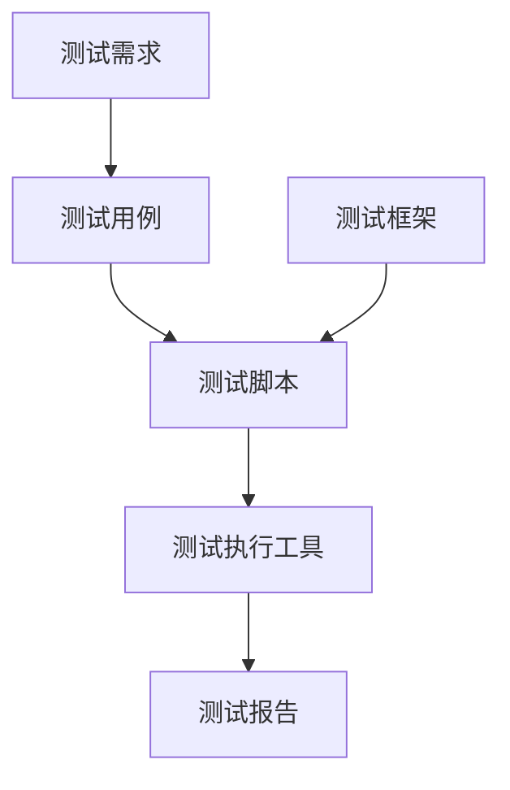

                 

 在当今快节奏的软件开发行业中，保证代码质量已经成为一项至关重要的任务。手动测试不仅耗时耗力，而且容易出现疏漏。因此，软件测试自动化成为了提高代码质量和效率的关键手段。本文将探讨软件测试自动化的核心概念、算法原理、数学模型、项目实践以及未来发展趋势。

## 关键词
- 软件测试自动化
- 代码质量
- 效率提升
- 测试框架
- 测试工具
- 测试策略

## 摘要
本文旨在阐述软件测试自动化的重要性及其在提高代码质量和效率方面的作用。通过深入分析核心概念和算法原理，结合实际项目实践，本文将帮助读者了解如何有效实施软件测试自动化，并探讨其未来的发展趋势和面临的挑战。

## 1. 背景介绍

### 1.1 软件开发现状
随着软件系统的日益复杂，软件开发的时间周期和开发难度不断增加。传统的手动测试方法已经无法满足快速迭代和高效率开发的需求。软件测试自动化应运而生，成为提高开发效率和质量的重要手段。

### 1.2 软件测试自动化的必要性
自动化测试具有以下优势：
- 提高测试效率：自动化测试可以大幅减少测试时间，提高测试覆盖率。
- 保证测试质量：自动化测试可以减少人为疏漏，提高测试准确性。
- 降低成本：自动化测试可以节省人力成本，提高资源利用效率。

## 2. 核心概念与联系

### 2.1 核心概念
- **测试自动化**：使用软件工具自动执行测试脚本的过程。
- **测试框架**：用于组织和管理自动化测试的软件架构。
- **测试工具**：用于编写和执行测试脚本的具体软件。

### 2.2 关联原理与架构


## 3. 核心算法原理 & 具体操作步骤

### 3.1 算法原理概述
自动化测试的核心在于实现测试脚本的自动化执行。这通常涉及以下步骤：

1. **测试需求分析**：明确测试目标，制定测试计划。
2. **测试用例设计**：基于需求分析，设计具体的测试用例。
3. **测试脚本编写**：使用测试工具编写自动化测试脚本。
4. **测试执行**：执行测试脚本，收集测试结果。
5. **结果分析与报告**：分析测试结果，生成测试报告。

### 3.2 算法步骤详解

#### 3.2.1 测试需求分析
- **需求评审**：确保测试需求的准确性。
- **测试策略制定**：确定测试范围和测试策略。

#### 3.2.2 测试用例设计
- **功能测试**：验证软件功能是否符合需求。
- **性能测试**：评估软件的性能指标，如响应时间、并发处理能力等。
- **安全测试**：确保软件的安全性，防止潜在的安全漏洞。

#### 3.2.3 测试脚本编写
- **选择测试工具**：根据测试需求选择合适的测试工具。
- **编写脚本**：使用测试工具的脚本语言编写测试脚本。
- **脚本调试**：确保测试脚本能够正确执行。

#### 3.2.4 测试执行
- **执行脚本**：在测试环境中运行测试脚本。
- **监控测试过程**：确保测试执行过程不受干扰。

#### 3.2.5 结果分析与报告
- **结果分析**：对比测试结果与预期结果，找出潜在问题。
- **生成报告**：总结测试结果，生成详细的测试报告。

### 3.3 算法优缺点
- **优点**：
  - 提高测试效率，缩短测试周期。
  - 保证测试质量，减少人为错误。
  - 降低测试成本，节省人力和时间资源。
- **缺点**：
  - 初始投入成本较高，需要培训测试人员。
  - 对测试脚本的质量要求较高，需要定期维护。

### 3.4 算法应用领域
自动化测试广泛应用于以下领域：
- **Web应用测试**：验证Web应用的性能和功能。
- **移动应用测试**：测试移动应用的兼容性、稳定性和性能。
- **嵌入式系统测试**：确保嵌入式系统的可靠性和稳定性。
- **持续集成/持续交付（CI/CD）**：在开发过程中自动执行测试，确保代码质量。

## 4. 数学模型和公式 & 详细讲解 & 举例说明

### 4.1 数学模型构建

自动化测试涉及以下数学模型：
- **测试覆盖率模型**：衡量测试用例覆盖代码的程度。
- **测试成本模型**：计算测试自动化带来的成本节省。

### 4.2 公式推导过程

#### 测试覆盖率模型
- **代码覆盖率（Code Coverage）**：
  $$CC = \frac{TC_{executed}}{TC_{total}}$$
  其中，$TC_{executed}$ 表示执行过的测试用例数，$TC_{total}$ 表示总测试用例数。

- **功能覆盖率（Function Coverage）**：
  $$FC = \frac{FC_{executed}}{FC_{total}}$$
  其中，$FC_{executed}$ 表示执行过的功能数，$FC_{total}$ 表示总功能数。

#### 测试成本模型
- **测试成本（Test Cost）**：
  $$TC = \frac{EC_{manual} \times CC}{EC_{manual} + EC_{auto}}$$
  其中，$EC_{manual}$ 表示手动测试的成本，$EC_{auto}$ 表示自动化测试的成本。

### 4.3 案例分析与讲解

#### 案例一：Web应用测试覆盖率
- **总测试用例数**：100
- **执行过的测试用例数**：80

  $$CC = \frac{80}{100} = 0.8$$
  测试覆盖率为80%。

#### 案例二：测试成本节省
- **手动测试成本**：1000元/小时
- **自动化测试成本**：500元/小时

  $$TC = \frac{1000 \times 0.8}{1000 + 500} = 0.4$$
  自动化测试节省了60%的成本。

## 5. 项目实践：代码实例和详细解释说明

### 5.1 开发环境搭建

在开始自动化测试之前，需要搭建合适的开发环境。以下是一个简单的环境搭建步骤：

1. **安装Python环境**：Python是一种常用的自动化测试语言。
2. **安装Selenium**：Selenium是一个开源的Web应用测试框架。
3. **配置浏览器驱动**：根据所使用的浏览器，下载相应的驱动程序。

### 5.2 源代码详细实现

以下是一个简单的自动化测试脚本，用于验证Web应用的登录功能：

```python
from selenium import webdriver
from selenium.webdriver.common.by import By
from selenium.webdriver.common.keys import Keys

# 初始化浏览器驱动
driver = webdriver.Chrome(executable_path='chromedriver')

# 访问登录页面
driver.get('https://example.com/login')

# 输入用户名和密码
username = driver.find_element(By.NAME, 'username')
username.send_keys('testuser')

password = driver.find_element(By.NAME, 'password')
password.send_keys('testpass')

# 点击登录按钮
login_button = driver.find_element(By.NAME, 'login')
login_button.click()

# 验证登录成功
assert "Welcome, testuser!" in driver.page_source
```

### 5.3 代码解读与分析

- **初始化浏览器驱动**：使用Selenium初始化Chrome浏览器。
- **访问登录页面**：使用`driver.get()`方法访问Web应用的登录页面。
- **输入用户名和密码**：使用`find_element()`方法定位用户名和密码输入框，并使用`send_keys()`方法输入相应的值。
- **点击登录按钮**：使用`find_element()`方法定位登录按钮，并使用`click()`方法点击。
- **验证登录成功**：使用`assert`语句检查页面源码中是否包含欢迎信息，验证登录是否成功。

### 5.4 运行结果展示

运行上述脚本后，浏览器将打开并自动填写用户名和密码，然后点击登录按钮。如果登录成功，页面将显示欢迎信息。否则，脚本将抛出`AssertionError`。

## 6. 实际应用场景

### 6.1 软件开发周期
在软件开发的整个周期中，测试自动化通常包括以下阶段：
- **需求分析**：确定测试需求和测试策略。
- **测试设计**：设计测试用例和测试脚本。
- **测试执行**：执行测试脚本，收集测试结果。
- **结果分析**：分析测试结果，修复缺陷。

### 6.2 持续集成与持续交付
在持续集成/持续交付（CI/CD）流程中，自动化测试是关键的一环。通过自动化测试，可以确保每次代码提交都经过严格的测试，提高软件质量。

### 6.3 跨平台测试
自动化测试可以轻松实现跨平台测试，验证软件在不同操作系统、浏览器和设备上的兼容性和性能。

## 7. 工具和资源推荐

### 7.1 学习资源推荐
- 《自动化测试实战》
- 《Selenium WebDriver实战》
- 《Python自动化测试实战》

### 7.2 开发工具推荐
- Selenium：适用于Web应用的自动化测试。
- Appium：适用于移动应用的自动化测试。
- PyTest：适用于Python语言的测试框架。

### 7.3 相关论文推荐
- "Automated Software Testing: Model, Methods, and Tools"
- "The Role of Test Automation in Software Development"
- "Test Automation and Its Impact on Software Quality"

## 8. 总结：未来发展趋势与挑战

### 8.1 研究成果总结
近年来，自动化测试技术取得了显著进展，广泛应用于各个领域。随着AI和机器学习技术的融合，自动化测试将进一步智能化和高效化。

### 8.2 未来发展趋势
- **智能化**：自动化测试将更加智能化，利用AI和机器学习技术优化测试过程。
- **云计算**：自动化测试将借助云计算平台实现更高效的资源利用和测试管理。
- **边缘计算**：随着边缘计算的兴起，自动化测试将在边缘设备上得到更广泛的应用。

### 8.3 面临的挑战
- **技术更新**：自动化测试工具和框架更新迅速，保持技术先进性是挑战。
- **人员培训**：自动化测试需要专业的技能和知识，提高测试人员的素质是关键。
- **测试数据管理**：测试数据的质量和完整性对测试结果有重要影响，如何有效管理测试数据是挑战。

### 8.4 研究展望
未来，自动化测试将在以下几个方面得到深入研究：
- **测试数据增强**：通过数据增强技术提高测试数据的多样性和覆盖性。
- **测试质量评估**：研究如何更准确地评估自动化测试的质量和效果。
- **测试智能化**：结合AI和机器学习技术，实现自动化测试的智能化和自动化。

## 9. 附录：常见问题与解答

### 9.1 自动化测试是否适用于所有项目？
自动化测试适用于大多数项目，但在以下情况下可能不太适用：
- 测试用例较少或变化频繁。
- 测试环境不稳定或不可控。
- 测试工具支持不足。

### 9.2 自动化测试与手动测试如何平衡？
自动化测试和手动测试各有优势，应根据项目特点和需求进行合理平衡。一般建议在关键功能和性能测试方面采用自动化测试，而在用户界面和用户体验测试方面采用手动测试。

### 9.3 如何选择自动化测试工具？
选择自动化测试工具时，应考虑以下因素：
- 测试需求：选择适合项目需求的测试工具。
- 支持性：选择具有良好社区支持和文档的工具。
- 可扩展性：选择可以方便扩展和集成的工具。

---

**作者：禅与计算机程序设计艺术 / Zen and the Art of Computer Programming**。

本文详细介绍了软件测试自动化的核心概念、算法原理、数学模型、项目实践以及未来发展趋势。通过本文的阐述，读者可以了解到自动化测试在提高代码质量和效率方面的关键作用，并为实际项目中的自动化测试提供指导。随着技术的不断进步，自动化测试将更加智能化和高效化，为软件开发带来更多的便利。希望本文能对读者在自动化测试领域的研究和实践提供有价值的参考。

