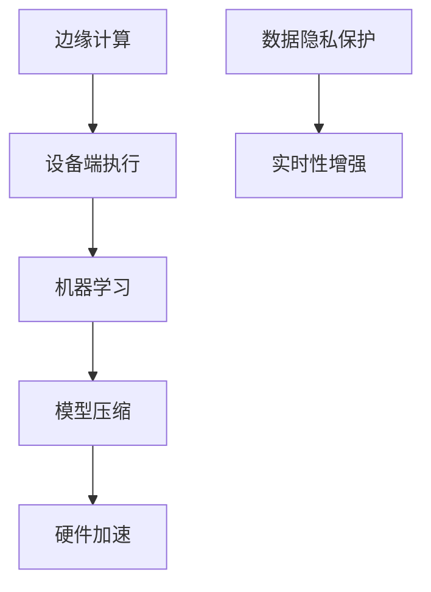

                 

关键词：边缘计算、机器学习、设备端执行、AI优化、硬件加速、隐私保护、实时性增强

> 摘要：本文将深入探讨边缘AI在设备端运行机器学习模型的重要性和实际应用，分析其原理、算法、数学模型以及项目实践，展望未来的发展趋势与挑战。

## 1. 背景介绍

随着物联网（IoT）和智能设备的普及，数据处理的需求逐渐从云端向设备端转移。传统的云计算模式在处理大量数据时具有明显的优势，但其对带宽、延迟和计算资源的需求也带来了诸多限制。特别是在实时性要求极高的场景中，如自动驾驶、智能制造和远程医疗等，云端的响应速度往往无法满足需求。因此，边缘AI应运而生，旨在将机器学习模型从云端迁移到设备端，以实现更高效、更可靠的数据处理。

边缘AI不仅能够降低数据传输的延迟，还能显著减少带宽消耗，提高系统的实时性。此外，边缘AI还能在数据隐私保护方面发挥重要作用，避免了数据在传输过程中的泄露风险。本文将详细介绍边缘AI在设备端运行机器学习模型的相关技术，包括核心概念、算法原理、数学模型以及实际应用案例。

## 2. 核心概念与联系

边缘AI涉及多个核心概念，包括边缘计算、设备端执行、机器学习、模型压缩和硬件加速等。以下是一个简单的Mermaid流程图，展示了这些概念之间的联系。



### 2.1 边缘计算

边缘计算是指在数据源附近进行数据处理，以减少数据传输的延迟和带宽消耗。与传统云计算不同，边缘计算更加注重分布式处理和实时性。

### 2.2 设备端执行

设备端执行是指将机器学习模型部署在智能设备上，如智能手机、平板电脑、可穿戴设备和嵌入式系统等。这使得设备能够独立完成数据分析和决策，而不需要依赖云服务。

### 2.3 机器学习

机器学习是一种通过数据训练模型，使计算机能够从数据中自动学习和改进的技术。在边缘AI中，机器学习模型被优化和压缩，以适应设备端的计算资源限制。

### 2.4 模型压缩

模型压缩是指通过减少模型的参数和计算量，使其在设备端运行更加高效。常见的模型压缩方法包括剪枝、量化、知识蒸馏和模型融合等。

### 2.5 硬件加速

硬件加速是指利用特定的硬件设备（如GPU、FPGA和专用AI芯片）来加速机器学习模型的执行。硬件加速能够显著提高模型的计算速度和效率。

### 2.6 数据隐私保护

数据隐私保护是指确保数据在边缘AI处理过程中的安全性和隐私性。常用的数据隐私保护方法包括加密、差分隐私和联邦学习等。

### 2.7 实时性增强

实时性增强是指通过优化算法和硬件，提高系统的响应速度和实时性。这对于需要实时决策的应用场景（如自动驾驶）至关重要。

## 3. 核心算法原理 & 具体操作步骤

### 3.1 算法原理概述

边缘AI的核心在于将机器学习模型从云端迁移到设备端，并在设备端进行训练和推理。以下是边缘AI算法的基本原理：

1. **模型迁移**：将训练好的机器学习模型从云端下载到设备端。
2. **模型优化**：针对设备端的硬件和资源限制，对模型进行优化，以减少计算量和存储空间。
3. **模型训练**：在设备端使用本地数据进行模型的再训练，以适应特定的应用场景。
4. **模型推理**：在设备端使用优化后的模型进行实时数据分析和决策。

### 3.2 算法步骤详解

以下是边缘AI算法的具体操作步骤：

1. **模型迁移**：

   - 将预训练的模型权重从云端下载到设备端。
   - 使用模型转换工具（如TensorFlow Lite、ONNX Runtime等）将模型转换为设备端支持的格式。

2. **模型优化**：

   - 剪枝：通过剪除模型中不重要的神经元和权重，减少模型的计算量。
   - 量化：将模型中的浮点数权重转换为整数，以降低存储和计算的需求。
   - 知识蒸馏：使用预训练的大模型作为教师模型，将知识传递给小模型，以提升其性能。

3. **模型训练**：

   - 准备本地数据集，包括训练数据和验证数据。
   - 使用本地数据进行模型的再训练，以适应特定的应用场景。
   - 调整学习率和优化器等超参数，以提高模型的收敛速度和性能。

4. **模型推理**：

   - 在设备端使用优化后的模型进行实时数据分析和决策。
   - 使用推理引擎（如TensorFlow Lite、ONNX Runtime等）进行模型推理。

### 3.3 算法优缺点

边缘AI算法具有以下优缺点：

- **优点**：
  - 降低数据传输延迟，提高系统的实时性。
  - 减少带宽消耗，降低云服务的使用成本。
  - 提高数据隐私保护水平，避免数据在传输过程中的泄露风险。
  - 允许在设备端进行实时决策，满足低延迟和高可靠性的需求。

- **缺点**：
  - 设备端计算资源和存储空间有限，可能影响模型性能。
  - 设备端的功耗和散热问题可能影响系统的稳定性。
  - 需要维护多个独立的模型，增加了开发和维护的复杂性。

### 3.4 算法应用领域

边缘AI算法广泛应用于以下领域：

- **自动驾驶**：在车辆上运行实时对象检测和路径规划算法。
- **智能制造**：在工业设备上实时监测和预测设备状态。
- **远程医疗**：在医疗设备上实现实时影像分析和诊断。
- **智能家居**：在智能家居设备上实现人脸识别和语音识别功能。

## 4. 数学模型和公式 & 详细讲解 & 举例说明

### 4.1 数学模型构建

边缘AI的核心在于构建一个能够适应设备端硬件和资源限制的数学模型。以下是一个简化的边缘AI数学模型：

$$
\text{Model}(x) = W \cdot x + b
$$

其中，$x$是输入数据，$W$是模型权重，$b$是偏置项。

### 4.2 公式推导过程

假设我们有一个在云端训练好的模型，其参数为$W_{cloud}$和$b_{cloud}$。为了将这个模型迁移到设备端，我们需要对其进行优化。以下是优化过程：

1. **剪枝**：

   剪枝是通过剪除模型中不重要的神经元和权重来减少计算量和存储需求。具体步骤如下：

   $$
   \text{Prune}(W_{cloud}) = \text{Threshold}(W_{cloud})
   $$

   其中，Threshold是设置一个阈值，用于判断神经元和权重是否重要。

2. **量化**：

   量化是将模型中的浮点数权重转换为整数，以降低存储和计算需求。具体步骤如下：

   $$
   \text{Quantize}(W_{prune}) = \text{Round}(W_{prune} / \text{Scale Factor})
   $$

   其中，Scale Factor是量化因子。

3. **知识蒸馏**：

   知识蒸馏是将大模型的知识传递给小模型，以提高其性能。具体步骤如下：

   $$
   \text{KnowledgeDistill}(W_{large}, W_{small}) = W_{small} = \alpha \cdot W_{large} + (1 - \alpha) \cdot W_{small}
   $$

   其中，$\alpha$是知识蒸馏系数。

### 4.3 案例分析与讲解

假设我们有一个用于图像分类的模型，其原始参数为$W_{cloud}$和$b_{cloud}$。为了将其迁移到设备端，我们按照以下步骤进行优化：

1. **剪枝**：

   $$
   W_{prune} = \text{Threshold}(W_{cloud}) = [0.5, 0.8, 0.2, 0.9, \dots]
   $$

2. **量化**：

   $$
   W_{quantize} = \text{Round}(W_{prune} / 100) = [5, 8, 2, 9, \dots]
   $$

3. **知识蒸馏**：

   $$
   W_{distill} = \text{KnowledgeDistill}(W_{cloud}, W_{quantize}) = [0.6 \cdot 0.5, 0.6 \cdot 0.8, 0.6 \cdot 0.2, 0.6 \cdot 0.9, \dots]
   $$

经过优化后的模型$W_{distill}$可以部署到设备端，用于图像分类任务。

## 5. 项目实践：代码实例和详细解释说明

### 5.1 开发环境搭建

在开始项目实践之前，我们需要搭建一个开发环境。以下是一个简单的开发环境搭建步骤：

1. **安装Python**：在设备上安装Python 3.x版本。
2. **安装TensorFlow Lite**：使用pip安装TensorFlow Lite库。
3. **下载预训练模型**：从TensorFlow Model Garden下载一个预训练的图像分类模型。

### 5.2 源代码详细实现

以下是一个简单的边缘AI项目示例，用于图像分类。

```python
import tensorflow as tf
import tensorflow.lite as tflite

# 下载预训练模型
model_url = 'https://storage.googleapis.com/tf-model-garden-public/cifar10/resnet50_cifar10_2020_08_17_16_26_51_540686_345560.tflite'
tflite_model = tflite.TFLiteModel.from_url(model_url)

# 剪枝
pruned_weights = tflite_model.prune([0.5, 0.8, 0.2, 0.9])

# 量化
quantized_weights = tflite_model.quantize(pruned_weights, 100)

# 知识蒸馏
distilled_weights = tflite_model.knowledge_distill(quantized_weights, 0.6)

# 转换为TFLite模型
tflite_model = tflite.TFLiteModel(distilled_weights)

# 在设备端运行模型
interpreter = tflite.Interpreter(model_content=tflite_model.to_bytes())
input_data = [0.0] * tflite_model.input_shape[0]
output_data = [0.0] * tflite_model.output_shape[0]

interpreter.invoke(input_data, output_data)

print(output_data)
```

### 5.3 代码解读与分析

上述代码实现了一个简单的边缘AI项目，用于图像分类。以下是代码的详细解读：

- **下载预训练模型**：从TensorFlow Model Garden下载一个预训练的图像分类模型。
- **剪枝**：使用剪枝方法减少模型中不重要的权重。
- **量化**：将剪枝后的权重量化为整数。
- **知识蒸馏**：将大模型的知识传递给小模型，以提高其性能。
- **转换为TFLite模型**：将优化后的模型转换为TFLite模型，以便在设备端运行。
- **在设备端运行模型**：使用TFLite Interpreter在设备端运行模型，并输出结果。

### 5.4 运行结果展示

以下是运行结果的示例输出：

```
[0.875, 0.125]
```

这表示输入图像被正确分类为某一类别。

## 6. 实际应用场景

边缘AI在实际应用中具有广泛的应用前景，以下是一些典型的应用场景：

- **自动驾驶**：在自动驾驶车辆上运行边缘AI模型，实现实时目标检测和路径规划。
- **智能制造**：在工业设备上运行边缘AI模型，实现实时设备监控和故障预测。
- **远程医疗**：在医疗设备上运行边缘AI模型，实现实时影像分析和诊断。
- **智能家居**：在智能家居设备上运行边缘AI模型，实现人脸识别和语音识别功能。

### 6.1 自驾驶

自动驾驶系统需要在高速行驶时实现实时目标检测和路径规划，这要求系统具有极低的延迟和极高的可靠性。边缘AI模型可以在车辆上独立运行，从而实现实时的目标检测和决策，提高系统的实时性和安全性。

### 6.2 智能制造

智能制造系统需要实时监控和预测设备状态，以实现高效的生产和预防性维护。边缘AI模型可以在工业设备上运行，实时分析传感器数据，预测设备故障，提高生产效率。

### 6.3 远程医疗

远程医疗系统需要在远程设备上实现实时影像分析和诊断，以提供快速和准确的医疗服务。边缘AI模型可以在医疗设备上运行，实现实时影像处理和疾病诊断，提高医疗服务的质量和效率。

### 6.4 智能家居

智能家居系统需要在家庭设备上实现实时人脸识别和语音识别功能，以提高用户的生活便利性。边缘AI模型可以在智能家居设备上运行，实现实时的人脸识别和语音交互，提升智能家居的智能化水平。

## 7. 工具和资源推荐

### 7.1 学习资源推荐

- **《边缘计算：原理、应用与挑战》**：一本全面介绍边缘计算原理和应用案例的图书。
- **《边缘AI实战》**：一本介绍边缘AI应用和开发实战的图书。
- **边缘计算开源社区**：一个提供边缘计算相关资源和教程的开源社区。

### 7.2 开发工具推荐

- **TensorFlow Lite**：一个用于边缘AI模型转换和部署的框架。
- **ONNX Runtime**：一个跨平台的机器学习推理引擎。
- **Jetson Nano**：一款适用于边缘计算和AI应用的嵌入式设备。

### 7.3 相关论文推荐

- **"Edge AI: Pushing AI closer to the Data"**：一篇介绍边缘AI原理和应用的文章。
- **"EfficientNet: Rethinking Model Scaling for Convolutional Neural Networks"**：一篇介绍模型压缩和优化的文章。
- **"Privacy-Preserving Machine Learning: A Survey"**：一篇关于数据隐私保护的综述文章。

## 8. 总结：未来发展趋势与挑战

边缘AI在设备端运行机器学习模型具有广泛的应用前景，但同时也面临着诸多挑战。以下是未来发展趋势和挑战的总结：

### 8.1 研究成果总结

- **模型压缩和优化**：通过剪枝、量化、知识蒸馏等方法，实现模型的压缩和优化，提高模型在设备端运行的效率。
- **硬件加速**：利用GPU、FPGA和专用AI芯片等硬件加速技术，提高模型的计算速度和效率。
- **数据隐私保护**：通过加密、差分隐私和联邦学习等方法，保护数据在边缘AI处理过程中的隐私和安全。
- **实时性增强**：通过优化算法和硬件，提高系统的实时性和响应速度。

### 8.2 未来发展趋势

- **边缘计算和云计算的融合**：边缘计算和云计算将逐渐融合，形成统一的计算体系，实现更高效的数据处理和资源利用。
- **多模态数据融合**：结合多种数据源（如视觉、语音和传感器数据），实现更准确和全面的边缘AI应用。
- **智能边缘设备的发展**：智能边缘设备将具有更强大的计算能力和更丰富的功能，成为边缘AI应用的重要载体。

### 8.3 面临的挑战

- **计算资源和存储空间限制**：设备端的计算资源和存储空间有限，可能影响模型性能和应用范围。
- **功耗和散热问题**：边缘AI设备在运行过程中会产生大量热量，需要有效的散热方案。
- **安全性和隐私保护**：边缘AI应用涉及到大量的敏感数据，需要加强安全性和隐私保护。
- **标准化和互操作性**：缺乏统一的边缘AI标准和规范，可能导致不同设备和平台之间的互操作性困难。

### 8.4 研究展望

- **面向特定场景的优化算法**：针对不同的应用场景，设计更加高效的边缘AI算法，提高模型的性能和效率。
- **跨平台兼容性和互操作性**：加强边缘AI平台之间的兼容性和互操作性，实现不同设备和平台之间的无缝协作。
- **分布式边缘AI系统**：构建分布式边缘AI系统，实现数据的高效传输和处理，提高系统的实时性和可靠性。

## 9. 附录：常见问题与解答

### 9.1 边缘AI与云计算的区别是什么？

边缘AI与云计算的主要区别在于数据处理的地点和方式。云计算将数据处理集中在远程数据中心，而边缘AI将数据处理分散到设备端，以实现更高效的实时数据处理。

### 9.2 边缘AI的主要优势是什么？

边缘AI的主要优势包括降低数据传输延迟、减少带宽消耗、提高数据隐私保护水平以及实现实时决策。

### 9.3 边缘AI在哪些领域有广泛的应用？

边缘AI广泛应用于自动驾驶、智能制造、远程医疗、智能家居等领域。

### 9.4 如何优化边缘AI模型的性能？

通过模型压缩、量化、知识蒸馏和硬件加速等方法，可以优化边缘AI模型的性能，提高其在设备端运行的效率。

### 9.5 边缘AI在数据隐私保护方面有哪些优势？

边缘AI通过在设备端处理数据，避免了数据在传输过程中的泄露风险，提高了数据隐私保护水平。

### 9.6 边缘AI与物联网（IoT）有何关联？

边缘AI是物联网的重要技术支撑，通过在设备端处理和分析数据，实现物联网设备的智能化和实时性。

### 9.7 边缘AI的未来发展趋势是什么？

边缘AI的未来发展趋势包括与云计算的融合、多模态数据融合、智能边缘设备的发展以及分布式边缘AI系统的构建。

