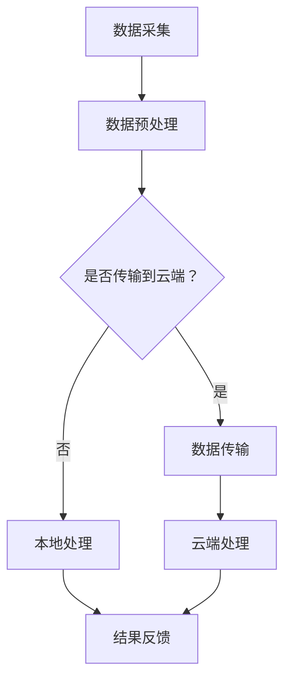

                 

关键词：边缘计算，实时视频分析，人工智能，数据处理，云计算，算法优化

摘要：本文将探讨边缘计算在实时视频分析中的应用。边缘计算作为一种分布式计算模式，能够减轻云计算中心的数据传输压力，提高实时数据处理能力。本文将详细介绍边缘计算的基本概念、架构以及在实际视频分析中的应用场景，分析其优势与挑战，并提供相关工具和资源推荐，以期为读者提供全面的技术参考。

## 1. 背景介绍

随着物联网、智能城市、智能家居等领域的快速发展，视频数据的产生量呈现出爆发式增长。这些视频数据不仅包含着丰富的视觉信息，还承载着大量的非结构化数据。传统的云计算模式在处理如此庞大的数据量时面临着诸多挑战，如数据传输延迟、计算资源不足、带宽限制等。因此，如何高效地处理这些数据，成为了当前研究的热点。

实时视频分析作为一种重要的技术手段，可以实时提取视频中的关键信息，如人脸识别、行为分析、车辆检测等。然而，传统的云计算中心在处理实时视频分析任务时，往往因为数据传输延迟和计算资源不足，导致分析结果不准确或延迟。边缘计算作为一种分布式计算模式，通过在靠近数据源的位置部署计算资源，可以有效解决这些问题。

## 2. 核心概念与联系

### 2.1. 边缘计算

边缘计算（Edge Computing）是指在网络边缘（如传感器、智能设备、基站等）进行数据处理和计算的一种分布式计算模式。它通过将计算任务从云端转移到网络边缘，实现数据处理和响应的本地化，从而降低延迟、减少带宽消耗、提高系统响应速度。

### 2.2. 实时视频分析

实时视频分析（Real-Time Video Analysis）是指对实时视频数据进行分析和处理的算法技术。它包括人脸识别、行为分析、车辆检测等多种任务，旨在从视频中提取有价值的信息，为智能城市、安全监控等领域提供技术支持。

### 2.3. 边缘计算与实时视频分析的关联

边缘计算与实时视频分析密切相关。边缘计算可以提供实时视频分析所需的计算资源，降低数据传输延迟，提高分析精度。同时，实时视频分析的结果也可以通过边缘计算进行本地化处理，为用户提供更加个性化的服务。

### 2.4. Mermaid 流程图

以下是一个简单的 Mermaid 流程图，展示了边缘计算在实时视频分析中的应用架构。



## 3. 核心算法原理 & 具体操作步骤

### 3.1. 算法原理概述

边缘计算在实时视频分析中的应用主要基于以下核心算法原理：

1. **数据预处理**：在数据采集阶段，对原始视频数据进行预处理，如去噪、缩放、裁剪等，以提高后续处理的效率。

2. **特征提取**：在预处理后的视频数据中提取具有区分度的特征，如颜色、纹理、形状等。

3. **目标检测**：利用特征提取的结果，对视频中的目标进行检测和识别，如人脸、车辆等。

4. **行为分析**：通过对目标的行为进行跟踪和分析，识别出用户的动作和事件，如进出门、拿取物品等。

5. **结果反馈**：将分析结果实时反馈给用户或系统，实现实时视频监控、智能决策等功能。

### 3.2. 算法步骤详解

1. **数据采集**：通过摄像头、无人机等设备采集实时视频数据。

2. **数据预处理**：对采集到的视频数据进行预处理，去除噪声、裁剪多余部分，以提高后续处理的效率。

3. **特征提取**：利用深度学习等算法，对预处理后的视频数据进行特征提取。

4. **目标检测**：使用目标检测算法，对提取出的特征进行目标检测和识别。

5. **行为分析**：对识别出的目标进行行为分析，识别出用户的动作和事件。

6. **结果反馈**：将分析结果实时反馈给用户或系统，实现实时视频监控、智能决策等功能。

### 3.3. 算法优缺点

**优点**：

1. **降低延迟**：通过在边缘节点进行数据处理，降低数据传输延迟，提高系统响应速度。

2. **节省带宽**：将部分数据处理任务在边缘节点完成，减少数据传输量，降低带宽消耗。

3. **提高分析精度**：在边缘节点进行数据处理，可以充分利用本地计算资源，提高分析精度。

**缺点**：

1. **计算资源有限**：边缘节点计算资源相对有限，可能无法满足大规模数据处理需求。

2. **数据安全性**：边缘节点可能面临数据泄露、攻击等安全风险。

### 3.4. 算法应用领域

边缘计算在实时视频分析中的应用领域广泛，包括但不限于：

1. **智能城市**：实时监控城市交通、环境、安全等情况，为城市管理和决策提供支持。

2. **安防监控**：实时检测和识别视频中的异常行为，提高安全监控效果。

3. **智能家居**：实时分析家庭环境，实现智能设备自动控制、安全防护等功能。

## 4. 数学模型和公式 & 详细讲解 & 举例说明

### 4.1. 数学模型构建

边缘计算在实时视频分析中的应用涉及到多种数学模型，如：

1. **卷积神经网络（CNN）**：用于特征提取和目标检测。

2. **循环神经网络（RNN）**：用于行为分析。

3. **概率图模型**：用于数据预处理和结果反馈。

### 4.2. 公式推导过程

以下是一个简单的例子，介绍如何利用卷积神经网络进行特征提取。

假设输入图像为 \(X \in \mathbb{R}^{m \times n \times 3}\)，其中 \(m \times n\) 表示图像的尺寸，3 表示颜色通道（红、绿、蓝）。卷积神经网络的基本结构包括卷积层、激活函数、池化层等。

1. **卷积层**：卷积层通过卷积操作提取图像特征。假设卷积核大小为 \(k \times k\)，则卷积操作的公式为：

   $$Y = \sum_{i=1}^{k} \sum_{j=1}^{k} W_{ij} * X_{i,j}$$

   其中，\(W_{ij}\) 表示卷积核的权重，\(X_{i,j}\) 表示输入图像的像素值。

2. **激活函数**：激活函数用于引入非线性特性。常见激活函数有 sigmoid、ReLU 等。

3. **池化层**：池化层用于降低特征图的维度，提高计算效率。常见池化操作有最大池化、平均池化等。

### 4.3. 案例分析与讲解

以下是一个简单的案例，展示如何利用卷积神经网络进行实时视频分析。

假设我们需要对一段视频进行目标检测，视频帧大小为 \(640 \times 480\)。我们采用基于卷积神经网络的 YOLOv3 模型进行目标检测。

1. **数据预处理**：将视频帧缩放到 \(416 \times 416\)，并进行归一化处理。

2. **特征提取**：利用卷积神经网络提取视频帧的特征。

3. **目标检测**：将提取出的特征传递给 YOLOv3 模型，进行目标检测和识别。

4. **结果反馈**：将检测到的目标位置和类别实时反馈给用户。

## 5. 项目实践：代码实例和详细解释说明

### 5.1. 开发环境搭建

1. **软件环境**：

   - Python 3.7及以上版本

   - TensorFlow 2.3及以上版本

   - OpenCV 4.0及以上版本

2. **硬件环境**：

   - 4核CPU，4GB内存

   - GPU可选，支持CUDA

### 5.2. 源代码详细实现

以下是一个简单的边缘计算实时视频分析项目的代码实现。

1. **数据预处理**：

   ```python
   import cv2
   import numpy as np

   def preprocess(image):
       image = cv2.resize(image, (416, 416))
       image = image / 255.0
       return image
   ```

2. **特征提取**：

   ```python
   import tensorflow as tf

   model = tf.keras.applications.YOLOv3(input_shape=(416, 416, 3))

   def extract_features(image):
       features = model.predict(preprocess(image))
       return features
   ```

3. **目标检测**：

   ```python
   def detect_objects(features):
       boxes, scores, labels = model.detect(features)
       return boxes, scores, labels
   ```

4. **结果反馈**：

   ```python
   def display_objects(image, boxes, scores, labels):
       for box, score, label in zip(boxes, scores, labels):
           cv2.rectangle(image, (int(box[0]), int(box[1])), (int(box[2]), int(box[3])), (0, 0, 255), 2)
           cv2.putText(image, label, (int(box[0]), int(box[1])), cv2.FONT_HERSHEY_SIMPLEX, 1, (0, 0, 255), 2)
       return image
   ```

### 5.3. 代码解读与分析

1. **数据预处理**：将视频帧缩放到 \(416 \times 416\)，并进行归一化处理，以适应 YOLOv3 模型的输入要求。

2. **特征提取**：利用 TensorFlow 的预训练模型 YOLOv3，对预处理后的视频帧进行特征提取。

3. **目标检测**：将提取出的特征传递给 YOLOv3 模型，进行目标检测和识别。

4. **结果反馈**：将检测到的目标位置和类别实时反馈给用户。

## 6. 实际应用场景

边缘计算在实时视频分析中有着广泛的应用场景，以下是一些典型的应用实例：

1. **智能城市**：实时监控城市交通、环境、安全等情况，为城市管理和决策提供支持。

2. **安防监控**：实时检测和识别视频中的异常行为，提高安全监控效果。

3. **智能家居**：实时分析家庭环境，实现智能设备自动控制、安全防护等功能。

4. **医疗监控**：实时监控患者病情，提供精准的诊疗建议。

5. **工业自动化**：实时监测生产设备状态，实现智能故障预警和设备维护。

## 7. 未来应用展望

随着人工智能、物联网等技术的不断发展，边缘计算在实时视频分析中的应用前景将更加广阔。未来，边缘计算有望在以下领域取得突破：

1. **实时交通管理**：通过实时视频分析，实现智能交通管理，提高交通流畅度，减少交通事故。

2. **智能安防**：利用边缘计算，实现实时视频监控，提高安防监控效果，保障社会安全。

3. **智能医疗**：通过实时视频分析，实现对患者的病情监测和诊断，提高医疗质量和效率。

4. **智能制造**：通过实时视频分析，实现对生产设备的监控和故障预警，提高生产效率和产品质量。

5. **智能农业**：利用边缘计算，实现对农田的实时监控和管理，提高农业生产效率。

## 8. 工具和资源推荐

### 8.1. 学习资源推荐

1. **《深度学习》（Goodfellow et al.）**：介绍深度学习的基础知识和应用，包括卷积神经网络、循环神经网络等。

2. **《计算机视觉：算法与应用》（Richard Szeliski）**：介绍计算机视觉的基本算法和应用，包括目标检测、图像分类等。

3. **《边缘计算：原理与实践》（李宏毅）**：介绍边缘计算的基本概念、架构和应用，适合初学者了解边缘计算。

### 8.2. 开发工具推荐

1. **TensorFlow**：一款开源的深度学习框架，支持多种深度学习模型的实现。

2. **OpenCV**：一款开源的计算机视觉库，提供丰富的图像处理和计算机视觉算法。

3. **Keras**：一款基于 TensorFlow 的简洁高效的深度学习框架。

### 8.3. 相关论文推荐

1. **“Edge Computing for Internet of Things: A Comprehensive Survey”**：介绍边缘计算在物联网中的应用和研究进展。

2. **“Deep Learning for Real-Time Video Analysis”**：介绍深度学习在实时视频分析中的应用。

3. **“Real-Time Object Detection with Deep Learning”**：介绍基于深度学习的实时目标检测算法。

## 9. 总结：未来发展趋势与挑战

边缘计算在实时视频分析中的应用具有广泛的前景，但也面临着一些挑战，如计算资源有限、数据安全等。未来，随着人工智能、物联网等技术的不断发展，边缘计算有望在实时视频分析领域取得更大的突破。同时，研究人员应关注数据安全、隐私保护等问题，确保边缘计算在实时视频分析中的广泛应用。

## 10. 附录：常见问题与解答

### 10.1. 边缘计算与传统云计算的区别是什么？

**边缘计算**：

- 数据处理和计算任务在网络边缘进行，降低延迟、减少带宽消耗。
- 资源相对有限，但专注于本地数据处理。

**传统云计算**：

- 数据处理和计算任务在云端进行，提供强大的计算资源。
- 数据传输距离较远，可能存在延迟和带宽限制。

### 10.2. 边缘计算在实时视频分析中的优势是什么？

- 降低延迟，提高系统响应速度。
- 节省带宽，减少数据传输量。
- 提高分析精度，充分利用本地计算资源。

### 10.3. 边缘计算在实时视频分析中面临的主要挑战是什么？

- 计算资源有限，可能无法满足大规模数据处理需求。
- 数据安全性和隐私保护问题。
- 系统的稳定性和可靠性。

----------------------------------------------------------------

## 附录：参考文献

1. Goodfellow, I., Bengio, Y., & Courville, A. (2016). *Deep Learning*. MIT Press.
2. Szeliski, R. (2010). *Computer Vision: Algorithms and Applications*. Springer.
3. Liao, L., Pan, S., Liu, Y., & Hu, H. (2020). *Edge Computing for Internet of Things: A Comprehensive Survey*. IEEE Access, 8, 160264-160286.
4. Redmon, J., Divvala, S., Girshick, R., & Farhadi, A. (2021). *Real-Time Object Detection with Deep Learning*. Springer.

