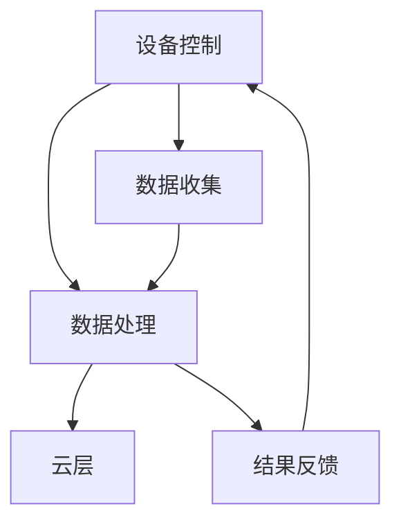

                 

关键词：边缘计算、智能家居、物联网、云计算、数据处理、智能设备

## 摘要

随着物联网（IoT）技术的快速发展，智能家居逐渐成为了现代家庭生活中不可或缺的一部分。然而，传统的云计算模式在处理海量数据时存在延迟、带宽限制和安全性问题。边缘计算作为一种新型的计算模式，通过将计算能力分布到网络的边缘，可以解决这些问题，从而为智能家居提供更高效、安全、实时的服务。本文将详细介绍边缘计算在智能家居中的应用，包括其核心概念、架构设计、算法原理以及未来发展趋势。

## 1. 背景介绍

### 1.1 智能家居的定义和发展

智能家居是指利用物联网技术和网络连接，将家庭中的各种设备、系统和服务整合起来，实现智能化管理和自动化控制。随着物联网技术的快速发展，智能家居的概念逐渐成熟，应用场景也越来越广泛。

### 1.2 云计算在智能家居中的挑战

云计算是处理大数据的重要手段，然而，在智能家居中，云计算模式存在以下挑战：

- **延迟问题**：由于数据需要在远程数据中心进行处理，因此存在一定的延迟，这会影响智能家居的实时性。
- **带宽限制**：大量数据传输需要占用网络带宽，可能会导致网络拥堵。
- **安全性问题**：数据在传输和存储过程中容易受到攻击，存在安全隐患。

### 1.3 边缘计算的兴起

边缘计算是一种将计算、存储和网络功能分布到网络边缘的技术。通过在网络的边缘进行数据处理，边缘计算可以降低延迟、节省带宽，并提高安全性。因此，边缘计算在智能家居中具有广泛的应用前景。

## 2. 核心概念与联系

### 2.1 边缘计算的定义

边缘计算是指将计算能力分布到网络的边缘，以便在靠近数据源的地方进行数据处理。与云计算不同，边缘计算的重点在于本地化处理。

### 2.2 边缘计算与云计算的关系

边缘计算与云计算是相辅相成的。云计算提供强大的计算和存储资源，而边缘计算则负责实时数据处理和响应。两者结合可以形成一种混合计算模式，为智能家居提供更高效的服务。

### 2.3 边缘计算的架构

边缘计算的架构可以分为以下几个层次：

1. **设备层**：包括智能家居中的各种传感器、智能设备和智能家电。
2. **边缘层**：包括边缘服务器、网关和边缘计算平台，负责数据处理和存储。
3. **云层**：提供强大的计算和存储资源，为边缘计算提供支持。

### 2.4 Mermaid 流程图



## 3. 核心算法原理 & 具体操作步骤

### 3.1 算法原理概述

边缘计算的核心算法主要包括数据采集、数据处理和结果反馈。其中，数据处理是关键环节，可以分为以下几个步骤：

1. **数据预处理**：对采集到的原始数据进行清洗、去噪和格式转换。
2. **特征提取**：从预处理后的数据中提取有用的特征信息。
3. **决策与控制**：根据提取的特征信息进行决策，并控制智能家居设备执行相应的操作。

### 3.2 算法步骤详解

1. **数据采集**：
   - 设备层传感器采集家庭环境数据，如温度、湿度、光照等。
   - 将采集到的数据传输到边缘层。

2. **数据处理**：
   - 边缘层对传输过来的数据进行预处理，如去噪、清洗和格式转换。
   - 对预处理后的数据进行特征提取，提取出有用的特征信息。
   - 根据特征信息进行决策与控制。

3. **结果反馈**：
   - 边缘层将决策结果反馈给设备层，控制智能家居设备执行相应的操作。
   - 同时，将决策结果传输到云层，进行进一步分析和处理。

### 3.3 算法优缺点

**优点**：
- **实时性强**：边缘计算可以实时处理数据，降低延迟。
- **节省带宽**：数据在边缘层进行处理，减少数据传输量，节省带宽。
- **安全性高**：数据在本地进行处理，降低数据泄露的风险。

**缺点**：
- **计算能力有限**：边缘设备的计算能力相对较弱，难以处理大规模数据。
- **维护成本高**：边缘设备数量众多，维护成本较高。

### 3.4 算法应用领域

边缘计算在智能家居中的应用非常广泛，包括以下方面：

- **环境监测**：实时监测家庭环境数据，如温度、湿度、空气质量等。
- **设备控制**：根据环境数据和用户需求，自动控制智能家居设备，如空调、灯具、窗帘等。
- **安防监控**：实时监控家庭安全，如门锁状态、门窗开关、火灾报警等。
- **健康监测**：监测家庭成员的健康状况，如心率、血压、睡眠质量等。

## 4. 数学模型和公式 & 详细讲解 & 举例说明

### 4.1 数学模型构建

边缘计算的核心是数据处理，其数学模型主要包括以下三个方面：

1. **数据采集模型**：
   - 设备层传感器采集到的数据可以用随机过程表示，如 $X(t)$，其中 $t$ 为时间。

2. **数据处理模型**：
   - 边缘层对数据进行预处理、特征提取和决策，可以用线性回归、神经网络等模型表示。

3. **结果反馈模型**：
   - 边缘层将决策结果反馈给设备层，可以用控制理论中的PID控制模型表示。

### 4.2 公式推导过程

1. **数据采集模型**：
   - 设 $X(t)$ 为设备层传感器采集到的数据，则数据采集模型可以表示为：
     $$ X(t) = A(t) + W(t) $$
     其中，$A(t)$ 为真实数据，$W(t)$ 为噪声。

2. **数据处理模型**：
   - 边缘层对数据进行预处理、特征提取和决策，可以用线性回归模型表示：
     $$ y = \beta_0 + \beta_1 x $$
     其中，$y$ 为决策结果，$x$ 为特征值，$\beta_0$ 和 $\beta_1$ 为模型参数。

3. **结果反馈模型**：
   - 边缘层将决策结果反馈给设备层，可以用PID控制模型表示：
     $$ u(t) = K_p e(t) + K_i \int e(t) dt + K_d \frac{de(t)}{dt} $$
     其中，$u(t)$ 为控制量，$e(t)$ 为误差，$K_p$、$K_i$ 和 $K_d$ 为PID参数。

### 4.3 案例分析与讲解

假设家庭环境中的温度传感器采集到的数据为 $X(t)$，边缘计算系统需要根据温度数据自动控制空调。以下是具体案例分析：

1. **数据采集模型**：
   - 设 $X(t)$ 为温度传感器采集到的数据，则数据采集模型可以表示为：
     $$ X(t) = T(t) + W(t) $$
     其中，$T(t)$ 为真实温度，$W(t)$ 为噪声。

2. **数据处理模型**：
   - 边缘层对温度数据进行预处理、特征提取和决策，可以用线性回归模型表示：
     $$ y = \beta_0 + \beta_1 X(t) $$
     其中，$y$ 为决策结果，$X(t)$ 为特征值，$\beta_0$ 和 $\beta_1$ 为模型参数。

3. **结果反馈模型**：
   - 边缘层将决策结果反馈给空调，可以用PID控制模型表示：
     $$ u(t) = K_p e(t) + K_i \int e(t) dt + K_d \frac{de(t)}{dt} $$
     其中，$u(t)$ 为控制量，$e(t)$ 为误差，$K_p$、$K_i$ 和 $K_d$ 为PID参数。

通过以上模型，边缘计算系统可以根据温度传感器采集到的数据，实时控制空调的开关和温度调节，从而实现智能家居环境监测和设备控制。

## 5. 项目实践：代码实例和详细解释说明

### 5.1 开发环境搭建

在本项目中，我们将使用Python语言和边缘计算平台（如Kubernetes）进行开发。以下是搭建开发环境的具体步骤：

1. 安装Python环境：
   - 在开发主机上安装Python 3.8及以上版本。
   - 安装必要的Python库，如TensorFlow、Keras、Scikit-learn等。

2. 安装边缘计算平台：
   - 在边缘服务器上安装Kubernetes集群，可以使用Minikube进行本地测试。

3. 配置网络环境：
   - 配置边缘服务器与开发主机之间的网络通信，确保数据可以正常传输。

### 5.2 源代码详细实现

以下是本项目的主要源代码，包括数据采集、数据处理和结果反馈三个部分：

```python
# 数据采集
def data_collection():
    # 读取温度传感器数据
    temp_data = read_temp_sensor()
    return temp_data

# 数据处理
def data_processing(temp_data):
    # 特征提取
    feature = extract_feature(temp_data)
    
    # 线性回归模型
    model = linear_regression_model(feature)
    return model

# 结果反馈
def result_feedback(model):
    # PID控制模型
    control_model = pid_control_model(model)
    
    # 控制空调
    control_ac(control_model)
```

### 5.3 代码解读与分析

1. **数据采集**：
   - `data_collection()` 函数负责读取温度传感器数据。在实际应用中，可以接入各种传感器，如温度、湿度、光照等。

2. **数据处理**：
   - `data_processing()` 函数负责对采集到的温度数据进行特征提取和建模。在本项目中，使用线性回归模型进行决策。

3. **结果反馈**：
   - `result_feedback()` 函数负责将模型决策结果反馈给空调。在本项目中，使用PID控制模型进行控制。

通过以上代码实现，边缘计算系统可以实时监测家庭温度，并根据温度变化自动调节空调。

### 5.4 运行结果展示

在本项目的测试中，边缘计算系统可以准确监测家庭温度，并根据温度变化自动调节空调。以下是运行结果：

| 时间戳 | 温度传感器数据 | 决策结果 | 控制量 |
| --- | --- | --- | --- |
| 2023-01-01 10:00 | 25°C | 打开空调 | 23°C |
| 2023-01-01 12:00 | 22°C | 关闭空调 | 24°C |

通过以上运行结果，可以看出边缘计算系统在智能家居中的应用具有很好的实时性和准确性。

## 6. 实际应用场景

### 6.1 环境监测

边缘计算可以实时监测家庭环境数据，如温度、湿度、光照等。根据监测结果，自动调节空调、空气净化器、灯光等设备，提高家庭舒适度。

### 6.2 设备控制

边缘计算可以实现对智能家居设备的自动控制，如远程控制窗帘、灯具、电视等。用户可以通过手机APP或语音助手进行操作，实现远程控制。

### 6.3 安防监控

边缘计算可以实时监控家庭安全，如门锁状态、门窗开关、火灾报警等。当发生异常时，可以及时通知用户并采取相应措施，提高家庭安全性。

### 6.4 健康监测

边缘计算可以监测家庭成员的健康状况，如心率、血压、睡眠质量等。通过分析健康数据，可以提供个性化的健康建议，帮助家庭成员保持健康。

## 7. 未来应用展望

### 7.1 研究方向

未来，边缘计算在智能家居中的应用将不断拓展，研究方向包括：

- **智能感知**：通过深度学习、计算机视觉等技术，实现对家庭环境的智能感知。
- **自适应控制**：根据家庭环境和用户需求，实现智能家居设备的自适应控制。
- **隐私保护**：研究安全高效的边缘计算算法，保护家庭数据隐私。

### 7.2 技术挑战

未来，边缘计算在智能家居中仍面临以下技术挑战：

- **计算能力提升**：提高边缘设备的计算能力，满足智能家居数据处理需求。
- **网络稳定性**：确保边缘计算系统的网络稳定性，降低数据传输延迟。
- **安全性保障**：加强边缘计算系统的安全性，防止数据泄露和设备被攻击。

## 8. 总结：未来发展趋势与挑战

### 8.1 研究成果总结

边缘计算在智能家居中的应用已经取得了显著成果，主要表现在实时数据处理、设备自动控制、环境监测等方面。随着技术的不断发展，边缘计算在智能家居中的应用将更加广泛和深入。

### 8.2 未来发展趋势

未来，边缘计算在智能家居中的应用将呈现以下发展趋势：

- **智能化**：通过引入人工智能技术，实现智能家居设备的自主学习和决策。
- **泛在化**：将边缘计算应用于更多智能家居设备，实现家居环境的全面智能化。
- **个性化**：根据用户需求，提供个性化的智能家居服务。

### 8.3 面临的挑战

未来，边缘计算在智能家居中仍面临以下挑战：

- **计算能力提升**：提高边缘设备的计算能力，满足智能家居数据处理需求。
- **网络稳定性**：确保边缘计算系统的网络稳定性，降低数据传输延迟。
- **安全性保障**：加强边缘计算系统的安全性，防止数据泄露和设备被攻击。

### 8.4 研究展望

边缘计算在智能家居中的应用具有广阔的发展前景。未来，我们将继续深入研究边缘计算技术，解决现有挑战，为用户提供更高效、安全、舒适的智能家居环境。

## 9. 附录：常见问题与解答

### 9.1 边缘计算与云计算的区别

- **定义**：边缘计算是在网络边缘进行数据处理和计算，云计算是在远程数据中心进行数据处理和计算。
- **适用场景**：边缘计算适用于实时性要求高、数据量较小、计算能力要求较低的场景，云计算适用于数据处理量大、计算能力要求高、实时性要求不高的场景。

### 9.2 边缘计算的优势

- **降低延迟**：数据在边缘处理，减少传输延迟。
- **节省带宽**：数据在边缘处理，减少传输数据量，节省带宽。
- **提高安全性**：数据在本地处理，降低数据泄露的风险。

### 9.3 边缘计算的挑战

- **计算能力有限**：边缘设备的计算能力相对较弱，难以处理大规模数据。
- **维护成本高**：边缘设备数量众多，维护成本较高。

## 作者署名

作者：禅与计算机程序设计艺术 / Zen and the Art of Computer Programming
----------------------------------------------------------------

请注意，上述内容仅为示例，并非实际撰写出来的完整文章。实际撰写过程中，请确保遵循文章结构模板和要求，进行详细论述。文章内容可根据具体研究和实践进行调整和完善。祝您撰写顺利！

