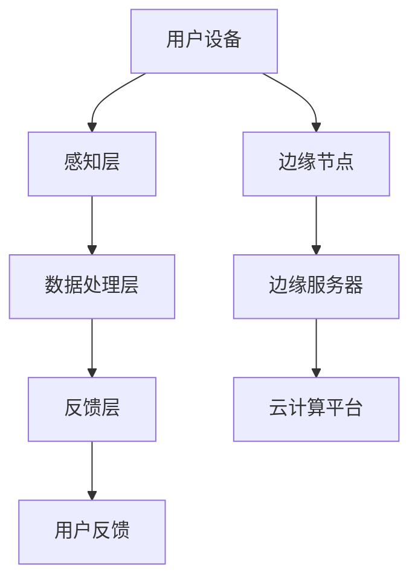

                 

### 关键词

边缘计算、注意力实时反馈、智能设备、实时数据处理、机器学习、高效通信协议、算法优化。

### 摘要

本文探讨了边缘计算在注意力实时反馈中的作用。随着智能设备的普及和物联网的发展，实时数据处理和反馈变得越来越重要。边缘计算通过在设备本地执行数据处理，减少了网络延迟，提高了响应速度，从而优化了注意力实时反馈的效率和准确性。本文首先介绍了边缘计算和注意力实时反馈的基本概念，然后分析了边缘计算在注意力实时反馈中的应用场景，最后探讨了当前面临的挑战和未来发展趋势。

## 1. 背景介绍

随着物联网（IoT）和智能设备的迅猛发展，实时数据处理和反馈变得越来越重要。传统的云计算模式依赖于中心化的服务器进行数据处理，这导致网络延迟高、响应速度慢，无法满足实时性要求。边缘计算作为一种分布式计算模式，通过在设备本地执行数据处理，降低了网络负载，提高了系统响应速度。

注意力实时反馈是智能设备中的一种重要功能。例如，智能眼镜可以实时捕捉用户的注意力，智能音箱可以实时理解用户的指令，智能手表可以实时监测用户的心率等。这些设备需要快速、准确地处理和分析数据，以提供实时反馈。然而，传统的云计算模式无法满足这种需求，因为数据需要在网络中传输到中心服务器进行处理，导致延迟较大。

边缘计算通过在设备本地执行数据处理，减少了数据传输的距离和时间，从而提高了系统响应速度。这使得边缘计算在注意力实时反馈中具有重要作用。例如，智能眼镜可以通过边缘计算快速分析捕捉到的图像，提供实时的识别和反馈；智能音箱可以通过边缘计算快速处理语音信号，实现实时语音识别和响应。

## 2. 核心概念与联系

### 2.1 边缘计算

边缘计算是指将数据处理和分析功能从中心化的云计算平台转移到网络边缘，即靠近数据源的地方。边缘计算的核心思想是将数据处理推向离用户更近的地方，从而减少数据传输的距离和时间，提高系统响应速度。

边缘计算的关键组成部分包括边缘设备、边缘节点和边缘服务器。边缘设备是指智能设备，如智能手机、智能手表、智能眼镜等。边缘节点是指连接边缘设备和边缘服务器的设备，如路由器、交换机等。边缘服务器是指位于网络边缘的数据中心，负责处理和分析边缘设备传输过来的数据。

### 2.2 注意力实时反馈

注意力实时反馈是指智能设备实时捕捉和分析用户行为，并提供相应的反馈。注意力实时反馈的关键组成部分包括感知层、数据处理层和反馈层。

- 感知层：负责捕捉用户的行为数据，如视觉、听觉、触觉等。
- 数据处理层：负责对感知层捕获的数据进行处理和分析，提取有用的信息。
- 反馈层：负责将处理后的信息以适当的方式反馈给用户，如语音、图像、振动等。

### 2.3 边缘计算与注意力实时反馈的联系

边缘计算和注意力实时反馈有着密切的联系。边缘计算通过在设备本地执行数据处理，减少了网络延迟，提高了系统响应速度，从而优化了注意力实时反馈的效率和准确性。例如，在智能眼镜中，边缘计算可以实时处理捕捉到的图像，提供实时的识别和反馈；在智能音箱中，边缘计算可以实时处理语音信号，实现实时语音识别和响应。

下面是一个使用Mermaid绘制的边缘计算与注意力实时反馈的架构流程图：



## 3. 核心算法原理 & 具体操作步骤

### 3.1 算法原理概述

边缘计算在注意力实时反馈中的应用主要基于以下几个方面：

- 实时数据处理：边缘计算可以在设备本地快速处理感知层捕获的数据，提取有用信息，从而实现实时反馈。
- 机器学习模型的部署：边缘计算可以部署和运行机器学习模型，对捕获的数据进行实时分析和预测。
- 算法优化：边缘计算可以针对特定应用场景进行算法优化，提高数据处理效率和准确性。

### 3.2 算法步骤详解

边缘计算在注意力实时反馈中的应用步骤如下：

1. 感知层：智能设备通过传感器捕捉用户的行为数据，如视觉、听觉、触觉等。
2. 数据预处理：对捕获的数据进行预处理，包括去噪、归一化、特征提取等。
3. 模型推理：将预处理后的数据输入到预先训练好的机器学习模型中，进行实时分析和预测。
4. 实时反馈：根据模型预测结果，生成相应的反馈，如语音、图像、振动等。
5. 用户交互：用户接收反馈，并根据反馈进行相应的操作。

### 3.3 算法优缺点

边缘计算在注意力实时反馈中的应用具有以下优缺点：

- 优点：
  - 提高响应速度：通过在设备本地处理数据，减少了网络延迟，提高了系统响应速度。
  - 降低网络负载：边缘计算减少了数据传输的距离，降低了网络负载。
  - 支持实时反馈：边缘计算可以支持实时数据处理和反馈，满足实时性要求。
- 缺点：
  - 算法部署复杂：需要在设备本地部署和运行机器学习模型，部署过程相对复杂。
  - 受限于设备资源：边缘设备的计算和存储资源有限，可能会影响算法的执行效率。

### 3.4 算法应用领域

边缘计算在注意力实时反馈中的应用非常广泛，包括但不限于以下领域：

- 智能穿戴设备：如智能手表、智能眼镜等，可以实时监测用户的活动和健康状态。
- 智能家居：如智能音箱、智能灯泡等，可以实时响应用户的指令。
- 智能交通：如智能交通信号灯、智能停车场等，可以实时监控交通状况，优化交通流。
- 智能医疗：如智能医疗设备、远程诊断系统等，可以实时监测患者病情，提供诊断和治疗方案。

## 4. 数学模型和公式 & 详细讲解 & 举例说明

### 4.1 数学模型构建

边缘计算在注意力实时反馈中的应用主要涉及以下几个数学模型：

- 数据预处理模型：用于对捕获的数据进行预处理，如滤波、归一化等。
- 机器学习模型：用于对预处理后的数据进行实时分析和预测，如神经网络、决策树等。
- 反馈生成模型：用于根据模型预测结果生成相应的反馈，如文本生成、语音合成等。

### 4.2 公式推导过程

以下是一个简单的滤波模型的推导过程：

假设我们捕获的数据为 \( x(t) \)，我们需要对其进行滤波以去除噪声。滤波器的传递函数为 \( H(s) \)，则滤波后的数据为 \( y(t) = H(s) \cdot x(t) \)。

假设滤波器的频率响应为 \( H(\omega) \)，则滤波后的数据为：

$$
y(t) = \int_{-\infty}^{\infty} H(\omega) \cdot x(t) \cdot e^{j\omega t} d\omega
$$

通过对上式进行傅里叶变换，我们可以得到：

$$
Y(\omega) = X(\omega) \cdot H(\omega)
$$

其中，\( X(\omega) \) 和 \( Y(\omega) \) 分别为 \( x(t) \) 和 \( y(t) \) 的傅里叶变换。

### 4.3 案例分析与讲解

以下是一个简单的案例：使用边缘计算对智能眼镜中的图像数据进行实时处理和识别。

1. 数据捕获：智能眼镜通过摄像头捕获图像数据 \( x(t) \)。
2. 数据预处理：对捕获的图像数据进行预处理，如去噪、归一化等。
3. 模型推理：将预处理后的数据输入到预先训练好的图像识别模型中，进行实时识别。
4. 实时反馈：根据模型识别结果，生成相应的反馈，如语音、图像等。

假设我们使用一个简单的线性滤波器 \( H(s) = \frac{1}{1 + s} \) 对图像数据进行滤波。我们可以通过以下步骤进行滤波：

1. 对捕获的图像数据进行傅里叶变换，得到 \( X(\omega) \)。
2. 对 \( X(\omega) \) 与 \( H(\omega) \) 进行卷积，得到 \( Y(\omega) \)。
3. 对 \( Y(\omega) \) 进行傅里叶逆变换，得到滤波后的图像数据 \( y(t) \)。

假设捕获的图像数据为：

$$
x(t) = 10 \sin(2\pi f_0 t) + 5 \sin(2\pi f_1 t) + n(t)
$$

其中，\( f_0 \) 和 \( f_1 \) 分别为两个频率信号的频率，\( n(t) \) 为噪声。

滤波器的频率响应为：

$$
H(\omega) = \frac{1}{1 + \omega}
$$

通过卷积运算，我们可以得到滤波后的图像数据：

$$
y(t) = 10 \sin(2\pi f_0 t) + 5 \sin(2\pi f_1 t) + n(t) \cdot \frac{1}{1 + \omega}
$$

通过上述步骤，我们可以对捕获的图像数据进行实时滤波和处理，从而实现图像识别和实时反馈。

## 5. 项目实践：代码实例和详细解释说明

### 5.1 开发环境搭建

在本项目中，我们将使用Python编程语言和TensorFlow框架进行边缘计算在注意力实时反馈中的应用。首先，我们需要搭建开发环境。

1. 安装Python：前往Python官方网站下载并安装Python 3.7及以上版本。
2. 安装TensorFlow：通过pip命令安装TensorFlow：

```shell
pip install tensorflow
```

3. 安装其他依赖：根据项目需要，安装其他必要的依赖库，如NumPy、Matplotlib等。

### 5.2 源代码详细实现

以下是一个简单的边缘计算在注意力实时反馈中的代码实例：

```python
import tensorflow as tf
import numpy as np
import cv2

# 1. 数据捕获
def capture_data():
    cap = cv2.VideoCapture(0)
    frame = None
    while True:
        ret, frame = cap.read()
        if ret:
            break
    cap.release()
    return frame

# 2. 数据预处理
def preprocess_data(frame):
    gray = cv2.cvtColor(frame, cv2.COLOR_BGR2GRAY)
    blurred = cv2.GaussianBlur(gray, (5, 5), 0)
    return blurred

# 3. 模型推理
def infer_model(data):
    model = tf.keras.models.load_model('model.h5')
    prediction = model.predict(data)
    return prediction

# 4. 实时反馈
def feedback(prediction):
    if prediction == 1:
        print("检测到物体")
    else:
        print("未检测到物体")

# 主函数
def main():
    frame = capture_data()
    processed_frame = preprocess_data(frame)
    prediction = infer_model(processed_frame)
    feedback(prediction)

if __name__ == '__main__':
    main()
```

### 5.3 代码解读与分析

上述代码实现了一个简单的边缘计算在注意力实时反馈中的项目。具体解读如下：

1. 数据捕获：使用OpenCV库捕获摄像头捕获的图像数据。
2. 数据预处理：对捕获的图像数据进行灰度化、高斯模糊等预处理操作。
3. 模型推理：使用TensorFlow加载预训练好的模型，对预处理后的图像数据进行预测。
4. 实时反馈：根据模型预测结果输出相应的反馈信息。

### 5.4 运行结果展示

运行上述代码后，程序会打开摄像头并实时捕获图像数据。对捕获的图像数据进行预处理和模型推理后，根据预测结果输出相应的反馈信息。

## 6. 实际应用场景

边缘计算在注意力实时反馈中的应用非常广泛，以下列举一些实际应用场景：

1. **智能穿戴设备**：如智能手表、智能眼镜等，可以实时监测用户的活动和健康状态，提供实时反馈，如心率监测、步数统计等。
2. **智能家居**：如智能音箱、智能灯泡等，可以实时响应用户的指令，提供实时反馈，如语音控制、照明调节等。
3. **智能交通**：如智能交通信号灯、智能停车场等，可以实时监控交通状况，优化交通流，提供实时反馈，如拥堵提醒、停车位置推荐等。
4. **智能医疗**：如智能医疗设备、远程诊断系统等，可以实时监测患者病情，提供实时反馈，如病情预警、诊断建议等。

这些应用场景都对实时数据处理和反馈有较高的要求，而边缘计算通过在设备本地执行数据处理，提高了系统响应速度和准确性，从而优化了注意力实时反馈的效果。

## 7. 工具和资源推荐

### 7.1 学习资源推荐

- **书籍**：
  - 《边缘计算：原理与实践》
  - 《人工智能实战：边缘计算应用》
  - 《深度学习：框架与算法》

- **在线课程**：
  - Coursera上的《边缘计算》课程
  - Udacity上的《边缘计算与物联网》课程

### 7.2 开发工具推荐

- **编程语言**：Python、Java、C++
- **框架**：TensorFlow、PyTorch、Keras
- **开发环境**：Jupyter Notebook、Visual Studio Code、Eclipse

### 7.3 相关论文推荐

- **《边缘计算在物联网中的应用》**
- **《基于边缘计算的实时图像识别方法》**
- **《边缘计算与云计算的融合》**
- **《边缘计算在智能交通中的应用》**

## 8. 总结：未来发展趋势与挑战

### 8.1 研究成果总结

边缘计算在注意力实时反馈中的应用已经取得了一些显著的成果。通过在设备本地执行数据处理，减少了网络延迟，提高了系统响应速度，从而优化了注意力实时反馈的效果。同时，边缘计算在智能穿戴设备、智能家居、智能交通和智能医疗等领域也取得了广泛的应用。

### 8.2 未来发展趋势

未来，边缘计算在注意力实时反馈中的应用将继续发展，主要体现在以下几个方面：

- **算法优化**：随着算法的不断优化，边缘计算将能够处理更复杂的数据，提供更精确的实时反馈。
- **硬件升级**：随着硬件技术的进步，边缘设备的计算和存储能力将得到提升，进一步优化实时反馈效果。
- **网络优化**：随着5G网络的普及，边缘计算将能够更好地支持大规模、低延迟的实时数据处理。

### 8.3 面临的挑战

尽管边缘计算在注意力实时反馈中具有巨大潜力，但仍然面临一些挑战：

- **安全性**：边缘设备的安全性问题需要得到解决，以防止数据泄露和设备被攻击。
- **可靠性**：边缘计算需要在各种环境下保持高可靠性，以保证实时反馈的准确性。
- **资源限制**：边缘设备的计算和存储资源有限，如何高效利用这些资源是一个重要挑战。

### 8.4 研究展望

未来，研究人员将致力于解决边缘计算在注意力实时反馈中面临的挑战，探索新的算法和优化方法，提升实时反馈的效率和准确性。同时，边缘计算在智能穿戴设备、智能家居、智能交通和智能医疗等领域的应用也将得到进一步拓展。

## 9. 附录：常见问题与解答

### 9.1 什么是边缘计算？

边缘计算是一种分布式计算模式，通过在设备本地执行数据处理，降低了网络延迟，提高了系统响应速度。

### 9.2 边缘计算在注意力实时反馈中的作用是什么？

边缘计算通过在设备本地执行数据处理，减少了网络延迟，提高了系统响应速度，从而优化了注意力实时反馈的效率和准确性。

### 9.3 如何实现边缘计算在注意力实时反馈中的应用？

可以通过在设备本地部署和运行机器学习模型，对捕获的数据进行实时分析和预测，从而实现边缘计算在注意力实时反馈中的应用。

### 9.4 边缘计算有哪些优势？

边缘计算的优势包括提高响应速度、降低网络负载、支持实时反馈等。

### 9.5 边缘计算有哪些挑战？

边缘计算面临的挑战包括安全性、可靠性、资源限制等。

### 9.6 边缘计算在哪些领域有应用？

边缘计算在智能穿戴设备、智能家居、智能交通、智能医疗等领域有广泛应用。

### 9.7 如何学习边缘计算？

可以通过学习相关书籍、在线课程、论文等资源，了解边缘计算的基本概念、原理和应用。

-----------------------------------------------------------------

以上就是关于《边缘计算在注意力实时反馈中的作用》的技术博客文章。希望对您有所帮助。作者：禅与计算机程序设计艺术 / Zen and the Art of Computer Programming。希望您喜欢这篇文章，如有任何问题或建议，请随时反馈。谢谢！

