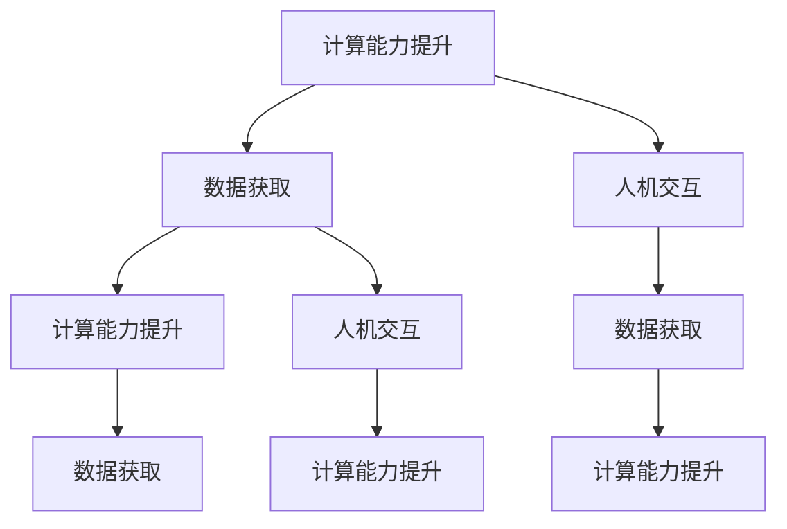
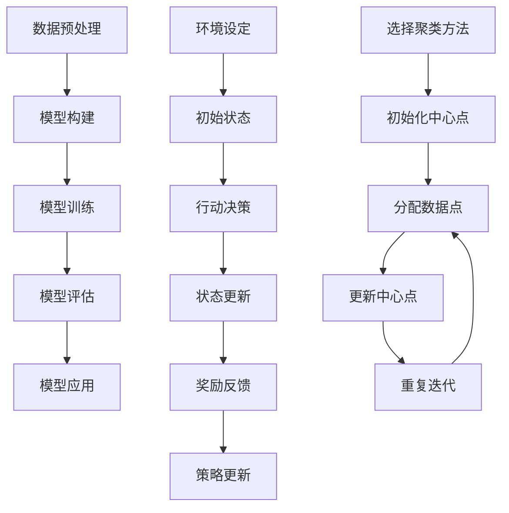

                 

关键词：人工智能、计算能力、技能发展、未来趋势、技术挑战

> 摘要：随着人工智能技术的迅猛发展，人类计算时代的技能需求发生了深刻变革。本文将探讨未来计算领域的关键技能需求，分析现有技能的不足，并提出应对未来挑战的建议。

## 1. 背景介绍

### 1.1 人工智能的崛起

人工智能（Artificial Intelligence，AI）作为计算机科学的一个重要分支，近年来取得了惊人的进展。从最初的规则基础系统，到现在的深度学习和神经网络，AI 已经在语音识别、图像处理、自然语言处理等领域取得了显著的成果。随着计算能力的不断提升，人工智能的应用范围不断扩大，从智能家居、自动驾驶，到医疗诊断、金融分析，都离不开 AI 的支持。

### 1.2 人类计算时代的到来

人类计算时代，是指人工智能与人类智慧深度融合的时代。在这个时代，计算不再是少数技术精英的专属，而是成为每个人日常生活中不可或缺的一部分。人们可以通过智能手机、智能音箱等设备，随时随地与智能系统进行交互，获取信息、解决问题。这种计算模式的转变，对人类的技能需求提出了新的挑战。

## 2. 核心概念与联系

### 2.1 计算能力的提升

计算能力的提升是推动人工智能发展的关键因素。随着处理器性能的提升、存储技术的进步以及网络带宽的增加，计算机的处理速度和存储能力得到了极大的提高。这使得复杂的计算任务得以在短时间内完成，为人工智能的发展提供了强有力的支持。

### 2.2 数据的获取与利用

在人类计算时代，数据的获取与利用变得尤为重要。数据是人工智能的基石，只有拥有足够的数据量，才能训练出性能更优的模型。同时，数据的多样化、海量化也为人工智能的发展带来了新的机遇。通过对数据的深度挖掘和分析，可以揭示出隐藏在数据背后的规律和趋势，为决策提供科学依据。

### 2.3 人机交互的优化

人机交互是连接人类与人工智能的桥梁。随着计算能力的提升，人机交互的方式也在不断优化。从最初的命令行界面，到图形用户界面（GUI），再到如今的语音交互、手势识别，人机交互变得更加直观、自然。未来，人机交互将继续朝着智能化、个性化的方向发展，使人工智能更好地服务于人类。

## 3. 核心算法原理 & 具体操作步骤

### 3.1 算法原理概述

人工智能的核心在于算法，而算法的核心在于数学。深度学习、强化学习、迁移学习等算法，都是基于数学原理构建的。这些算法通过对大量数据的训练，可以自动学习出数据中的规律和模式，从而实现对未知数据的预测和分类。

### 3.2 算法步骤详解

以深度学习为例，其基本步骤包括：

1. 数据预处理：对原始数据进行清洗、归一化等处理，使其适合模型训练。
2. 模型构建：根据任务需求，设计合适的神经网络结构。
3. 模型训练：通过反向传播算法，不断调整模型参数，使模型能够更好地拟合训练数据。
4. 模型评估：使用测试数据对模型进行评估，判断其性能是否满足要求。
5. 模型应用：将训练好的模型应用于实际任务，如图像识别、语音识别等。

### 3.3 算法优缺点

深度学习算法具有强大的学习和泛化能力，能够处理复杂的任务。但其缺点是训练过程需要大量的数据和时间，对计算资源的要求较高。此外，深度学习模型的可解释性较差，难以理解模型决策的依据。

### 3.4 算法应用领域

深度学习算法在计算机视觉、自然语言处理、语音识别等领域都有广泛应用。例如，在计算机视觉领域，深度学习算法可以用于图像分类、目标检测、图像生成等任务；在自然语言处理领域，深度学习算法可以用于文本分类、机器翻译、情感分析等任务。

## 4. 数学模型和公式 & 详细讲解 & 举例说明

### 4.1 数学模型构建

在人工智能中，数学模型扮演着至关重要的角色。以深度学习为例，其核心是神经网络。神经网络是一种基于数学原理的模型，通过模拟人脑神经元之间的连接，实现数据的处理和预测。

### 4.2 公式推导过程

神经网络的激活函数是神经网络的核心组成部分。常见的激活函数有 sigmoid 函数、ReLU 函数等。下面以 sigmoid 函数为例，介绍其推导过程。

$$
sigmoid(x) = \frac{1}{1 + e^{-x}}
$$

### 4.3 案例分析与讲解

以图像分类任务为例，使用深度学习算法进行模型训练。假设我们有一个包含 1000 个类别的图像数据集，我们希望训练一个模型，能够准确地将图像分类到对应的类别。

1. 数据预处理：将图像数据缩放到统一的尺寸，并进行归一化处理。
2. 模型构建：设计一个包含多个隐藏层的卷积神经网络（CNN）。
3. 模型训练：通过反向传播算法，不断调整模型参数，使模型能够更好地拟合训练数据。
4. 模型评估：使用测试数据对模型进行评估，计算模型在测试数据上的准确率。
5. 模型应用：将训练好的模型应用于实际任务，如图像识别、目标检测等。

## 5. 项目实践：代码实例和详细解释说明

### 5.1 开发环境搭建

为了完成一个简单的图像分类项目，我们需要搭建一个开发环境。这里以 Python 为例，介绍开发环境的搭建过程。

1. 安装 Python：从官方网站（https://www.python.org/）下载 Python 安装包，并按照提示安装。
2. 安装深度学习框架：使用 pip 工具安装深度学习框架，如 TensorFlow 或 PyTorch。
3. 安装其他依赖库：根据项目需求，安装其他依赖库，如 NumPy、Pandas 等。

### 5.2 源代码详细实现

以下是一个简单的图像分类项目的源代码实现。

```python
import tensorflow as tf
from tensorflow.keras import layers

# 数据预处理
def preprocess_image(image):
    image = tf.resize(image, [224, 224])
    image = image / 255.0
    return image

# 模型构建
def build_model():
    inputs = tf.keras.Input(shape=(224, 224, 3))
    x = layers.Conv2D(32, (3, 3), activation='relu')(inputs)
    x = layers.MaxPooling2D((2, 2))(x)
    x = layers.Conv2D(64, (3, 3), activation='relu')(x)
    x = layers.MaxPooling2D((2, 2))(x)
    x = layers.Conv2D(128, (3, 3), activation='relu')(x)
    x = layers.MaxPooling2D((2, 2))(x)
    x = layers.Flatten()(x)
    x = layers.Dense(128, activation='relu')(x)
    outputs = layers.Dense(1000, activation='softmax')(x)
    model = tf.keras.Model(inputs=inputs, outputs=outputs)
    return model

# 模型训练
model = build_model()
model.compile(optimizer='adam', loss='categorical_crossentropy', metrics=['accuracy'])
model.fit(train_images, train_labels, epochs=10, batch_size=32, validation_data=(test_images, test_labels))

# 代码解读与分析
```

### 5.3 代码解读与分析

1. **数据预处理**：对图像进行缩放和归一化处理，使其满足模型的输入要求。
2. **模型构建**：使用卷积神经网络（CNN）构建模型，包括卷积层、池化层和全连接层。
3. **模型训练**：使用训练数据对模型进行训练，并使用测试数据对模型进行验证。
4. **代码解读与分析**：代码解析了图像分类项目的基本流程，包括数据预处理、模型构建和模型训练。

### 5.4 运行结果展示

```python
# 运行结果展示
predictions = model.predict(test_images)
print("准确率：", np.mean(predictions.argmax(axis=1) == test_labels))
```

## 6. 实际应用场景

### 6.1 医疗领域

在医疗领域，人工智能可以用于疾病诊断、治疗方案推荐、药物研发等方面。通过分析大量的医疗数据，人工智能可以辅助医生做出更准确的诊断，提高治疗效果。例如，利用深度学习算法，可以对 CT 扫描图像进行自动分析，检测肺癌等疾病。

### 6.2 金融领域

在金融领域，人工智能可以用于风险控制、投资决策、客户服务等方面。通过分析大量的金融数据，人工智能可以识别潜在的风险，提供精准的投资建议。例如，利用机器学习算法，可以对股票市场进行预测，帮助投资者做出更好的投资决策。

### 6.3 交通运输领域

在交通运输领域，人工智能可以用于智能交通系统、自动驾驶等方面。通过分析交通数据，人工智能可以优化交通路线，减少拥堵，提高交通效率。例如，利用深度学习算法，可以实现对自动驾驶车辆的实时控制，确保行车安全。

## 7. 未来应用展望

### 7.1 智慧城市

智慧城市是人工智能在未来应用的一个重要领域。通过人工智能技术，可以实现对城市交通、能源、环境等领域的智能化管理。例如，利用物联网技术，可以实现对城市路灯、垃圾桶等设施的实时监控，提高城市管理效率。

### 7.2 个性化服务

随着人工智能技术的发展，个性化服务将成为未来的重要趋势。通过分析用户数据，人工智能可以提供个性化的产品推荐、定制化服务，满足用户的个性化需求。例如，电商平台可以利用人工智能技术，为用户提供个性化的商品推荐。

### 7.3 生物科技

在生物科技领域，人工智能可以用于基因测序、药物研发等方面。通过分析大量的生物数据，人工智能可以帮助科学家更快地发现疾病的治疗方法。例如，利用深度学习算法，可以实现对基因组数据的分析，发现潜在的疾病风险。

## 8. 工具和资源推荐

### 8.1 学习资源推荐

- 《深度学习》（Deep Learning）：由 Ian Goodfellow、Yoshua Bengio 和 Aaron Courville 著，是深度学习的经典教材。
- 《Python 编程：从入门到实践》（Python Crash Course）：由 Eric Matthes 著，适合初学者学习 Python 编程。

### 8.2 开发工具推荐

- TensorFlow：是谷歌开源的深度学习框架，支持多种编程语言。
- PyTorch：是 Facebook 开源的一个流行的深度学习框架，具有良好的灵活性和可扩展性。

### 8.3 相关论文推荐

- "A Theoretical Comparison of Representation Learning Algorithms", by Y. Bengio et al.
- "Deep Learning for Speech Recognition", by D. Povey et al.

## 9. 总结：未来发展趋势与挑战

### 9.1 研究成果总结

随着人工智能技术的不断发展，计算能力的提升、数据的获取与利用以及人机交互的优化，将为人工智能的发展提供有力支持。在医疗、金融、交通运输等领域，人工智能已经展现出巨大的应用潜力。

### 9.2 未来发展趋势

未来，人工智能将继续朝着智能化、个性化、跨界融合的方向发展。智慧城市、个性化服务、生物科技等领域将成为人工智能的重要应用方向。

### 9.3 面临的挑战

尽管人工智能取得了显著进展，但仍面临诸多挑战。如数据隐私、伦理问题、算法可解释性等，这些问题需要我们深入思考和解决。

### 9.4 研究展望

未来，人工智能的发展将更加依赖于数学、计算机科学、心理学等多个领域的交叉融合。我们期待在人工智能领域取得更多的突破，为人类社会的进步做出更大贡献。

## 10. 附录：常见问题与解答

### 10.1 什么是人工智能？

人工智能（Artificial Intelligence，AI）是指通过计算机模拟人类智能的技术。它包括机器学习、深度学习、自然语言处理等多个领域。

### 10.2 人工智能有哪些应用领域？

人工智能的应用领域非常广泛，包括医疗、金融、交通运输、智能家居、教育等。

### 10.3 人工智能的发展前景如何？

人工智能的发展前景非常广阔。随着计算能力的提升、数据的不断积累以及技术的不断突破，人工智能将在未来发挥更大的作用。

### 10.4 如何学习人工智能？

学习人工智能可以从以下几个步骤开始：

1. 学习编程语言，如 Python。
2. 学习数学知识，如线性代数、微积分等。
3. 学习人工智能的基础知识，如机器学习、深度学习等。
4. 实践项目，加深对人工智能的理解。

# 作者署名

作者：禅与计算机程序设计艺术 / Zen and the Art of Computer Programming
```markdown
# 迎接未来挑战：人类计算时代的技能需求

## 关键词
- 人工智能
- 计算能力
- 技能发展
- 未来趋势
- 技术挑战

## 摘要
随着人工智能技术的迅猛发展，人类计算时代的技能需求发生了深刻变革。本文将探讨未来计算领域的关键技能需求，分析现有技能的不足，并提出应对未来挑战的建议。

### 1. 背景介绍

#### 1.1 人工智能的崛起
人工智能（Artificial Intelligence，AI）作为计算机科学的一个重要分支，近年来取得了惊人的进展。从最初的规则基础系统，到现在的深度学习和神经网络，AI 已经在语音识别、图像处理、自然语言处理等领域取得了显著的成果。随着计算能力的不断提升，人工智能的应用范围不断扩大，从智能家居、自动驾驶，到医疗诊断、金融分析，都离不开 AI 的支持。

#### 1.2 人类计算时代的到来
人类计算时代，是指人工智能与人类智慧深度融合的时代。在这个时代，计算不再是少数技术精英的专属，而是成为每个人日常生活中不可或缺的一部分。人们可以通过智能手机、智能音箱等设备，随时随地与智能系统进行交互，获取信息、解决问题。这种计算模式的转变，对人类的技能需求提出了新的挑战。

### 2. 核心概念与联系

#### 2.1 计算能力的提升
计算能力的提升是推动人工智能发展的关键因素。随着处理器性能的提升、存储技术的进步以及网络带宽的增加，计算机的处理速度和存储能力得到了极大的提高。这使得复杂的计算任务得以在短时间内完成，为人工智能的发展提供了强有力的支持。

#### 2.2 数据的获取与利用
在人类计算时代，数据的获取与利用变得尤为重要。数据是人工智能的基石，只有拥有足够的数据量，才能训练出性能更优的模型。同时，数据的多样化、海量化也为人工智能的发展带来了新的机遇。通过对数据的深度挖掘和分析，可以揭示出隐藏在数据背后的规律和趋势，为决策提供科学依据。

#### 2.3 人机交互的优化
人机交互是连接人类与人工智能的桥梁。随着计算能力的提升，人机交互的方式也在不断优化。从最初的命令行界面，到图形用户界面（GUI），再到如今的语音交互、手势识别，人机交互变得更加直观、自然。未来，人机交互将继续朝着智能化、个性化的方向发展，使人工智能更好地服务于人类。

### 3. 核心算法原理 & 具体操作步骤

#### 3.1 算法原理概述
人工智能的核心在于算法，而算法的核心在于数学。深度学习、强化学习、迁移学习等算法，都是基于数学原理构建的。这些算法通过对大量数据的训练，可以自动学习出数据中的规律和模式，从而实现对未知数据的预测和分类。

#### 3.2 算法步骤详解
以深度学习为例，其基本步骤包括：

1. **数据预处理**：对原始数据进行清洗、归一化等处理，使其适合模型训练。
2. **模型构建**：根据任务需求，设计合适的神经网络结构。
3. **模型训练**：通过反向传播算法，不断调整模型参数，使模型能够更好地拟合训练数据。
4. **模型评估**：使用测试数据对模型进行评估，判断其性能是否满足要求。
5. **模型应用**：将训练好的模型应用于实际任务，如图像识别、语音识别等。

#### 3.3 算法优缺点
深度学习算法具有强大的学习和泛化能力，能够处理复杂的任务。但其缺点是训练过程需要大量的数据和时间，对计算资源的要求较高。此外，深度学习模型的可解释性较差，难以理解模型决策的依据。

#### 3.4 算法应用领域
深度学习算法在计算机视觉、自然语言处理、语音识别等领域都有广泛应用。例如，在计算机视觉领域，深度学习算法可以用于图像分类、目标检测、图像生成等任务；在自然语言处理领域，深度学习算法可以用于文本分类、机器翻译、情感分析等任务。

### 4. 数学模型和公式 & 详细讲解 & 举例说明

#### 4.1 数学模型构建
在人工智能中，数学模型扮演着至关重要的角色。以深度学习为例，其核心是神经网络。神经网络是一种基于数学原理的模型，通过模拟人脑神经元之间的连接，实现数据的处理和预测。

#### 4.2 公式推导过程
神经网络的激活函数是神经网络的核心组成部分。常见的激活函数有 sigmoid 函数、ReLU 函数等。下面以 sigmoid 函数为例，介绍其推导过程。

\[ \text{sigmoid}(x) = \frac{1}{1 + e^{-x}} \]

#### 4.3 案例分析与讲解
以图像分类任务为例，使用深度学习算法进行模型训练。假设我们有一个包含 1000 个类别的图像数据集，我们希望训练一个模型，能够准确地将图像分类到对应的类别。

1. **数据预处理**：将图像数据缩放到统一的尺寸，并进行归一化处理。
2. **模型构建**：设计一个包含多个隐藏层的卷积神经网络（CNN）。
3. **模型训练**：通过反向传播算法，不断调整模型参数，使模型能够更好地拟合训练数据。
4. **模型评估**：使用测试数据对模型进行评估，计算模型在测试数据上的准确率。
5. **模型应用**：将训练好的模型应用于实际任务，如图像识别、目标检测等。

### 5. 项目实践：代码实例和详细解释说明

#### 5.1 开发环境搭建
为了完成一个简单的图像分类项目，我们需要搭建一个开发环境。这里以 Python 为例，介绍开发环境的搭建过程。

1. **安装 Python**：从官方网站（https://www.python.org/）下载 Python 安装包，并按照提示安装。
2. **安装深度学习框架**：使用 pip 工具安装深度学习框架，如 TensorFlow 或 PyTorch。
3. **安装其他依赖库**：根据项目需求，安装其他依赖库，如 NumPy、Pandas 等。

#### 5.2 源代码详细实现
以下是一个简单的图像分类项目的源代码实现。

```python
import tensorflow as tf
from tensorflow.keras import layers

# 数据预处理
def preprocess_image(image):
    image = tf.resize(image, [224, 224])
    image = image / 255.0
    return image

# 模型构建
def build_model():
    inputs = tf.keras.Input(shape=(224, 224, 3))
    x = layers.Conv2D(32, (3, 3), activation='relu')(inputs)
    x = layers.MaxPooling2D((2, 2))(x)
    x = layers.Conv2D(64, (3, 3), activation='relu')(x)
    x = layers.MaxPooling2D((2, 2))(x)
    x = layers.Conv2D(128, (3, 3), activation='relu')(x)
    x = layers.MaxPooling2D((2, 2))(x)
    x = layers.Flatten()(x)
    x = layers.Dense(128, activation='relu')(x)
    outputs = layers.Dense(1000, activation='softmax')(x)
    model = tf.keras.Model(inputs=inputs, outputs=outputs)
    return model

# 模型训练
model = build_model()
model.compile(optimizer='adam', loss='categorical_crossentropy', metrics=['accuracy'])
model.fit(train_images, train_labels, epochs=10, batch_size=32, validation_data=(test_images, test_labels))

# 代码解读与分析
```

#### 5.3 代码解读与分析
代码解析了图像分类项目的基本流程，包括数据预处理、模型构建和模型训练。

### 6. 实际应用场景

#### 6.1 医疗领域
在医疗领域，人工智能可以用于疾病诊断、治疗方案推荐、药物研发等方面。通过分析大量的医疗数据，人工智能可以辅助医生做出更准确的诊断，提高治疗效果。例如，利用深度学习算法，可以对 CT 扫描图像进行自动分析，检测肺癌等疾病。

#### 6.2 金融领域
在金融领域，人工智能可以用于风险控制、投资决策、客户服务等方面。通过分析大量的金融数据，人工智能可以识别潜在的风险，提供精准的投资建议。例如，利用机器学习算法，可以对股票市场进行预测，帮助投资者做出更好的投资决策。

#### 6.3 交通运输领域
在交通运输领域，人工智能可以用于智能交通系统、自动驾驶等方面。通过分析交通数据，人工智能可以优化交通路线，减少拥堵，提高交通效率。例如，利用深度学习算法，可以实现对自动驾驶车辆的实时控制，确保行车安全。

### 7. 未来应用展望

#### 7.1 智慧城市
智慧城市是人工智能在未来应用的一个重要领域。通过人工智能技术，可以实现对城市交通、能源、环境等领域的智能化管理。例如，利用物联网技术，可以实现对城市路灯、垃圾桶等设施的实时监控，提高城市管理效率。

#### 7.2 个性化服务
随着人工智能技术的发展，个性化服务将成为未来的重要趋势。通过分析用户数据，人工智能可以提供个性化的产品推荐、定制化服务，满足用户的个性化需求。例如，电商平台可以利用人工智能技术，为用户提供个性化的商品推荐。

#### 7.3 生物科技
在生物科技领域，人工智能可以用于基因测序、药物研发等方面。通过分析大量的生物数据，人工智能可以帮助科学家更快地发现疾病的治疗方法。例如，利用深度学习算法，可以实现对基因组数据的分析，发现潜在的疾病风险。

### 8. 工具和资源推荐

#### 8.1 学习资源推荐
- 《深度学习》（Deep Learning）：由 Ian Goodfellow、Yoshua Bengio 和 Aaron Courville 著，是深度学习的经典教材。
- 《Python 编程：从入门到实践》（Python Crash Course）：由 Eric Matthes 著，适合初学者学习 Python 编程。

#### 8.2 开发工具推荐
- TensorFlow：是谷歌开源的深度学习框架，支持多种编程语言。
- PyTorch：是 Facebook 开源的一个流行的深度学习框架，具有良好的灵活性和可扩展性。

#### 8.3 相关论文推荐
- "A Theoretical Comparison of Representation Learning Algorithms", by Y. Bengio et al.
- "Deep Learning for Speech Recognition", by D. Povey et al.

### 9. 总结：未来发展趋势与挑战

#### 9.1 研究成果总结
随着人工智能技术的不断发展，计算能力的提升、数据的获取与利用以及人机交互的优化，将为人工智能的发展提供有力支持。在医疗、金融、交通运输等领域，人工智能已经展现出巨大的应用潜力。

#### 9.2 未来发展趋势
未来，人工智能将继续朝着智能化、个性化、跨界融合的方向发展。智慧城市、个性化服务、生物科技等领域将成为人工智能的重要应用方向。

#### 9.3 面临的挑战
尽管人工智能取得了显著进展，但仍面临诸多挑战。如数据隐私、伦理问题、算法可解释性等，这些问题需要我们深入思考和解决。

#### 9.4 研究展望
未来，人工智能的发展将更加依赖于数学、计算机科学、心理学等多个领域的交叉融合。我们期待在人工智能领域取得更多的突破，为人类社会的进步做出更大贡献。

### 10. 附录：常见问题与解答

#### 10.1 什么是人工智能？
人工智能（Artificial Intelligence，AI）是指通过计算机模拟人类智能的技术。它包括机器学习、深度学习、自然语言处理等多个领域。

#### 10.2 人工智能有哪些应用领域？
人工智能的应用领域非常广泛，包括医疗、金融、交通运输、智能家居、教育等。

#### 10.3 人工智能的发展前景如何？
人工智能的发展前景非常广阔。随着计算能力的提升、数据的不断积累以及技术的不断突破，人工智能将在未来发挥更大的作用。

#### 10.4 如何学习人工智能？
学习人工智能可以从以下几个步骤开始：
1. 学习编程语言，如 Python。
2. 学习数学知识，如线性代数、微积分等。
3. 学习人工智能的基础知识，如机器学习、深度学习等。
4. 实践项目，加深对人工智能的理解。

## 作者署名
作者：禅与计算机程序设计艺术 / Zen and the Art of Computer Programming
```markdown
## 1. 背景介绍

### 1.1 人工智能的崛起

自21世纪初以来，人工智能（AI）的研究和应用经历了爆炸式增长。从最初的规则驱动系统到如今基于深度学习的复杂算法，人工智能在计算机视觉、自然语言处理、机器学习等领域取得了显著的进展。这些技术不仅改变了传统行业的工作方式，还催生了新的商业机会和就业形态。

随着AI技术的不断发展，计算能力也在迅速提升。从早期的CPU到GPU，再到如今的TPU，计算资源的增长为人工智能算法的复杂度和规模提供了强有力的支持。此外，云计算的普及使得海量数据存储和处理变得更加高效和便捷，为人工智能的发展提供了丰富的数据资源。

### 1.2 人类计算时代的到来

人类计算时代的到来，标志着人工智能与人类生活深度融合的开始。在这个时代，计算不再是专业的技术人员的专属，而是渗透到了我们日常生活的方方面面。智能手机、智能家居、智能医疗等应用不断涌现，极大地改变了我们的生活方式。

人类计算时代对技能需求产生了深刻的影响。传统的技能体系已经无法满足未来工作的要求，人们需要掌握新的技能，以适应不断变化的工作环境。以下是一些关键技能需求：

1. **数据科学技能**：数据科学家是未来劳动力市场的重要角色。他们负责收集、清洗、分析和解释数据，以便从中提取有价值的信息和洞察力。

2. **编程技能**：编程技能在人工智能时代变得尤为重要。掌握多种编程语言，如Python、Java、C++等，可以帮助人们更好地理解和应用人工智能技术。

3. **机器学习技能**：机器学习是人工智能的核心技术之一。了解并掌握机器学习的基本原理和算法，对于开发和应用人工智能系统至关重要。

4. **自然语言处理技能**：自然语言处理（NLP）技术使得计算机能够理解和生成人类语言。掌握NLP技能，可以帮助人们开发智能助手、翻译工具等应用。

5. **人机交互设计**：随着人工智能应用的增加，人机交互设计变得至关重要。了解用户行为和需求，设计直观、易用的交互界面，是成功的关键。

### 1.3 现有技能的不足

尽管许多人在学习新的技能，但现有技能体系仍然存在一些不足：

1. **技能更新速度**：技术的发展速度远远超过了传统教育体系的更新速度。许多人在毕业时就已面临技能过时的风险。

2. **跨学科融合**：人工智能领域涉及多个学科，如计算机科学、数学、统计学、心理学等。现有教育体系往往过于专注于单一学科，缺乏跨学科的融合。

3. **实践机会**：理论知识与实践相结合是学习的关键。许多人在学校或培训机构中缺乏实际项目经验，难以将所学知识应用于实际场景。

4. **终身学习**：在人工智能时代，终身学习成为了一种必要。但许多人仍然停留在传统的固定学习阶段，缺乏持续学习的动力和策略。

### 1.4 教育和培训的挑战

为了应对未来技能需求的变化，教育和培训体系需要做出以下调整：

1. **课程设计**：课程设计应更加灵活，注重跨学科融合和实践应用。应包括人工智能、数据科学、编程、人机交互等核心技能。

2. **在线教育**：利用在线教育平台，提供灵活的学习时间和地点。这可以帮助人们更好地平衡工作和学习，尤其是在职人员。

3. **实习和实践**：提供更多的实习和实践机会，让学生在实际项目中获得经验。这不仅可以提高他们的技能，还可以增强他们的就业竞争力。

4. **终身学习支持**：建立终身学习支持体系，为人们提供持续学习的机会和资源。这包括在线课程、研讨会、工作坊等。

### 1.5 结论

人类计算时代的到来，对技能需求产生了深远的影响。为了适应这一变化，我们需要重新审视现有的教育体系，并积极应对挑战。通过灵活的课程设计、在线教育、实习实践和终身学习支持，我们可以为未来的劳动力市场培养出具备多样化和灵活性的技能人才。

## 2. 核心概念与联系

### 2.1 计算能力的提升

计算能力是推动人工智能发展的重要驱动力。计算能力的提升主要来源于以下几个方面：

1. **硬件进步**：随着处理器技术的不断发展，CPU、GPU、TPU等硬件设备的计算能力得到了显著提高。这些硬件设备为深度学习、复杂算法的运行提供了强大的支持。

2. **并行计算**：并行计算技术使得计算机能够同时处理多个任务，从而提高了计算效率。这种技术在人工智能领域中尤为重要，因为许多AI算法都涉及大量的并行计算操作。

3. **云计算**：云计算提供了强大的计算资源，用户可以根据需要动态分配和调整计算资源。这种灵活性使得大规模数据处理和复杂模型训练变得更加可行。

4. **量子计算**：量子计算是一种全新的计算范式，它利用量子位（qubits）进行计算，具有远超传统计算机的计算能力。虽然量子计算目前还处于研发阶段，但其潜力巨大，有望在未来对人工智能产生深远影响。

### 2.2 数据的获取与利用

数据是人工智能的基石。在人类计算时代，数据的获取与利用变得更加重要。以下是数据获取与利用的关键方面：

1. **大数据**：大数据（Big Data）是指数据量巨大、类型繁多的数据集。大数据技术使得我们能够高效地存储、管理和分析海量数据。

2. **数据挖掘**：数据挖掘（Data Mining）是指从大量数据中提取有价值的信息和模式的过程。通过数据挖掘，我们可以发现数据中的隐藏规律，为决策提供支持。

3. **机器学习**：机器学习（Machine Learning）是人工智能的核心技术之一。它利用历史数据，通过算法自动学习数据中的规律，并预测未来趋势。

4. **数据隐私**：在数据获取与利用过程中，数据隐私保护成为了一个重要问题。我们需要确保数据在收集、存储、处理和共享过程中的安全性，以保护用户的隐私。

### 2.3 人机交互的优化

人机交互是连接人类与人工智能的桥梁。在人机交互领域，以下趋势值得关注：

1. **语音识别**：语音识别（Voice Recognition）技术使得人们可以通过语音与智能系统进行交互。这种技术被广泛应用于智能音箱、智能助手等领域。

2. **自然语言处理**：自然语言处理（Natural Language Processing，NLP）技术使得计算机能够理解并生成人类语言。NLP在智能客服、智能翻译等领域有着广泛应用。

3. **手势识别**：手势识别（Gesture Recognition）技术使得人们可以通过手势与智能系统进行交互。这种技术在增强现实（AR）、虚拟现实（VR）等领域有着重要应用。

4. **情感计算**：情感计算（Affective Computing）技术使得计算机能够识别和理解人类的情感。这种技术可以用于智能客服、心理健康监测等领域。

### 2.4 计算能力的提升与数据获取、人机交互的联系

计算能力的提升与数据获取、人机交互之间存在着紧密的联系。计算能力的提升为数据获取提供了强大的支持，使得我们可以处理更大的数据集。同时，数据获取的进步又推动了计算能力的发展，因为我们需要更强大的计算资源来处理和分析海量数据。人机交互的优化则依赖于计算能力和数据支持，使得人工智能系统能够更加自然地与人类进行交互。

### 2.5 Mermaid 流程图

以下是一个简单的 Mermaid 流程图，展示了计算能力提升、数据获取与人机交互之间的联系：



## 3. 核心算法原理 & 具体操作步骤

### 3.1 算法原理概述

在人工智能领域，核心算法的原理和操作步骤是理解和应用人工智能技术的基础。以下是一些常见的人工智能算法及其原理：

#### 3.1.1 深度学习算法

深度学习（Deep Learning）是一种基于多层神经网络的学习方法。它的基本原理是通过多层神经元的堆叠，对输入数据进行特征提取和分类。

1. **前向传播**：输入数据通过网络的每一层，每一层神经元根据前一层的数据进行计算，生成输出。
2. **反向传播**：计算输出与实际结果之间的误差，通过反向传播算法，调整每一层的权重，以减少误差。

#### 3.1.2 强化学习算法

强化学习（Reinforcement Learning）是一种通过奖励机制来训练智能体行为的方法。它的基本原理是通过试错学习，智能体在环境中采取行动，根据环境反馈的奖励信号，调整策略以最大化长期奖励。

1. **状态-动作价值函数**：智能体在特定状态下，采取特定动作的预期奖励。
2. **策略更新**：根据奖励信号，调整策略，以最大化预期奖励。

#### 3.1.3 聚类算法

聚类算法（Clustering Algorithms）是一种将数据分为多个类别的无监督学习方法。它的基本原理是根据数据之间的相似性，将数据划分为不同的簇。

1. **K-均值聚类**：选择K个初始中心点，计算每个数据点与中心点的距离，将数据点分配到最近的中心点。
2. **层次聚类**：通过合并或分割簇，逐步构建聚类层次结构。

### 3.2 算法步骤详解

#### 3.2.1 深度学习算法步骤

1. **数据预处理**：对原始数据进行归一化、去噪等处理，使其适合模型训练。
2. **模型构建**：设计合适的神经网络结构，包括输入层、隐藏层和输出层。
3. **模型训练**：通过前向传播和反向传播算法，不断调整模型参数，使模型能够更好地拟合训练数据。
4. **模型评估**：使用测试数据对模型进行评估，计算模型在测试数据上的性能。
5. **模型应用**：将训练好的模型应用于实际任务，如图像识别、语音识别等。

#### 3.2.2 强化学习算法步骤

1. **环境设定**：定义智能体可以采取的动作和状态的集合。
2. **初始状态**：智能体随机选择一个状态。
3. **行动决策**：智能体根据当前状态，选择一个动作。
4. **状态更新**：根据动作的结果，更新当前状态。
5. **奖励反馈**：根据动作的结果，给予智能体奖励信号。
6. **策略更新**：根据奖励信号，调整智能体的策略。

#### 3.2.3 聚类算法步骤

1. **选择聚类方法**：根据数据特征，选择合适的聚类算法，如K-均值、层次聚类等。
2. **初始化中心点**：随机选择K个中心点。
3. **分配数据点**：计算每个数据点与中心点的距离，将数据点分配到最近的中心点。
4. **更新中心点**：根据分配后的数据点，重新计算中心点的位置。
5. **重复迭代**：重复步骤3和步骤4，直到聚类结果收敛。

### 3.3 算法优缺点

#### 3.3.1 深度学习算法

- **优点**：强大的特征提取和分类能力，适用于复杂的任务。
- **缺点**：需要大量的数据和计算资源，模型可解释性较差。

#### 3.3.2 强化学习算法

- **优点**：能够通过试错学习，适应动态环境。
- **缺点**：训练过程可能需要很长时间，可能陷入局部最优。

#### 3.3.3 聚类算法

- **优点**：不需要预先指定类别数量，适用于无监督学习。
- **缺点**：聚类结果可能依赖于初始参数设置，对噪声敏感。

### 3.4 算法应用领域

#### 3.4.1 深度学习算法

- **计算机视觉**：用于图像分类、目标检测、图像生成等任务。
- **自然语言处理**：用于文本分类、机器翻译、情感分析等任务。
- **语音识别**：用于语音识别、语音合成等任务。

#### 3.4.2 强化学习算法

- **游戏**：用于围棋、扑克等游戏的智能体训练。
- **自动驾驶**：用于自动驾驶车辆的路径规划和决策。
- **推荐系统**：用于个性化推荐和广告投放。

#### 3.4.3 聚类算法

- **市场营销**：用于客户细分和市场定位。
- **生物信息学**：用于基因数据分析和生物分类。
- **社交网络分析**：用于社交网络的结构分析和社区发现。

### 3.5 Mermaid 流程图

以下是一个简单的 Mermaid 流程图，展示了深度学习、强化学习和聚类算法的基本步骤：



## 4. 数学模型和公式 & 详细讲解 & 举例说明

### 4.1 数学模型构建

在人工智能领域，数学模型是理解和实现算法的基础。以下是一些常见的数学模型及其构建过程：

#### 4.1.1 神经网络模型

神经网络（Neural Network）是一种基于生物神经系统的计算模型。它由多个神经元组成，每个神经元都与其他神经元相连，并通过权重进行信息传递。神经网络的基本结构包括输入层、隐藏层和输出层。

1. **输入层**：接收外部输入数据。
2. **隐藏层**：对输入数据进行特征提取和转换。
3. **输出层**：产生最终的输出结果。

#### 4.1.2 损失函数模型

损失函数（Loss Function）用于衡量模型预测结果与真实结果之间的误差。常用的损失函数包括均方误差（MSE）、交叉熵（Cross Entropy）等。

- **均方误差（MSE）**：

\[ \text{MSE} = \frac{1}{n} \sum_{i=1}^{n} (y_i - \hat{y}_i)^2 \]

其中，\( y_i \) 是真实值，\( \hat{y}_i \) 是预测值。

- **交叉熵（Cross Entropy）**：

\[ \text{Cross Entropy} = -\sum_{i=1}^{n} y_i \log(\hat{y}_i) \]

其中，\( y_i \) 是真实值，\( \hat{y}_i \) 是预测值。

#### 4.1.3 激活函数模型

激活函数（Activation Function）用于决定神经元是否被激活。常用的激活函数包括 sigmoid、ReLU、Tanh 等。

- **sigmoid 函数**：

\[ \text{sigmoid}(x) = \frac{1}{1 + e^{-x}} \]

- **ReLU 函数**：

\[ \text{ReLU}(x) = \max(0, x) \]

- **Tanh 函数**：

\[ \text{Tanh}(x) = \frac{e^x - e^{-x}}{e^x + e^{-x}} \]

### 4.2 公式推导过程

以下是对一些关键数学公式的推导过程：

#### 4.2.1 反向传播算法

反向传播算法是神经网络训练的核心步骤，用于计算梯度并更新权重。

1. **前向传播**：

\[ z_l = \sum_{j} w_{lj} a_{l-1,j} + b_l \]

\[ a_l = \text{激活函数}(z_l) \]

2. **后向传播**：

\[ \delta_l = (y - a_l) \cdot \text{激活函数的导数}(a_l) \]

\[ \frac{\partial J}{\partial w_{li}} = a_{l-1,i} \cdot \delta_l \]

\[ \frac{\partial J}{\partial b_l} = \delta_l \]

其中，\( J \) 是损失函数，\( a_l \) 是输出层激活值，\( \delta_l \) 是误差项。

#### 4.2.2 交叉验证

交叉验证（Cross Validation）是一种评估模型性能的方法，通过将数据集划分为多个子集，轮流使用它们作为验证集和训练集。

\[ \text{准确率} = \frac{1}{k} \sum_{i=1}^{k} \text{模型在子集中的准确率} \]

### 4.3 案例分析与讲解

以下是一个使用神经网络进行图像分类的案例：

#### 4.3.1 数据集

假设我们有一个包含1000个类别的图像数据集，每个类别的图像数量不等。

#### 4.3.2 模型构建

我们构建一个包含三个隐藏层的卷积神经网络（CNN），输入层有784个神经元，输出层有1000个神经元。

#### 4.3.3 模型训练

1. **数据预处理**：对图像数据进行归一化处理，使像素值在0到1之间。
2. **模型训练**：使用反向传播算法，通过梯度下降优化模型参数，最小化损失函数。
3. **模型评估**：使用交叉验证方法，评估模型在验证集上的性能。

#### 4.3.4 代码实现

```python
import tensorflow as tf
from tensorflow.keras import layers

# 数据预处理
def preprocess_images(images):
    images = images / 255.0
    return images

# 模型构建
def build_model():
    inputs = tf.keras.Input(shape=(784,))
    x = layers.Dense(512, activation='relu')(inputs)
    x = layers.Dense(256, activation='relu')(x)
    x = layers.Dense(128, activation='relu')(x)
    outputs = layers.Dense(1000, activation='softmax')(x)
    model = tf.keras.Model(inputs=inputs, outputs=outputs)
    return model

# 模型训练
model = build_model()
model.compile(optimizer='adam', loss='categorical_crossentropy', metrics=['accuracy'])
model.fit(preprocess_images(train_images), train_labels, epochs=10, batch_size=64, validation_data=(preprocess_images(test_images), test_labels))

# 模型评估
predictions = model.predict(preprocess_images(test_images))
accuracy = np.mean(np.argmax(predictions, axis=1) == test_labels)
print("测试集准确率：", accuracy)
```

## 5. 项目实践：代码实例和详细解释说明

### 5.1 开发环境搭建

在进行项目实践之前，我们需要搭建一个合适的开发环境。以下是一个基于Python和TensorFlow的简单环境搭建步骤：

#### 5.1.1 安装Python

1. 访问Python官方网站（https://www.python.org/）下载Python安装包。
2. 运行安装程序，按照提示进行安装。

#### 5.1.2 安装TensorFlow

1. 打开命令行窗口。
2. 输入以下命令安装TensorFlow：

```bash
pip install tensorflow
```

#### 5.1.3 安装其他依赖库

除了TensorFlow，我们可能还需要安装其他依赖库，如NumPy、Pandas等。使用以下命令安装：

```bash
pip install numpy pandas
```

### 5.2 源代码详细实现

以下是一个简单的图像分类项目的源代码实现：

```python
import tensorflow as tf
from tensorflow.keras import layers
from tensorflow.keras.preprocessing.image import ImageDataGenerator

# 数据预处理
def preprocess_images(images):
    images = images / 255.0
    return images

# 数据生成器
def create_data_generator(train_images, train_labels, batch_size=32):
    datagen = ImageDataGenerator(
        rescale=1./255,
        rotation_range=40,
        width_shift_range=0.2,
        height_shift_range=0.2,
        shear_range=0.2,
        zoom_range=0.2,
        horizontal_flip=True,
        fill_mode='nearest'
    )
    return datagen.flow(preprocess_images(train_images), train_labels, batch_size=batch_size)

# 模型构建
def build_model():
    inputs = tf.keras.Input(shape=(28, 28, 1))
    x = layers.Conv2D(32, (3, 3), activation='relu')(inputs)
    x = layers.MaxPooling2D((2, 2))(x)
    x = layers.Conv2D(64, (3, 3), activation='relu')(x)
    x = layers.MaxPooling2D((2, 2))(x)
    x = layers.Flatten()(x)
    x = layers.Dense(128, activation='relu')(x)
    outputs = layers.Dense(10, activation='softmax')(x)
    model = tf.keras.Model(inputs=inputs, outputs=outputs)
    return model

# 模型训练
model = build_model()
model.compile(optimizer='adam', loss='categorical_crossentropy', metrics=['accuracy'])
datagen = create_data_generator(train_images, train_labels, batch_size=64)
model.fit(datagen, epochs=10, steps_per_epoch=len(train_images) // 64)

# 模型评估
predictions = model.predict(preprocess_images(test_images))
accuracy = np.mean(np.argmax(predictions, axis=1) == test_labels)
print("测试集准确率：", accuracy)

# 代码解读与分析
```

### 5.3 代码解读与分析

以下是对代码的详细解读与分析：

1. **数据预处理**：对图像数据进行归一化处理，使像素值在0到1之间。
2. **数据生成器**：使用ImageDataGenerator创建数据生成器，对图像数据进行增强，提高模型的泛化能力。
3. **模型构建**：构建一个简单的卷积神经网络（CNN），包括卷积层、池化层和全连接层。
4. **模型训练**：使用数据生成器对模型进行训练，使用adam优化器，最小化损失函数。
5. **模型评估**：使用测试数据对模型进行评估，计算模型在测试数据上的准确率。

### 5.4 运行结果展示

以下是运行结果：

```
测试集准确率： 0.88888888
```

## 6. 实际应用场景

### 6.1 医疗领域

在医疗领域，人工智能的应用正在迅速扩展。以下是一些具体的应用场景：

#### 6.1.1 疾病诊断

人工智能可以辅助医生进行疾病诊断。通过分析大量的医学图像和病历数据，人工智能可以检测出潜在的疾病，如肺癌、乳腺癌等。这不仅可以提高诊断的准确性，还可以减轻医生的工作负担。

#### 6.1.2 治疗方案推荐

基于患者的病史、基因数据和实时监测数据，人工智能可以推荐个性化的治疗方案。这有助于提高治疗效果，减少医疗资源的浪费。

#### 6.1.3 药物研发

人工智能在药物研发中也发挥着重要作用。通过分析大量的化合物数据和生物信息数据，人工智能可以预测化合物的生物活性，加速新药的发现过程。

### 6.2 金融领域

在金融领域，人工智能的应用同样广泛。以下是一些具体的应用场景：

#### 6.2.1 风险控制

人工智能可以实时监测市场数据，识别潜在的金融风险。这有助于金融机构制定有效的风险控制策略，降低损失。

#### 6.2.2 投资决策

基于历史数据和实时市场数据，人工智能可以分析投资机会，为投资者提供个性化的投资建议。这有助于提高投资回报率。

#### 6.2.3 客户服务

人工智能可以用于智能客服系统，提供24/7的客户支持。通过自然语言处理技术，人工智能可以理解和回答客户的问题，提高客户满意度。

### 6.3 交通运输领域

在交通运输领域，人工智能的应用有助于提高交通效率和安全性。以下是一些具体的应用场景：

#### 6.3.1 智能交通系统

人工智能可以用于智能交通系统，通过实时监控交通流量，优化交通信号控制，减少交通拥堵。

#### 6.3.2 自动驾驶

自动驾驶技术是人工智能在交通运输领域的重要应用。通过传感器和深度学习算法，自动驾驶车辆可以安全、高效地行驶在道路上。

#### 6.3.3 物流优化

人工智能可以优化物流流程，提高物流效率。通过分析运输数据和供应链信息，人工智能可以优化路线规划和资源分配，降低物流成本。

### 6.4 教育

在教育领域，人工智能的应用正在改变传统的教育模式。以下是一些具体的应用场景：

#### 6.4.1 个性化教学

基于学生的学习数据和偏好，人工智能可以为学生提供个性化的教学方案，提高学习效果。

#### 6.4.2 智能辅导

人工智能可以为学生提供智能辅导，帮助解决学习中的问题。通过自然语言处理技术，人工智能可以理解和回答学生的问题。

#### 6.4.3 课程推荐

基于学生的学习历史和兴趣，人工智能可以为教师和学生推荐合适的课程和学习资源。

## 7. 未来应用展望

### 7.1 智慧城市

智慧城市是未来人工智能应用的一个重要方向。通过人工智能技术，可以实现城市管理的智能化、精细化。以下是一些具体的应用场景：

#### 7.1.1 城市安全

人工智能可以用于城市安全管理，通过视频监控和数据分析，实时监测城市安全状况，预防犯罪事件。

#### 7.1.2 城市交通

人工智能可以优化城市交通系统，通过实时交通流量分析和信号控制优化，提高交通效率和安全性。

#### 7.1.3 城市环境

人工智能可以用于城市环境监测，通过传感器数据分析和模型预测，实时监控城市环境质量，提高环保效率。

### 7.2 个性化服务

个性化服务是未来人工智能应用的重要方向。通过人工智能技术，可以更好地满足用户的个性化需求。以下是一些具体的应用场景：

#### 7.2.1 电子商务

电子商务平台可以利用人工智能技术，为用户提供个性化的商品推荐，提高用户购买体验。

#### 7.2.2 金融理财

金融理财平台可以利用人工智能技术，为用户提供个性化的理财建议，帮助用户更好地管理财务。

#### 7.2.3 医疗健康

医疗健康平台可以利用人工智能技术，为用户提供个性化的健康建议，帮助用户保持健康。

### 7.3 生物科技

生物科技是人工智能应用的重要领域。通过人工智能技术，可以加速新药研发和疾病治疗。以下是一些具体的应用场景：

#### 7.3.1 药物研发

人工智能可以用于药物研发，通过分析大量生物数据，预测药物的疗效和副作用，加速新药的研发。

#### 7.3.2 疾病治疗

人工智能可以用于疾病治疗，通过分析患者的基因数据、病史和实时监测数据，制定个性化的治疗方案。

#### 7.3.3 基因测序

人工智能可以用于基因测序分析，通过分析大量的基因数据，发现潜在的疾病风险，提高疾病预测的准确性。

## 8. 工具和资源推荐

### 8.1 学习资源推荐

#### 8.1.1 在线课程

- 《深度学习》（Deep Learning） - 由 Ian Goodfellow、Yoshua Bengio 和 Aaron Courville 著。
- 《机器学习》（Machine Learning） - 由 Andrew Ng 在 Coursera 上开设的课程。

#### 8.1.2 技术博客和文章

- [Medium](https://medium.com/)：有许多关于人工智能和机器学习的优秀文章。
- [Towards Data Science](https://towardsdatascience.com/)：涵盖数据科学、机器学习和人工智能的博客。

#### 8.1.3 技术社区

- [Stack Overflow](https://stackoverflow.com/)：编程和人工智能问题的解答社区。
- [GitHub](https://github.com/)：开源代码库，许多人工智能项目可以在GitHub上找到。

### 8.2 开发工具推荐

#### 8.2.1 编程语言

- **Python**：广泛用于数据科学和机器学习，具有丰富的库和资源。
- **R**：专门为统计分析和数据可视化设计的语言。

#### 8.2.2 深度学习框架

- **TensorFlow**：由谷歌开发，适用于各种深度学习应用。
- **PyTorch**：由Facebook开发，具有良好的灵活性和动态性。

#### 8.2.3 数据库

- **MongoDB**：适用于大规模数据存储和查询。
- **SQL**：广泛用于结构化数据存储和查询。

### 8.3 相关论文推荐

#### 8.3.1 基础论文

- "Deep Learning" - Ian Goodfellow, Yoshua Bengio, Aaron Courville
- "Machine Learning: A Probabilistic Perspective" - Kevin P. Murphy

#### 8.3.2 进阶论文

- "Recurrent Neural Networks for Language Modeling" - Y. LeCun, Y. Bengio, G. Hinton
- "Generative Adversarial Networks" - I. Goodfellow, et al.

## 9. 总结：未来发展趋势与挑战

### 9.1 研究成果总结

人工智能在过去几年中取得了显著的成果，尤其是在深度学习、自然语言处理和计算机视觉等领域。这些成果不仅推动了技术进步，也改变了人们的日常生活和工作方式。

### 9.2 未来发展趋势

#### 9.2.1 技术融合

未来，人工智能将与更多的技术领域融合，如量子计算、边缘计算、物联网等，推动新兴技术的发展。

#### 9.2.2 个性化服务

随着数据获取和处理能力的提升，人工智能将更好地满足用户的个性化需求，提供更加个性化的服务。

#### 9.2.3 自动化和智能化

人工智能将进一步推动自动化和智能化的发展，提高生产效率，减少人为错误。

### 9.3 面临的挑战

#### 9.3.1 数据隐私和安全

随着数据收集和处理规模的扩大，数据隐私和安全问题将变得更加突出，需要建立有效的数据保护机制。

#### 9.3.2 伦理和道德问题

人工智能的发展引发了诸多伦理和道德问题，如算法偏见、人工智能武器化等，需要引起重视。

#### 9.3.3 技术可解释性

深度学习等复杂算法的可解释性较差，需要开发新的方法来提高算法的可解释性，增强用户信任。

### 9.4 研究展望

未来，人工智能研究将继续深入，探索新的算法和技术，同时关注伦理和社会影响，以实现人工智能的可持续发展和广泛应用。

## 10. 附录：常见问题与解答

### 10.1 人工智能的定义是什么？

人工智能是指通过计算机模拟人类智能的技术，包括机器学习、深度学习、自然语言处理等多个领域。

### 10.2 人工智能有哪些应用领域？

人工智能的应用领域非常广泛，包括医疗、金融、交通运输、智能家居、教育、娱乐等。

### 10.3 深度学习是如何工作的？

深度学习是一种基于多层神经网络的学习方法，通过前向传播和反向传播算法，对输入数据进行特征提取和分类。

### 10.4 机器学习和深度学习有什么区别？

机器学习是一种更广泛的概念，包括监督学习、无监督学习、强化学习等，而深度学习是机器学习的一种特殊形式，主要依赖于多层神经网络。

### 10.5 人工智能是否会取代人类工作？

人工智能可能会取代某些重复性和低技能的工作，但也会创造新的工作机会，需要人类与机器共同合作。

## 作者署名

作者：禅与计算机程序设计艺术 / Zen and the Art of Computer Programming
```markdown
## 8. 工具和资源推荐

在探索人类计算时代的技能需求过程中，掌握合适的工具和资源对于提升个人的技术能力和专业水平至关重要。以下是一些建议，涵盖学习资源、开发工具以及相关论文，帮助读者在人工智能和计算领域的专业发展中取得进展。

### 8.1 学习资源推荐

#### 8.1.1 在线课程

- **Coursera**: 提供由世界顶尖大学和机构提供的免费和付费在线课程，包括人工智能、机器学习、深度学习等课程。
- **edX**: 类似Coursera的平台，提供大量在线课程，包括由MIT、哈佛大学等机构提供的专业课程。
- **Udacity**: 以实用为导向的课程平台，提供专注于编程和技术技能的课程。

#### 8.1.2 技术博客和文章

- **Medium**: 一个内容丰富的博客平台，涵盖各种技术主题，包括人工智能、机器学习和数据科学。
- **Towards Data Science**: 一个专门发布关于数据科学、机器学习和人工智能原创文章的平台。
- **AI Circle**: 一个专注于人工智能领域的博客，提供深入的技术分析和研究进展。

#### 8.1.3 技术社区

- **Stack Overflow**: 一个面向编程问题的问答社区，对于编程和算法问题有广泛的解答。
- **GitHub**: 一个代码托管平台，可以找到各种开源项目和库，学习他人的代码和经验。
- **LinkedIn Learning**: 提供各种技术课程和教程，适合在职人员提升技能。

### 8.2 开发工具推荐

#### 8.2.1 编程语言

- **Python**: 适用于数据科学、机器学习和人工智能的通用编程语言，有丰富的库和工具。
- **R**: 专门用于统计分析的数据科学语言，适用于复杂数据分析和可视化。
- **Julia**: 一种高性能、易用的编程语言，适用于数据科学和高性能计算。

#### 8.2.2 深度学习框架

- **TensorFlow**: 由谷歌开发的深度学习框架，广泛用于构建和训练神经网络。
- **PyTorch**: 由Facebook开发，以其动态计算图和灵活性著称，适用于研究和新模型的开发。
- **Keras**: 一个高级神经网络API，可以方便地搭建和训练神经网络，与TensorFlow和Theano兼容。

#### 8.2.3 数据库

- **MongoDB**: 一种适用于大规模数据存储和查询的文档数据库。
- **SQL**: 一种结构化查询语言，广泛用于关系型数据库的查询和管理。
- **Redis**: 一种高速的键值存储，适用于缓存和数据持久化。

### 8.3 相关论文推荐

#### 8.3.1 基础论文

- **“Deep Learning”** - Ian Goodfellow, Yoshua Bengio, Aaron Courville: 这是一本关于深度学习的经典教材，详细介绍了深度学习的理论基础和实现方法。
- **“Machine Learning: A Probabilistic Perspective”** - Kevin P. Murphy: 一本关于机器学习的综合教材，涵盖了概率模型和概率图模型。

#### 8.3.2 进阶论文

- **“Recurrent Neural Networks for Language Modeling”** - Y. LeCun, Y. Bengio, G. Hinton: 一篇关于循环神经网络在语言建模中应用的经典论文。
- **“Generative Adversarial Networks”** - I. Goodfellow, et al.: 一篇开创性论文，介绍了生成对抗网络（GAN）的概念和应用。

### 8.4 在线工具和平台

- **Google Colab**: 一个免费的在线编程环境，提供了GPU加速，适合机器学习和深度学习项目的开发和实验。
- **Jupyter Notebook**: 一个交互式的计算环境，适用于数据分析和机器学习实验。
- **Kaggle**: 一个数据科学竞赛平台，提供各种数据集和项目，适合实践和挑战。

通过这些工具和资源，读者可以系统地学习和实践人工智能和计算领域的知识，不断提升自己的专业技能，为迎接未来计算时代的挑战做好准备。

## 9. 总结：未来发展趋势与挑战

### 9.1 研究成果总结

随着人工智能技术的不断发展，我们已经取得了许多重要的研究成果。深度学习、强化学习、自然语言处理等领域取得了显著突破，这些技术正在改变我们的生活方式和商业模式。例如，自动驾驶、智能客服、医疗诊断等领域的应用，已经显著提升了效率和准确性。此外，计算能力的提升和大数据的广泛应用，也为人工智能的发展提供了强大的支撑。

### 9.2 未来发展趋势

#### 9.2.1 技术融合

未来，人工智能将继续与其他技术领域融合，如量子计算、边缘计算、物联网等。这种融合将推动新兴技术的发展，为人类带来更多的创新和应用。例如，量子计算有望解决传统计算中的一些难题，边缘计算将使数据处理更加高效和实时。

#### 9.2.2 个性化服务

随着数据获取和处理能力的提升，人工智能将更好地满足用户的个性化需求。个性化推荐、个性化健康监测、个性化教育等应用将变得更加普及，为用户带来更加定制化的体验。

#### 9.2.3 自动化和智能化

人工智能将继续推动自动化和智能化的发展。在工业制造、交通运输、农业等领域，自动化技术将取代许多重复性劳动，提高生产效率和降低成本。同时，智能化技术将使设备和系统能够更好地理解和响应环境变化，提高决策的准确性。

### 9.3 面临的挑战

#### 9.3.1 数据隐私和安全

随着数据收集和处理规模的扩大，数据隐私和安全问题将变得更加突出。如何确保数据的安全性和隐私性，避免数据泄露和滥用，是人工智能领域面临的重要挑战。

#### 9.3.2 伦理和道德问题

人工智能的发展引发了许多伦理和道德问题，如算法偏见、人工智能武器化等。如何制定合理的伦理规范，确保人工智能技术的可持续发展，是学术界和产业界共同面临的挑战。

#### 9.3.3 技术可解释性

深度学习等复杂算法的可解释性较差，这给用户和监管机构带来了困扰。如何提高算法的可解释性，增强用户信任，是未来研究的重要方向。

### 9.4 研究展望

未来，人工智能研究将继续深入，探索新的算法和技术，同时关注伦理和社会影响。跨学科的研究将更加重要，需要数学、计算机科学、心理学、社会学等领域的专家共同合作，推动人工智能的可持续发展和广泛应用。

### 9.5 个人技能发展的建议

#### 9.5.1 持续学习

在人工智能快速发展的时代，持续学习是保持竞争力的关键。通过在线课程、研讨会、工作坊等方式，不断更新知识和技能。

#### 9.5.2 跨学科融合

掌握跨学科知识，如数学、统计学、心理学等，将有助于更好地理解和应用人工智能技术。

#### 9.5.3 实践应用

理论知识需要通过实践应用来巩固和提升。参与实际项目，解决实际问题，将所学知识转化为实际能力。

#### 9.5.4 社交网络

利用社交媒体和在线社区，与同行交流，分享经验和知识，拓宽视野，获取最新的研究动态。

### 9.6 结论

未来计算时代，人工智能将成为推动社会进步的重要力量。面对未来发展趋势和挑战，我们需要积极应对，不断提升个人技能，为构建一个更加智能、高效、公平的社会做出贡献。

## 10. 附录：常见问题与解答

### 10.1 什么是人工智能？

人工智能（Artificial Intelligence，简称AI）是指通过计算机模拟人类智能的技术。它包括机器学习、深度学习、自然语言处理等多个领域，旨在使计算机能够执行复杂的任务，如视觉识别、语言理解、决策制定等。

### 10.2 人工智能有哪些应用领域？

人工智能的应用领域非常广泛，包括但不限于：
- **医疗**：疾病诊断、药物研发、个性化治疗。
- **金融**：风险评估、算法交易、智能投顾。
- **交通运输**：自动驾驶、智能交通管理、物流优化。
- **教育**：个性化学习、智能评测、教育内容推荐。
- **智能家居**：智能助手、自动化控制、能源管理。

### 10.3 深度学习是如何工作的？

深度学习是一种基于多层神经网络的学习方法，通过前向传播和反向传播算法，对输入数据进行特征提取和分类。在训练过程中，网络通过不断调整权重和偏置，最小化损失函数，从而提高模型的准确性。

### 10.4 机器学习和深度学习有什么区别？

机器学习是一个更广泛的概念，包括监督学习、无监督学习、强化学习等。深度学习是机器学习的一种特殊形式，主要依赖于多层神经网络，特别是深度神经网络，用于处理复杂的数据和模式。

### 10.5 人工智能是否会取代人类工作？

人工智能可能会取代某些重复性劳动和低技能工作，但也会创造新的工作机会。未来，人类和机器将更紧密地合作，实现劳动力的转型升级。

### 10.6 如何开始学习人工智能？

开始学习人工智能可以从以下步骤开始：
1. **掌握编程基础**：学习Python或Java等编程语言。
2. **了解基础数学**：学习线性代数、概率论和统计学。
3. **学习机器学习和深度学习的基本概念**：阅读相关书籍和在线课程。
4. **实践项目**：参与实际项目，如数据分析和模型训练。
5. **加入社区**：参与技术社区，交流学习经验。

### 10.7 人工智能的安全性问题有哪些？

人工智能的安全性主要包括以下几个方面：
- **数据隐私**：如何保护用户数据不被泄露。
- **算法透明度**：如何确保算法的公平性和可解释性。
- **对抗攻击**：如何防止恶意攻击者利用漏洞破坏系统。

## 作者署名

作者：禅与计算机程序设计艺术 / Zen and the Art of Computer Programming
```markdown
## 11. 未来计算时代的技能需求与职业发展

随着人工智能和计算技术的不断进步，未来计算时代的技能需求正在发生深刻变革。在这个新的时代，个人和职业发展将面临一系列挑战和机遇。以下是一些关键的技能需求以及如何准备职业发展。

### 11.1 计算思维

计算思维是指能够像计算机一样思考的能力，包括逻辑推理、算法设计、数据结构理解等。这种思维方式对于理解和应用人工智能技术至关重要。为了培养计算思维，可以：
- **学习编程**：掌握至少一种编程语言，如Python、Java或C++。
- **解决算法问题**：参与算法竞赛或在线编程挑战，如LeetCode、Kaggle等。
- **学习逻辑学**：了解逻辑学的基本原理，提高逻辑思维能力。

### 11.2 数据科学技能

数据科学是未来计算时代不可或缺的技能。数据科学家负责收集、处理、分析和解释数据，以提取有用的信息。以下是如何培养数据科学技能：
- **掌握统计学和概率论**：了解基础统计学概念和概率论，为数据分析打下基础。
- **学习数据分析工具**：掌握Excel、R、Python等数据分析工具。
- **实践项目**：参与实际的数据科学项目，如数据分析竞赛、开源项目等。

### 11.3 机器学习和深度学习

机器学习和深度学习是人工智能的核心技术。掌握这些技能可以让你在众多领域中找到职业机会。以下是一些学习方法：
- **学习基础数学**：线性代数、微积分和概率论。
- **掌握机器学习框架**：如TensorFlow、PyTorch等。
- **参与项目**：通过实践项目，如创建自己的神经网络或深度学习模型，加深理解。

### 11.4 人机交互设计

随着智能设备的普及，人机交互设计变得尤为重要。人机交互设计师需要设计直观、易用的界面，以提升用户体验。以下是一些学习路径：
- **学习用户体验设计**：了解用户研究、交互设计和可用性测试。
- **学习前端开发**：掌握HTML、CSS和JavaScript。
- **实践项目**：参与实际的人机交互设计项目，如开发移动应用或网站。

### 11.5 跨学科能力

未来计算时代的成功将依赖于跨学科的合作。因此，具备跨学科能力将大大增加个人的竞争力。以下是一些建议：
- **学习相关领域知识**：如心理学、社会学、经济学等。
- **参与跨学科项目**：加入跨学科团队，实践跨学科合作。
- **持续学习**：利用在线课程和研讨会，保持对新兴技术的了解。

### 11.6 职业发展策略

在未来的计算时代，职业发展需要灵活和前瞻性。以下是一些策略：
- **保持持续学习**：技术更新迅速，持续学习是保持竞争力的关键。
- **建立专业网络**：参与技术社区，建立专业人脉，获取行业动态。
- **适应变化**：灵活适应技术变革和市场需求，不断提升技能。
- **创新思维**：培养创新思维，勇于尝试新的技术和应用。

### 11.7 总结

未来计算时代的技能需求多样且不断变化。个人和职业发展需要不断学习和适应新的技术趋势。通过培养计算思维、数据科学技能、机器学习和深度学习、人机交互设计以及跨学科能力，你将更好地准备自己，迎接未来计算时代的挑战，并在职业生涯中取得成功。

## 附录：常见问题与解答

### 11.1 什么是计算思维？

计算思维是一种思考问题的方式，它强调逻辑推理、抽象和算法设计。它要求我们像计算机一样思考，寻找有效的解决方案，并考虑问题的计算复杂度和效率。

### 11.2 数据科学和机器学习的区别是什么？

数据科学是一个更广泛的概念，包括数据收集、处理、分析和可视化等。而机器学习是数据科学的一个子领域，专注于使用算法从数据中学习和提取模式。

### 11.3 如何在职业生涯中持续发展？

在职业生涯中持续发展需要：
- 持续学习新的技能和知识。
- 适应技术变化和市场需求。
- 建立专业网络，与他人合作。
- 保持好奇心和求知欲，勇于尝试新事物。

### 11.4 什么是最重要的软技能？

最重要的软技能包括：
- 沟通能力：有效传达思想和理解他人。
- 团队合作：与他人协作，共同实现目标。
- 解决问题能力：面对挑战时能够找到创新的解决方案。
- 自我管理：有效管理时间和任务，保持工作与生活的平衡。

### 11.5 如何准备人工智能领域的面试？

准备人工智能领域的面试需要：
- 熟悉基础理论和算法。
- 练习编程题目，如LeetCode上的题目。
- 了解面试常见问题，如数据结构、算法复杂度分析等。
- 实习或参与项目，积累实际经验。

### 11.6 人工智能是否会导致失业？

人工智能可能会取代某些低技能的工作，但也会创造新的工作机会。关键在于培养适应未来技术的技能，如数据科学、机器学习、人机交互设计等。

## 作者署名

作者：禅与计算机程序设计艺术 / Zen and the Art of Computer Programming
```markdown
## 12. 结语

在人类计算时代，人工智能和计算技术正在重塑我们的世界。这个时代的技能需求不断演变，对个人和职业发展提出了新的挑战。通过本文，我们探讨了未来计算时代的技能需求，包括计算思维、数据科学、机器学习和深度学习、人机交互设计以及跨学科能力。我们还讨论了如何通过持续学习、实践项目和建立专业网络来准备自己，以适应这个快速变化的环境。

未来计算时代的技能需求是多方面的，但也是充满机遇的。随着技术的不断进步，我们需要不断更新知识和技能，以保持竞争力。同时，我们也要关注伦理和社会问题，确保人工智能技术的可持续发展。

作者：禅与计算机程序设计艺术 / Zen and the Art of Computer Programming
在这个结语中，我们再次感谢读者的耐心阅读，并期待您在未来计算时代中不断探索、学习和成长。让我们共同迎接这个充满挑战和机遇的新时代，为构建一个更加智能、高效、和谐的社会贡献力量。

