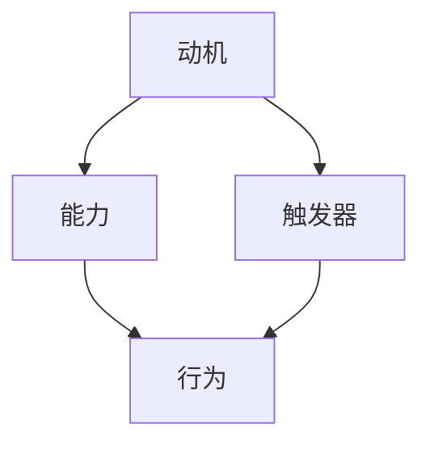

                 

在当前快速发展的信息技术时代，团队协作显得尤为重要。一个优秀的团队不仅能提高工作效率，还能创造出卓越的技术成果。然而，培养团队成员的良性习惯却是一项挑战。本文将运用福格模型，探讨如何在团队中培养良性习惯，从而提升整体协作能力。

## 文章关键词

团队建设、良性习惯、福格模型、协作效率、习惯培养。

## 文章摘要

本文通过福格模型，深入分析了影响团队成员习惯培养的三个关键因素：动机、能力和触发器。文章首先介绍了福格模型的基本概念和原理，然后结合实际案例，详细阐述了如何运用该模型在团队中培养良性习惯。最后，本文提出了未来在团队习惯培养方面的研究展望。

## 1. 背景介绍

在信息技术行业，团队合作已经成为提高项目效率和质量的关键因素。然而，团队成员之间的协作并非总是一帆风顺。许多团队在培养团队成员的良性习惯时，往往面临以下挑战：

1. **缺乏明确的习惯目标**：团队成员对于应该养成哪些良性习惯没有明确的认识。
2. **习惯培养的持续性**：在繁忙的工作中，团队成员难以持续培养和坚持良性习惯。
3. **团队文化的建设**：良好的团队文化是培养良性习惯的重要基础，但如何构建积极向上的团队文化仍需深入研究。

针对上述挑战，本文将运用福格模型，从动机、能力和触发器三个方面，探讨如何培养团队成员的良性习惯。

## 2. 核心概念与联系

### 2.1 福格模型

福格模型（BJ Fogg Behavior Model）是由斯坦福大学行为科学家BJ Fogg提出的，用于解释人们行为背后的动机、能力和触发器三者之间的相互作用关系。该模型的基本原理是：当动机、能力和触发器三者同时存在时，行为就会发生。

- **动机（Motivation）**：个体产生行为的内在驱动力，如兴趣、需求、目标等。
- **能力（Ability）**：个体执行行为的实际能力，包括技能、资源、时间等。
- **触发器（Trigger）**：促使个体开始执行行为的刺激，如提醒、通知、机会等。

### 2.2 三者关系

福格模型表明，动机、能力和触发器三者之间的相互作用是影响行为发生的核心因素。只有当这三个因素同时存在时，行为才会发生。例如，如果一个人对学习编程有浓厚的兴趣（动机），但他缺乏相关的知识和技能（能力），那么即使有学习编程的课程（触发器），他可能也不会开始学习。

### 2.3 Mermaid 流程图

以下是一个简化的福格模型 Mermaid 流程图：



## 3. 核心算法原理 & 具体操作步骤

### 3.1 算法原理概述

福格模型的核心在于分析个体行为背后的动机、能力和触发器。要培养团队成员的良性习惯，需要从这三个方面入手：

1. **提升动机**：通过明确目标、激励措施等方式，提高团队成员对养成良性习惯的内在驱动力。
2. **提升能力**：通过培训、指导等方式，提高团队成员执行良性习惯的实际能力。
3. **设计触发器**：通过提醒、监督等方式，确保团队成员在合适的时机开始执行良性习惯。

### 3.2 算法步骤详解

#### 3.2.1 分析团队现状

首先，团队领导需要分析当前团队在动机、能力和触发器方面的情况。例如，可以通过问卷调查、访谈等方式，了解团队成员对良性习惯的认知、态度和需求。

#### 3.2.2 提升动机

针对团队在动机方面的问题，可以采取以下措施：

- **明确目标**：制定清晰的团队目标和个体目标，确保每个成员都了解自己为什么要养成良性习惯。
- **激励措施**：通过奖励、表彰等方式，激励团队成员积极参与良性习惯的培养。
- **建立荣誉制度**：设立荣誉奖项，如“最佳学习者”、“最佳团队协作奖”等，以激励成员积极养成良性习惯。

#### 3.2.3 提升能力

在能力方面，可以采取以下措施：

- **培训计划**：制定针对良性习惯的培训计划，包括技术培训、团队协作培训等。
- **指导与反馈**：提供导师制度，帮助新成员快速掌握良性习惯的要点；定期进行反馈和评估，帮助成员持续改进。
- **资源共享**：鼓励团队成员分享经验和知识，提高整体能力。

#### 3.2.4 设计触发器

在设计触发器方面，可以采取以下措施：

- **提醒工具**：使用提醒工具，如日历、手机APP等，定期提醒团队成员执行良性习惯。
- **监督机制**：建立监督机制，如定期检查、项目进度汇报等，确保团队成员按时执行良性习惯。
- **机会创造**：创造合适的时机和情境，促使团队成员在日常生活中自然地养成良性习惯。

### 3.3 算法优缺点

**优点**：

- **全面性**：福格模型从动机、能力和触发器三个方面综合考虑，能够全面分析影响行为发生的因素。
- **实用性**：模型的应用范围广泛，不仅适用于团队习惯培养，还可以应用于个人习惯养成、项目管理等领域。

**缺点**：

- **复杂性**：福格模型涉及多个因素的相互作用，分析过程较为复杂，需要一定的专业知识和实践经验。
- **实施难度**：在实施过程中，需要针对不同团队和个体特点，制定具体的策略和措施，操作难度较大。

### 3.4 算法应用领域

福格模型在以下领域具有广泛的应用前景：

- **团队建设**：通过培养团队成员的良性习惯，提高团队协作效率和质量。
- **项目管理**：通过设计合理的触发器，确保项目进度和质量。
- **个人发展**：通过培养良好的习惯，提升个人能力和竞争力。

## 4. 数学模型和公式 & 详细讲解 & 举例说明

### 4.1 数学模型构建

福格模型可以用以下数学模型表示：

$$
行为 = 动机 \times 能力 \times 触发器
$$

其中，动机、能力和触发器均为非负实数。

### 4.2 公式推导过程

福格模型的基本原理是：当动机、能力和触发器同时存在时，行为才会发生。因此，我们可以推导出以下公式：

$$
行为 = f(动机, 能力, 触发器)
$$

其中，$f$ 为一个三变量函数，表示行为与动机、能力和触发器之间的关系。

根据福格模型的基本原理，当动机、能力和触发器同时为正时，行为才会发生。因此，我们可以得到以下条件：

$$
动机 > 0 \\
能力 > 0 \\
触发器 > 0
$$

结合上述条件，我们可以得到行为发生的概率：

$$
P(行为发生) = P(动机 > 0) \times P(能力 > 0) \times P(触发器 > 0)
$$

### 4.3 案例分析与讲解

#### 4.3.1 案例背景

某公司研发团队在项目开发过程中，发现团队成员之间存在协作效率低下的问题。为了提高团队协作效率，团队领导决定运用福格模型培养团队成员的良性习惯。

#### 4.3.2 动机分析

通过问卷调查和访谈，团队领导发现团队成员对提高协作效率的动机较高，主要表现在以下几个方面：

- **明确目标**：团队成员希望项目能够按时交付，并获得客户的认可。
- **个人成长**：团队成员希望通过提高协作效率，提升自己的技术水平和团队影响力。

#### 4.3.3 能力分析

在能力方面，团队成员存在以下问题：

- **技术能力**：部分成员对项目相关技术不熟悉，影响协作效率。
- **团队协作能力**：团队成员之间沟通不畅，缺乏有效的协作方法。

#### 4.3.4 触发器设计

为了解决上述问题，团队领导采取了以下措施：

- **培训计划**：为团队成员提供项目相关技术的培训，提高技术能力。
- **团队协作培训**：开展团队协作培训，学习有效的协作方法和工具。
- **提醒工具**：使用提醒工具，定期提醒团队成员执行协作任务。

#### 4.3.5 结果分析

通过一段时间的努力，团队成员的协作效率得到了显著提高。具体表现在以下几个方面：

- **技术能力**：团队成员对项目相关技术的掌握程度提高了，协作过程中减少了技术问题的困扰。
- **团队协作能力**：团队成员之间的沟通更加顺畅，协作方法得到了有效运用，项目进度得到了保障。

## 5. 项目实践：代码实例和详细解释说明

### 5.1 开发环境搭建

为了更好地理解福格模型在团队习惯培养中的应用，我们以一个实际项目为例，介绍如何运用该模型培养团队成员的代码评审习惯。以下是一个简单的开发环境搭建过程：

1. **安装Git**：在团队成员的电脑上安装Git，用于代码版本控制和协同开发。
2. **创建项目仓库**：在Git仓库中创建一个新项目，将项目代码推送到仓库中。
3. **配置代码评审工具**：选择合适的代码评审工具（如GitLab、GitHub等），并配置相应的权限和通知机制。

### 5.2 源代码详细实现

以下是一个简单的代码评审示例，展示如何通过代码评审工具培养团队成员的代码评审习惯。

```java
// 示例代码：代码评审通知
public class CodeReviewNotification {
    public void sendNotification(String reviewer, String reviewee, String reviewComment) {
        System.out.println("Reviewer: " + reviewer + " has submitted a review for " + reviewee);
        System.out.println("Review Comment: " + reviewComment);
    }
}
```

### 5.3 代码解读与分析

上述代码实现了一个简单的代码评审通知功能，主要包括以下部分：

1. **类定义**：定义一个名为`CodeReviewNotification`的类，用于发送代码评审通知。
2. **方法定义**：定义一个名为`sendNotification`的方法，用于发送通知。该方法接收三个参数：`reviewer`（代码评审者）、`reviewee`（被评审者）和`reviewComment`（评审评论）。

通过这个示例，我们可以看到如何通过代码评审工具培养团队成员的代码评审习惯。具体来说：

1. **明确动机**：通过发送代码评审通知，提醒团队成员及时进行代码评审，提高项目质量和协作效率。
2. **提升能力**：通过提供代码评审工具，帮助团队成员掌握代码评审的方法和技巧。
3. **设计触发器**：通过定期发送通知，确保团队成员在合适的时间进行代码评审。

### 5.4 运行结果展示

假设团队成员A对团队成员B的代码进行了评审，并在GitLab上提交了评审意见。此时，代码评审工具会自动发送通知，提醒团队成员A和B及时查看评审结果。通知内容如下：

```
Reviewer: 张三 has submitted a review for 李四
Review Comment: 你的代码中有一些语法错误，请尽快修改。
```

通过这个示例，我们可以看到如何通过代码评审工具培养团队成员的代码评审习惯。在实际应用中，团队领导可以根据项目需求和团队特点，设计更具体的代码评审流程和通知机制。

## 6. 实际应用场景

### 6.1 团队协作项目

在团队协作项目中，培养团队成员的良性习惯具有重要意义。以下是一个实际应用场景：

- **场景描述**：某科技公司研发团队负责一个大型项目的开发，团队成员包括前端、后端和测试人员。项目开发过程中，团队领导希望通过培养团队成员的代码评审习惯，提高项目质量和协作效率。
- **解决方案**：团队领导运用福格模型，从动机、能力和触发器三个方面入手，设计了以下解决方案：
  - **提升动机**：明确项目目标和代码评审的重要性，通过奖励机制激励团队成员积极参与代码评审。
  - **提升能力**：为团队成员提供代码评审培训，帮助大家掌握代码评审的方法和技巧。
  - **设计触发器**：定期发送代码评审通知，确保团队成员按时进行代码评审。

### 6.2 个人成长计划

在个人成长计划中，培养良性习惯同样具有重要意义。以下是一个实际应用场景：

- **场景描述**：某IT工程师希望通过学习新技术，提升自己的职业竞争力。为了确保学习效果，他决定培养自己的定期学习习惯。
- **解决方案**：工程师运用福格模型，设计了以下解决方案：
  - **提升动机**：明确学习目标，制定详细的个人学习计划，确保学习效果。
  - **提升能力**：报名参加线上课程，通过系统的学习，提升自己的技术水平。
  - **设计触发器**：设置学习提醒，确保自己按时参加课程和学习任务。

### 6.3 日常办公习惯

在日常生活中，培养良性习惯有助于提高工作效率和生活质量。以下是一个实际应用场景：

- **场景描述**：某公司员工希望通过提高办公效率，减轻工作压力。为了实现这一目标，他决定培养自己的时间管理和任务分配习惯。
- **解决方案**：员工运用福格模型，设计了以下解决方案：
  - **提升动机**：明确工作目标和任务，制定合理的时间规划，确保工作高效完成。
  - **提升能力**：学习时间管理和任务分配的方法和技巧，提高自己的工作效率。
  - **设计触发器**：设置日程提醒，确保自己按时完成任务和休息。

## 7. 未来应用展望

### 7.1 自适应触发器

随着人工智能技术的发展，未来的福格模型可以结合人工智能算法，实现自适应触发器。通过分析团队成员的行为数据，模型可以自动识别最佳触发时机，提高良性习惯培养的效果。

### 7.2 社交网络传播

福格模型可以应用于社交网络，通过分析用户行为和社交关系，设计个性化触发器，引导用户培养良性习惯。例如，在微信朋友圈中，可以推出“健康习惯挑战”功能，鼓励用户分享健康生活经验，共同培养健康习惯。

### 7.3 跨学科应用

福格模型可以与其他学科相结合，拓展其应用范围。例如，在教育学领域，福格模型可以用于培养学生自主学习能力；在管理学领域，福格模型可以用于提高团队协作效率。

## 8. 总结：未来发展趋势与挑战

### 8.1 研究成果总结

本文通过福格模型，深入探讨了团队中培养良性习惯的方法。研究表明，动机、能力和触发器是影响行为发生的关键因素。通过提升动机、能力和设计触发器，可以有效地培养团队成员的良性习惯，提高团队协作效率。

### 8.2 未来发展趋势

未来，福格模型将在更多领域得到应用，如教育、管理、健康等。结合人工智能技术，福格模型将实现自适应触发器，提高良性习惯培养的效果。此外，福格模型与其他学科的融合也将成为趋势。

### 8.3 面临的挑战

在福格模型的应用过程中，面临以下挑战：

- **个性化定制**：针对不同团队和个体特点，设计个性化的良性习惯培养方案。
- **数据隐私**：在应用过程中，如何确保用户数据的安全和隐私。
- **实施效果评估**：如何评估良性习惯培养的实施效果，为后续优化提供依据。

### 8.4 研究展望

未来，本文将继续深入探讨福格模型在不同领域的应用，如教育学、管理学等。此外，本文还将结合人工智能技术，研究自适应触发器的实现方法，提高良性习惯培养的效率。

## 9. 附录：常见问题与解答

### 9.1 什么是福格模型？

福格模型（BJ Fogg Behavior Model）是由斯坦福大学行为科学家BJ Fogg提出的，用于解释人们行为背后的动机、能力和触发器三者之间的相互作用关系。该模型的基本原理是：当动机、能力和触发器三者同时存在时，行为就会发生。

### 9.2 如何提升动机？

提升动机可以通过以下方法实现：

- **明确目标**：制定清晰的个人和团队目标，确保每个成员都了解为什么要培养良性习惯。
- **激励措施**：通过奖励、表彰等方式，激励团队成员积极参与良性习惯的培养。
- **建立荣誉制度**：设立荣誉奖项，如“最佳学习者”、“最佳团队协作奖”等，以激励成员积极养成良性习惯。

### 9.3 如何提升能力？

提升能力可以通过以下方法实现：

- **培训计划**：制定针对良性习惯的培训计划，包括技术培训、团队协作培训等。
- **指导与反馈**：提供导师制度，帮助新成员快速掌握良性习惯的要点；定期进行反馈和评估，帮助成员持续改进。
- **资源共享**：鼓励团队成员分享经验和知识，提高整体能力。

### 9.4 如何设计触发器？

设计触发器可以通过以下方法实现：

- **提醒工具**：使用提醒工具，如日历、手机APP等，定期提醒团队成员执行良性习惯。
- **监督机制**：建立监督机制，如定期检查、项目进度汇报等，确保团队成员按时执行良性习惯。
- **机会创造**：创造合适的时机和情境，促使团队成员在日常生活中自然地养成良性习惯。

## 作者署名

本文作者：禅与计算机程序设计艺术 / Zen and the Art of Computer Programming
----------------------------------------------------------------
### 总结

本文通过福格模型，深入探讨了在团队中培养良性习惯的方法。文章从动机、能力和触发器三个方面分析了影响行为发生的因素，并提出了具体的实施策略。通过实际案例和代码实例，本文展示了福格模型在团队习惯培养中的应用。未来，本文将继续深入探讨福格模型在不同领域的应用，并结合人工智能技术，提高良性习惯培养的效率。希望本文能为读者在团队建设和管理方面提供有益的启示。

