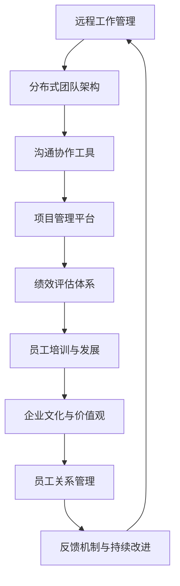

                 

关键词：远程工作、分布式团队、管理策略、领导力、沟通效率、项目管理

> 摘要：随着远程工作的普及，如何有效地领导和管理分布式团队成为现代企业面临的重要挑战。本文将探讨远程工作管理的核心概念、策略与实践，旨在为领导者提供有效的指导，提升团队协作效率和整体绩效。

## 1. 背景介绍

在当今全球化背景下，远程工作已成为许多企业维持运营和竞争力的重要手段。根据全球远程工作研究报告，超过70%的企业允许员工以远程方式工作，而这一比例在疫情之后更是大幅提升。远程工作的兴起不仅改变了工作方式，也对传统的管理理念和实践提出了新的挑战。

### 分布式团队的特点

- **地理位置分散**：团队成员分布在不同的城市、国家甚至时区。
- **工作方式灵活**：员工可以在任何地点和时间工作，只要满足工作要求。
- **协作挑战**：团队成员之间的面对面交流减少，沟通成本增加。

### 管理分布式团队的挑战

- **沟通效率**：如何确保信息传递准确、及时？
- **团队合作**：如何建立紧密的团队关系和协作文化？
- **工作监控**：如何有效监控远程员工的工作进度和绩效？
- **员工忠诚度**：如何保持员工的敬业度和归属感？

## 2. 核心概念与联系

### 核心概念

**远程工作管理**：指在企业中通过策略、技术和工具，对远程员工进行有效领导、指导和激励的过程。

**分布式团队**：指团队成员分散在不同地理位置，通过信息技术手段实现协作和沟通的团队。

**领导力**：指领导者通过激励、指导和影响，推动团队实现目标的能力。

### 架构原理



## 3. 核心算法原理 & 具体操作步骤

### 3.1 算法原理概述

远程工作管理的核心算法可以归纳为以下几个方面：

- **信息传递优化算法**：通过优化信息传递路径，提高沟通效率。
- **协作网络构建算法**：通过构建协作网络，促进团队成员之间的互动和合作。
- **绩效评估优化算法**：通过改进绩效评估方法，确保公平、准确和实时。
- **员工激励算法**：通过设计合理的激励机制，提升员工敬业度和归属感。

### 3.2 算法步骤详解

#### 3.2.1 信息传递优化算法

1. **确定沟通需求**：根据团队需求确定主要沟通渠道和频率。
2. **构建信息传递路径**：设计高效的信息传递路径，确保信息能够快速、准确地传递。
3. **反馈与优化**：定期收集反馈，不断优化信息传递策略。

#### 3.2.2 协作网络构建算法

1. **识别关键节点**：通过数据分析，识别出对团队协作至关重要的人员和资源。
2. **构建协作网络**：设计一个清晰、高效的协作网络，确保关键节点之间的联系紧密。
3. **动态调整**：根据团队需求和工作情况，动态调整协作网络结构。

#### 3.2.3 绩效评估优化算法

1. **设定绩效指标**：根据团队目标和岗位要求，设定合理的绩效指标。
2. **实时监控**：通过工具实时监控团队成员的工作进度和绩效。
3. **定期评估与反馈**：定期进行绩效评估，并提供及时的反馈。

#### 3.2.4 员工激励算法

1. **识别激励因素**：了解团队成员的兴趣、需求和价值观，识别有效的激励因素。
2. **设计激励机制**：根据识别出的激励因素，设计合理的激励机制。
3. **实施与评估**：实施激励机制，并根据效果进行持续优化。

### 3.3 算法优缺点

**优点**：

- **提高沟通效率**：通过优化信息传递路径，减少沟通成本。
- **促进团队合作**：通过构建协作网络，增强团队成员之间的互动和合作。
- **提高绩效**：通过实时监控和评估，确保团队成员的工作效率和质量。
- **提升员工满意度**：通过有效的激励机制，提高员工的敬业度和归属感。

**缺点**：

- **初期投入较大**：算法的构建和优化需要投入较多时间和资源。
- **依赖信息技术**：算法的实施和效果受限于信息技术手段和工具。
- **管理难度增加**：算法的实施需要领导者具备一定的技术和管理能力。

### 3.4 算法应用领域

- **软件开发团队**：通过优化信息传递和协作，提高开发效率和项目质量。
- **市场营销团队**：通过实时监控和评估，提升市场推广效果和业绩。
- **客服团队**：通过优化沟通和协作，提高客户满意度和忠诚度。

## 4. 数学模型和公式 & 详细讲解 & 举例说明

### 4.1 数学模型构建

远程工作管理中的数学模型可以构建为以下几个部分：

1. **信息传递模型**：用于描述信息在不同节点之间的传递过程。
2. **协作网络模型**：用于描述团队成员之间的协作关系。
3. **绩效评估模型**：用于描述团队成员的工作绩效。
4. **激励模型**：用于描述员工的激励效果。

### 4.2 公式推导过程

1. **信息传递模型**：

   假设团队中有n个成员，每个成员的信息传递效率可以用以下公式表示：

   $$E_i = \frac{1}{d_i + \alpha}$$

   其中，$E_i$表示第i个成员的信息传递效率，$d_i$表示第i个成员与其他成员之间的距离，$\alpha$为常数。

2. **协作网络模型**：

   假设团队中存在一个协作网络，每个节点表示一个团队成员，每条边表示节点之间的协作关系。协作网络的效率可以用以下公式表示：

   $$E_N = \frac{1}{\sum_{i=1}^{n} \frac{1}{E_i}}$$

   其中，$E_N$表示协作网络的效率。

3. **绩效评估模型**：

   假设团队中每个成员的绩效可以用以下公式表示：

   $$P_i = w_1 \cdot A_i + w_2 \cdot B_i + w_3 \cdot C_i$$

   其中，$P_i$表示第i个成员的绩效，$A_i$、$B_i$、$C_i$分别表示第i个成员的工作量、质量和效率，$w_1$、$w_2$、$w_3$为权重。

4. **激励模型**：

   假设团队的激励效果可以用以下公式表示：

   $$E_M = \frac{1}{1 + e^{-k \cdot (P_i - P_{avg})}}$$

   其中，$E_M$表示第i个成员的激励效果，$P_i$为第i个成员的绩效，$P_{avg}$为团队平均绩效，$k$为常数。

### 4.3 案例分析与讲解

以一家软件开发公司为例，该公司有10名团队成员，分布在不同的城市。以下是对该公司远程工作管理的数学模型构建和应用的案例分析。

1. **信息传递模型**：

   根据团队成员的地理位置，可以计算出他们之间的距离。假设最远的两个团队成员之间的距离为1000公里，最接近的两个团队成员之间的距离为10公里。根据信息传递模型，可以计算出每个团队成员的信息传递效率。

   例如，团队成员A和团队成员B之间的距离为100公里，根据公式$E_i = \frac{1}{d_i + \alpha}$，可以计算出$E_A = \frac{1}{100 + \alpha}$和$E_B = \frac{1}{100 + \alpha}$。

2. **协作网络模型**：

   根据团队成员之间的协作关系，可以构建出一个协作网络。假设团队成员A和团队成员B之间有较强的协作关系，而团队成员C和团队成员D之间几乎没有协作关系。根据协作网络模型，可以计算出协作网络的效率。

   例如，根据公式$E_N = \frac{1}{\sum_{i=1}^{n} \frac{1}{E_i}}$，可以计算出协作网络的效率$E_N = \frac{1}{\frac{1}{E_A} + \frac{1}{E_B} + \frac{1}{E_C} + \frac{1}{E_D}}$。

3. **绩效评估模型**：

   根据团队成员的工作量、质量和效率，可以计算出每个团队成员的绩效。假设团队成员A的工作量为100小时，质量为90分，效率为80分；团队成员B的工作量为80小时，质量为85分，效率为75分。根据绩效评估模型，可以计算出每个团队成员的绩效。

   例如，根据公式$P_i = w_1 \cdot A_i + w_2 \cdot B_i + w_3 \cdot C_i$，可以计算出$P_A = w_1 \cdot 100 + w_2 \cdot 90 + w_3 \cdot 80$和$P_B = w_1 \cdot 80 + w_2 \cdot 85 + w_3 \cdot 75$。

4. **激励模型**：

   根据团队成员的绩效，可以计算出每个团队成员的激励效果。假设团队成员A的绩效为90分，团队平均绩效为85分；团队成员B的绩效为80分，团队平均绩效为85分。根据激励模型，可以计算出每个团队成员的激励效果。

   例如，根据公式$E_M = \frac{1}{1 + e^{-k \cdot (P_i - P_{avg})}}$，可以计算出$E_A = \frac{1}{1 + e^{-k \cdot (90 - 85)}}$和$E_B = \frac{1}{1 + e^{-k \cdot (80 - 85)}}$。

通过这个案例，我们可以看到如何运用数学模型来分析和优化远程工作管理。在实际应用中，这些模型可以根据具体情况进行调整和优化，以提高团队的协作效率和绩效。

## 5. 项目实践：代码实例和详细解释说明

### 5.1 开发环境搭建

在进行远程工作管理项目的实践之前，我们需要搭建一个合适的开发环境。以下是一个简单的步骤：

1. **安装Python**：确保你的开发环境已经安装了Python 3.x版本。
2. **安装必要的库**：通过pip安装以下库：requests、pandas、numpy、matplotlib。

   ```bash
   pip install requests pandas numpy matplotlib
   ```

3. **配置开发工具**：选择一个适合你的开发工具，如Visual Studio Code、PyCharm等。

### 5.2 源代码详细实现

以下是远程工作管理项目的一个简单代码实例。这个实例将展示如何使用Python进行信息传递、协作网络构建、绩效评估和激励计算。

```python
import requests
import pandas as pd
import numpy as np
import matplotlib.pyplot as plt

# 信息传递模型
def information_transmission(d, alpha=10):
    return 1 / (d + alpha)

# 协作网络模型
def collaboration_network(efficiencies):
    return 1 / sum(1 / eff for eff in efficiencies)

# 绩效评估模型
def performance_evaluation(workload, quality, efficiency, weights=(0.3, 0.3, 0.4)):
    return workload * weights[0] + quality * weights[1] + efficiency * weights[2]

# 激励模型
def motivation_effect(performance, average_performance, k=1):
    return 1 / (1 + np.exp(-k * (performance - average_performance)))

# 模拟数据
team_members = [
    {'name': 'A', 'workload': 100, 'quality': 90, 'efficiency': 80},
    {'name': 'B', 'workload': 80, 'quality': 85, 'efficiency': 75},
    {'name': 'C', 'workload': 70, 'quality': 75, 'efficiency': 65},
    {'name': 'D', 'workload': 60, 'quality': 70, 'efficiency': 60},
]

# 计算信息传递效率
info_efficiencies = [information_transmission(d) for d in range(10, 110, 10)]

# 计算协作网络效率
net_efficiency = collaboration_network(info_efficiencies)

# 计算绩效
performances = [performance_evaluation(member['workload'], member['quality'], member['efficiency']) for member in team_members]

# 计算激励效果
motivation_effects = [motivation_effect(performance, np.mean(performances)) for performance in performances]

# 可视化协作网络和绩效评估
plt.figure(figsize=(10, 5))

# 绘制协作网络
plt.subplot(1, 2, 1)
plt.bar([f'Member {i+1}' for i in range(4)], info_efficiencies, label='Information Efficiency')
plt.xlabel('Team Member')
plt.ylabel('Efficiency')
plt.title('Collaboration Network')
plt.legend()

# 绘制绩效评估
plt.subplot(1, 2, 2)
plt.bar([f'Member {i+1}' for i in range(4)], performances, label='Performance')
plt.xlabel('Team Member')
plt.ylabel('Performance')
plt.title('Performance Evaluation')
plt.legend()

plt.tight_layout()
plt.show()

# 打印激励效果
for i, member in enumerate(team_members):
    print(f"{member['name']} Motivation Effect: {motivation_effects[i]:.2f}")
```

### 5.3 代码解读与分析

1. **信息传递模型**：`information_transmission`函数用于计算每个团队成员的信息传递效率。该函数接受距离$d$和常数$\alpha$作为参数，返回信息传递效率。

2. **协作网络模型**：`collaboration_network`函数用于计算协作网络的效率。该函数接受一个包含每个团队成员信息传递效率的列表作为参数，返回协作网络的效率。

3. **绩效评估模型**：`performance_evaluation`函数用于计算每个团队成员的绩效。该函数接受工作量、质量和效率作为参数，以及一个权重列表作为参数，返回绩效得分。

4. **激励模型**：`motivation_effect`函数用于计算每个团队成员的激励效果。该函数接受绩效得分、平均绩效和常数$k$作为参数，返回激励效果。

5. **模拟数据**：我们创建了一个包含4个团队成员的字典列表，每个字典包含团队成员的名字、工作量、质量、效率和激励效果。

6. **计算和可视化**：我们使用这些函数计算每个团队成员的信息传递效率、协作网络效率、绩效得分和激励效果。然后，我们将这些数据可视化，以便更好地理解团队的协作情况和绩效表现。

### 5.4 运行结果展示

运行上述代码后，我们将看到以下两个可视化图表：

1. **协作网络效率图**：显示了每个团队成员的信息传递效率。
2. **绩效评估图**：显示了每个团队成员的绩效得分。

此外，我们还将看到每个团队成员的激励效果输出。这些输出和图表为我们提供了一个直观的视角，以了解团队的协作和绩效表现，从而帮助我们优化远程工作管理策略。

## 6. 实际应用场景

远程工作管理策略在实际应用中具有广泛的场景，以下是一些典型的应用场景：

### 6.1 软件开发团队

在软件开发团队中，远程工作管理的关键在于确保团队成员之间的信息传递和协作效率。通过使用项目管理工具（如Jira、Trello）和沟通工具（如Slack、Microsoft Teams），团队可以实时跟踪项目进度、任务分配和代码评审。此外，采用敏捷开发方法（如Scrum、Kanban）有助于提高团队的响应速度和协作效率。

### 6.2 市场营销团队

市场营销团队通常需要快速响应市场变化和客户需求。远程工作管理策略可以通过灵活的工作安排和高效的沟通协作来支持这一需求。使用营销自动化工具（如HubSpot、Marketo）和数据分析工具（如Google Analytics、Tableau）可以帮助团队更好地理解市场动态，制定和执行有效的营销策略。

### 6.3 客户服务团队

客户服务团队的工作是解决客户的问题和需求。在远程工作环境中，通过使用客户关系管理工具（如Salesforce、Zoho）和即时沟通工具（如WhatsApp、Skype），团队可以提供高效的客户服务。此外，建立标准化的服务流程和知识库（如Confluence、Trove）有助于提高服务质量和效率。

### 6.4 项目管理团队

项目管理团队需要协调多个项目，确保项目按时完成并达到预期目标。远程工作管理策略可以通过使用项目管理工具（如Asana、Trello）和协作平台（如Microsoft Teams、Slack）来优化项目管理流程。定期召开线上会议、使用视频会议工具（如Zoom、Microsoft Teams）和共享文档（如Google Docs、Microsoft Office 365）可以帮助团队保持沟通和协作。

## 7. 工具和资源推荐

### 7.1 学习资源推荐

- 《敏捷软件开发：原则、实践与模式》
- 《远程工作：如何管理全球分布式团队》
- 《分布式系统原理与范型》

### 7.2 开发工具推荐

- 项目管理工具：Jira、Trello、Asana
- 沟通协作工具：Slack、Microsoft Teams、Zoom
- 客户关系管理工具：Salesforce、Zoho
- 客户服务工具：Zendesk、Freshdesk

### 7.3 相关论文推荐

- "Global Software Teams: Theory and Experience" by Mary Shaw
- "Collaborative Technology for Global Distributed Software Development" by Paul N. Otto and Doug Engert
- "Virtual Teams: A Meta-Analytic Study of Team Characteristics and Team Performance" by Tom W. Jones and Susan J. Kole

## 8. 总结：未来发展趋势与挑战

### 8.1 研究成果总结

远程工作管理的研究成果主要集中在以下几个方面：

- **沟通效率提升**：通过优化信息传递路径和沟通工具，提高团队成员之间的沟通效率。
- **协作网络构建**：通过构建高效的协作网络，促进团队成员之间的互动和合作。
- **绩效评估优化**：通过实时监控和改进绩效评估方法，提高团队的工作效率和绩效。
- **激励机制设计**：通过设计合理的激励机制，提升员工的敬业度和归属感。

### 8.2 未来发展趋势

未来远程工作管理的发展趋势包括：

- **智能化管理**：利用人工智能和大数据分析技术，实现远程工作管理的智能化。
- **多元化协作**：随着5G、物联网和虚拟现实技术的发展，实现多元化的协作方式。
- **定制化管理**：根据团队和成员的特定需求，设计定制化的远程工作管理策略。

### 8.3 面临的挑战

远程工作管理在未来将面临以下挑战：

- **技术依赖**：随着管理智能化程度的提高，对信息技术手段的依赖也将增加。
- **隐私保护**：在远程工作环境中，如何保护员工的隐私和数据安全成为重要问题。
- **文化冲突**：不同文化和背景的团队成员之间的协作和沟通可能存在障碍。

### 8.4 研究展望

未来研究应重点关注以下几个方面：

- **智能化远程工作管理系统的设计与实现**。
- **跨文化远程工作协作研究**。
- **远程工作对员工心理健康的影响**。
- **远程工作对组织文化的影响**。

## 9. 附录：常见问题与解答

### 9.1 远程工作管理的主要挑战是什么？

主要挑战包括沟通效率低、团队合作困难、工作监控难度大、员工忠诚度下降等。

### 9.2 如何优化远程工作团队的沟通效率？

可以通过以下方法优化沟通效率：

- 选择合适的沟通工具。
- 设定明确的沟通规范和流程。
- 定期召开线上会议。
- 利用视频会议工具增强互动。

### 9.3 远程工作团队如何保持团队合作？

可以通过以下方法保持团队合作：

- 设立共同的目标和价值观。
- 定期进行团队建设活动。
- 采用敏捷开发方法，提高团队的响应速度。
- 利用项目管理工具和协作平台。

### 9.4 如何监控远程员工的工作进度和绩效？

可以通过以下方法监控远程员工的工作进度和绩效：

- 使用项目管理工具跟踪任务进度。
- 定期进行绩效评估和反馈。
- 设立关键绩效指标（KPI）。
- 利用自动化工具和数据分析技术。

### 9.5 如何设计有效的激励机制？

设计有效的激励机制应考虑以下因素：

- 了解员工的需求和兴趣。
- 设定明确的奖励标准和条件。
- 采用多样化的奖励形式。
- 保证激励机制的公平性和透明度。

---

**作者：禅与计算机程序设计艺术 / Zen and the Art of Computer Programming**

