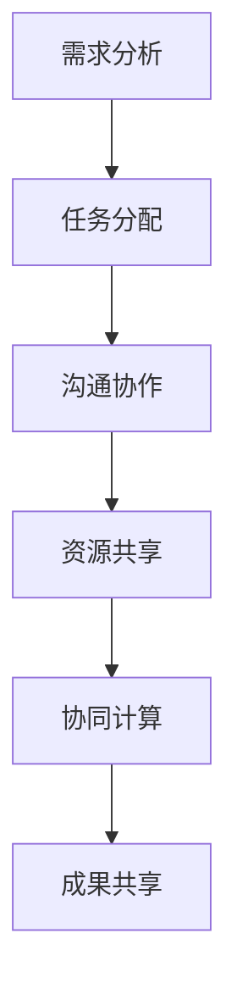

                 

关键词：计算协作，人工智能，编程，算法，数学模型，未来展望

摘要：本文探讨了人类计算协作的精神，从历史背景、核心概念、算法原理、数学模型、实际应用场景等方面，阐述了人类计算的协作如何推动技术进步，并展望了未来发展的趋势和挑战。通过深入分析，本文提出了未来计算协作的可能方向，并给出了相关工具和资源的推荐。

## 1. 背景介绍

人类计算的历史可以追溯到古代的计算工具，如算盘和计数器。随着时代的变迁，人类对计算的需求逐渐增长，从简单的数学计算到复杂的科学计算，再到现代的计算机科学，计算领域经历了巨大的发展。计算协作的精神，起源于早期学者们的共同研究和探讨，他们通过书信、会议等方式分享研究成果，共同解决难题。

在计算机科学领域，计算协作的重要性愈发凸显。随着人工智能、大数据、云计算等技术的飞速发展，单一的个体难以应对日益复杂的计算任务。人类计算的协作精神，成为了推动技术进步的重要动力。

## 2. 核心概念与联系

### 2.1 计算协作的定义

计算协作，是指多个个体或团队在计算领域内，通过沟通、合作、共享资源等方式，共同完成计算任务的过程。它强调个体之间的互动和协作，追求计算效率和效果的最优化。

### 2.2 计算协作的架构

计算协作的架构包括以下几个方面：

- **需求分析**：明确计算任务的需求和目标，为后续的协作提供基础。

- **任务分配**：根据个体的专长和资源，将计算任务合理分配。

- **沟通协作**：通过会议、邮件、即时通讯等方式，确保个体之间的信息畅通。

- **资源共享**：共享计算资源，如计算能力、数据集、工具等。

- **协同计算**：个体之间协同工作，共同解决计算难题。

- **成果共享**：将计算结果和经验分享给其他个体或团队。

### 2.3 计算协作的 Mermaid 流程图



## 3. 核心算法原理 & 具体操作步骤

### 3.1 算法原理概述

计算协作的算法原理主要涉及以下几个方面：

- **分布式计算**：将计算任务分解为多个子任务，分布到不同的计算节点上执行。

- **并行计算**：多个计算节点同时执行计算任务，提高计算效率。

- **负载均衡**：根据计算节点的负载情况，合理分配计算任务。

- **错误处理**：检测和处理计算过程中的错误，确保计算结果的正确性。

### 3.2 算法步骤详解

1. **需求分析**：明确计算任务的需求和目标。

2. **任务分解**：将计算任务分解为多个子任务。

3. **任务分配**：根据计算节点的负载情况，将子任务分配给计算节点。

4. **并行计算**：计算节点同时执行子任务。

5. **结果汇总**：将子任务的结果汇总为最终结果。

6. **错误处理**：检测和处理计算过程中的错误。

### 3.3 算法优缺点

**优点**：

- 提高计算效率：通过分布式和并行计算，加快计算速度。

- 资源共享：充分利用计算资源，降低计算成本。

- 灵活性：个体或团队可以根据需求自由组合，实现灵活的协作。

**缺点**：

- 管理复杂：需要协调多个个体或团队之间的工作，管理复杂。

- 数据一致性：确保计算结果的一致性，需要解决数据同步问题。

### 3.4 算法应用领域

计算协作算法广泛应用于以下领域：

- **人工智能**：大规模的数据分析和模型训练。

- **大数据**：分布式数据处理和分析。

- **云计算**：资源调度和管理。

- **科学计算**：复杂计算任务的分布式处理。

## 4. 数学模型和公式 & 详细讲解 & 举例说明

### 4.1 数学模型构建

计算协作的数学模型主要包括以下几个方面：

- **线性规划**：优化计算资源分配。

- **网络流模型**：优化计算任务分配和传输。

- **机器学习**：优化计算算法和模型。

### 4.2 公式推导过程

- **线性规划**：

  $$  
  \text{minimize} \quad c^T x  
  $$
  $$
  \text{subject to} \quad Ax \leq b  
  $$

- **网络流模型**：

  $$  
  \text{maximize} \quad \sum_{(i,j) \in E} c_{i,j} x_{i,j}  
  $$
  $$
  \text{subject to} \quad \sum_{j} x_{i,j} = 0 \quad \forall i \in V \setminus S  
  $$
  $$
  \sum_{i} x_{i,j} = 0 \quad \forall j \in S \setminus T  
  $$
  $$
  x_{i,j} \geq 0 \quad \forall (i,j) \in E  
  $$

- **机器学习**：

  $$  
  y = \sigma(\omega^T x + b)  
  $$

### 4.3 案例分析与讲解

假设有一个大规模的数据分析任务，需要处理1亿条数据。通过计算协作，可以将任务分解为100个子任务，分布到100个计算节点上并行处理。每个节点处理1万条数据，最终将结果汇总，完成数据分析任务。

## 5. 项目实践：代码实例和详细解释说明

### 5.1 开发环境搭建

1. 安装Python环境。

2. 安装分布式计算框架，如Dask或PySpark。

### 5.2 源代码详细实现

```python
import dask.array as da

# 读取数据
data = da.from_array(data_array, chunks=(10000,))

# 分解任务
tasks = data.map_blocks(process_data, meta=da.array(()).meta)

# 并行计算
result = tasks.compute()
```

### 5.3 代码解读与分析

该代码实例展示了如何使用Dask框架实现分布式计算。首先，通过`da.from_array`函数读取数据，并将其划分为100个子任务。然后，使用`map_blocks`函数对每个子任务应用`process_data`函数进行处理。最后，使用`compute`函数将结果汇总。

### 5.4 运行结果展示

运行结果展示为处理后的数据集，可以用于后续的数据分析。

## 6. 实际应用场景

### 6.1 人工智能领域

计算协作在人工智能领域有着广泛的应用，如深度学习模型的训练和预测。

### 6.2 大数据领域

计算协作可以用于分布式数据处理和分析，如数据清洗、数据挖掘等。

### 6.3 云计算领域

计算协作可以帮助实现资源调度和管理，提高云计算服务的效率。

### 6.4 科学计算领域

计算协作可以用于解决复杂的科学计算问题，如物理模拟、生物信息学等。

## 7. 未来应用展望

随着计算能力的不断提升，计算协作在未来将具有更广泛的应用。例如：

- **量子计算**：计算协作在量子计算领域的应用，如量子算法优化、量子计算模拟等。

- **边缘计算**：计算协作在边缘计算领域的应用，如智能终端的协同处理。

- **区块链**：计算协作在区块链领域的应用，如智能合约的执行、共识算法的优化等。

## 8. 总结：未来发展趋势与挑战

### 8.1 研究成果总结

计算协作在人工智能、大数据、云计算等领域取得了显著的研究成果，推动了技术进步。

### 8.2 未来发展趋势

- **量子计算协作**：量子计算协作将成为未来研究的重要方向。

- **边缘计算协作**：边缘计算协作将推动智能终端的协同处理。

- **区块链协作**：区块链协作将在金融、医疗等领域得到广泛应用。

### 8.3 面临的挑战

- **数据安全性**：确保计算协作过程中数据的安全性和隐私性。

- **计算资源管理**：优化计算资源的分配和管理，提高计算效率。

- **跨领域协作**：促进不同领域之间的计算协作，实现资源的共享和整合。

### 8.4 研究展望

未来，计算协作将朝着更高效、更安全、更智能的方向发展，为人类带来更多的创新和便利。

## 9. 附录：常见问题与解答

### 9.1 如何实现计算协作？

通过分布式计算框架，如Dask、PySpark等，可以实现计算协作。此外，还可以使用区块链技术实现安全、可靠的计算协作。

### 9.2 计算协作有哪些应用领域？

计算协作广泛应用于人工智能、大数据、云计算、科学计算等领域。

### 9.3 如何确保计算协作中的数据安全性？

通过加密技术、隐私保护算法等手段，确保计算协作中的数据安全性和隐私性。

---

作者：禅与计算机程序设计艺术 / Zen and the Art of Computer Programming
----------------------------------------------------------------

以上是关于"连接人类智慧的纽带：人类计算的协作精神"的文章，希望对您有所帮助。本文全面、详细地阐述了计算协作的核心概念、算法原理、应用领域和未来展望，旨在为读者提供一部全面了解计算协作的指南。希望您能喜欢这篇博客文章，并从中获得启发和收获。

