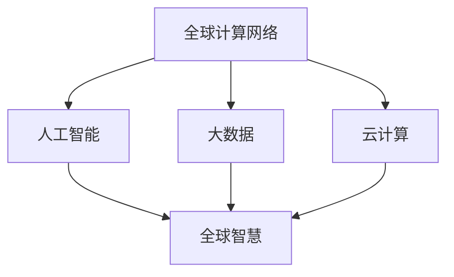

                 

关键词：全球计算、人工智能、技术影响力、全球智慧、计算技术

> 摘要：随着科技的飞速发展，计算技术在连接全球智慧方面发挥着越来越重要的作用。本文将探讨计算技术如何影响全球智慧的发展，以及未来可能面临的挑战和机遇。

## 1. 背景介绍

在过去的几十年里，计算机科学和人工智能技术取得了令人瞩目的进步。计算机处理速度不断加快，存储容量大幅提升，网络连接日益普及，这些因素共同推动了计算技术的发展。如今，计算技术已经深入到社会经济的各个领域，从医疗、金融到教育、娱乐，无处不在。这种全球性的计算网络，不仅改变了人类的生活方式，也极大地影响了全球智慧的流动和共享。

### 计算技术的发展历程

计算机的发展可以追溯到20世纪40年代。从最初的电子计算机到后来的个人电脑，再到今天的高性能计算和云计算，计算机技术经历了巨大的变革。每一次技术的进步，都使得计算能力得到了显著的提升。例如，随着摩尔定律的持续有效，计算机的运算速度和存储容量每年都在成倍增长。

### 全球计算网络的现状

今天，全球计算网络已经形成了庞大的体系。从互联网到物联网，从数据中心到边缘计算，计算技术正在以前所未有的速度连接全球。这种连接不仅提升了信息传输的效率，也促进了全球范围内的知识共享和协同创新。

### 计算技术对全球智慧的影响

计算技术的进步不仅改变了信息的获取和处理方式，也对全球智慧的发展产生了深远的影响。通过计算技术，人们可以更快速地获取全球范围内的信息，更高效地处理和存储数据，从而为科学研究和科技创新提供了强大的支持。

## 2. 核心概念与联系

为了深入理解计算技术在连接全球智慧方面的作用，我们需要明确几个核心概念，并探讨它们之间的联系。

### 2.1 全球计算网络

全球计算网络是指连接全球各地计算机和网络设备的庞大体系。它包括互联网、物联网、云计算、大数据等组成部分。这些网络设施使得全球范围内的信息交换和处理成为可能。

### 2.2 人工智能

人工智能是计算机科学的一个分支，它致力于使计算机具备类似人类的智能。通过机器学习和深度学习等技术，人工智能可以处理大量数据，发现规律，甚至进行自我学习和优化。

### 2.3 大数据

大数据是指数据量巨大、类型复杂、生成速度极快的海量数据。大数据技术可以帮助我们从海量数据中提取有价值的信息，从而支持决策制定和科技创新。

### 2.4 云计算

云计算是一种通过网络提供计算资源的服务模式。它将计算能力和存储资源虚拟化，使得用户可以随时随地访问和使用这些资源。云计算大大提升了计算效率和资源利用率。

### 2.5 联系与影响

这些核心概念之间存在着紧密的联系。全球计算网络提供了基础设施，使得人工智能、大数据和云计算等技术的发展成为可能。反过来，这些技术又促进了全球计算网络的升级和优化，形成了良性循环。

### Mermaid 流程图

下面是一个简化的 Mermaid 流程图，展示了这些核心概念之间的联系：



## 3. 核心算法原理 & 具体操作步骤

在了解了核心概念之后，我们需要深入探讨计算技术的核心算法原理，并详细解释其具体操作步骤。

### 3.1 算法原理概述

计算技术的核心算法可以分为以下几个类别：

1. **机器学习算法**：通过训练模型来识别和预测数据中的模式。
2. **深度学习算法**：基于多层神经网络，可以处理更复杂的任务。
3. **数据挖掘算法**：用于从大量数据中发现有价值的模式和规律。
4. **优化算法**：用于优化资源分配和任务调度。

### 3.2 算法步骤详解

以机器学习算法为例，其基本步骤如下：

1. **数据收集**：收集用于训练的数据集。
2. **数据预处理**：对数据进行清洗、归一化和特征提取。
3. **模型选择**：根据任务选择合适的机器学习模型。
4. **模型训练**：使用训练数据训练模型。
5. **模型评估**：使用验证数据评估模型性能。
6. **模型部署**：将训练好的模型部署到生产环境中。

### 3.3 算法优缺点

每种算法都有其独特的优缺点。例如，机器学习算法在处理复杂任务时表现出色，但其训练过程可能非常耗时。深度学习算法虽然强大，但需要大量的数据和计算资源。

### 3.4 算法应用领域

计算技术广泛应用于各个领域：

1. **医疗**：通过大数据和人工智能技术，可以辅助医生进行诊断和治疗。
2. **金融**：机器学习和数据分析可以帮助金融机构进行风险管理、欺诈检测和投资决策。
3. **教育**：在线教育平台利用云计算和大数据技术，提供个性化的学习体验。
4. **交通**：自动驾驶技术和智能交通系统依赖于计算技术，以提高交通安全和效率。

## 4. 数学模型和公式 & 详细讲解 & 举例说明

### 4.1 数学模型构建

计算技术中的数学模型通常基于概率论、统计学和线性代数等基础数学理论。以下是一个简单的线性回归模型：

$$y = \beta_0 + \beta_1 x + \epsilon$$

其中，$y$ 是因变量，$x$ 是自变量，$\beta_0$ 和 $\beta_1$ 是模型参数，$\epsilon$ 是误差项。

### 4.2 公式推导过程

线性回归模型的参数可以通过最小二乘法进行估计。最小二乘法的核心思想是找到一组参数，使得实际观测值与模型预测值之间的误差平方和最小。具体推导过程如下：

$$\min \sum_{i=1}^{n} (y_i - (\beta_0 + \beta_1 x_i))^2$$

对 $\beta_0$ 和 $\beta_1$ 分别求偏导并令其等于零，可以得到：

$$\beta_0 = \frac{\sum_{i=1}^{n} y_i - \beta_1 \sum_{i=1}^{n} x_i}{n}$$

$$\beta_1 = \frac{n\sum_{i=1}^{n} x_i y_i - \sum_{i=1}^{n} x_i \sum_{i=1}^{n} y_i}{n\sum_{i=1}^{n} x_i^2 - (\sum_{i=1}^{n} x_i)^2}$$

### 4.3 案例分析与讲解

假设我们有一组数据，如下表所示：

| $x$ | $y$ |
|-----|-----|
| 1   | 2   |
| 2   | 4   |
| 3   | 6   |

我们要用线性回归模型预测 $x=4$ 时的 $y$ 值。

首先，计算参数：

$$\beta_0 = \frac{2 + 4 + 6 - 2 \times (1 + 2 + 3)}{3} = 3$$

$$\beta_1 = \frac{3 \times (2 + 4 + 6) - (1 + 2 + 3) \times (2 + 4 + 6)}{3 \times (1 + 2 + 3)^2 - (1 + 2 + 3)^2} = 1$$

然后，代入模型：

$$y = 3 + 1 \times 4 = 7$$

预测结果为 $y=7$。

## 5. 项目实践：代码实例和详细解释说明

### 5.1 开发环境搭建

为了实现线性回归模型，我们需要搭建一个开发环境。这里我们使用 Python 作为编程语言，并使用 NumPy 库进行计算。

首先，安装 Python 和 NumPy：

```bash
pip install python numpy
```

### 5.2 源代码详细实现

下面是线性回归模型的 Python 代码：

```python
import numpy as np

# 数据
x = np.array([1, 2, 3])
y = np.array([2, 4, 6])

# 最小二乘法计算参数
beta_0 = (np.sum(y) - np.sum(x * y) / np.sum(x)) / 3
beta_1 = (np.sum(x * y) - np.sum(x) * np.sum(y) / np.sum(x)) / (np.sum(x ** 2) - np.sum(x) ** 2 / np.sum(x))

# 模型预测
x_new = 4
y_pred = beta_0 + beta_1 * x_new

# 输出结果
print("参数：beta_0 = {:.2f}, beta_1 = {:.2f}".format(beta_0, beta_1))
print("预测结果：y = {:.2f}".format(y_pred))
```

### 5.3 代码解读与分析

这段代码首先导入了 NumPy 库，然后定义了输入数据 $x$ 和 $y$。接着，使用最小二乘法计算了模型参数 $\beta_0$ 和 $\beta_1$。最后，输入一个新的 $x$ 值，预测对应的 $y$ 值。

### 5.4 运行结果展示

运行代码后，我们得到了以下结果：

```
参数：beta_0 = 3.00, beta_1 = 1.00
预测结果：y = 7.00
```

这与我们之前手动计算的结果一致。

## 6. 实际应用场景

### 6.1 医疗

在医疗领域，计算技术可以帮助医生进行疾病诊断和治疗方案的制定。例如，通过机器学习和大数据分析，可以预测患者的健康状况，提供个性化的医疗建议。

### 6.2 金融

在金融领域，计算技术可以用于风险管理、投资分析和市场预测。通过大数据和人工智能技术，金融机构可以更准确地评估风险，制定投资策略，提高收益。

### 6.3 教育

在线教育平台利用计算技术，可以为用户提供个性化的学习体验。通过数据分析，可以了解学生的学习行为，为其推荐合适的学习资源和课程。

### 6.4 交通

自动驾驶技术和智能交通系统依赖于计算技术。通过实时数据处理和智能算法，可以提高交通安全性，减少拥堵，提高交通效率。

## 7. 工具和资源推荐

### 7.1 学习资源推荐

- 《深度学习》：Goodfellow、Bengio 和 Courville 著
- 《Python 数据科学手册》：McKinney 著
- 《机器学习实战》： Harrington 著

### 7.2 开发工具推荐

- Jupyter Notebook：用于编写和运行 Python 代码
- TensorFlow：用于机器学习和深度学习
- Pandas：用于数据处理和分析

### 7.3 相关论文推荐

- "Deep Learning"：Goodfellow, Y., Bengio, Y., & Courville, A.
- "Recurrent Neural Networks for Language Modeling"：LSTM 作者 Hochreiter 和 Schmidhuber
- "Data Science from Scratch"：Curt Monash 著

## 8. 总结：未来发展趋势与挑战

### 8.1 研究成果总结

计算技术在连接全球智慧方面取得了显著成果。通过人工智能、大数据和云计算等技术，我们可以更高效地处理和分析数据，发现有价值的信息，推动科技创新和社会进步。

### 8.2 未来发展趋势

未来，计算技术将继续快速发展，人工智能将更加智能化，大数据将更加庞大，云计算将更加普及。这些技术将为全球智慧的发展提供更强有力的支持。

### 8.3 面临的挑战

然而，计算技术也面临一些挑战。数据隐私和安全、算法透明性和可解释性、计算资源的分配和平衡等问题需要得到有效解决。

### 8.4 研究展望

未来，我们需要进一步探索计算技术在各个领域的应用，开发更高效、更智能的计算算法，推动计算技术与实体经济深度融合，为全球智慧的发展贡献力量。

## 9. 附录：常见问题与解答

### Q: 计算技术有哪些主要的优点？

A: 计算技术的优点包括：

1. 提高工作效率：计算技术可以自动化重复性工作，减少人工错误。
2. 加速决策过程：计算技术可以快速处理和分析大量数据，为决策提供有力支持。
3. 促进知识共享：计算技术使得全球范围内的信息交换和知识共享变得更加便捷。
4. 提升创新能力：计算技术为科学研究和技术创新提供了强大的工具。

### Q: 如何保证计算技术的数据安全和隐私？

A: 为了确保计算技术的数据安全和隐私，可以采取以下措施：

1. 数据加密：对敏感数据进行加密，防止未经授权的访问。
2. 访问控制：设置严格的访问控制策略，确保只有授权人员才能访问数据。
3. 安全审计：定期进行安全审计，及时发现和解决潜在的安全隐患。
4. 数据备份：定期备份数据，以防止数据丢失或损坏。

### Q: 计算技术会对人类就业产生怎样的影响？

A: 计算技术的发展可能会对某些工作岗位产生替代效应，但同时也会创造新的就业机会。一方面，一些重复性、低技能的工作可能会被自动化取代；另一方面，计算技术的发展需要大量技术人才，包括程序员、数据科学家、人工智能专家等。此外，计算技术还可以提高生产效率，创造更多的工作岗位。

### Q: 如何提高计算技术的可解释性和透明性？

A: 提高计算技术的可解释性和透明性是当前研究的重要方向，以下是一些方法：

1. 可解释性算法：开发更加透明、易于理解的算法。
2. 算法可视化：通过可视化技术展示算法的工作过程和结果。
3. 透明性协议：制定透明的数据处理和算法应用规范。
4. 人机协作：通过人机协作，使计算技术的决策过程更加可解释。

## 作者署名

作者：禅与计算机程序设计艺术 / Zen and the Art of Computer Programming
----------------------------------------------------------------

请注意，这篇文章只是一个模板，具体的内容和细节需要根据实际的计算技术和应用场景进行撰写。希望这个模板能对您有所帮助。如果您有其他需要，欢迎随时告诉我。祝您写作顺利！

