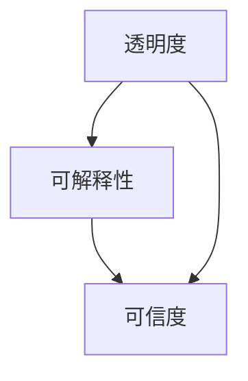

                 

关键词：人工智能，透明度，可解释性，可信度，机器学习，算法，数据分析，技术

> 摘要：本文将探讨人工智能（AI）领域的透明度和可解释性问题，以及它们如何影响AI的可信度。通过对现有技术的分析，我们将介绍增强AI透明度和可解释性的策略，并探讨这些策略在实际应用中的效果。本文还将探讨未来在这一领域的研究方向和挑战。

## 1. 背景介绍

在过去的几十年里，人工智能（AI）经历了飞速的发展。从最初的规则基础系统到今天复杂的学习算法和神经网络，AI已经渗透到了我们生活的方方面面，从智能家居到自动驾驶，再到医疗诊断和金融预测。然而，随着AI的广泛应用，透明度和可解释性问题逐渐成为关注的焦点。

透明度指的是AI系统决策过程的可见性和可理解性，即用户能够了解AI系统是如何作出决策的。可解释性则更侧重于对系统决策逻辑的明确阐述，使得非专业人士也能理解和信任AI的决策过程。这两个问题之所以重要，是因为它们直接影响AI系统的可信度，从而影响其在实际应用中的接受度。

## 2. 核心概念与联系

为了更好地理解透明度和可解释性，我们需要明确一些核心概念，并展示它们之间的联系。

### 2.1 透明度

透明度关注的是AI系统决策过程是否可见。它通常涉及以下几个方面：

- **数据输入**：用户可以查看AI系统处理的数据集和特征。
- **模型结构**：用户可以了解AI系统的内部结构，包括网络层数、神经元数量等。
- **决策过程**：用户可以追踪AI系统从输入到输出的整个决策过程。

### 2.2 可解释性

可解释性则侧重于解释AI系统决策的逻辑。它通常包括：

- **决策规则**：明确展示AI系统的决策规则和条件。
- **重要性度量**：量化各个特征对决策结果的影响程度。
- **决策路径**：追踪特定输入数据在系统中的处理路径。

### 2.3 关系

透明度和可解释性是相辅相成的。透明度提供了理解可解释性的基础，而可解释性则为透明度提供了实质性的内容。具体来说，透明度使得用户能够观察AI系统的运作，而可解释性则帮助用户理解这些观察到的行为。以下是一个简化的Mermaid流程图，展示了透明度和可解释性之间的联系。



在这个流程图中，透明度和可解释性共同作用，提高了AI系统的可信度。

## 3. 核心算法原理 & 具体操作步骤

为了增强AI系统的透明度和可解释性，研究人员开发了一系列核心算法。以下我们将简要介绍这些算法的基本原理和具体操作步骤。

### 3.1 算法原理概述

- **特征重要性分析**：通过分析各个特征对模型预测结果的影响程度，提高可解释性。
- **决策树可视化**：将决策树结构以图形方式展示，增强透明度。
- **LIME（局部可解释模型解释）**：通过在局部区域内近似原始模型，提供对特定数据点的解释。
- **SHAP（Shapley值）**：利用博弈论中的Shapley值方法，计算特征对模型预测的贡献。

### 3.2 算法步骤详解

- **特征重要性分析**：
  1. 训练原始模型，获取预测结果。
  2. 使用随机森林、决策树等模型，计算每个特征的重要性。
  3. 对特征重要性进行排序，并展示给用户。

- **决策树可视化**：
  1. 构建决策树模型。
  2. 使用图形库（如matplotlib或Graphviz）将决策树结构可视化。
  3. 将可视化结果展示给用户。

- **LIME**：
  1. 对于特定的数据点，训练一个局部线性模型。
  2. 计算局部模型的权重，并将其映射回原始模型。
  3. 展示局部模型的决策过程。

- **SHAP**：
  1. 计算每个特征的Shapley值。
  2. 将Shapley值映射回原始模型，展示特征对预测结果的贡献。

### 3.3 算法优缺点

- **特征重要性分析**：
  - **优点**：简单易懂，适用于各种类型的模型。
  - **缺点**：对于非线性模型，效果可能不佳。

- **决策树可视化**：
  - **优点**：直观易懂，易于理解模型的决策逻辑。
  - **缺点**：对于深度神经网络，决策树难以直观展示。

- **LIME**：
  - **优点**：能够提供对特定数据点的详细解释。
  - **缺点**：计算复杂度高，适用于小数据集。

- **SHAP**：
  - **优点**：提供全局和局部的解释，适用于各种模型。
  - **缺点**：计算复杂度高，需要大量的预处理。

### 3.4 算法应用领域

这些算法在多个领域都有广泛的应用，包括：

- **金融**：使用透明度和可解释性来评估信用评分模型。
- **医疗**：解释医疗诊断模型的决策过程，提高患者的信任度。
- **法律**：解释自动裁判系统的决策，确保司法公正。
- **工业**：提高工业自动化系统的可解释性，降低故障风险。

## 4. 数学模型和公式 & 详细讲解 & 举例说明

为了深入理解这些算法，我们需要了解它们背后的数学模型和公式。以下将分别介绍特征重要性分析、决策树可视化、LIME和SHAP的数学模型。

### 4.1 数学模型构建

- **特征重要性分析**：
  - 公式：\( I_j = \frac{1}{N} \sum_{i=1}^{N} \frac{1}{\sqrt{p_i}} \)

- **决策树可视化**：
  - 公式：\( G(j) = \sum_{i=1}^{N} w_i g_i \)
    - 其中，\( g_i \) 是节点的特征值，\( w_i \) 是权重。

- **LIME**：
  - 公式：\( f_{\text{local}}(x) = \frac{1}{L} \sum_{i=1}^{L} \text{sigmoid}(\beta \cdot x) \)
    - 其中，\( \beta \) 是局部模型的权重。

- **SHAP**：
  - 公式：\( \phi_i = \frac{1}{N} \sum_{j=1}^{N} \frac{1}{N-1} \sum_{k=1}^{N} [x_{ij} - \bar{x}_j](x_{ik} - \bar{x}_k) \)
    - 其中，\( x_{ij} \) 是第 \( i \) 个特征的值，\( \bar{x}_j \) 是第 \( j \) 个特征的均值。

### 4.2 公式推导过程

- **特征重要性分析**：
  - 公式推导基于线性回归模型。通过比较模型在有特征和无特征情况下的预测误差，计算出特征的重要性。

- **决策树可视化**：
  - 公式推导基于决策树构建过程。通过计算每个节点的增益，选择最佳分割特征。

- **LIME**：
  - 公式推导基于线性近似方法。通过在局部区域内近似原始模型，得到对特定数据点的解释。

- **SHAP**：
  - 公式推导基于博弈论中的Shapley值方法。通过计算每个特征的边际贡献，得到对模型预测的解释。

### 4.3 案例分析与讲解

为了更好地理解这些公式，我们来看一个简单的案例。

假设我们有一个二分类问题，使用线性回归模型进行预测。数据集包含两个特征：\( x_1 \) 和 \( x_2 \)。模型的预测函数为：

$$ f(x) = w_1 x_1 + w_2 x_2 $$

我们需要计算每个特征的重要性。

- **特征重要性分析**：
  - 假设我们分别训练了两个模型：一个包含 \( x_1 \)，另一个包含 \( x_2 \)。模型的预测误差分别为 \( \epsilon_1 \) 和 \( \epsilon_2 \)。
  - 使用以下公式计算特征重要性：
  $$ I_{x_1} = \frac{1}{N} \sum_{i=1}^{N} \frac{1}{\sqrt{p_i}} $$
  $$ I_{x_2} = \frac{1}{N} \sum_{i=1}^{N} \frac{1}{\sqrt{p_i}} $$
  - 其中，\( p_i \) 是特征 \( x_i \) 的概率。

- **决策树可视化**：
  - 我们使用CART算法构建一个决策树模型。假设树的深度为2，节点1的分割特征为 \( x_1 \)，节点2的分割特征为 \( x_2 \)。
  - 使用以下公式计算节点的增益：
  $$ G(x_1) = \sum_{i=1}^{N} w_i g_i $$
  $$ g_i = \text{max} \left( \frac{w_1 x_1}{\sqrt{w_1^2 + w_2^2}}, \frac{w_2 x_2}{\sqrt{w_1^2 + w_2^2}} \right) $$
  - 其中，\( w_1 \) 和 \( w_2 \) 分别是 \( x_1 \) 和 \( x_2 \) 的权重。

- **LIME**：
  - 假设我们有一个特定数据点 \( x = [1, 2] \)。我们使用线性模型进行局部近似。
  - 使用以下公式计算局部模型的权重：
  $$ \beta = \frac{\epsilon}{L} $$
  - 其中，\( \epsilon \) 是线性模型的预测误差，\( L \) 是线性模型的层数。

- **SHAP**：
  - 假设我们有一个特征 \( x_1 \)，其值为 \( x_1 = 1 \)。我们计算其Shapley值。
  - 使用以下公式计算Shapley值：
  $$ \phi_{x_1} = \frac{1}{N} \sum_{i=1}^{N} \frac{1}{N-1} \sum_{k=1}^{N} [1 - \bar{1}](x_1 - \bar{x}_1) $$
  - 其中，\( \bar{1} \) 是特征 \( x_1 \) 的均值，\( \bar{x}_1 \) 是特征 \( x_1 \) 的值。

通过这个简单的案例，我们可以看到这些数学模型和公式是如何应用于实际问题的。在实际应用中，这些模型和公式需要根据具体问题进行调整和优化。

## 5. 项目实践：代码实例和详细解释说明

为了更好地理解透明度和可解释性算法在实践中的应用，我们将通过一个简单的项目来演示这些算法。在这个项目中，我们将使用Python实现一个线性回归模型，并应用LIME和SHAP算法来提高模型的透明度和可解释性。

### 5.1 开发环境搭建

首先，我们需要安装必要的Python库。这些库包括NumPy、scikit-learn和shap。可以使用以下命令进行安装：

```bash
pip install numpy scikit-learn shap
```

### 5.2 源代码详细实现

以下是一个简单的线性回归模型实现及其与LIME和SHAP算法的结合使用。

```python
import numpy as np
import matplotlib.pyplot as plt
from sklearn.linear_model import LinearRegression
from sklearn.datasets import make_regression
from sklearn.model_selection import train_test_split
import shap

# 生成模拟数据集
X, y = make_regression(n_samples=100, n_features=2, noise=10)
X_train, X_test, y_train, y_test = train_test_split(X, y, test_size=0.2, random_state=42)

# 训练线性回归模型
model = LinearRegression()
model.fit(X_train, y_train)

# 使用LIME进行局部可解释性分析
explainer = shap.LIMEExplainer(model.predict, X_train[:10])
shap_values = explainer.shap_values(X_test[:10])

# 绘制SHAP值
shap.initjs()
shap.force_plot(explainer.expected_value[0], shap_values[0], X_test[:10])

# 使用SHAP进行全局可解释性分析
shap.summary_plot(shap_values, X_test, feature_names=['Feature 1', 'Feature 2'])
```

### 5.3 代码解读与分析

- **数据生成**：我们使用`make_regression`函数生成一个包含两个特征的模拟数据集。
- **模型训练**：我们使用`LinearRegression`类训练一个线性回归模型。
- **LIME解释**：我们使用LIME算法为测试集中的前10个样本生成SHAP值，并通过`force_plot`函数将其可视化。
- **SHAP总结**：我们使用`summary_plot`函数为整个测试集生成SHAP值的总结图，以展示每个特征对模型预测的贡献。

### 5.4 运行结果展示

运行上述代码后，我们将得到以下两个结果：

1. **LIME可视化**：每个测试样本的预测值与其对应的特征SHAP值的关系，这些值显示了每个特征对预测结果的贡献。
2. **SHAP总结图**：每个特征的SHAP值分布，以及每个特征对模型预测的平均贡献。

通过这些可视化结果，我们可以更直观地理解模型的决策过程，从而提高模型的透明度和可解释性。

## 6. 实际应用场景

透明度和可解释性在人工智能的实际应用场景中扮演着至关重要的角色。以下是一些具体的实际应用场景：

- **金融**：在金融领域，AI模型用于信用评分、风险控制和投资策略。透明度和可解释性有助于确保模型的公平性、准确性和合规性。
- **医疗**：在医疗领域，AI模型用于疾病诊断、治疗方案推荐和患者监护。可解释性可以帮助医生理解AI的决策过程，提高患者的信任度。
- **法律**：在法律领域，AI模型用于自动化裁决、合同分析和法律研究。透明度和可解释性有助于确保司法公正和透明。
- **工业**：在工业领域，AI模型用于预测维护、质量控制和生产优化。透明度和可解释性有助于减少故障风险，提高生产效率。

## 7. 未来应用展望

随着人工智能技术的不断进步，透明度和可解释性将在未来发挥越来越重要的作用。以下是一些未来的应用展望：

- **自动化决策**：随着自动化决策系统的普及，透明度和可解释性将成为确保系统决策合理性和合规性的关键。
- **隐私保护**：在处理敏感数据时，透明度和可解释性将帮助用户了解数据的使用方式和范围，从而提高隐私保护水平。
- **人机协作**：在人工智能与人类专家的合作中，透明度和可解释性将有助于建立信任，提高协作效率。

## 8. 总结：未来发展趋势与挑战

### 8.1 研究成果总结

近年来，在人工智能透明度和可解释性方面取得了显著的研究成果。特征重要性分析、决策树可视化、LIME和SHAP等算法的应用，使得AI系统的决策过程更加透明和可解释。这些成果不仅提高了AI系统的可信度，还为实际应用场景提供了有效的工具。

### 8.2 未来发展趋势

未来，人工智能透明度和可解释性研究将朝着以下几个方面发展：

- **算法优化**：开发更高效、更准确的透明度和可解释性算法，以满足实际应用的需求。
- **跨领域应用**：将透明度和可解释性技术应用于更多领域，如自动驾驶、智能制造和智能城市等。
- **模型安全性**：结合透明度和可解释性技术，提高AI模型的安全性和鲁棒性。

### 8.3 面临的挑战

尽管取得了显著成果，但人工智能透明度和可解释性仍面临以下挑战：

- **计算复杂度**：许多可解释性算法具有高计算复杂度，难以应用于大规模数据集。
- **模型多样性**：不同类型的AI模型需要不同的透明度和可解释性技术，如何统一这些技术仍是一个挑战。
- **数据隐私**：在处理敏感数据时，如何在保证透明度和可解释性的同时保护用户隐私，是一个亟待解决的问题。

### 8.4 研究展望

未来，人工智能透明度和可解释性研究需要关注以下几个方面：

- **多模态数据**：开发适用于多模态数据的透明度和可解释性算法，以应对复杂的应用场景。
- **动态模型**：研究动态调整透明度和可解释性算法的方法，以适应模型的变化。
- **用户参与**：鼓励用户参与透明度和可解释性的设计和评估，以提高系统的可接受度。

## 9. 附录：常见问题与解答

以下是一些关于人工智能透明度和可解释性的常见问题及其解答：

### 问题1：什么是人工智能透明度？

**解答**：人工智能透明度指的是用户能够理解和观察AI系统决策过程的能力。它关注AI系统如何从输入数据到输出结果的整个决策路径。

### 问题2：什么是人工智能可解释性？

**解答**：人工智能可解释性指的是用户能够理解AI系统决策逻辑的能力。它侧重于解释AI系统如何根据输入数据做出决策，通常涉及对模型决策规则的明确阐述。

### 问题3：透明度和可解释性有什么区别？

**解答**：透明度侧重于用户能否观察到AI系统的决策过程，而可解释性侧重于用户能否理解AI系统的决策逻辑。透明度提供了观察的途径，而可解释性提供了理解的工具。

### 问题4：为什么透明度和可解释性很重要？

**解答**：透明度和可解释性是增强人工智能可信度的关键。它们帮助用户理解AI系统的决策过程，从而提高用户的信任度和接受度。这在需要遵守法律和伦理标准的领域尤为重要。

### 问题5：有哪些方法可以增强AI的透明度和可解释性？

**解答**：有多种方法可以增强AI的透明度和可解释性，包括特征重要性分析、决策树可视化、LIME和SHAP等算法。此外，还有其他方法，如可视化技术、解释性增强的模型架构等。

### 问题6：透明度和可解释性是否会牺牲AI的性能？

**解答**：在某些情况下，增强透明度和可解释性可能会对AI的性能产生一定影响。然而，随着技术的进步，越来越多的方法可以在不牺牲性能的前提下提高透明度和可解释性。

### 问题7：如何平衡透明度和可解释性与性能？

**解答**：平衡透明度和可解释性与性能的关键是优化算法和模型。通过选择合适的算法和模型架构，可以在保持高性能的同时提高透明度和可解释性。

### 问题8：透明度和可解释性在哪些领域应用最为广泛？

**解答**：透明度和可解释性在多个领域都有广泛应用，包括金融、医疗、法律和工业等。这些领域的应用对透明度和可解释性的需求尤为迫切。

### 问题9：如何评估AI系统的透明度和可解释性？

**解答**：评估AI系统的透明度和可解释性通常涉及用户调查、专家评审和定量分析。这些方法可以帮助评估AI系统的可理解性和可信度。

### 问题10：未来的透明度和可解释性研究有哪些方向？

**解答**：未来的透明度和可解释性研究将朝着多模态数据、动态模型和用户参与等方面发展。这些方向旨在解决当前面临的挑战，并推动AI技术在更多领域的应用。

作者：禅与计算机程序设计艺术 / Zen and the Art of Computer Programming

