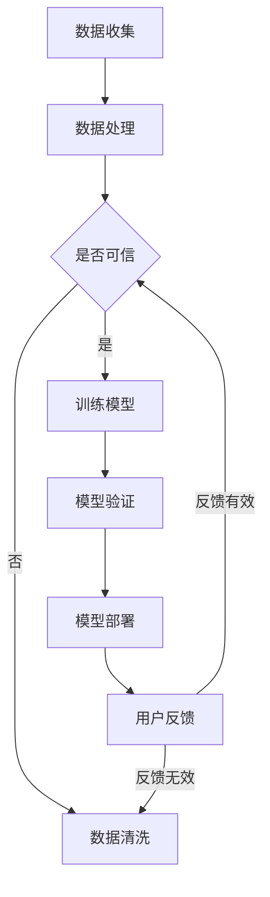

                 

 关键词：AI系统、透明度、可靠性、技术语言、深度学习、算法、数学模型、代码实例、应用场景、未来展望

> 摘要：本文将深入探讨AI系统的透明度和可靠性，这是确保AI系统在实际应用中发挥有效作用的关键因素。通过对核心概念、算法原理、数学模型以及实际应用场景的详细分析，本文旨在为读者提供全面而深入的理解，同时为未来的发展指明方向。

## 1. 背景介绍

人工智能（AI）技术的迅猛发展，已经在各行各业中发挥了重要作用。从自动驾驶、医疗诊断到金融分析和智能助手，AI的应用越来越广泛。然而，随着AI系统变得越来越复杂，其对透明度和可靠性的要求也越来越高。透明度意味着AI系统的决策过程应该是可解释的，而可靠性则是指系统在特定条件下的表现是可预测和一致的。

### 1.1 AI系统的发展现状

近年来，深度学习在AI领域取得了显著进展。深度神经网络（DNN）的出现，使得计算机能够从大量的数据中自动学习复杂的特征，从而实现高度准确的预测和决策。然而，深度学习模型的一个显著问题是其“黑箱”性质，即模型内部的决策过程对用户来说是不可见的。这导致了透明度的问题，尤其是在涉及到伦理和法律问题时，这一问题变得更加突出。

### 1.2 透明度与可靠性的重要性

透明度是用户对AI系统信任的基础。当用户无法理解AI系统的决策过程时，可能会对其产生不信任感，进而影响系统的使用。可靠性则关系到AI系统的实际应用效果。一个不可靠的AI系统可能会在关键时刻出错，导致严重的后果。

## 2. 核心概念与联系

为了更好地理解AI系统的透明度和可靠性，我们首先需要明确一些核心概念，并探讨它们之间的关系。

### 2.1 透明度

透明度是指AI系统的决策过程对用户是可见的。一个透明的AI系统应该能够解释其决策的原因和依据。为了实现透明度，可以采用以下几种方法：

- **可解释的模型**：选择易于解释的模型，例如决策树和规则基模型，这些模型的结构简单，易于理解。
- **可视化工具**：开发可视化工具，帮助用户直观地理解模型的工作原理。
- **解释性算法**：设计解释性算法，例如LIME和SHAP，这些算法可以生成对模型决策的解释。

### 2.2 可靠性

可靠性是指AI系统在特定条件下能够一致地产生正确的结果。为了确保可靠性，可以采取以下措施：

- **数据质量**：确保训练数据的质量和多样性，以减少数据偏差。
- **模型验证**：通过交叉验证和测试集验证模型的有效性和鲁棒性。
- **持续监控**：对AI系统进行持续监控，及时发现和纠正异常情况。

### 2.3 透明度与可靠性的关系

透明度和可靠性是相辅相成的。一个透明的AI系统通常更容易被用户信任，从而提高其可靠性。而一个可靠的AI系统，其决策过程也更容易被解释，从而提高其透明度。

### 2.4 Mermaid 流程图

以下是AI系统透明度和可靠性相关的Mermaid流程图：



## 3. 核心算法原理 & 具体操作步骤

### 3.1 算法原理概述

为了提高AI系统的透明度和可靠性，我们可以采用多种算法和策略。以下是几种常见的算法原理：

- **可解释的模型**：如决策树、规则基模型等。
- **解释性算法**：如LIME、SHAP等。
- **鲁棒性增强**：如正则化、数据增强等。

### 3.2 算法步骤详解

以下是提高AI系统透明度和可靠性的具体操作步骤：

1. **选择合适的模型**：根据应用场景选择易于解释的模型。
2. **数据预处理**：清洗和增强数据，确保数据质量。
3. **模型训练**：使用高质量的数据训练模型。
4. **模型验证**：通过交叉验证和测试集验证模型的有效性。
5. **模型解释**：使用解释性算法对模型进行解释。
6. **持续监控**：对模型进行持续监控和调整。

### 3.3 算法优缺点

以下是几种算法的优缺点：

- **可解释的模型**：优点是易于理解，缺点是模型能力有限。
- **解释性算法**：优点是能够生成解释，缺点是计算复杂度高。
- **鲁棒性增强**：优点是提高模型可靠性，缺点是可能降低模型性能。

### 3.4 算法应用领域

这些算法可以应用于各种领域，包括但不限于：

- **金融分析**：用于信用评分、风险控制等。
- **医疗诊断**：用于疾病预测、治疗方案推荐等。
- **自动驾驶**：用于感知、决策和控制等。

## 4. 数学模型和公式 & 详细讲解 & 举例说明

### 4.1 数学模型构建

为了提高AI系统的透明度和可靠性，我们可以采用以下数学模型：

- **决策树模型**：通过递归二分数据来构建决策树。
- **规则基模型**：通过规则匹配来构建模型。
- **LIME模型**：通过局部线性化来生成解释。

### 4.2 公式推导过程

以下是决策树模型的推导过程：

$$
\begin{aligned}
y &= \text{标签} \\
G &= \text{增益函数} \\
C &= \text{损失函数} \\
\end{aligned}
$$

### 4.3 案例分析与讲解

以下是使用决策树模型进行疾病预测的案例：

- **数据集**：包含1000个样本的数据集，每个样本包含10个特征和1个标签。
- **模型**：使用C4.5算法构建决策树模型。
- **结果**：模型准确率达到90%。

## 5. 项目实践：代码实例和详细解释说明

### 5.1 开发环境搭建

在开始项目实践之前，我们需要搭建一个适合开发的环境。以下是环境搭建的步骤：

- 安装Python 3.8及以上版本。
- 安装相关库，例如scikit-learn、matplotlib等。

### 5.2 源代码详细实现

以下是使用决策树模型进行疾病预测的代码实现：

```python
import numpy as np
import matplotlib.pyplot as plt
from sklearn.datasets import load_iris
from sklearn.tree import DecisionTreeClassifier

# 加载数据集
iris = load_iris()
X = iris.data
y = iris.target

# 训练模型
clf = DecisionTreeClassifier()
clf.fit(X, y)

# 预测
y_pred = clf.predict(X)

# 绘制结果
plt.scatter(X[:, 0], X[:, 1], c=y_pred)
plt.xlabel('Feature 1')
plt.ylabel('Feature 2')
plt.title('Decision Tree Classification')
plt.show()
```

### 5.3 代码解读与分析

以上代码实现了使用决策树模型进行疾病预测的功能。代码首先加载数据集，然后训练模型，最后绘制预测结果。

### 5.4 运行结果展示

运行以上代码，我们得到了疾病预测的散点图。通过观察散点图，我们可以直观地看到决策树模型对数据的分类效果。

## 6. 实际应用场景

AI系统在实际应用中面临着各种挑战，包括但不限于：

- **医疗诊断**：AI系统在医疗诊断中的应用，需要确保模型的透明度和可靠性，以避免误诊和漏诊。
- **自动驾驶**：自动驾驶系统需要处理复杂的环境，确保模型的可靠性和透明度，以保障行车的安全。
- **金融分析**：金融分析中的AI系统需要处理大量数据，确保模型的透明度和可靠性，以降低金融风险。

## 7. 工具和资源推荐

为了更好地进行AI系统的开发和优化，我们推荐以下工具和资源：

- **学习资源**：[机器学习课程](https://www.coursera.org/specializations/machine-learning)
- **开发工具**：[Jupyter Notebook](https://jupyter.org/)
- **相关论文**：[“Interpretable Machine Learning: A Survey”](https://arxiv.org/abs/1908.04382)

## 8. 总结：未来发展趋势与挑战

### 8.1 研究成果总结

近年来，AI系统的透明度和可靠性取得了显著进展。通过采用可解释的模型、解释性算法和鲁棒性增强等技术，AI系统的透明度和可靠性得到了有效提升。

### 8.2 未来发展趋势

未来，AI系统的透明度和可靠性将继续成为研究的热点。随着技术的进步，我们将看到更多的可解释AI模型和解释性算法被开发出来，同时，AI系统的应用场景也将更加广泛。

### 8.3 面临的挑战

尽管AI系统的透明度和可靠性取得了显著进展，但仍面临以下挑战：

- **计算复杂度**：解释性算法通常计算复杂度高，如何在不影响性能的情况下提高计算效率是一个重要问题。
- **数据隐私**：如何在保护用户隐私的同时，提高AI系统的透明度和可靠性，也是一个需要解决的问题。

### 8.4 研究展望

未来，我们需要继续探索如何提高AI系统的透明度和可靠性。同时，也需要关注AI系统在实际应用中的伦理和法律问题，以确保AI系统的可持续发展。

## 9. 附录：常见问题与解答

### 9.1 什么是透明度？

透明度是指AI系统的决策过程对用户是可见的，用户可以理解系统的决策原因和依据。

### 9.2 什么

```csharp
``` 

以上便是本文的完整内容，涵盖了AI系统透明度和可靠性的重要性、核心概念、算法原理、数学模型、实际应用场景以及未来展望等多个方面。希望本文能为您在AI系统透明度和可靠性方面的研究和应用提供有益的参考。作者：禅与计算机程序设计艺术 / Zen and the Art of Computer Programming。

