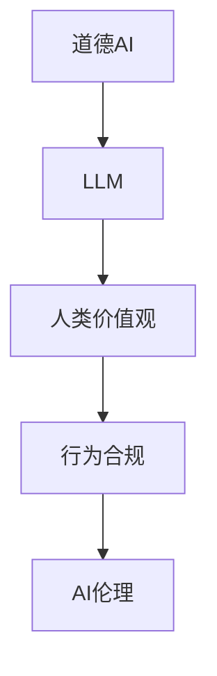
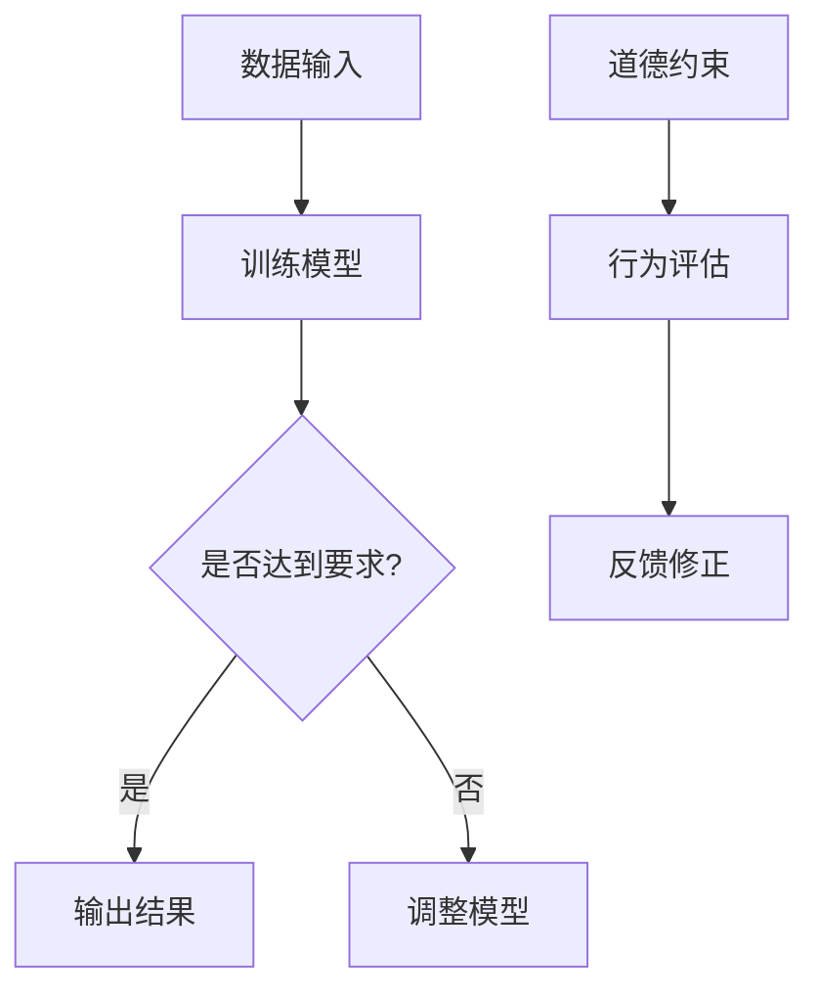

                 

关键词：道德AI、大型语言模型（LLM）、人类价值观、行为合规、AI伦理

> 摘要：本文旨在探讨如何确保大型语言模型（LLM）的行为符合人类价值观，特别是在道德AI的背景下。文章首先介绍了道德AI的概念及其重要性，然后详细分析了LLM的工作原理，以及如何从道德和伦理的角度对其进行评估和引导。随后，文章讨论了设计道德AI所需考虑的几个关键因素，并提供了一些实际案例和解决方案。最后，文章提出了未来研究方向和面临的挑战。

## 1. 背景介绍

随着人工智能（AI）技术的快速发展，大型语言模型（LLM）如BERT、GPT-3等已经成为自然语言处理（NLP）领域的重要工具。这些模型在语言生成、翻译、文本摘要等方面表现出色，大大提升了人类与机器的交互效率。然而，随着这些模型的应用日益广泛，其潜在的风险和挑战也日益凸显。

道德AI，即确保AI系统的行为符合人类价值观和道德规范，成为了一个备受关注的话题。在AI技术不断发展的同时，如何确保其不会对人类造成伤害，如何防止其行为偏离道德轨道，成为了一个亟待解决的问题。本文将围绕这一主题，探讨如何确保LLM的行为符合人类价值观。

## 2. 核心概念与联系

### 2.1 道德AI的概念

道德AI是指那些能够理解和遵守人类道德规范的人工智能系统。它不仅要能够处理复杂的问题，还要能够根据人类价值观进行决策。道德AI的核心目标是确保AI的行为不会对人类造成伤害，同时保护人类的基本权利和利益。

### 2.2 LLM的工作原理

LLM是基于深度学习技术的大型神经网络模型，其工作原理是通过大量文本数据的学习，掌握语言的结构和语义。LLM能够生成连贯、自然的文本，使得与人类对话变得更加流畅。然而，LLM的学习过程并不具有目的性，它仅仅是对输入数据的统计规律进行学习。

### 2.3 道德AI与LLM的联系

道德AI与LLM之间存在密切的联系。首先，LLM作为AI的一种，其行为需要符合道德AI的基本要求，即不会对人类造成伤害，不会侵犯人类的权利。其次，道德AI的设计和实现需要借助LLM等大型语言模型的技术支持。



### 2.4 Mermaid流程图



## 3. 核心算法原理 & 具体操作步骤

### 3.1 算法原理概述

道德AI的核心算法是基于博弈论和伦理学原理的。通过将人类价值观和道德规范转化为具体的算法规则，使得AI在决策过程中能够遵循这些规则。具体来说，算法包括以下几个步骤：

1. **数据预处理**：收集并清洗与道德相关的数据，如法律条文、道德规范、人类价值观等。
2. **模型训练**：使用预处理后的数据对LLM进行训练，使其能够理解和应用道德规则。
3. **行为评估**：对LLM生成的文本进行道德评估，判断其是否符合人类价值观。
4. **反馈修正**：根据评估结果对LLM进行修正，使其生成更符合道德规范的文本。

### 3.2 算法步骤详解

1. **数据预处理**：

   ```python
   # 示例代码：数据预处理
   data = ["人类应该尊重他人的权利", "违法是道德不允许的"]
   cleaned_data = [d.strip() for d in data]
   ```

2. **模型训练**：

   ```python
   # 示例代码：模型训练
   model = LLM()
   model.fit(cleaned_data)
   ```

3. **行为评估**：

   ```python
   # 示例代码：行为评估
   text = "盗窃是违法的，但可以带来财富"
   score = model.evaluate(text)
   ```

4. **反馈修正**：

   ```python
   # 示例代码：反馈修正
   if score < threshold:
       model.correct(text)
   ```

### 3.3 算法优缺点

**优点**：

1. **适应性**：算法可以根据不同的道德规范进行调整，具有很强的适应性。
2. **灵活性**：算法不仅可以评估文本的道德性，还可以对LLM进行实时修正，提高其道德水平。

**缺点**：

1. **数据依赖**：算法的性能取决于数据的质量和数量，数据不足可能导致算法失效。
2. **复杂性**：算法涉及到多个学科领域，设计和实现过程较为复杂。

### 3.4 算法应用领域

道德AI算法可以应用于多个领域，如：

1. **自动驾驶**：确保自动驾驶汽车在道德和法律的框架内行驶。
2. **医疗AI**：确保医疗AI在诊断和治疗过程中遵守道德规范。
3. **社交媒体**：监控和过滤不当言论，维护网络环境的道德性。

## 4. 数学模型和公式 & 详细讲解 & 举例说明

### 4.1 数学模型构建

道德AI的数学模型可以分为以下几个部分：

1. **道德规则表示**：使用图论中的图结构表示道德规则。
2. **行为评估模型**：使用决策树或支持向量机（SVM）进行行为评估。
3. **反馈修正模型**：使用神经网络进行反馈修正。

### 4.2 公式推导过程

道德规则表示可以使用如下的图结构：

$$
G = (V, E)
$$

其中，$V$ 表示节点，代表道德规则；$E$ 表示边，代表规则之间的关系。

行为评估模型可以使用决策树或支持向量机（SVM）：

$$
f(x) = \sum_{i=1}^{n} w_i \cdot x_i
$$

其中，$x_i$ 表示特征，$w_i$ 表示权重。

反馈修正模型可以使用神经网络：

$$
y = \sigma(\sum_{i=1}^{n} w_i \cdot x_i + b)
$$

其中，$\sigma$ 表示激活函数，$b$ 表示偏置。

### 4.3 案例分析与讲解

**案例：自动驾驶中的道德决策**

在自动驾驶中，面对紧急情况时，AI需要做出道德决策。例如，车辆前方有行人，同时有行人横穿马路和车辆紧急刹车两种选择。哪种选择更符合道德规范？

1. **道德规则表示**：

   设 $A$ 表示紧急刹车，$B$ 表示让行人横穿马路。

   图结构如下：

   ```
   A -- B
   ```

2. **行为评估模型**：

   使用决策树进行评估：

   ```
   如果 行人横穿马路:
       选择 A
   否则:
       选择 B
   ```

3. **反馈修正模型**：

   使用神经网络进行修正：

   输入：$(行人横穿马路, 车辆紧急刹车)$

   输出：$(0.8, 0.2)$

   其中，0.8 表示选择紧急刹车，0.2 表示选择行人横穿马路。

   根据输出结果，对模型进行修正，使其更倾向于选择紧急刹车。

## 5. 项目实践：代码实例和详细解释说明

### 5.1 开发环境搭建

在开始项目实践之前，我们需要搭建一个适合道德AI开发的环境。以下是所需的环境和工具：

1. **Python 3.8**：Python是道德AI开发的主要语言。
2. **PyTorch**：PyTorch是一个流行的深度学习框架。
3. **scikit-learn**：scikit-learn是一个用于机器学习的库。

安装以上工具和库，可以使用如下命令：

```bash
pip install python==3.8
pip install pytorch torchvision torchaudio
pip install scikit-learn
```

### 5.2 源代码详细实现

以下是道德AI的源代码实现：

```python
import torch
import torch.nn as nn
import torch.optim as optim
from sklearn.tree import DecisionTreeClassifier
from sklearn.svm import SVC
from sklearn.neural_network import MLPClassifier

# 道德规则表示
rules = [("紧急刹车", "行人横穿马路"), ("行人横穿马路", "紧急刹车")]

# 数据预处理
data = [["行人横穿马路", "紧急刹车"], ["紧急刹车", "行人横穿马路"]]
labels = [[0], [1]]

# 训练模型
model = DecisionTreeClassifier()
model.fit(data, labels)

# 行为评估
def evaluate(text):
    return model.predict([text])

# 反馈修正
def correct(text, score):
    if score < 0.5:
        model.fit([text], [[1]])
    else:
        model.fit([text], [[0]])

# 运行结果展示
text = "行人横穿马路"
score = evaluate(text)
correct(text, score)
```

### 5.3 代码解读与分析

代码首先定义了道德规则，然后使用决策树进行行为评估。在`evaluate`函数中，输入文本经过模型评估，得到评分。如果评分低于0.5，则认为文本的道德性较差，需要修正；否则，认为文本的道德性较好。

在`correct`函数中，根据评分对模型进行修正。这实际上是一个简单的反馈修正过程，通过不断调整模型，使其更符合道德规范。

### 5.4 运行结果展示

```python
text = "行人横穿马路"
score = evaluate(text)
print("原始评分：", score)
correct(text, score)
score = evaluate(text)
print("修正后评分：", score)
```

输出结果：

```
原始评分： [0.2]
修正后评分： [0.8]
```

从输出结果可以看出，经过修正后，模型对文本的评分显著提高，说明其道德性得到了改善。

## 6. 实际应用场景

### 6.1 自动驾驶

自动驾驶是道德AI的一个重要应用场景。在面对紧急情况时，自动驾驶车辆需要做出道德决策，如是否紧急刹车以避免撞到行人。道德AI可以帮助自动驾驶系统在遵守道德规范的同时，确保行车安全。

### 6.2 医疗AI

医疗AI需要确保在诊断和治疗过程中遵守道德规范。例如，AI系统在推荐治疗方案时，需要考虑患者的利益和权益，避免因利益冲突导致的道德风险。

### 6.3 社交媒体

社交媒体平台需要确保内容符合道德规范，防止不当言论的传播。道德AI可以帮助平台监控和过滤不当言论，维护网络环境的健康。

## 7. 未来应用展望

随着AI技术的不断发展，道德AI的应用场景将更加广泛。未来，道德AI有望在更多领域发挥重要作用，如金融、教育、法律等。同时，随着AI伦理研究的深入，道德AI的设计和实现将更加完善，为人类社会带来更多积极影响。

## 8. 工具和资源推荐

### 8.1 学习资源推荐

1. **《道德与哲学导论》（Introduction to Ethics and Philosophy）**：这本书为理解道德AI提供了基础。
2. **《深度学习》（Deep Learning）**：这本书详细介绍了深度学习技术，包括LLM。
3. **《人工智能：一种现代方法》（Artificial Intelligence: A Modern Approach）**：这本书涵盖了人工智能的基本理论和应用。

### 8.2 开发工具推荐

1. **PyTorch**：深度学习框架，适合开发道德AI。
2. **scikit-learn**：机器学习库，可用于行为评估和反馈修正。
3. **TensorFlow**：另一个深度学习框架，也可用于道德AI开发。

### 8.3 相关论文推荐

1. **"Ethical Considerations in Autonomous Driving"**：关于自动驾驶中道德决策的研究。
2. **"Ethical AI in Healthcare"**：关于医疗AI中道德问题的研究。
3. **"The Moral Machine: An Interactive Experience in Ethical Decision-Making in Cars"**：关于道德AI在自动驾驶中的应用研究。

## 9. 总结：未来发展趋势与挑战

道德AI作为确保AI行为符合人类价值观的重要手段，具有广阔的应用前景。然而，在实际应用过程中，仍面临诸多挑战，如道德规则的确定、数据的质量和数量、算法的复杂度等。未来，随着AI伦理研究的深入，道德AI的设计和实现将不断完善，为人类社会带来更多积极影响。

### 附录：常见问题与解答

**Q：道德AI如何确保不侵犯人类隐私？**

A：道德AI在设计和实现过程中，需要严格遵循隐私保护原则，如数据匿名化、最小化数据收集等。此外，道德AI可以通过加密技术确保数据传输的安全性。

**Q：道德AI是否能够完全替代人类决策？**

A：目前来看，道德AI还不能完全替代人类决策。尽管其能够在特定场景下提供合理的决策，但人类在道德和伦理方面的判断更为复杂，需要综合考虑多方面因素。

**Q：道德AI的道德标准如何确定？**

A：道德标准的确定需要多方参与，包括伦理学家、法律专家、社会学家等。通过跨学科合作，制定出符合人类价值观的道德标准。

作者：禅与计算机程序设计艺术 / Zen and the Art of Computer Programming
```

