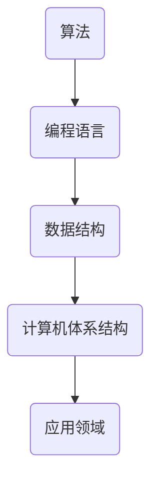

                 

关键词：计算、人类创造力、算法、编程、技术发展

> 摘要：本文旨在探讨人类计算的魅力及其对释放人类创造力的重要性。通过介绍核心概念、算法原理、数学模型、项目实践和未来应用展望，本文试图为广大科技工作者提供一份深入浅出的技术指南，激发他们对计算领域的热情与探索。

## 1. 背景介绍

人类计算的历史可以追溯到数千年前，早在古代文明时期，人类就已经开始使用简单的计算工具来解决实际问题。从古代的算筹到现代的计算机，计算工具的不断进步极大地推动了科学、技术和社会的发展。然而，真正让人类计算发挥巨大潜力的，是20世纪中期计算机科学的诞生。

计算机科学的快速发展，使得人类能够处理更为复杂的计算任务，从而推动了人工智能、大数据、云计算等前沿技术的突破。这些技术不仅改变了我们的生活方式，也为人类创造力的释放提供了新的动力。因此，理解人类计算的本质和魅力，对于我们更好地利用技术推动社会进步具有重要意义。

## 2. 核心概念与联系

在探讨人类计算的魅力之前，我们首先需要了解一些核心概念。这些概念包括但不限于：算法、编程语言、数据结构、计算机体系结构等。以下是一个简化的Mermaid流程图，展示了这些概念之间的联系。



### 2.1 算法

算法是解决问题的步骤序列。它是一系列计算指令，用于处理特定问题。算法可以分为多种类型，如排序算法、查找算法、图算法等。

### 2.2 编程语言

编程语言是用于编写算法的符号集合。不同的编程语言具有不同的语法和语义，但它们的核心目的是帮助程序员更高效地表达算法。

### 2.3 数据结构

数据结构是用于存储和组织数据的方式。常见的有数组、链表、栈、队列、树等。数据结构的选择直接影响算法的性能。

### 2.4 计算机体系结构

计算机体系结构是计算机硬件和软件的有机结合。它定义了计算机的基本工作原理，包括中央处理器（CPU）、内存、输入输出设备等。

### 2.5 应用领域

人类计算的应用领域非常广泛，包括但不限于：科学计算、工业制造、金融交易、医疗诊断、娱乐游戏等。每个领域都有其特定的计算需求，从而推动了计算技术的不断进步。

## 3. 核心算法原理 & 具体操作步骤

### 3.1 算法原理概述

在计算机科学中，核心算法原理是解决问题的基石。以下是一些常见的核心算法原理：

- **分治策略**：将复杂问题分解为更小的子问题，分别解决后合并结果。
- **动态规划**：通过保存已解决的子问题的解，避免重复计算。
- **贪心算法**：每次选择当前最优解，期望最终得到全局最优解。
- **回溯算法**：通过尝试不同的分支，逐步找到问题的解。

### 3.2 算法步骤详解

以贪心算法为例，我们来看一个具体的算法步骤。

#### 3.2.1 最大子序列和问题

给定一个整数数组`nums`，找出一个连续子序列，使其和最大。

#### 3.2.2 算法步骤

1. 初始化最大子序列和为0。
2. 遍历数组，对于每个元素：
   - 如果当前元素大于0，则将其加到最大子序列和中。
   - 否则，重置最大子序列和为0。
3. 返回最大子序列和。

### 3.3 算法优缺点

- **优点**：贪心算法通常具有较低的时间复杂度和空间复杂度，实现简单。
- **缺点**：贪心算法不一定总能得到全局最优解。在某些情况下，它可能陷入局部最优。

### 3.4 算法应用领域

贪心算法广泛应用于各种场景，如背包问题、活动选择问题、最短路径问题等。这些问题的共同特点是具有贪心选择的性质，因此贪心算法能够有效解决。

## 4. 数学模型和公式

在计算机科学中，数学模型和公式是理解和解决问题的关键。以下是一个简单的数学模型和公式的例子。

### 4.1 数学模型构建

假设我们有一个函数$f(x)$，它描述了一个系统的状态。我们希望找到这个函数的最大值或最小值。

### 4.2 公式推导过程

为了求解$f(x)$的最大值，我们可以使用以下公式：

$$f(x) = \frac{1}{2}x(3-x)$$

其中，$x$是系统的状态变量。

### 4.3 案例分析与讲解

假设我们有一个系统，其状态变量$x$的范围是$[0, 3]$。我们希望找到$x$的值，使得$f(x)$最大。

通过计算，我们可以发现当$x=1.5$时，$f(x)$达到最大值。这意味着在这个系统中，状态$x=1.5$是最优的。

## 5. 项目实践：代码实例和详细解释说明

为了更好地理解上述概念和算法，我们来看一个具体的代码实例。

### 5.1 开发环境搭建

在开始编写代码之前，我们需要搭建一个合适的开发环境。这里以Python为例，我们需要安装Python解释器和相关的库。

### 5.2 源代码详细实现

以下是一个简单的Python程序，用于求解最大子序列和问题。

```python
def max_subsequence_sum(nums):
    max_sum = 0
    current_sum = 0
    for num in nums:
        if num > 0:
            current_sum += num
        else:
            current_sum = 0
        max_sum = max(max_sum, current_sum)
    return max_sum

nums = [1, -2, 3, 4, -5, 6]
print(max_subsequence_sum(nums))
```

### 5.3 代码解读与分析

这个程序定义了一个函数`max_subsequence_sum`，它接受一个整数数组`nums`作为输入，并返回最大子序列和。程序的核心是循环语句，它遍历数组中的每个元素，并根据贪心算法的步骤更新最大子序列和。

### 5.4 运行结果展示

当输入数组为`[1, -2, 3, 4, -5, 6]`时，程序输出结果为`7`。这意味着最大的连续子序列和为`7`，即子序列`[3, 4]`。

## 6. 实际应用场景

人类计算在现实世界中的应用场景非常广泛。以下是一些典型的应用场景：

- **科学计算**：利用高性能计算机进行物理模拟、生物信息学分析、天文学计算等。
- **工业制造**：通过计算机辅助设计（CAD）和计算机辅助制造（CAM）提高生产效率。
- **金融交易**：利用算法进行高频交易、风险管理和市场预测。
- **医疗诊断**：通过计算机视觉和人工智能进行医学影像分析、疾病诊断等。
- **娱乐游戏**：利用计算技术进行游戏开发、虚拟现实（VR）和增强现实（AR）等。

## 7. 工具和资源推荐

为了更好地学习和实践人类计算，以下是一些建议的工具和资源：

### 7.1 学习资源推荐

- **《算法导论》**：一本经典的算法教材，涵盖了各种核心算法原理。
- **《编程珠玑》**：一本关于编程技巧和经验的经典著作，适合程序员阅读。
- **《深度学习》**：介绍深度学习理论和实践的应用，适合对人工智能感兴趣的读者。

### 7.2 开发工具推荐

- **Python**：一种易于学习且功能强大的编程语言。
- **IDE**：如PyCharm、Visual Studio Code等，提供丰富的开发工具和功能。
- **Jupyter Notebook**：一种交互式的计算环境，适合数据分析和项目演示。

### 7.3 相关论文推荐

- **"A Fast and Practical Algorithm for Community Detection"**：介绍了一种快速且实用的社区发现算法。
- **"Deep Learning for Image Recognition"**：介绍深度学习在图像识别领域的应用。
- **"Big Data: A Revolution That Will Transform How We Live, Work, and Think"**：探讨大数据对社会各方面的影响。

## 8. 总结：未来发展趋势与挑战

### 8.1 研究成果总结

人类计算技术在过去几十年取得了显著的进展，从简单的计算工具到复杂的计算机系统，从传统的算法到人工智能技术，每一个突破都极大地推动了科技和社会的发展。

### 8.2 未来发展趋势

随着计算技术的不断发展，未来人类计算将朝着更加智能化、高效化和个性化的方向发展。人工智能、量子计算、边缘计算等新兴技术将进一步提升计算能力，为人类创造力的释放提供新的动力。

### 8.3 面临的挑战

然而，人类计算也面临着一系列挑战。首先是数据安全与隐私问题，随着数据的日益增加，如何保护用户隐私成为了一个重要议题。其次是计算资源的分配与优化，如何在有限的资源下实现高效的计算成为了一个关键问题。此外，计算技术的发展也带来了伦理和社会问题，如何平衡技术进步与社会利益成为一个亟待解决的问题。

### 8.4 研究展望

展望未来，人类计算将继续发挥其巨大潜力，为社会进步和人类创造力的发展做出更大贡献。我们期待更多的科学家和工程师能够投身于这个领域，共同推动人类计算技术的发展。

## 9. 附录：常见问题与解答

### 9.1 什么是算法？

算法是一系列解决问题的步骤序列，它可以用不同的编程语言来实现。

### 9.2 什么是编程语言？

编程语言是一种用于编写算法的符号集合，它定义了程序的语法和语义。

### 9.3 什么是数据结构？

数据结构是用于存储和组织数据的方式，它影响算法的性能。

### 9.4 什么是计算机体系结构？

计算机体系结构是计算机硬件和软件的有机结合，它定义了计算机的基本工作原理。

### 9.5 什么是人工智能？

人工智能是计算机科学的一个分支，旨在使计算机能够执行通常需要人类智能才能完成的任务。

### 9.6 什么是大数据？

大数据是指无法使用传统数据处理工具进行处理的数据集，通常具有大量的数据量、多样化的数据类型和快速的数据增长速度。

### 9.7 什么是量子计算？

量子计算是一种利用量子力学原理进行计算的技术，它具有极高的计算速度和处理能力。

### 9.8 什么是边缘计算？

边缘计算是一种将数据处理和分析推向网络边缘的技术，它能够降低延迟、提高效率并保护数据隐私。

---

以上，就是我为您撰写的《释放人类创造力的源泉：人类计算的魅力》的文章。希望这篇文章能够帮助您更好地理解人类计算的魅力和重要性。如果您有任何问题或建议，欢迎随时提出。

作者：禅与计算机程序设计艺术 / Zen and the Art of Computer Programming

[END]

