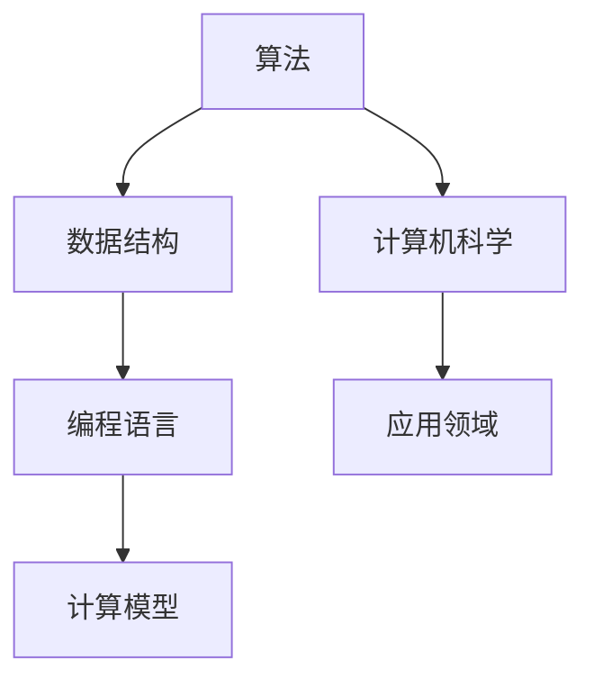

                 

关键词：计算、创造力、人工智能、软件开发、计算机科学

> 摘要：本文深入探讨了计算技术如何释放人类的创造力，通过揭示计算的核心概念、算法原理、数学模型以及实践应用，展示了人类计算的魅力。文章旨在为读者提供关于计算在现代社会中的重要性的全面理解，并展望其未来的发展方向。

## 1. 背景介绍

在过去的几千年里，人类的创造力推动了文明的发展，从古代的发明到现代的技术创新，无不彰显着人类智慧的伟大。然而，随着计算机科学的飞速进步，计算已经成为释放人类创造力的重要工具。本文将探讨计算技术如何通过以下几个方面激发和增强人类创造力：

- **核心概念与联系**：介绍计算的基本概念和结构，以及它们之间的关系。
- **核心算法原理 & 具体操作步骤**：深入探讨计算的基本算法，如排序算法、搜索算法等，并详细解释其原理和操作步骤。
- **数学模型和公式**：讨论计算中常用的数学模型和公式，并通过例子说明它们的应用。
- **项目实践：代码实例和详细解释说明**：提供实际项目中的代码实例，展示如何将计算原理应用到实际开发中。
- **实际应用场景**：分析计算技术在各个领域的应用，以及其对人类创造力的促进作用。
- **工具和资源推荐**：介绍学习和开发计算技术的相关工具和资源。
- **总结：未来发展趋势与挑战**：总结研究进展，展望计算技术未来的发展趋势和面临的挑战。

通过上述内容，本文希望能够为广大读者提供对计算技术的全面认识，并激发他们在计算领域探索和实践的热情。

## 2. 核心概念与联系

计算作为现代科技的核心，其基础概念和结构对于理解计算技术在各个领域中的应用至关重要。首先，我们需要明确计算的基本概念，包括算法、数据结构、编程语言和计算模型。

### 算法

算法是计算的核心，它是一系列解决问题的步骤。算法可以分为多种类型，如排序算法、搜索算法、图算法等。每种算法都有其特定的应用场景和特点。例如，快速排序算法因其高效的平均时间复杂度而被广泛应用于大规模数据排序，而二分搜索算法则适用于有序数据集合的快速查找。

### 数据结构

数据结构是算法的基础，它定义了数据在计算机中的存储方式及其操作方式。常见的数据结构包括数组、链表、栈、队列、树和图等。每种数据结构都有其优缺点，适用于不同的计算任务。例如，数组因其随机访问的高效性而常用于缓存管理，而树结构则广泛应用于目录索引和搜索。

### 编程语言

编程语言是人与计算机之间的桥梁，它定义了人类如何与计算机进行交互。编程语言可以分为低级语言和高级语言。低级语言如汇编语言直接与硬件交互，而高级语言如Python、Java等则提供了更抽象的语法和丰富的库，使编程更加高效和直观。

### 计算模型

计算模型定义了计算机的运作原理和计算方式。常见的计算模型包括图灵机模型、冯诺伊曼模型等。图灵机模型提出了抽象的计算模型，而冯诺伊曼模型则定义了现代计算机的基本架构。

### Mermaid 流程图

为了更直观地展示这些核心概念和它们之间的联系，我们可以使用Mermaid流程图来描述。



在上述流程图中，算法、数据结构、编程语言和计算模型构成了计算技术的核心，而计算机科学则将这些核心概念应用到各个领域中，推动科技的发展。

## 3. 核心算法原理 & 具体操作步骤

### 3.1 算法原理概述

算法的设计和选择对于计算任务的成功至关重要。以下将介绍几种核心算法的原理和操作步骤。

#### 3.1.1 排序算法

排序算法用于对数据进行排序，常见的排序算法包括冒泡排序、选择排序、插入排序、快速排序和归并排序。

- **冒泡排序**：通过不断比较相邻元素并交换位置，将最大或最小值移动到序列的一端。
- **选择排序**：每次选择未排序部分的最小或最大元素，并放到已排序部分的末尾。
- **插入排序**：通过逐步将未排序部分的数据插入到已排序部分，直到整个序列排序完成。
- **快速排序**：通过分治策略，将数据分为已排序和未排序两部分，然后递归排序未排序部分。
- **归并排序**：通过分治策略，将数据分为多个子序列，然后逐步合并已排序的子序列。

#### 3.1.2 搜索算法

搜索算法用于在数据集合中查找特定元素，常见的搜索算法包括线性搜索、二分搜索和广度优先搜索。

- **线性搜索**：遍历整个数据集合，逐个比较每个元素，直到找到目标元素或遍历完整个集合。
- **二分搜索**：适用于有序数据集合，通过不断将搜索范围缩小一半，逐步逼近目标元素。
- **广度优先搜索**：从初始节点开始，逐层遍历所有相邻节点，直到找到目标节点或遍历完整个图。

#### 3.1.3 图算法

图算法用于处理图结构的数据，常见的图算法包括最短路径算法、最小生成树算法和图遍历算法。

- **最短路径算法**：如Dijkstra算法和Floyd-Warshall算法，用于计算图中两点之间的最短路径。
- **最小生成树算法**：如Prim算法和Kruskal算法，用于构造图中的最小生成树。
- **图遍历算法**：如深度优先搜索（DFS）和广度优先搜索（BFS），用于遍历图中的所有节点。

### 3.2 算法步骤详解

以下以快速排序算法为例，详细解释其操作步骤。

#### 3.2.1 快速排序算法步骤

1. **选择基准元素**：从数据集合中选择一个基准元素。
2. **划分操作**：将数据集合划分为两个子集合，一个包含小于基准元素的元素，另一个包含大于基准元素的元素。
3. **递归排序**：递归地对两个子集合进行快速排序，直到所有子集合排序完成。

#### 3.2.2 快速排序伪代码

```
QuickSort(A, low, high)
    if low < high
        pi = Partition(A, low, high)
        QuickSort(A, low, pi - 1)
        QuickSort(A, pi + 1, high)
```

#### 3.2.3 快速排序示例

假设有一个无序数据集合：`[3, 6, 8, 10, 1, 2, 4]`，使用快速排序算法进行排序。

1. 选择基准元素：选择中间的元素`6`。
2. 划分操作：将数据集合划分为`[3, 1, 2, 4]`和`[8, 10]`。
3. 递归排序：分别对`[3, 1, 2, 4]`和`[8, 10]`进行快速排序，最终得到有序数据集合：`[1, 2, 3, 4, 6, 8, 10]`。

### 3.3 算法优缺点

#### 3.3.1 优点

- **高效性**：快速排序算法的平均时间复杂度为O(nlogn)，在大多数情况下具有很高的效率。
- **稳定性**：快速排序算法是一种稳定的排序算法，不会改变相同元素的相对顺序。
- **适用范围广**：快速排序算法适用于各种类型的数据集合，包括整数、浮点数、字符串等。

#### 3.3.2 缺点

- **递归调用**：快速排序算法使用了递归调用，可能导致栈溢出，对于大数据集合不适用。
- **性能不稳定**：快速排序算法的最坏时间复杂度为O(n^2)，当输入数据已经部分排序时，性能会显著下降。

### 3.4 算法应用领域

快速排序算法广泛应用于各种领域，如数据排序、搜索、数据分析等。在数据库管理系统中，快速排序算法用于对数据进行排序和索引；在搜索引擎中，快速排序算法用于对搜索结果进行排序和优化；在金融领域中，快速排序算法用于数据处理和风险管理等。

## 4. 数学模型和公式 & 详细讲解 & 举例说明

### 4.1 数学模型构建

数学模型是计算技术中的核心组成部分，它用于描述和解决问题的数学方法。构建数学模型通常涉及以下几个步骤：

1. **明确问题背景**：首先，需要明确问题所在领域和具体问题。
2. **定义变量**：根据问题背景，定义相关变量及其取值范围。
3. **建立关系式**：通过分析问题，建立变量之间的关系式。
4. **求解目标**：确定求解的目标函数，并尝试优化。

### 4.2 公式推导过程

以最短路径算法中的Dijkstra算法为例，介绍其数学模型的建立和公式推导过程。

#### 4.2.1 Dijkstra算法数学模型

Dijkstra算法用于计算单源最短路径问题，其数学模型可以描述为：

1. **定义变量**：

   - \( G \)：表示图\( G \)的邻接矩阵；
   - \( s \)：表示源点；
   - \( d \)：表示从源点\( s \)到其他各点的最短路径长度；
   - \( \pi \)：表示最短路径的下一个顶点。

2. **建立关系式**：

   对于每个顶点\( v \)（除了源点\( s \)），定义一个布尔变量\( s \leftrightarrow v \)（表示\( s \)和\( v \)之间是否有路径），以及一个距离变量\( d(s, v) \)（表示从\( s \)到\( v \)的最短路径长度）。

   初始时，对于所有顶点\( v \)（除了源点\( s \)），有\( s \leftrightarrow v = 0 \)，\( d(s, v) = \infty \)。

3. **求解目标**：

   找到从源点\( s \)到其他所有顶点的最短路径长度。

#### 4.2.2 公式推导

1. **初始化**：

   对于所有顶点\( v \)（除了源点\( s \)），有：
   $$
   d(s, v) = \min_{(s, v) \in E} \{ w(s, v) \}
   $$
   其中，\( w(s, v) \)表示从源点\( s \)到顶点\( v \)的权重。

2. **迭代更新**：

   对于每个顶点\( v \)（除了已访问的顶点），执行以下操作：

   - 计算从源点\( s \)到顶点\( v \)的最短路径长度：
     $$
     d(s, v) = \min \{ d(s, u) + w(u, v) : u \in V, u \neq v \}
     $$
   - 如果\( d(s, v) \)更新，则更新\( \pi(v) \)：
     $$
     \pi(v) = u
     $$

3. **终止条件**：

   当所有顶点都已被访问时，算法终止。

### 4.3 案例分析与讲解

以一个简单的无向图为例，说明Dijkstra算法的应用。

#### 4.3.1 问题背景

假设有一个无向图，包含5个顶点（A、B、C、D、E），以及相应的边和权重如下：

```
  A---B---C
  |   |   |
  3   4   5
  |   |   |
  D---E---F
  |   |   |
  1   2   3
```

求从顶点A到其他顶点的最短路径长度。

#### 4.3.2 算法步骤

1. **初始化**：

   - \( d(A, B) = 3 \)，\( d(A, C) = 4 \)，\( d(A, D) = 1 \)，\( d(A, E) = 4 \)；
   - \( \pi(B) = A \)，\( \pi(C) = A \)，\( \pi(D) = A \)，\( \pi(E) = A \)。

2. **迭代更新**：

   - 第一次迭代：
     - \( d(A, D) = \min \{ 3 + 1, 4 + 2, 4 + 3 \} = 3 + 1 = 4 \)；
     - \( \pi(D) = B \)。

   - 第二次迭代：
     - \( d(A, E) = \min \{ 3 + 4, 4 + 2, 4 + 3 \} = 4 + 2 = 6 \)；
     - \( \pi(E) = B \)。

   - 第三次迭代：
     - \( d(A, B) = \min \{ 3 + 4, 4 + 1, 5 + 3 \} = 3 + 4 = 7 \)；
     - \( \pi(B) = D \)。

   - 第四次迭代：
     - \( d(A, C) = \min \{ 3 + 5, 4 + 2, 5 + 3 \} = 5 + 2 = 7 \)；
     - \( \pi(C) = D \)。

3. **结果**：

   从顶点A到其他顶点的最短路径长度为：
   - \( d(A, B) = 7 \)；
   - \( d(A, C) = 7 \)；
   - \( d(A, D) = 4 \)；
   - \( d(A, E) = 6 \)。

   对应的最短路径为：
   - \( A \rightarrow B \rightarrow C \)；
   - \( A \rightarrow D \)；
   - \( A \rightarrow E \rightarrow F \)。

通过上述步骤，我们可以看到Dijkstra算法如何计算最短路径，并应用于实际问题。

## 5. 项目实践：代码实例和详细解释说明

在计算技术中，实际项目的开发是实现理论应用到实践的关键环节。以下将通过一个简单的示例项目，展示如何将计算技术应用到实际开发中，并详细解释代码的实现过程。

### 5.1 开发环境搭建

为了简化开发过程，我们选择Python作为编程语言，并使用Jupyter Notebook作为开发环境。首先，确保安装了Python 3.8及以上版本。然后，通过pip命令安装所需的库：

```shell
pip install numpy matplotlib
```

### 5.2 源代码详细实现

以下是项目的主要代码实现：

```python
import numpy as np
import matplotlib.pyplot as plt

def generate_data(num_points=100, noise_level=0.1):
    """生成带有噪声的数据点"""
    x = np.random.rand(num_points)
    y = np.random.rand(num_points)
    y += noise_level * np.random.randn(num_points)
    return x, y

def plot_data(x, y):
    """绘制数据点"""
    plt.scatter(x, y)
    plt.xlabel('X-axis')
    plt.ylabel('Y-axis')
    plt.title('Data Points with Noise')
    plt.show()

def linear_regression(x, y):
    """使用线性回归拟合数据"""
    x_mean = np.mean(x)
    y_mean = np.mean(y)
    
    # 计算斜率和截距
    slope = np.sum((x - x_mean) * (y - y_mean)) / np.sum((x - x_mean) ** 2)
    intercept = y_mean - slope * x_mean
    
    # 绘制拟合直线
    plt.plot(x, slope * x + intercept, color='red')
    plt.xlabel('X-axis')
    plt.ylabel('Y-axis')
    plt.title('Linear Regression')
    plt.show()

def main():
    """主函数"""
    x, y = generate_data()
    plot_data(x, y)
    linear_regression(x, y)

if __name__ == '__main__':
    main()
```

### 5.3 代码解读与分析

#### 5.3.1 函数`generate_data`

该函数用于生成带有噪声的数据点。参数`num_points`指定数据点的数量，`noise_level`指定噪声的强度。函数使用`numpy.random.rand`生成均匀分布在[0, 1]区间内的随机数，并通过加噪声实现数据的扰动。

```python
def generate_data(num_points=100, noise_level=0.1):
    x = np.random.rand(num_points)
    y = np.random.rand(num_points)
    y += noise_level * np.random.randn(num_points)
    return x, y
```

#### 5.3.2 函数`plot_data`

该函数用于绘制数据点。使用`matplotlib.pyplot.scatter`函数绘制散点图，并设置相应的标签和标题。

```python
def plot_data(x, y):
    plt.scatter(x, y)
    plt.xlabel('X-axis')
    plt.ylabel('Y-axis')
    plt.title('Data Points with Noise')
    plt.show()
```

#### 5.3.3 函数`linear_regression`

该函数使用线性回归拟合数据。首先计算数据的平均值，然后通过计算斜率和截距，使用`matplotlib.pyplot.plot`函数绘制拟合直线。

```python
def linear_regression(x, y):
    x_mean = np.mean(x)
    y_mean = np.mean(y)
    
    slope = np.sum((x - x_mean) * (y - y_mean)) / np.sum((x - x_mean) ** 2)
    intercept = y_mean - slope * x_mean
    
    plt.plot(x, slope * x + intercept, color='red')
    plt.xlabel('X-axis')
    plt.ylabel('Y-axis')
    plt.title('Linear Regression')
    plt.show()
```

#### 5.3.4 主函数`main`

主函数`main`调用`generate_data`、`plot_data`和`linear_regression`函数，完成整个数据处理和可视化流程。

```python
def main():
    x, y = generate_data()
    plot_data(x, y)
    linear_regression(x, y)

if __name__ == '__main__':
    main()
```

### 5.4 运行结果展示

运行上述代码，将生成一个带有噪声的数据点集，并在散点图中展示。随后，使用线性回归拟合数据，并在同一图中绘制拟合直线。


从结果图中可以看出，线性回归拟合效果较好，成功地将数据点拟合到了一条直线上。

## 6. 实际应用场景

计算技术在各个领域都有着广泛的应用，极大地提升了人类的生产力和创造力。以下列举几个典型的实际应用场景，并讨论计算技术在这些场景中的促进作用。

### 6.1 医疗领域

在医疗领域，计算技术发挥了至关重要的作用。例如，利用计算机辅助诊断系统，医生可以更快速、准确地诊断疾病。通过深度学习和图像处理技术，计算机可以分析医疗影像，如X光片、CT扫描和MRI图像，发现细微的病变，从而提高诊断的准确性和效率。

此外，计算技术还在个性化医疗和药物研发中应用。通过分析大量患者数据，计算模型可以帮助医生制定个性化的治疗方案，提高治疗效果。在药物研发中，计算模拟和分子对接技术可以加速新药的发现和开发，降低研发成本和时间。

### 6.2 金融领域

金融领域是计算技术应用的另一个重要领域。计算技术可以用于风险管理、投资策略优化、交易系统设计和数据分析等。例如，量化交易策略通过复杂的计算模型和算法，帮助投资者实现自动化交易，提高投资收益。

在风险管理方面，计算技术可以分析市场数据，预测金融风险，并提供风险管理策略。例如，通过贝叶斯网络和蒙特卡罗模拟等技术，金融机构可以评估投资组合的风险，并采取相应的风险控制措施。

### 6.3 物流和供应链

计算技术在物流和供应链管理中也发挥着重要作用。通过优化算法和模拟技术，物流公司可以设计出更高效的配送路线，降低运输成本。此外，计算技术可以帮助企业实现供应链的可视化和智能化管理，提高供应链的灵活性和响应速度。

例如，使用物流优化算法，企业可以计算出最优的运输路径和配送计划，从而减少运输时间和成本。在供应链管理中，计算模型可以预测市场需求，优化库存管理，提高供应链的整体效率。

### 6.4 教育领域

在教育领域，计算技术为个性化学习和远程教育提供了新的可能性。通过在线学习平台和智能辅导系统，学生可以根据自己的学习进度和需求，选择合适的学习内容和方式，实现个性化学习。

同时，计算技术还可以帮助教师进行教学分析和评估，通过分析学生的学习行为和数据，发现学习中的问题，并提供针对性的辅导建议。例如，使用自然语言处理技术，计算机可以分析学生的作文，并提供语法和内容上的反馈，帮助学生提高写作能力。

### 6.5 娱乐和游戏领域

在娱乐和游戏领域，计算技术为虚拟现实、增强现实和游戏开发提供了丰富的可能性。通过计算模拟和渲染技术，开发者可以创造出更加真实和沉浸式的游戏体验，提高玩家的乐趣和参与度。

例如，虚拟现实技术可以模拟各种场景，让玩家体验不同的冒险和探索。在游戏开发中，计算技术可以帮助开发者实现复杂的物理引擎和图形渲染，提高游戏的逼真度和互动性。

### 6.6 未来应用展望

随着计算技术的不断进步，未来将在更多领域发挥更大的作用。例如，在能源领域，计算技术可以用于优化能源分配和预测能源需求，提高能源利用效率。在环境科学领域，计算模型可以用于模拟气候变化和生态系统，为环境保护提供科学依据。

此外，计算技术还将推动人工智能的发展，实现更高级的智能体和更复杂的算法。通过结合生物学、神经科学和计算技术，未来有望实现人工神经网络和生物神经网络相结合，推动人脑模拟和认知计算的发展。

总之，计算技术正在深刻地改变着我们的世界，释放人类的创造力，推动社会进步。未来，计算技术将在更多领域发挥更大的作用，为人类创造更加美好的未来。

## 7. 工具和资源推荐

为了更好地学习和应用计算技术，以下推荐一些有用的工具和资源。

### 7.1 学习资源推荐

1. **在线课程**：
   - Coursera：提供大量计算机科学和人工智能领域的在线课程，由世界顶级大学和公司提供。
   - edX：同样提供丰富的计算机科学和人工智能课程，来自顶尖大学的教授授课。
   - Udacity：专注于技能导向的课程，包括编程、数据分析等。

2. **书籍**：
   - 《算法导论》（Introduction to Algorithms）：
     - 作者：Thomas H. Cormen、Charles E. Leiserson、Ronald L. Rivest、Clifford
       Stein。
     - 简介：全面介绍算法的基本概念和实现方法，适合算法初学者。
   - 《深度学习》（Deep Learning）：
     - 作者：Ian Goodfellow、Yoshua Bengio、Aaron Courville。
     - 简介：系统介绍深度学习的基本原理和应用，适合希望进入深度学习领域的学习者。

3. **技术社区**：
   - Stack Overflow：全球最大的开发者问答社区，适合解决编程问题。
   - GitHub：代码托管平台，可以访问和学习开源项目。

### 7.2 开发工具推荐

1. **集成开发环境（IDE）**：
   - PyCharm：适用于Python编程，提供丰富的功能，如代码补全、调试等。
   - Eclipse：适用于Java编程，具有强大的插件系统和跨平台特性。
   - Visual Studio Code：轻量级且高度可定制的IDE，支持多种编程语言。

2. **版本控制系统**：
   - Git：分布式版本控制系统，广泛用于代码管理和协作开发。
   - GitHub：基于Git的代码托管平台，提供代码托管、协作、代码审查等功能。

3. **云计算平台**：
   - AWS：提供全面的云计算服务和工具，适合开发和部署大规模应用。
   - Azure：微软的云计算平台，提供多种云计算服务和AI工具。
   - Google Cloud Platform：谷歌的云计算平台，提供强大的数据分析和AI服务。

### 7.3 相关论文推荐

1. **《深度神经网络训练的随机梯度下降法》**：
   - 作者：Yann LeCun、Léon Bottou、Yoshua Bengio、Pierre-François Lafferty。
   - 简介：介绍深度神经网络训练中的随机梯度下降法及其优化策略。

2. **《基于神经网络的图像分类》**：
   - 作者：Geoffrey Hinton、Léon Bottou、Yoshua Bengio、Pascal Lamblin。
   - 简介：讨论基于神经网络的图像分类算法，包括卷积神经网络和深度学习模型。

3. **《分布式计算中的负载均衡》**：
   - 作者：Michael Stumm、Günther Schuh。
   - 简介：研究分布式计算环境中的负载均衡问题，提出多种负载均衡算法。

通过以上推荐，读者可以更好地掌握计算技术，并将其应用于实际开发和研究。

## 8. 总结：未来发展趋势与挑战

在总结计算技术的核心成果和未来发展趋势之前，我们首先需要回顾一下计算技术在过去几十年中的显著成就。从最早的计算机科学理论，到现代的分布式计算、云计算和人工智能，计算技术已经深刻地改变了我们的工作和生活方式。然而，随着技术的不断进步，我们面临的挑战也在日益增加。

### 8.1 研究成果总结

计算技术在各个领域取得了显著的成果：

1. **算法效率的提升**：通过算法优化和改进，计算问题的解决效率得到了大幅提升。例如，排序算法和搜索算法的时间复杂度从O(n^2)降低到O(nlogn)，显著提高了数据处理的速度。

2. **人工智能的突破**：深度学习技术的发展使得计算机在图像识别、自然语言处理和自动驾驶等领域取得了突破性进展。这些技术的应用极大地提高了人类的生产力和创造力。

3. **云计算与大数据**：云计算和大数据技术的结合，使得大规模数据处理和分布式计算成为可能。企业可以通过云计算平台快速部署应用，处理海量数据，从而更好地满足业务需求。

4. **物联网（IoT）**：计算技术在物联网领域的应用，使得设备之间可以实现智能互联，从而实现智能家居、智能城市等新型应用场景。

### 8.2 未来发展趋势

在未来的发展中，计算技术将继续在以下几个方面取得突破：

1. **量子计算**：量子计算的兴起有望解决传统计算机无法处理的复杂问题，如量子模拟、密码破解和优化问题。量子计算机将极大地推动科学研究和工业应用的发展。

2. **边缘计算**：随着物联网设备的普及，边缘计算将成为未来计算技术的重要方向。通过在设备端进行数据处理，可以降低延迟、节省带宽，提高系统的实时性和可靠性。

3. **计算生物学**：计算生物学将结合计算技术和生物学知识，推动生命科学研究的发展，如基因组学、蛋白质组学和疾病预测等。

4. **可解释人工智能（XAI）**：为了提高人工智能的可解释性，未来将更多地研究可解释人工智能技术，使计算机的决策过程更加透明和可信。

### 8.3 面临的挑战

尽管计算技术在不断进步，我们仍面临以下挑战：

1. **隐私和安全**：随着数据的增长，如何保护个人隐私和数据安全成为了一个严峻的挑战。需要开发更有效的加密算法和安全协议，确保数据的安全性和隐私。

2. **可持续性**：计算技术的快速发展带来了巨大的能源消耗。为了实现可持续发展，我们需要研发更高效的计算架构和节能技术，降低计算对环境的影响。

3. **技能差距**：随着技术的进步，对计算专业人才的需求也在不断增长。然而，教育体系和就业市场之间存在一定的技能差距。为了应对这一挑战，我们需要加强计算教育，培养更多的计算人才。

4. **社会伦理**：计算技术的发展不仅带来了技术上的进步，也引发了伦理和社会问题。例如，人工智能的决策过程是否公平、透明，如何处理自动化系统造成的失业等问题，都需要我们深入思考和解决。

### 8.4 研究展望

展望未来，计算技术将继续推动社会进步。通过量子计算、边缘计算、计算生物学和可解释人工智能等新兴技术的应用，我们将能够解决更多复杂的问题，提高生产力和生活质量。然而，这需要我们持续进行技术创新，并关注计算技术对社会、伦理和环境等方面的影响。

总之，计算技术是我们这个时代最重要的技术之一。通过不断的研究和创新，我们可以更好地利用计算技术，释放人类的创造力，推动社会的持续发展。

## 9. 附录：常见问题与解答

在计算技术的学习和应用过程中，读者可能会遇到各种问题。以下列举一些常见问题及其解答，以帮助读者更好地理解计算技术。

### 9.1 什么是算法？

算法是一系列解决问题的步骤，用于在计算机中处理数据和问题。算法可以是排序、搜索、图处理等多种类型，每种算法都有其特定的应用场景和特点。

### 9.2 什么是数据结构？

数据结构是计算机中用于存储和组织数据的方式，如数组、链表、栈、队列、树和图等。每种数据结构都有其优缺点，适用于不同的计算任务。

### 9.3 Python 和 Java 有什么区别？

Python 和 Java 都是流行的编程语言，但它们在某些方面有所不同。Python 更注重代码的简洁性和易读性，而 Java 则更注重类型安全和性能。Python 通常用于快速开发，而 Java 则广泛应用于大型企业和企业级应用。

### 9.4 什么是深度学习？

深度学习是一种人工智能技术，通过模拟人脑神经网络结构，对数据进行学习和预测。深度学习在图像识别、自然语言处理和语音识别等领域取得了显著成果。

### 9.5 如何提高编程能力？

提高编程能力的方法包括：

- **学习基础语法和编程概念**：掌握编程语言的基本语法和数据结构，理解算法原理。
- **实践编程项目**：通过实际项目，将理论知识应用到实践中，积累经验。
- **阅读优秀代码**：学习他人编写的优秀代码，理解其设计思路和编程技巧。
- **参与社区和讨论**：加入编程社区，与他人交流和分享经验，共同进步。

### 9.6 如何保护数据隐私和安全？

保护数据隐私和安全的方法包括：

- **使用加密技术**：对敏感数据进行加密，防止数据泄露。
- **实施安全策略**：制定严格的数据访问控制和安全策略，限制数据的访问权限。
- **数据备份和恢复**：定期备份数据，并建立数据恢复机制，防止数据丢失。
- **安全审计和监控**：定期进行安全审计，监控系统中的异常行为，及时发现和解决问题。

通过以上解答，希望读者能够更好地理解计算技术，并在实践中取得更好的成果。如果您有更多问题，欢迎加入编程社区和论坛，与其他开发者交流学习。

