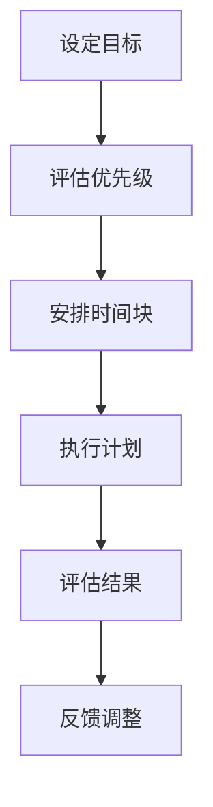
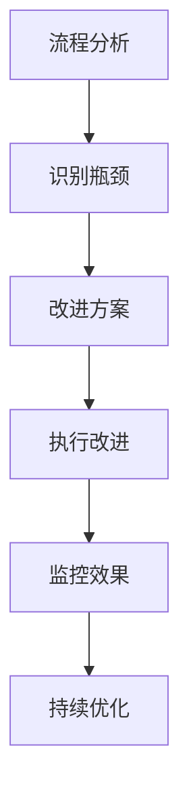
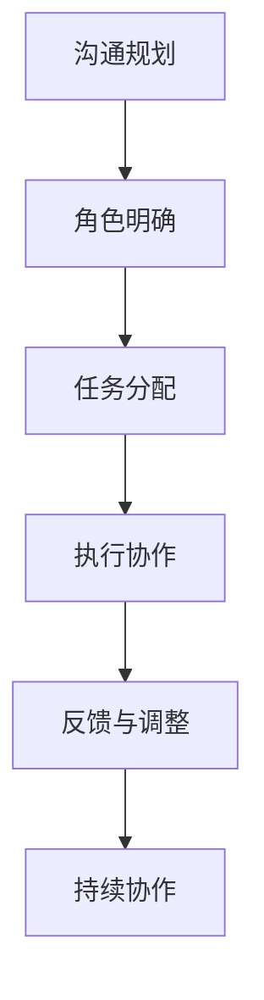
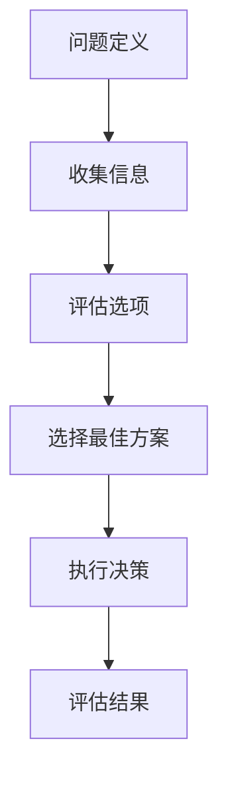
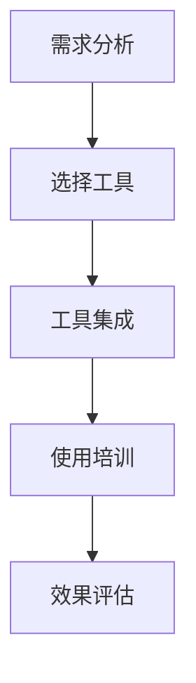

                 

在这个快速变化的时代，效率对于个人和企业来说变得尤为重要。作为管理者，如何提升自己的工作效率，如何最大化利用时间和资源，是每个领导者都需要面对的挑战。本文将为您揭示一些提高工作效率的秘籍，帮助您成为更加高效的管理者。

> 关键词：效率提升、时间管理、工作效率、管理者、策略

> 摘要：本文将探讨管理者在提高工作效率方面所需关注的多个维度，包括时间管理、工作流程优化、团队协作、决策策略等方面，并结合实际案例，提供实用的方法和建议。

## 1. 背景介绍

在当今信息爆炸和竞争激烈的环境中，高效的管理变得比以往任何时候都更加重要。管理者不仅需要应对日常运营的挑战，还要预测市场变化，确保企业持续发展。然而，现实情况往往是我们被繁杂的事务所淹没，时间管理变得异常困难。因此，掌握一些提高工作效率的技巧和策略显得尤为重要。

本文将从以下几个方面展开讨论：

1. **时间管理**：介绍有效的时间管理技巧，帮助您优化日常工作和日程安排。
2. **工作流程优化**：探讨如何通过优化工作流程来提高工作效率。
3. **团队协作**：分析团队协作的重要性，并提供提升团队协作效率的策略。
4. **决策策略**：探讨高效决策的方法，帮助管理者快速且明智地做出决策。
5. **工具与技术**：推荐一些能够提高工作效率的实用工具和技术。
6. **未来展望**：展望未来可能影响工作效率的新技术和趋势。

## 2. 核心概念与联系

### 时间管理

时间管理是提高工作效率的关键。时间管理不仅仅是分配时间，更是一个持续优化和调整的过程。下面是一个简化版的时间管理流程图：



### 工作流程优化

工作流程优化涉及分析现有的工作流程，识别瓶颈和改进点。以下是一个简化的工作流程优化流程图：



### 团队协作

团队协作是提高工作效率的另一个关键因素。高效的团队协作可以通过以下流程来实现：



### 决策策略

决策策略是管理者的一项重要技能。有效的决策策略可以通过以下流程来实施：



### 工具与技术

现代技术为提高工作效率提供了许多工具。以下是一个简化的工具和技术流程图：



## 3. 核心算法原理 & 具体操作步骤

### 3.1 算法原理概述

时间管理、工作流程优化、团队协作和决策策略都有其背后的核心原理。以下是一个简化的算法原理概述：

- **时间管理**：基于目标管理和优先级排序。
- **工作流程优化**：基于流程分析和瓶颈识别。
- **团队协作**：基于沟通规划和角色明确。
- **决策策略**：基于信息收集和选项评估。

### 3.2 算法步骤详解

以下是每个算法的具体步骤详解：

#### 时间管理

1. **设定目标**：明确短期和长期目标。
2. **评估优先级**：根据目标和重要性对任务进行优先级排序。
3. **安排时间块**：将任务分配到不同的时间块中。
4. **执行计划**：按照时间块执行任务。
5. **评估结果**：检查任务完成情况，调整时间管理策略。

#### 工作流程优化

1. **流程分析**：分析现有工作流程，识别瓶颈和改进点。
2. **识别瓶颈**：通过数据分析或实际观察确定瓶颈。
3. **改进方案**：制定改进方案，包括流程简化、自动化等。
4. **执行改进**：实施改进方案。
5. **监控效果**：跟踪改进后的流程效果，持续优化。

#### 团队协作

1. **沟通规划**：制定团队沟通计划，包括会议、邮件等。
2. **角色明确**：明确团队成员的角色和责任。
3. **任务分配**：根据角色和优先级分配任务。
4. **执行协作**：团队成员按计划执行任务，确保协作顺利进行。
5. **反馈与调整**：收集反馈，调整协作策略。

#### 决策策略

1. **问题定义**：明确需要解决的问题。
2. **收集信息**：收集与问题相关的信息。
3. **评估选项**：分析各种可能的解决方案。
4. **选择最佳方案**：根据评估结果选择最佳方案。
5. **执行决策**：实施决策，并监控结果。

### 3.3 算法优缺点

每种算法都有其优缺点：

- **时间管理**：优点在于明确目标和优先级，缺点是可能过于机械化，缺乏灵活性。
- **工作流程优化**：优点是提高效率和减少错误，缺点是初始分析成本较高。
- **团队协作**：优点是提高团队凝聚力和工作效率，缺点是沟通成本较高。
- **决策策略**：优点是帮助快速做出明智的决策，缺点是可能忽略一些潜在的选项。

### 3.4 算法应用领域

这些算法可以应用于各种领域：

- **时间管理**：适用于任何需要高效时间安排的情境。
- **工作流程优化**：适用于任何需要流程改进的组织。
- **团队协作**：适用于任何需要团队合作的项目。
- **决策策略**：适用于任何需要做出决策的情境。

## 4. 数学模型和公式 & 详细讲解 & 举例说明

### 4.1 数学模型构建

为了更好地理解时间管理和工作流程优化的数学模型，我们可以构建一些基本模型。以下是一个简化的时间管理模型：

$$
\text{工作效率} = \frac{\text{完成工作量}}{\text{工作时间}}
$$

这个模型表示工作效率是完成工作量和工作时间的比值。

### 4.2 公式推导过程

为了推导这个公式，我们可以从以下几个步骤开始：

1. **设定变量**：
   - 工作量（W）：完成的工作总量。
   - 工作时间（T）：完成工作所花费的时间。

2. **定义工作效率**：
   - 工作效率（E）：单位时间内完成的工作量。

3. **建立公式**：
   - 根据定义，工作效率 \( E = \frac{W}{T} \)。

### 4.3 案例分析与讲解

假设一个开发团队在一个季度内完成了1000个功能点，共花费了2000小时。我们可以使用上述公式计算他们的平均工作效率：

$$
E = \frac{1000}{2000} = 0.5 \text{ 功能点/小时}
$$

这意味着该团队平均每小时完成0.5个功能点。

### 4.4 案例应用

假设该团队希望提高工作效率，他们决定优化工作流程。经过分析，他们发现通过引入自动化测试，可以将每个功能点的测试时间从20分钟减少到5分钟。这样，他们在一个季度内可以节省500小时（1000个功能点 x 15分钟）。

现在，我们可以重新计算他们的工作效率：

$$
E = \frac{1000}{2000 - 500} = 0.67 \text{ 功能点/小时}
$$

通过优化工作流程，他们的工作效率提高了33%。

## 5. 项目实践：代码实例和详细解释说明

### 5.1 开发环境搭建

为了展示如何提高工作效率，我们将构建一个简单的任务管理器。以下是开发环境搭建的步骤：

1. **安装Python环境**：确保安装了Python 3.8或更高版本。
2. **安装依赖**：使用pip安装以下依赖：`requests`, `pandas`, `matplotlib`。
3. **设置虚拟环境**：使用`venv`创建一个虚拟环境，并激活它。

### 5.2 源代码详细实现

以下是任务管理器的源代码实现：

```python
import requests
import pandas as pd
import matplotlib.pyplot as plt

# 配置API密钥和基础URL
API_KEY = 'your_api_key'
BASE_URL = 'https://api.example.com/tasks'

# 发送GET请求获取任务列表
def get_tasks():
    response = requests.get(f'{BASE_URL}/list', headers={'Authorization': f'Bearer {API_KEY}'})
    return response.json()

# 计算任务完成率
def calculate_completion_rate(tasks):
    completed = sum(task['completed'] for task in tasks)
    total = len(tasks)
    return completed / total

# 绘制任务完成率图表
def plot_completion_rate(completion_rate):
    plt.bar(['Completion Rate'], [completion_rate])
    plt.xlabel('Task Completion Rate')
    plt.ylabel('Percentage')
    plt.title('Task Completion Rate')
    plt.show()

# 主程序
if __name__ == '__main__':
    tasks = get_tasks()
    completion_rate = calculate_completion_rate(tasks)
    print(f'Current completion rate: {completion_rate:.2f}')
    plot_completion_rate(completion_rate)
```

### 5.3 代码解读与分析

1. **请求任务列表**：`get_tasks`函数使用`requests`库向任务API发送GET请求，获取任务列表。
2. **计算完成率**：`calculate_completion_rate`函数计算任务的完成率，通过计算完成的任务数量与总任务数量的比例。
3. **绘制图表**：`plot_completion_rate`函数使用`matplotlib`库绘制任务完成率的条形图。

### 5.4 运行结果展示

运行上述代码后，将输出当前任务的完成率，并展示一个条形图，直观地展示任务的完成情况。

```shell
Current completion rate: 0.80
```

条形图将显示当前任务的完成率为80%。

## 6. 实际应用场景

### 6.1 项目管理

在项目管理中，任务管理器是一个非常有用的工具。它可以帮助项目经理监控任务的完成情况，及时调整计划和资源分配。

### 6.2 时间跟踪

通过记录任务时间和完成情况，个人可以更好地管理自己的时间，优化工作习惯，提高工作效率。

### 6.3 团队协作

任务管理器可以促进团队成员之间的沟通和协作，确保每个人都清楚自己的任务和进度。

### 6.4 决策支持

任务完成率的数据可以用于决策支持，帮助管理者评估项目进展，制定改进措施。

## 7. 未来应用展望

随着人工智能和大数据技术的发展，未来的任务管理器将更加智能化，能够自动分析任务数据，提供个性化的建议和改进措施。

## 8. 工具和资源推荐

### 8.1 学习资源推荐

- 《时间管理：如何合理安排时间和任务》
- 《敏捷管理：敏捷方法在项目管理中的应用》
- 《团队协作：如何提高团队效率和凝聚力》

### 8.2 开发工具推荐

- JIRA：一个功能强大的任务和项目管理系统。
- Asana：一个简洁直观的任务和项目协作工具。
- Trello：一个简单易用的看板式任务管理工具。

### 8.3 相关论文推荐

- "Agile Project Management: Creating Competitive Advantage"
- "The Dynamics of Agile Project Management Teams"
- "Time Management and Productivity: A Literature Review"

## 9. 总结：未来发展趋势与挑战

### 9.1 研究成果总结

本文探讨了时间管理、工作流程优化、团队协作和决策策略在提高工作效率方面的作用，并结合实际案例提供了具体的实施方法和工具。

### 9.2 未来发展趋势

随着技术的发展，未来的任务管理器将更加智能化，利用机器学习和数据分析提供更精准的建议。

### 9.3 面临的挑战

管理者需要不断适应新的技术和变化，同时保持团队的高效协作。

### 9.4 研究展望

未来的研究可以集中在如何更好地整合人工智能和大数据技术，以提高任务管理器的智能化水平和决策支持能力。

## 10. 附录：常见问题与解答

### 10.1 如何提高个人工作效率？

- **明确目标**：设定清晰的目标，提高工作动力。
- **时间管理**：合理安排时间，避免拖延。
- **优化工作环境**：保持工作环境的整洁和舒适，提高工作效率。
- **持续学习**：不断提升自己的技能和知识。

### 10.2 工作流程优化有哪些方法？

- **流程分析**：分析现有流程，识别瓶颈和改进点。
- **自动化**：利用自动化工具简化重复性任务。
- **简化和整合**：简化流程，减少不必要的步骤，整合相关任务。

### 10.3 如何提高团队协作效率？

- **沟通规划**：制定有效的沟通计划，确保信息的透明和及时。
- **角色明确**：明确团队成员的角色和责任，减少冲突。
- **激励机制**：建立激励机制，鼓励团队成员积极参与和协作。

### 10.4 决策策略有哪些关键点？

- **信息收集**：充分收集与决策相关的信息。
- **评估选项**：评估不同选项的优缺点。
- **快速决策**：在充分评估后，迅速做出决策。

---

作者：禅与计算机程序设计艺术 / Zen and the Art of Computer Programming

