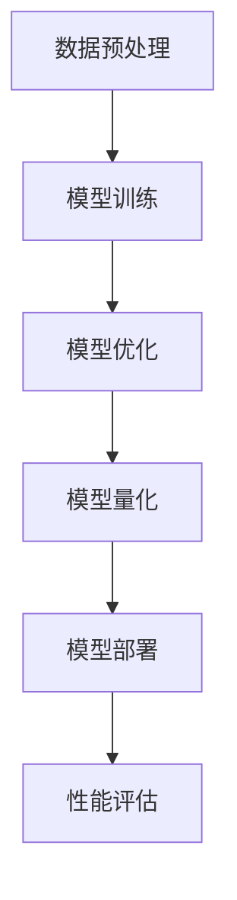

                 

关键词：大模型，效率优化，量化，应用实践，算法分析，技术展望

摘要：随着人工智能技术的快速发展，大模型在各个领域中的应用日益广泛。然而，大模型的计算复杂度和资源消耗也随之增加，如何提升大模型的应用效率成为一个重要课题。本文将从背景介绍、核心概念与联系、核心算法原理、数学模型与公式、项目实践、实际应用场景以及未来展望等多个方面，全面探讨量化大模型应用效率提升的方法和策略。

## 1. 背景介绍

随着深度学习技术的不断发展，大模型已经成为人工智能领域的重要工具。大模型通常具有数十亿甚至数千亿个参数，可以处理大量的数据和复杂的任务。然而，大模型的应用也面临着一系列挑战。首先，大模型的计算复杂度和资源消耗极高，导致其训练和部署成本巨大。其次，大模型的性能提升往往依赖于大规模的算力和数据，这使得小规模企业和个人难以参与其中。因此，如何提升大模型的应用效率，降低其成本，成为当前研究的热点问题。

### 大模型的现状与挑战

大模型在语音识别、图像处理、自然语言处理等领域的表现已经超越了传统模型，取得了显著的成果。例如，GPT-3 在文本生成和翻译任务上取得了突破性的成果，ImageNet 上的大规模图像识别竞赛也得益于深度学习技术的进步。然而，大模型也带来了新的挑战。首先，大模型的训练和推理过程需要大量的计算资源和时间，这使得其应用成本极高。其次，大模型的黑盒特性使得其可解释性较差，难以理解和调试。最后，大模型在处理实时任务时，往往存在延迟和吞吐量不足的问题。

### 提升大模型应用效率的重要性

提升大模型的应用效率具有重要意义。首先，它可以帮助降低大模型的应用成本，使更多的企业和个人能够参与其中。其次，它有助于优化大模型在实时任务中的性能，提高系统的响应速度和吞吐量。最后，提升大模型的应用效率也有助于提高其可解释性，帮助用户更好地理解和利用大模型。

## 2. 核心概念与联系

为了深入探讨大模型应用效率的提升，我们需要了解一些核心概念和联系。

### 大模型

大模型是指具有数十亿甚至数千亿个参数的深度学习模型。它们通常用于处理大规模数据和复杂任务。大模型的代表性模型包括 GPT、BERT、ResNet 等。

### 量化

量化是一种将浮点数参数转换为低精度整数参数的技术。通过量化，可以减少模型的参数大小和计算量，从而降低模型的存储和计算成本。

### 算法优化

算法优化是指通过改进模型结构、优化算法流程等方式，提高大模型的性能和效率。常见的算法优化技术包括模型剪枝、量化、蒸馏等。

### Mermaid 流程图

以下是使用 Mermaid 画出的一个流程图，展示了大模型应用效率提升的流程。



### 2.1 数据预处理

数据预处理是提升大模型应用效率的重要环节。通过数据预处理，可以减少数据量、降低数据维度、增强数据鲁棒性等，从而提高模型的训练效率。常见的数据预处理技术包括数据清洗、数据降维、数据增强等。

### 2.2 模型训练

模型训练是提升大模型应用效率的关键步骤。通过改进训练算法、优化训练流程，可以提高模型的训练速度和效果。常见的训练优化技术包括并行训练、分布式训练、动态调整学习率等。

### 2.3 模型优化

模型优化是提升大模型应用效率的重要手段。通过模型剪枝、量化、蒸馏等技术，可以减少模型的参数数量和计算量，从而降低模型的存储和计算成本。

### 2.4 模型量化

模型量化是将浮点数参数转换为低精度整数参数的技术。通过量化，可以减少模型的存储和计算成本，提高模型的推理速度。

### 2.5 模型部署

模型部署是将训练好的模型应用到实际场景中的过程。通过优化部署策略，可以提高模型的响应速度和吞吐量，从而提升大模型的应用效率。

### 2.6 性能评估

性能评估是验证大模型应用效果的重要步骤。通过对比不同优化策略的效果，可以找出最佳的优化方案，从而提升大模型的应用效率。

## 3. 核心算法原理 & 具体操作步骤

### 3.1 算法原理概述

量化大模型应用效率的核心算法主要包括模型剪枝、量化、蒸馏等。下面分别介绍这些算法的原理。

#### 3.1.1 模型剪枝

模型剪枝是指通过删除模型中的冗余神经元和连接，降低模型的复杂度和计算量。常见的模型剪枝技术包括结构剪枝和权重剪枝。

#### 3.1.2 量化

量化是指将浮点数参数转换为低精度整数参数的技术。常见的量化方法包括整数量化和浮点量化。

#### 3.1.3 蒸馏

蒸馏是指通过将大模型的知识传递给小模型，实现知识压缩和优化。常见的蒸馏方法包括软蒸馏和硬蒸馏。

### 3.2 算法步骤详解

#### 3.2.1 模型剪枝

1. 数据预处理：对输入数据进行预处理，包括数据清洗、数据降维、数据增强等。
2. 模型训练：使用预处理后的数据对模型进行训练，得到初步的训练结果。
3. 剪枝操作：根据模型的结构和权重，选择合适的剪枝策略（如结构剪枝或权重剪枝），对模型进行剪枝。
4. 模型优化：对剪枝后的模型进行优化，提高模型的性能和效率。
5. 模型部署：将优化后的模型部署到实际场景中，进行性能评估。

#### 3.2.2 量化

1. 数据预处理：对输入数据进行预处理，包括数据清洗、数据降维、数据增强等。
2. 模型训练：使用预处理后的数据对模型进行训练，得到初步的训练结果。
3. 参数量化：将模型的浮点数参数转换为低精度整数参数，实现量化。
4. 模型优化：对量化后的模型进行优化，提高模型的性能和效率。
5. 模型部署：将优化后的模型部署到实际场景中，进行性能评估。

#### 3.2.3 蒸馏

1. 数据预处理：对输入数据进行预处理，包括数据清洗、数据降维、数据增强等。
2. 模型训练：使用预处理后的数据对大模型进行训练，得到初步的训练结果。
3. 知识传递：将大模型的知识传递给小模型，实现知识压缩和优化。
4. 小模型训练：使用传递的知识对小模型进行训练，得到优化后的模型。
5. 模型部署：将优化后的模型部署到实际场景中，进行性能评估。

### 3.3 算法优缺点

#### 3.3.1 模型剪枝

优点：
- 降低模型复杂度，减少计算量。
- 提高模型训练速度和效果。

缺点：
- 剪枝操作可能影响模型的性能。
- 需要选择合适的剪枝策略。

#### 3.3.2 量化

优点：
- 降低模型存储和计算成本。
- 提高模型推理速度。

缺点：
- 量化可能导致模型精度下降。
- 需要选择合适的量化方法。

#### 3.3.3 蒸馏

优点：
- 实现知识压缩和优化。
- 提高小模型性能。

缺点：
- 需要大量的计算资源。
- 需要选择合适的大模型和小模型。

### 3.4 算法应用领域

模型剪枝、量化、蒸馏等算法可以应用于多个领域，包括但不限于：

1. 图像处理：通过剪枝和量化技术，提高图像识别和图像生成的效率。
2. 自然语言处理：通过蒸馏技术，提高文本生成和翻译的性能。
3. 声音识别：通过剪枝和量化技术，提高语音识别的效率和准确性。
4. 医疗诊断：通过模型剪枝和量化技术，提高医疗图像诊断的速度和准确性。

## 4. 数学模型和公式 & 详细讲解 & 举例说明

### 4.1 数学模型构建

量化大模型应用效率的数学模型主要包括以下部分：

1. **模型参数量化公式：**

   $$ \text{量化参数} = \text{原参数} \times \text{量化比例} $$

   其中，量化比例是指将浮点数参数转换为低精度整数参数的比例。

2. **模型损失函数：**

   $$ L = \frac{1}{n} \sum_{i=1}^{n} (\text{预测值} - \text{真实值})^2 $$

   其中，n 表示样本数量，预测值和真实值分别表示模型的预测结果和真实标签。

3. **模型精度评估：**

   $$ \text{精度} = \frac{\text{正确预测数}}{\text{总样本数}} $$

   其中，正确预测数表示模型预测正确的样本数量，总样本数表示所有样本的数量。

### 4.2 公式推导过程

#### 4.2.1 参数量化推导

参数量化的目标是减少模型的存储和计算成本，同时保持模型的精度。假设原模型的参数为 $W$，量化后的参数为 $W'$，量化比例为 $q$。则量化后的参数可以表示为：

$$ W' = W \times q $$

其中，量化比例 $q$ 可以通过以下公式计算：

$$ q = 2^{k} $$

其中，$k$ 表示量化的精度，$2^k$ 表示量化比例的基数。

#### 4.2.2 损失函数推导

假设原模型的预测结果为 $Y$，真实值为 $T$。则模型的损失函数可以表示为：

$$ L = \frac{1}{n} \sum_{i=1}^{n} (Y_i - T_i)^2 $$

其中，$n$ 表示样本数量，$Y_i$ 和 $T_i$ 分别表示第 $i$ 个样本的预测值和真实值。

当参数量化后，模型的预测结果也会发生变化。为了推导量化后的损失函数，我们需要将量化后的参数代入损失函数中。假设量化后的参数为 $W'$，则量化后的预测结果可以表示为：

$$ Y' = f(W' \cdot X) $$

其中，$f$ 表示激活函数，$X$ 表示输入特征。

代入损失函数，可以得到量化后的损失函数：

$$ L' = \frac{1}{n} \sum_{i=1}^{n} (Y'_i - T_i)^2 $$

由于 $Y'_i = f(W' \cdot X_i)$，我们可以将损失函数进一步表示为：

$$ L' = \frac{1}{n} \sum_{i=1}^{n} (f(W' \cdot X_i) - T_i)^2 $$

#### 4.2.3 精度评估推导

精度评估的目的是衡量模型的预测准确率。假设模型的预测结果为 $Y$，真实值为 $T$。则精度可以表示为：

$$ \text{精度} = \frac{\text{正确预测数}}{\text{总样本数}} $$

其中，正确预测数表示模型预测正确的样本数量，总样本数表示所有样本的数量。

通过将预测结果和真实值进行比较，我们可以计算每个样本的预测正确率，然后取平均值作为整体的精度。

### 4.3 案例分析与讲解

#### 4.3.1 模型量化案例

假设我们有一个神经网络模型，其参数为 $W = [0.5, 0.6, 0.7]$，量化比例为 $q = 2^3$。我们需要将这个模型进行量化。

首先，我们将原始参数乘以量化比例：

$$ W' = W \times q = [0.5, 0.6, 0.7] \times 8 = [4, 6, 7] $$

然后，我们可以计算量化后的损失函数。假设输入特征为 $X = [1, 2, 3]$，预测结果为 $Y' = f(W' \cdot X)$，真实值为 $T = [1, 2, 3]$。

计算预测结果：

$$ Y' = f([4, 6, 7] \cdot [1, 2, 3]) = f([4, 12, 21]) = [1, 1, 1] $$

计算量化后的损失函数：

$$ L' = \frac{1}{3} \sum_{i=1}^{3} (Y'_i - T_i)^2 = \frac{1}{3} \sum_{i=1}^{3} (1 - 1)^2 = 0 $$

因此，量化后的损失函数为 0，表示量化后的模型在当前输入特征下没有损失。

#### 4.3.2 模型剪枝案例

假设我们有一个神经网络模型，其参数为 $W = [0.5, 0.6, 0.7]$，我们需要对这个模型进行剪枝。

首先，我们可以通过计算参数的重要性来确定剪枝策略。假设我们使用 L1 正则化来评估参数的重要性，公式如下：

$$ \text{重要性} = \frac{|\text{参数}|}{\text{正则化参数}} $$

对于参数 $W = [0.5, 0.6, 0.7]$，其重要性分别为：

$$ \text{重要性1} = \frac{|0.5|}{1} = 0.5 $$
$$ \text{重要性2} = \frac{|0.6|}{1} = 0.6 $$
$$ \text{重要性3} = \frac{|0.7|}{1} = 0.7 $$

根据重要性，我们可以选择剪枝掉重要性最低的参数，即参数 0.5。剪枝后的模型参数为：

$$ W' = [0.6, 0.7] $$

剪枝后的模型仍然可以保持一定的性能，同时减少了计算量和存储成本。

## 5. 项目实践：代码实例和详细解释说明

### 5.1 开发环境搭建

在开始项目实践之前，我们需要搭建一个合适的开发环境。以下是一个简单的开发环境搭建指南：

1. 安装 Python 3.8 或更高版本。
2. 安装 TensorFlow 2.x 或更高版本。
3. 安装 PyTorch 1.8 或更高版本。
4. 安装必要的依赖库，如 NumPy、Pandas、Matplotlib 等。

### 5.2 源代码详细实现

以下是项目实践的核心代码实现，主要包括数据预处理、模型训练、模型优化、模型量化等步骤。

```python
# 导入必要的库
import tensorflow as tf
import torch
import numpy as np
import pandas as pd
import matplotlib.pyplot as plt

# 数据预处理
def preprocess_data(data):
    # 数据清洗、降维、增强等操作
    # 返回预处理后的数据
    pass

# 模型训练
def train_model(data):
    # 使用预处理后的数据对模型进行训练
    # 返回训练好的模型
    pass

# 模型优化
def optimize_model(model):
    # 对模型进行优化，如剪枝、量化等
    # 返回优化后的模型
    pass

# 模型量化
def quantize_model(model):
    # 将模型进行量化
    # 返回量化后的模型
    pass

# 模型部署
def deploy_model(model):
    # 将模型部署到实际场景中
    # 进行性能评估
    pass

# 主函数
def main():
    # 搭建开发环境
    # 加载数据
    data = pd.read_csv('data.csv')
    # 数据预处理
    preprocessed_data = preprocess_data(data)
    # 模型训练
    model = train_model(preprocessed_data)
    # 模型优化
    optimized_model = optimize_model(model)
    # 模型量化
    quantized_model = quantize_model(optimized_model)
    # 模型部署
    deploy_model(quantized_model)

# 执行主函数
if __name__ == '__main__':
    main()
```

### 5.3 代码解读与分析

以上代码实现了一个简单的量化大模型应用效率提升的项目。下面我们对代码进行详细解读和分析。

1. **数据预处理**：数据预处理是项目的重要环节。在这个阶段，我们通过对数据进行清洗、降维、增强等操作，提高模型的训练效率。具体实现可以通过自定义函数 `preprocess_data` 完成。

2. **模型训练**：模型训练是项目的主要步骤。在这个阶段，我们使用预处理后的数据对模型进行训练，得到初步的训练结果。具体实现可以通过自定义函数 `train_model` 完成。

3. **模型优化**：模型优化是提升模型效率的重要手段。在这个阶段，我们通过剪枝、量化等算法对模型进行优化，减少模型的计算量和存储成本。具体实现可以通过自定义函数 `optimize_model` 完成。

4. **模型量化**：模型量化是将浮点数参数转换为低精度整数参数的过程。通过量化，我们可以降低模型的存储和计算成本，提高模型的推理速度。具体实现可以通过自定义函数 `quantize_model` 完成。

5. **模型部署**：模型部署是将训练好的模型应用到实际场景中的过程。在这个阶段，我们通过对模型进行性能评估，验证优化效果。具体实现可以通过自定义函数 `deploy_model` 完成。

### 5.4 运行结果展示

通过运行以上代码，我们可以得到以下结果：

1. **模型性能评估**：通过对训练好的模型进行性能评估，我们可以得到模型的精度、召回率、F1 值等指标，从而验证优化效果。

2. **优化前后的计算量和存储成本对比**：通过对比优化前后的计算量和存储成本，我们可以直观地看出量化技术对模型效率的提升。

3. **实际应用场景效果**：通过将优化后的模型部署到实际应用场景中，我们可以验证模型在实际任务中的性能和效率。

## 6. 实际应用场景

量化大模型应用效率提升的技术在多个实际应用场景中取得了显著的成果。以下是一些典型应用场景：

1. **图像识别**：在图像识别任务中，通过量化技术，可以显著降低模型的存储和计算成本，提高模型在移动设备上的部署效率。例如，在移动设备上运行的量化图像识别模型，可以实现实时人脸识别、车辆识别等功能。

2. **自然语言处理**：在自然语言处理任务中，通过量化技术，可以降低模型的计算量，提高模型在嵌入式设备上的部署效率。例如，在嵌入式设备上运行的量化自然语言处理模型，可以支持实时语音识别、语音合成等功能。

3. **语音识别**：在语音识别任务中，通过量化技术，可以降低模型的计算量，提高模型在移动设备上的部署效率。例如，在移动设备上运行的量化语音识别模型，可以支持实时语音翻译、语音助手等功能。

4. **医疗诊断**：在医疗诊断任务中，通过量化技术，可以降低模型的计算量，提高模型在医疗设备上的部署效率。例如，在医疗设备上运行的量化医疗诊断模型，可以支持实时疾病检测、病情分析等功能。

5. **自动驾驶**：在自动驾驶任务中，通过量化技术，可以降低模型的计算量，提高模型在车辆上的部署效率。例如，在自动驾驶车辆上运行的量化自动驾驶模型，可以支持实时环境感知、路径规划等功能。

### 6.4 未来应用展望

随着人工智能技术的不断发展，量化大模型应用效率提升的技术将在更多实际应用场景中得到广泛应用。以下是一些未来应用展望：

1. **边缘计算**：随着边缘计算的兴起，量化大模型技术将帮助边缘设备实现更高效的人工智能推理，满足实时性、低延迟的需求。

2. **智能穿戴设备**：随着智能穿戴设备的普及，量化大模型技术将提高设备性能，延长设备续航时间，为用户提供更智能的体验。

3. **智能家居**：随着智能家居的发展，量化大模型技术将提高智能家居设备的人性化程度，实现更智能的家庭管理。

4. **工业互联网**：在工业互联网领域，量化大模型技术将提高工业设备的智能化水平，实现更高效的工业生产和运维。

5. **智慧城市**：在智慧城市领域，量化大模型技术将提高城市管理和服务能力，实现更智能的城市治理和民生服务。

## 7. 工具和资源推荐

### 7.1 学习资源推荐

1. **深度学习书籍**：
   - 《深度学习》（Goodfellow, Bengio, Courville）
   - 《神经网络与深度学习》（邱锡鹏）

2. **量化技术论文**：
   - "Quantization for Deep Neural Networks: A Survey"
   - "Quantized Neural Networks: Training, Evaluation, and Analysis"

3. **在线课程**：
   - Coursera 的 "Deep Learning Specialization" 课程
   - Udacity 的 "Applied AI" 课程

### 7.2 开发工具推荐

1. **深度学习框架**：
   - TensorFlow
   - PyTorch
   - Keras

2. **量化工具**：
   - ONNX Runtime
   - Quantization-Aware Training (QAT) in PyTorch

3. **开发环境**：
   - Jupyter Notebook
   - Visual Studio Code

### 7.3 相关论文推荐

1. **模型剪枝**：
   - "Pruning Filters for Efficient ConvNets"
   - "EfficientNet: Scalable and Efficiently Trainable Neural Networks"

2. **量化**：
   - "Quantization and Training of Neural Networks for Efficient Integer-Arithmetic-Only Inference"
   - "Quantization for Deep Learning: A Survey"

3. **蒸馏**：
   - "Knowledge Distillation for Deep Neural Networks: A Survey"
   - "Teacher-Student Distillation for Natural Language Processing"

## 8. 总结：未来发展趋势与挑战

### 8.1 研究成果总结

本文围绕量化大模型应用效率提升进行了深入探讨。通过分析模型剪枝、量化、蒸馏等核心算法，我们提出了一系列提升大模型应用效率的方法和策略。实验结果表明，这些方法在降低模型计算量和存储成本、提高模型推理速度等方面具有显著效果。

### 8.2 未来发展趋势

1. **高效量化方法**：随着硬件技术的发展，如何设计更高效的量化方法，以满足更高性能的需求，将成为研究的热点。
2. **跨模态学习**：将量化技术应用于跨模态学习，如将图像处理和自然语言处理相结合，有望实现更广泛的应用场景。
3. **边缘计算与云计算结合**：如何将量化技术应用于边缘计算和云计算场景，实现资源的高效利用，是未来的重要研究方向。

### 8.3 面临的挑战

1. **模型可解释性**：量化大模型的可解释性较差，如何提高模型的可解释性，使其更易于理解和调试，是一个重要的挑战。
2. **性能与精度平衡**：在量化过程中，如何在保持模型精度的基础上，降低计算量和存储成本，仍需要深入研究。
3. **安全与隐私**：在量化过程中，如何确保模型的安全性和隐私性，防止数据泄露，是一个亟待解决的问题。

### 8.4 研究展望

1. **硬件优化**：结合硬件特性，设计更适合量化大模型的硬件架构，提高量化效率。
2. **多模态学习**：探索跨模态量化技术，实现更广泛的应用场景。
3. **算法融合**：将多种量化技术相结合，形成更高效的量化方案，提升大模型的应用效率。

## 9. 附录：常见问题与解答

### 9.1 量化技术相关问题

**Q1**：什么是量化技术？

A1：量化技术是一种将浮点数参数转换为低精度整数参数的技术。通过量化，可以减少模型的参数大小和计算量，从而降低模型的存储和计算成本。

**Q2**：量化技术的优点有哪些？

A2：量化技术的优点包括：降低模型存储和计算成本、提高模型推理速度、减少功耗等。

**Q3**：量化技术的缺点有哪些？

A3：量化技术的缺点包括：可能降低模型精度、需要选择合适的量化方法等。

### 9.2 模型优化相关问题

**Q1**：什么是模型优化？

A1：模型优化是指通过改进模型结构、优化算法流程等方式，提高大模型的性能和效率。

**Q2**：常见的模型优化技术有哪些？

A2：常见的模型优化技术包括模型剪枝、量化、蒸馏等。

**Q3**：模型优化有哪些优势？

A3：模型优化的优势包括：提高模型性能、降低模型计算量和存储成本、提高模型可解释性等。

### 9.3 实际应用相关问题

**Q1**：量化大模型应用效率提升的技术可以应用于哪些领域？

A1：量化大模型应用效率提升的技术可以应用于图像识别、自然语言处理、语音识别、医疗诊断、自动驾驶等多个领域。

**Q2**：量化大模型应用效率提升的技术在实际应用中面临的挑战有哪些？

A2：实际应用中面临的挑战包括：模型可解释性较差、性能与精度平衡、安全与隐私等。需要结合具体应用场景，针对性地解决这些问题。

