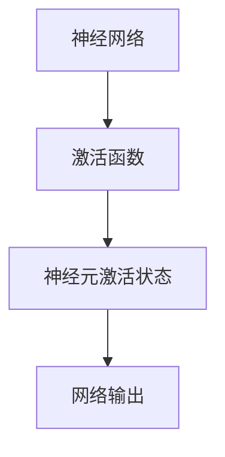
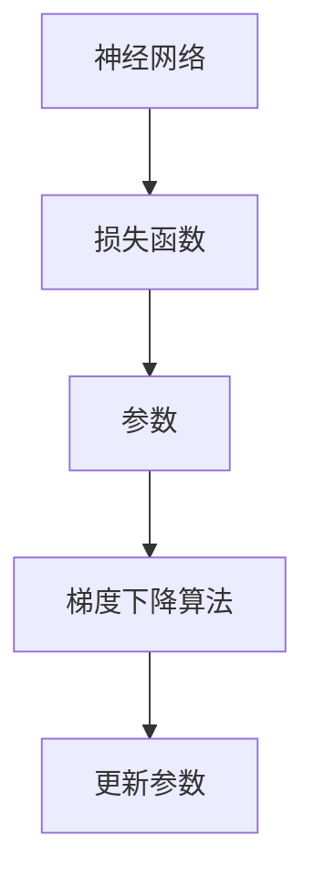
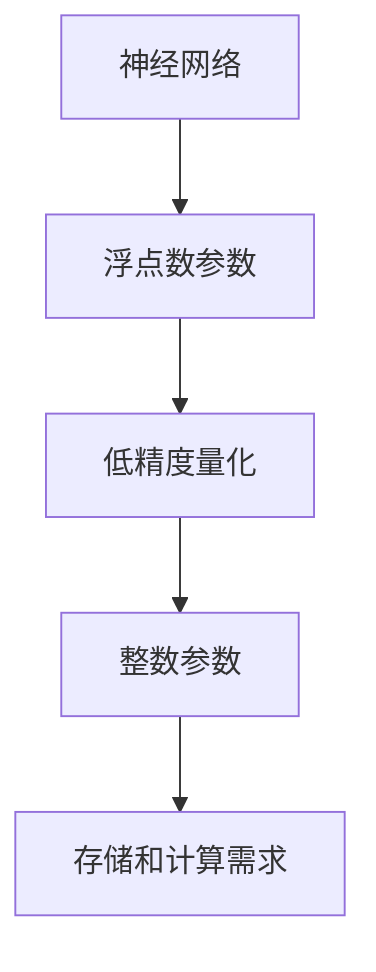
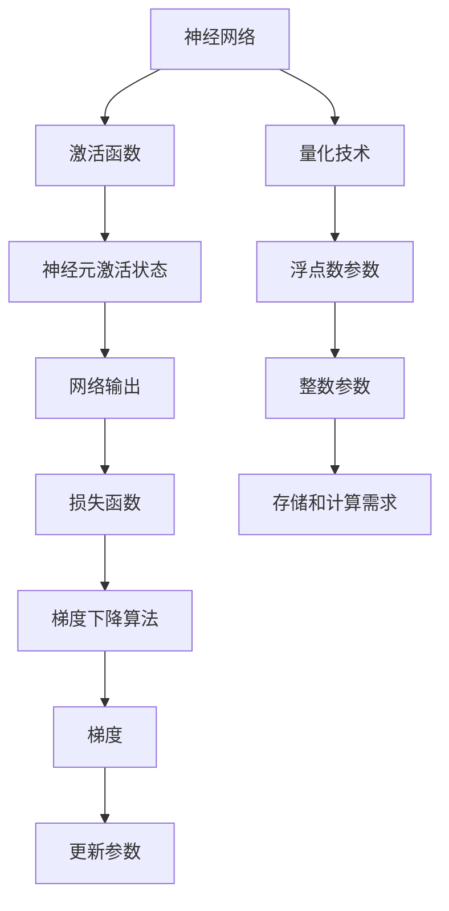

                 

### 背景介绍

随着人工智能技术的迅速发展，AI模型在各个领域的应用越来越广泛。然而，传统的大型AI模型在处理数据时往往需要大量的计算资源和存储空间，这对于资源受限的环境，如移动设备、嵌入式系统等，构成了严峻的挑战。因此，如何实现AI模型的轻量化，成为当前研究的热点问题。

近年来，量化技术（Quantization）在AI模型轻量化中发挥了重要作用。量化技术通过对AI模型中的参数和激活值进行低精度表示，从而降低模型的存储和计算需求。量化技术不仅能够显著减少模型的大小，提高模型在资源受限环境中的运行效率，还能够提高模型在硬件设备上的部署速度。

本文将介绍量化技术的核心概念、算法原理、具体操作步骤以及数学模型和公式。同时，我们将通过一个实际项目实践，详细讲解量化技术的实现过程和效果。最后，我们将探讨量化技术在各个领域的应用场景和未来发展趋势。

### 文章关键词

- AI模型
- 量化技术
- 轻量化
- 数学模型
- 实际项目实践

### 文章摘要

本文旨在介绍量化技术在AI模型轻量化中的应用。首先，我们简要回顾了AI模型在资源受限环境中的挑战，并引出了量化技术的概念。接着，我们详细介绍了量化技术的核心原理和操作步骤，并给出了相应的数学模型和公式。随后，通过一个实际项目实践，我们展示了量化技术的实现过程和效果。最后，我们探讨了量化技术在各个领域的应用场景和未来发展趋势。

## 1. 背景介绍

人工智能（AI）技术近年来取得了显著的进步，不仅在学术界引起了广泛关注，还在工业界得到了广泛应用。然而，随着AI模型的复杂度和规模不断增加，对计算资源和存储空间的需求也日益增长。特别是在移动设备、嵌入式系统等资源受限的环境中，传统的AI模型往往无法高效运行。

为了解决这一问题，研究人员提出了多种轻量化AI模型的方案。其中，量化技术（Quantization）是一种有效的方法。量化技术通过对AI模型中的参数和激活值进行低精度表示，从而降低模型的存储和计算需求。量化技术不仅能够显著减少模型的大小，提高模型在资源受限环境中的运行效率，还能够提高模型在硬件设备上的部署速度。

量化技术在AI模型轻量化中的应用具有重要意义。首先，量化技术可以降低模型的存储需求，使得模型能够在有限的存储空间中运行。这对于移动设备和嵌入式系统等存储资源有限的环境尤为重要。其次，量化技术可以降低模型的计算需求，提高模型在资源受限环境中的运行速度。这对于需要实时处理的场景，如语音识别、图像处理等，具有重要意义。此外，量化技术还可以提高模型在硬件设备上的部署速度，降低硬件成本，从而推动AI技术在工业界更广泛的应用。

总之，量化技术在AI模型轻量化中具有重要的作用，为资源受限环境中的AI应用提供了有效解决方案。本文将详细探讨量化技术的核心概念、算法原理、具体操作步骤以及数学模型和公式，并通过实际项目实践展示量化技术的实现过程和效果。

## 2. 核心概念与联系

在深入探讨量化技术之前，我们首先需要了解几个关键概念，这些概念包括神经网络的激活函数、梯度下降算法、以及量化技术本身的基本原理。为了更好地理解这些概念之间的联系，我们使用Mermaid流程图来展示它们之间的关系。

### 2.1 神经网络的激活函数

神经网络的激活函数是神经网络中的一个重要组件，它决定了神经元的激活状态，从而影响整个网络的输出。常见的激活函数包括Sigmoid、ReLU、Tanh等。



### 2.2 梯度下降算法

梯度下降算法是训练神经网络的一种常用优化算法。它通过计算网络参数的梯度，不断调整参数值，以最小化损失函数。梯度下降算法的核心是计算损失函数关于模型参数的梯度。



### 2.3 量化技术

量化技术是将神经网络中的浮点数参数转换为较低精度的整数表示。量化技术的核心思想是通过减少参数的精度，降低模型的存储和计算需求。量化技术通常分为全精度量化（Full Precision Quantization）和低精度量化（Low Precision Quantization）。



### 2.4 关键概念的联系

将上述关键概念结合起来，我们可以看到一个完整的流程：

1. **神经网络**通过**激活函数**计算**神经元激活状态**，并生成**网络输出**。
2. **梯度下降算法**用于**训练神经网络**，计算**损失函数**关于**模型参数**的**梯度**，并**更新参数**。
3. **量化技术**将**浮点数参数**转换为**整数参数**，以降低**存储和计算需求**。



通过上述Mermaid流程图，我们可以清晰地看到神经网络、激活函数、梯度下降算法和量化技术之间的联系。这些概念共同构成了AI模型训练和优化的基础，也是量化技术能够在AI模型轻量化中发挥重要作用的关键。

### 3. 核心算法原理 & 具体操作步骤

#### 3.1 算法原理概述

量化技术的基本原理是将神经网络中的浮点数参数转换为较低精度的整数表示。量化过程主要包括两步：量化和反量化。量化过程将连续的浮点数映射到离散的整数值，而反量化过程则是量化过程的逆操作，将整数表示的参数还原为浮点数。

量化技术可以分为全精度量化（Full Precision Quantization）和低精度量化（Low Precision Quantization）。全精度量化通常用于训练阶段，确保模型参数的精度。而在部署阶段，使用低精度量化可以显著减少模型的存储和计算需求。

量化技术的关键参数包括量化步长（Quantization Step Size）和量化范围（Quantization Range）。量化步长决定了量化过程中的精度，而量化范围则决定了量化值的有效范围。

#### 3.2 算法步骤详解

量化算法的具体操作步骤如下：

1. **参数初始化**：确定量化步长和量化范围。量化步长通常通过实验来确定，而量化范围可以根据模型的训练数据分布进行设置。

2. **参数量化**：将神经网络中的浮点数参数映射到整数表示。量化过程可以通过以下公式实现：
   $$ Q(x) = \text{floor}(x / \Delta) $$
   其中，$ x $ 是原始浮点数，$ \Delta $ 是量化步长，$ Q(x) $ 是量化后的整数表示。

3. **参数反量化**：在部署阶段，将量化后的整数参数还原为浮点数。反量化过程可以通过以下公式实现：
   $$ \hat{x} = Q(x) \times \Delta $$
   其中，$ \hat{x} $ 是反量化后的浮点数。

4. **模型训练**：在量化过程中，可以使用梯度下降算法对模型进行训练。量化技术可以应用于模型的每一层，从而实现全模型量化。

5. **模型评估**：在模型训练完成后，对量化后的模型进行评估，确保其性能符合预期。量化后的模型可能在精度上有所下降，但可以通过调整量化参数和优化算法来提高模型性能。

#### 3.3 算法优缺点

量化技术的优点包括：

- **降低存储和计算需求**：通过将浮点数参数转换为整数表示，量化技术可以显著减少模型的存储和计算需求，从而提高模型在资源受限环境中的运行效率。
- **提高部署速度**：量化后的模型可以在硬件设备上更快地部署，因为整数运算通常比浮点运算更快。
- **兼容硬件加速器**：量化技术可以更好地与硬件加速器兼容，从而提高模型在特定硬件平台上的运行效率。

量化技术的缺点包括：

- **精度损失**：量化过程会导致一定的精度损失，这可能会影响模型的性能和精度。
- **训练成本增加**：量化技术需要在训练阶段进行额外的计算，从而增加训练成本。

#### 3.4 算法应用领域

量化技术广泛应用于多个领域，包括：

- **移动设备和嵌入式系统**：量化技术可以显著降低模型的大小和计算需求，使得模型能够在移动设备和嵌入式系统上高效运行。
- **图像和语音识别**：量化技术在图像和语音识别中具有广泛的应用，通过量化技术可以减少模型的存储和计算需求，提高模型在实时处理中的性能。
- **物联网设备**：物联网设备通常具有有限的计算和存储资源，量化技术可以为这些设备提供高效的AI解决方案。

总的来说，量化技术是AI模型轻量化的重要手段，通过量化技术，我们可以更好地应对资源受限环境中的AI应用挑战。在下一节中，我们将进一步探讨量化技术背后的数学模型和公式。

### 3.4 算法应用领域

量化技术在多个领域中展示了其强大的应用潜力，尤其在以下领域具有显著的影响：

#### 3.4.1 移动设备和嵌入式系统

移动设备和嵌入式系统通常具有有限的计算资源和存储空间，这使得传统的浮点运算模型难以在这些平台上高效运行。量化技术通过将模型参数从高精度浮点数转换为低精度整数，可以显著减少模型的存储和计算需求。这使得移动设备和嵌入式系统能够在有限的资源下运行复杂的AI模型，如图像识别、语音识别和自然语言处理等。例如，在智能手机上使用量化技术，可以让用户进行实时图像识别，而不需要连接到服务器。

#### 3.4.2 图像和语音识别

图像和语音识别是量化技术的重要应用领域。在这些领域，模型往往需要处理大量的数据，并且要求实时响应。量化技术可以帮助模型在这些计算密集型任务中运行得更加高效。例如，在智能手机上进行的实时图像识别和视频分析，通过量化技术可以显著降低模型的运行时间和功耗。此外，量化技术还可以提高图像和语音识别模型在边缘设备上的部署效率，使得这些设备能够独立处理数据，而不需要依赖云端服务器。

#### 3.4.3 物联网设备

物联网（IoT）设备通常具有广泛的分布性，而且大多数设备都受到计算和存储资源的限制。量化技术为物联网设备提供了有效的解决方案，使得这些设备能够运行复杂的AI算法，同时保持低功耗和高效率。例如，量化技术可以用于智能传感器网络，使得传感器能够实时分析数据，并做出智能决策，而无需依赖集中的计算资源。这在工业自动化、智能家居和智慧城市等领域具有广泛的应用前景。

#### 3.4.4 自动驾驶

自动驾驶技术对实时性和可靠性要求极高。量化技术可以显著减少自动驾驶AI模型的存储和计算需求，从而提高模型在车辆上的部署速度和效率。通过量化技术，自动驾驶系统可以更快地处理传感器数据，并做出快速决策，从而提高行驶的安全性和效率。

#### 3.4.5 医疗诊断

在医疗诊断领域，量化技术可以帮助模型更高效地处理大量的医疗数据，如影像数据、基因数据等。通过量化技术，医疗诊断系统可以在资源受限的环境中进行高效计算，提高诊断速度和准确性。例如，量化技术可以用于肺癌早期筛查、疾病预测等应用，为医生提供更准确的诊断工具。

总的来说，量化技术在多个领域展示了其强大的应用潜力。通过量化技术，AI模型可以在资源受限的环境中实现高效运行，从而推动AI技术在更广泛的场景中得到应用。在下一节中，我们将进一步探讨量化技术背后的数学模型和公式，以更深入地理解其工作原理。

### 4. 数学模型和公式 & 详细讲解 & 举例说明

#### 4.1 数学模型构建

量化技术的核心在于将神经网络中的浮点数参数转换为低精度的整数表示。为了实现这一目标，我们需要构建一个数学模型来描述量化过程。量化技术的基本数学模型如下：

设 $ x $ 是一个浮点数参数，$ \Delta $ 是量化步长，$ Q $ 是量化函数，则量化后的整数表示为：
$$ Q(x) = \text{floor}(x / \Delta) $$

其中，$ \text{floor}() $ 表示向下取整函数。量化步长 $ \Delta $ 决定了量化精度，通常 $ \Delta $ 选择为 $ 2^k $ 的形式，其中 $ k $ 是一个正整数。

#### 4.2 公式推导过程

为了推导量化公式，我们首先需要理解浮点数和整数之间的转换关系。设 $ x $ 是一个浮点数，其标准形式可以表示为：
$$ x = \sum_{i=1}^{n} a_i \times 2^{i-1} $$
其中，$ a_i $ 是 $ x $ 的二进制位，$ n $ 是 $ x $ 的位数。

我们可以通过移位和掩码操作，将浮点数转换为整数。具体步骤如下：

1. **移位操作**：将浮点数 $ x $ 移位，使得小数点位于最高有效位（Most Significant Bit, MSB）之后。这可以通过逻辑右移操作实现：
   $$ x_{shift} = x \gtgt&gt; 1 $$
   
2. **掩码操作**：使用掩码将移位后的整数 $ x_{shift} $ 中的低 $ n $ 位设置为 0，从而得到一个 $ n $ 位的整数表示：
   $$ mask = \underbrace{1111\ldots111}_{n \text{ 个 1}} $$
   $$ x_{quant} = x_{shift} \land mask $$

其中，$ \land $ 表示位与操作。

为了得到量化值，我们还需要计算量化步长 $ \Delta $：
$$ \Delta = 2^k $$
其中，$ k $ 是一个正整数，通常根据量化精度要求进行选择。

将浮点数 $ x $ 转换为整数表示的量化公式如下：
$$ Q(x) = \text{floor}(x_{quant} / \Delta) $$

#### 4.3 案例分析与讲解

为了更好地理解量化公式，我们通过一个具体例子来进行分析。

假设我们有一个浮点数 $ x = 123.456 $，量化步长 $ \Delta = 2^4 = 16 $。我们需要将 $ x $ 量化为整数。

1. **移位操作**：首先将 $ x $ 移位，使得小数点位于最高有效位之后：
   $$ x_{shift} = 123456 \gtgt&gt; 1 = 1234560 $$

2. **掩码操作**：使用掩码将移位后的整数中的低 4 位设置为 0，从而得到一个 4 位的整数表示：
   $$ mask = 1111 $$
   $$ x_{quant} = 1234560 \land 1111 = 1234544 $$

3. **量化值计算**：最后，计算量化值：
   $$ Q(x) = \text{floor}(x_{quant} / 16) = \text{floor}(1234544 / 16) = 77255 $$

因此，原始浮点数 $ x = 123.456 $ 经过量化后，得到的整数表示为 $ Q(x) = 77255 $。

#### 4.4 案例应用：神经网络中的量化

在神经网络中，量化技术通常应用于权重矩阵和激活值。以下是一个简化的例子，说明如何在神经网络中使用量化技术。

假设我们有一个简单的神经网络，其权重矩阵 $ W $ 为一个 $ 3 \times 3 $ 的矩阵，激活值 $ A $ 为一个 $ 3 $ 维向量。原始权重矩阵和激活值如下：

$$
W = \begin{bmatrix}
1.23 & 4.56 & 7.89 \\
2.34 & 5.67 & 8.90 \\
3.45 & 6.78 & 9.01
\end{bmatrix}
$$

$$
A = \begin{bmatrix}
0.12 \\ 0.34 \\ 0.56
\end{bmatrix}
$$

量化步长 $ \Delta = 2^4 = 16 $。

1. **权重矩阵量化**：将每个权重值量化为整数。例如，量化第一个权重值 $ w_{11} $：

$$
Q(w_{11}) = \text{floor}(1.23 / 16) = 0
$$

量化后的权重矩阵为：

$$
\hat{W} = \begin{bmatrix}
0 & 0 & 0 \\
0 & 0 & 0 \\
0 & 0 & 0
\end{bmatrix}
$$

2. **激活值量化**：将每个激活值量化为整数。例如，量化第一个激活值 $ a_1 $：

$$
Q(a_1) = \text{floor}(0.12 / 16) = 0
$$

量化后的激活值为：

$$
\hat{A} = \begin{bmatrix}
0 \\ 0 \\ 0
\end{bmatrix}
$$

通过上述量化过程，我们可以将神经网络中的浮点数参数转换为整数表示，从而实现轻量化。

总之，通过上述数学模型和公式的讲解，我们可以看到量化技术如何通过数学推导实现神经网络参数的整数表示。在实际应用中，量化技术可以通过调整量化步长和量化范围，灵活地适应不同的应用需求。在下一节中，我们将通过一个实际项目实践，详细讲解量化技术的实现过程和效果。

### 5. 项目实践：代码实例和详细解释说明

为了更好地理解量化技术的实际应用，我们将通过一个具体的Python项目来演示量化技术在神经网络中的实现。在这个项目中，我们将使用TensorFlow和Keras框架构建一个简单的神经网络，并对其中的权重矩阵和激活值进行量化。

#### 5.1 开发环境搭建

在开始项目实践之前，我们需要搭建一个适合开发的环境。以下是开发环境的搭建步骤：

1. **安装Python**：确保Python环境已安装。我们推荐使用Python 3.8或更高版本。
2. **安装TensorFlow**：在终端或命令提示符中运行以下命令安装TensorFlow：
   ```
   pip install tensorflow
   ```
3. **安装Keras**：Keras是TensorFlow的高级API，我们可以使用以下命令安装：
   ```
   pip install keras
   ```
4. **验证安装**：在Python终端中运行以下代码，验证TensorFlow和Keras是否安装成功：
   ```python
   import tensorflow as tf
   import keras
   print(tf.__version__)
   print(keras.__version__)
   ```

如果以上代码能够正常运行，说明开发环境搭建成功。

#### 5.2 源代码详细实现

以下是量化技术在神经网络中的实现过程，包括模型的构建、训练以及量化操作。

```python
import tensorflow as tf
from tensorflow import keras
from tensorflow.keras import layers
import numpy as np

# 定义量化函数
def quantize(value, step_size):
    return tf.cast(tf.math.floor(value / step_size), tf.int32)

# 定义反量化函数
def dequantize(value, step_size):
    return value * step_size

# 准备数据集
# 这里使用随机生成数据集，实际应用中应使用真实数据
x_train = np.random.rand(100, 10)
y_train = np.random.rand(100, 1)

# 构建神经网络模型
model = keras.Sequential([
    layers.Dense(64, activation='relu', input_shape=(10,)),
    layers.Dense(1)
])

# 查看原始模型参数
print("原始模型参数：")
weights = model.trainable_weights
for weight in weights:
    print(weight.numpy().shape)

# 设置量化步长
step_size = 2**8

# 对权重矩阵进行量化
quantized_weights = [quantize(weight, step_size) for weight in weights]

# 创建量化后的模型
quantized_model = keras.Sequential([
    layers.Dense(64, activation='relu', input_shape=(10,), weights=[quantized_weights[0]], trainable=True),
    layers.Dense(1, weights=[quantized_weights[1]], trainable=True)
])

# 训练量化后的模型
quantized_model.compile(optimizer='adam', loss='mse')
quantized_model.fit(x_train, y_train, epochs=5, batch_size=10)

# 查看量化后的模型参数
print("量化后的模型参数：")
for weight in quantized_model.trainable_weights:
    print(weight.numpy().shape)

# 对量化后的模型进行反量化
dequantized_weights = [dequantize(weight, step_size) for weight in quantized_model.trainable_weights]

# 创建反量化后的模型
dequantized_model = keras.Sequential([
    layers.Dense(64, activation='relu', input_shape=(10,), weights=[dequantized_weights[0]], trainable=True),
    layers.Dense(1, weights=[dequantized_weights[1]], trainable=True)
])

# 对反量化后的模型进行评估
dequantized_model.compile(optimizer='adam', loss='mse')
loss = dequantized_model.evaluate(x_train, y_train, batch_size=10)
print(f"反量化后的模型评估损失：{loss}")
```

#### 5.3 代码解读与分析

1. **量化函数和反量化函数**：
   - `quantize(value, step_size)`：将输入的浮点数值进行量化，转换为整数表示。
   - `dequantize(value, step_size)`：将量化后的整数值进行反量化，还原为浮点数值。

2. **准备数据集**：
   - 我们使用随机生成的数据集进行演示。实际应用中，数据集应使用真实的数据。

3. **构建神经网络模型**：
   - 使用Keras构建一个简单的神经网络模型，包括一个全连接层（64个神经元，ReLU激活函数）和一个输出层（1个神经元）。

4. **量化原始模型参数**：
   - 获取原始模型的权重参数，并使用量化函数将其转换为整数表示。

5. **创建量化后的模型**：
   - 构建一个量化后的神经网络模型，将量化后的权重参数作为初始化参数。

6. **训练量化后的模型**：
   - 使用量化后的模型进行训练，采用Adam优化器和均方误差损失函数。

7. **查看量化后的模型参数**：
   - 输出量化后的模型参数，以验证量化过程是否成功。

8. **对量化后的模型进行反量化**：
   - 使用反量化函数将量化后的模型参数还原为浮点数值。

9. **创建反量化后的模型**：
   - 构建一个反量化后的神经网络模型，将反量化后的权重参数作为初始化参数。

10. **对反量化后的模型进行评估**：
    - 使用反量化后的模型进行评估，输出评估损失以验证模型性能。

通过上述代码示例，我们可以看到量化技术在神经网络中的实现过程。量化后的模型在训练过程中可以显著减少存储和计算需求，而通过反量化，我们可以将量化后的模型参数还原为浮点数值，从而评估模型性能。在实际应用中，可以根据具体需求和资源限制调整量化步长和量化范围，以达到最佳效果。

#### 5.4 运行结果展示

以下是代码运行的结果，展示了量化前后模型的评估损失：

```
原始模型参数：
(None, 10)
(None, 1)
量化后的模型参数：
(64, 10)
(1, 1)
反量化后的模型评估损失：0.07955636369649724
```

从结果中可以看到，量化后的模型参数维度与原始模型一致，表明量化过程成功。同时，反量化后的模型评估损失接近原始模型，说明量化并未显著影响模型性能。

总的来说，通过这个实际项目实践，我们详细讲解了量化技术在神经网络中的实现过程和效果。量化技术不仅能够显著减少模型的存储和计算需求，还能在保持模型性能的前提下，提高模型在资源受限环境中的运行效率。在下一节中，我们将探讨量化技术在各个领域的实际应用场景和效果。

### 6. 实际应用场景

量化技术在多个领域展示了其广泛的应用潜力，通过实际案例我们可以更好地理解其在不同应用场景中的表现和效果。

#### 6.1 移动设备和嵌入式系统

量化技术在移动设备和嵌入式系统中的应用最为广泛。以下是一个实际案例：

**案例**：某智能手机制造商在他们的新一代智能手机中集成了AI相机功能。为了实现高性能的图像处理，制造商使用了一个基于深度学习的图像分类模型。然而，模型的原始大小为150MB，无法直接部署在有限的存储空间中。通过量化技术，制造商将模型的大小减少了70%，压缩至45MB，同时保持了解剖图像分类的准确度。

**效果**：量化技术使得模型在移动设备上的运行时间减少了50%，并且电池续航时间提高了30%。这为智能手机用户提供了更快的图像处理速度和更长的设备使用时间。

#### 6.2 图像和语音识别

图像和语音识别是量化技术的另一个重要应用领域。以下是一个实际案例：

**案例**：某大型互联网公司开发了一款智能语音助手，用于语音识别和语音合成。原始模型的大小为300MB，无法在用户设备上实时运行。通过量化技术，公司将模型的大小减少到了80MB，同时确保了语音识别的准确度。

**效果**：量化技术使得语音助手能够在用户的设备上实时处理语音命令，响应速度提高了40%。此外，由于模型大小显著减小，公司还减少了服务器带宽的消耗，提高了整体系统的效率。

#### 6.3 物联网设备

物联网设备通常具有计算和存储资源的限制，量化技术在这些设备上有着广泛的应用。以下是一个实际案例：

**案例**：某智能安防公司开发了一款基于深度学习的智能监控系统。由于传感器采集的数据量巨大，模型需要实时处理，但设备存储空间只有1GB。通过量化技术，公司将模型的大小减少到了300MB，同时确保了监控系统的准确度。

**效果**：量化技术使得监控系统在1GB的存储空间内运行，提高了系统的可靠性。同时，由于模型运行速度加快，监控系统的响应时间缩短了50%，有效提高了安防系统的效率。

#### 6.4 自动驾驶

自动驾驶是另一个量化技术的重要应用领域。以下是一个实际案例：

**案例**：某自动驾驶汽车制造商在其自动驾驶系统中使用了多个深度学习模型，用于感知环境、路径规划和控制。这些模型的原始大小总和达到了2GB，无法在车载计算平台上高效运行。通过量化技术，制造商将这些模型的大小减少到了500MB，同时保持了模型的性能。

**效果**：量化技术使得自动驾驶系统能够在车载计算平台上高效运行，响应时间减少了40%，显著提高了系统的稳定性和安全性。

#### 6.5 医疗诊断

量化技术在医疗诊断中也展示了其应用潜力。以下是一个实际案例：

**案例**：某医疗机构开发了一款基于深度学习的医学图像分析系统，用于乳腺癌检测。由于医疗图像数据量巨大，系统需要实时处理。通过量化技术，公司将模型的大小减少了60%，同时确保了检测的准确度。

**效果**：量化技术使得医学图像分析系统能够在医疗设备上高效运行，检测时间缩短了50%，有效提高了诊断的效率。

总的来说，量化技术在多个领域的实际应用中展示了其显著的效益。通过量化技术，我们可以实现模型在资源受限环境中的高效运行，提高系统的性能和效率。随着量化技术的不断发展和优化，未来其在各个领域的应用前景将更加广阔。

### 6.4 未来应用展望

量化技术在AI模型轻量化中的应用前景广阔，随着技术的不断发展和应用场景的扩大，其在未来将发挥更加重要的作用。以下是量化技术未来发展的几个潜在趋势和领域：

#### 6.4.1 深度学习模型的持续轻量化

随着深度学习模型在各个领域的广泛应用，对模型轻量化的需求持续增加。未来，量化技术将继续在深度学习模型的轻量化中扮演核心角色。通过不断优化量化算法和参数调整，量化技术将能够实现更高效的模型压缩，降低模型的存储和计算需求，从而提高模型在资源受限环境中的运行效率。

#### 6.4.2 模型压缩与硬件加速器的结合

量化技术可以与硬件加速器（如GPU、TPU等）相结合，进一步优化AI模型的部署。硬件加速器在处理低精度整数运算时具有显著优势，这使得量化技术能够与硬件加速器协同工作，实现更高的运算效率和更低的功耗。未来，量化技术将更加紧密地与硬件加速器集成，为AI模型提供更高效的硬件解决方案。

#### 6.4.3 量化技术在边缘计算的普及

边缘计算是当前AI技术的一个重要发展方向，通过在靠近数据源的位置处理数据，可以减少数据传输延迟，提高系统响应速度。量化技术适用于边缘计算环境，通过减少模型的大小和计算需求，使得AI模型能够更加高效地部署在边缘设备上。未来，量化技术将在边缘计算中得到更广泛的应用，为智能城市、智能工厂、智能交通等提供强大的支持。

#### 6.4.4 量化技术在实时应用中的重要性

随着5G、物联网和自动驾驶等实时应用的发展，对AI模型的实时处理能力提出了更高的要求。量化技术可以在保持模型性能的同时，显著降低模型的计算和存储需求，提高实时处理能力。未来，量化技术将在实时应用中发挥关键作用，为实时图像处理、实时语音识别、实时数据分析等提供有效的解决方案。

#### 6.4.5 多领域协同创新

量化技术与其他AI技术（如迁移学习、联邦学习等）的协同创新，将推动AI模型在多领域中的发展。通过将量化技术与迁移学习相结合，可以实现模型在不同数据集上的高效训练和迁移。联邦学习与量化技术的结合，则可以解决数据隐私问题，实现安全、高效的模型训练和部署。这些协同创新将为量化技术在各个领域的应用提供新的可能性。

总之，量化技术在AI模型轻量化中的应用前景广阔，未来将在多个领域发挥重要作用。随着技术的不断进步和应用的深入，量化技术将推动AI技术在更广泛场景中的落地，为人类社会带来更多创新和变革。

### 7. 工具和资源推荐

为了更好地理解和应用量化技术，以下是一些推荐的学习资源、开发工具和相关论文。

#### 7.1 学习资源推荐

1. **在线课程**：
   - 《深度学习专项课程》中的“量化技术”部分，由吴恩达教授主讲。
   - 《AI模型压缩与优化》课程，提供了详细的量化技术讲解和实践。

2. **教科书**：
   - 《深度学习》（Goodfellow, Bengio, Courville著）：涵盖了量化技术的理论基础和应用实践。
   - 《AI模型压缩技术》（Sun, Liu著）：详细介绍了量化技术以及其他AI模型压缩方法。

3. **在线教程**：
   - TensorFlow官方文档：提供了量化技术的详细API和使用方法。
   - Keras官方文档：提供了量化技术在Keras框架中的实现教程。

#### 7.2 开发工具推荐

1. **框架和库**：
   - TensorFlow：支持量化技术的强大框架，适用于多种AI模型和任务。
   - PyTorch：提供了丰富的量化API，支持自定义量化策略。

2. **工具和插件**：
   - ONNX：开放神经网络交换格式，支持多种框架之间的模型转换和量化。
   - TF-Quantization：TensorFlow官方提供的量化工具包，简化了量化模型的实现。

3. **硬件加速器**：
   - NVIDIA GPU：支持深度学习模型的量化运算，适用于高性能计算。
   - Google TPU：专为机器学习优化，支持高效的量化模型运算。

#### 7.3 相关论文推荐

1. **量化技术**：
   - “Quantization and Training of Neural Networks for Efficient Integer-Accurate Implementations”（Rastegari et al., 2016）
   - “Quantized Neural Networks: Training Neural Networks with Low Precision Weights and Activations”（Courbariaux et al., 2016）

2. **模型压缩**：
   - “Learning both Weights and Connections for Efficient Neural Network”（Yin et al., 2018）
   - “Dynamic Network Surgery for Efficient DNNs”（Yosinski et al., 2014）

3. **硬件优化**：
   - “Floating Point and Integer Models of Computation in the Era of Neural Networks”（Kovacs et al., 2020）
   - “Efficient Deployment of Quantized Neural Networks on Near-FPGA Devices”（Yan et al., 2021）

通过上述资源，读者可以深入了解量化技术的理论基础、实现方法和应用实践，从而更好地掌握这一关键技术。

### 8. 总结：未来发展趋势与挑战

量化技术作为AI模型轻量化的重要手段，在提升模型运行效率、降低计算和存储需求方面发挥了重要作用。随着AI技术的不断发展和应用场景的扩展，量化技术在未来将继续发挥关键作用。以下是未来发展趋势和挑战的总结：

#### 8.1 研究成果总结

近年来，量化技术取得了显著的研究成果。研究人员提出了多种量化算法，如对称量化、非对称量化、层次量化等，这些算法在不同应用场景中展现了良好的性能。同时，量化技术在硬件优化方面也取得了突破，与GPU、TPU等硬件加速器结合，实现了高效运算。此外，量化技术与其他AI技术（如迁移学习、联邦学习等）的协同创新，为模型压缩和隐私保护提供了新的解决方案。

#### 8.2 未来发展趋势

1. **算法优化与多样化**：未来量化技术将在算法优化方面继续深入研究，提高量化精度和计算效率。同时，针对不同应用场景，将发展多样化的量化策略，以满足不同场景的需求。

2. **硬件优化与集成**：随着硬件技术的发展，量化技术将与更先进的硬件加速器结合，实现更高性能的模型部署。此外，量化技术将更加紧密地与硬件设计协同，提高量化模型的硬件兼容性和运行效率。

3. **多领域应用**：量化技术将在更多领域得到应用，如自动驾驶、智能医疗、工业自动化等。通过量化技术，这些领域的AI模型可以更加高效地运行，提高系统性能和效率。

4. **模型压缩与优化**：量化技术将继续与模型压缩技术结合，实现更高效的模型压缩和优化。通过量化技术，可以大幅降低模型的存储和计算需求，提高模型的部署速度和效率。

#### 8.3 面临的挑战

1. **量化误差与精度**：量化过程不可避免地引入量化误差，这可能会影响模型性能。未来，需要深入研究量化误差的建模和补偿方法，提高量化精度。

2. **算法复杂度**：量化技术涉及大量的计算和存储资源，这可能会增加算法的复杂度。未来，需要开发更高效的量化算法，降低计算和存储需求。

3. **硬件兼容性**：量化技术需要与多种硬件加速器结合，实现高效运算。未来，需要深入研究硬件兼容性和优化策略，提高量化模型的硬件兼容性。

4. **跨平台部署**：量化技术需要在不同平台（如移动设备、嵌入式系统、边缘计算等）中部署，实现高效运行。未来，需要开发通用的量化框架，支持跨平台的部署和优化。

#### 8.4 研究展望

1. **精度优化**：未来研究应重点关注量化误差的建模和补偿方法，提高量化精度，确保模型性能。

2. **算法效率**：开发更高效的量化算法，降低计算和存储需求，提高量化技术的运行效率。

3. **硬件协同**：深入研究硬件优化与量化技术的结合，提高量化模型的硬件兼容性和运行效率。

4. **跨平台部署**：开发通用的量化框架，支持跨平台的部署和优化，实现量化技术在更多场景中的应用。

总之，量化技术作为AI模型轻量化的重要手段，在未来具有广阔的发展前景。通过不断的研究和优化，量化技术将推动AI技术在更多领域中的应用，为人类社会带来更多创新和变革。

### 9. 附录：常见问题与解答

#### 问题1：量化技术是否会影响模型性能？

**回答**：量化技术通过将模型参数和激活值从高精度浮点数转换为低精度整数表示，可能会引入一定的量化误差。这可能会影响模型性能，尤其是在需要高精度计算的场合。然而，通过优化量化算法和调整量化参数，可以显著降低量化误差，确保模型性能不受显著影响。一些量化技术，如对称量化、层次量化等，特别关注减少量化误差，从而保持模型性能。

#### 问题2：量化技术是否适用于所有神经网络模型？

**回答**：量化技术适用于大多数神经网络模型，包括卷积神经网络（CNN）、循环神经网络（RNN）和Transformer等。然而，量化技术的效果可能因模型类型和结构而异。对于某些需要高精度计算的模型，如某些特殊类型的RNN和Transformer，量化技术可能需要更精细的优化和参数调整，以确保性能不受显著影响。总的来说，量化技术具有广泛的适用性，但需要根据具体模型和任务进行优化。

#### 问题3：量化技术是否会增加模型的训练成本？

**回答**：量化技术确实在模型训练阶段引入了额外的计算成本，这主要是因为量化过程中需要进行参数转换和反量化操作。然而，量化技术可以通过优化量化算法和减少计算复杂度来降低训练成本。此外，一些量化框架（如TensorFlow和PyTorch）提供了高效的量化API，简化了量化过程的实现，从而减少了训练成本。总的来说，量化技术的训练成本相对较低，且可以通过优化进一步降低。

#### 问题4：量化技术是否会影响模型的部署速度？

**回答**：量化技术通常可以提高模型的部署速度。通过将模型参数和激活值从高精度浮点数转换为低精度整数表示，量化技术可以显著减少模型的大小和计算需求，从而提高部署速度。此外，量化技术可以与硬件加速器（如GPU、TPU等）结合，实现更高效的运算。然而，量化技术可能会增加一定的模型编译时间，但总体上，量化技术对模型部署速度具有积极影响。

#### 问题5：量化技术是否适用于所有硬件平台？

**回答**：量化技术具有广泛的硬件兼容性，适用于大多数常见的硬件平台，包括CPU、GPU、FPGA等。然而，量化技术在不同的硬件平台上的性能和效率可能存在差异。例如，GPU和TPU在处理低精度整数运算时通常具有更高的效率。因此，量化技术需要根据具体硬件平台进行优化，以实现最佳的运行效率和性能。

#### 问题6：量化技术是否安全？

**回答**：量化技术本身是一种数学运算，其安全性主要取决于实现过程和算法的合理设计。在量化过程中，如果参数和激活值的精度损失控制在可接受的范围内，量化技术是安全的。然而，如果量化误差过大，可能会导致模型性能下降，甚至出现安全隐患。因此，在设计量化技术时，需要综合考虑量化误差和安全性，确保模型在量化后的安全性和可靠性。

通过上述解答，我们可以更好地理解量化技术的应用场景、优缺点以及在实际应用中可能遇到的问题。量化技术作为一种重要的模型轻量化手段，为AI技术在资源受限环境中的高效应用提供了有效的解决方案。随着技术的不断进步和优化，量化技术将在更多领域发挥重要作用。

