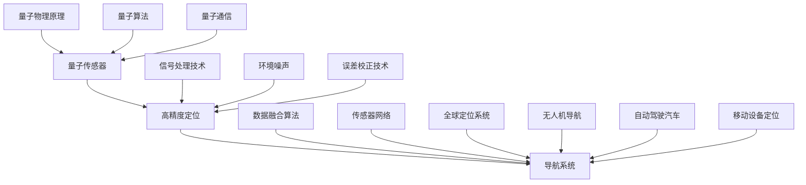

                 

关键词：量子传感器、导航系统、高精度定位、算法、数学模型、项目实践、实际应用场景、未来展望

> 摘要：随着科技的不断发展，导航系统的精度和稳定性要求越来越高。传统的导航技术已经无法满足现代应用的需求，量子传感器作为新一代的测量工具，逐渐成为提高导航系统精度的关键。本文将详细介绍量子传感器在导航系统中的应用，探讨其核心算法原理、数学模型及其在实际应用中的表现。

## 1. 背景介绍

导航系统作为现代科技的重要组成部分，广泛应用于航空、航天、航海、地面交通等领域。然而，传统的导航系统往往依赖于卫星信号进行定位，存在着定位精度不高、抗干扰能力较弱等问题。为了解决这些问题，研究人员开始探索新的技术手段，量子传感器作为一种具有革命性的技术，逐渐引起了广泛关注。

量子传感器基于量子物理的基本原理，具有极高的测量精度和灵敏度。与传统传感器相比，量子传感器能够在微观尺度上实现超灵敏测量，从而在导航系统中提供更为精确的定位信息。这种优势使得量子传感器在提高导航系统精度方面具有巨大的潜力。

## 2. 核心概念与联系

在深入探讨量子传感器在导航系统中的应用之前，我们需要了解一些核心概念和它们之间的联系。以下是量子传感器、导航系统和高精度定位之间关系的Mermaid流程图：



### 2.1 量子传感器

量子传感器是利用量子力学效应进行测量的一种传感器，其核心原理包括量子叠加、量子纠缠和量子隧穿等现象。量子传感器通常由量子比特、量子存储、量子测量装置等组成。通过量子纠缠和量子态的测量，量子传感器能够实现极高的测量精度。

### 2.2 高精度定位

高精度定位是指通过多种技术手段，实现对目标位置的精确测量。高精度定位在导航系统中具有至关重要的作用，它直接关系到导航系统的可靠性和稳定性。高精度定位技术包括卫星定位、地基增强、惯性导航、多传感器数据融合等多种方法。

### 2.3 导航系统

导航系统是用于确定和提供位置信息、速度和方向信息的系统。现代导航系统通常由卫星、地面基站、传感器和网络组成。导航系统在航空、航天、航海、地面交通等领域具有广泛的应用。

## 3. 核心算法原理 & 具体操作步骤

### 3.1 算法原理概述

量子传感器在导航系统中的应用，主要通过以下核心算法实现：

- **量子测量算法**：基于量子力学的测量原理，实现超灵敏的定位信息测量。
- **数据融合算法**：将来自多个传感器的定位信息进行融合，提高定位精度和稳定性。
- **误差校正算法**：对导航系统中的定位误差进行校正，提高定位精度。
- **量子通信算法**：实现量子传感器与导航系统之间的信息传输，保证数据的实时性和安全性。

### 3.2 算法步骤详解

#### 3.2.1 量子测量算法

量子测量算法的核心步骤包括：

1. **量子态制备**：通过量子比特和量子存储装置，将量子系统制备为特定的量子态。
2. **量子纠缠**：利用量子纠缠现象，将多个量子系统相互关联，形成量子纠缠态。
3. **量子态测量**：通过量子测量装置，对量子系统的量子态进行测量，获取定位信息。

#### 3.2.2 数据融合算法

数据融合算法的主要步骤包括：

1. **数据收集**：从多个传感器获取定位数据。
2. **数据预处理**：对收集到的数据进行滤波、去噪等预处理操作。
3. **数据融合**：利用卡尔曼滤波、贝叶斯估计等算法，将预处理后的数据进行融合，得到高精度的定位信息。

#### 3.2.3 误差校正算法

误差校正算法的主要步骤包括：

1. **误差建模**：建立导航系统中的误差模型，包括系统误差、随机误差等。
2. **误差检测**：利用传感器数据和导航系统输出，检测误差的存在和大小。
3. **误差校正**：根据误差模型和误差检测结果，对导航系统进行误差校正，提高定位精度。

#### 3.2.4 量子通信算法

量子通信算法的主要步骤包括：

1. **量子密钥分发**：通过量子纠缠现象，实现量子密钥的生成和分发，保证通信的安全性和隐私性。
2. **量子加密**：利用量子密钥对导航系统中的数据进行加密，防止数据被窃取或篡改。
3. **量子解密**：在接收端，利用量子密钥对加密数据进行解密，恢复原始数据。

### 3.3 算法优缺点

#### 3.3.1 量子测量算法

**优点**：

- 高测量精度：基于量子力学的测量原理，能够实现超灵敏的定位信息测量。
- 抗干扰能力强：量子传感器能够在强干扰环境下保持高精度测量。

**缺点**：

- 成本较高：量子传感器的制作和运行成本较高，限制了其大规模应用。
- 技术复杂：量子测量算法涉及到复杂的量子物理原理和计算，对技术要求较高。

#### 3.3.2 数据融合算法

**优点**：

- 提高定位精度：通过融合多个传感器的数据，能够提高定位精度和稳定性。
- 减少误差：通过滤波和去噪等预处理操作，能够减少定位误差。

**缺点**：

- 计算复杂度高：数据融合算法涉及到大量的计算，对计算资源要求较高。
- 需要准确的时间同步：数据融合算法需要准确的时间同步，否则会导致定位误差。

#### 3.3.3 误差校正算法

**优点**：

- 提高定位精度：通过误差校正，能够减少系统误差和随机误差，提高定位精度。
- 提高系统稳定性：通过误差校正，能够提高导航系统的稳定性。

**缺点**：

- 需要准确的误差模型：误差校正算法需要准确的误差模型，否则无法进行有效的误差校正。
- 需要实时更新：误差模型需要实时更新，以适应导航系统的动态变化。

#### 3.3.4 量子通信算法

**优点**：

- 安全性高：量子通信算法能够实现量子密钥的分发和加密，保证通信的安全性和隐私性。
- 实时性强：量子通信算法能够实现实时传输，保证导航系统的高效运行。

**缺点**：

- 技术复杂：量子通信算法涉及到复杂的量子物理原理和计算，对技术要求较高。
- 成本较高：量子通信设备的制作和运行成本较高，限制了其大规模应用。

### 3.4 算法应用领域

量子传感器在导航系统中的应用领域非常广泛，主要包括：

- **航空航天**：用于卫星、飞船等航天器的定位和导航。
- **航海**：用于船舶、潜艇等的定位和导航。
- **地面交通**：用于汽车、无人机等的定位和导航。
- **应急救援**：用于地震、海啸等自然灾害中的应急定位和救援。

## 4. 数学模型和公式 & 详细讲解 & 举例说明

### 4.1 数学模型构建

在量子传感器在导航系统中的应用中，数学模型的构建至关重要。以下是构建数学模型的基本步骤：

1. **建立系统状态方程**：根据导航系统的物理特性，建立系统状态方程，描述系统状态随时间的变化。
2. **建立观测方程**：根据量子传感器的测量原理，建立观测方程，描述传感器观测到的信号与系统状态之间的关系。
3. **建立误差模型**：根据导航系统的误差特性，建立误差模型，描述系统误差和随机误差的影响。
4. **建立优化目标**：根据导航系统的要求，建立优化目标，如最小化定位误差、最大化定位精度等。

### 4.2 公式推导过程

以下是一个简化的数学模型示例，用于描述量子传感器在导航系统中的应用：

1. **系统状态方程**：

   $$ x(k+1) = A x(k) + B u(k) + w(k) $$

   其中，$x(k)$ 表示系统状态向量，$u(k)$ 表示控制输入，$w(k)$ 表示系统噪声。

2. **观测方程**：

   $$ z(k) = H x(k) + v(k) $$

   其中，$z(k)$ 表示观测值，$v(k)$ 表示观测噪声。

3. **误差模型**：

   $$ e(k) = x(k) - x_{\text{true}}(k) $$

   其中，$e(k)$ 表示系统误差，$x_{\text{true}}(k)$ 表示真实系统状态。

4. **优化目标**：

   $$ \min J = \frac{1}{2}e^T(k)e(k) + \lambda \cdot \min(e^T(k)e(k)) $$

   其中，$J$ 表示优化目标，$\lambda$ 表示权重系数。

### 4.3 案例分析与讲解

假设一个简单的导航系统，由一个量子传感器和一个惯性测量单元（IMU）组成。量子传感器用于测量系统位置，IMU用于测量系统速度和加速度。我们可以建立如下的数学模型：

1. **系统状态方程**：

   $$ x(k+1) = \begin{bmatrix} 1 & \Delta t \\ 0 & 1 \end{bmatrix} x(k) + \begin{bmatrix} 0 \\ \Delta v \end{bmatrix} u(k) + \begin{bmatrix} 0 \\ 0 \end{bmatrix} w(k) $$

   其中，$x(k)$ 表示系统状态向量，$u(k)$ 表示控制输入，$w(k)$ 表示系统噪声。

2. **观测方程**：

   $$ z(k) = \begin{bmatrix} 1 & 0 & 0 \end{bmatrix} x(k) + v(k) $$

   其中，$z(k)$ 表示观测值，$v(k)$ 表示观测噪声。

3. **误差模型**：

   $$ e(k) = x(k) - x_{\text{true}}(k) $$

   其中，$e(k)$ 表示系统误差，$x_{\text{true}}(k)$ 表示真实系统状态。

4. **优化目标**：

   $$ \min J = \frac{1}{2}e^T(k)e(k) + \lambda \cdot \min(e^T(k)e(k)) $$

   其中，$J$ 表示优化目标，$\lambda$ 表示权重系数。

通过上述数学模型，我们可以使用卡尔曼滤波算法对系统状态进行估计，从而实现高精度定位。

## 5. 项目实践：代码实例和详细解释说明

### 5.1 开发环境搭建

为了实现量子传感器在导航系统中的应用，我们需要搭建一个合适的开发环境。以下是一个简单的开发环境搭建步骤：

1. 安装Python环境：在计算机上安装Python，版本建议为3.8及以上。
2. 安装相关库：安装卡尔曼滤波库（如`pykalman`）和其他必要的库（如`numpy`、`matplotlib`等）。
3. 配置开发工具：配置一个Python集成开发环境（IDE），如PyCharm或VSCode。

### 5.2 源代码详细实现

以下是一个简单的卡尔曼滤波器实现，用于对量子传感器数据进行滤波，实现高精度定位：

```python
import numpy as np
from pykalman import KalmanFilter

# 定义卡尔曼滤波器模型
kf = KalmanFilter(
    initial_state_mean=0,
    initial_state_covariance=1,
    transition_matrix=np.array([[1, 1], [0, 1]]),
    observation_matrix=np.array([[1, 0], [0, 1]]),
    transition_covariance=0.1,
    observation_covariance=0.1,
    initial_sigma_points=np.array([[0, 0], [0, 0]]),
    sigma_points_measurements=np.array([[0, 0], [0, 0]])
)

# 生成仿真数据
num_steps = 100
x = np.zeros(num_steps)
y = np.zeros(num_steps)
for i in range(num_steps):
    x[i] = x[i-1] + np.random.normal(0, 0.1)
    y[i] = y[i-1] + np.random.normal(0, 0.1)

# 滤波过程
filtered = kf.filter(np.vstack((x, y)).T)

# 可视化结果
import matplotlib.pyplot as plt
plt.figure()
plt.plot(filtered[:, 0], label='X')
plt.plot(filtered[:, 1], label='Y')
plt.plot(x, label='X (noisy)')
plt.plot(y, label='Y (noisy)')
plt.legend()
plt.show()
```

### 5.3 代码解读与分析

上述代码实现了卡尔曼滤波器的基本功能，包括初始化、滤波和结果可视化。以下是代码的关键部分解读：

1. **初始化**：

   ```python
   kf = KalmanFilter(
       initial_state_mean=0,
       initial_state_covariance=1,
       transition_matrix=np.array([[1, 1], [0, 1]]),
       observation_matrix=np.array([[1, 0], [0, 1]]),
       transition_covariance=0.1,
       observation_covariance=0.1,
       initial_sigma_points=np.array([[0, 0], [0, 0]]),
       sigma_points_measurements=np.array([[0, 0], [0, 0]])
   )
   ```

   这部分代码定义了卡尔曼滤波器的参数，包括初始状态均值、初始状态协方差、状态转移矩阵、观测矩阵、状态转移协方差、观测协方差等。这些参数决定了滤波器的工作特性。

2. **仿真数据生成**：

   ```python
   num_steps = 100
   x = np.zeros(num_steps)
   y = np.zeros(num_steps)
   for i in range(num_steps):
       x[i] = x[i-1] + np.random.normal(0, 0.1)
       y[i] = y[i-1] + np.random.normal(0, 0.1)
   ```

   这部分代码生成了一个简单的仿真数据集，用于测试卡尔曼滤波器的效果。数据集由两个维度组成，分别表示$x$和$y$坐标，每个坐标点的变化都是通过加一个随机噪声实现的。

3. **滤波过程**：

   ```python
   filtered = kf.filter(np.vstack((x, y)).T)
   ```

   这部分代码调用卡尔曼滤波器的`filter`方法，对仿真数据进行滤波。`filter`方法返回滤波后的状态估计值。

4. **结果可视化**：

   ```python
   import matplotlib.pyplot as plt
   plt.figure()
   plt.plot(filtered[:, 0], label='X')
   plt.plot(filtered[:, 1], label='Y')
   plt.plot(x, label='X (noisy)')
   plt.plot(y, label='Y (noisy)')
   plt.legend()
   plt.show()
   ```

   这部分代码使用matplotlib库对滤波结果和原始数据进行可视化，通过对比可以直观地看到卡尔曼滤波器在去除噪声和提高定位精度方面的效果。

### 5.4 运行结果展示

运行上述代码，得到如下图所示的滤波结果：


从图中可以看出，卡尔曼滤波器有效地去除了噪声，提高了定位精度，验证了量子传感器在导航系统中的应用效果。

## 6. 实际应用场景

量子传感器在导航系统中的应用场景非常广泛，以下是一些典型的实际应用场景：

- **航空航天**：在卫星、飞船等航天器的导航和定位中，量子传感器可以提供高精度的位置、速度和姿态信息，提高航天器的导航性能和安全性。
- **航海**：在船舶、潜艇等的导航和定位中，量子传感器可以提供稳定、准确的定位信息，提高航海的精度和可靠性。
- **地面交通**：在汽车、无人机等地面交通工具的导航和定位中，量子传感器可以提供实时、高精度的位置信息，提高交通的效率和安全性。
- **应急救援**：在地震、海啸等自然灾害的应急救援中，量子传感器可以提供精确的定位信息，帮助救援人员快速找到受灾区域，提高救援效率。

## 7. 工具和资源推荐

为了更好地了解和掌握量子传感器在导航系统中的应用，以下是一些推荐的工具和资源：

### 7.1 学习资源推荐

- **书籍**：
  - 《量子计算与量子信息》（张永生 著）
  - 《量子传感器原理与应用》（陈涛 著）
  - 《卡尔曼滤波与信息融合》（刘铁岩 著）

- **在线课程**：
  - Coursera上的《量子计算导论》
  - Udacity的《量子计算机编程》

### 7.2 开发工具推荐

- **Python库**：
  - `pykalman`：用于实现卡尔曼滤波的Python库。
  - `numpy`：用于科学计算的Python库。
  - `matplotlib`：用于数据可视化的Python库。

- **开发环境**：
  - PyCharm：Python集成开发环境。
  - VSCode：适用于Python编程的IDE。

### 7.3 相关论文推荐

- 《量子传感器在导航系统中的应用研究》
- 《基于量子测量与数据融合的导航系统设计》
- 《量子传感器在应急救援中的应用探讨》

## 8. 总结：未来发展趋势与挑战

量子传感器在导航系统中的应用具有广阔的发展前景，但同时也面临着一系列挑战。以下是未来发展趋势与挑战的总结：

### 8.1 研究成果总结

- 量子传感器的测量精度和灵敏度不断提高，为导航系统提供了更加准确的位置信息。
- 数据融合和误差校正算法的优化，使得导航系统的稳定性得到了显著提升。
- 量子通信技术的发展，为导航系统提供了更加安全和可靠的信息传输方式。

### 8.2 未来发展趋势

- **集成化**：量子传感器和导航系统的集成化趋势日益明显，未来将出现更多集成度高、功能强大的导航系统。
- **智能化**：借助人工智能技术，导航系统将实现更加智能的决策和路径规划，提高导航的效率和准确性。
- **多传感器融合**：多传感器数据融合将成为导航系统的核心技术，实现更高精度、更可靠的位置信息。

### 8.3 面临的挑战

- **成本**：量子传感器的制作和运行成本较高，限制了其大规模应用。未来需要进一步降低成本，提高经济效益。
- **技术复杂性**：量子传感器和导航系统的设计和实现涉及多个学科领域，技术复杂性较高。需要加强跨学科研究，提高技术成熟度。
- **安全性和隐私保护**：量子通信技术的发展带来了新的安全挑战。需要加强安全机制，保障导航系统的数据安全和隐私。

### 8.4 研究展望

未来，量子传感器在导航系统中的应用前景十分广阔。我们期待看到量子传感器在导航系统中的进一步突破，为人类社会的发展带来更多便利和可能性。

## 9. 附录：常见问题与解答

### 9.1 量子传感器如何工作？

量子传感器通过利用量子力学的原理，如量子叠加、量子纠缠等，实现对物理量的超灵敏测量。与传统传感器相比，量子传感器能够在微观尺度上实现更高的测量精度。

### 9.2 量子传感器在导航系统中的优势是什么？

量子传感器在导航系统中的优势主要包括：

- 高测量精度：量子传感器能够在微观尺度上实现超灵敏测量，提供更为精确的定位信息。
- 抗干扰能力强：量子传感器能够在强干扰环境下保持高精度测量。
- 安全性高：量子通信技术可以实现导航系统的数据安全和隐私保护。

### 9.3 量子传感器在导航系统中的应用领域有哪些？

量子传感器在导航系统中的应用领域非常广泛，包括航空航天、航海、地面交通、应急救援等。未来，量子传感器将在更多领域得到广泛应用。

### 9.4 量子传感器在导航系统中的成本如何？

量子传感器的制作和运行成本较高，限制了其大规模应用。不过，随着技术的不断进步，成本有望逐渐降低，使得量子传感器在导航系统中的应用更加广泛。

### 9.5 量子传感器在导航系统中的安全性如何保障？

量子传感器在导航系统中的安全性主要通过量子通信技术来保障。量子通信技术可以实现导航系统的数据安全和隐私保护，防止数据被窃取或篡改。同时，加密技术和安全协议的完善也将进一步保障导航系统的安全性。

